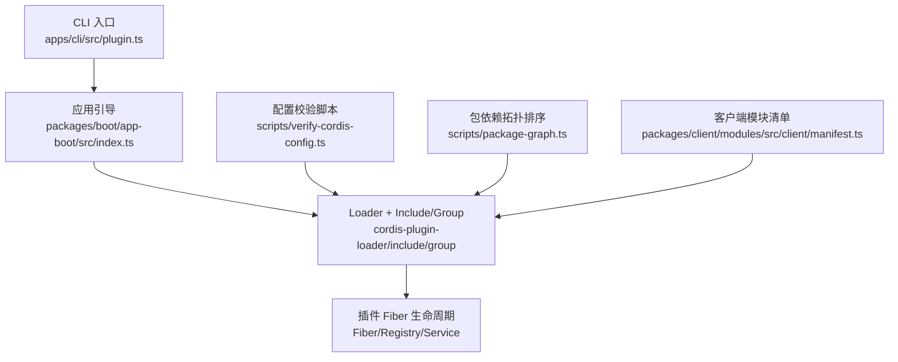
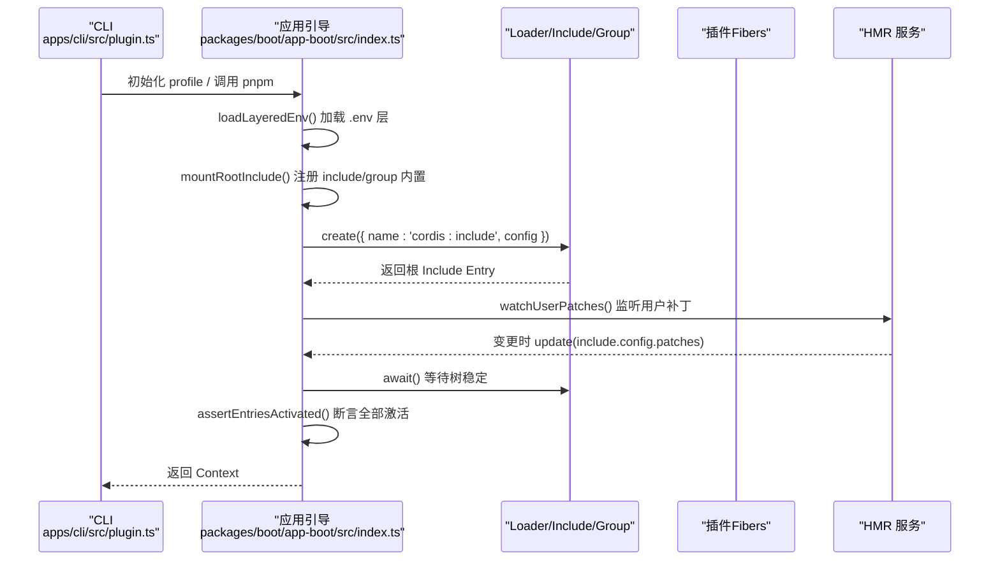
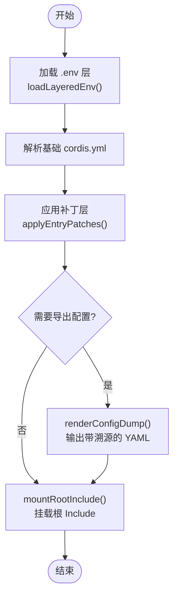
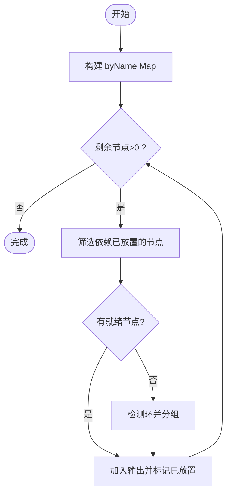
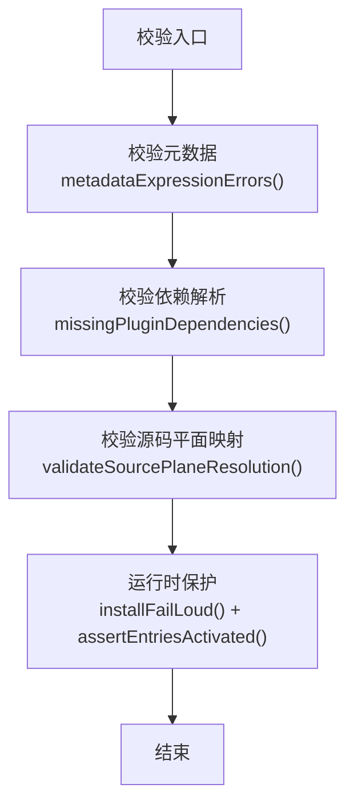
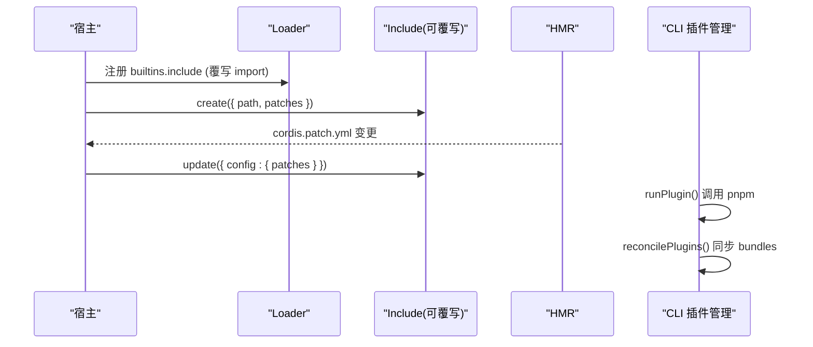
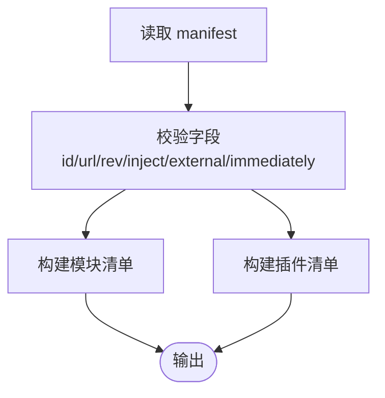
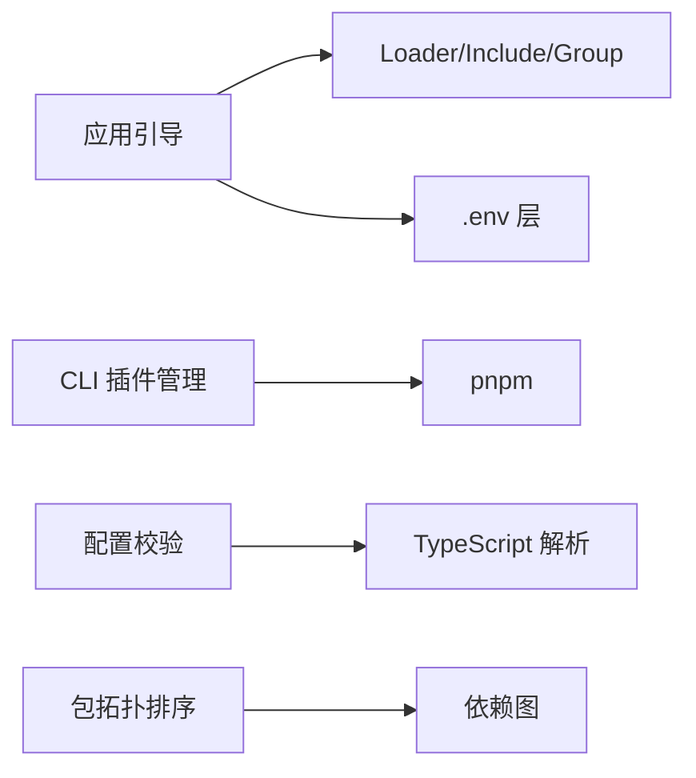

# 插件加载机制

<cite>
**本文引用的文件**
- [packages/boot/app-boot/src/index.ts](file://packages/boot/app-boot/src/index.ts)
- [apps/cli/src/plugin.ts](file://apps/cli/src/plugin.ts)
- [scripts/verify-cordis-config.ts](file://scripts/verify-cordis-config.ts)
- [scripts/package-graph.ts](file://scripts/package-graph.ts)
- [docs/cordis-primer.md](file://docs/cordis-primer.md)
- [docs/cordis-api/fiber.md](file://docs/cordis-api/fiber.md)
- [docs/cordis-api/registry.md](file://docs/cordis-api/registry.md)
- [docs/cordis-api/service.md](file://docs/cordis-api/service.md)
- [docs/user/develop/framework/index.md](file://docs/user/develop/framework/index.md)
- [docs/cordis-tutorial/03-services.md](file://docs/cordis-tutorial/03-services.md)
- [packages/client/modules/src/client/manifest.ts](file://packages/client/modules/src/client/manifest.ts)
</cite>

## 目录
1. [简介](#简介)
2. [项目结构](#项目结构)
3. [核心组件](#核心组件)
4. [架构总览](#架构总览)
5. [详细组件分析](#详细组件分析)
6. [依赖关系分析](#依赖关系分析)
7. [性能考量](#性能考量)
8. [故障排查指南](#故障排查指南)
9. [结论](#结论)
10. [附录](#附录)

## 简介
本文件系统性阐述 DeepSeek Harness 的插件加载机制，覆盖从配置发现、解析与补丁叠加，到依赖图构建、拓扑排序与动态/静态加载策略；并给出验证与错误处理方案，以及自定义加载器与扩展点的实践路径。

## 项目结构
- 启动与装配层：应用引导负责读取配置、安装失败保护、挂载根 Include 并驱动 Loader 直到整棵树稳定。
- CLI 插件管理：profile 下的包管理与 bundle 层自动对齐。
- 校验工具：对 Loader 配置元数据、插件依赖解析、源码平面映射进行静态检查。
- 文档与 API：Cordis 框架的 Fiber、Registry、Service 等概念与生命周期。
- 客户端模块清单：客户端侧的模块/插件清单校验与注入声明。

**图示来源**
- [packages/boot/app-boot/src/index.ts:772-800](file://packages/boot/app-boot/src/index.ts#L772-L800)
- [apps/cli/src/plugin.ts:120-163](file://apps/cli/src/plugin.ts#L120-L163)
- [scripts/verify-cordis-config.ts:1-120](file://scripts/verify-cordis-config.ts#L1-L120)
- [scripts/package-graph.ts:60-133](file://scripts/package-graph.ts#L60-L133)
- [packages/client/modules/src/client/manifest.ts:187-213](file://packages/client/modules/src/client/manifest.ts#L187-L213)

**章节来源**
- [packages/boot/app-boot/src/index.ts:772-800](file://packages/boot/app-boot/src/index.ts#L772-L800)
- [apps/cli/src/plugin.ts:120-163](file://apps/cli/src/plugin.ts#L120-L163)

## 核心组件
- 应用引导（boot）：创建 Context、安装 Loader、可选 prepare、挂载根 Include、等待树稳定、断言所有条目激活。
- 配置与补丁：支持 .env 分层加载、可选/强制补丁文件、YAML 表达式插值、patch 列表合并与溯源输出。
- Cordis 运行时：以 Fiber 为粒度管理插件实例，通过 inject 声明依赖，按服务可用性决定加载顺序。
- 校验与诊断：在编译/CI 阶段校验 Loader 配置元数据、插件依赖解析、源码平面映射一致性。
- 包依赖拓扑：基于包级依赖图执行拓扑排序，检测环并分组处理。
- 客户端模块清单：校验模块/插件 id/url/rev/inject/external/immediately 等字段，生成运行期清单。

**章节来源**
- [docs/cordis-primer.md:7-13](file://docs/cordis-primer.md#L7-L13)
- [docs/cordis-api/fiber.md:50-146](file://docs/cordis-api/fiber.md#L50-L146)
- [docs/cordis-api/registry.md:1-52](file://docs/cordis-api/registry.md#L1-L52)
- [docs/cordis-api/service.md:1-103](file://docs/cordis-api/service.md#L1-L103)
- [docs/user/develop/framework/index.md:7-38](file://docs/user/develop/framework/index.md#L7-L38)
- [docs/cordis-tutorial/03-services.md:59-78](file://docs/cordis-tutorial/03-services.md#L59-L78)

## 架构总览
下图展示从 CLI 到 Loader 再到插件 Fiber 的完整加载链路，包括环境加载、补丁叠加、Include 根节点、HMR 监听与最终激活断言。

**图示来源**
- [packages/boot/app-boot/src/index.ts:180-201](file://packages/boot/app-boot/src/index.ts#L180-L201)
- [packages/boot/app-boot/src/index.ts:501-544](file://packages/boot/app-boot/src/index.ts#L501-L544)
- [packages/boot/app-boot/src/index.ts:772-800](file://packages/boot/app-boot/src/index.ts#L772-L800)
- [apps/cli/src/plugin.ts:120-163](file://apps/cli/src/plugin.ts#L120-L163)

## 详细组件分析

### 配置发现与解析（含补丁叠加）
- 环境变量分层：进程继承 > 项目 .env > Harness Home .env，禁止覆盖“引导类”变量，避免影响进程启动行为。
- 补丁文件：
  - 可选补丁：不存在即无层，存在则必须可解析且为数组。
  - 强制覆盖：缺失视为误配，直接报错。
  - 相对路径插入项会锚定到补丁文件所在目录。
- 配置转储：将基础配置与各层补丁组合后输出带溯源注释的可执行 YAML，便于调试。

**图示来源**
- [packages/boot/app-boot/src/index.ts:180-201](file://packages/boot/app-boot/src/index.ts#L180-L201)
- [packages/boot/app-boot/src/index.ts:280-353](file://packages/boot/app-boot/src/index.ts#L280-L353)
- [packages/boot/app-boot/src/index.ts:394-488](file://packages/boot/app-boot/src/index.ts#L394-L488)
- [packages/boot/app-boot/src/index.ts:501-544](file://packages/boot/app-boot/src/index.ts#L501-L544)

**章节来源**
- [packages/boot/app-boot/src/index.ts:180-201](file://packages/boot/app-boot/src/index.ts#L180-L201)
- [packages/boot/app-boot/src/index.ts:280-353](file://packages/boot/app-boot/src/index.ts#L280-L353)
- [packages/boot/app-boot/src/index.ts:394-488](file://packages/boot/app-boot/src/index.ts#L394-L488)
- [packages/boot/app-boot/src/index.ts:501-544](file://packages/boot/app-boot/src/index.ts#L501-L544)

### 依赖图构建与拓扑排序（顺序控制）
- 包级依赖图：收集各包的 short 名与其依赖集合，逐轮选择“依赖已放置”的包，必要时检测并分解强连通分量以打破环。
- 排序稳定性：使用比较函数与组序保证确定性；当无可就绪节点时，定位最小环并按组序输出。
- 用途：用于构建稳定的包加载/打包顺序，避免循环依赖导致的启动失败。

**图示来源**
- [scripts/package-graph.ts:60-133](file://scripts/package-graph.ts#L60-L133)

**章节来源**
- [scripts/package-graph.ts:60-133](file://scripts/package-graph.ts#L60-L133)

### 插件验证与错误处理策略
- 配置元数据校验：仅 `disabled` 允许表达式插值，其他元数据保持静态；非法表达式或类型错误在 CI 阶段暴露。
- 依赖解析校验：
  - 应用层覆盖：CLI 示例与覆盖文件中的裸名需从 apps/cli 依赖面解析。
  - Bundle 覆盖：每个 bundle 的 patch 行需从其自身依赖解析。
  - 包内测试夹具：其 Loader 配置与相邻模块导入需声明在所属 package.json 中。
- 源码平面映射：本地包引用必须通过 tsconfig paths 解析到 .ts/.tsx 源文件，避免依赖构建产物。
- 运行时失败保护：
  - 未处理拒绝统一拦截，打印致命信息并在释放钩子完成后退出。
  - 启动后审计：断言所有启用条目已加载并处于 ACTIVE 状态，否则抛出聚合错误。

**图示来源**
- [scripts/verify-cordis-config.ts:487-542](file://scripts/verify-cordis-config.ts#L487-L542)
- [scripts/verify-cordis-config.ts:440-462](file://scripts/verify-cordis-config.ts#L440-L462)
- [scripts/verify-cordis-config.ts:398-438](file://scripts/verify-cordis-config.ts#L398-L438)
- [packages/boot/app-boot/src/index.ts:624-664](file://packages/boot/app-boot/src/index.ts#L624-L664)
- [packages/boot/app-boot/src/index.ts:707-740](file://packages/boot/app-boot/src/index.ts#L707-L740)

**章节来源**
- [scripts/verify-cordis-config.ts:487-542](file://scripts/verify-cordis-config.ts#L487-L542)
- [scripts/verify-cordis-config.ts:440-462](file://scripts/verify-cordis-config.ts#L440-L462)
- [scripts/verify-cordis-config.ts:398-438](file://scripts/verify-cordis-config.ts#L398-L438)
- [packages/boot/app-boot/src/index.ts:624-664](file://packages/boot/app-boot/src/index.ts#L624-L664)
- [packages/boot/app-boot/src/index.ts:707-740](file://packages/boot/app-boot/src/index.ts#L707-L740)

### 动态加载与静态加载
- 静态加载（推荐）：通过 cordis.yml 条目与补丁层声明插件，由 Loader 在启动时一次性解析与挂载，适合大多数场景，具备可观测、可回滚、可热重载的优势。
- 动态加载：在运行时通过 ctx.plugin()/ctx.inject() 按需加载，适合条件能力、延迟初始化或插件市场式扩展。
- 适用场景建议：
  - 启动关键路径、全局能力：静态加载。
  - 可选功能、按需能力、实验特性：动态加载。
- 注意事项：动态加载需确保依赖可用、副作用可清理，并与 HMR/更新流程兼容。

**章节来源**
- [docs/cordis-api/registry.md:8-33](file://docs/cordis-api/registry.md#L8-L33)
- [docs/cordis-api/registry.md:35-56](file://docs/cordis-api/registry.md#L35-L56)
- [docs/user/develop/framework/index.md:26-38](file://docs/user/develop/framework/index.md#L26-L38)

### 自定义插件加载器与扩展点
- 扩展点一：替换根 Include 的 import 解析
  - 通过覆写 ctx.loader.builtins.include 的 import，实现宿主侧 bare 包名解析策略（例如指向安装宿主基址）。
- 扩展点二：用户补丁层热更新
  - 使用 watchUserPatches 监听 cordis.patch.yml 变更，事务性更新 include 的 patches 配置，实现热重载。
- 扩展点三：CLI 插件层管理
  - 通过 runPlugin 封装 pnpm 调用，自动 reconcile dsh.profile.bundles 与已安装包，使新增/移除的 bundle 自动生效。

**图示来源**
- [packages/boot/app-boot/src/index.ts:501-544](file://packages/boot/app-boot/src/index.ts#L501-L544)
- [packages/boot/app-boot/src/index.ts:235-267](file://packages/boot/app-boot/src/index.ts#L235-L267)
- [apps/cli/src/plugin.ts:120-163](file://apps/cli/src/plugin.ts#L120-L163)

**章节来源**
- [packages/boot/app-boot/src/index.ts:501-544](file://packages/boot/app-boot/src/index.ts#L501-L544)
- [packages/boot/app-boot/src/index.ts:235-267](file://packages/boot/app-boot/src/index.ts#L235-L267)
- [apps/cli/src/plugin.ts:120-163](file://apps/cli/src/plugin.ts#L120-L163)

### 客户端模块清单与插件注入
- 清单校验：id/url/rev 必填且唯一；inject/external 为字符串数组；immediately 为布尔。
- 生成运行期清单：同时产出模块与插件两部分，供客户端加载器消费。

**图示来源**
- [packages/client/modules/src/client/manifest.ts:187-213](file://packages/client/modules/src/client/manifest.ts#L187-L213)

**章节来源**
- [packages/client/modules/src/client/manifest.ts:187-213](file://packages/client/modules/src/client/manifest.ts#L187-L213)

## 依赖关系分析
- 组件耦合：
  - 应用引导依赖 Loader/Include/Group 作为内置能力，并通过 Context 提供 dshHomePath。
  - CLI 插件管理依赖 profile 清单与 pnpm 生态，自动维护 bundles 层。
  - 校验脚本依赖 TypeScript 解析与包清单，确保配置与依赖一致。
  - 包拓扑排序服务于构建/打包阶段的顺序控制。
- 外部依赖：
  - js-yaml 用于 YAML 解析。
  - @deepseek-ai/cordis-* 系列为插件框架核心。
  - Node 原生模块用于文件系统与环境操作。

**图示来源**
- [packages/boot/app-boot/src/index.ts:13-21](file://packages/boot/app-boot/src/index.ts#L13-L21)
- [apps/cli/src/plugin.ts:13-26](file://apps/cli/src/plugin.ts#L13-L26)
- [scripts/verify-cordis-config.ts:13-18](file://scripts/verify-cordis-config.ts#L13-L18)
- [scripts/package-graph.ts:60-133](file://scripts/package-graph.ts#L60-L133)

**章节来源**
- [packages/boot/app-boot/src/index.ts:13-21](file://packages/boot/app-boot/src/index.ts#L13-L21)
- [apps/cli/src/plugin.ts:13-26](file://apps/cli/src/plugin.ts#L13-L26)
- [scripts/verify-cordis-config.ts:13-18](file://scripts/verify-cordis-config.ts#L13-L18)
- [scripts/package-graph.ts:60-133](file://scripts/package-graph.ts#L60-L133)

## 性能考量
- 启动阶段：
  - 使用 Include 批量解析与补丁一次应用，减少多次 I/O。
  - 并行激活插件，但通过 inject 依赖自然形成拓扑顺序，避免手动编排开销。
- 热重载：
  - 仅对用户补丁层与受影响条目进行增量更新，降低重启成本。
- 内存与副作用：
  - 通过 effect/disposer 精确管理资源，卸载时反向回收，避免泄漏。
- 诊断与监控：
  - 利用 internal/status、internal/update 等事件观察加载过程，定位瓶颈。

[本节为通用指导，不直接分析具体文件]

## 故障排查指南
- 常见错误与定位：
  - 插件未激活：使用 assertEntriesActivated 获取未激活条目及其缺失服务。
  - 未处理拒绝：installFailLoud 捕获并输出致命错误，必要时提供 release 钩子恢复终端。
  - 配置解析失败：loadOptionalPatches/loadOverlayPatches 会在读取/解析失败时报错，包含文件路径与原因。
  - 依赖缺失：verify-cordis-config 会报告未声明的依赖与源码平面映射问题。
- 建议步骤：
  1. 确认 cordis.yml 与补丁文件语法正确。
  2. 检查 inject 声明的服务是否由其他插件提供。
  3. 查看 HMR 日志与 internal/status 事件，定位卡住的状态。
  4. 使用 renderConfigDump 输出带溯源的配置，比对差异。
  5. 在 CI 运行 verify-cordis-config 提前发现依赖与映射问题。

**章节来源**
- [packages/boot/app-boot/src/index.ts:624-664](file://packages/boot/app-boot/src/index.ts#L624-L664)
- [packages/boot/app-boot/src/index.ts:707-740](file://packages/boot/app-boot/src/index.ts#L707-L740)
- [packages/boot/app-boot/src/index.ts:280-353](file://packages/boot/app-boot/src/index.ts#L280-L353)
- [scripts/verify-cordis-config.ts:487-542](file://scripts/verify-cordis-config.ts#L487-L542)

## 结论
该插件加载机制以 Cordis 为核心，结合应用引导、补丁叠加、HMR 与严格校验，实现了高可靠、可观测、可热更新的插件体系。通过依赖驱动的加载顺序与拓扑排序，既保证了启动稳定性，又提供了灵活的扩展能力。建议在复杂场景中优先采用静态加载，并结合动态加载按需扩展；始终配合校验工具与运行时保护，确保系统健壮性。

## 附录
- 快速参考：
  - 插件生命周期：PENDING → LOADING → ACTIVE → UNLOADING → DISPOSED（失败分支 FAILED）。
  - 事件模式：emit/waterfall/parallel/serial/bail，按契约选择合适模式。
  - 服务注册：Service 子类构造即注册，随 Fiber 卸载自动移除。

**章节来源**
- [docs/user/develop/framework/index.md:7-38](file://docs/user/develop/framework/index.md#L7-L38)
- [docs/cordis-primer.md:15-36](file://docs/cordis-primer.md#L15-L36)
- [docs/cordis-api/service.md:1-103](file://docs/cordis-api/service.md#L1-L103)