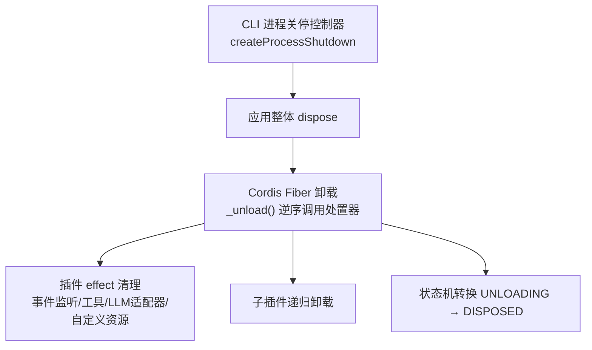
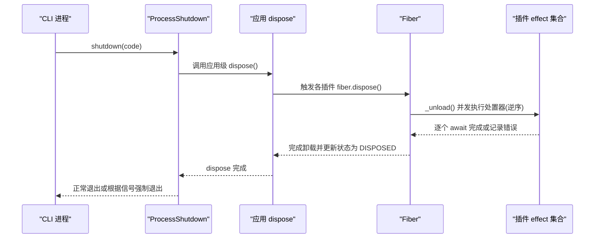
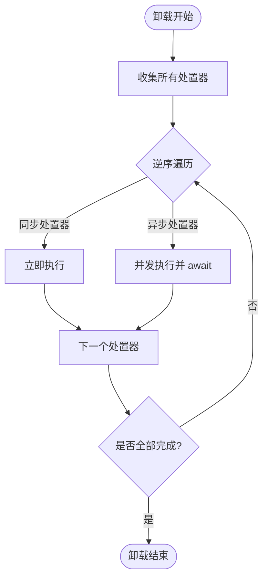
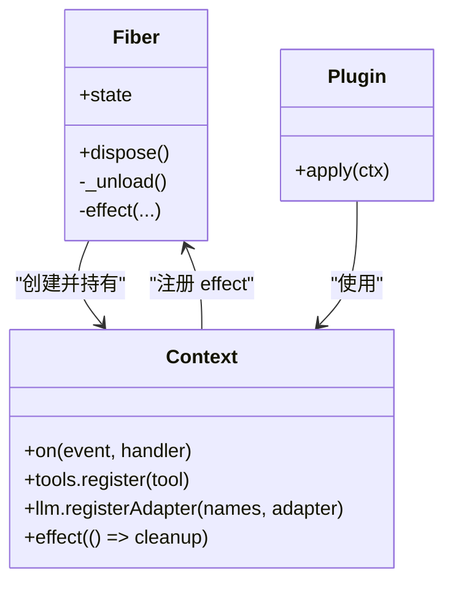
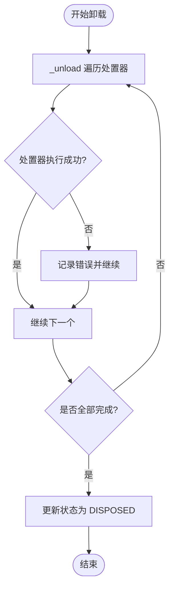
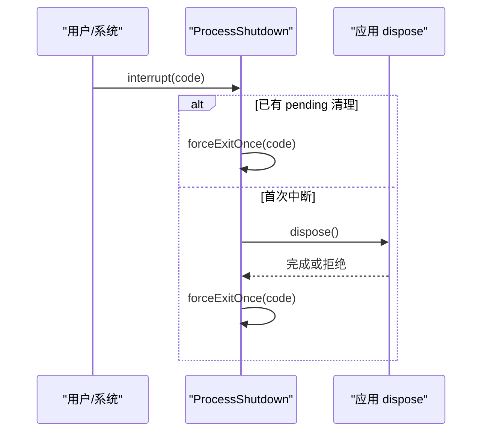
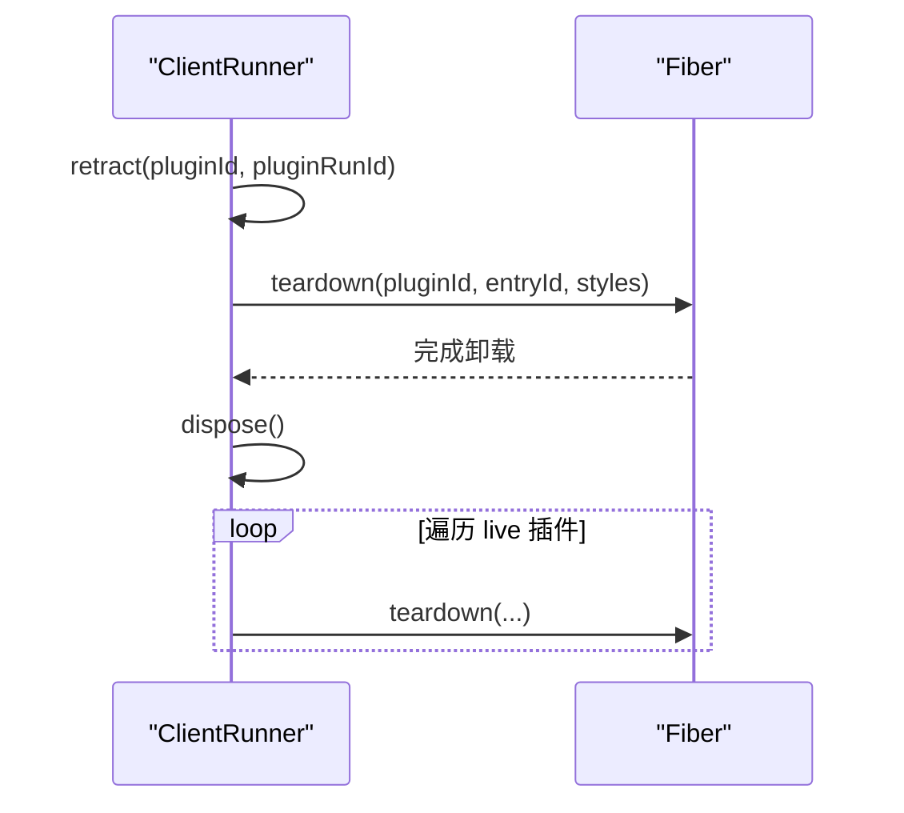
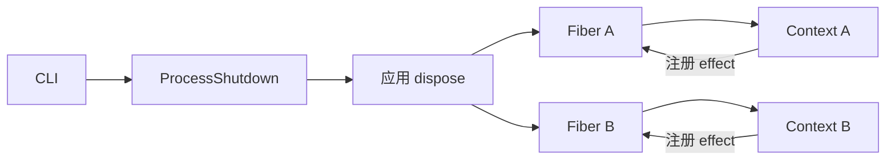

# 插件卸载与清理

<cite>
**本文引用的文件**
- [fiber.ts](file://vendor/cordis/src/fiber.ts)
- [index.zh.md](file://docs/user/develop/framework/index.zh.md)
- [02-lifecycle-and-effects.zh.md](file://docs/cordis-tutorial/02-lifecycle-and-effects.zh.md)
- [process-shutdown.ts](file://apps/cli/src/process-shutdown.ts)
- [never-dispose.mjs](file://apps/cli/tests/fixtures/never-dispose.mjs)
- [cordis-lifecycle.spec.ts](file://packages/extensions/tool-cordis/tests/cordis-lifecycle.spec.ts)
- [runtime.ts](file://packages/extensions/cordis-client-runner/src/client/runtime.ts)
- [fiber-state.ts](file://packages/extensions/tool-cordis/src/fiber-state.ts)
</cite>

## 目录
1. [简介](#简介)
2. [项目结构](#项目结构)
3. [核心组件](#核心组件)
4. [架构总览](#架构总览)
5. [详细组件分析](#详细组件分析)
6. [依赖关系分析](#依赖关系分析)
7. [性能考量](#性能考量)
8. [故障排查指南](#故障排查指南)
9. [结论](#结论)
10. [附录](#附录)

## 简介
本文件面向插件开发者与维护者，系统性阐述插件卸载与清理机制。重点包括：
- 卸载的逆序执行机制、反向效应与依赖释放顺序
- 资源清理策略：内存释放、文件句柄关闭、网络连接断开
- 错误处理与异常恢复：部分卸载失败的处理与资源泄漏防护
- 强制卸载与安全卸载的区别及使用场景
- 自定义清理钩子与资源管理器的实现要点（以代码路径指引为主）

## 项目结构
与插件卸载与清理直接相关的核心位于 Cordis Fiber 生命周期与 CLI 进程关停流程中：
- 插件运行时由 Fiber 管理，负责加载、激活、卸载与资源回收
- 通过 ctx.effect 注册可自动撤销的资源与副作用
- CLI 层提供进程级优雅关停与强制退出控制，确保应用树在超时前完成清理

图表来源
- [process-shutdown.ts:22-76](file://apps/cli/src/process-shutdown.ts#L22-L76)
- [fiber.ts:675-696](file://vendor/cordis/src/fiber.ts#L675-L696)
- [index.zh.md:40-63](file://docs/user/develop/framework/index.zh.md#L40-L63)

章节来源
- [fiber.ts:184-333](file://vendor/cordis/src/fiber.ts#L184-L333)
- [process-shutdown.ts:1-78](file://apps/cli/src/process-shutdown.ts#L1-L78)
- [index.zh.md:1-131](file://docs/user/develop/framework/index.zh.md#L1-L131)

## 核心组件
- Fiber 生命周期与状态机：PENDING → LOADING → ACTIVE → UNLOADING → DISPOSED（含 FAILED）
- 效果系统 effect：集中收集并逆序执行处置器，支持同步/异步/迭代器形式
- 插件上下文 Context：暴露 on、tools.register、llm.registerAdapter 等内置 effect
- 进程关停 ProcessShutdown：优雅关停与强制退出的统一入口

关键职责
- Fiber._unload：并发执行所有已收集的处置器，记录错误但不中断其他清理
- Fiber.dispose：将 fiber 从运行期移除，触发卸载流程并等待完成
- createProcessShutdown：封装应用级 dispose，超时后强制退出，避免进程悬挂

章节来源
- [fiber.ts:147-154](file://vendor/cordis/src/fiber.ts#L147-L154)
- [fiber.ts:415-561](file://vendor/cordis/src/fiber.ts#L415-L561)
- [fiber.ts:675-696](file://vendor/cordis/src/fiber.ts#L675-L696)
- [process-shutdown.ts:22-76](file://apps/cli/src/process-shutdown.ts#L22-L76)
- [index.zh.md:40-63](file://docs/user/develop/framework/index.zh.md#L40-L63)

## 架构总览
下图展示从 CLI 触发到插件卸载完成的调用链与数据流。

图表来源
- [process-shutdown.ts:52-63](file://apps/cli/src/process-shutdown.ts#L52-L63)
- [fiber.ts:265-297](file://vendor/cordis/src/fiber.ts#L265-L297)
- [fiber.ts:675-696](file://vendor/cordis/src/fiber.ts#L675-L696)

## 详细组件分析

### 插件卸载的逆序执行机制
- 逆序启动：处置器按注册顺序的逆序开始调用，保证“后进先出”的反向效应
- 并发执行：多个异步处置器会并发运行，不保证串行完成；存在顺序依赖的清理应放在同一个处置器内串行等待
- 错误隔离：单个处置器抛错会被记录，不会中断其他处置器的执行

图表来源
- [fiber.ts:675-686](file://vendor/cordis/src/fiber.ts#L675-L686)
- [index.zh.md:57-63](file://docs/user/develop/framework/index.zh.md#L57-L63)
- [02-lifecycle-and-effects.zh.md:84-95](file://docs/cordis-tutorial/02-lifecycle-and-effects.zh.md#L84-L95)

章节来源
- [fiber.ts:415-561](file://vendor/cordis/src/fiber.ts#L415-L561)
- [fiber.ts:675-696](file://vendor/cordis/src/fiber.ts#L675-L696)
- [index.zh.md:40-63](file://docs/user/develop/framework/index.zh.md#L40-L63)
- [02-lifecycle-and-effects.zh.md:84-95](file://docs/cordis-tutorial/02-lifecycle-and-effects.zh.md#L84-L95)

### 依赖释放顺序与反向效应
- 依赖驱动的加载：插件声明 inject 的服务会在加载时注入，并在服务不可用时自动卸载
- 卸载时的反向效应：由于处置器逆序执行，后注册的依赖通常先被释放，符合“最后获取的资源最先释放”的原则
- 嵌套插件：子插件随父插件一同卸载，确保父子依赖成对创建与销毁

图表来源
- [fiber.ts:184-333](file://vendor/cordis/src/fiber.ts#L184-L333)
- [index.zh.md:26-38](file://docs/user/develop/framework/index.zh.md#L26-L38)

章节来源
- [index.zh.md:26-38](file://docs/user/develop/framework/index.zh.md#L26-L38)
- [fiber.ts:597-639](file://vendor/cordis/src/fiber.ts#L597-L639)

### 资源清理策略
- 内存释放：JavaScript 引擎自动回收无引用对象；通过 effect 返回的处置器显式释放外部资源
- 文件句柄关闭：在 effect 中打开的文件句柄应在处置器中关闭，避免句柄泄露
- 网络连接断开：HTTP/WebSocket/数据库连接等在 effect 中建立，于处置器中安全关闭
- 定时器与事件监听：ctx.on 与全局定时器需在处置器中移除/取消

实践建议
- 将相关资源的创建与释放放在同一 effect 中，保证原子性
- 对异步清理步骤进行 try/catch 并记录日志，避免静默失败
- 对于必须顺序执行的清理，放入单一处置器内依次 await

章节来源
- [index.zh.md:40-63](file://docs/user/develop/framework/index.zh.md#L40-L63)
- [02-lifecycle-and-effects.zh.md:84-95](file://docs/cordis-tutorial/02-lifecycle-and-effects.zh.md#L84-L95)

### 卸载过程中的错误处理与异常恢复
- 单处置器失败不影响其他处置器：_unload 捕获每个处置器的异常并记录，继续执行其余清理
- 启动失败回滚：effect 执行期间若抛出异常，框架会触发已收集处置器的清理，防止半初始化状态
- 进程级兜底：createProcessShutdown 在 dispose 拒绝时强制退出，避免进程悬挂

图表来源
- [fiber.ts:675-686](file://vendor/cordis/src/fiber.ts#L675-L686)
- [process-shutdown.ts:52-63](file://apps/cli/src/process-shutdown.ts#L52-L63)

章节来源
- [fiber.ts:675-686](file://vendor/cordis/src/fiber.ts#L675-L686)
- [process-shutdown.ts:22-76](file://apps/cli/src/process-shutdown.ts#L22-L76)

### 强制卸载与安全卸载
- 安全卸载：通过 fiber.dispose 或应用级 dispose，遵循逆序与并发语义，允许异步清理完成
- 强制卸载：当进程收到中断信号或超时未结束时，createProcessShutdown 会强制退出，不再等待剩余清理
- 使用场景
  - 安全卸载：正常退出、热重载、服务替换
  - 强制卸载：用户中断、长时间卡住、系统关机

图表来源
- [process-shutdown.ts:52-76](file://apps/cli/src/process-shutdown.ts#L52-L76)

章节来源
- [process-shutdown.ts:22-76](file://apps/cli/src/process-shutdown.ts#L22-L76)

### 动态插件撤回与批量卸载
- 动态撤回：retract 针对特定 pluginRunId 停止并 teardown，避免影响新版本实例
- 批量卸载：dispose 遍历所有 live 插件并逐一 teardown，确保整体一致性

图表来源
- [runtime.ts:303-325](file://packages/extensions/cordis-client-runner/src/client/runtime.ts#L303-L325)

章节来源
- [runtime.ts:303-325](file://packages/extensions/cordis-client-runner/src/client/runtime.ts#L303-L325)

### 自定义清理钩子与资源管理器示例（以路径指引）
- 自定义清理钩子：在插件 apply 中使用 ctx.effect 返回处置器，用于关闭连接、移除监听、释放句柄
  - 参考路径：[index.zh.md:40-63](file://docs/user/develop/framework/index.zh.md#L40-L63)
  - 参考路径：[02-lifecycle-and-effects.zh.md:84-95](file://docs/cordis-tutorial/02-lifecycle-and-effects.zh.md#L84-L95)
- 资源管理器模式：封装资源生命周期，内部维护队列与清理逻辑，对外暴露 effect 注册点
  - 参考路径：[fiber.ts:415-561](file://vendor/cordis/src/fiber.ts#L415-L561)
- 测试用例中的“永不结束”清理：演示如何构造一个阻塞的处置器以验证进程关停行为
  - 参考路径：[never-dispose.mjs:1-19](file://apps/cli/tests/fixtures/never-dispose.mjs#L1-L19)
- 生命周期交互测试：验证父子 fiber 卸载、竞态与清理收敛
  - 参考路径：[cordis-lifecycle.spec.ts:190-287](file://packages/extensions/tool-cordis/tests/cordis-lifecycle.spec.ts#L190-L287)

章节来源
- [index.zh.md:40-63](file://docs/user/develop/framework/index.zh.md#L40-L63)
- [02-lifecycle-and-effects.zh.md:84-95](file://docs/cordis-tutorial/02-lifecycle-and-effects.zh.md#L84-L95)
- [fiber.ts:415-561](file://vendor/cordis/src/fiber.ts#L415-L561)
- [never-dispose.mjs:1-19](file://apps/cli/tests/fixtures/never-dispose.mjs#L1-L19)
- [cordis-lifecycle.spec.ts:190-287](file://packages/extensions/tool-cordis/tests/cordis-lifecycle.spec.ts#L190-L287)

## 依赖关系分析
- Fiber 依赖 Context 提供的 effect/on/tools/llm 等能力
- CLI 进程关停依赖应用级 dispose，进而驱动所有 Fiber 的卸载
- 插件之间通过注入服务形成依赖图，卸载时按逆序释放，避免悬空引用

图表来源
- [process-shutdown.ts:22-76](file://apps/cli/src/process-shutdown.ts#L22-L76)
- [fiber.ts:184-333](file://vendor/cordis/src/fiber.ts#L184-L333)

章节来源
- [process-shutdown.ts:22-76](file://apps/cli/src/process-shutdown.ts#L22-L76)
- [fiber.ts:184-333](file://vendor/cordis/src/fiber.ts#L184-L333)

## 性能考量
- 并发清理：_unload 并发执行处置器，提升整体卸载速度；但需注意共享资源竞争
- 顺序依赖：将有关联的步骤合并到同一处置器，减少跨处置器协调成本
- 超时保护：createProcessShutdown 设置超时，避免无限挂起影响进程退出
- 诊断信息：effect 标签与外层堆栈有助于定位慢/失败的清理步骤

章节来源
- [fiber.ts:675-686](file://vendor/cordis/src/fiber.ts#L675-L686)
- [process-shutdown.ts:3-4](file://apps/cli/src/process-shutdown.ts#L3-L4)

## 故障排查指南
常见问题与对策
- 处置器未执行：检查是否在 effect 中正确返回处置器；确认 fiber 处于活跃状态
- 清理顺序错误：将顺序依赖步骤放入同一处置器内串行等待
- 进程无法退出：检查是否存在阻塞的异步清理；必要时使用 interrupt 强制退出
- 部分清理失败：查看日志输出，定位具体处置器；修复后重新验证

定位线索
- Fiber 状态：通过 STATE_LABELS 观察当前状态
  - 参考路径：[fiber-state.ts:11-31](file://packages/extensions/tool-cordis/src/fiber-state.ts#L11-L31)
- 生命周期测试：对照 cordis-lifecycle.spec.ts 的行为断言
  - 参考路径：[cordis-lifecycle.spec.ts:190-287](file://packages/extensions/tool-cordis/tests/cordis-lifecycle.spec.ts#L190-L287)
- 进程关停行为：对照 process-shutdown.spec.ts 的断言
  - 参考路径：[process-shutdown.ts:22-76](file://apps/cli/src/process-shutdown.ts#L22-L76)

章节来源
- [fiber-state.ts:11-31](file://packages/extensions/tool-cordis/src/fiber-state.ts#L11-L31)
- [cordis-lifecycle.spec.ts:190-287](file://packages/extensions/tool-cordis/tests/cordis-lifecycle.spec.ts#L190-L287)
- [process-shutdown.ts:22-76](file://apps/cli/src/process-shutdown.ts#L22-L76)

## 结论
- Cordis 通过 Fiber 与 effect 机制实现了健壮、可组合的插件卸载与清理
- 逆序启动、并发执行与错误隔离共同保障了清理过程的可靠性
- CLI 进程关停提供优雅与强制两种路径，兼顾用户体验与系统稳定性
- 插件开发者应将资源创建与释放绑定在同一 effect 中，确保顺序与完整性

## 附录
- 状态机参考：PENDING → LOADING → ACTIVE → UNLOADING → DISPOSED（含 FAILED）
  - 参考路径：[index.zh.md:7-24](file://docs/user/develop/framework/index.zh.md#L7-L24)
- 内置 effect 清单：事件监听、工具注册、LLM 适配器注册、自定义资源
  - 参考路径：[index.zh.md:57-63](file://docs/user/develop/framework/index.zh.md#L57-L63)
- 动态插件撤回与批量卸载
  - 参考路径：[runtime.ts:303-325](file://packages/extensions/cordis-client-runner/src/client/runtime.ts#L303-L325)