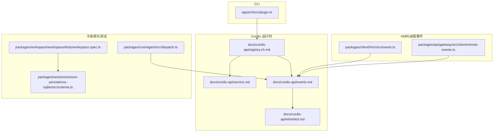
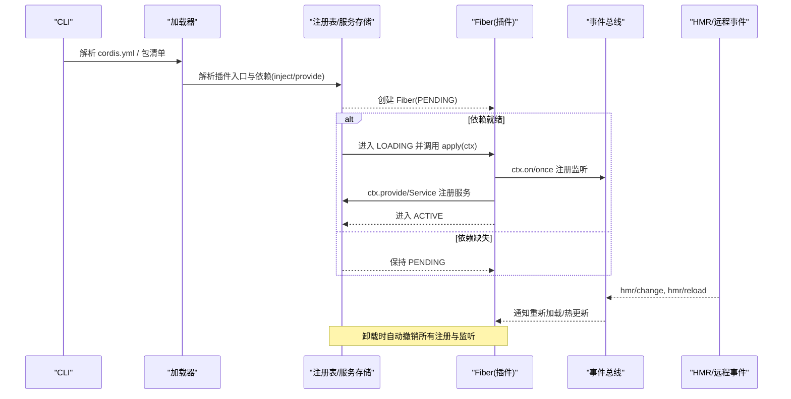
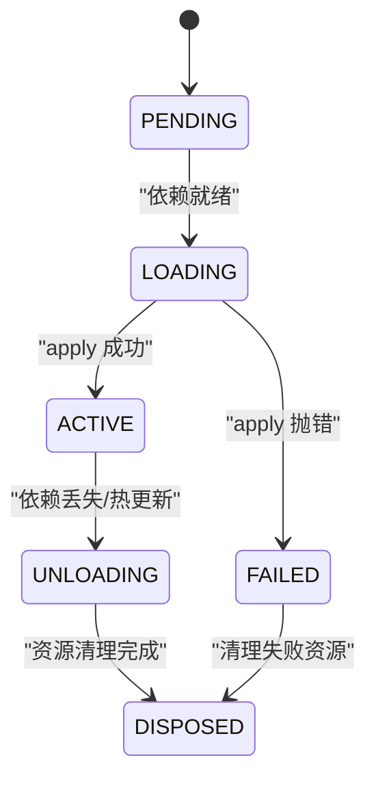
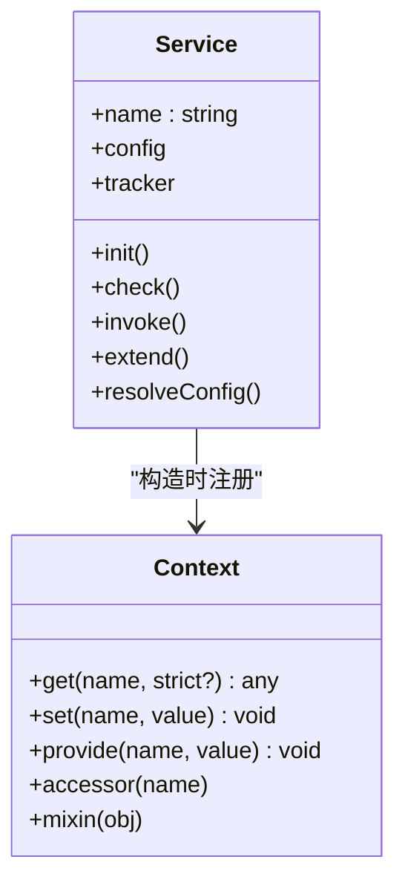
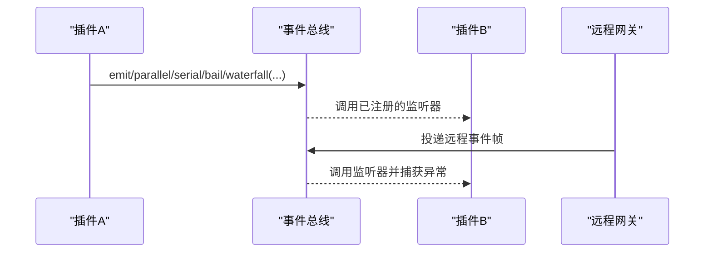
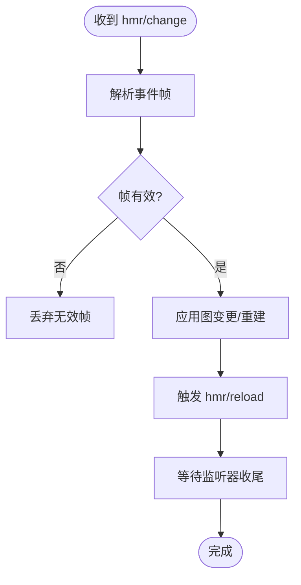
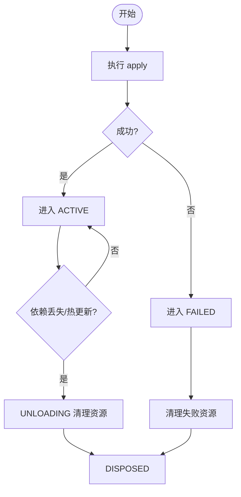
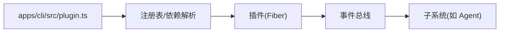

# 插件激活流程

<cite>
**本文引用的文件**
- [apps/cli/src/plugin.ts](file://apps/cli/src/plugin.ts)
- [packages/extensions/tool-cordis/src/fiber-state.ts](file://packages/extensions/tool-cordis/src/fiber-state.ts)
- [docs/cordis-api/events.md](file://docs/cordis-api/events.md)
- [docs/cordis-api/inherited.md](file://docs/cordis-api/inherited.md)
- [docs/cordis-api/registry.zh.md](file://docs/cordis-api/registry.zh.md)
- [docs/cordis-api/service.md](file://docs/cordis-api/service.md)
- [docs/cordis-tutorial/01-first-plugin.md](file://docs/cordis-tutorial/01-first-plugin.md)
- [docs/cordis-tutorial/03-services.md](file://docs/cordis-tutorial/03-services.md)
- [docs/user/develop/framework/index.zh.md](file://docs/user/develop/framework/index.zh.md)
- [packages/client/hmr/src/events.ts](file://packages/client/hmr/src/events.ts)
- [packages/api/gateway/src/client/remote-events.ts](file://packages/api/gateway/src/client/remote-events.ts)
- [packages/core/agent/src/dispatch.ts](file://packages/core/agent/src/dispatch.ts)
- [packages/workspace/workspace/tests/workspace.spec.ts](file://packages/workspace/workspace/tests/workspace.spec.ts)
- [packages/session/session-persistence-sqlite/src/schema.ts](file://packages/session/session-persistence-sqlite/src/schema.ts)
</cite>

## 目录
1. [简介](#简介)
2. [项目结构](#项目结构)
3. [核心组件](#核心组件)
4. [架构总览](#架构总览)
5. [详细组件分析](#详细组件分析)
6. [依赖关系分析](#依赖关系分析)
7. [性能考量](#性能考量)
8. [故障排查指南](#故障排查指南)
9. [结论](#结论)
10. [附录](#附录)

## 简介
本文件系统性阐述插件激活流程，覆盖初始化、服务注册与事件监听器设置；解释依赖注入与服务发现（服务提供者模式与接口契约）；说明插件间通信协议（事件总线、消息传递、状态同步）；详述激活过程中的错误处理与回滚机制（部分失败与资源清理）；并提供实现自定义激活钩子与生命周期管理的实践指引。

## 项目结构
围绕插件系统的关键位置：
- CLI 层负责配置与包管理，驱动插件的加载与更新
- Cordis 运行时提供 Fiber 生命周期、服务注册、事件分发等核心能力
- 文档与教程定义插件形态、服务契约与事件模型
- HMR/远程事件通道用于热重载与跨进程事件投递
- 子系统测试验证了回滚、聚合错误与状态一致性

图表来源
- [apps/cli/src/plugin.ts:1-164](file://apps/cli/src/plugin.ts#L1-L164)
- [docs/cordis-api/registry.zh.md:60-121](file://docs/cordis-api/registry.zh.md#L60-L121)
- [docs/cordis-api/service.md:1-103](file://docs/cordis-api/service.md#L1-L103)
- [docs/cordis-api/events.md:1-208](file://docs/cordis-api/events.md#L1-L208)
- [docs/cordis-api/inherited.md:10-21](file://docs/cordis-api/inherited.md#L10-L21)
- [packages/client/hmr/src/events.ts:21-44](file://packages/client/hmr/src/events.ts#L21-L44)
- [packages/api/gateway/src/client/remote-events.ts:105-119](file://packages/api/gateway/src/client/remote-events.ts#L105-L119)
- [packages/core/agent/src/dispatch.ts:98-120](file://packages/core/agent/src/dispatch.ts#L98-L120)
- [packages/workspace/workspace/tests/workspace.spec.ts:430-483](file://packages/workspace/workspace/tests/workspace.spec.ts#L430-L483)
- [packages/session/session-persistence-sqlite/src/schema.ts:135-150](file://packages/session/session-persistence-sqlite/src/schema.ts#L135-L150)

章节来源
- [apps/cli/src/plugin.ts:1-164](file://apps/cli/src/plugin.ts#L1-L164)
- [docs/cordis-api/registry.zh.md:60-121](file://docs/cordis-api/registry.zh.md#L60-L121)
- [docs/cordis-api/service.md:1-103](file://docs/cordis-api/service.md#L1-L103)
- [docs/cordis-api/events.md:1-208](file://docs/cordis-api/events.md#L1-L208)
- [docs/cordis-api/inherited.md:10-21](file://docs/cordis-api/inherited.md#L10-L21)
- [packages/client/hmr/src/events.ts:21-44](file://packages/client/hmr/src/events.ts#L21-L44)
- [packages/api/gateway/src/client/remote-events.ts:105-119](file://packages/api/gateway/src/client/remote-events.ts#L105-L119)
- [packages/core/agent/src/dispatch.ts:98-120](file://packages/core/agent/src/dispatch.ts#L98-L120)
- [packages/workspace/workspace/tests/workspace.spec.ts:430-483](file://packages/workspace/workspace/tests/workspace.spec.ts#L430-L483)
- [packages/session/session-persistence-sqlite/src/schema.ts:135-150](file://packages/session/session-persistence-sqlite/src/schema.ts#L135-L150)

## 核心组件
- Fiber 生命周期：每个插件实例拥有独立作用域，经历 PENDING → LOADING → ACTIVE/FAILED → UNLOADING → DISPOSED 的状态机流转。
- 服务注册与发现：通过 Service 基类或 ctx.provide 暴露能力；消费者使用 inject 声明硬依赖，或使用 ctx.get 进行可选读取。
- 事件总线：ctx.on/once 注册监听，ctx.emit/parallel/serial/bail/waterfall 多种派发模式；内部事件如 internal/plugin/status/service 贯穿生命周期。
- 热重载与远程事件：HMR 推送图变更，远程网关将事件投递到本地上下文并隔离失败。
- 错误与回滚：apply 抛出异常进入 FAILED；卸载时自动撤销所有通过 ctx 的注册；持久化与状态操作具备事务性回滚与聚合错误上报。

章节来源
- [docs/user/develop/framework/index.zh.md:1-61](file://docs/user/develop/framework/index.zh.md#L1-L61)
- [docs/cordis-api/events.md:1-208](file://docs/cordis-api/events.md#L1-L208)
- [docs/cordis-api/inherited.md:10-21](file://docs/cordis-api/inherited.md#L10-L21)
- [packages/api/gateway/src/client/remote-events.ts:105-119](file://packages/api/gateway/src/client/remote-events.ts#L105-L119)
- [packages/session/session-persistence-sqlite/src/schema.ts:135-150](file://packages/session/session-persistence-sqlite/src/schema.ts#L135-L150)

## 架构总览
下图展示从 CLI 触发到插件加载、服务注册、事件监听与热重载的全链路交互。

图表来源
- [docs/cordis-tutorial/01-first-plugin.md:1-96](file://docs/cordis-tutorial/01-first-plugin.md#L1-L96)
- [docs/cordis-api/registry.zh.md:60-121](file://docs/cordis-api/registry.zh.md#L60-L121)
- [docs/cordis-api/events.md:1-208](file://docs/cordis-api/events.md#L1-L208)
- [packages/client/hmr/src/events.ts:21-44](file://packages/client/hmr/src/events.ts#L21-L44)

## 详细组件分析

### 插件生命周期与状态机
- 状态含义：PENDING（等待依赖）、LOADING（执行 apply）、ACTIVE（运行中）、FAILED（apply 抛错）、UNLOADING（释放资源）、DISPOSED（完全卸载）。
- 依赖驱动加载：声明 inject 的插件会等待所需服务；若提供方被替换或消失，插件自动卸载并在恢复后重新加载。
- 自动清理：通过 ctx 的所有注册（事件监听、工具、LLM 适配器、effect 资源）在卸载时自动撤销。

图表来源
- [docs/user/develop/framework/index.zh.md:1-61](file://docs/user/develop/framework/index.zh.md#L1-L61)
- [packages/extensions/tool-cordis/src/fiber-state.ts:1-32](file://packages/extensions/tool-cordis/src/fiber-state.ts#L1-L32)

章节来源
- [docs/user/develop/framework/index.zh.md:1-61](file://docs/user/develop/framework/index.zh.md#L1-L61)
- [packages/extensions/tool-cordis/src/fiber-state.ts:1-32](file://packages/extensions/tool-cordis/src/fiber-state.ts#L1-L32)

### 服务提供者模式与接口契约
- 服务提供：通过 Service 子类或 ctx.provide 暴露命名能力；名称在同一应用内全局唯一。
- 消费方式：inject 声明硬依赖；ctx.get(name, strict?) 进行可选读取；ctx.set 仅允许提供方覆写自身值。
- 类型契约：通过 declare module 合并 Context 接口，获得编译期类型安全。

图表来源
- [docs/cordis-api/service.md:1-103](file://docs/cordis-api/service.md#L1-L103)
- [docs/cordis-api/context.md:235-284](file://docs/cordis-api/context.md#L235-L284)

章节来源
- [docs/cordis-api/service.md:1-103](file://docs/cordis-api/service.md#L1-L103)
- [docs/cordis-api/context.md:235-284](file://docs/cordis-api/context.md#L235-L284)
- [docs/cordis-tutorial/03-services.md:1-99](file://docs/cordis-tutorial/03-services.md#L1-L99)

### 事件总线与插件间通信
- 监听与一次性监听：ctx.on/once 注册，支持 prepend/global 选项。
- 派发模式：emit（同步忽略返回值）、parallel（并发等待全部）、serial（顺序直到首个 bail）、bail（同步短路）、waterfall（链式 next 拦截）。
- 内部事件：internal/plugin、internal/status、internal/service、internal/update/get/set/listener/dispatch 等贯穿生命周期与数据流。
- 远程事件：网关侧将事件投递到本地上下文，捕获监听器异常并上报。

图表来源
- [docs/cordis-api/events.md:1-208](file://docs/cordis-api/events.md#L1-L208)
- [docs/cordis-api/inherited.md:10-21](file://docs/cordis-api/inherited.md#L10-L21)
- [packages/api/gateway/src/client/remote-events.ts:105-119](file://packages/api/gateway/src/client/remote-events.ts#L105-L119)

章节来源
- [docs/cordis-api/events.md:1-208](file://docs/cordis-api/events.md#L1-L208)
- [docs/cordis-api/inherited.md:10-21](file://docs/cordis-api/inherited.md#L10-L21)
- [packages/api/gateway/src/client/remote-events.ts:105-119](file://packages/api/gateway/src/client/remote-events.ts#L105-L119)

### 热重载与状态同步
- HMR 事件：hmr/change 表示源文件变更，hmr/reload 触发插件重载；客户端通过 SSE 端点接收 graph/rebuilt 帧。
- 状态同步：远程事件以“代”为单位追踪，确保监听器工作完成后才切换代次，避免竞态。

图表来源
- [packages/client/hmr/src/events.ts:21-44](file://packages/client/hmr/src/events.ts#L21-L44)
- [packages/api/gateway/src/client/remote-events.ts:105-119](file://packages/api/gateway/src/client/remote-events.ts#L105-L119)

章节来源
- [packages/client/hmr/src/events.ts:21-44](file://packages/client/hmr/src/events.ts#L21-L44)
- [packages/api/gateway/src/client/remote-events.ts:105-119](file://packages/api/gateway/src/client/remote-events.ts#L105-L119)

### 错误处理与回滚机制
- 启动失败：apply 抛错进入 FAILED，不会静默跳过；未解析模块的错误通过日志报告。
- 卸载清理：UNLOADING 阶段自动撤销所有通过 ctx 的注册；内部 publication 失败会回滚父级所有权。
- 持久化回滚：数据库/存储写入失败时尝试 rollback，保留原始可操作错误；多阶段失败聚合为 AggregateError 并尽量保留可恢复记录。

图表来源
- [docs/user/develop/framework/index.zh.md:1-61](file://docs/user/develop/framework/index.zh.md#L1-L61)
- [packages/workspace/workspace/tests/workspace.spec.ts:430-483](file://packages/workspace/workspace/tests/workspace.spec.ts#L430-L483)
- [packages/session/session-persistence-sqlite/src/schema.ts:135-150](file://packages/session/session-persistence-sqlite/src/schema.ts#L135-L150)

章节来源
- [docs/user/develop/framework/index.zh.md:1-61](file://docs/user/develop/framework/index.zh.md#L1-L61)
- [packages/workspace/workspace/tests/workspace.spec.ts:430-483](file://packages/workspace/workspace/tests/workspace.spec.ts#L430-L483)
- [packages/session/session-persistence-sqlite/src/schema.ts:135-150](file://packages/session/session-persistence-sqlite/src/schema.ts#L135-L150)

### 自定义激活钩子与生命周期管理示例
- 函数型插件：导出 name 与 apply(ctx)，在 apply 中注册服务与监听器。
- 对象型插件：包含 apply 方法，便于附加元信息。
- 类插件：继承 Service，在构造函数中注册服务名，并通过 ctx.plugin 挂载。
- 效果与清理：使用 ctx.effect 返回清理函数，随 Fiber 卸载自动执行。

参考路径
- [docs/cordis-tutorial/01-first-plugin.md:1-96](file://docs/cordis-tutorial/01-first-plugin.md#L1-L96)
- [docs/cordis-tutorial/03-services.md:1-99](file://docs/cordis-tutorial/03-services.md#L1-L99)
- [docs/user/develop/framework/index.zh.md:1-61](file://docs/user/develop/framework/index.zh.md#L1-L61)

章节来源
- [docs/cordis-tutorial/01-first-plugin.md:1-96](file://docs/cordis-tutorial/01-first-plugin.md#L1-L96)
- [docs/cordis-tutorial/03-services.md:1-99](file://docs/cordis-tutorial/03-services.md#L1-L99)
- [docs/user/develop/framework/index.zh.md:1-61](file://docs/user/develop/framework/index.zh.md#L1-L61)

## 依赖关系分析
- CLI 与加载器：CLI 负责初始化 profile、转发 pnpm 命令并基于安装状态协调 bundles 层列表。
- 插件与注册表：插件通过 inject/provide 声明依赖与能力；注册表维护 Fiber 集合与回调入口。
- 事件与子系统：各子系统通过事件总线解耦，Agent 事件调度封装主题与载荷注入。

图表来源
- [apps/cli/src/plugin.ts:1-164](file://apps/cli/src/plugin.ts#L1-L164)
- [docs/cordis-api/registry.zh.md:60-121](file://docs/cordis-api/registry.zh.md#L60-L121)
- [packages/core/agent/src/dispatch.ts:98-120](file://packages/core/agent/src/dispatch.ts#L98-L120)

章节来源
- [apps/cli/src/plugin.ts:1-164](file://apps/cli/src/plugin.ts#L1-L164)
- [docs/cordis-api/registry.zh.md:60-121](file://docs/cordis-api/registry.zh.md#L60-L121)
- [packages/core/agent/src/dispatch.ts:98-120](file://packages/core/agent/src/dispatch.ts#L98-L120)

## 性能考量
- 并发与短路：优先使用 parallel 提升吞吐；需要顺序控制时使用 serial/bail 减少不必要开销。
- 懒加载：inject 保证按需启动，避免无关插件阻塞主流程。
- 热更新：HMR 仅在必要时重建与重载，配合事件“代”机制避免重复计算。
- 资源清理：利用 ctx.effect 集中管理连接/定时器，降低内存泄漏风险。

[本节为通用指导，不直接分析具体文件]

## 故障排查指南
- 插件未生效：检查 cordis.yml 中模块路径与包名是否正确；未解析模块会通过日志报告而非崩溃。
- 依赖未就绪：确认提供方是否已加载；可通过内部事件 internal/status 观察 Fiber 状态变化。
- 事件无响应：核对事件名与监听器注册时机；远程事件需确认网关连接与帧校验。
- 回滚失败：查看持久化层的回滚日志；AggregateError 通常包含多阶段失败原因。

章节来源
- [docs/cordis-tutorial/01-first-plugin.md:1-96](file://docs/cordis-tutorial/01-first-plugin.md#L1-L96)
- [docs/cordis-api/inherited.md:10-21](file://docs/cordis-api/inherited.md#L10-L21)
- [packages/api/gateway/src/client/remote-events.ts:105-119](file://packages/api/gateway/src/client/remote-events.ts#L105-L119)
- [packages/workspace/workspace/tests/workspace.spec.ts:430-483](file://packages/workspace/workspace/tests/workspace.spec.ts#L430-L483)

## 结论
插件激活流程以 Fiber 为核心，结合依赖驱动的加载、服务注册与事件总线，形成高内聚、低耦合的可插拔架构。通过严格的错误处理与回滚机制，系统在热重载与动态替换场景下保持稳定。遵循服务契约与事件规范，可实现可靠的插件间通信与生命周期管理。

[本节为总结性内容，不直接分析具体文件]

## 附录
- 快速上手：参考“第一个插件”与“服务”教程，逐步掌握 apply、inject、Service 与 ctx 的使用。
- 最佳实践：
  - 明确 inject 声明，避免隐式依赖
  - 使用 ctx.effect 管理外部资源
  - 用事件总线解耦跨插件协作
  - 借助内部事件诊断生命周期问题

章节来源
- [docs/cordis-tutorial/01-first-plugin.md:1-96](file://docs/cordis-tutorial/01-first-plugin.md#L1-L96)
- [docs/cordis-tutorial/03-services.md:1-99](file://docs/cordis-tutorial/03-services.md#L1-L99)
- [docs/user/develop/framework/index.zh.md:1-61](file://docs/user/develop/framework/index.zh.md#L1-L61)