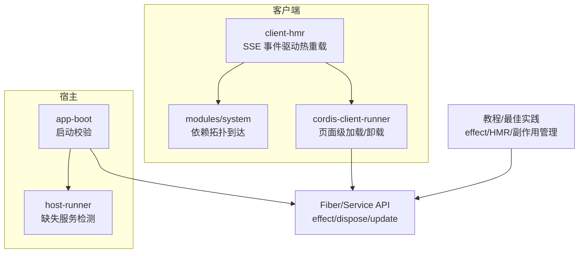
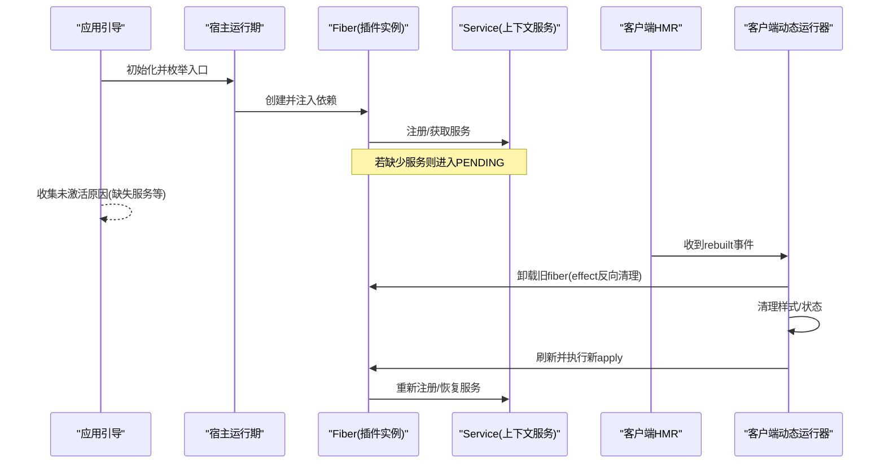
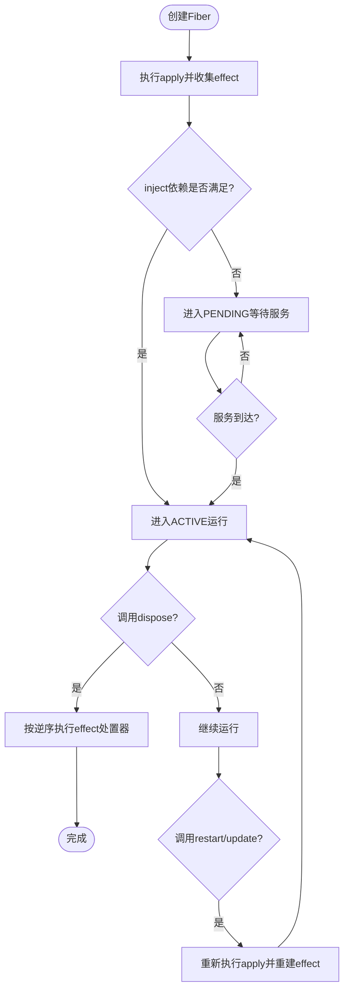
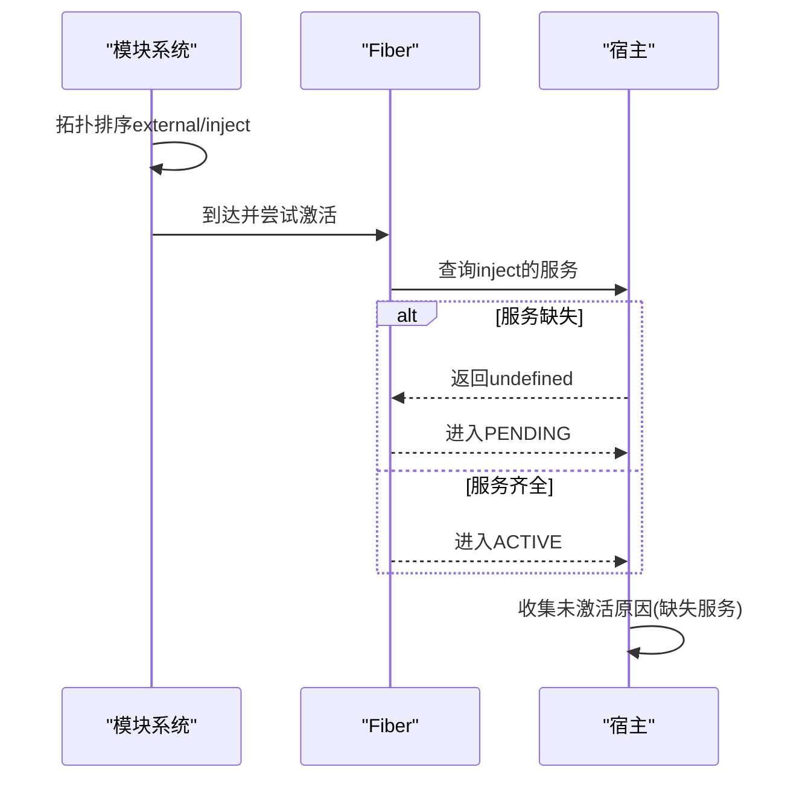
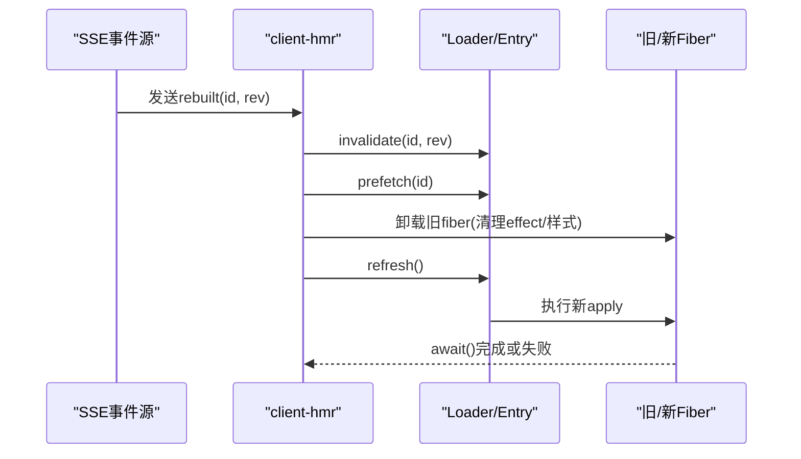
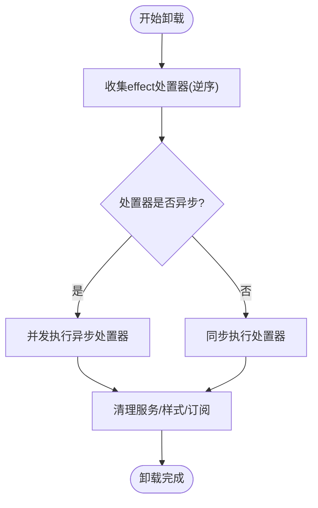
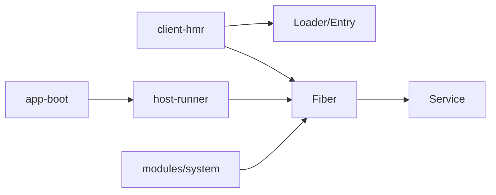

# 插件生命周期管理

<cite>
**本文引用的文件**
- [packages/client/hmr/src/client/index.ts](file://packages/client/hmr/src/client/index.ts)
- [packages/extensions/cordis-host-runner/src/lifecycle.ts](file://packages/extensions/cordis-host-runner/src/lifecycle.ts)
- [packages/boot/app-boot/src/index.ts](file://packages/boot/app-boot/src/index.ts)
- [packages/extension/tool-cordis/src/inspect.ts](file://packages/extension/tool-cordis/src/inspect.ts)
- [packages/preset/agent-presets/presets/cordis/skills/cordis-plugin-development/SKILL.md](file://packages/preset/agent-presets/presets/cordis/skills/cordis-plugin-development/SKILL.md)
- [docs/cordis-tutorial/02-lifecycle-and-effects.zh.md](file://docs/cordis-tutorial/02-lifecycle-and-effects.zh.md)
- [docs/cordis-tutorial/06-composition-and-hmr.md](file://docs/cordis-tutorial/06-composition-and-hmr.md)
- [docs/user/develop/framework/index.zh.md](file://docs/user/develop/framework/index.zh.md)
- [docs/cordis-api/fiber.md](file://docs/cordis-api/fiber.md)
- [docs/cordis-api/service.md](file://docs/cordis-api/service.md)
- [packages/client/modules/src/client/system.ts](file://packages/client/modules/src/client/system.ts)
- [packages/runtime-diagnostics/invariants/src/index.ts](file://packages/runtime-diagnostics/invariants/src/index.ts)
- [packages/extensions/cordis-client-runner/src/client/runtime.ts](file://packages/extensions/cordis-client-runner/src/client/runtime.ts)
</cite>

## 目录
1. [简介](#简介)
2. [项目结构](#项目结构)
3. [核心组件](#核心组件)
4. [架构总览](#架构总览)
5. [详细组件分析](#详细组件分析)
6. [依赖关系分析](#依赖关系分析)
7. [性能考量](#性能考量)
8. [故障排查指南](#故障排查指南)
9. [结论](#结论)
10. [附录](#附录)

## 简介
本文件面向插件开发者与平台维护者，系统化阐述 Cordis 插件的完整生命周期：加载、激活、运行与卸载；说明启动顺序控制（依赖解析与服务就绪检查）；解释热重载机制（增量更新与状态保持策略）；介绍卸载与资源清理（反向效应与依赖释放）；并提供实现自定义生命周期钩子与资源管理的实践指引。内容基于仓库中的宿主与客户端 HMR、引导启动、Fiber/Service API 文档与实现片段进行归纳。

## 项目结构
围绕插件生命周期的关键代码分布在以下模块：
- 宿主侧生命周期与依赖诊断：用于检测缺失服务、辅助启动失败报告
- 应用引导：在启动阶段校验各 Fiber 是否激活，收集未激活原因
- 客户端 HMR：监听事件流，执行失效、预取、旧实例卸载与新实例刷新
- Fiber/Service 文档：定义 effect、dispose、update/restart、服务注册等能力
- 教程与实践：展示 effect 使用、HMR 配置与调试方法
- 客户端模块系统：按依赖拓扑到达并安装模块，避免循环依赖
- 运行时不变量：以 effect 方式注册并管理检查器，随 fiber 生命周期自动清理
- 客户端动态插件运行器：页面级加载/卸载/回收与状态同步

图表来源
- [packages/boot/app-boot/src/index.ts:721-740](file://packages/boot/app-boot/src/index.ts#L721-L740)
- [packages/extensions/cordis-host-runner/src/lifecycle.ts:47-57](file://packages/extensions/cordis-host-runner/src/lifecycle.ts#L47-L57)
- [packages/client/hmr/src/client/index.ts:1-186](file://packages/client/hmr/src/client/index.ts#L1-L186)
- [packages/client/modules/src/client/system.ts:143-170](file://packages/client/modules/src/client/system.ts#L143-L170)
- [packages/extensions/cordis-client-runner/src/client/runtime.ts:273-331](file://packages/extensions/cordis-client-runner/src/client/runtime.ts#L273-L331)
- [docs/cordis-api/fiber.md:1-376](file://docs/cordis-api/fiber.md#L1-L376)
- [docs/cordis-api/service.md:1-103](file://docs/cordis-api/service.md#L1-L103)
- [docs/cordis-tutorial/02-lifecycle-and-effects.zh.md:1-60](file://docs/cordis-tutorial/02-lifecycle-and-effects.zh.md#L1-L60)
- [docs/cordis-tutorial/06-composition-and-hmr.md:1-114](file://docs/cordis-tutorial/06-composition-and-hmr.md#L1-L114)

章节来源
- [packages/boot/app-boot/src/index.ts:721-740](file://packages/boot/app-boot/src/index.ts#L721-L740)
- [packages/extensions/cordis-host-runner/src/lifecycle.ts:47-57](file://packages/extensions/cordis-host-runner/src/lifecycle.ts#L47-L57)
- [packages/client/hmr/src/client/index.ts:1-186](file://packages/client/hmr/src/client/index.ts#L1-L186)
- [packages/client/modules/src/client/system.ts:143-170](file://packages/client/modules/src/client/system.ts#L143-L170)
- [packages/extensions/cordis-client-runner/src/client/runtime.ts:273-331](file://packages/extensions/cordis-client-runner/src/client/runtime.ts#L273-L331)
- [docs/cordis-api/fiber.md:1-376](file://docs/cordis-api/fiber.md#L1-L376)
- [docs/cordis-api/service.md:1-103](file://docs/cordis-api/service.md#L1-L103)
- [docs/cordis-tutorial/02-lifecycle-and-effects.zh.md:1-60](file://docs/cordis-tutorial/02-lifecycle-and-effects.zh.md#L1-L60)
- [docs/cordis-tutorial/06-composition-and-hmr.md:1-114](file://docs/cordis-tutorial/06-composition-and-hmr.md#L1-L114)

## 核心组件
- Fiber（插件运行时实例）
  - 负责跟踪依赖状态、已验证配置、生命周期 effect 与清理操作
  - 提供 effect、dispose、await、restart、update 等能力
  - 通过 store 快照记录加载时的服务实现集合
- Service（上下文服务）
  - 作为命名 API 暴露于 Context，构造时即注册，随 fiber 卸载自动移除
  - 支持拦截配置、可调用封装、扩展与追踪元数据
- 宿主引导与诊断
  - 启动时枚举所有 entry，收集未激活原因（如缺少服务）
  - 提供 missingServices 工具函数定位 PENDING 的原因
- 客户端 HMR
  - 订阅 SSE 事件，对 rebuilt 帧执行“失效→预取→卸载旧 fiber→清理样式→刷新新 fiber”的顺序
  - 串行化 reload 队列，避免并发导致的槽位竞争
- 客户端动态插件运行器
  - 页面级 load/retract/dispose，维护 live 集合与变更通知
- 模块到达与依赖拓扑
  - 按外部依赖与 inject 列表拓扑到达，检测循环依赖并安全安装
- 运行时不变量
  - 以 effect 方式注册检查器，随 fiber 生命周期自动清理

章节来源
- [docs/cordis-api/fiber.md:1-376](file://docs/cordis-api/fiber.md#L1-L376)
- [docs/cordis-api/service.md:1-103](file://docs/cordis-api/service.md#L1-L103)
- [packages/boot/app-boot/src/index.ts:721-740](file://packages/boot/app-boot/src/index.ts#L721-L740)
- [packages/extensions/cordis-host-runner/src/lifecycle.ts:47-57](file://packages/extensions/cordis-host-runner/src/lifecycle.ts#L47-L57)
- [packages/client/hmr/src/client/index.ts:1-186](file://packages/client/hmr/src/client/index.ts#L1-L186)
- [packages/extensions/cordis-client-runner/src/client/runtime.ts:273-331](file://packages/extensions/cordis-client-runner/src/client/runtime.ts#L273-L331)
- [packages/client/modules/src/client/system.ts:143-170](file://packages/client/modules/src/client/system.ts#L143-L170)
- [packages/runtime-diagnostics/invariants/src/index.ts:128-158](file://packages/runtime-diagnostics/invariants/src/index.ts#L128-L158)

## 架构总览
下图展示了从宿主引导到客户端 HMR 的端到端流程，以及 Fiber/Service 在其中的角色。

图表来源
- [packages/boot/app-boot/src/index.ts:721-740](file://packages/boot/app-boot/src/index.ts#L721-L740)
- [packages/extensions/cordis-host-runner/src/lifecycle.ts:47-57](file://packages/extensions/cordis-host-runner/src/lifecycle.ts#L47-L57)
- [packages/client/hmr/src/client/index.ts:104-140](file://packages/client/hmr/src/client/index.ts#L104-L140)
- [packages/extensions/cordis-client-runner/src/client/runtime.ts:288-325](file://packages/extensions/cordis-client-runner/src/client/runtime.ts#L288-L325)
- [docs/cordis-api/fiber.md:102-131](file://docs/cordis-api/fiber.md#L102-L131)
- [docs/cordis-api/service.md:1-103](file://docs/cordis-api/service.md#L1-L103)

## 详细组件分析

### 组件A：Fiber 生命周期与 Effect/Dispose
- 加载与激活
  - 通过 ctx.plugin 创建 Fiber，执行 apply，收集 effect
  - 若声明了 inject 但未满足，Fiber 进入 PENDING，等待服务出现
- 运行中
  - 通过 ctx.effect 注册带清理函数的作用域资源（定时器、连接、watcher 等）
  - 可通过 fiber.store 快照当前可用的服务实现集合
- 卸载与清理
  - fiber.dispose 会递归卸载子插件，按注册逆序调用处置器，异步处置器并发执行
  - 重复调用 dispose 或在不活跃 fiber 上创建 effect 会抛出异常
- 重启与更新
  - restart 立即用当前配置重新加载
  - update 先执行 internal/update 水线，再重启，允许拦截或替换重启行为

图表来源
- [docs/cordis-api/fiber.md:102-131](file://docs/cordis-api/fiber.md#L102-L131)
- [docs/cordis-api/fiber.md:230-274](file://docs/cordis-api/fiber.md#L230-L274)
- [docs/user/develop/framework/index.zh.md:63-98](file://docs/user/develop/framework/index.zh.md#L63-L98)

章节来源
- [docs/cordis-api/fiber.md:1-376](file://docs/cordis-api/fiber.md#L1-L376)
- [docs/user/develop/framework/index.zh.md:63-98](file://docs/user/develop/framework/index.zh.md#L63-L98)

### 组件B：启动顺序控制与依赖解析
- 依赖解析
  - 客户端模块系统按 external 与 inject 列表拓扑到达，检测循环依赖并报错
  - 宿主侧通过 missingServices 列出尚未提供的服务名，便于诊断
- 服务就绪检查
  - 引导阶段遍历所有 entry，若 Fiber 处于 PENDING，收集缺失服务信息并汇总失败原因
  - 当服务提供者挂载后，PENDING 的 Fiber 将自动激活

图表来源
- [packages/client/modules/src/client/system.ts:143-170](file://packages/client/modules/src/client/system.ts#L143-L170)
- [packages/extensions/cordis-host-runner/src/lifecycle.ts:47-57](file://packages/extensions/cordis-host-runner/src/lifecycle.ts#L47-L57)
- [packages/boot/app-boot/src/index.ts:721-740](file://packages/boot/app-boot/src/index.ts#L721-L740)

章节来源
- [packages/client/modules/src/client/system.ts:143-170](file://packages/client/modules/src/client/system.ts#L143-L170)
- [packages/extensions/cordis-host-runner/src/lifecycle.ts:47-57](file://packages/extensions/cordis-host-runner/src/lifecycle.ts#L47-L57)
- [packages/boot/app-boot/src/index.ts:721-740](file://packages/boot/app-boot/src/index.ts#L721-L740)

### 组件C：热重载机制（HMR）
- 触发与序列化
  - 客户端 HMR 订阅 SSE 事件，收到 rebuilt 帧后串行执行 reload
- 增量更新步骤
  1) 失效：删除旧工厂与记录，避免重复注册
  2) 预取：加载新模块但不执行副作用（惰性 CJS）
  3) 卸载旧 fiber：先删除运行时回调，再等待旧 fiber 的惯性任务完成
  4) 清理样式：移除旧 fiber 拥有的 style 标签
  5) 刷新：entry.refresh 重新导入并执行新 apply
- 状态保持策略
  - 下游 fiber 通过 provider fiber uid 键控激活纪元，替换 provider 时自然级联刷新
  - 无回滚策略：导入失败留空，apply 失败保留 FAILED 状态，日志告警

图表来源
- [packages/client/hmr/src/client/index.ts:104-140](file://packages/client/hmr/src/client/index.ts#L104-L140)
- [packages/client/hmr/src/client/index.ts:142-185](file://packages/client/hmr/src/client/index.ts#L142-L185)
- [docs/cordis-tutorial/06-composition-and-hmr.md:23-59](file://docs/cordis-tutorial/06-composition-and-hmr.md#L23-L59)

章节来源
- [packages/client/hmr/src/client/index.ts:1-186](file://packages/client/hmr/src/client/index.ts#L1-L186)
- [docs/cordis-tutorial/06-composition-and-hmr.md:1-114](file://docs/cordis-tutorial/06-composition-and-hmr.md#L1-L114)

### 组件D：卸载与资源清理（反向效应与依赖释放）
- 反向效应
  - effect 的处置器按注册逆序执行，确保后注册的先释放
  - 多个异步处置器并发执行，存在顺序依赖的步骤应放在同一处置器内串行处理
- 依赖释放
  - Service 实例随 fiber 卸载自动移除
  - 页面级运行器在 retract/dispose 时清理 live 集合并通知变更
- 最佳实践
  - 使用 ctx.effect 包装第三方订阅/定时器/watcher，并确保返回 disposer
  - 不要在全局或模块作用域创建持久副作用

图表来源
- [docs/user/develop/framework/index.zh.md:63-98](file://docs/user/develop/framework/index.zh.md#L63-L98)
- [packages/extensions/cordis-client-runner/src/client/runtime.ts:309-325](file://packages/extensions/cordis-client-runner/src/client/runtime.ts#L309-L325)
- [packages/preset/agent-presets/presets/cordis/skills/cordis-plugin-development/SKILL.md:127-150](file://packages/preset/agent-presets/presets/cordis/skills/cordis-plugin-development/SKILL.md#L127-L150)

章节来源
- [docs/user/develop/framework/index.zh.md:63-98](file://docs/user/develop/framework/index.zh.md#L63-L98)
- [packages/extensions/cordis-client-runner/src/client/runtime.ts:309-325](file://packages/extensions/cordis-client-runner/src/client/runtime.ts#L309-L325)
- [packages/preset/agent-presets/presets/cordis/skills/cordis-plugin-development/SKILL.md:127-150](file://packages/preset/agent-presets/presets/cordis/skills/cordis-plugin-development/SKILL.md#L127-L150)

### 组件E：自定义生命周期钩子与资源管理示例
- 使用 effect 管理外部资源（定时器、连接、watcher），并在处置器中释放
- 通过 ctx.plugin 挂载子插件，并通过 fiber.await/dispose 控制其生命周期
- 在 HMR 场景下，利用内部 update 水线与 fiber.update/restart 实现可控重启
- 参考教程中的最小示例与 HMR 配置，理解加载/卸载输出与行为

章节来源
- [docs/cordis-tutorial/02-lifecycle-and-effects.zh.md:1-60](file://docs/cordis-tutorial/02-lifecycle-and-effects.zh.md#L1-L60)
- [docs/cordis-tutorial/06-composition-and-hmr.md:23-59](file://docs/cordis-tutorial/06-composition-and-hmr.md#L23-L59)
- [docs/cordis-api/fiber.md:230-274](file://docs/cordis-api/fiber.md#L230-L274)

## 依赖关系分析
- 耦合与内聚
  - HMR 与 Loader/Entry 强耦合，但通过“失效→预取→卸载→刷新”的明确阶段降低耦合风险
  - Fiber 与 Service 解耦：Service 仅通过 Context 暴露，随 fiber 生命周期自动管理
- 直接/间接依赖
  - 引导阶段依赖宿主 runner 的诊断能力（missingServices）
  - 客户端模块系统依赖图构建，避免循环依赖
- 外部集成点
  - SSE 事件通道用于 HMR 通信
  - 页面运行器维护 live 集合与样式标签归属

图表来源
- [packages/client/hmr/src/client/index.ts:104-140](file://packages/client/hmr/src/client/index.ts#L104-L140)
- [packages/boot/app-boot/src/index.ts:721-740](file://packages/boot/app-boot/src/index.ts#L721-L740)
- [packages/client/modules/src/client/system.ts:143-170](file://packages/client/modules/src/client/system.ts#L143-L170)
- [docs/cordis-api/service.md:1-103](file://docs/cordis-api/service.md#L1-L103)

章节来源
- [packages/client/hmr/src/client/index.ts:104-140](file://packages/client/hmr/src/client/index.ts#L104-L140)
- [packages/boot/app-boot/src/index.ts:721-740](file://packages/boot/app-boot/src/index.ts#L721-L740)
- [packages/client/modules/src/client/system.ts:143-170](file://packages/client/modules/src/client/system.ts#L143-L170)
- [docs/cordis-api/service.md:1-103](file://docs/cordis-api/service.md#L1-L103)

## 性能考量
- HMR 串行化：通过队列串行执行 reload，避免并发导致的状态竞争
- 惰性模块：预取阶段不执行副作用，减少热重载开销
- 级联刷新：通过 provider fiber uid 键控激活纪元，避免手动维护依赖树刷新
- 启动诊断：集中收集未激活原因，减少反复试错成本

[本节为通用指导，无需特定文件引用]

## 故障排查指南
- 插件始终无法激活
  - 检查 inject 声明的服务是否由其他插件提供
  - 使用 missingServices 或遍历 registry 查看 PENDING 的 fiber
- 热重载失败
  - 关注导入失败与 apply 失败的日志；遵循“无回滚”策略，下一次 rebuilt 会重试
  - 确认失效与预取顺序正确，避免重复注册
- 资源泄漏
  - 确保所有外部订阅/定时器/watcher 都通过 ctx.effect 管理并返回 disposer
  - 页面级运行器在 retract/dispose 时清理 live 集合与样式标签

章节来源
- [packages/extensions/cordis-host-runner/src/lifecycle.ts:47-57](file://packages/extensions/cordis-host-runner/src/lifecycle.ts#L47-L57)
- [packages/boot/app-boot/src/index.ts:721-740](file://packages/boot/app-boot/src/index.ts#L721-L740)
- [packages/client/hmr/src/client/index.ts:142-185](file://packages/client/hmr/src/client/index.ts#L142-L185)
- [packages/preset/agent-presets/presets/cordis/skills/cordis-plugin-development/SKILL.md:127-150](file://packages/preset/agent-presets/presets/cordis/skills/cordis-plugin-development/SKILL.md#L127-L150)

## 结论
Cordis 通过 Fiber 与 Service 抽象提供了清晰的插件生命周期模型：依赖驱动的加载、稳定的 effect 清理、可控的重启与热重载。宿主引导与客户端 HMR 协同工作，确保在开发体验与运行稳定性之间取得平衡。遵循 effect 管理与 HMR 最佳实践，可有效避免资源泄漏与状态不一致问题。

[本节为总结性内容，无需特定文件引用]

## 附录
- 常用 API 速查
  - ctx.effect：注册带清理的作用域资源
  - fiber.dispose：卸载插件并等待清理完成
  - fiber.restart：用当前配置立即重启
  - fiber.update：校验新配置并重启（可被 update 水线拦截）
  - Service：构造即注册，随 fiber 卸载自动移除
- 参考路径
  - 教程：生命周期与 effect、组合与 HMR
  - 文档：Fiber、Service API
  - 实现：宿主 runner、客户端 HMR、模块系统、运行器

章节来源
- [docs/cordis-api/fiber.md:1-376](file://docs/cordis-api/fiber.md#L1-L376)
- [docs/cordis-api/service.md:1-103](file://docs/cordis-api/service.md#L1-L103)
- [docs/cordis-tutorial/02-lifecycle-and-effects.zh.md:1-60](file://docs/cordis-tutorial/02-lifecycle-and-effects.zh.md#L1-L60)
- [docs/cordis-tutorial/06-composition-and-hmr.md:1-114](file://docs/cordis-tutorial/06-composition-and-hmr.md#L1-L114)