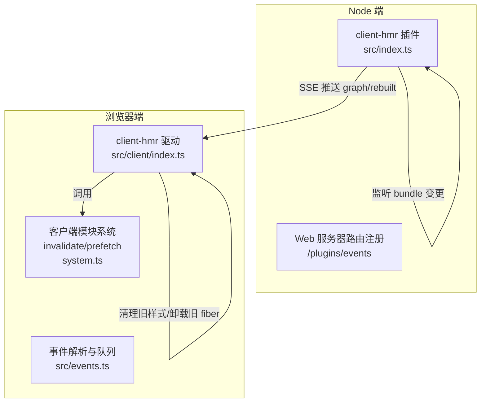
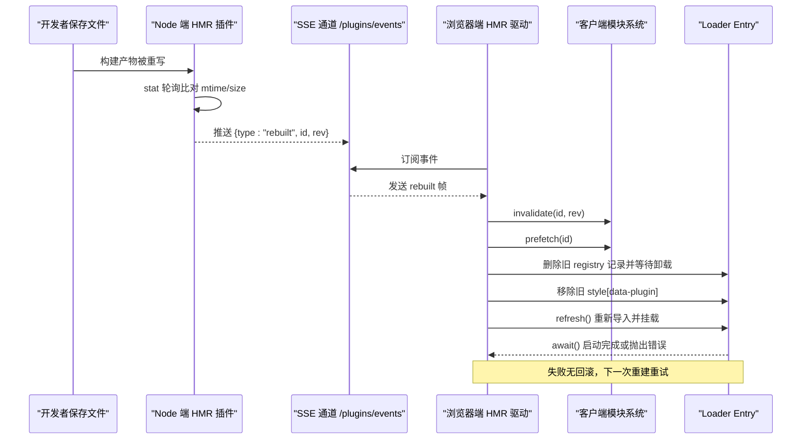
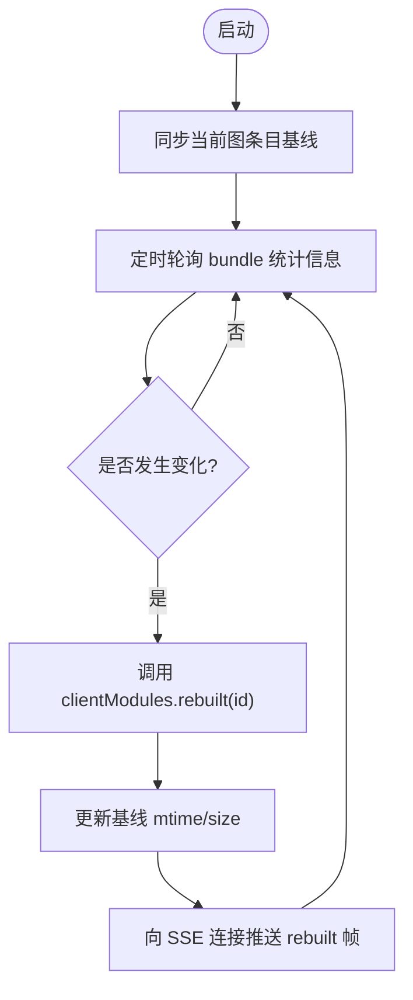
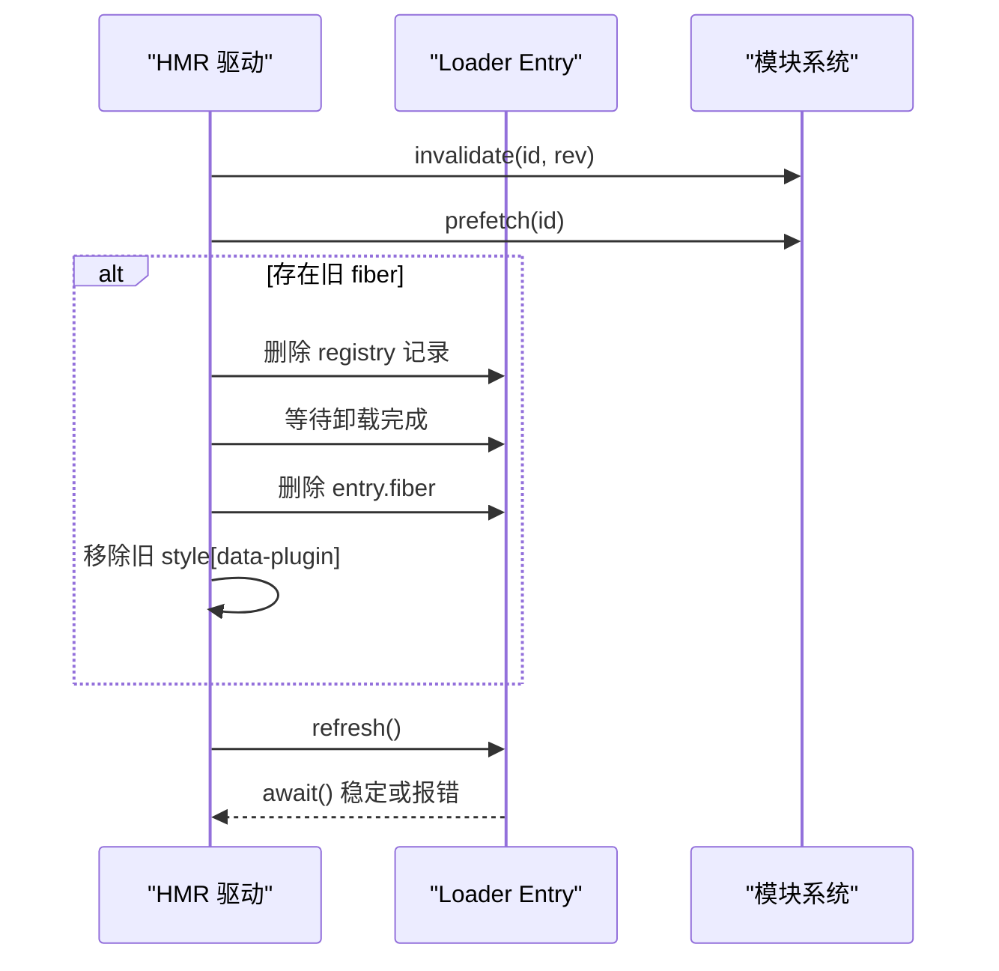
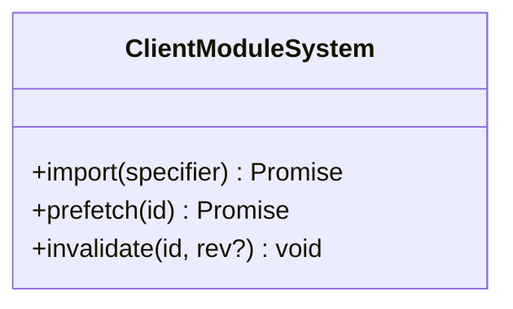
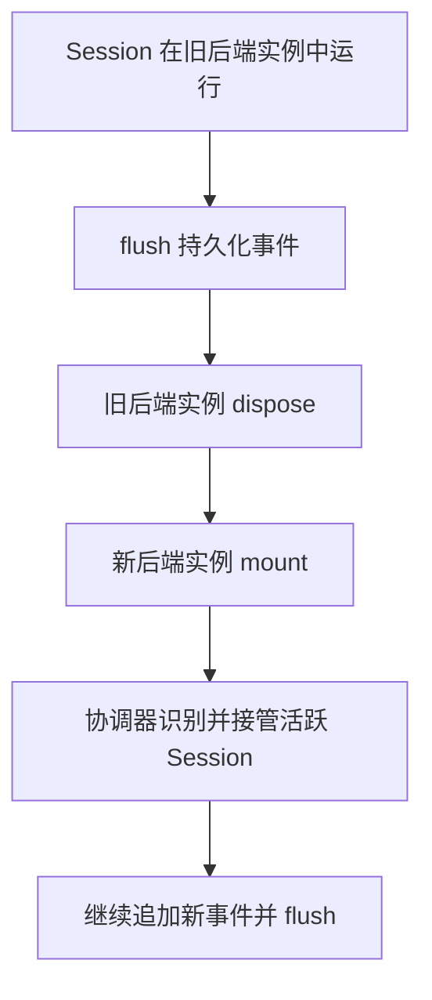
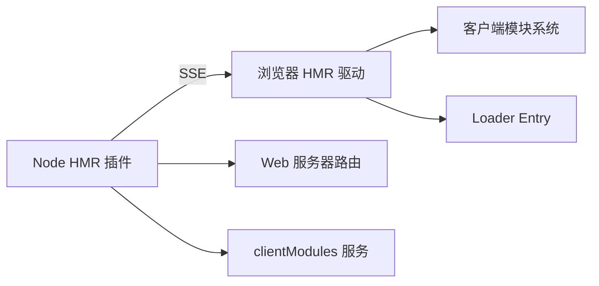

# 热重载机制

<cite>
**本文引用的文件**
- [packages/client/hmr/src/index.ts](file://packages/client/hmr/src/index.ts)
- [packages/client/hmr/src/client/index.ts](file://packages/client/hmr/src/client/index.ts)
- [packages/client/hmr/src/events.ts](file://packages/client/hmr/src/events.ts)
- [packages/client/modules/src/client/system.ts](file://packages/client/modules/src/client/system.ts)
- [packages/client/modules/tests/loader.client.spec.ts](file://packages/client/modules/tests/loader.client.spec.ts)
- [apps/web/tests/hmr-live.e2e.ts](file://apps/web/tests/hmr-live.e2e.ts)
- [apps/cli/src/profile-boot.ts](file://apps/cli/src/profile-boot.ts)
- [apps/cli/tests/profile-hmr.spec.ts](file://apps/cli/tests/profile-hmr.spec.ts)
- [docs/cordis-tutorial/06-composition-and-hmr.md](file://docs/cordis-tutorial/06-composition-and-hmr.md)
- [packages/session/session-persistence/tests/persistence.spec.ts](file://packages/session/session-persistence/tests/persistence.spec.ts)
- [packages/session/session-persistence/tests/coordinator-contract.ts](file://packages/session/session-persistence/tests/coordinator-contract.ts)
- [packages/session/session-persistence/src/coordinator.ts](file://packages/session/session-persistence/src/coordinator.ts)
- [packages/session-query/session-query-sqlite/src/index.ts](file://packages/session-query/session-query-sqlite/src/index.ts)
</cite>

## 目录
1. [简介](#简介)
2. [项目结构](#项目结构)
3. [核心组件](#核心组件)
4. [架构总览](#架构总览)
5. [详细组件分析](#详细组件分析)
6. [依赖关系分析](#依赖关系分析)
7. [性能考量](#性能考量)
8. [故障排查指南](#故障排查指南)
9. [结论](#结论)
10. [附录：自定义钩子与状态同步示例](#附录自定义钩子与状态同步示例)

## 简介
本文件系统性阐述本项目中的热重载（HMR）机制，覆盖增量编译、模块替换与状态保持策略；详述热更新生命周期（变更检测、差异计算、重新加载触发条件）；说明状态迁移与数据持久化方案，确保热重载过程中用户数据不丢失；总结限制与注意事项（全局状态、网络连接、外部资源）；并提供实现自定义热重载钩子和状态同步机制的实践指引。

## 项目结构
热重载由“服务端（Node）+ 浏览器端”两部分组成，通过系统级 SSE 通道通信，配合客户端模块系统的失效与预取能力完成模块级热替换。

图表来源
- [packages/client/hmr/src/index.ts:68-200](file://packages/client/hmr/src/index.ts#L68-L200)
- [packages/client/hmr/src/client/index.ts:98-185](file://packages/client/hmr/src/client/index.ts#L98-L185)
- [packages/client/hmr/src/events.ts:1-45](file://packages/client/hmr/src/events.ts#L1-L45)
- [packages/client/modules/src/client/system.ts:215-249](file://packages/client/modules/src/client/system.ts#L215-L249)

章节来源
- [packages/client/hmr/src/index.ts:1-202](file://packages/client/hmr/src/index.ts#L1-L202)
- [packages/client/hmr/src/client/index.ts:1-186](file://packages/client/hmr/src/client/index.ts#L1-L186)
- [packages/client/hmr/src/events.ts:1-45](file://packages/client/hmr/src/events.ts#L1-L45)

## 核心组件
- Node 端 HMR 插件：周期轮询客户端 bundle 的 mtime/size，变化时通过 clientModuleHost.rebuilt 上报，并对外暴露 /plugins/events SSE 通道广播 graph 和 rebuilt 帧。
- 浏览器端 HMR 驱动：订阅 SSE，收到 rebuilt 后执行 invalidate → prefetch → 卸载旧 fiber → 清理旧样式 → refresh 重新挂载新 fiber，串行化避免并发冲突。
- 客户端模块系统：提供 invalidate/prefetch/import 等接口，支持按 revision 选择单资源组合脚本，保证热替换可追踪且幂等。
- 会话持久化与协调器：在热重载后端实例切换时，仍保留活跃 Session 的事件流，新实例接管已物化的前缀并继续追加，确保数据不丢失。

章节来源
- [packages/client/hmr/src/index.ts:68-200](file://packages/client/hmr/src/index.ts#L68-L200)
- [packages/client/hmr/src/client/index.ts:98-185](file://packages/client/hmr/src/client/index.ts#L98-L185)
- [packages/client/modules/src/client/system.ts:215-249](file://packages/client/modules/src/client/system.ts#L215-L249)
- [packages/session/session-persistence/tests/coordinator-contract.ts:878-912](file://packages/session/session-persistence/tests/coordinator-contract.ts#L878-L912)

## 架构总览
下图展示一次完整的热重载流程：从 Node 端检测到 bundle 变更，到浏览器端接收事件、失效缓存、预取新模块、卸载旧 fiber、重新挂载新 fiber，以及下游依赖自动级联。

图表来源
- [packages/client/hmr/src/index.ts:109-156](file://packages/client/hmr/src/index.ts#L109-L156)
- [packages/client/hmr/src/index.ts:158-200](file://packages/client/hmr/src/index.ts#L158-L200)
- [packages/client/hmr/src/client/index.ts:104-140](file://packages/client/hmr/src/client/index.ts#L104-L140)
- [packages/client/modules/src/client/system.ts:232-249](file://packages/client/modules/src/client/system.ts#L232-L249)

## 详细组件分析

### Node 端 HMR 插件（包内 client-hmr 插件）
- 职责
  - 维护每个图条目的 bundle 基线（mtime/size），周期性 stat 轮询。
  - 当检测到内容变化或脏标记恢复时，调用 clientModules.rebuilt(id)。
  - 注册 /plugins/events 路由，连接时推送初始 graph，后续推送 rebuilt 帧。
- 关键行为
  - 仅对可执行 bundle 生效，map-only 变更不会触发代码重载。
  - 使用 interval 轮询以兼容网络挂载无法提供 inotify 的场景。
  - 在 effect 中管理定时器与订阅，fiber 销毁时清理。

图表来源
- [packages/client/hmr/src/index.ts:72-156](file://packages/client/hmr/src/index.ts#L72-L156)
- [packages/client/hmr/src/index.ts:158-200](file://packages/client/hmr/src/index.ts#L158-L200)

章节来源
- [packages/client/hmr/src/index.ts:1-202](file://packages/client/hmr/src/index.ts#L1-L202)

### 浏览器端 HMR 驱动
- 职责
  - 订阅 /plugins/events，解析 frame 并串行处理 rebuilt 事件。
  - 对目标 entry 执行 invalidate → prefetch → 卸载旧 fiber → 清理旧样式 → refresh → await。
- 关键行为
  - 先删除旧运行时注册，再等待卸载完成，避免 Loader 将 entry 标记为 disabled。
  - 移除旧 style[data-plugin] 标签，保证 CSS 注入顺序与幂等。
  - 失败无回滚，日志告警，下次重建重试。

图表来源
- [packages/client/hmr/src/client/index.ts:104-140](file://packages/client/hmr/src/client/index.ts#L104-L140)
- [packages/client/hmr/src/client/index.ts:142-185](file://packages/client/hmr/src/client/index.ts#L142-L185)

章节来源
- [packages/client/hmr/src/client/index.ts:1-186](file://packages/client/hmr/src/client/index.ts#L1-L186)

### 客户端模块系统（invalidate/prefetch）
- 职责
  - 维护模块工厂与加载缓存，支持按 revision 选择单资源组合脚本进行热替换。
  - invalidate 会清空工厂与缓存，prefetch 则加载并注册新工厂。
- 关键行为
  - 对非引导模块执行完全重置；引导模块保持不变。
  - 多次 prefetch 在未 invalidate 前为幂等操作。

图表来源
- [packages/client/modules/src/client/system.ts:215-249](file://packages/client/modules/src/client/system.ts#L215-L249)
- [packages/client/modules/tests/loader.client.spec.ts:458-480](file://packages/client/modules/tests/loader.client.spec.ts#L458-L480)

章节来源
- [packages/client/modules/src/client/system.ts:215-249](file://packages/client/modules/src/client/system.ts#L215-L249)
- [packages/client/modules/tests/loader.client.spec.ts:188-220](file://packages/client/modules/tests/loader.client.spec.ts#L188-L220)
- [packages/client/modules/tests/loader.client.spec.ts:458-480](file://packages/client/modules/tests/loader.client.spec.ts#L458-L480)

### 会话持久化与热重载兼容性
- 职责
  - 在热重载后端实例切换时，仍能识别并接管仍在运行的 Session，继续追加事件并持久化。
- 关键行为
  - 测试覆盖“HMR 场景下重新装载后端实例并采用已物化的会话前缀”。
  - 协调器在 flush/dispose 时安全释放状态，避免重复写入。

图表来源
- [packages/session/session-persistence/tests/coordinator-contract.ts:878-912](file://packages/session/session-persistence/tests/coordinator-contract.ts#L878-L912)
- [packages/session/session-persistence/src/coordinator.ts:1230-1260](file://packages/session/session-persistence/src/coordinator.ts#L1230-L1260)

章节来源
- [packages/session/session-persistence/tests/coordinator-contract.ts:878-912](file://packages/session/session-persistence/tests/coordinator-contract.ts#L878-L912)
- [packages/session/session-persistence/src/coordinator.ts:1230-1260](file://packages/session/session-persistence/src/coordinator.ts#L1230-L1260)
- [packages/session/session-persistence/tests/persistence.spec.ts:2062-2082](file://packages/session/session-persistence/tests/persistence.spec.ts#L2062-L2082)

### 配置与启用
- CLI 侧在缺少 hmr 层时按需插入 hmr 插件，或通过 overlay patch 显式启用。
- Web 端 e2e 验证真实 dev:web 流程下的无刷新热重载。

章节来源
- [apps/cli/src/profile-boot.ts:281-285](file://apps/cli/src/profile-boot.ts#L281-L285)
- [apps/cli/tests/profile-hmr.spec.ts:36-45](file://apps/cli/tests/profile-hmr.spec.ts#L36-L45)
- [apps/web/tests/hmr-live.e2e.ts:71-144](file://apps/web/tests/hmr-live.e2e.ts#L71-L144)

## 依赖关系分析
- 组件耦合
  - Node 端 HMR 插件依赖 webServer 与 clientModules 服务，负责检测与通知。
  - 浏览器端 HMR 驱动依赖 loader（Entry）与 modules（ClientModuleSystem），负责替换与重挂载。
  - 两者通过 events.ts 定义的帧类型与常量解耦。
- 外部依赖
  - Cordis Fiber/Registry：用于插件生命周期管理与服务提供者链式级联。
  - 客户端模块系统：提供模块加载、失效与预取能力。
- 潜在循环
  - 本插件自身也是图条目，支持自我重载；通过关闭旧 EventSource 并打开新连接避免死锁。

图表来源
- [packages/client/hmr/src/index.ts:158-200](file://packages/client/hmr/src/index.ts#L158-L200)
- [packages/client/hmr/src/client/index.ts:98-185](file://packages/client/hmr/src/client/index.ts#L98-L185)

章节来源
- [packages/client/hmr/src/index.ts:1-202](file://packages/client/hmr/src/index.ts#L1-L202)
- [packages/client/hmr/src/client/index.ts:1-186](file://packages/client/hmr/src/client/index.ts#L1-L186)

## 性能考量
- 轮询间隔：默认 500ms，可通过 pollIntervalMs 调整，平衡响应速度与 CPU 占用。
- 增量检测：基于 mtime/size 的轻量比较，仅在内容变化时进入哈希路径与重建流程。
- 串行化：浏览器端对 rebuild 事件串行处理，避免并发卸载/挂载导致的状态竞争。
- 资源清理：及时移除旧样式标签与断开 SSE 连接，防止内存泄漏。
- 级联优化：通过 provider fiber uid 串接激活世代，依赖方自动级联，无需额外 HMR 记账。

[本节为通用指导，不直接分析具体文件]

## 故障排查指南
- 常见现象
  - 页面未热更新：确认 dev:web 正在运行并改写 client 产物；检查 /plugins/events 是否返回 rebuilt 帧。
  - 热更新失败：查看浏览器控制台与 Node 日志；失败无回滚，需等待下一次重建。
  - 样式错乱：确认旧 style[data-plugin] 已被移除；CSS 注入在 refresh 阶段幂等。
- 定位步骤
  - 检查 Node 端轮询与 rebuilt 上报逻辑是否正常。
  - 检查浏览器端事件解析与串行队列是否阻塞。
  - 检查模块系统 invalidate/prefetch 是否按预期工作。
  - 若涉及后端实例热重载，确认 Session 持久化与协调器接管流程。

章节来源
- [packages/client/hmr/src/client/index.ts:142-185](file://packages/client/hmr/src/client/index.ts#L142-L185)
- [packages/client/hmr/src/index.ts:109-156](file://packages/client/hmr/src/index.ts#L109-L156)
- [packages/session/session-persistence/tests/coordinator-contract.ts:878-912](file://packages/session/session-persistence/tests/coordinator-contract.ts#L878-L912)

## 结论
本项目的热重载机制以“Node 端检测 + 浏览器端替换”的双端协作模式实现，结合客户端模块系统的失效与预取能力，实现了插件级无刷新热替换。通过严格的卸载/清理顺序与串行化处理，保证了稳定性与一致性。会话持久化与协调器确保了后端实例热重载时的数据连续性。尽管存在 React 状态丢失、失败不回滚等限制，但在开发体验与可靠性之间取得了良好平衡。

[本节为总结性内容，不直接分析具体文件]

## 附录：自定义钩子与状态同步示例
以下示例以“代码片段路径”形式给出，便于读者在仓库中定位实现位置。

- 自定义热重载钩子（Node 端）
  - 在 Node 端 HMR 插件中扩展轮询与通知逻辑，可在 rebuilt 前后插入自定义钩子，例如：
    - 钩子入口：[packages/client/hmr/src/index.ts:109-156](file://packages/client/hmr/src/index.ts#L109-L156)
    - 事件广播：[packages/client/hmr/src/index.ts:158-200](file://packages/client/hmr/src/index.ts#L158-L200)
- 自定义热重载钩子（浏览器端）
  - 在浏览器端 HMR 驱动的 reload 流程中插入钩子，例如：
    - 失效与预取：[packages/client/hmr/src/client/index.ts:104-116](file://packages/client/hmr/src/client/index.ts#L104-L116)
    - 卸载与清理：[packages/client/hmr/src/client/index.ts:118-133](file://packages/client/hmr/src/client/index.ts#L118-L133)
    - 重新挂载与错误处理：[packages/client/hmr/src/client/index.ts:133-140](file://packages/client/hmr/src/client/index.ts#L133-L140)
- 状态同步机制
  - 使用客户端模块系统的 invalidate/prefetch 控制模块加载：
    - 接口定义与实现：[packages/client/modules/src/client/system.ts:215-249](file://packages/client/modules/src/client/system.ts#L215-L249)
    - 行为验证用例：[packages/client/modules/tests/loader.client.spec.ts:458-480](file://packages/client/modules/tests/loader.client.spec.ts#L458-L480)
  - 会话数据在热重载期间不丢失：
    - 协调器接管与会话追加：[packages/session/session-persistence/tests/coordinator-contract.ts:878-912](file://packages/session/session-persistence/tests/coordinator-contract.ts#L878-L912)
    - 协调器状态释放与序列化：[packages/session/session-persistence/src/coordinator.ts:1230-1260](file://packages/session/session-persistence/src/coordinator.ts#L1230-L1260)
- 端到端验证
  - 浏览器端无刷新热重载 e2e：[apps/web/tests/hmr-live.e2e.ts:71-144](file://apps/web/tests/hmr-live.e2e.ts#L71-L144)
  - CLI 侧 HMR 配置与启用：[apps/cli/tests/profile-hmr.spec.ts:36-45](file://apps/cli/tests/profile-hmr.spec.ts#L36-L45)
  - Cordis 教程中的 HMR 概念与用法：[docs/cordis-tutorial/06-composition-and-hmr.md:23-60](file://docs/cordis-tutorial/06-composition-and-hmr.md#L23-L60)

章节来源
- [packages/client/hmr/src/index.ts:109-200](file://packages/client/hmr/src/index.ts#L109-L200)
- [packages/client/hmr/src/client/index.ts:104-140](file://packages/client/hmr/src/client/index.ts#L104-L140)
- [packages/client/modules/src/client/system.ts:215-249](file://packages/client/modules/src/client/system.ts#L215-L249)
- [packages/client/modules/tests/loader.client.spec.ts:458-480](file://packages/client/modules/tests/loader.client.spec.ts#L458-L480)
- [packages/session/session-persistence/tests/coordinator-contract.ts:878-912](file://packages/session/session-persistence/tests/coordinator-contract.ts#L878-L912)
- [packages/session/session-persistence/src/coordinator.ts:1230-1260](file://packages/session/session-persistence/src/coordinator.ts#L1230-L1260)
- [apps/web/tests/hmr-live.e2e.ts:71-144](file://apps/web/tests/hmr-live.e2e.ts#L71-L144)
- [apps/cli/tests/profile-hmr.spec.ts:36-45](file://apps/cli/tests/profile-hmr.spec.ts#L36-L45)
- [docs/cordis-tutorial/06-composition-and-hmr.md:23-60](file://docs/cordis-tutorial/06-composition-and-hmr.md#L23-L60)