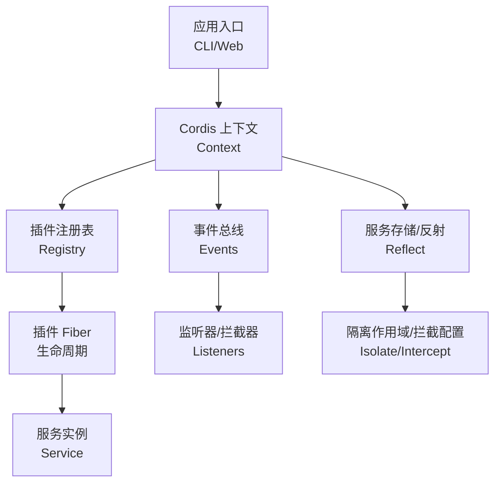
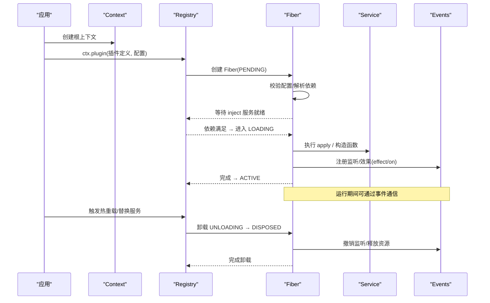
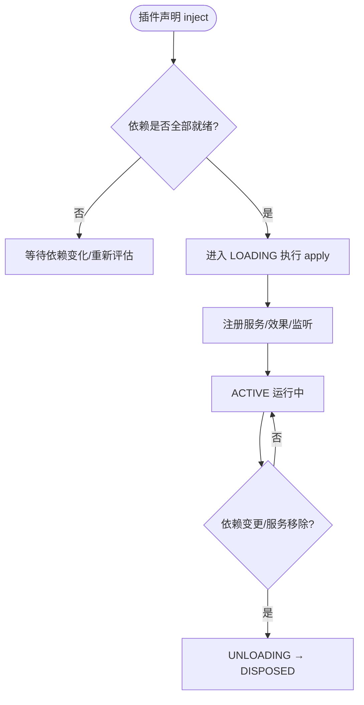
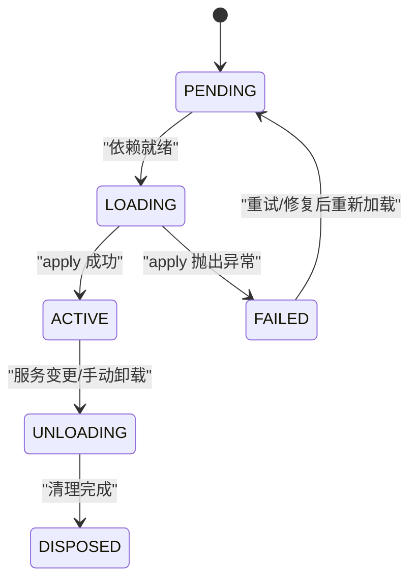
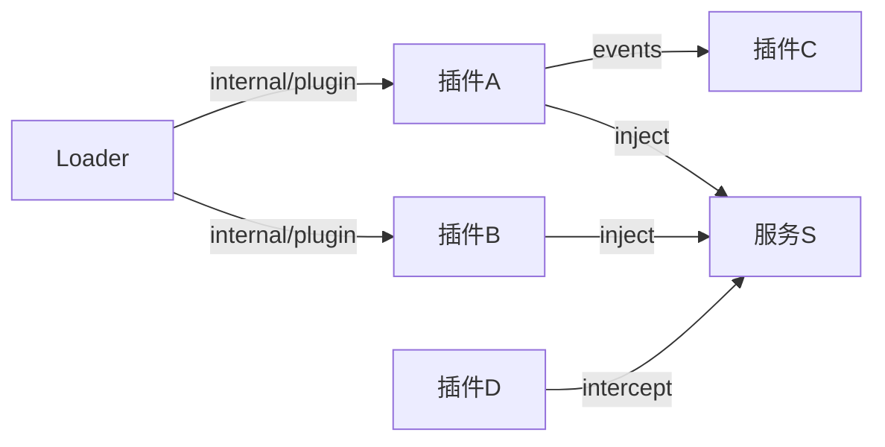

# 插件系统

<cite>
**本文引用的文件**
- [Cordis Primer](file://docs/cordis-primer.md)
- [Context API](file://docs/cordis-api/context.md)
- [Events API](file://docs/cordis-api/events.md)
- [Registry API](file://docs/cordis-api/registry.md)
- [Service API](file://docs/cordis-api/service.md)
- [Fiber（教程）](file://docs/user/develop/framework/index.zh.md)
- [第一个插件教程](file://docs/cordis-tutorial/01-first-plugin.md)
- [CLI 生命周期 e2e 测试](file://apps/cli/tests/built-bin.e2e.ts)
- [客户端运行时（动态加载/卸载）](file://packages/extensions/cordis-client-runner/src/client/runtime.ts)
- [Typert Loader（内部事件与热重载）](file://packages/typert/loader/src/index.ts)
- [包分组说明](file://packages/README.md)
</cite>

## 目录
1. [简介](#简介)
2. [项目结构](#项目结构)
3. [核心组件](#核心组件)
4. [架构总览](#架构总览)
5. [详细组件分析](#详细组件分析)
6. [依赖关系分析](#依赖关系分析)
7. [性能考量](#性能考量)
8. [故障排查指南](#故障排查指南)
9. [结论](#结论)
10. [附录](#附录)

## 简介
本文件面向 DeepSeek Harness 的插件系统，围绕 Cordis 框架的核心概念展开：服务注册、依赖注入、上下文管理；插件生命周期（加载、激活、热重载、卸载）；插件间通信（事件总线与服务发现）；配置系统与补丁机制（配置文件结构与动态覆盖）；并提供开发自定义插件的实践指引。内容基于仓库中的文档与源码注释进行系统化整理，帮助读者从入门到深入掌握插件化扩展能力。

## 项目结构
DeepSeek Harness 以 npm 包形式组织，插件生态由多个能力域组成，包括会话、工具、LLM、工作流、Web、设置等。Cordis 作为底层插件框架，被广泛集成于各子系统，提供统一的上下文、事件、服务注册与生命周期管理能力。

图表来源
- [Context API:14-96](file://docs/cordis-api/context.md#L14-L96)
- [Registry API:8-56](file://docs/cordis-api/registry.md#L8-L56)
- [Events API:8-123](file://docs/cordis-api/events.md#L8-L123)
- [Service API:14-103](file://docs/cordis-api/service.md#L14-L103)

章节来源
- [包分组说明:24-80](file://packages/README.md#L24-L80)

## 核心组件
- 上下文 Context：插件通过 ctx 访问事件、日志、反射、注册表等能力；支持 extend/isolate/intercept 创建子作用域与拦截配置。
- 注册表 Registry：负责插件加载、依赖解析与注入；支持函数/对象/类三种插件形态。
- 事件 Events：提供 emit/parallel/serial/bail/waterfall 多种分发模式，用于插件间解耦通信与策略拦截。
- 服务 Service：可声明名称并挂载到 ctx 的能力单元；支持构造后初始化、可用性检查、调用体扩展等。
- Fiber：每个插件实例的作用域，承载状态机、已验证配置与已注册效果，支持自动清理与热重载。

章节来源
- [Context API:8-162](file://docs/cordis-api/context.md#L8-L162)
- [Registry API:58-153](file://docs/cordis-api/registry.md#L58-L153)
- [Events API:8-208](file://docs/cordis-api/events.md#L8-L208)
- [Service API:14-103](file://docs/cordis-api/service.md#L14-L103)
- [Fiber（教程）:7-38](file://docs/user/develop/framework/index.zh.md#L7-L38)

## 架构总览
下图展示插件从加载到激活再到热重载与卸载的整体流程，以及事件总线在其中的协作方式。

图表来源
- [Registry API:8-56](file://docs/cordis-api/registry.md#L8-L56)
- [Fiber（教程）:7-38](file://docs/user/develop/framework/index.zh.md#L7-L38)
- [Events API:125-187](file://docs/cordis-api/events.md#L125-L187)

## 详细组件分析

### 服务注册与依赖注入
- 服务注册：通过 Service 基类或 ctx.provide 将实现挂载到 ctx 的键名下；同一作用域内不可重复提供同名服务。
- 依赖注入：插件通过 inject 声明所需服务，数组形式表示无拦截配置，对象形式可为每个服务指定拦截配置；只有当所有依赖就绪时才会进入加载阶段。
- 作用域隔离：ctx.isolate 为特定服务创建独立作用域，便于多实例或多版本共存；ctx.intercept 可在子上下文中为某服务追加拦截配置。

图表来源
- [Registry API:123-153](file://docs/cordis-api/registry.md#L123-L153)
- [Context API:235-365](file://docs/cordis-api/context.md#L235-L365)

章节来源
- [Registry API:8-56](file://docs/cordis-api/registry.md#L8-L56)
- [Context API:39-96](file://docs/cordis-api/context.md#L39-L96)
- [Context API:235-365](file://docs/cordis-api/context.md#L235-L365)

### 上下文与作用域管理
- 上下文代理：ctx 属性读取走服务解析器；extend/isolate/intercept 创建子上下文而不影响父级。
- 服务存取：get/set/provide/accessor/mixin 提供灵活的服务管理与快捷访问。
- 过滤与追踪：Context.filter 可用于事件过滤；effect 符号暴露诊断树。

章节来源
- [Context API:14-96](file://docs/cordis-api/context.md#L14-L96)
- [Context API:235-365](file://docs/cordis-api/context.md#L235-L365)

### 事件总线与插件通信
- 分发模式：emit（同步广播）、parallel（并发等待）、serial（顺序等待至 bail）、bail（同步短路）、waterfall（链式中间件）。
- 监听注册：on/once 返回处置器，随 Fiber 卸载自动移除；支持 prepend/global 选项。
- 使用建议：策略/拦截优先用事件；直接能力调用优先用服务方法。

章节来源
- [Events API:8-123](file://docs/cordis-api/events.md#L8-L123)
- [Events API:125-208](file://docs/cordis-api/events.md#L125-L208)
- [Cordis Primer:15-45](file://docs/cordis-primer.md#L15-L45)

### 插件生命周期与热重载
- 状态机：PENDING → LOADING → ACTIVE；失败进入 FAILED；卸载路径 ACTIVE → UNLOADING → DISPOSED。
- 自动清理：ctx.effect 与 ctx.on 注册的副作用会在卸载时按逆序回收。
- 热重载：内部事件 internal/plugin 驱动 loader 刷新脏集合，批量处理更新；浏览器端通过动态加载/卸载实现页面级热重载。

图表来源
- [Fiber（教程）:7-38](file://docs/user/develop/framework/index.zh.md#L7-L38)
- [Typert Loader:392-422](file://packages/typert/loader/src/index.ts#L392-L422)
- [客户端运行时:273-331](file://packages/extensions/cordis-client-runner/src/client/runtime.ts#L273-L331)

章节来源
- [Fiber（教程）:7-38](file://docs/user/develop/framework/index.zh.md#L7-L38)
- [Typert Loader:392-422](file://packages/typert/loader/src/index.ts#L392-L422)
- [客户端运行时:273-331](file://packages/extensions/cordis-client-runner/src/client/runtime.ts#L273-L331)

### 配置系统与补丁机制
- 插件配置：插件可声明 Config 标准 schema，加载时进行校验；inject 支持为依赖服务附加拦截配置。
- 组合装配：cordis.yml 列出插件条目，位置不决定加载顺序，顺序由依赖决定。
- 补丁层：bundle 或 profile 通过 cordis.patch.yml 插入/覆盖插件条目；CLI 支持 overlay patch 列表，缺失视为错误。
- 动态覆盖：intercept 允许在子上下文中对服务追加配置；provide 可替换服务实现（需在同一作用域且由提供方设置）。

章节来源
- [第一个插件教程:23-51](file://docs/cordis-tutorial/01-first-plugin.md#L23-L51)
- [Registry API:58-118](file://docs/cordis-api/registry.md#L58-L118)
- [CLI 生命周期 e2e 测试:97-131](file://apps/cli/tests/built-bin.e2e.ts#L97-L131)
- [Context API:68-96](file://docs/cordis-api/context.md#L68-L96)

### 开发自定义插件实践
- 最小插件：导出 name 与 apply(ctx)，在 cordis.yml 中引用模块名即可加载。
- 服务插件：继承 Service，在构造函数中调用 super(ctx, 'serviceName') 自动注册。
- 依赖驱动：使用 inject 声明所需服务，确保加载时机正确。
- 效果与清理：使用 ctx.effect 注册带清理函数的副作用；使用 ctx.on 注册事件监听。
- 调试与诊断：name 用于诊断与日志命名；Config 校验有助于早期发现问题。

章节来源
- [第一个插件教程:7-93](file://docs/cordis-tutorial/01-first-plugin.md#L7-L93)
- [Service API:14-103](file://docs/cordis-api/service.md#L14-L103)
- [Registry API:58-118](file://docs/cordis-api/registry.md#L58-L118)

## 依赖关系分析
- 低耦合高内聚：插件通过服务键名与事件名交互，避免直接导入具体实现。
- 作用域隔离：isolate/intercept 使多实例/多版本共存成为可能，降低冲突风险。
- 事件驱动：通过事件总线实现横切关注点（如权限、审计、遥测）的解耦。
- 热重载安全：internal/plugin 事件驱动增量刷新，保证单个插件失败不影响整体。

图表来源
- [Registry API:123-153](file://docs/cordis-api/registry.md#L123-L153)
- [Events API:125-187](file://docs/cordis-api/events.md#L125-L187)
- [Typert Loader:392-422](file://packages/typert/loader/src/index.ts#L392-L422)

章节来源
- [包分组说明:91-97](file://packages/README.md#L91-L97)

## 性能考量
- 并发与串行：parallel 适合独立任务并行；serial/bail 适合有序决策与短路。
- 懒加载：通过 inject 延迟加载，减少启动时的不必要依赖。
- 作用域复用：isolate 共享相同 label 可复用作用域，减少重复开销。
- 热重载批处理：loader 将脏项批量 flush，避免频繁重建。

[本节为通用指导，无需特定文件来源]

## 故障排查指南
- 插件未生效：检查 cordis.yml 中模块名拼写与解析路径；确认依赖服务是否已提供。
- 加载失败：查看 apply 抛出的异常；Config 校验失败会阻止插件启动。
- 热重载无效：确认 internal/plugin 事件是否触发；检查浏览器端动态加载/卸载逻辑。
- 事件未触发：确认 on/once 是否正确注册；检查事件分发模式是否符合预期。
- 服务冲突：检查 isolate/intercept 作用域是否正确；避免同作用域重复 provide。

章节来源
- [第一个插件教程:79-93](file://docs/cordis-tutorial/01-first-plugin.md#L79-L93)
- [Events API:125-187](file://docs/cordis-api/events.md#L125-L187)
- [客户端运行时:273-331](file://packages/extensions/cordis-client-runner/src/client/runtime.ts#L273-L331)

## 结论
Cordis 为 DeepSeek Harness 提供了稳定、可扩展的插件化基础设施。通过上下文、服务、事件与 Fiber 的生命周期管理，开发者可以以低耦合的方式扩展系统能力；配合配置与补丁机制，可实现灵活的部署与热重载。遵循依赖驱动、作用域隔离与事件优先的原则，能够构建出健壮且易维护的插件生态。

[本节为总结性内容，无需特定文件来源]

## 附录
- 快速上手：参考“第一个插件”教程，编写最小插件并在 cordis.yml 中引入。
- 进阶阅读：结合“Cordis Primer”理解五大核心思想与事件分发模式。
- 实战演练：利用 CLI 生命周期 e2e 测试与客户端运行时示例，理解热重载与动态加载。

章节来源
- [第一个插件教程:23-51](file://docs/cordis-tutorial/01-first-plugin.md#L23-L51)
- [Cordis Primer:7-45](file://docs/cordis-primer.md#L7-L45)
- [CLI 生命周期 e2e 测试:97-131](file://apps/cli/tests/built-bin.e2e.ts#L97-L131)
- [客户端运行时:273-331](file://packages/extensions/cordis-client-runner/src/client/runtime.ts#L273-L331)