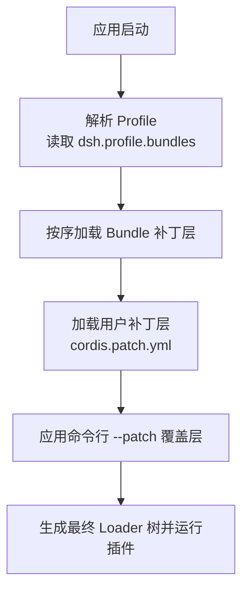
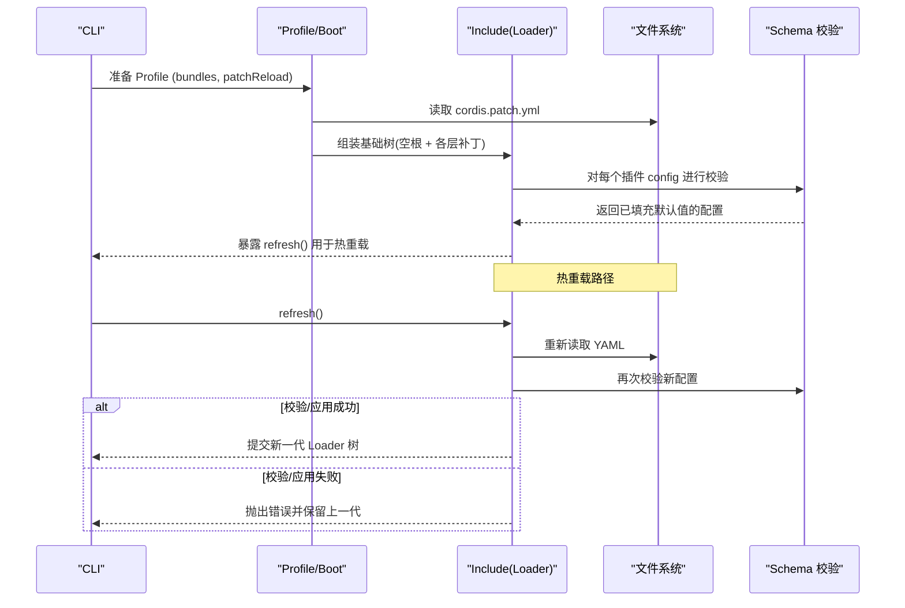
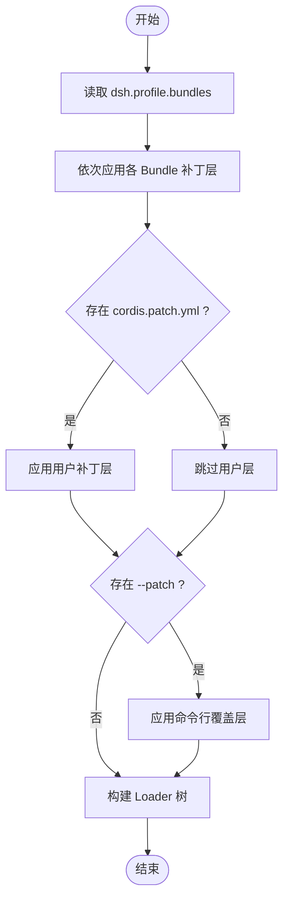
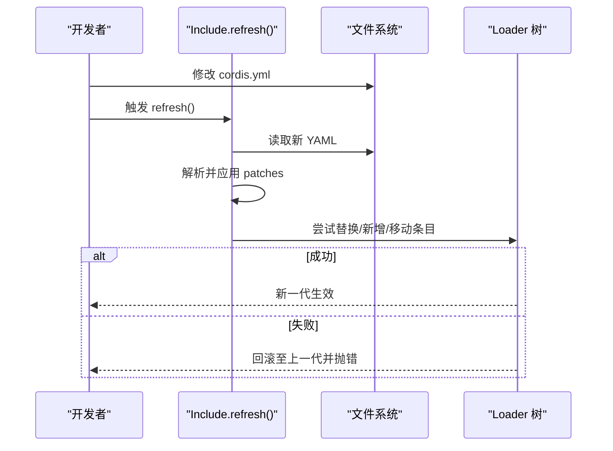
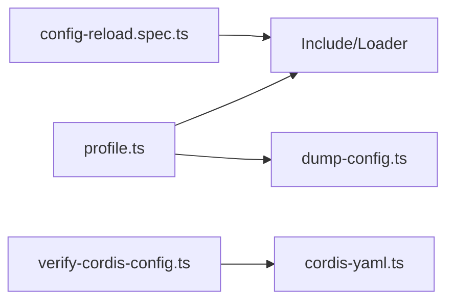

# 插件配置系统

<cite>
**本文引用的文件**
- [profile.ts](file://packages/boot/app-boot/src/profile.ts)
- [config-reload.spec.ts](file://packages/boot/app-boot/tests/config-reload.spec.ts)
- [dump-config.ts](file://apps/cli/src/dump-config.ts)
- [cordis-yaml.ts](file://scripts/cordis-yaml.ts)
- [verify-cordis-config.ts](file://scripts/verify-cordis-config.ts)
- [05-config.md](file://docs/cordis-tutorial/05-config.md)
- [config.zh.md](file://docs/user/develop/basic/config.zh.md)
</cite>

## 目录
1. [简介](#简介)
2. [项目结构](#项目结构)
3. [核心组件](#核心组件)
4. [架构总览](#架构总览)
5. [详细组件分析](#详细组件分析)
6. [依赖关系分析](#依赖关系分析)
7. [性能考虑](#性能考虑)
8. [故障排查指南](#故障排查指南)
9. [结论](#结论)
10. [附录：示例与最佳实践](#附录示例与最佳实践)

## 简介
本文件面向“插件配置系统”，系统性说明配置文件结构（YAML 规范与字段定义）、配置覆盖机制（环境特定与运行时动态覆盖）、配置验证与默认值处理（类型检查与错误恢复），以及配置热重载（增量更新与状态同步）。文档同时提供编写配置文件、使用环境变量与实现配置继承的实操指引，帮助读者在 Harness/Cordis 生态中安全、可维护地管理插件配置。

## 项目结构
配置系统围绕“Profile（配置集）—Bundle（包层）—Patch（补丁层）”三层组织：
- Profile：用户或内置的配置集合，包含 bundles 列表与 patchReload 策略。
- Bundle：以 npm 包形式提供的“补丁层”，通过 dsh.profile.bundles 顺序叠加。
- Patch：用户自定义补丁 cordis.patch.yml，以及命令行 --patch 注入的覆盖层。

图表来源
- [profile.ts:1-120](file://packages/boot/app-boot/src/profile.ts#L1-L120)
- [dump-config.ts:1-54](file://apps/cli/src/dump-config.ts#L1-L54)

章节来源
- [profile.ts:1-120](file://packages/boot/app-boot/src/profile.ts#L1-L120)
- [dump-config.ts:1-54](file://apps/cli/src/dump-config.ts#L1-L54)

## 核心组件
- Profile 发现与初始化：负责定位 profile 目录、创建默认 manifest、写入初始 cordis.patch.yml 与 pnpm-workspace.yaml。
- 补丁组合：将 bundle 层、用户层、--patch 层按顺序合并为最终的 Loader 配置树。
- 模块回退：保证不同 profile 共享安装实例，避免重复依赖导致的状态不一致。
- 配置转储：在不执行 !!js 表达式的前提下，输出完整配置组成以便诊断。
- YAML 解析与校验：支持 !!js 表达式保留、Loader 条目结构校验、插件名称解析检查。
- 热重载：Include 入口支持刷新，失败时回滚到上一代有效配置，保持服务可用。

章节来源
- [profile.ts:190-217](file://packages/boot/app-boot/src/profile.ts#L190-L217)
- [profile.ts:579-605](file://packages/boot/app-boot/src/profile.ts#L579-L605)
- [dump-config.ts:21-52](file://apps/cli/src/dump-config.ts#L21-L52)
- [cordis-yaml.ts:1-41](file://scripts/cordis-yaml.ts#L1-L41)
- [verify-cordis-config.ts:60-224](file://scripts/verify-cordis-config.ts#L60-L224)
- [config-reload.spec.ts:1-85](file://packages/boot/app-boot/tests/config-reload.spec.ts#L1-L85)

## 架构总览
下图展示了从 Profile 到 Loader 树的装配流程，以及热重载时的回滚与恢复路径。

图表来源
- [profile.ts:791-800](file://packages/boot/app-boot/src/profile.ts#L791-L800)
- [dump-config.ts:21-52](file://apps/cli/src/dump-config.ts#L21-L52)
- [config-reload.spec.ts:61-85](file://packages/boot/app-boot/tests/config-reload.spec.ts#L61-L85)

## 详细组件分析

### Profile 与补丁层组合
- Profile 由 dsh.profile.bundles 指定包层顺序；每个包通过 dsh.bundle.patch 声明其补丁文件。
- 用户补丁 cordis.patch.yml 在每个 bundle 层之后应用，支持 id-targeted 覆盖、禁用与 insert 插入。
- 命令行 --patch 文件作为最顶层覆盖，优先级最高。
- patchReload 控制用户补丁是否“live”热重载或仅在启动时加载。

图表来源
- [profile.ts:1-120](file://packages/boot/app-boot/src/profile.ts#L1-L120)
- [profile.ts:791-800](file://packages/boot/app-boot/src/profile.ts#L791-L800)

章节来源
- [profile.ts:1-120](file://packages/boot/app-boot/src/profile.ts#L1-L120)
- [profile.ts:791-800](file://packages/boot/app-boot/src/profile.ts#L791-L800)

### 配置转储与分层可视化
- dump-config 命令在不执行 !!js 表达式的情况下，输出每一层的补丁内容，便于诊断配置冲突与覆盖顺序。
- 每层标注来源（包名、用户补丁路径、--patch 路径），并以注释形式呈现。

章节来源
- [dump-config.ts:1-54](file://apps/cli/src/dump-config.ts#L1-L54)

### YAML 解析与 Loader 条目校验
- 支持 !!js 表达式作为数据保留，不直接执行，确保安全性与可调试性。
- 校验 Loader 根节点必须为数组；递归校验 group、insert、include patches 等嵌套结构。
- 校验插件 name 解析是否可达，避免未安装或拼写错误的插件导致静默失败。

章节来源
- [cordis-yaml.ts:1-41](file://scripts/cordis-yaml.ts#L1-L41)
- [verify-cordis-config.ts:60-224](file://scripts/verify-cordis-config.ts#L60-L224)

### 配置验证与默认值处理
- 插件导出 Config 类型与同名 schema（Standard Schema），Cordis 在 apply 前执行校验并填充默认值。
- 无效配置会立即报错，插件不会以半配置状态运行，保障稳定性。
- 推荐将可调参数定义为配置字段，避免硬编码。

章节来源
- [05-config.md:1-66](file://docs/cordis-tutorial/05-config.md#L1-L66)
- [config.zh.md:1-107](file://docs/user/develop/basic/config.zh.md#L1-L107)

### 热重载与状态同步
- Include 入口提供 refresh()，监听 cordis.yml 变更并重新解析、校验与应用。
- 若新版本无法导入或 apply 失败，系统自动回滚到上一代有效配置，避免服务中断。
- 对于组（group）启用/禁用，子项生命周期随父级正确启停。
- 补丁层（patches）在每次重读后重新应用，确保覆盖语义一致。

图表来源
- [config-reload.spec.ts:61-85](file://packages/boot/app-boot/tests/config-reload.spec.ts#L61-L85)
- [config-reload.spec.ts:174-218](file://packages/boot/app-boot/tests/config-reload.spec.ts#L174-L218)
- [config-reload.spec.ts:282-339](file://packages/boot/app-boot/tests/config-reload.spec.ts#L282-L339)

章节来源
- [config-reload.spec.ts:61-85](file://packages/boot/app-boot/tests/config-reload.spec.ts#L61-L85)
- [config-reload.spec.ts:174-218](file://packages/boot/app-boot/tests/config-reload.spec.ts#L174-L218)
- [config-reload.spec.ts:282-339](file://packages/boot/app-boot/tests/config-reload.spec.ts#L282-L339)

## 依赖关系分析
- Profile 层依赖 Cordis Include 与 Loader 能力，通过补丁算法组合多层配置。
- 校验脚本依赖 js-yaml 与仓库内工具函数，确保配置结构与插件解析正确。
- 热重载测试覆盖 include 刷新、条目替换、组启停、补丁层重应用等关键路径。

图表来源
- [profile.ts:1-120](file://packages/boot/app-boot/src/profile.ts#L1-L120)
- [dump-config.ts:1-54](file://apps/cli/src/dump-config.ts#L1-L54)
- [verify-cordis-config.ts:60-224](file://scripts/verify-cordis-config.ts#L60-L224)
- [cordis-yaml.ts:1-41](file://scripts/cordis-yaml.ts#L1-L41)
- [config-reload.spec.ts:1-85](file://packages/boot/app-boot/tests/config-reload.spec.ts#L1-L85)

章节来源
- [profile.ts:1-120](file://packages/boot/app-boot/src/profile.ts#L1-L120)
- [dump-config.ts:1-54](file://apps/cli/src/dump-config.ts#L1-L54)
- [verify-cordis-config.ts:60-224](file://scripts/verify-cordis-config.ts#L60-L224)
- [cordis-yaml.ts:1-41](file://scripts/cordis-yaml.ts#L1-L41)
- [config-reload.spec.ts:1-85](file://packages/boot/app-boot/tests/config-reload.spec.ts#L1-L85)

## 性能考虑
- 补丁层数量与复杂度直接影响加载时间；建议将稳定配置放入 bundle 层，仅将易变部分放在用户层。
- 热重载仅在必要时触发；批量修改建议分次保存，减少反复刷新开销。
- 使用 group 隔离大型插件族，按需启用/禁用以减少内存占用。
- 避免在补丁中使用昂贵的 !!js 表达式；如需计算，尽量前置到构建期或外部配置源。

## 故障排查指南
- 配置解析失败：检查 YAML 语法与根节点是否为数组；确认 include 的 path 与 patches 结构正确。
- 插件不可解析：核对插件 name 是否拼写正确且已安装；使用 verify 脚本定位解析问题。
- 热重载失败：查看 refresh() 抛出的错误阶段（parse/validate/import/apply），根据提示修正后再试；系统会自动回滚到上一代。
- 覆盖未生效：确认补丁顺序（bundle → 用户 → --patch），并使用 dump-config 输出逐层对比。
- 组启停异常：检查 group.disabled 切换逻辑与子项 fiber 生命周期是否符合预期。

章节来源
- [verify-cordis-config.ts:60-224](file://scripts/verify-cordis-config.ts#L60-L224)
- [config-reload.spec.ts:61-85](file://packages/boot/app-boot/tests/config-reload.spec.ts#L61-L85)
- [config-reload.spec.ts:174-218](file://packages/boot/app-boot/tests/config-reload.spec.ts#L174-L218)

## 结论
该配置系统通过 Profile/Bundle/Patch 的分层设计，结合严格的 schema 校验与安全的 !!js 表达式保留，提供了高可靠、可观测、可热重载的配置管理能力。配合 dump-config 与校验脚本，可在复杂部署场景下快速定位问题并保证一致性。

## 附录：示例与最佳实践

- 编写配置文件
  - 在 cordis.yml 中为插件添加 config 块，并在插件中导出同名 schema 与 Config 类型。
  - 参考教程中的示例，了解如何声明必填/可选字段与默认值。

- 使用环境变量
  - 在补丁层中通过 !!js 表达式读取环境变量，避免在源码中硬编码敏感信息。
  - 注意：!!js 表达式在 dump-config 中不会被执行，便于安全审计。

- 实现配置继承
  - 将通用配置放入 bundle 层，用户层仅覆盖差异部分；--patch 作为最高优先级覆盖。
  - 使用 group 对插件族进行分组，便于统一启用/禁用与隔离作用域。

- 热重载实践
  - 开发时频繁修改 cordis.yml，利用 refresh() 即时验证效果；遇到错误无需重启进程。
  - 对大型改动分批保存，观察 Loader 树变化，确保状态稳定。

章节来源
- [05-config.md:1-66](file://docs/cordis-tutorial/05-config.md#L1-L66)
- [config.zh.md:1-107](file://docs/user/develop/basic/config.zh.md#L1-L107)
- [cordis-yaml.ts:1-41](file://scripts/cordis-yaml.ts#L1-L41)
- [config-reload.spec.ts:61-85](file://packages/boot/app-boot/tests/config-reload.spec.ts#L61-L85)