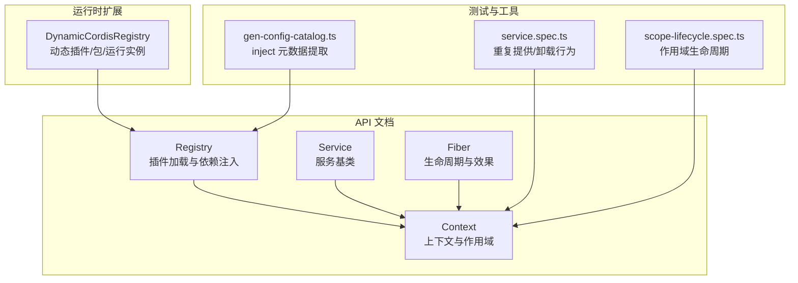
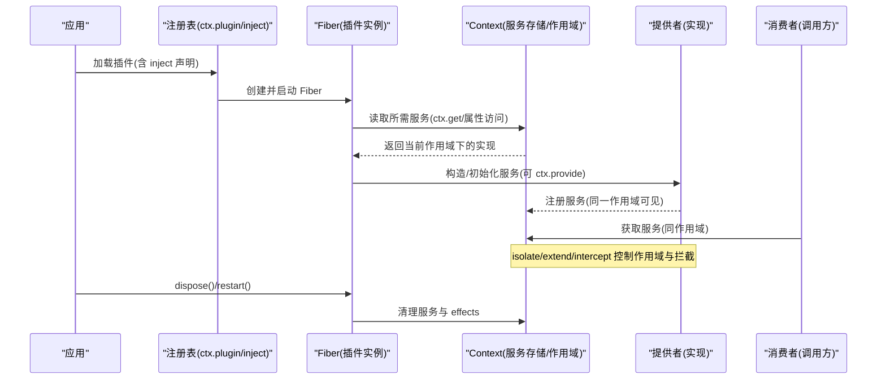
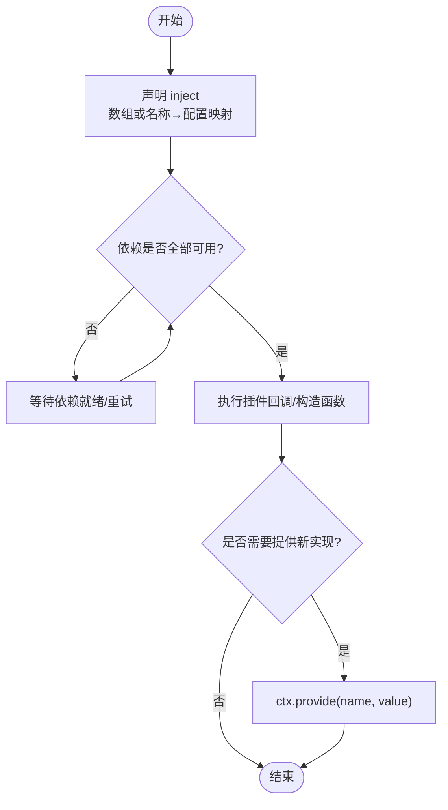
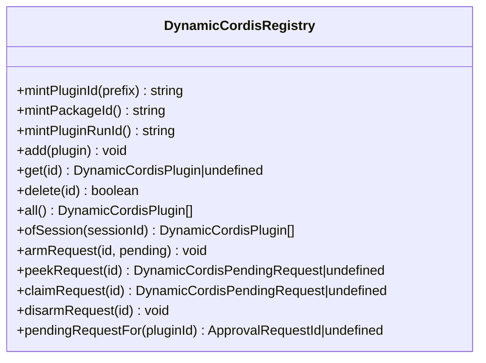
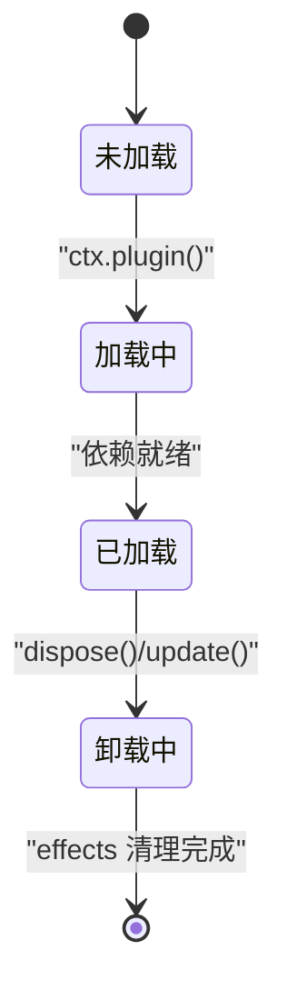
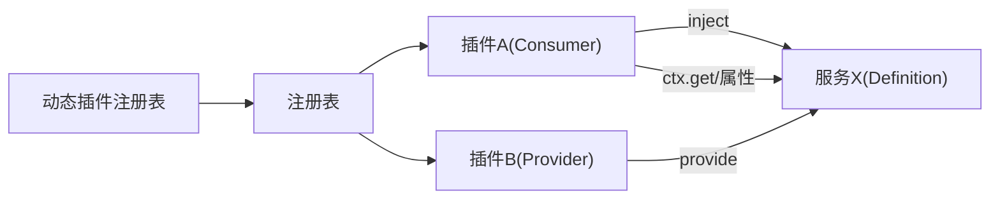

# 服务注册与依赖注入

<cite>
**本文引用的文件**
- [docs/cordis-api/registry.md](file://docs/cordis-api/registry.md)
- [docs/cordis-api/service.md](file://docs/cordis-api/service.md)
- [docs/cordis-api/context.md](file://docs/cordis-api/context.md)
- [docs/cordis-api/fiber.md](file://docs/cordis-api/fiber.md)
- [packages/extensions/cordis-host-runner/src/registry.ts](file://packages/extensions/cordis-host-runner/src/registry.ts)
- [packages/code-runtime/code-runtime/tests/service.spec.ts](file://packages/code-runtime/code-runtime/tests/service.spec.ts)
- [packages/core/agent-loop/tests/scope-lifecycle.spec.ts](file://packages/core/agent-loop/tests/scope-lifecycle.spec.ts)
- [scripts/gen-config-catalog.ts](file://scripts/gen-config-catalog.ts)
</cite>

## 目录
1. [简介](#简介)
2. [项目结构](#项目结构)
3. [核心组件](#核心组件)
4. [架构总览](#架构总览)
5. [详细组件分析](#详细组件分析)
6. [依赖关系分析](#依赖关系分析)
7. [性能考量](#性能考量)
8. [故障排查指南](#故障排查指南)
9. [结论](#结论)
10. [附录：示例与最佳实践](#附录示例与最佳实践)

## 简介
本文件围绕 Cordis 框架的服务注册与依赖注入机制，系统阐述以下主题：
- 服务注册表的工作原理：服务发现、版本管理（动态包）与冲突解决。
- 依赖注入的工作方式：静态注入（声明式）与动态注入（运行时解析）。
- 服务解耦设计：接口抽象与实现分离（Service Definition / Provider / Consumer）。
- 生命周期与作用域：单例模式与请求级作用域（基于 Fiber 与 Context 隔离）。
- 实战示例：如何注册服务、声明依赖、使用注入的服务实例。

## 项目结构
Cordis 的核心能力集中在文档与 vendor 源码中，并通过宿主运行器扩展了“动态插件”的能力。关键位置如下：
- 服务与上下文 API：docs/cordis-api/*
- 动态插件注册与版本管理：packages/extensions/cordis-host-runner/src/registry.ts
- 测试用例验证生命周期与作用域：packages/code-runtime/code-runtime/tests/service.spec.ts、packages/core/agent-loop/tests/scope-lifecycle.spec.ts
- 构建期注入元数据提取：scripts/gen-config-catalog.ts

图表来源
- [docs/cordis-api/registry.md:1-153](file://docs/cordis-api/registry.md#L1-L153)
- [docs/cordis-api/service.md:1-103](file://docs/cordis-api/service.md#L1-L103)
- [docs/cordis-api/context.md:1-365](file://docs/cordis-api/context.md#L1-L365)
- [docs/cordis-api/fiber.md:1-376](file://docs/cordis-api/fiber.md#L1-L376)
- [packages/extensions/cordis-host-runner/src/registry.ts:140-277](file://packages/extensions/cordis-host-runner/src/registry.ts#L140-L277)
- [packages/code-runtime/code-runtime/tests/service.spec.ts:74-88](file://packages/code-runtime/code-runtime/tests/service.spec.ts#L74-L88)
- [packages/core/agent-loop/tests/scope-lifecycle.spec.ts:461-491](file://packages/core/agent-loop/tests/scope-lifecycle.spec.ts#L461-L491)
- [scripts/gen-config-catalog.ts:520-544](file://scripts/gen-config-catalog.ts#L520-L544)

章节来源
- [docs/cordis-api/registry.md:1-153](file://docs/cordis-api/registry.md#L1-L153)
- [docs/cordis-api/context.md:1-365](file://docs/cordis-api/context.md#L1-L365)
- [docs/cordis-api/fiber.md:1-376](file://docs/cordis-api/fiber.md#L1-L376)
- [packages/extensions/cordis-host-runner/src/registry.ts:140-277](file://packages/extensions/cordis-host-runner/src/registry.ts#L140-L277)

## 核心组件
- 注册表（Registry）：负责插件加载、依赖声明与注入执行。支持函数/类/对象三种插件形态，以及 inject/provide/intercept 等元数据。
- 服务（Service）：以 ctx.<name> 形式暴露的具名 API；通过 Service 基类或 ctx.provide 注册，随所属 fiber 自动清理。
- 上下文（Context）：代理式服务存储与作用域容器；支持 extend/isolate/intercept 创建子上下文，实现作用域隔离与拦截配置合并。
- 纤维（Fiber）：插件运行实例，承载生命周期状态、已验证配置、effects 与清理；提供 effect/dispose/restart/update 等能力。
- 动态插件注册表（DynamicCordisRegistry）：进程内动态插件/包/运行实例的注册与版本管理，维护稳定 ID、当前激活版本与待审批请求。

章节来源
- [docs/cordis-api/registry.md:1-153](file://docs/cordis-api/registry.md#L1-L153)
- [docs/cordis-api/service.md:1-103](file://docs/cordis-api/service.md#L1-L103)
- [docs/cordis-api/context.md:1-365](file://docs/cordis-api/context.md#L1-L365)
- [docs/cordis-api/fiber.md:1-376](file://docs/cordis-api/fiber.md#L1-L376)
- [packages/extensions/cordis-host-runner/src/registry.ts:140-277](file://packages/extensions/cordis-host-runner/src/registry.ts#L140-L277)

## 架构总览
下图展示了从插件加载到服务注入、再到作用域隔离与生命周期管理的整体流程。

图表来源
- [docs/cordis-api/registry.md:1-153](file://docs/cordis-api/registry.md#L1-L153)
- [docs/cordis-api/context.md:1-365](file://docs/cordis-api/context.md#L1-L365)
- [docs/cordis-api/fiber.md:1-376](file://docs/cordis-api/fiber.md#L1-L376)

## 详细组件分析

### 服务注册表与依赖注入
- 插件形态：函数/类/对象，均支持 name、Config、inject、provide、intercept 等元数据。
- 注入方式：
  - 静态注入：在插件定义中声明 inject（数组或键值映射），由框架在加载时校验并等待依赖就绪后执行回调。
  - 动态注入：在运行时通过 ctx.inject(deps, callback) 或 ctx.get(name) 按需获取服务。
- 拦截配置：通过 ctx.intercept(name, config) 为下游插件提供按服务的拦截配置，支持继承合并。

图表来源
- [docs/cordis-api/registry.md:1-153](file://docs/cordis-api/registry.md#L1-L153)
- [docs/cordis-api/context.md:1-365](file://docs/cordis-api/context.md#L1-L365)

章节来源
- [docs/cordis-api/registry.md:1-153](file://docs/cordis-api/registry.md#L1-L153)
- [docs/cordis-api/context.md:1-365](file://docs/cordis-api/context.md#L1-L365)
- [scripts/gen-config-catalog.ts:520-544](file://scripts/gen-config-catalog.ts#L520-L544)

### 服务发现、版本管理与冲突解决
- 服务发现：通过 ctx.get(name, strict?) 或属性访问在作用域链中查找；strict=true 仅返回当前活跃 fiber 提供的实现。
- 版本管理（动态插件）：
  - DynamicCordisRegistry 维护稳定的 pluginId、packageId、runId 与 pending approval 索引。
  - 支持新增/更新 package，记录 currentPackageId/nextPackageId，并在用户授权后切换激活版本。
- 冲突解决：
  - 同一作用域内重复 provide 会报错（防止覆盖）。
  - 通过 isolate(name, label) 将同名服务隔离到独立作用域，避免跨作用域冲突。
  - intercept 允许在不同作用域为同一服务注入不同配置。

图表来源
- [packages/extensions/cordis-host-runner/src/registry.ts:140-277](file://packages/extensions/cordis-host-runner/src/registry.ts#L140-L277)

章节来源
- [docs/cordis-api/context.md:1-365](file://docs/cordis-api/context.md#L1-L365)
- [packages/extensions/cordis-host-runner/src/registry.ts:140-277](file://packages/extensions/cordis-host-runner/src/registry.ts#L140-L277)
- [packages/code-runtime/code-runtime/tests/service.spec.ts:74-88](file://packages/code-runtime/code-runtime/tests/service.spec.ts#L74-L88)

### 依赖注入：静态注入 vs 动态注入
- 静态注入：
  - 在插件定义中声明 inject，框架保证依赖可用后再执行插件逻辑。
  - 支持数组形式（无拦截配置）与对象形式（名称→拦截配置）。
- 动态注入：
  - 使用 ctx.inject(deps, callback) 在运行时声明依赖并执行回调。
  - 使用 ctx.get(name, strict?) 进行可选/严格查找，适合条件化依赖。

章节来源
- [docs/cordis-api/registry.md:1-153](file://docs/cordis-api/registry.md#L1-L153)
- [docs/cordis-api/context.md:1-365](file://docs/cordis-api/context.md#L1-L365)

### 服务解耦：接口抽象与实现分离
- 角色划分：
  - Service Definition：定义服务键与类型契约（不引入具体实现）。
  - Service Provider：插件提供具体实现，注册到对应服务键。
  - Consumer：消费方仅依赖服务键，不感知具体实现。
- 优势：Provider 与 Consumer 可独立演进，替换实现不影响调用方。

章节来源
- [docs/cordis-api/service.md:1-103](file://docs/cordis-api/service.md#L1-L103)

### 生命周期与作用域管理
- 作用域：
  - ctx.extend(meta)：创建携带额外元数据的子上下文。
  - ctx.isolate(name, label)：为指定服务创建独立作用域，避免父作用域影响。
  - ctx.intercept(name, config)：为下游插件叠加该服务的拦截配置。
- 生命周期：
  - ctx.provide(name, value)：在当前 fiber 的作用域内注册服务，fiber 卸载时自动清理。
  - ctx.accessor/mixin：定义计算属性或直接混入方法到 ctx。
  - Fiber.effect：注册清理感知的副作用，fiber 卸载时按逆序释放。
  - Fiber.dispose/restart/update：卸载、重启与热更新配置。

图表来源
- [docs/cordis-api/fiber.md:1-376](file://docs/cordis-api/fiber.md#L1-L376)
- [docs/cordis-api/context.md:1-365](file://docs/cordis-api/context.md#L1-L365)

章节来源
- [docs/cordis-api/context.md:1-365](file://docs/cordis-api/context.md#L1-L365)
- [docs/cordis-api/fiber.md:1-376](file://docs/cordis-api/fiber.md#L1-L376)
- [packages/core/agent-loop/tests/scope-lifecycle.spec.ts:461-491](file://packages/core/agent-loop/tests/scope-lifecycle.spec.ts#L461-L491)

## 依赖关系分析
- 插件对服务存在显式依赖（inject），框架在加载阶段确保依赖可用。
- 服务通过 ctx.provide 注册到当前 fiber 的作用域，被同作用域消费者共享。
- 动态插件通过 DynamicCordisRegistry 管理版本与激活态，结合审批流程安全切换。

图表来源
- [docs/cordis-api/registry.md:1-153](file://docs/cordis-api/registry.md#L1-L153)
- [docs/cordis-api/context.md:1-365](file://docs/cordis-api/context.md#L1-L365)
- [packages/extensions/cordis-host-runner/src/registry.ts:140-277](file://packages/extensions/cordis-host-runner/src/registry.ts#L140-L277)

章节来源
- [docs/cordis-api/registry.md:1-153](file://docs/cordis-api/registry.md#L1-L153)
- [docs/cordis-api/context.md:1-365](file://docs/cordis-api/context.md#L1-L365)
- [packages/extensions/cordis-host-runner/src/registry.ts:140-277](file://packages/extensions/cordis-host-runner/src/registry.ts#L140-L277)

## 性能考量
- 依赖就绪检查与回调重跑：当依赖变化时，inject 回调会被卸载并重载，注意避免频繁重载带来的开销。
- 作用域隔离：isolate 可减少全局污染，但会增加作用域查找成本；合理划分作用域粒度。
- 动态插件切换：版本切换需经过审批与激活流程，尽量批量变更以减少切换次数。
- 资源清理：effect 与 provide 的生命周期绑定 fiber，确保及时释放以避免内存泄漏。

[本节为通用指导，无需特定文件引用]

## 故障排查指南
- 重复提供错误：在同一作用域重复 provide 同名服务会抛出异常。可通过 isolate 拆分作用域或确保唯一提供点。
- 依赖缺失：inject 声明的依赖不可用时，插件不会启动；检查上游插件是否正确 provide。
- 作用域问题：ctx.get(strict=true) 仅返回当前活跃 fiber 提供的实现；若需要跨作用域访问，调整 isolate/extend 策略。
- 动态插件失败：查看 DynamicCordisRegistry 中的 latestRun 与 reportedRuntimeErrors，定位失败原因与审批状态。

章节来源
- [packages/code-runtime/code-runtime/tests/service.spec.ts:74-88](file://packages/code-runtime/code-runtime/tests/service.spec.ts#L74-L88)
- [packages/extensions/cordis-host-runner/src/registry.ts:140-277](file://packages/extensions/cordis-host-runner/src/registry.ts#L140-L277)

## 结论
Cordis 通过“注册表 + 上下文 + 纤维”的组合，提供了强类型、可组合、可隔离的服务注册与依赖注入体系。配合动态插件注册表，可实现安全的版本管理与灰度切换。遵循 Service Definition/Provider/Consumer 的解耦原则，可在复杂系统中保持高内聚低耦合，同时借助作用域与生命周期管理保障稳定性与可维护性。

[本节为总结，无需特定文件引用]

## 附录：示例与最佳实践
- 注册服务（在插件中提供实现）
  - 参考路径：[docs/cordis-api/context.md:286-314](file://docs/cordis-api/context.md#L286-L314)
- 声明依赖（静态注入）
  - 参考路径：[docs/cordis-api/registry.md:1-153](file://docs/cordis-api/registry.md#L1-L153)
- 动态注入与可选获取
  - 参考路径：[docs/cordis-api/context.md:237-259](file://docs/cordis-api/context.md#L237-L259)
- 作用域隔离与拦截
  - 参考路径：[docs/cordis-api/context.md:39-96](file://docs/cordis-api/context.md#L39-L96)
- 生命周期与清理
  - 参考路径：[docs/cordis-api/fiber.md:8-37](file://docs/cordis-api/fiber.md#L8-L37)
- 动态插件版本管理
  - 参考路径：[packages/extensions/cordis-host-runner/src/registry.ts:140-277](file://packages/extensions/cordis-host-runner/src/registry.ts#L140-L277)
- 构建期注入元数据提取
  - 参考路径：[scripts/gen-config-catalog.ts:520-544](file://scripts/gen-config-catalog.ts#L520-L544)

[本节为示例指引，无需特定代码片段]