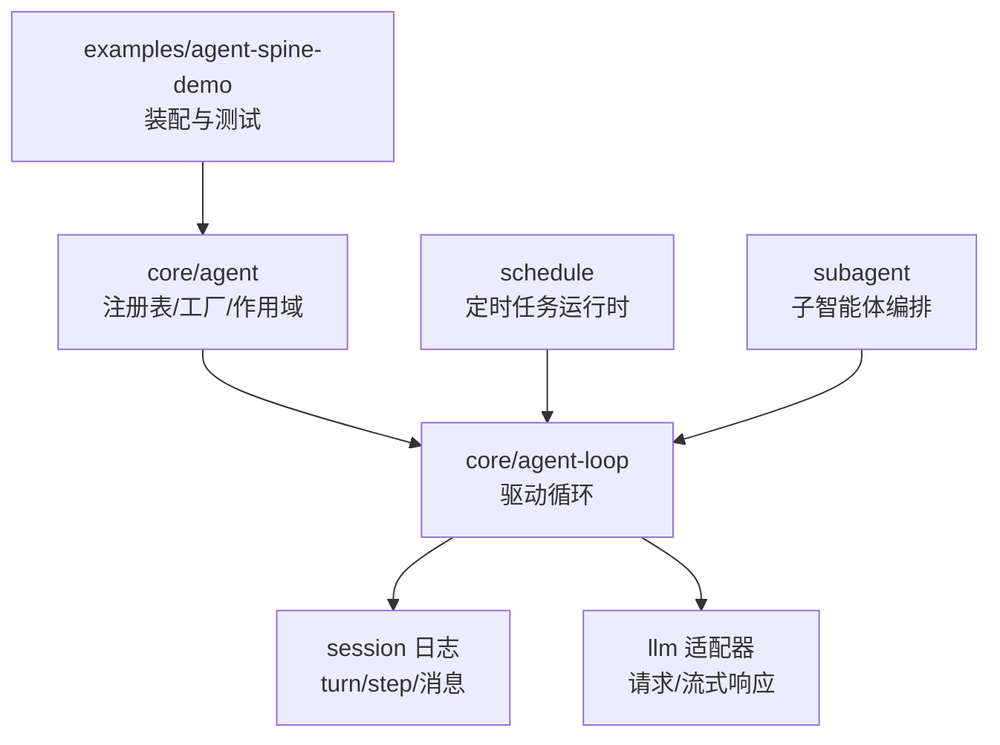
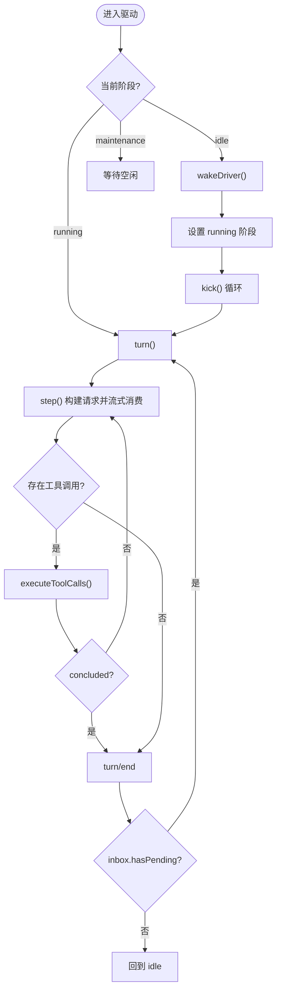
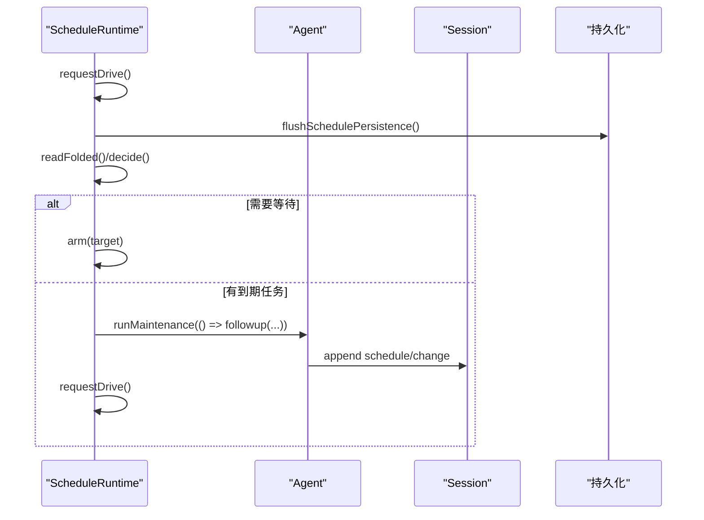
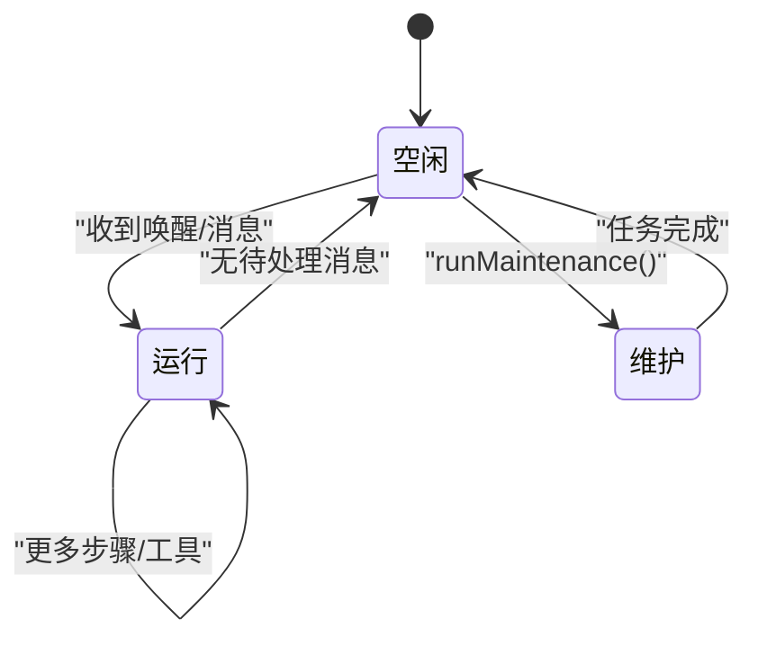
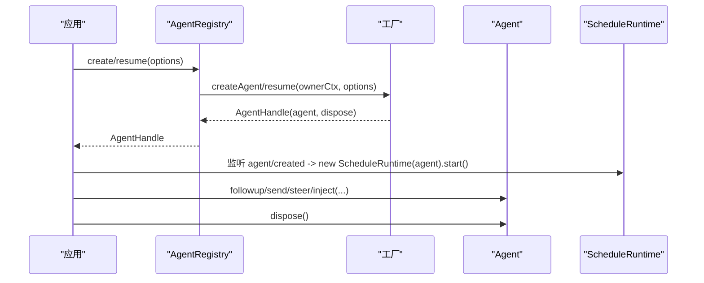
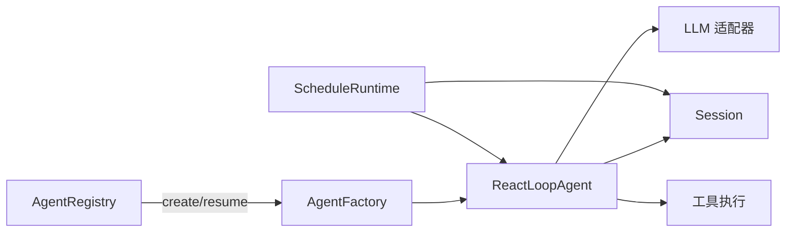

# 智能体生命周期

<cite>
**本文引用的文件**
- [packages/core/agent/src/index.ts](file://packages/core/agent/src/index.ts)
- [packages/core/agent/src/types.ts](file://packages/core/agent/src/types.ts)
- [packages/core/agent-loop/src/agent.ts](file://packages/core/agent-loop/src/agent.ts)
- [packages/core/agent-loop/src/runtime-context.ts](file://packages/core/agent-loop/src/runtime-context.ts)
- [packages/schedule/src/index.ts](file://packages/schedule/src/index.ts)
- [packages/schedule/src/runtime.ts](file://packages/schedule/src/runtime.ts)
- [packages/subagent/subagent/src/continuation.ts](file://packages/subagent/subagent/src/continuation.ts)
- [packages/examples/agent-spine-demo/tests/agent-core.spec.ts](file://packages/examples/agent-spine-demo/tests/agent-core.spec.ts)
</cite>

## 目录
1. [简介](#简介)
2. [项目结构](#项目结构)
3. [核心组件](#核心组件)
4. [架构总览](#架构总览)
5. [详细组件分析](#详细组件分析)
6. [依赖关系分析](#依赖关系分析)
7. [性能考量](#性能考量)
8. [故障排查指南](#故障排查指南)
9. [结论](#结论)
10. [附录：自定义智能体创建与管理示例](#附录自定义智能体创建与管理示例)

## 简介
本文件系统性阐述 DeepSeek Harness 中“智能体（Agent）”的生命周期管理，覆盖接口设计、驱动循环、调度器集成、状态机、上下文隔离与资源共享，以及错误处理与可恢复性。重点包括：
- Agent 接口的职责边界与实现要点
- agent-loop 驱动的工作队列、轮次/步骤推进、消息入队与唤醒机制
- schedule 驱动的定时任务如何以 followup 形式注入智能体工作流
- 智能体的活跃、暂停、终止状态及其转换条件
- 基于作用域与会话日志的上下文隔离与共享策略
- 通过工厂与注册表创建、恢复、销毁智能体的完整流程

## 项目结构
围绕智能体生命周期的关键代码分布在以下包：
- core/agent：智能体注册表、工厂抽象、作用域与事件分发
- core/agent-loop：默认驱动实现，负责轮次/步骤推进、LLM 调用、工具执行
- schedule：定时任务运行时，将到期提醒以用户消息形式注入智能体
- subagent：子智能体激活与状态推导，体现父子关系与资源回收
- examples/agent-spine-demo：端到端装配与测试，展示配置化启动与运行



图表来源
- [packages/core/agent/src/index.ts:246-448](file://packages/core/agent/src/index.ts#L246-L448)
- [packages/core/agent-loop/src/agent.ts:68-104](file://packages/core/agent-loop/src/agent.ts#L68-L104)
- [packages/schedule/src/index.ts:44-77](file://packages/schedule/src/index.ts#L44-L77)
- [packages/schedule/src/runtime.ts:77-140](file://packages/schedule/src/runtime.ts#L77-L140)

章节来源
- [packages/core/agent/src/index.ts:246-448](file://packages/core/agent/src/index.ts#L246-L448)
- [packages/core/agent-loop/src/agent.ts:68-104](file://packages/core/agent-loop/src/agent.ts#L68-L104)
- [packages/schedule/src/index.ts:44-77](file://packages/schedule/src/index.ts#L44-L77)
- [packages/schedule/src/runtime.ts:77-140](file://packages/schedule/src/runtime.ts#L77-L140)

## 核心组件
- 智能体注册表（AgentRegistry）
  - 提供 create/resume 工厂委托、enter/announce/register 等有序生命周期原语
  - 维护 live 智能体集合、所有者关系、根节点查询
  - 提供 withInitiator/withoutInitiator 的作用域传播，用于因果归属与清理
- 驱动循环（ReactLoopAgent）
  - 实现 Agent 接口，封装 inbox、phase（idle/maintenance/running）、turn/step 推进
  - 组装系统提示、构建 LLM 请求、流式消费、工具调用、错误重试
  - 暴露 send/followup/steer/inject/cancel/runMaintenance/whenIdle 等能力
- 调度运行时（ScheduleRuntime）
  - 对每个根智能体维护定时器与事务化驱动
  - 读取 session 日志折叠为待触发计划，决策 one-shot 或 fixed-rate 批次
  - 通过 runMaintenance 将提醒渲染为用户消息并 followup 到智能体
- 子智能体激活（Subagent Continuation）
  - 管理可继续子智能体的准入、驻留态、父子关系与回收
  - 根据 Agent.status 与已接受但未 drained 的任务推导 running/waiting/settled

章节来源
- [packages/core/agent/src/index.ts:246-698](file://packages/core/agent/src/index.ts#L246-L698)
- [packages/core/agent-loop/src/agent.ts:68-544](file://packages/core/agent-loop/src/agent.ts#L68-L544)
- [packages/schedule/src/runtime.ts:77-325](file://packages/schedule/src/runtime.ts#L77-L325)
- [packages/subagent/subagent/src/continuation.ts:915-940](file://packages/subagent/subagent/src/continuation.ts#L915-L940)

## 架构总览
下图展示了从创建到销毁的关键路径：注册表创建/恢复 → 驱动循环启动 → 调度器接入 → 轮次/步骤推进 → 定时任务注入 → 销毁与回收。

```mermaid
sequenceDiagram
participant Owner as "所有者"
participant Reg as "AgentRegistry"
participant Loop as "ReactLoopAgent"
participant Sched as "ScheduleRuntime"
participant Sess as "Session"
participant LLM as "LLM 适配器"
Owner->>Reg : create/resume(options)
Reg-->>Owner : AgentHandle(agent, dispose)
Note over Owner,Reg : 注册表委托工厂完成 setup、发布、启动循环
Owner->>Loop : followup/send/steer/inject(...)
Loop->>Sess : append turn/start, step/start, user/message
Loop->>LLM : stream(request)
LLM-->>Loop : chunk*
Loop->>Sess : assistant/chunk, assistant/message
Loop->>Loop : executeToolCalls()
Loop-->>Owner : whenIdle() 等待空闲
Sched->>Loop : runMaintenance(() => followup(reminder))
Loop->>Sess : append schedule/change
```

图表来源
- [packages/core/agent/src/index.ts:396-421](file://packages/core/agent/src/index.ts#L396-L421)
- [packages/core/agent-loop/src/agent.ts:120-147](file://packages/core/agent-loop/src/agent.ts#L120-L147)
- [packages/core/agent-loop/src/agent.ts:252-337](file://packages/core/agent-loop/src/agent.ts#L252-L337)
- [packages/core/agent-loop/src/agent.ts:339-436](file://packages/core/agent-loop/src/agent.ts#L339-L436)
- [packages/schedule/src/runtime.ts:230-323](file://packages/schedule/src/runtime.ts#L230-L323)

## 详细组件分析

### 智能体接口与驱动循环（ReactLoopAgent）
- 状态机
  - idle：无活动；接收消息后进入 running
  - maintenance：外部维护任务占用空闲期；完成后若仍有待唤醒则重新驱动
  - running：持有 abort controller，推进 turn/step，记录 lastTurn
- 消息入队与唤醒
  - send/followup/steer/inject 统一走 inbox.splice，按 next-turn/next-step 目标插入
  - wakeup=true 时，即使处于非 idle 且已中止的活动，也会标记 wakeRequested，收敛后重放
- 轮次与步骤
  - turn：写入 turn/start/end，聚合多个 step
  - step：preStep 组装上下文与消息，buildRequest 生成冻结请求，stream 消费并追加 assistant/chunk/message
  - 工具调用：executeToolCalls 返回 concluded 控制是否结束本轮
- 错误与取消
  - 异常被结构化记录为 agent/error，并在 turn/end 中携带 reason
  - cancel 支持 keepInbox 保留未处理消息；abort 信号贯穿请求与工具执行
- 上下文投影
  - RuntimeContextProjection 跟踪最近一次 runtime context 快照，避免重复写入



图表来源
- [packages/core/agent-loop/src/agent.ts:106-118](file://packages/core/agent-loop/src/agent.ts#L106-L118)
- [packages/core/agent-loop/src/agent.ts:171-200](file://packages/core/agent-loop/src/agent.ts#L171-L200)
- [packages/core/agent-loop/src/agent.ts:217-230](file://packages/core/agent-loop/src/agent.ts#L217-L230)
- [packages/core/agent-loop/src/agent.ts:252-337](file://packages/core/agent-loop/src/agent.ts#L252-L337)
- [packages/core/agent-loop/src/agent.ts:339-436](file://packages/core/agent-loop/src/agent.ts#L339-L436)

章节来源
- [packages/core/agent-loop/src/agent.ts:68-544](file://packages/core/agent-loop/src/agent.ts#L68-L544)
- [packages/core/agent-loop/src/runtime-context.ts:24-77](file://packages/core/agent-loop/src/runtime-context.ts#L24-L77)

### 调度器驱动（ScheduleRuntime）
- 工作队列与定时器
  - 通过 requestDrive 合并多次触发，串行执行 driveOnce
  - 使用 setTimeout 安全地 arm 下一个唤醒点，避免超时精度问题
- 决策与持久化
  - flushSchedulePersistence 保证变更落盘后再做决策
  - foldScheduleEvents 将 session 事件折叠为 active 列表，计算 dueDecision
- 与智能体交互
  - 在 runMaintenance 中构造提醒文本并通过 agent.followup 注入
  - 追加 schedule/change 事件记录版本与操作类型
- 容错
  - 对持久化失败、折叠失败、决策失败进行告警与降级
  - 空闲等待通过 agent.whenIdle 与 stop promise 竞争



图表来源
- [packages/schedule/src/runtime.ts:97-140](file://packages/schedule/src/runtime.ts#L97-L140)
- [packages/schedule/src/runtime.ts:230-323](file://packages/schedule/src/runtime.ts#L230-L323)
- [packages/schedule/src/index.ts:44-77](file://packages/schedule/src/index.ts#L44-L77)

章节来源
- [packages/schedule/src/runtime.ts:77-325](file://packages/schedule/src/runtime.ts#L77-L325)
- [packages/schedule/src/index.ts:44-77](file://packages/schedule/src/index.ts#L44-L77)

### 智能体状态管理
- 可见状态
  - Agent.status：idle 或 running；maintenance 对外也视为 idle
- 内部相位
  - idle：无活动，lastTurn 记录最近轮次
  - maintenance：外部维护任务持有，wakeRequested 用于收敛后重放
  - running：拥有 AbortController，turn/step 推进，wakeRequested 用于下一轮
- 子智能体驻留态
  - running：存在活跃准入、开放轮次或已接受但尚未 drain 的唤醒任务
  - waiting：存在自有子智能体
  - settled：无活跃任务且无子智能体



图表来源
- [packages/core/agent-loop/src/agent.ts:38-47](file://packages/core/agent-loop/src/agent.ts#L38-L47)
- [packages/core/agent-loop/src/agent.ts:106-118](file://packages/core/agent-loop/src/agent.ts#L106-L118)
- [packages/subagent/subagent/src/continuation.ts:927-940](file://packages/subagent/subagent/src/continuation.ts#L927-L940)

章节来源
- [packages/core/agent-loop/src/agent.ts:38-47](file://packages/core/agent-loop/src/agent.ts#L38-L47)
- [packages/core/agent-loop/src/agent.ts:106-118](file://packages/core/agent-loop/src/agent.ts#L106-L118)
- [packages/subagent/subagent/src/continuation.ts:927-940](file://packages/subagent/subagent/src/continuation.ts#L927-L940)

### 上下文隔离与资源共享
- 作用域隔离
  - Agent.ctx 作为智能体作用域上下文，插件与服务在其下注册
  - withInitiator/withoutInitiator 控制异步链中的因果归属，避免跨智能体泄漏
- 会话日志共享
  - 所有 turn/step、消息、请求头、工具结果均写入 Session，作为唯一事实源
  - 驱动循环通过 deriveMessages 与 surface 机制生成模型可见历史
- 动态上下文快照
  - RuntimeContextProjection 追踪最近一次 runtime context 快照，仅在变化时追加
  - 替换事件会失效旧快照，确保一致性

章节来源
- [packages/core/agent/src/index.ts:273-288](file://packages/core/agent/src/index.ts#L273-L288)
- [packages/core/agent/src/index.ts:319-349](file://packages/core/agent/src/index.ts#L319-L349)
- [packages/core/agent-loop/src/runtime-context.ts:24-77](file://packages/core/agent-loop/src/runtime-context.ts#L24-L77)

### 创建、初始化、调度、执行与销毁
- 创建与恢复
  - AgentRegistry.create/resume 委托工厂完成 unpublished setup、commit、发布与启动
  - 支持 seed 历史与 meta 元数据，保证幂等与回滚
- 调度接入
  - 监听 agent/created，为根智能体创建 ScheduleRuntime 并 start
  - 监听 agent/status 与 schedule/change 事件，必要时 requestDrive
- 执行
  - 驱动循环按 turn/step 推进，流式消费 LLM 输出，执行工具，追加结果
- 销毁
  - AgentHandle.dispose 停止循环、等待退出、注销、移除会话、解绑作用域
  - ScheduleRuntime.dispose 停止定时器、等待 pending 任务



图表来源
- [packages/core/agent/src/index.ts:396-421](file://packages/core/agent/src/index.ts#L396-L421)
- [packages/schedule/src/index.ts:44-77](file://packages/schedule/src/index.ts#L44-L77)

章节来源
- [packages/core/agent/src/index.ts:396-421](file://packages/core/agent/src/index.ts#L396-L421)
- [packages/schedule/src/index.ts:44-77](file://packages/schedule/src/index.ts#L44-L77)

## 依赖关系分析
- 松耦合
  - 注册表仅暴露工厂接口，具体驱动由 agent-loop 包实现
  - 调度器通过 Agent.runMaintenance 与 followup 与驱动交互，不直接侵入
- 强内聚
  - 驱动循环集中管理 phase、inbox、turn/step、LLM 调用与工具执行
  - 调度器集中管理定时器、持久化与决策逻辑
- 外部依赖
  - Cordis 上下文与作用域、Session 日志、LLM 适配器、工具执行管线



图表来源
- [packages/core/agent/src/index.ts:246-448](file://packages/core/agent/src/index.ts#L246-L448)
- [packages/core/agent-loop/src/agent.ts:68-104](file://packages/core/agent-loop/src/agent.ts#L68-L104)
- [packages/schedule/src/runtime.ts:77-140](file://packages/schedule/src/runtime.ts#L77-L140)

章节来源
- [packages/core/agent/src/index.ts:246-448](file://packages/core/agent/src/index.ts#L246-L448)
- [packages/core/agent-loop/src/agent.ts:68-104](file://packages/core/agent-loop/src/agent.ts#L68-L104)
- [packages/schedule/src/runtime.ts:77-140](file://packages/schedule/src/runtime.ts#L77-L140)

## 性能考量
- 批处理与合并
  - requestDrive 合并多次触发，避免频繁重启驱动
  - 定时器 arm 限制最大延迟，防止溢出
- 流式处理
  - LLM 流式消费，增量追加 assistant/chunk，降低内存峰值
- 最小化写入
  - RuntimeContextProjection 仅在快照变化时追加
  - 工具调用结果与 schedule/change 事件按需追加
- 并发控制
  - maxParallelToolCalls 可通过配置限制并行度（见示例装配）

[本节为通用指导，无需特定文件引用]

## 故障排查指南
- 常见症状与定位
  - 驱动未启动：检查是否调用了 followup/send/steer 或 schedule 是否成功 requestDrive
  - 轮次卡住：查看 turn/end 的 reason，确认是否有 blocked/max-tokens/error
  - 定时任务未触发：检查 schedule/change 事件与持久化是否成功
  - 上下文不一致：确认替换事件是否清除了旧快照
- 诊断手段
  - 订阅 agent/status、agent/error、agent/inbox/* 事件
  - 检查 session.events 中的 turn/step/request/header/assistant/* 事件序列
  - 观察 ScheduleRuntime 的警告日志（持久化失败、折叠失败、决策失败）

章节来源
- [packages/core/agent-loop/src/agent.ts:209-215](file://packages/core/agent-loop/src/agent.ts#L209-L215)
- [packages/core/agent-loop/src/agent.ts:309-330](file://packages/core/agent-loop/src/agent.ts#L309-L330)
- [packages/schedule/src/runtime.ts:205-228](file://packages/schedule/src/runtime.ts#L205-L228)
- [packages/schedule/src/runtime.ts:230-323](file://packages/schedule/src/runtime.ts#L230-L323)

## 结论
DeepSeek Harness 的智能体生命周期通过“注册表 + 驱动循环 + 调度器”的分层设计，实现了高内聚、低耦合的可扩展架构。驱动循环以 session 日志为单一事实源，结合作用域与事件机制，保证了上下文隔离与可观测性；调度器以事务化方式将定时任务可靠地注入智能体工作流；子智能体管理提供了清晰的驻留态与回收语义。整体设计兼顾了可靠性、可恢复性与性能。

[本节为总结，无需特定文件引用]

## 附录：自定义智能体创建与管理示例
以下示例来自装配与测试用例，展示如何通过配置化方式挂载骨架、创建智能体、发送消息并等待空闲，最后释放资源。

- 挂载骨架并启用服务
  - 通过 ctx.plugin 加载默认骨架，验证各层服务可用
- 创建智能体并发送消息
  - 使用 ctx.agents.create 传入 sessionId、meta、agentOptions
  - 调用 agent.followup 发送用户消息
- 等待空闲与断言
  - 使用 agent.whenIdle 等待一轮或多轮完成
  - 校验会话标题、重试事件、消息内容等
- 释放资源
  - 调用 handle.dispose 停止并回收智能体
  - 释放上下文 fiber

章节来源
- [packages/examples/agent-spine-demo/tests/agent-core.spec.ts:147-164](file://packages/examples/agent-spine-demo/tests/agent-core.spec.ts#L147-L164)
- [packages/examples/agent-spine-demo/tests/agent-core.spec.ts:239-261](file://packages/examples/agent-spine-demo/tests/agent-core.spec.ts#L239-L261)
- [packages/examples/agent-spine-demo/tests/agent-core.spec.ts:279-291](file://packages/examples/agent-spine-demo/tests/agent-core.spec.ts#L279-L291)
- [packages/examples/agent-spine-demo/tests/agent-core.spec.ts:355-385](file://packages/examples/agent-spine-demo/tests/agent-core.spec.ts#L355-L385)