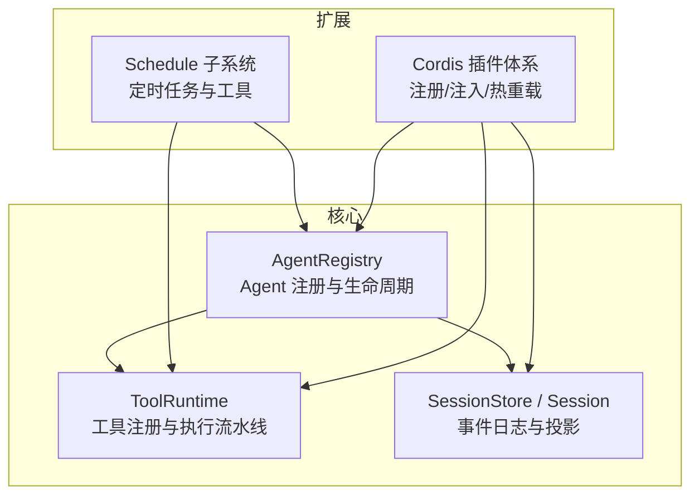
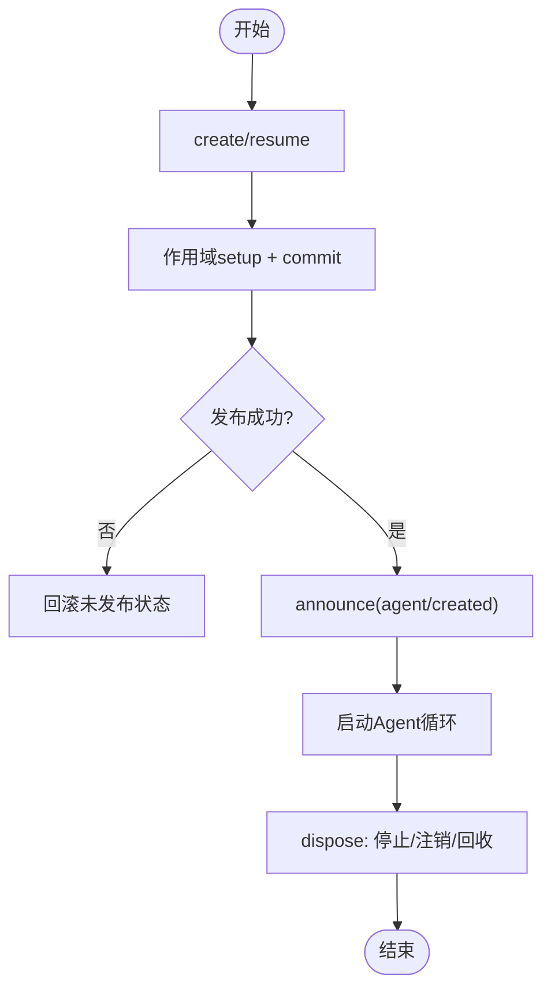
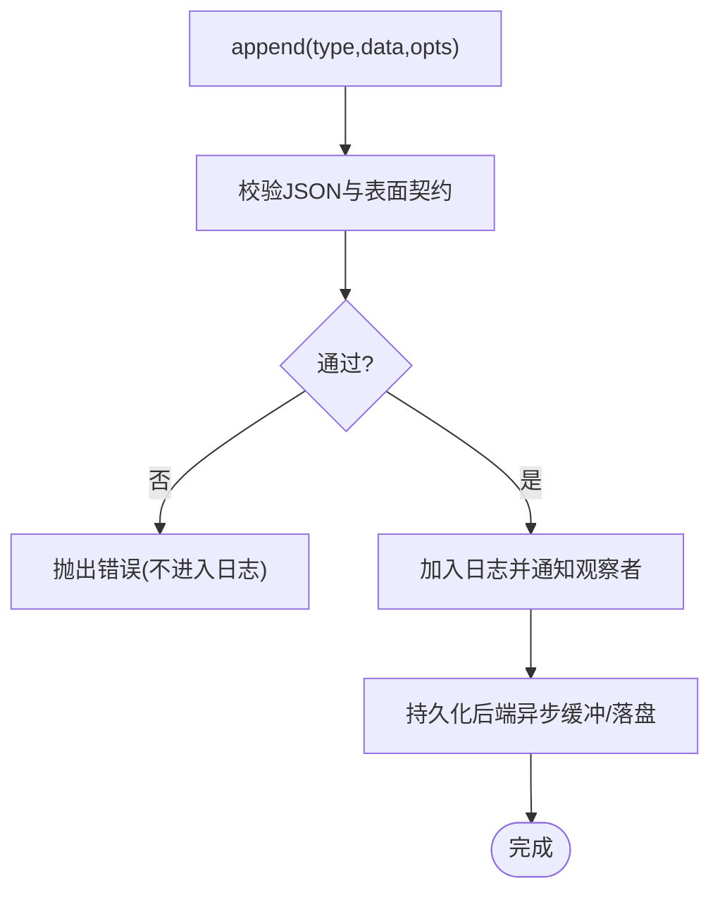
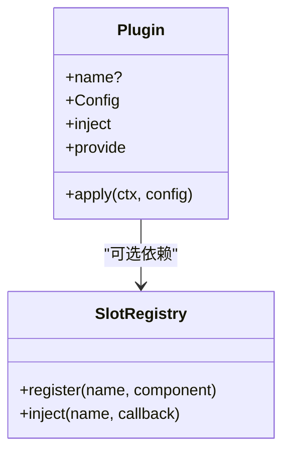
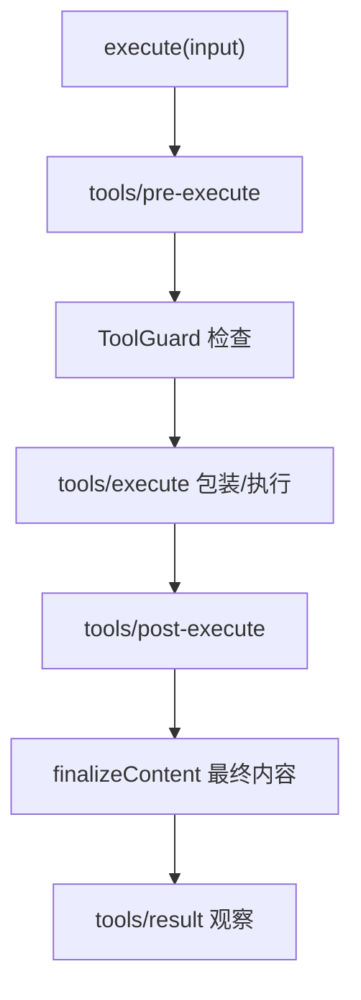
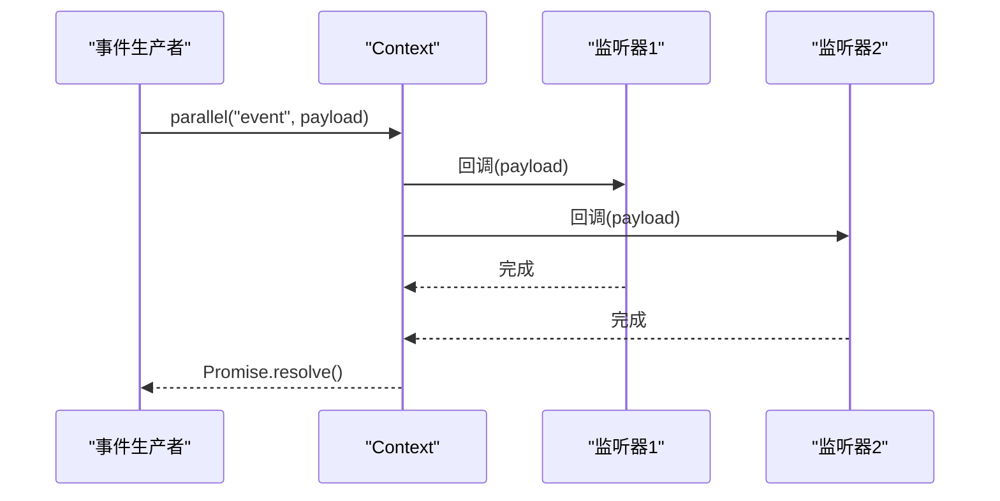
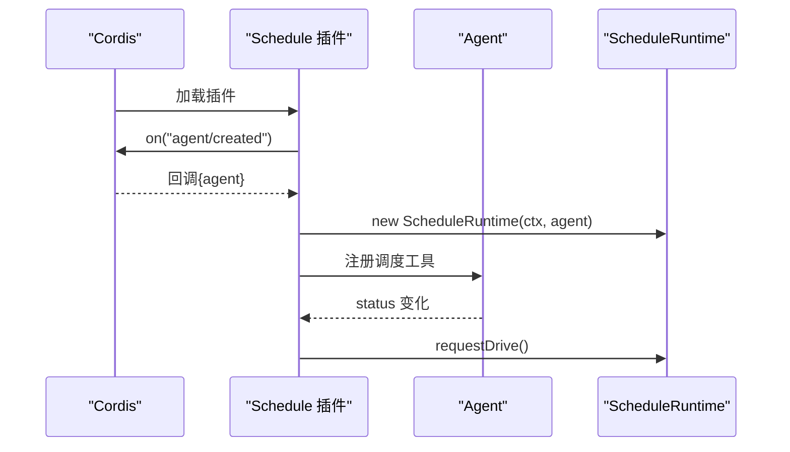
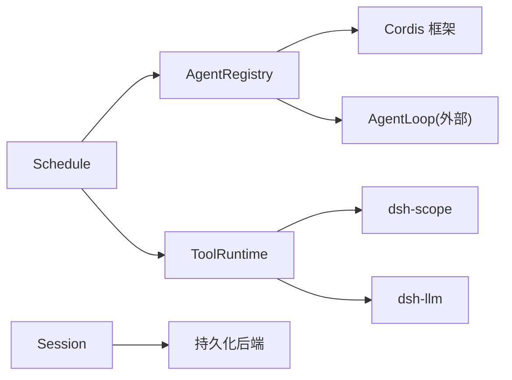

# 核心概念

<cite>
**本文引用的文件**
- [packages/core/agent/src/index.ts](file://packages/core/agent/src/index.ts)
- [packages/core/tools/src/index.ts](file://packages/core/tools/src/index.ts)
- [docs/subsystems/session.md](file://docs/subsystems/session.md)
- [docs/subsystems/tools.md](file://docs/subsystems/tools.md)
- [packages/schedule/schedule/src/index.ts](file://packages/schedule/schedule/src/index.ts)
- [packages/schedule/schedule/src/tools.ts](file://packages/schedule/schedule/src/tools.ts)
- [packages/core/session/src/index.ts](file://packages/core/session/src/index.ts)
- [packages/session/session-persistence-jsonl/tests/jsonl.spec.ts](file://packages/session/session-persistence-jsonl/tests/jsonl.spec.ts)
- [packages/session/session-persistence/tests/coordinator-contract.ts](file://packages/session/session-persistence/tests/coordinator-contract.ts)
- [packages/extensions/tool-cordis/src/prompt.ts](file://packages/extensions/tool-cordis/src/prompt.ts)
- [packages/extensions/cordis-host-runner/src/guard.ts](file://packages/extensions/cordis-host-runner/src/guard.ts)
- [docs/cordis-api/events.zh.md](file://docs/cordis-api/events.zh.md)
- [docs/cordis-api/registry.zh.md](file://docs/cordis-api/registry.zh.md)
</cite>

## 目录
1. [简介](#简介)
2. [项目结构](#项目结构)
3. [核心组件](#核心组件)
4. [架构总览](#架构总览)
5. [详细组件分析](#详细组件分析)
6. [依赖关系分析](#依赖关系分析)
7. [性能考量](#性能考量)
8. [故障排查指南](#故障排查指南)
9. [结论](#结论)
10. [附录](#附录)

## 简介
本文件面向 DeepSeek Harness 的核心概念，聚焦以下主题：
- 智能体（Agent）生命周期管理：创建、调度、执行与销毁
- 会话（Session）管理机制：追加式事件日志、状态持久化与恢复
- 插件系统：注册、依赖注入与热重载
- 工具（Tool）系统：注册、权限控制与执行环境
- 事件驱动架构：设计模式与实现细节
并提供可定位到源码的示例路径，帮助读者快速上手。

## 项目结构
DeepSeek Harness 采用多包模块化组织，核心能力分布在 packages 下，文档位于 docs，测试与示例分布于 tests 与 snapshots。关键模块包括：
- Agent 服务与注册表：负责 Agent 实例的创建、恢复、发布与销毁
- Session 与持久化：以追加式事件日志为唯一事实来源，支持持久化与恢复
- Tool 运行时：统一的工具注册、可见性、权限与执行流水线
- Schedule 子系统：基于 Agent 生命周期的定时任务调度
- Cordis 插件体系：声明式插件、服务注入、插槽与热重载



图表来源
- [packages/core/agent/src/index.ts:246-448](file://packages/core/agent/src/index.ts#L246-L448)
- [packages/core/tools/src/index.ts:788-800](file://packages/core/tools/src/index.ts#L788-L800)
- [docs/subsystems/session.md:332-492](file://docs/subsystems/session.md#L332-L492)
- [packages/schedule/schedule/src/index.ts:44-77](file://packages/schedule/schedule/src/index.ts#L44-L77)
- [docs/cordis-api/registry.zh.md:60-121](file://docs/cordis-api/registry.zh.md#L60-L121)

章节来源
- [packages/core/agent/src/index.ts:246-448](file://packages/core/agent/src/index.ts#L246-L448)
- [packages/core/tools/src/index.ts:788-800](file://packages/core/tools/src/index.ts#L788-L800)
- [docs/subsystems/session.md:332-492](file://docs/subsystems/session.md#L332-L492)
- [packages/schedule/schedule/src/index.ts:44-77](file://packages/schedule/schedule/src/index.ts#L44-L77)
- [docs/cordis-api/registry.zh.md:60-121](file://docs/cordis-api/registry.zh.md#L60-L121)

## 核心组件
- AgentRegistry：维护 Agent 实例集合、工厂委托、发起者上下文传播；提供 create/resume/register/announce 等原子操作，保证创建与发布的有序性与回滚一致性。
- ToolRuntime：统一工具注册、可见性解析、权限守卫、执行流水线（pre-execute → guard → execute → post-execute → result），并暴露 schemas() 给模型侧。
- Session：追加式事件日志，表面投影（surface）用于推导消息历史；支持持久化后端对接与恢复。
- Schedule：监听 agent/created 事件，为每个根 Agent 启动调度运行时，并在 Agent 销毁时清理。
- Cordis 插件：函数/类/对象三种入口，支持 inject 依赖、provide 服务、拦截配置、热重载与插槽注入。

章节来源
- [packages/core/agent/src/index.ts:246-448](file://packages/core/agent/src/index.ts#L246-L448)
- [packages/core/tools/src/index.ts:788-800](file://packages/core/tools/src/index.ts#L788-L800)
- [docs/subsystems/session.md:332-492](file://docs/subsystems/session.md#L332-L492)
- [packages/schedule/schedule/src/index.ts:44-77](file://packages/schedule/schedule/src/index.ts#L44-L77)
- [docs/cordis-api/registry.zh.md:60-121](file://docs/cordis-api/registry.zh.md#L60-L121)

## 架构总览
下图展示了从 Agent 创建到工具执行、再到会话日志持久化的端到端流程。

```mermaid
sequenceDiagram
participant Caller as "调用方"
participant Agents as "AgentRegistry"
participant Loop as "AgentLoop(外部)"
participant Tools as "ToolRuntime"
participant Session as "Session/Store"
participant Persist as "持久化后端"
Caller->>Agents : create(options)
Agents->>Loop : 委托创建(含setup/commit)
Loop-->>Agents : 返回已发布的Agent句柄
Note over Loop,Session : 会话在创建事务中准备并发布
Loop->>Tools : execute({name,args,...})
Tools->>Tools : pre-execute/guard/execute/post-execute
Tools-->>Loop : 标准化结果
Loop->>Session : append('tool/result', ...)
Session->>Persist : 异步缓冲/落盘
Persist-->>Session : 确认
```

图表来源
- [packages/core/agent/src/index.ts:396-421](file://packages/core/agent/src/index.ts#L396-L421)
- [packages/core/tools/src/index.ts:788-800](file://packages/core/tools/src/index.ts#L788-L800)
- [docs/subsystems/session.md:410-449](file://docs/subsystems/session.md#L410-L449)

## 详细组件分析

### 智能体（Agent）生命周期管理
- 创建与恢复：通过 AgentRegistry.create/resume 委托给具体 AgentLoop 实现；在 setup 阶段完成作用域内注册，commit 后发布 session/agent 事件，再启动循环。
- 注册与发布：enter 插入未发布条目，announce 同步广播 agent/created，随后可安全被其他组件订阅。
- 销毁：dispose 停止循环、等待退出、注销 Agent、移除 Session、回收作用域。
- 发起者上下文：withInitiator/withoutInitiator 提供进程内因果归属，便于审计与追踪。



图表来源
- [packages/core/agent/src/index.ts:396-448](file://packages/core/agent/src/index.ts#L396-L448)
- [packages/core/agent/src/index.ts:465-567](file://packages/core/agent/src/index.ts#L465-L567)

章节来源
- [packages/core/agent/src/index.ts:396-448](file://packages/core/agent/src/index.ts#L396-L448)
- [packages/core/agent/src/index.ts:465-567](file://packages/core/agent/src/index.ts#L465-L567)

### 会话（Session）管理与持久化
- 追加式事件日志：Session.events 为不可变快照，append 校验 JSON 可序列化与表面契约，确保日志即事实。
- 表面投影：仅 surface 类型事件参与消息历史推导；replace 支持压缩覆盖。
- 持久化与恢复：后端需保持 seq 连续且无损；恢复时合成中断标记，保证平衡。
- 种子边界：session/end-seed 区分构造种子与本次生命周期写入。



图表来源
- [docs/subsystems/session.md:410-449](file://docs/subsystems/session.md#L410-L449)
- [packages/core/session/src/index.ts:548-565](file://packages/core/session/src/index.ts#L548-L565)
- [packages/session/session-persistence-jsonl/tests/jsonl.spec.ts:1536-1563](file://packages/session/session-persistence-jsonl/tests/jsonl.spec.ts#L1536-L1563)
- [packages/session/session-persistence/tests/coordinator-contract.ts:1166-1192](file://packages/session/session-persistence/tests/coordinator-contract.ts#L1166-L1192)

章节来源
- [docs/subsystems/session.md:410-449](file://docs/subsystems/session.md#L410-L449)
- [packages/core/session/src/index.ts:548-565](file://packages/core/session/src/index.ts#L548-L565)
- [packages/session/session-persistence-jsonl/tests/jsonl.spec.ts:1536-1563](file://packages/session/session-persistence-jsonl/tests/jsonl.spec.ts#L1536-L1563)
- [packages/session/session-persistence/tests/coordinator-contract.ts:1166-1192](file://packages/session/session-persistence/tests/coordinator-contract.ts#L1166-L1192)

### 插件系统：注册、依赖注入与热重载
- 插件入口：函数/类/对象三种形式，支持 Config 校验、inject 依赖、provide 服务、intercept 拦截。
- 插槽注入：slots.inject(name, cb) 等待声明存在后立即执行，支持独立生命周期与热替换。
- 客户端 UI：通过 slots.register 动态挂载渲染器，fiber 销毁时自动卸载。
- 热重载：替换声明或贡献者时，旧条目被移除，新条目按顺序安装，保证一致性与隔离。



图表来源
- [docs/cordis-api/registry.zh.md:60-121](file://docs/cordis-api/registry.zh.md#L60-L121)
- [packages/client/ui-workflow-run/tests/workflow-run.client.spec.tsx:876-900](file://packages/client/ui-workflow-run/tests/workflow-run.client.spec.tsx#L876-L900)
- [packages/client/ui-renderer/tests/registry.client.spec.ts:376-396](file://packages/client/ui-renderer/tests/registry.client.spec.ts#L376-L396)

章节来源
- [docs/cordis-api/registry.zh.md:60-121](file://docs/cordis-api/registry.zh.md#L60-L121)
- [packages/client/ui-workflow-run/tests/workflow-run.client.spec.tsx:876-900](file://packages/client/ui-workflow-run/tests/workflow-run.client.spec.tsx#L876-L900)
- [packages/client/ui-renderer/tests/registry.client.spec.ts:376-396](file://packages/client/ui-renderer/tests/registry.client.spec.ts#L376-L396)

### 工具（Tool）系统：注册、权限控制与执行环境
- 注册与可见性：ToolRuntime.register 支持全局与作用域注册；schemas() 仅暴露模型可见字段。
- 权限与守卫：tools/pre-execute 允许/拒绝/询问；ToolGuard 单调守卫；ToolRestriction 过滤继承工具。
- 执行流水线：execute → pre-execute → guard → execute(around) → post-execute → finalizeContent → result。
- PTC 模式：仅暴露 run_code，其余工具通过 SDK 子分发执行，增强安全性与可控性。
- 沙箱限制：host runner 暴露只读 schemas/get，防止直接绕过 ToolRuntime.execute。



图表来源
- [packages/core/tools/src/index.ts:788-800](file://packages/core/tools/src/index.ts#L788-L800)
- [docs/subsystems/tools.md:170-173](file://docs/subsystems/tools.md#L170-L173)
- [packages/extensions/cordis-host-runner/src/guard.ts:639-655](file://packages/extensions/cordis-host-runner/src/guard.ts#L639-L655)

章节来源
- [packages/core/tools/src/index.ts:788-800](file://packages/core/tools/src/index.ts#L788-L800)
- [docs/subsystems/tools.md:170-173](file://docs/subsystems/tools.md#L170-L173)
- [packages/extensions/cordis-host-runner/src/guard.ts:639-655](file://packages/extensions/cordis-host-runner/src/guard.ts#L639-L655)

### 事件驱动架构：设计与实现
- 事件类型：Cordis 在每个 Context 混入 emit/parallel 等分发 API；Harness 事件声明在各子系统页面生成。
- 分发模式：emit 同步忽略返回值；parallel 并发运行所有监听器并等待全部完成。
- 远程事件：Remote 面使用 ctx.remote.$on(event, listener) 名单驱动原样转发 Host 事件，类型由同一份纯类型导出约束。
- 工具事件：tools/change、tools/execute、tools/post-execute、tools/pre-execute、tools/result 等构成可扩展的执行管线。



图表来源
- [docs/cordis-api/events.zh.md:1-49](file://docs/cordis-api/events.zh.md#L1-L49)
- [docs/subsystems/tools.md:576-719](file://docs/subsystems/tools.md#L576-L719)

章节来源
- [docs/cordis-api/events.zh.md:1-49](file://docs/cordis-api/events.zh.md#L1-L49)
- [docs/subsystems/tools.md:576-719](file://docs/subsystems/tools.md#L576-L719)

### 调度子系统（Schedule）与 Agent 生命周期集成
- 生命周期绑定：监听 agent/created，为每个根 Agent 创建 ScheduleRuntime，并在 agent/status 变化时触发驱动。
- 工具注册：在同一 Agent 作用域注册三个调度工具，并在每次持久化变更后请求驱动。
- 资源清理：在 Agent 销毁时停止状态监听、释放工具、调用 runtime.dispose。



图表来源
- [packages/schedule/schedule/src/index.ts:44-77](file://packages/schedule/schedule/src/index.ts#L44-L77)
- [packages/schedule/schedule/src/tools.ts:291-314](file://packages/schedule/schedule/src/tools.ts#L291-L314)

章节来源
- [packages/schedule/schedule/src/index.ts:44-77](file://packages/schedule/schedule/src/index.ts#L44-L77)
- [packages/schedule/schedule/src/tools.ts:291-314](file://packages/schedule/schedule/src/tools.ts#L291-L314)

## 依赖关系分析
- AgentRegistry 依赖 Cordis 的 Service/Fiber/Events，并通过 setFactory 将创建/恢复委托给 AgentLoop。
- ToolRuntime 依赖 dsh-scope 的作用域机制、dsh-llm 的类型与错误、以及 systemPrompt 装配。
- Session 依赖持久化后端接口，要求事件序列连续与 JSON 可序列化。
- Schedule 依赖 Agent 事件与工具注册，形成对 Agent 生命周期的细粒度响应。



图表来源
- [packages/core/agent/src/index.ts:246-289](file://packages/core/agent/src/index.ts#L246-L289)
- [packages/core/tools/src/index.ts:788-794](file://packages/core/tools/src/index.ts#L788-L794)
- [docs/subsystems/session.md:574-578](file://docs/subsystems/session.md#L574-L578)
- [packages/schedule/schedule/src/index.ts:44-77](file://packages/schedule/schedule/src/index.ts#L44-L77)

章节来源
- [packages/core/agent/src/index.ts:246-289](file://packages/core/agent/src/index.ts#L246-L289)
- [packages/core/tools/src/index.ts:788-794](file://packages/core/tools/src/index.ts#L788-L794)
- [docs/subsystems/session.md:574-578](file://docs/subsystems/session.md#L574-L578)
- [packages/schedule/schedule/src/index.ts:44-77](file://packages/schedule/schedule/src/index.ts#L44-L77)

## 性能考量
- 会话日志缓存：Session.events 返回不可变快照，避免重复拷贝；deriveMessages 对表面节点进行一次性投影并缓存。
- 工具并行与独占：executionMode 决定并行或独占执行，减少竞争与死锁风险。
- 持久化缓冲：Session.append 不阻塞 I/O，持久化后端异步缓冲，降低热路径延迟。
- 事件并发：parallel 分发并发运行监听器，适合无副作用的观测型逻辑。

[本节为通用指导，无需特定文件引用]

## 故障排查指南
- 未知工具：ToolNotFoundError 携带 UNKNOWN_TOOL 代码，便于重试/沙箱/回放分支处理。
- 输出非法：ToolOutputError 报告 schema 验证失败，包含违规项列表。
- 非 JSON 数据：Session.append 在源处拒绝不可序列化数据，避免脏数据进入日志。
- 审批缺失：tools/pre-execute 的 ask 在无审批服务时退化为 deny。
- 远程事件：确保 Remote 名单与类型定义一致，避免 $on 订阅无效。

章节来源
- [packages/core/tools/src/index.ts:495-523](file://packages/core/tools/src/index.ts#L495-L523)
- [docs/subsystems/session.md:410-449](file://docs/subsystems/session.md#L410-L449)
- [docs/subsystems/tools.md:576-719](file://docs/subsystems/tools.md#L576-L719)

## 结论
DeepSeek Harness 通过 Agent 生命周期、Session 事件溯源、插件系统与工具执行流水线的协同，提供了高内聚、可扩展且安全的智能体运行平台。其事件驱动与可组合的插件模型使得功能扩展与热重载成为一等公民，而严格的权限与输出校验保障了系统的健壮性。

[本节为总结，无需特定文件引用]

## 附录
- 示例与参考路径（可直接定位到源码）：
  - 插件注册与插槽注入：[docs/cordis-api/registry.zh.md:60-121](file://docs/cordis-api/registry.zh.md#L60-L121)
  - 客户端插槽热替换：[packages/client/ui-renderer/tests/registry.client.spec.ts:376-396](file://packages/client/ui-renderer/tests/registry.client.spec.ts#L376-L396)
  - 工具执行流水线：[docs/subsystems/tools.md:170-173](file://docs/subsystems/tools.md#L170-L173)
  - 会话持久化恢复：[packages/session/session-persistence-jsonl/tests/jsonl.spec.ts:1536-1563](file://packages/session/session-persistence-jsonl/tests/jsonl.spec.ts#L1536-L1563)
  - 调度与 Agent 生命周期集成：[packages/schedule/schedule/src/index.ts:44-77](file://packages/schedule/schedule/src/index.ts#L44-L77)

[本节为参考索引，无需特定文件引用]