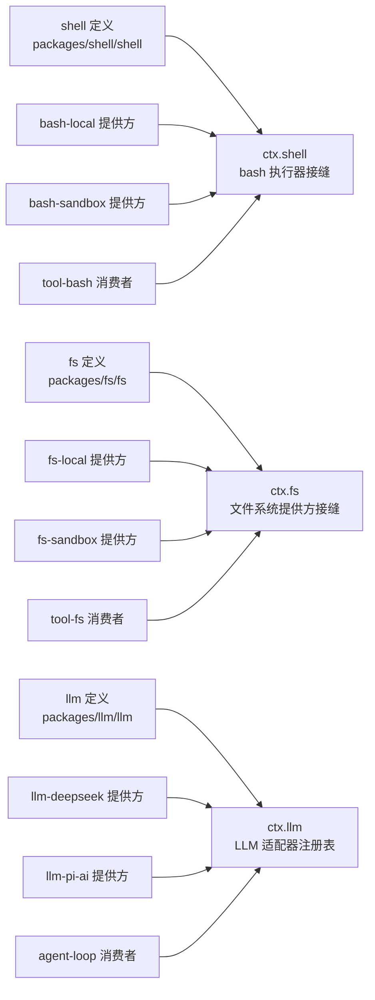
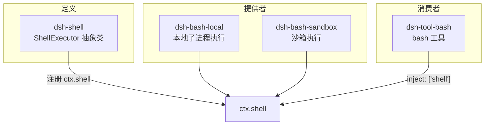
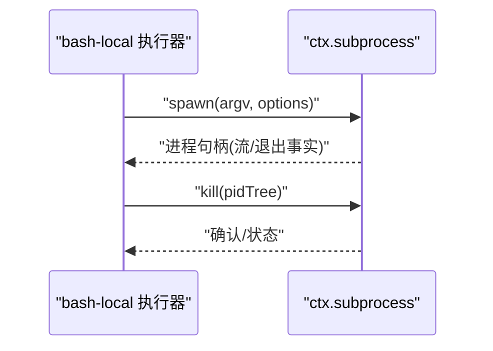
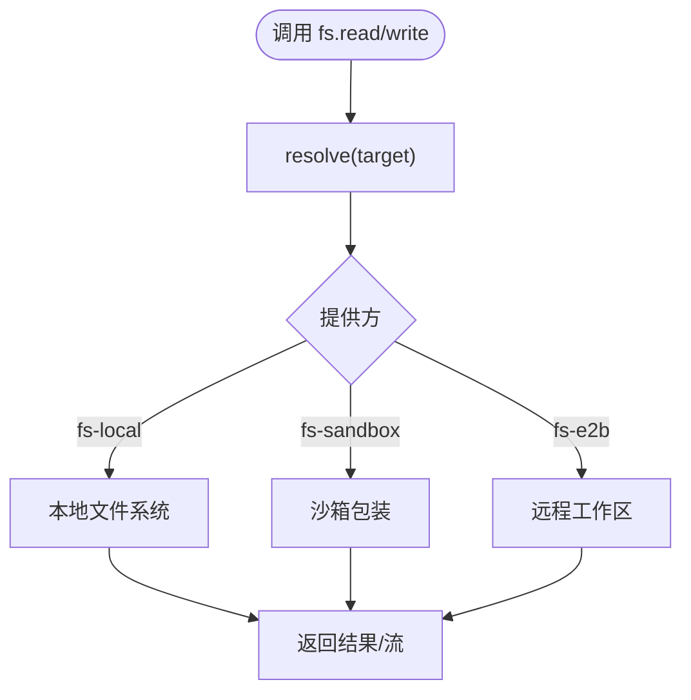
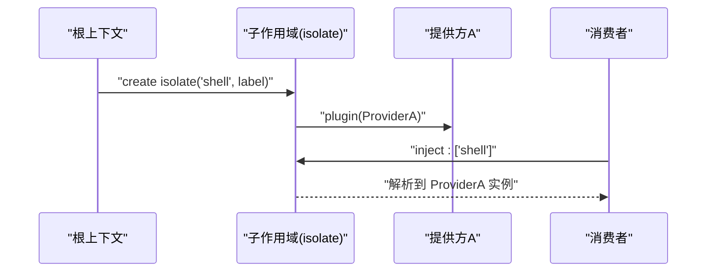
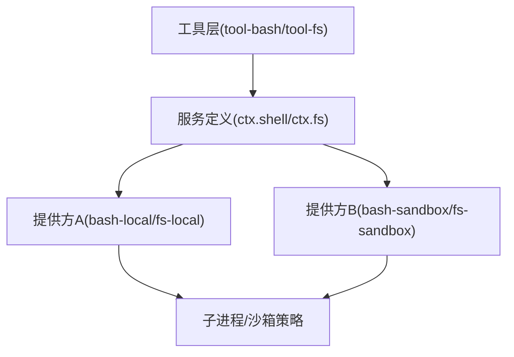

# 能力接缝

<cite>
**本文引用的文件**
- [capability-seams.zh.md](file://docs/capability-seams.zh.md)
- [capability-seams.md](file://docs/capability-seams.md)
- [service.zh.md](file://docs/cordis-api/service.zh.md)
- [context.md](file://docs/cordis-api/context.md)
- [registry.zh.md](file://docs/cordis-api/registry.zh.md)
- [index.ts](file://packages/shell/shell/src/index.ts)
- [README.zh.md（dsh-subprocess）](file://packages/subprocess/subprocess/README.zh.md)
- [README.md（dsh-llm-deepseek）](file://packages/llm/llm-deepseek/README.md)
- [README.md（dsh-llm-pi-ai）](file://packages/llm/llm-pi-ai/README.md)
- [config-catalog.md](file://docs/config-catalog.md)
- [service.spec.ts（shell seam 测试）](file://packages/shell/shell/tests/service.spec.ts)
- [tools.spec.ts（pwsh 工具测试）](file://packages/shell/tool-pwsh/tests/tools.spec.ts)
- [service.spec.ts（fs seam 测试）](file://packages/fs/fs/tests/service.spec.ts)
- [composition.spec.ts（组合与 provide/get 行为）](file://packages/extensions/cordis-host-runner/tests/composition.spec.ts)
- [2026-06-13-capability-seams.md（架构笔记）](file://.agents/notes/implemented/architecture/2026-06-13-capability-seams.md)
</cite>

## 目录
1. [简介](#简介)
2. [项目结构](#项目结构)
3. [核心组件](#核心组件)
4. [架构总览](#架构总览)
5. [详细组件分析](#详细组件分析)
6. [依赖关系分析](#依赖关系分析)
7. [性能考量](#性能考量)
8. [故障排查指南](#故障排查指南)
9. [结论](#结论)
10. [附录：创建新能力接缝的示例路径](#附录：创建新能力接缝的示例路径)

## 简介
本文件系统性阐述 DeepSeek Harness 的“能力接缝”机制。能力接缝将“服务定义、服务提供者、消费者”三角色解耦，使同一能力可在运行时通过配置替换实现（如本地执行器替换为沙箱执行器），同时保持面向模型的工具契约稳定。文档覆盖以下主题：
- 设计理念与角色分离
- 注册与发现机制（作用域、依赖解析）
- 典型能力接缝的实现（文件系统、子进程、LLM 适配器）
- 配置与替换（动态切换、运行时修改）
- 扩展现有能力的实践路径（以代码片段路径引用代替直接粘贴代码）

## 项目结构
能力接缝在仓库中以“包级职责划分”组织：
- 服务定义（Service Definition）：抽象服务类与类型，挂载到 ctx 键（如 ctx.shell、ctx.fs、ctx.llm）。
- 服务提供者（Service Provider）：具体实现插件，注册到同一 ctx 键（如 bash-local、fs-local、llm-deepseek）。
- 消费者（Consumer）：工具或上层逻辑，仅依赖服务定义，不感知具体实现（如 tool-bash、tool-fs、agent-loop）。

下图展示能力接缝与核心服务的整体关系（由生成文档导出）：



图表来源
- [capability-seams.zh.md:10-220](file://docs/capability-seams.zh.md#L10-L220)
- [capability-seams.md:8-220](file://docs/capability-seams.md#L8-L220)

章节来源
- [capability-seams.zh.md:1-539](file://docs/capability-seams.zh.md#L1-L539)
- [capability-seams.md:1-537](file://docs/capability-seams.md#L1-L537)

## 核心组件
- 服务基类与上下文
  - Service：插件加载后以 ctx.<name> 形式注册自身，随 fiber 生命周期自动移除。
  - Context：支持 isolate(name, label?) 隔离某服务的范围；get/set 读取/覆盖已提供的服务值；inject 声明依赖并等待就绪。
- 注入与作用域
  - inject 可数组或对象形式声明依赖；resolve 工具用于规范化依赖映射。
  - isolate 允许在同一上下文中为特定服务创建独立作用域，便于并行测试或多租户隔离。
- 服务注册约束
  - 同一 ctx 键只能有一个实现；重复加载会抛出错误，确保确定性绑定。

章节来源
- [service.zh.md:1-60](file://docs/cordis-api/service.zh.md#L1-L60)
- [context.md:39-65](file://docs/cordis-api/context.md#L39-L65)
- [context.md:235-284](file://docs/cordis-api/context.md#L235-L284)
- [registry.zh.md:123-155](file://docs/cordis-api/registry.zh.md#L123-L155)

## 架构总览
能力接缝遵循“三角色”模式：
- 服务定义：抽象服务与词汇类型，决定 ctx 键和调用约定。
- 服务提供者：一个或多个插件实现同一服务定义，按组合选择其一。
- 消费者：面向模型的工具或循环，仅依赖服务定义，不导入提供方类型。

下图给出 Bash 执行能力接缝的典型拆分：



图表来源
- [capability-seams.zh.md:10-220](file://docs/capability-seams.zh.md#L10-L220)
- [index.ts:40-101](file://packages/shell/shell/src/index.ts#L40-L101)

章节来源
- [2026-06-13-capability-seams.md:13-25](file://.agents/notes/implemented/architecture/2026-06-13-capability-seams.md#L13-L25)
- [capability-seams.zh.md:466-536](file://docs/capability-seams.zh.md#L466-L536)

## 详细组件分析

### 服务定义：ShellExecutor（Bash 执行器接缝）
- 职责
  - 定义 ctx.shell 抽象 API：resolve/run/start/sandboxMode。
  - 明确语义：run 对非零退出、超时、中止等返回结果而非抛错；start 立即返回句柄，done 永不拒绝。
- 关键点
  - 每个上下文仅能加载一个实现；重复加载会失败。
  - 默认 sandboxMode 可由实现提供，供消费方决策安全策略。
- 使用方式
  - 消费者通过 inject: ['shell'] 获取服务，调用 resolve/run/start。

```mermaid
classDiagram
class ShellExecutor {
+sandboxMode
+resolve(request) ShellExecSpec
+run(spec) Promise~ShellRunResult~
+start(spec) ShellProcess
}
class BashLocalProvider
class BashSandboxProvider
class ToolBashConsumer
ShellExecutor <|-- BashLocalProvider
ShellExecutor <|-- BashSandboxProvider
ToolBashConsumer --> ShellExecutor : "inject : ['shell']"
```

图表来源
- [index.ts:40-101](file://packages/shell/shell/src/index.ts#L40-L101)
- [service.spec.ts（shell seam 测试）:53-84](file://packages/shell/shell/tests/service.spec.ts#L53-L84)

章节来源
- [index.ts:1-104](file://packages/shell/shell/src/index.ts#L1-L104)
- [service.spec.ts（shell seam 测试）:53-84](file://packages/shell/shell/tests/service.spec.ts#L53-L84)

### 服务提供者：子进程（ctx.subprocess）
- 职责
  - 提供 spawn、观察、终止子进程与终端会话的能力。
  - 负责进程坐标、进程树/会话生命周期、stdio 处置、终端机制与 kill 升级。
- 关键特性
  - 每个组合仅挂载一个提供方；第二个提供方快速失败。
  - 输出捕获、环境清理、可配置 argv/时限/shell 语义由消费方能力 seam 决定。
- 典型消费方
  - bash-local/bash-sandbox、terminal-bash、lsp-stdio、subagent-* 后端。



图表来源
- [README.zh.md（dsh-subprocess）:1-157](file://packages/subprocess/subprocess/README.zh.md#L1-L157)

章节来源
- [README.zh.md（dsh-subprocess）:1-157](file://packages/subprocess/subprocess/README.zh.md#L1-L157)

### 服务提供者：LLM 适配器（ctx.llm）
- 职责
  - 注册多提供方路由（如 deepseek-official、pi-ai 路由），将不同协议翻译为 harness 流式分片协议。
  - 连接事实（端点、目录、密钥、thinking 策略）按请求解析，编辑用户设置即可生效，无需重启。
- 关键特性
  - 多个适配器可并排挂载（路由名不冲突）。
  - 官方适配器与 pi-ai 适配器结构不同但均接入同一 ctx.llm。
- 配置要点
  - 通过配置目录注册 providers/routes/models/compat 等字段，驱动运行时行为。

```mermaid
sequenceDiagram
participant Loop as "agent-loop"
participant LLM as "ctx.llm"
participant Adapter as "llm-deepseek/pi-ai"
Loop->>LLM : "stream(options)"
LLM->>Adapter : "路由选择/参数适配"
Adapter-->>LLM : "StreamChunk"
LLM-->>Loop : "流式响应"
```

图表来源
- [README.md（dsh-llm-deepseek）:1-47](file://packages/llm/llm-deepseek/README.md#L1-L47)
- [README.md（dsh-llm-pi-ai）:1-25](file://packages/llm/llm-pi-ai/README.md#L1-L25)
- [config-catalog.md:1037-1301](file://docs/config-catalog.md#L1037-L1301)

章节来源
- [README.md（dsh-llm-deepseek）:1-47](file://packages/llm/llm-deepseek/README.md#L1-L47)
- [README.md（dsh-llm-pi-ai）:1-25](file://packages/llm/llm-pi-ai/README.md#L1-L25)
- [config-catalog.md:1037-1301](file://docs/config-catalog.md#L1037-L1301)

### 文件系统接缝（ctx.fs）
- 职责
  - 暴露统一的文件系统原语（读/写/编辑/流式读取），由提供方实现（本地、沙箱、E2B）。
- 关键行为
  - 重复加载提供方会失败；fiber 销毁时服务自动移除。
  - streamText 与 readText 保持一致性。
- 消费方
  - tool-fs 通过 ctx.fs 执行读写编辑；fs-sandbox 按共享沙箱模式限制变更。



图表来源
- [service.spec.ts（fs seam 测试）:1-121](file://packages/fs/fs/tests/service.spec.ts#L1-L121)

章节来源
- [service.spec.ts（fs seam 测试）:1-121](file://packages/fs/fs/tests/service.spec.ts#L1-L121)

### 作用域管理与依赖解析
- 作用域隔离
  - 通过 ctx.isolate(name, label?) 为指定服务创建独立作用域，避免互相影响。
  - 相同 label 可合并作用域，便于分组管理。
- 依赖注入
  - inject 声明依赖，框架保证在 fiber 启动前解析并等待服务就绪。
  - get/set 允许在运行时读取/覆盖已提供的服务值（仅限提供 fiber 设置）。
- 组合行为
  - 测试表明：provide 原始值或 null 会通过门面透传；重复注册同名服务会失败。



图表来源
- [context.md:39-65](file://docs/cordis-api/context.md#L39-L65)
- [composition.spec.ts:91-129](file://packages/extensions/cordis-host-runner/tests/composition.spec.ts#L91-L129)

章节来源
- [context.md:39-65](file://docs/cordis-api/context.md#L39-L65)
- [composition.spec.ts:91-129](file://packages/extensions/cordis-host-runner/tests/composition.spec.ts#L91-L129)

## 依赖关系分析
- 耦合与内聚
  - 服务定义与实现低耦合：消费者只依赖定义，实现可替换。
  - 提供方之间无直接依赖，通过统一 ctx 键协作。
- 直接/间接依赖
  - 工具层（tool-*）依赖服务定义；执行器（bash-local/sandbox）依赖子进程与沙箱策略。
  - LLM 适配器依赖 settings/credentials 等 seam 进行运行时配置解析。
- 循环依赖
  - 通过服务注册与注入机制避免循环；服务间通过事件/回调通信。



图表来源
- [capability-seams.zh.md:466-536](file://docs/capability-seams.zh.md#L466-L536)

章节来源
- [capability-seams.zh.md:466-536](file://docs/capability-seams.zh.md#L466-L536)

## 性能考量
- 流式处理
  - LLM 适配器采用流式分片，降低首字节延迟。
  - 文件系统流式读取避免大文件一次性加载。
- 资源管理
  - 子进程句柄与进程树生命周期由 ctx.subprocess 统一管理，避免泄漏。
  - 服务随 fiber 销毁自动移除，减少内存占用。
- 缓存与回放
  - 压缩与投影缓存减少日志回放开销；token 测量支持回放折叠。

[本节为通用指导，不直接分析具体文件]

## 故障排查指南
- 重复服务注册
  - 现象：加载第二个实现时报错。
  - 原因：同一 ctx 键仅允许一个实现。
  - 处理：检查 cordis.yml 组合行，确保唯一提供方。
- 服务未就绪
  - 现象：消费者注入依赖后仍无法调用。
  - 原因：提供方尚未加载或作用域不正确。
  - 处理：确认插件顺序与作用域隔离是否正确。
- 运行时修改无效
  - 现象：修改配置后未生效。
  - 原因：某些 seam 需按请求解析（如 LLM 适配器）。
  - 处理：确保通过 settings/credentials seam 更新，并在下一次请求中生效。

章节来源
- [service.spec.ts（shell seam 测试）:78-84](file://packages/shell/shell/tests/service.spec.ts#L78-L84)
- [service.spec.ts（fs seam 测试）:98-110](file://packages/fs/fs/tests/service.spec.ts#L98-L110)
- [README.md（dsh-llm-deepseek）:25-47](file://packages/llm/llm-deepseek/README.md#L25-L47)

## 结论
DeepSeek Harness 的能力接缝通过“服务定义-提供者-消费者”三角色解耦，实现了高内聚、低耦合的可插拔架构。借助 Cordis 的服务注册与作用域机制，系统支持运行时动态替换与配置驱动的行为调整。文件系统、子进程、LLM 适配器等多个 seams 展示了该模式的广泛适用性。遵循本文档的实践，可安全扩展新能力并保持系统稳定性。

[本节为总结，不直接分析具体文件]

## 附录：创建新能力接缝的示例路径
- 定义服务
  - 参考 ShellExecutor 抽象类定义与类型导出。
  - 路径：[index.ts:40-101](file://packages/shell/shell/src/index.ts#L40-L101)
- 实现提供方
  - 参考 bash-local 或 fs-local 的提供方实现。
  - 路径：[service.spec.ts（fs seam 测试）:22-121](file://packages/fs/fs/tests/service.spec.ts#L22-L121)
- 注册与发现
  - 通过插件加载与 inject 声明依赖。
  - 路径：[registry.zh.md:123-155](file://docs/cordis-api/registry.zh.md#L123-L155)
- 作用域隔离
  - 使用 ctx.isolate 创建独立作用域。
  - 路径：[context.md:39-65](file://docs/cordis-api/context.md#L39-L65)
- 配置与替换
  - 通过 settings/credentials seam 动态更新。
  - 路径：[config-catalog.md:1037-1301](file://docs/config-catalog.md#L1037-L1301)
- 测试验证
  - 参考 shell/pwsh 工具测试用例。
  - 路径：[tools.spec.ts（pwsh 工具测试）:168-202](file://packages/shell/tool-pwsh/tests/tools.spec.ts#L168-L202)

[本节为指引，不直接分析具体文件]