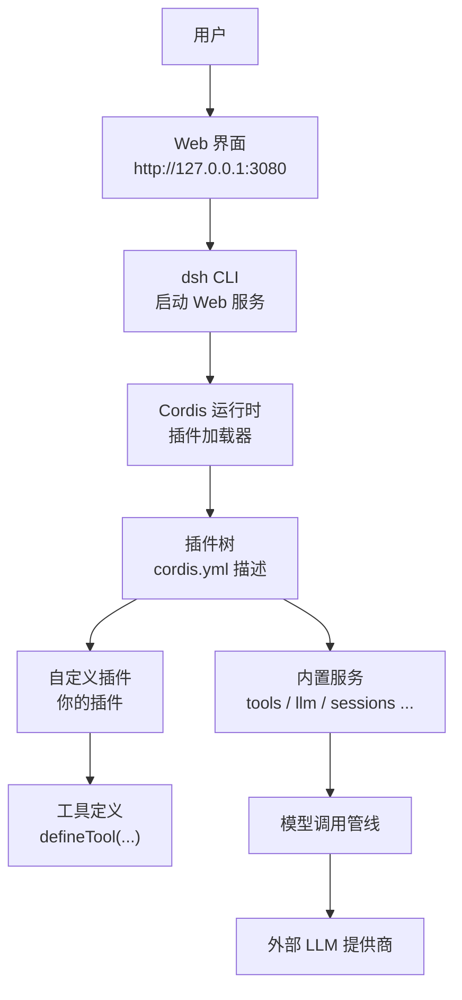
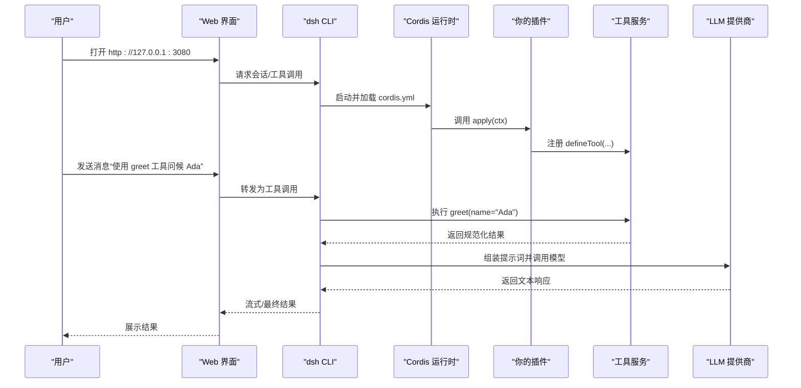
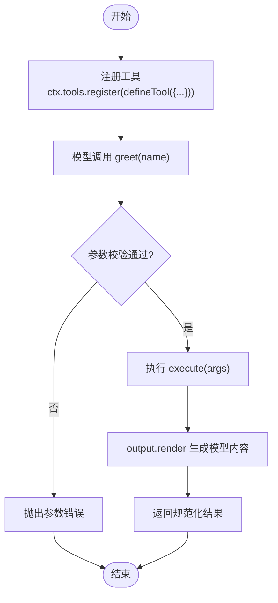
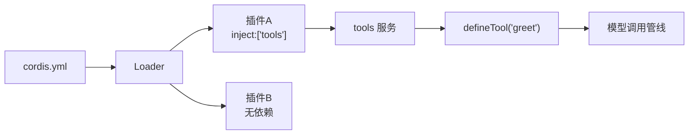

# 入门教程

<cite>
**本文引用的文件**
- [README.md](file://README.md)
- [docs/cordis-tutorial/index.md](file://docs/cordis-tutorial/index.md)
- [docs/cordis-primer.md](file://docs/cordis-primer.md)
- [docs/user/guide/index.md](file://docs/user/guide/index.md)
- [docs/user/develop/basic/index.md](file://docs/user/develop/basic/index.md)
- [docs/user/develop/basic/tool.md](file://docs/user/develop/basic/tool.md)
- [docs/user/develop/basic/config.md](file://docs/user/develop/basic/config.md)
- [docs/cookbook/adding-a-tool.md](file://docs/cookbook/adding-a-tool.md)
- [apps/cli/config/examples/cordis/cordis.yml](file://apps/cli/config/examples/cordis/cordis.yml)
</cite>

## 目录
1. [简介](#简介)
2. [项目结构](#项目结构)
3. [核心组件](#核心组件)
4. [架构总览](#架构总览)
5. [详细组件分析](#详细组件分析)
6. [依赖关系分析](#依赖关系分析)
7. [性能注意事项](#性能注意事项)
8. [故障排查指南](#故障排查指南)
9. [结论](#结论)
10. [附录：30分钟快速上手清单](#附录30分钟快速上手清单)

## 简介
本教程面向初学者，目标是让你在30分钟内完成 DeepSeek Harness（简称 dsh）的环境安装、首次运行、创建第一个智能体插件，并实现一个可被模型调用的基础工具。你将了解以下核心概念：
- Cordis 插件框架：一切皆插件，通过上下文与依赖注入组织能力
- 插件结构：函数式、对象式、类式三种形态
- 工具注册：使用 defineTool 将你的逻辑暴露给模型调用
- 配置系统：通过 cordis.yml 声明插件与配置，支持校验与默认值
- 调试技巧：如何定位加载失败、配置错误与工具执行问题

## 项目结构
仓库采用多包工作区组织，关键路径如下：
- apps/web：Web UI 应用入口与测试
- apps/cli：命令行工具与示例配置
- docs：用户指南、Cordis 教程、子系统文档、Cookbook
- packages：各功能域的实现包（如 tools、llm、web 等）
- scripts：构建与验证脚本
- vendor：第三方框架（包含 Cordis 运行时）

图表来源
- [README.md:17-41](file://README.md#L17-L41)
- [docs/user/guide/index.md:7-23](file://docs/user/guide/index.md#L7-L23)
- [docs/cordis-tutorial/index.md:13-46](file://docs/cordis-tutorial/index.md#L13-L46)
- [apps/cli/config/examples/cordis/cordis.yml:9-20](file://apps/cli/config/examples/cordis/cordis.yml#L9-L20)

章节来源
- [README.md:17-41](file://README.md#L17-L41)
- [docs/user/guide/index.md:7-23](file://docs/user/guide/index.md#L7-L23)

## 核心组件
- Cordis 运行时：提供 Context、Service、事件机制、生命周期管理；插件通过 apply(ctx) 注册能力
- 插件系统：函数式、对象式、类式三种形态；通过 inject 声明依赖；通过 ctx.effect 管理资源清理
- 工具系统：通过 defineTool 定义参数、输出、渲染与执行逻辑；由 tools 服务注册到模型调用管线
- 配置系统：通过 cordis.yml 组合插件与配置；Schema 校验失败即停止加载，避免半配置状态
- Web UI：用于选择工作区、配置模型、发起会话与查看工具执行结果

章节来源
- [docs/cordis-primer.md:7-46](file://docs/cordis-primer.md#L7-L46)
- [docs/user/develop/basic/index.md:15-103](file://docs/user/develop/basic/index.md#L15-L103)
- [docs/user/develop/basic/tool.md:7-52](file://docs/user/develop/basic/tool.md#L7-L52)
- [docs/user/develop/basic/config.md:7-107](file://docs/user/develop/basic/config.md#L7-L107)

## 架构总览
下图展示了从 Web UI 到模型调用的完整流程，以及插件在其中的作用点。

图表来源
- [docs/user/guide/index.md:7-23](file://docs/user/guide/index.md#L7-L23)
- [docs/cordis-tutorial/index.md:13-46](file://docs/cordis-tutorial/index.md#L13-L46)
- [docs/user/develop/basic/tool.md:7-52](file://docs/user/develop/basic/tool.md#L7-L52)

## 详细组件分析

### 环境准备与首次运行
- 从 npm 运行：安装 Node.js 后执行 npx @deepseek-ai/dsh web，默认监听 http://127.0.0.1:3080，自动打开浏览器
- 从源码运行：克隆仓库、pnpm install、pnpm run build、pnpm dsh web
- 配置模型：在 Web UI 的 Settings → Models 中设置 API Key，即可立即使用
- 选择工作区：点击 Choose workspace，添加当前项目目录，会话编辑器才可启用

章节来源
- [README.md:17-41](file://README.md#L17-L41)
- [docs/user/guide/index.md:7-23](file://docs/user/guide/index.md#L7-L23)

### 创建第一个插件（无需 API Key）
- 在仓库根创建临时目录 tmp/cordis-tutorial
- 编写 hello.ts 导出 name 与 apply(ctx)，打印欢迎信息
- 编写 cordis.yml，以列表形式挂载插件模块
- 使用 node --import tsx ../../vendor/cordis/bin.js 运行，预期输出欢迎信息
- 插件加载失败会直接报错；模块解析失败会通过日志报告而非崩溃进程

章节来源
- [docs/cordis-tutorial/index.md:13-46](file://docs/cordis-tutorial/index.md#L13-L46)
- [docs/cordis-tutorial/01-first-plugin.md:7-93](file://docs/cordis-tutorial/01-first-plugin.md#L7-L93)

### 插件结构与生命周期
- 三种形态：函数式（最常见）、对象式、类式（提供 Service）
- 依赖注入：通过 inject 声明所需服务（如 tools），框架确保依赖就绪后再加载
- 资源清理：ctx.effect 返回清理函数，插件卸载时自动回收
- 热重载：HMR 替换插件实例，注册项随 effect 自动清理

章节来源
- [docs/user/develop/basic/index.md:15-103](file://docs/user/develop/basic/index.md#L15-L103)
- [docs/cordis-primer.md:7-46](file://docs/cordis-primer.md#L7-L46)

### 开发一个 Tool（greet）
- 在插件中引入 defineTool，注册名为 greet 的工具
- 定义 parameters（name: string, required）与 output.schema（string）
- execute 返回规范化结果，output.render 将其转为模型可见内容
- 重启 dsh web 并在 Web UI 中让模型调用 greet("Ada")，得到问候结果

图表来源
- [docs/user/develop/basic/tool.md:7-52](file://docs/user/develop/basic/tool.md#L7-L52)
- [docs/cookbook/adding-a-tool.md:7-66](file://docs/cookbook/adding-a-tool.md#L7-L66)

章节来源
- [docs/user/develop/basic/tool.md:7-52](file://docs/user/develop/basic/tool.md#L7-L52)
- [docs/cookbook/adding-a-tool.md:7-66](file://docs/cookbook/adding-a-tool.md#L7-L66)

### 插件配置（Config）
- 导出 Config 接口与同名 Schema（Schemastery），字段可设默认值
- 在 cordis.yml 的 insert 行中添加 config 块，传入用户配置
- 加载时进行严格校验，非法配置直接失败，避免半配置状态
- 设计原则：可调参数必须可配置；失败要尽早、明确

章节来源
- [docs/user/develop/basic/config.md:7-107](file://docs/user/develop/basic/config.md#L7-L107)

### 将插件接入 Web 界面
- 使用 --patch 指定 cordis.yml 覆盖/插入插件
- 示例 patch 展示了如何修改端口、插入 Cordis 宿主与工具桥接
- 启动后在 Web UI 终端看到插件加载日志

章节来源
- [docs/user/develop/basic/index.md:46-64](file://docs/user/develop/basic/index.md#L46-L64)
- [apps/cli/config/examples/cordis/cordis.yml:9-20](file://apps/cli/config/examples/cordis/cordis.yml#L9-L20)

## 依赖关系分析
- 插件通过 inject 声明对 services 的依赖，Cordis 保证依赖就绪顺序
- 工具通过 tools 服务注册，进入模型调用管线
- 配置通过 cordis.yml 组合，按条目并发加载，顺序不决定依赖关系
- Web UI 作为入口，驱动 dsh CLI，再交由 Cordis 运行时装配插件树

图表来源
- [docs/cordis-tutorial/index.md:23-46](file://docs/cordis-tutorial/index.md#L23-L46)
- [docs/user/develop/basic/index.md:87-103](file://docs/user/develop/basic/index.md#L87-L103)
- [docs/user/develop/basic/tool.md:7-52](file://docs/user/develop/basic/tool.md#L7-L52)

章节来源
- [docs/cordis-tutorial/index.md:23-46](file://docs/cordis-tutorial/index.md#L23-L46)
- [docs/user/develop/basic/index.md:87-103](file://docs/user/develop/basic/index.md#L87-L103)

## 性能注意事项
- 插件并发加载：cordis.yml 条目并行启动，避免在顶层做阻塞初始化
- 工具执行应尊重 exec.signal，及时取消长任务
- 输出渲染保持纯函数，避免在 presentCall/presentResult 中进行 I/O
- 背景任务通过 jobs 服务管理，避免前台阻塞

[本节为通用指导，不直接分析具体文件]

## 故障排查指南
- 插件未加载或无输出：检查 cordis.yml 中的模块路径是否可解析；拼写错误会被记录但可能早于控制台导出
- 配置错误：Schema 校验失败会给出精确位置与类型信息，修正后重新加载
- 工具未被模型调用：确认已注入 tools 服务并正确注册 defineTool；重启 dsh web 使变更生效
- 热重载无效：确认 HMR 正常工作；插件卸载时会清理旧注册，新实例会重新注册
- 权限与策略：若工具执行被拒绝，检查 pre-execute/post-execute 策略钩子与 guard

章节来源
- [docs/cordis-tutorial/01-first-plugin.md:79-93](file://docs/cordis-tutorial/01-first-plugin.md#L79-L93)
- [docs/user/develop/basic/config.md:74-101](file://docs/user/develop/basic/config.md#L74-L101)
- [docs/cookbook/adding-a-tool.md:57-66](file://docs/cookbook/adding-a-tool.md#L57-L66)

## 结论
通过本教程，你已掌握：
- 安装与运行 dsh Web UI
- 使用 Cordis 创建第一个插件
- 注册并调用一个基础工具
- 通过 cordis.yml 配置插件
- 常见问题的定位与修复方法
现在你可以继续扩展工具、接入更多服务，或将插件打包发布。

## 附录：30分钟快速上手清单
- 第1-5分钟：安装 Node.js，执行 npx @deepseek-ai/dsh web，打开 http://127.0.0.1:3080
- 第6-10分钟：在 Settings → Models 配置 API Key，选择工作区
- 第11-20分钟：按“创建第一个插件（无需 API Key）”步骤，在 tmp/cordis-tutorial 运行 Cordis 教程
- 第21-30分钟：按“开发一个 Tool（greet）”步骤，在 Web UI 中让模型调用 greet("Ada")，观察结果

[本节为操作清单，不直接分析具体文件]