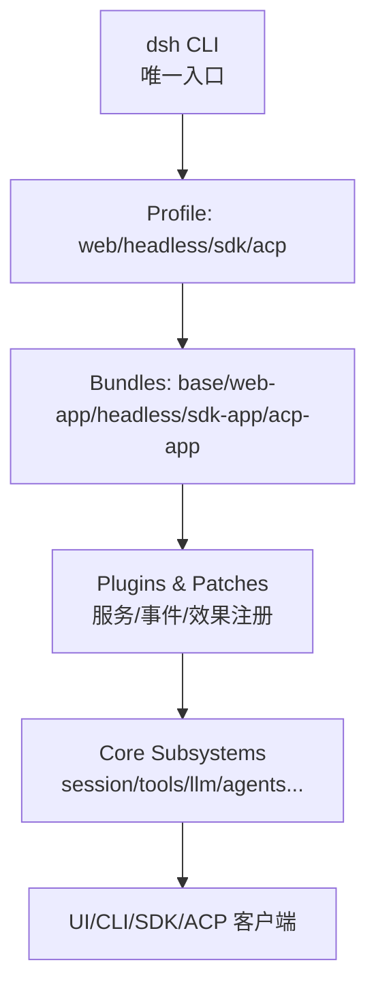
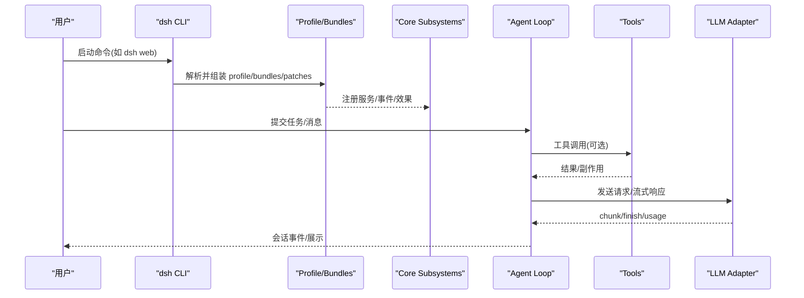
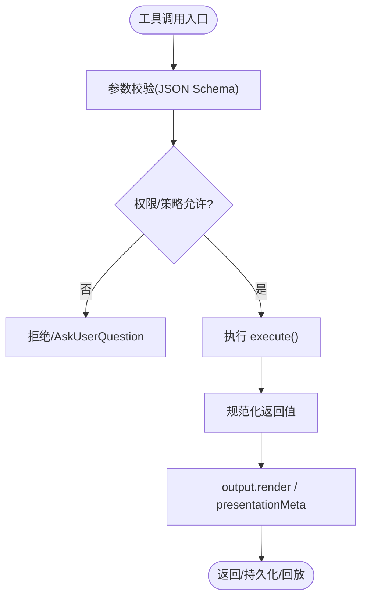
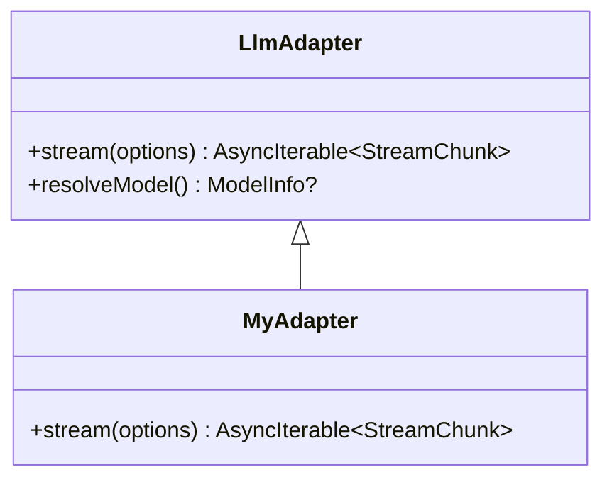
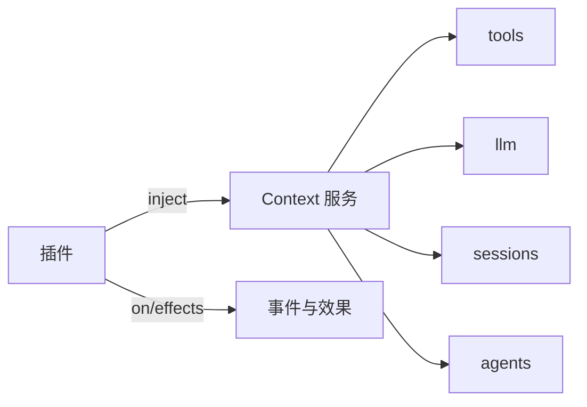

# 学习路径

<cite>
**本文引用的文件**
- [README.md](file://README.md)
- [apps/cli/README.md](file://apps/cli/README.md)
- [docs/development.md](file://docs/development.md)
- [docs/architecture.md](file://docs/architecture.md)
- [docs/cordis-primer.md](file://docs/cordis-primer.md)
- [docs/cordis-tutorial/index.md](file://docs/cordis-tutorial/index.md)
- [docs/user/guide/index.md](file://docs/user/guide/index.md)
- [docs/cookbook/extension-cookbook.md](file://docs/cookbook/extension-cookbook.md)
- [docs/cookbook/adding-a-tool.md](file://docs/cookbook/adding-a-tool.md)
- [docs/cookbook/adding-an-llm-adapter.md](file://docs/cookbook/adding-an-llm-adapter.md)
- [CONTRIBUTING.md](file://CONTRIBUTING.md)
</cite>

## 目录
1. [简介](#简介)
2. [项目结构](#项目结构)
3. [核心组件](#核心组件)
4. [架构总览](#架构总览)
5. [详细组件分析](#详细组件分析)
6. [依赖关系分析](#依赖关系分析)
7. [性能与可维护性建议](#性能与可维护性建议)
8. [故障排查指南](#故障排查指南)
9. [结论](#结论)
10. [附录：分角色学习路线与实践清单](#附录分角色学习路线与实践清单)

## 简介
本学习路径面向不同背景的开发者，提供从入门到进阶的系统化路线，覆盖初学者、有经验的插件开发者、系统集成者三类人群。内容基于仓库内的官方文档、教程、示例与最佳实践，帮助你掌握 DeepSeek Harness（dsh）的插件化架构、Cordis 框架、工具与 LLM 适配器开发、Web UI 与 CLI 使用、以及生产集成要点。

## 项目结构
- 应用入口与运行方式
  - dsh CLI 是唯一的 Node 应用启动器，通过“profile + bundles + patch”分层组合运行 Web、Headless、SDK、ACP 等模式。
  - 支持从 npm 直接运行 Web UI，或从源码构建后运行。
- 文档与教程
  - 架构、开发指南、Cordis 入门与教程、用户指南、Cookbook（工具、LLM 适配器、扩展模式）。
- 包与子系统
  - packages 下按能力划分（core、llm、tools、web、session 等），subsystems 文档描述各子系统职责与扩展点。
- 测试与快照
  - apps/web 与 snapshots 提供端到端与回放用例，便于理解交互流程与输出形态。

图表来源
- [apps/cli/README.md](file://apps/cli/README.md)
- [docs/architecture.md](file://docs/architecture.md)

章节来源
- [README.md:17-41](file://README.md#L17-L41)
- [apps/cli/README.md:1-56](file://apps/cli/README.md#L1-L56)
- [docs/architecture.md:15-47](file://docs/architecture.md#L15-L47)

## 核心组件
- Cordis 插件框架
  - 以 Context 为中心，插件声明依赖 inject，通过 effect/on 注册可撤销的效果；事件分发模式包括 emit/waterfall/parallel/serial/bail。
- Profile 与 Bundle
  - Profile 是命名组合，Bundle 是配置与代码的分发格式；通过有序层叠加实现可替换能力。
- 核心子系统
  - session、system-prompt、tools、agent、scope、llm、webhook 等，均通过 ctx 暴露键名，作为扩展与替换的边界。
- 事件与 Turn 流
  - turn/step 构成模型请求与工具调用的最小单元；turn/start → claim → assemble → agent/pre-step → step/start → request/stream → tool calls → step/end → turn/end。

章节来源
- [docs/cordis-primer.md:7-46](file://docs/cordis-primer.md#L7-L46)
- [docs/architecture.md:9-16](file://docs/architecture.md#L9-L16)
- [docs/architecture.md:49-73](file://docs/architecture.md#L49-L73)
- [docs/architecture.md:74-101](file://docs/architecture.md#L74-L101)

## 架构总览
下图展示了 dsh 的典型调用链：CLI 选择 profile，加载 bundles 与 patches，挂载插件与服务，进入 Agent 循环处理 turn/step，并通过 tools 与 llm 完成工作。

图表来源
- [apps/cli/README.md:7-18](file://apps/cli/README.md#L7-L18)
- [docs/architecture.md:49-73](file://docs/architecture.md#L49-L73)
- [docs/architecture.md:74-101](file://docs/architecture.md#L74-L101)

## 详细组件分析

### 插件与工具开发（面向插件开发者）
- 插件基础
  - 函数/对象/类三种形式；通过 apply(ctx) 注册能力；inject 声明依赖；effect 管理生命周期。
- 工具定义
  - 使用 defineTool 注册 model-facing 工具；参数 schema 自动校验；返回规范 JSON；支持 output.render/presentationMeta 控制 UI 与回放。
- 执行策略与观察
  - 通过 tools/pre-execute/post-execute/execute/result 进行权限、超时、重试、指标收集与审计；guard 提供单调拒绝。
- 长任务
  - run_in_background 配合 jobs 管理后台任务；提供 cancel/done/readOutput 契约。

图表来源
- [docs/cookbook/adding-a-tool.md:7-66](file://docs/cookbook/adding-a-tool.md#L7-L66)
- [docs/cookbook/extension-cookbook.md:7-34](file://docs/cookbook/extension-cookbook.md#L7-L34)

章节来源
- [docs/user/develop/basic/index.md:15-145](file://docs/user/develop/basic/index.md#L15-L145)
- [docs/cookbook/adding-a-tool.md:7-102](file://docs/cookbook/adding-a-tool.md#L7-L102)
- [docs/cookbook/extension-cookbook.md:7-34](file://docs/cookbook/extension-cookbook.md#L7-L34)

### LLM 适配器接入（面向模型集成者）
- 适配器形状
  - 继承 LlmAdapter，实现 stream(options) 产出 StreamChunk；通过 registerAdapter 注册到 ctx.llm。
- 协议义务
  - usage 在 finish 前发出；tool-call arguments 为原始 JSON 字符串；错误两种路径（throw 或 finish{kind:'error'|'aborted'}）；尊重 signal；不支持选项抛错；必要时提供 replayState。
- 模型能力与推理强度
  - resolveModel 暴露 provider/model 身份与 reasoning/effect 能力；defaultEffort 仅在存在时声明。

图表来源
- [docs/cookbook/adding-an-llm-adapter.md:7-44](file://docs/cookbook/adding-an-llm-adapter.md#L7-L44)

章节来源
- [docs/cookbook/adding-an-llm-adapter.md:1-44](file://docs/cookbook/adding-an-llm-adapter.md#L1-L44)

### Web 与 CLI 使用（面向终端用户与集成者）
- Web UI
  - 安装依赖后通过 npm 或源码运行；设置模型（API Key）、选择工作区、发起任务。
- CLI 模式
  - dsh web、headless、sdk、sdk-minimal、acp 等；profile 由 bundles 与 patches 组成；可用 --dump-config 查看组合树。
- 环境变量与密钥
  - 通过 DEEPSEEK_API_KEY 等注入；避免提交真实密钥。

章节来源
- [docs/user/guide/index.md:1-31](file://docs/user/guide/index.md#L1-L31)
- [apps/cli/README.md:7-56](file://apps/cli/README.md#L7-L56)
- [docs/development.md:92-101](file://docs/development.md#L92-L101)

### 事件与 Turn 流（面向高级定制者）
- 事件类型
  - Session 事件（持久化）、Agent 事件（运行时）、Capability 事件（能力缝）。
- Turn 流程
  - turn/start → claim → assemble → agent/pre-step → step/start → request/stream → tool calls → step/end → turn/end。
- 扩展点
  - 通过监听/拦截事件实现权限、计划、压缩、系统提示、子代理、工作流等。

章节来源
- [docs/architecture.md:64-101](file://docs/architecture.md#L64-L101)
- [docs/architecture.md:117-143](file://docs/architecture.md#L117-L143)

## 依赖关系分析
- 插件与上下文
  - 插件通过 inject 声明对 ctx.* 的依赖，加载顺序由依赖决定而非手动编排。
- Profile/Bundles/Patches
  - 启动时按序叠加，任何行均可被上层 patch 替换或插入新行。
- 子系统耦合
  - 核心子系统通过 ctx 键解耦；新增行为应挂载到已文档化的扩展点，避免修改循环本身。

图表来源
- [docs/cordis-primer.md:7-14](file://docs/cordis-primer.md#L7-L14)
- [docs/architecture.md:49-73](file://docs/architecture.md#L49-L73)

章节来源
- [docs/cordis-primer.md:7-46](file://docs/cordis-primer.md#L7-L46)
- [docs/architecture.md:15-47](file://docs/architecture.md#L15-L47)

## 性能与可维护性建议
- 优先使用事件与钩子扩展，避免侵入主循环；利用 tools/pre-execute/post-execute 做统一策略与观测。
- 工具输出保持纯函数渲染，presentationMeta 承载可回放的结构化元数据。
- 长任务走 jobs 通道，避免阻塞主线程；合理使用 exec.signal 取消。
- 适配器严格遵循协议约定，确保 usage/finish 顺序与错误路径一致。
- 使用 profile/patch 组织多环境差异，避免硬编码分支。

[本节为通用指导，不直接分析具体文件]

## 故障排查指南
- 无法加载插件
  - 检查 cordis.yml 中插件路径是否为绝对路径；确认依赖服务是否已就绪（inject）。
- 工具无输出或 UI 异常
  - 确认 output.schema/output.render/presentationMeta 一致性；回放需纯函数。
- 适配器行为异常
  - 核对 StreamChunk 协议、usage/finish 顺序、signal 处理、replayState 合法性。
- 权限/策略阻断
  - 检查 tools/pre-execute 策略；必要时使用 ask 或调整 policy。
- 构建/类型检查失败
  - 先执行完整构建；关注 Host/Client 双聚合类型生成与 Typert 产物。

章节来源
- [docs/user/develop/basic/index.md:46-68](file://docs/user/develop/basic/index.md#L46-L68)
- [docs/cookbook/adding-a-tool.md:40-66](file://docs/cookbook/adding-a-tool.md#L40-L66)
- [docs/cookbook/adding-an-llm-adapter.md:25-35](file://docs/cookbook/adding-an-llm-adapter.md#L25-L35)
- [docs/development.md:64-90](file://docs/development.md#L64-L90)

## 结论
DeepSeek Harness 以“一切皆插件”的架构提供了高度可扩展的 Agent 平台。通过 Cordis 的事件与效果机制、Profile/Bundles 的组合方式，以及完善的工具与 LLM 适配器契约，开发者可以安全地扩展能力、定制体验并集成多种后端。建议按本学习路径循序渐进，结合教程与 Cookbook 完成实践项目，逐步达到生产级集成水平。

[本节为总结，不直接分析具体文件]

## 附录：分角色学习路线与实践清单

### 初学者（首次接触 dsh）
- 目标
  - 能运行 Web UI，配置模型与工作区，发起简单任务；理解基本术语与概念。
- 推荐材料
  - 快速开始与运行说明：[README.md](file://README.md)
  - Web UI 使用指南：[docs/user/guide/index.md](file://docs/user/guide/index.md)
  - CLI 模式概览：[apps/cli/README.md](file://apps/cli/README.md)
- 实践步骤
  - 从源码安装并运行 Web UI；配置 API Key；选择一个工作区；发送一条任务。
  - 尝试 headless 模式执行一次性任务。
- 评估要点
  - 能否独立启动 Web/Headless；能否正确设置模型与工作区；能否解释 turn 的基本含义。

章节来源
- [README.md:17-41](file://README.md#L17-L41)
- [docs/user/guide/index.md:1-31](file://docs/user/guide/index.md#L1-L31)
- [apps/cli/README.md:7-18](file://apps/cli/README.md#L7-L18)

### 有经验的插件开发者（TS/Node 背景）
- 目标
  - 能编写插件与工具，理解 Cordis 的生命周期、事件与效果；能接入新的 LLM 适配器。
- 推荐材料
  - Cordis 入门与教程：[docs/cordis-primer.md](file://docs/cordis-primer.md)、[docs/cordis-tutorial/index.md](file://docs/cordis-tutorial/index.md)
  - 工具开发参考：[docs/cookbook/adding-a-tool.md](file://docs/cookbook/adding-a-tool.md)
  - LLM 适配器接入：[docs/cookbook/adding-an-llm-adapter.md](file://docs/cookbook/adding-an-llm-adapter.md)
  - 扩展模式与最佳实践：[docs/cookbook/extension-cookbook.md](file://docs/cookbook/extension-cookbook.md)
- 实践步骤
  - 从零创建一个最小插件并加载到 Web UI；实现一个带 schema 的工具；实现一个 LLM 适配器并注册到 ctx.llm。
  - 使用 tools/pre-execute 实现权限门控；用 jobs 实现后台任务。
- 评估要点
  - 是否能正确使用 inject/apply/effect；是否能写出符合契约的工具与适配器；是否能通过事件扩展行为。

章节来源
- [docs/cordis-primer.md:7-46](file://docs/cordis-primer.md#L7-L46)
- [docs/cordis-tutorial/index.md:1-61](file://docs/cordis-tutorial/index.md#L1-L61)
- [docs/cookbook/adding-a-tool.md:7-102](file://docs/cookbook/adding-a-tool.md#L7-L102)
- [docs/cookbook/adding-an-llm-adapter.md:1-44](file://docs/cookbook/adding-an-llm-adapter.md#L1-L44)
- [docs/cookbook/extension-cookbook.md:7-34](file://docs/cookbook/extension-cookbook.md#L7-L34)

### 系统集成者（企业/平台集成）
- 目标
  - 能将 dsh 嵌入自有系统，使用 SDK/ACP/Headless 模式；设计 Profile 与 Patch 组合；制定权限与安全策略。
- 推荐材料
  - 架构与扩展点地图：[docs/architecture.md](file://docs/architecture.md)
  - 开发环境与构建流程：[docs/development.md](file://docs/development.md)
  - CLI 模式与 Profile 组合：[apps/cli/README.md](file://apps/cli/README.md)
- 实践步骤
  - 搭建本地开发环境并完成一次完整构建；创建自定义 Profile，叠加 bundles 与 patches；通过 SDK/ACP 模式对接外部系统；实现统一的权限策略与审计。
- 评估要点
  - 能否通过 Profile/Patch 组合出多环境部署；能否通过事件与策略保障安全与合规；能否稳定集成 SDK/ACP。

章节来源
- [docs/architecture.md:15-47](file://docs/architecture.md#L15-L47)
- [docs/development.md:42-90](file://docs/development.md#L42-L90)
- [apps/cli/README.md:33-56](file://apps/cli/README.md#L33-L56)

### 认证与社区资源建议
- 官方文档站点与仓库 README 为首选权威来源。
- 社区交流
  - GitHub Discussions 反馈与建议；Discord 社区参与讨论。
- 生态可见性
  - 将插件仓库添加 dsh-plugin 主题，便于他人发现与复用。
- 贡献方式
  - 当前暂不接受外部 PR；可通过报告问题、撰写指南、回答社区问题等方式参与。

章节来源
- [README.md:43-51](file://README.md#L43-L51)
- [CONTRIBUTING.md:9-23](file://CONTRIBUTING.md#L9-L23)