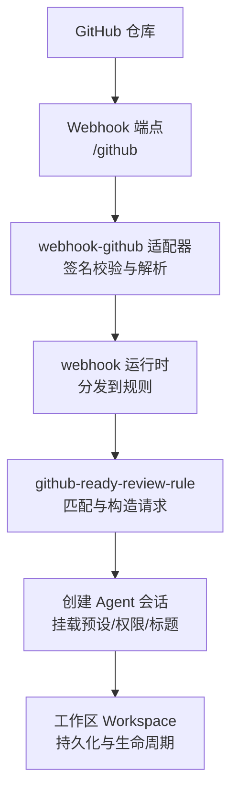
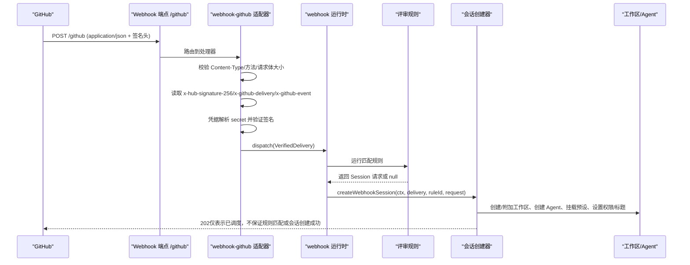
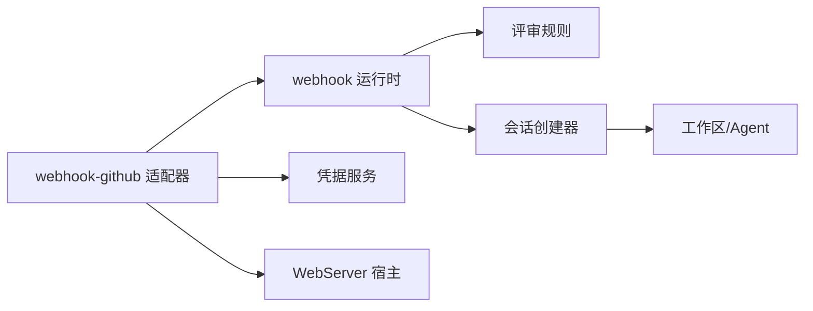

# GitHub代码审查自动化

<cite>
**本文引用的文件**
- [apps/cli/config/examples/github-review/cordis.yml](file://apps/cli/config/examples/github-review/cordis.yml)
- [apps/cli/config/examples/github-review/github-ready-review-rule.mjs](file://apps/cli/config/examples/github-review/github-ready-review-rule.mjs)
- [packages/webhook/webhook-github/src/index.ts](file://packages/webhook/webhook-github/src/index.ts)
- [packages/webhook/webhook-github/src/handler.ts](file://packages/webhook/webhook-github/src/handler.ts)
- [packages/webhook/webhook/src/session.ts](file://packages/webhook/webhook/src/session.ts)
- [packages/webhook/webhook/src/index.ts](file://packages/webhook/webhook/src/index.ts)
- [docs/user/guide/github-review.zh.md](file://docs/user/guide/github-review.zh.md)
- [docs/subsystems/webhook.md](file://docs/subsystems/webhook.md)
</cite>

## 目录
1. [简介](#简介)
2. [项目结构](#项目结构)
3. [核心组件](#核心组件)
4. [架构总览](#架构总览)
5. [详细组件分析](#详细组件分析)
6. [依赖关系分析](#依赖关系分析)
7. [性能与可靠性](#性能与可靠性)
8. [故障排查指南](#故障排查指南)
9. [结论](#结论)
10. [附录：可复用模板与扩展点](#附录可复用模板与扩展点)

## 简介
本案例文档面向使用 DeepSeek Harness（DSH）实现“GitHub Pull Request 自动代码审查”的部署与开发需求。内容涵盖：
- PR 触发机制：通过 GitHub Webhook 将事件安全投递到 DSH。
- 代码分析流程：规则匹配、上下文构建、Agent 会话创建与提示词注入。
- 审查规则定义：基于 cordis.yml 与自定义规则脚本，限定来源、仓库、事件与动作。
- 结果报告生成：以只读 Agent 会话形式产出审查意见，遵循权限与策略约束。
- 配置详解：Webhook 监听、智能体配置、工具链设置与权限控制。
- 完整实现路径：从 HTTP 入口到 Session 创建的端到端链路。
- 错误处理、重试与性能优化建议。
- 可复用模板与扩展点说明。

## 项目结构
与 GitHub 代码审查自动化直接相关的目录与文件包括：
- 示例 overlay 配置：apps/cli/config/examples/github-review/cordis.yml
- 评审规则脚本：apps/cli/config/examples/github-review/github-ready-review-rule.mjs
- GitHub Webhook 适配器：packages/webhook/webhook-github/src/index.ts 与 handler.ts
- Webhook 运行时与会话创建：packages/webhook/webhook/src/index.ts 与 session.ts
- 用户指南与子系统文档：docs/user/guide/github-review.zh.md 与 docs/subsystems/webhook.md

图表来源
- [packages/webhook/webhook-github/src/handler.ts:78-131](file://packages/webhook/webhook-github/src/handler.ts#L78-L131)
- [packages/webhook/webhook/src/index.ts:58-70](file://packages/webhook/webhook/src/index.ts#L58-L70)
- [packages/webhook/webhook/src/session.ts:119-181](file://packages/webhook/webhook/src/session.ts#L119-L181)
- [apps/cli/config/examples/github-review/github-ready-review-rule.mjs:15-65](file://apps/cli/config/examples/github-review/github-ready-review-rule.mjs#L15-L65)

章节来源
- [apps/cli/config/examples/github-review/cordis.yml:1-36](file://apps/cli/config/examples/github-review/cordis.yml#L1-L36)
- [docs/user/guide/github-review.zh.md:1-103](file://docs/user/guide/github-review.zh.md#L1-L103)

## 核心组件
- Webhook 入站适配层：负责接收 GitHub 推送、校验签名、限制请求体大小、解析 JSON 并转换为内部交付对象。
- Webhook 运行时：维护规则注册表，按 delivery 快照后分发给所有匹配规则；无队列、无重试、无去重。
- 评审规则：根据 source、event name、action、repository 等条件过滤，构造 Session 请求（workspacePath、agentPreset、permissionPreset、title、prompt）。
- 会话创建器：解析预设、创建工作区、创建 Agent、挂载预设、应用权限、设置标题、注入初始消息，完成持久化附着。
- 配置 overlay：在现有 Web 组合之上插入 webhook 运行时、规则与隔离的 WebServer，暴露 /github 路由。

章节来源
- [packages/webhook/webhook-github/src/index.ts:1-63](file://packages/webhook/webhook-github/src/index.ts#L1-L63)
- [packages/webhook/webhook-github/src/handler.ts:1-131](file://packages/webhook/webhook-github/src/handler.ts#L1-L131)
- [packages/webhook/webhook/src/index.ts:38-70](file://packages/webhook/webhook/src/index.ts#L38-L70)
- [packages/webhook/webhook/src/session.ts:108-181](file://packages/webhook/webhook/src/session.ts#L108-L181)
- [apps/cli/config/examples/github-review/cordis.yml:1-36](file://apps/cli/config/examples/github-review/cordis.yml#L1-L36)

## 架构总览
下图展示了从 GitHub 事件到 Agent 会话的完整调用链，以及关键的安全与权限控制点。

图表来源
- [packages/webhook/webhook-github/src/handler.ts:78-131](file://packages/webhook/webhook-github/src/handler.ts#L78-L131)
- [packages/webhook/webhook/src/index.ts:58-70](file://packages/webhook/webhook/src/index.ts#L58-L70)
- [packages/webhook/webhook/src/session.ts:119-181](file://packages/webhook/webhook/src/session.ts#L119-L181)
- [apps/cli/config/examples/github-review/github-ready-review-rule.mjs:15-65](file://apps/cli/config/examples/github-review/github-ready-review-rule.mjs#L15-L65)

## 详细组件分析

### Webhook 入站适配器（webhook-github）
- 职责：
  - 注册精确路由 path（如 /github），绑定到隔离 WebServer。
  - 校验请求方法、Content-Type、请求体大小上限。
  - 提取并校验签名头与事件头，解析凭据中的 webhook secret。
  - 使用 Octokit Webhooks 验证签名，失败返回 401。
  - 将 payload 转为不可变 JSON 快照，封装为 VerifiedWebhookDelivery 并交给运行时。
- 错误处理：
  - 非法方法/类型/签名/凭据缺失等分别返回 405/415/401/503。
  - 运行时不可用返回 503。
- 性能与安全：
  - 严格限制请求体大小，避免内存膨胀。
  - 仅接受 application/json 且 UTF-8 字符集。
  - 响应 202 表示已接受并调度，不承诺后续结果。

章节来源
- [packages/webhook/webhook-github/src/index.ts:16-63](file://packages/webhook/webhook-github/src/index.ts#L16-L63)
- [packages/webhook/webhook-github/src/handler.ts:24-131](file://packages/webhook/webhook-github/src/handler.ts#L24-L131)

### Webhook 运行时（webhook）
- 职责：
  - 维护规则注册表，对 delivery 进行快照与冻结，确保跨规则共享一致性。
  - 分发 delivery 给所有匹配规则，fire-and-forget，不等待回调完成。
  - 无队列、无重试、无去重、无执行状态；重复投递可能产生重复会话。
- 会话创建：
  - 解析 agent/permission 预设，创建或复用 Workspace，创建 Agent，挂载预设，设置权限与标题，注入初始消息。
  - 初始消息包含 webhook/provider/source/delivery/rule 溯源信息。
- 回滚与清理：
  - 若会话附着失败，尝试分离工作区并释放 Agent，记录回滚失败日志。

章节来源
- [packages/webhook/webhook/src/index.ts:38-70](file://packages/webhook/webhook/src/index.ts#L38-L70)
- [packages/webhook/webhook/src/session.ts:108-181](file://packages/webhook/webhook/src/session.ts#L108-L181)
- [docs/subsystems/webhook.md:17-29](file://docs/subsystems/webhook.md#L17-L29)

### 评审规则（github-ready-review-rule）
- 匹配条件：
  - source 必须等于配置的 source。
  - event.name 必须为 pull_request。
  - payload.action 必须为 ready_for_review。
  - payload.repository.full_name 必须等于配置的 repository。
- 输出：
  - workspacePath：指向本地仓库路径（可通过环境变量覆盖）。
  - agentPreset/permissionPreset：选择标准智能体与只读权限。
  - title/prompt：包含 PR 编号、head SHA、只读检查要求、禁止修改文件/分支/PR/GitHub 状态等指令。
  - 将 event_metadata_json 标记为不受信任元数据。
- 扩展点：
  - run() 是受信任 JavaScript，可在返回前查询内部策略服务或映射仓库到不同工作区。

章节来源
- [apps/cli/config/examples/github-review/github-ready-review-rule.mjs:1-65](file://apps/cli/config/examples/github-review/github-ready-review-rule.mjs#L1-L65)
- [docs/user/guide/github-review.zh.md:66-103](file://docs/user/guide/github-review.zh.md#L66-L103)

### Cordis Overlay 配置（cordis.yml）
- 插入项：
  - webhook-runtime：启用 webhook 运行时。
  - github-ready-review-rule：加载评审规则脚本，配置 source、repository、workspacePath、agentPreset、permissionPreset。
  - 隔离 WebServer：监听 127.0.0.1:3081，仅暴露 /github。
  - webhook-github 适配器：绑定 source、path、secretEnv、maxBodyBytes。
- 环境变量：
  - DSH_GITHUB_WEBHOOK_SECRET：高熵密钥，用于签名校验。
  - DSH_GITHUB_REVIEW_WORKSPACE：工作区路径，默认当前目录。
  - DSH_GITHUB_WEBHOOK_PORT：Webhook 端口，默认 3081。

章节来源
- [apps/cli/config/examples/github-review/cordis.yml:1-36](file://apps/cli/config/examples/github-review/cordis.yml#L1-L36)
- [docs/user/guide/github-review.zh.md:7-38](file://docs/user/guide/github-review.zh.md#L7-L38)

## 依赖关系分析
- 适配器依赖：
  - @deepseek-ai/dsh-webhook：提供 WebhookRuleId/WebhookSourceId/WebhookDeliveryId 等标识与运行时接口。
  - @deepseek-ai/dsh-host-webserver：提供 WebRoute 注册能力。
  - @deepseek-ai/dsh-credentials：凭据引用解析。
  - @octokit/webhooks：签名验证。
- 运行时依赖：
  - agents、agentPresets、permissionPresets、sessionTitle、workspaceRegistry 等服务。
- 规则依赖：
  - 仅依赖 webhookRuntime 与 schema 校验库。

图表来源
- [packages/webhook/webhook-github/src/index.ts:11-14](file://packages/webhook/webhook-github/src/index.ts#L11-L14)
- [packages/webhook/webhook/src/index.ts:58-66](file://packages/webhook/webhook/src/index.ts#L58-L66)
- [packages/webhook/webhook/src/session.ts:126-143](file://packages/webhook/webhook/src/session.ts#L126-L143)

章节来源
- [packages/webhook/webhook-github/src/index.ts:1-63](file://packages/webhook/webhook-github/src/index.ts#L1-L63)
- [packages/webhook/webhook/src/index.ts:58-70](file://packages/webhook/webhook/src/index.ts#L58-L70)

## 性能与可靠性
- 入站侧：
  - 严格限制请求体大小，防止大负载导致内存压力。
  - 快速失败：方法/类型/签名/凭据错误立即返回明确状态码。
  - 202 语义：仅表示已接受并调度，避免耦合外部系统可用性。
- 运行时侧：
  - fire-and-forget：不排队、不重试、不去重；重复投递可能产生重复会话。
  - 快照与冻结：delivery 被快照并冻结，避免异步副作用污染。
- 会话侧：
  - 先创建/附加工作区，再挂载预设与权限，最后注入消息；失败时回滚分离与释放。
- 建议：
  - 在高并发场景下，结合反向代理限流与速率限制。
  - 如需幂等与重试，应在上层编排（例如 CI 或网关层）实现，而非在运行时内建。
  - 监控 webhook 入站错误率与规则匹配率，及时定位问题。

章节来源
- [packages/webhook/webhook-github/src/handler.ts:44-131](file://packages/webhook/webhook-github/src/handler.ts#L44-L131)
- [packages/webhook/webhook/src/index.ts:38-70](file://packages/webhook/webhook/src/index.ts#L38-L70)
- [packages/webhook/webhook/src/session.ts:146-181](file://packages/webhook/webhook/src/session.ts#L146-L181)
- [docs/subsystems/webhook.md:17-29](file://docs/subsystems/webhook.md#L17-L29)

## 故障排查指南
- 常见错误与原因：
  - 405 方法不允许：非 POST 请求。
  - 415 不支持的内容类型：Content-Type 不是 application/json 或字符集不符合。
  - 401 无效签名：x-hub-signature-256 与 secret 不匹配或缺失。
  - 503 凭据不可用：secret 未配置或为空。
  - 503 运行时不可用：webhook 运行时未就绪或抛出异常。
- 排查步骤：
  - 确认 GitHub Webhook 配置：Payload URL、Content type、Secret、Events。
  - 检查环境变量：DSH_GITHUB_WEBHOOK_SECRET、DSH_GITHUB_WEBHOOK_PORT、DSH_GITHUB_REVIEW_WORKSPACE。
  - 查看入站日志：handler 中捕获的错误与警告。
  - 检查规则匹配：source、event name、action、repository 是否一致。
  - 检查工作区与权限：workspacePath 是否存在、agent/permission preset 是否可用。
- 日志与诊断：
  - 运行时会记录 dispatch 不可用与请求失败的警告。
  - 会话创建失败时会记录工作区分离与 Agent 释放的回滚失败。

章节来源
- [packages/webhook/webhook-github/src/handler.ts:24-131](file://packages/webhook/webhook-github/src/handler.ts#L24-L131)
- [packages/webhook/webhook/src/session.ts:166-181](file://packages/webhook/webhook/src/session.ts#L166-L181)

## 结论
DeepSeek Harness 通过“webhook-github 适配器 + webhook 运行时 + 评审规则 + 会话创建器”的组合，实现了从 GitHub PR 事件到只读 Agent 审查会话的端到端自动化。其设计强调：
- 安全：严格的签名校验与最小权限模型。
- 解耦：HTTP 入站与后续 Agent 工作解耦，202 语义避免外部依赖阻塞。
- 可扩展：规则脚本支持程序化扩展，便于接入内部策略与服务。
- 可观测：通过 Session 持久化与溯源信息，便于审计与排障。

## 附录：可复用模板与扩展点
- 可复用模板：
  - 评审规则模板：参考 github-ready-review-rule.mjs，替换 source、repository、workspacePath、agentPreset、permissionPreset。
  - Cordis overlay 模板：参考 apps/cli/config/examples/github-review/cordis.yml，按需调整端口与工作区路径。
- 扩展点：
  - 策略前置：在规则 run() 中调用内部策略服务决定是否自动审查。
  - 多仓库映射：根据 repository.full_name 映射到不同 workspacePath。
  - 自定义提示词：在 prompt 中增加特定领域检查清单或合规要求。
  - 权限与预设：通过 permissionPreset 与 agentPreset 控制行为边界。
- 最佳实践：
  - 使用只读权限与禁止修改指令，确保审查过程安全可控。
  - 将 event_metadata_json 视为不受信任元数据，避免注入攻击。
  - 在高流量环境配合反向代理限流与监控告警。

章节来源
- [apps/cli/config/examples/github-review/github-ready-review-rule.mjs:15-65](file://apps/cli/config/examples/github-review/github-ready-review-rule.mjs#L15-L65)
- [apps/cli/config/examples/github-review/cordis.yml:1-36](file://apps/cli/config/examples/github-review/cordis.yml#L1-L36)
- [docs/user/guide/github-review.zh.md:74-103](file://docs/user/guide/github-review.zh.md#L74-L103)