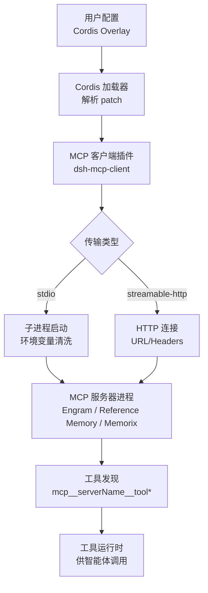
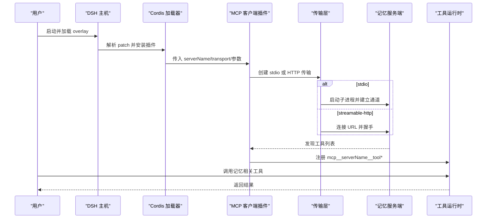
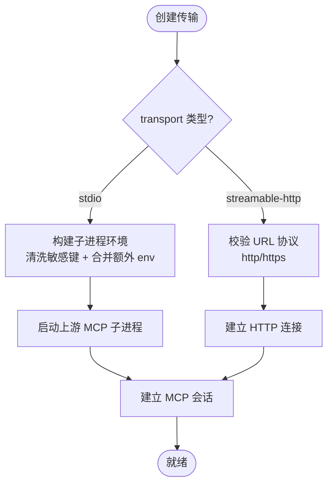
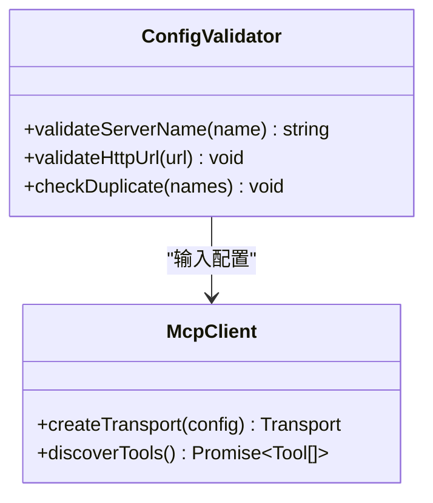
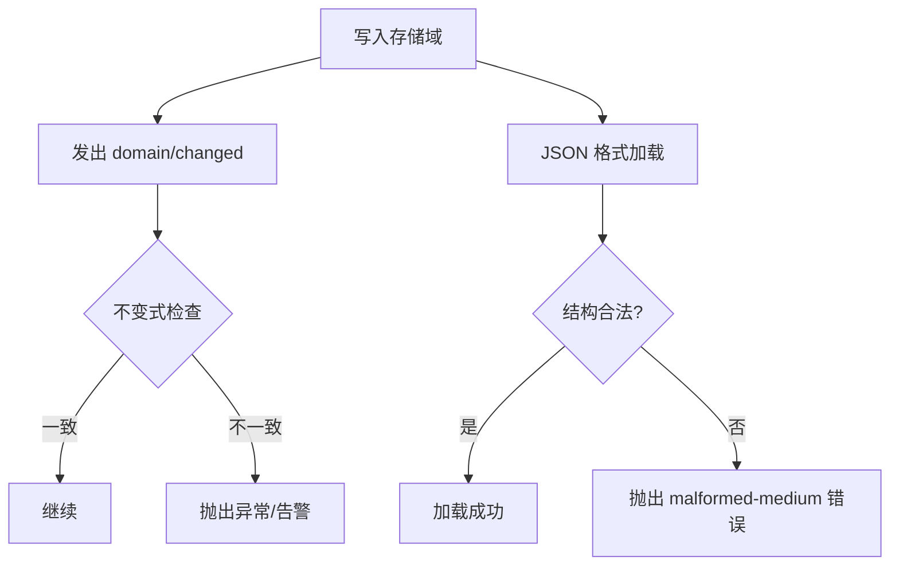
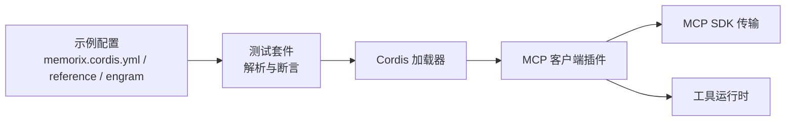

# MCP记忆系统集成

<cite>
**本文引用的文件**
- [mcp-memory.md](file://docs/user/guide/mcp-memory.md)
- [memory-mcp-configs.spec.ts](file://apps/cli/tests/memory-mcp-configs.spec.ts)
- [transport.ts](file://packages/mcp/mcp-client/src/transport.ts)
- [mcp.ts](file://packages/acp/acp/src/mcp.ts)
- [invariant.ts](file://packages/storage/storage-domain/src/invariant.ts)
- [format.ts](file://packages/storage/storage-json/src/format.ts)
</cite>

## 目录
1. [简介](#简介)
2. [项目结构](#项目结构)
3. [核心组件](#核心组件)
4. [架构总览](#架构总览)
5. [详细组件分析](#详细组件分析)
6. [依赖关系分析](#依赖关系分析)
7. [性能与容量规划](#性能与容量规划)
8. [故障排除指南](#故障排除指南)
9. [结论](#结论)
10. [附录：配置与使用示例](#附录配置与使用示例)

## 简介
本文件面向在 DeepSeek Harness（DSH）中集成第三方 MCP 记忆系统的工程实践，覆盖 Engram、Reference Memory、Memorix 三类记忆后端。文档说明 DSH 如何通过通用 MCP 客户端桥接这些外部服务，将它们的工具暴露为可被智能体调用的能力；并给出配置要点、生命周期管理、缓存与同步机制、典型使用场景以及排障与性能建议。

## 项目结构
DSH 对第三方记忆系统的集成以“配置即插件”的方式实现：通过 Cordis overlay 插入一个名为 `@deepseek-ai/dsh-mcp-client` 的插件行，指定 serverName、transport、命令或 HTTP 端点与环境变量。测试套件验证了三种官方示例配置的字段、包版本固定与安全策略，并在启动后等待工具发现完成。

图表来源
- [memory-mcp-configs.spec.ts:37-59](file://apps/cli/tests/memory-mcp-configs.spec.ts#L37-L59)
- [transport.ts:1-23](file://packages/mcp/mcp-client/src/transport.ts#L1-L23)
- [mcp-memory.md:9-14](file://docs/user/guide/mcp-memory.md#L9-L14)

章节来源
- [memory-mcp-configs.spec.ts:1-133](file://apps/cli/tests/memory-mcp-configs.spec.ts#L1-L133)
- [mcp-memory.md:9-34](file://docs/user/guide/mcp-memory.md#L9-L34)

## 核心组件
- 通用 MCP 客户端插件：负责根据配置创建 stdio 或 Streamable HTTP 传输，启动/连接上游 MCP 服务，进行工具发现与注册，并提供超时、失败策略等控制。
- 传输层：
  - stdio：以子进程方式运行上游 MCP 服务，自动清理敏感环境变量，避免凭据泄露。
  - streamable-http：直接连接远程 MCP 服务，支持自定义请求头。
- 配置校验与命名规范：ACP 侧对 server name 规范化、URL 合法性、重复名检测等进行严格校验，确保工具命名稳定且安全。
- 存储域不变式：当系统通过存储域写入数据时，会触发领域变更事件，并与内存状态进行一致性断言，保障“事件快照与内存一致”。

章节来源
- [transport.ts:1-23](file://packages/mcp/mcp-client/src/transport.ts#L1-L23)
- [mcp.ts:35-143](file://packages/acp/acp/src/mcp.ts#L35-L143)
- [invariant.ts:23-67](file://packages/storage/storage-domain/src/invariant.ts#L23-L67)

## 架构总览
下图展示了从配置到工具可用的端到端流程，以及不同记忆后端的差异点。

图表来源
- [memory-mcp-configs.spec.ts:98-131](file://apps/cli/tests/memory-mcp-configs.spec.ts#L98-L131)
- [transport.ts:1-23](file://packages/mcp/mcp-client/src/transport.ts#L1-L23)
- [mcp-memory.md:9-14](file://docs/user/guide/mcp-memory.md#L9-L14)

## 详细组件分析

### 传输层与子进程安全
- stdio 传输会基于统一的环境清洗函数构建子进程环境，移除通常用于标识凭据的环境变量以及所有 DSH_* 变量，仅保留必要的环境注入。这降低了凭据泄露风险。
- HTTP 传输要求绝对 HTTP(S) URL，并对 headers 做结构化转换。

图表来源
- [transport.ts:1-23](file://packages/mcp/mcp-client/src/transport.ts#L1-L23)
- [mcp.ts:124-143](file://packages/acp/acp/src/mcp.ts#L124-L143)

章节来源
- [transport.ts:1-23](file://packages/mcp/mcp-client/src/transport.ts#L1-L23)
- [mcp.ts:35-73](file://packages/acp/acp/src/mcp.ts#L35-L73)

### 配置校验与工具命名
- 对重复 server name 进行拦截，防止工具命名冲突。
- 对 server name 进行规范化，保证工具名稳定、可预测。
- 对 HTTP URL 进行严格校验，拒绝非 http/https。

图表来源
- [mcp.ts:35-73](file://packages/acp/acp/src/mcp.ts#L35-L73)
- [mcp.ts:110-143](file://packages/acp/acp/src/mcp.ts#L110-L143)

章节来源
- [mcp.ts:35-73](file://packages/acp/acp/src/mcp.ts#L35-L73)
- [mcp.ts:110-143](file://packages/acp/acp/src/mcp.ts#L110-L143)

### 存储域与事件一致性
- 当存储域写入数据时，会发出 domain/changed 事件。不变式检查器会比对事件快照与当前内存值，若不一致则报告错误，从而保证“事件即事实”的一致性契约。
- JSON 格式加载器在解析持久化状态时对表结构进行严格校验，遇到非法结构抛出存储错误，有助于早期发现问题。

图表来源
- [invariant.ts:23-67](file://packages/storage/storage-domain/src/invariant.ts#L23-L67)
- [format.ts:70-88](file://packages/storage/storage-json/src/format.ts#L70-L88)

章节来源
- [invariant.ts:23-67](file://packages/storage/storage-domain/src/invariant.ts#L23-L67)
- [format.ts:70-88](file://packages/storage/storage-json/src/format.ts#L70-L88)

### 三种记忆后端对比与使用场景
- Memorix
  - 本地启发式模式，无需 LLM 或嵌入服务；可通过其自身配置文件设置可选提供者。
  - 适合快速原型与离线场景，数据默认位于其数据目录，可通过环境变量覆盖。
- MCP Reference Memory
  - 本地知识图谱，提供实体、关系、观察、读取、搜索等工具；搜索为大小写不敏感的子串匹配，非语义检索。
  - 适合轻量级、结构化知识的持久化与检索。
- Engram
  - 自管存储与项目选择，默认数据目录与 Git 项目识别，支持环境变量覆盖。
  - 适合需要强项目隔离与本地存储的场景。

章节来源
- [mcp-memory.md:15-68](file://docs/user/guide/mcp-memory.md#L15-L68)

## 依赖关系分析
- 配置驱动：示例配置仅声明插件行与传输参数，不包含上游二进制或服务逻辑。
- 测试驱动：测试套件解析示例配置，校验字段、版本固定与安全策略，并将上游替换为无密钥的 fixture 服务，验证工具发现链路。
- 运行时依赖：MCP 客户端依赖 SDK 提供的 stdio/HTTP 传输；ACP 侧负责配置校验与命名规范化。

图表来源
- [memory-mcp-configs.spec.ts:37-59](file://apps/cli/tests/memory-mcp-configs.spec.ts#L37-L59)
- [memory-mcp-configs.spec.ts:98-131](file://apps/cli/tests/memory-mcp-configs.spec.ts#L98-L131)

章节来源
- [memory-mcp-configs.spec.ts:1-133](file://apps/cli/tests/memory-mcp-configs.spec.ts#L1-L133)

## 性能与容量规划
- 工具发现异步：首次发现为异步过程，建议在发送首个验证提示前等待 provider 的工具可用。
- 重连与退避：子进程崩溃会自动重连并退避；达到重连预算后会注销工具并停止重连，需重载或重启恢复。
- 搜索复杂度：Reference Memory 的搜索为字符串子串匹配，时间复杂度近似 O(n·m)，在大知识库下应限制查询范围或结合业务索引。
- 存储一致性：存储域事件与内存快照的一致性检查有助于尽早发现并发或序列化问题，但会带来额外开销，应在高吞吐场景评估是否启用。

[本节为通用指导，不直接分析具体文件]

## 故障排除指南
- 工具未出现
  - 确认已等待工具发现完成；检查 transport 配置是否正确（stdio 命令路径、HTTP URL）。
  - 查看日志中是否有子进程启动错误或 HTTP 连接失败。
- 凭据泄露或认证失败
  - stdio 传输会清洗敏感环境变量；如需上游服务凭据，请在配置 env 中显式注入，不要硬编码在 YAML。
- 搜索不准确
  - Reference Memory 搜索为子串匹配，非语义检索；如需语义检索，考虑在上游服务侧扩展或使用其他后端。
- 存储不一致
  - 关注 domain/changed 事件与内存快照一致性检查抛出的异常；检查写入路径与序列化格式。

章节来源
- [mcp-memory.md:74-83](file://docs/user/guide/mcp-memory.md#L74-L83)
- [transport.ts:1-23](file://packages/mcp/mcp-client/src/transport.ts#L1-L23)
- [invariant.ts:23-67](file://packages/storage/storage-domain/src/invariant.ts#L23-L67)

## 结论
DSH 通过统一的 MCP 客户端插件与严格的配置校验，将多种第三方记忆系统无缝接入智能体工作流。不同后端各有侧重：Memorix 适合离线与快速迭代，Reference Memory 适合轻量结构化知识，Engram 适合项目级本地存储。配合存储域事件与不变式检查，可在保证一致性的同时获得良好的可观测性。生产部署时应关注工具发现时序、重连策略、搜索复杂度与存储一致性成本，并结合业务需求选择合适的后端与索引策略。

## 附录：配置与使用示例

### 启用某个记忆后端
- 通过传递 overlay 启用单个记忆系统；也可将其 insert 片段合并到用户 patch 层以实现跨运行持久化选择。
- 注意：示例不包含任何上游二进制或服务，必须按各自要求预先安装或运行。

章节来源
- [mcp-memory.md:23-34](file://docs/user/guide/mcp-memory.md#L23-L34)

### 各后端前置条件与数据存储位置
- Memorix：全局安装指定版本；数据目录可通过环境变量覆盖。
- Reference Memory：全局安装指定版本；JSONL 存储路径可通过环境变量覆盖；搜索为子串匹配。
- Engram：Go 安装或下载发布版；数据目录与项目选择可通过环境变量覆盖。

章节来源
- [mcp-memory.md:35-68](file://docs/user/guide/mcp-memory.md#L35-L68)

### 模型指令增强（可选）
- 可在现有模型指令中添加简短、供应商无关的提示，促使模型在需要时调用记忆写入或搜索工具。

章节来源
- [mcp-memory.md:66-73](file://docs/user/guide/mcp-memory.md#L66-L73)

### 端到端验证流程
- 在会话 A 中让模型写入一条唯一偏好；在会话 B 中查询该偏好并用于建议；确保跨会话可召回。
- 新会话即可，无需重启 Host；子进程崩溃会重连，工具短暂不可用直至重连完成。

章节来源
- [mcp-memory.md:74-83](file://docs/user/guide/mcp-memory.md#L74-L83)

### 接入任意 MCP 服务器
- 复制相同字段并使用唯一的 id 与 serverName；stdio 使用 command/args/env/cwd，HTTP 使用 url/headers。
- 上游服务的安装、身份、鉴权、模型、嵌入、持久化与许可由提供方负责。

章节来源
- [mcp-memory.md:84-102](file://docs/user/guide/mcp-memory.md#L84-L102)

### 配置字段参考（来自测试契约）
- id：插件行唯一标识
- name：固定为 dsh-mcp-client
- config.serverName：上游服务名称
- config.transport：stdio 或 streamable-http
- config.command/args/env/cwd：stdio 传输所需
- config.url/headers：HTTP 传输所需
- toolCallTimeoutMs：工具调用超时
- failOnStartupError：启动失败策略

章节来源
- [memory-mcp-configs.spec.ts:37-59](file://apps/cli/tests/memory-mcp-configs.spec.ts#L37-L59)
- [memory-mcp-configs.spec.ts:98-131](file://apps/cli/tests/memory-mcp-configs.spec.ts#L98-L131)