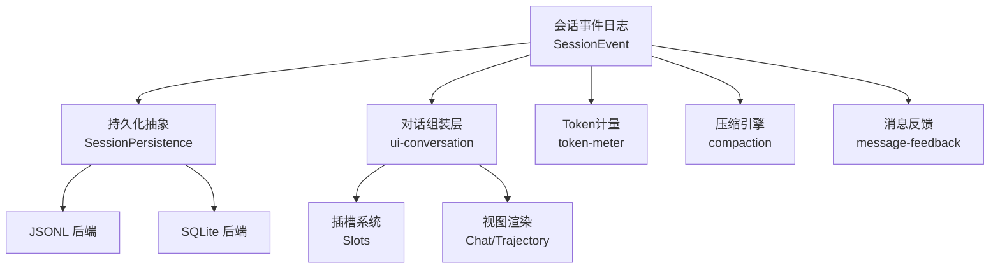
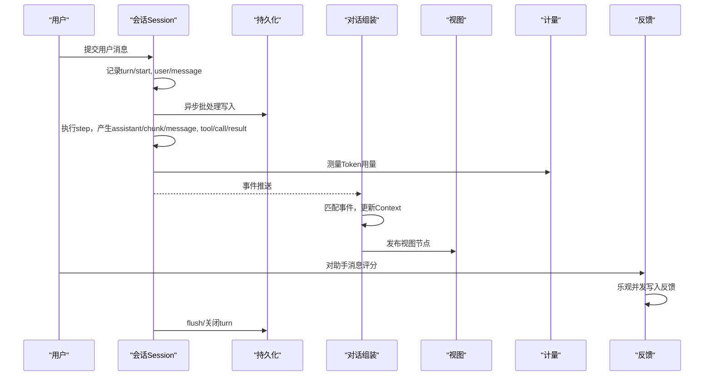
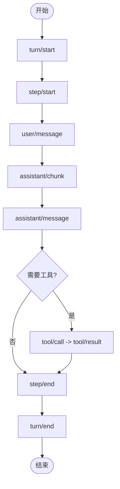
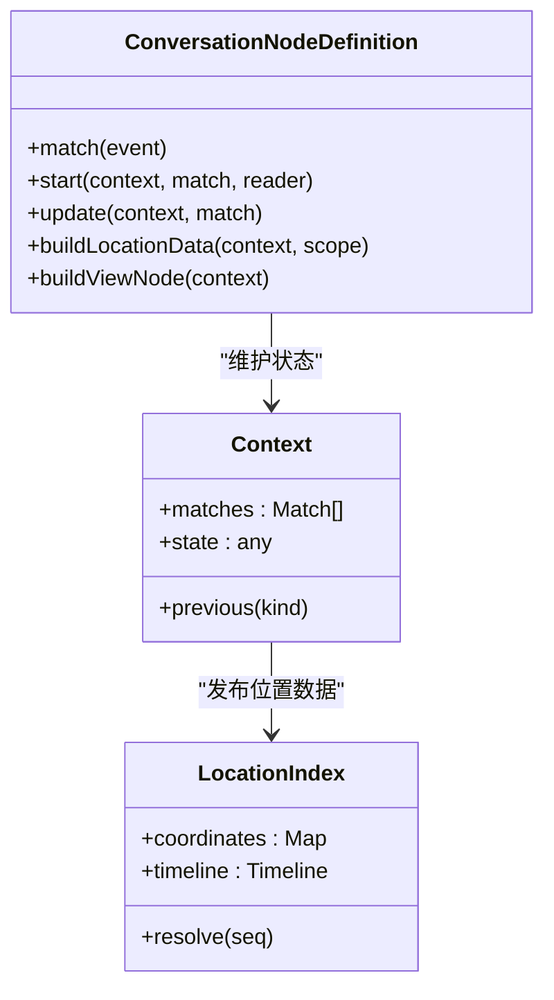
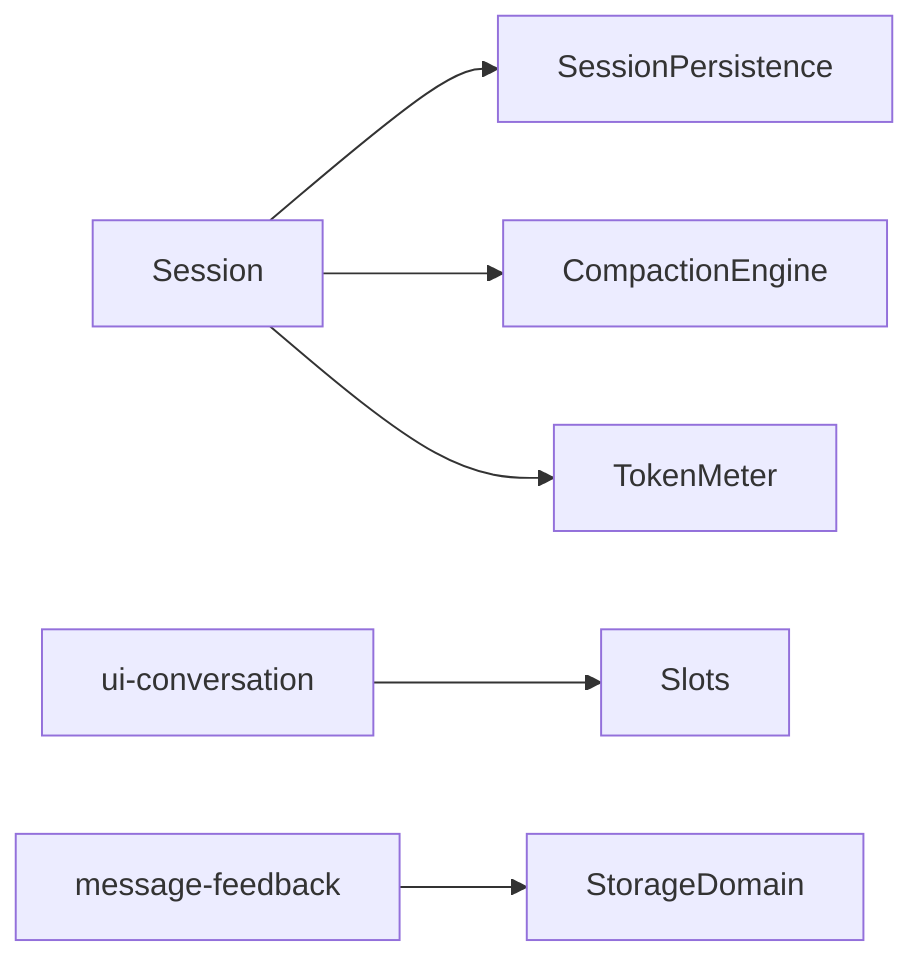

# 多轮对话处理

<cite>
**本文引用的文件**
- [会话子系统文档](file://docs/subsystems/session.md)
- [会话持久化子系统文档](file://docs/subsystems/persistence.md)
- [对话组装子系统文档](file://docs/subsystems/conversation.md)
- [Web客户端插槽系统文档](file://docs/subsystems/slots.md)
- [消息反馈子系统文档](file://docs/subsystems/feedback.md)
- [Token计量子系统文档](file://docs/subsystems/token-meter.md)
- [压缩子系统文档](file://docs/subsystems/compaction.md)
- [会话请求上下文测试](file://packages/core/session/tests/request-header.spec.ts)
- [对话位置索引实现](file://packages/client/ui-conversation/src/client/conversation/location-index.ts)
- [对话装配器与匹配合并](file://packages/client/ui-conversation/src/client/conversation/assembler.ts)
- [收件箱节点定义](file://packages/client/ui-chat/src/client/conversation-nodes/inbox.ts)
- [技能调用指令解析](file://packages/skill/tool-skill/src/index.ts)
</cite>

## 目录
1. [简介](#简介)
2. [项目结构](#项目结构)
3. [核心组件](#核心组件)
4. [架构总览](#架构总览)
5. [详细组件分析](#详细组件分析)
6. [依赖关系分析](#依赖关系分析)
7. [性能考量](#性能考量)
8. [故障排查指南](#故障排查指南)
9. [结论](#结论)
10. [附录](#附录)

## 简介
本实战案例文档围绕“多轮对话处理”展开，聚焦以下目标：
- 复杂多轮场景的上下文管理、状态跟踪与对话流控制
- 会话历史的持久化、上下文压缩与内存优化策略
- 不同类型对话模式的实现示例（问答、任务导向、角色扮演）
- 对话意图识别、实体提取与槽位填充的技术实现
- 对话中断、恢复与分支逻辑的处理
- 对话质量评估、用户反馈收集与模型调优方法
- 性能监控、错误处理与用户体验优化的最佳实践

该仓库提供了事件溯源的会话模型、可插拔的持久化后端、面向UI的对话组装层、以及反馈与计量等支撑能力，适合构建企业级多轮对话系统。

## 项目结构
从代码组织看，本项目采用“子系统+包”的分层设计：
- 核心会话与事件模型：以 SessionEvent 为不可变追加日志，作为唯一事实来源
- 持久化抽象与后端：JSONL 与 SQLite 两种实现，支持崩溃恢复与冷启动
- 对话组装与视图：将事件流转换为 UI 可见的 Conversation Node，支持增量更新
- 插槽系统：React 组合式扩展点，解耦业务与渲染
- 反馈与计量：逐消息评分与 Token 用量测量，用于质量评估与成本控制
- 压缩引擎：自动或手动压缩历史，降低上下文压力

图表来源
- [会话子系统文档:1-132](file://docs/subsystems/session.md#L1-L132)
- [会话持久化子系统文档:1-405](file://docs/subsystems/persistence.md#L1-L405)
- [对话组装子系统文档:1-252](file://docs/subsystems/conversation.md#L1-L252)
- [Web客户端插槽系统文档:1-175](file://docs/subsystems/slots.md#L1-L175)
- [消息反馈子系统文档:1-267](file://docs/subsystems/feedback.md#L1-L267)
- [Token计量子系统文档:1-106](file://docs/subsystems/token-meter.md#L1-L106)
- [压缩子系统文档:130-191](file://docs/subsystems/compaction.md#L130-L191)

章节来源
- [会话子系统文档:1-132](file://docs/subsystems/session.md#L1-L132)
- [会话持久化子系统文档:1-405](file://docs/subsystems/persistence.md#L1-L405)

## 核心组件
- 会话与事件模型：Session 是追加型日志，包含 turn/step 边界、用户消息、助手消息、工具调用/结果、请求头与上下文等事件；通过 deriveMessages() 派生模型可见的历史
- 持久化抽象：SessionPersistence 提供 locate/create/append/prepare/load/inspect/readFrom/list/listSnapshots 等能力，支持 JSONL 与 SQLite 后端
- 对话组装：ui-conversation 将事件窗口转换为 ConversationNode，按 (kind,id) 聚合上下文，支持增量更新与 Location 数据共享
- 插槽系统：Slots 提供声明式扩展点，支持单例、列表、键控、链式选择等模式，解耦业务与渲染
- 反馈系统：message-feedback 提供逐消息评分与备注，独立于会话日志，使用乐观并发保证一致性
- 计量系统：token-meter 提供会话表面 Token 用量与压力测量，支持路由定价与启发式估算
- 压缩引擎：compaction 提供自动/手动压缩，将历史片段替换为摘要节点，减少上下文压力

章节来源
- [会话子系统文档:178-584](file://docs/subsystems/session.md#L178-L584)
- [会话持久化子系统文档:231-405](file://docs/subsystems/persistence.md#L231-L405)
- [对话组装子系统文档:9-238](file://docs/subsystems/conversation.md#L9-L238)
- [Web客户端插槽系统文档:9-105](file://docs/subsystems/slots.md#L9-L105)
- [消息反馈子系统文档:186-223](file://docs/subsystems/feedback.md#L186-L223)
- [Token计量子系统文档:9-106](file://docs/subsystems/token-meter.md#L9-L106)
- [压缩子系统文档:130-191](file://docs/subsystems/compaction.md#L130-L191)

## 架构总览
多轮对话的核心流程如下：
- 用户输入进入 Session，记录 user/message 事件
- 循环执行 step，产生 assistant/chunk、assistant/message、tool/call、tool/result 等事件
- 请求头与上下文变化记录 request/header、request/context
- 持久化层异步批处理写入，崩溃时恢复 open turn
- 对话组装层消费事件，生成 ConversationNode 并渲染到 UI
- 反馈系统允许用户对助手消息评分，独立存储
- 计量系统测量 Token 用量，辅助成本与性能控制
- 压缩引擎在压力阈值下压缩历史，保持上下文可用

图表来源
- [会话子系统文档:28-132](file://docs/subsystems/session.md#L28-L132)
- [会话持久化子系统文档:9-20](file://docs/subsystems/persistence.md#L9-L20)
- [对话组装子系统文档:11-238](file://docs/subsystems/conversation.md#L11-L238)
- [Token计量子系统文档:64-106](file://docs/subsystems/token-meter.md#L64-L106)
- [消息反馈子系统文档:198-223](file://docs/subsystems/feedback.md#L198-L223)

## 详细组件分析

### 会话与事件模型
- 事件类型：turn/start、turn/end、step/start、step/end、user/message、assistant/chunk、assistant/message、tool/call、tool/result、request/header、request/context、session/end-seed
- 表面事件：user/message、assistant/message、tool/result 参与模型可见历史，其他为结构或日志事件
- 派生历史：deriveMessages() 基于 surfaceOp 维护有序表面，跳过 chunk，保留 assistant/message 与 tool-result
- 请求头与上下文：request/header 记录完整请求配置，request/context 记录路由容量信息
- 崩溃恢复：持久化加载时若发现未闭合 turn，合成 turn/end { reason: 'interrupted' }

图表来源
- [会话子系统文档:28-132](file://docs/subsystems/session.md#L28-L132)
- [会话子系统文档:494-504](file://docs/subsystems/session.md#L494-L504)

章节来源
- [会话子系统文档:28-132](file://docs/subsystems/session.md#L28-L132)
- [会话子系统文档:494-504](file://docs/subsystems/session.md#L494-L504)

### 持久化与崩溃恢复
- 抽象接口：SessionPersistence 提供 locate/create/append/prepare/load/inspect/readFrom/list/listSnapshots
- 后端实现：JSONL（每会话追加日志）与 SQLite（分块存储 delta runs）
- 崩溃恢复：冷启动时检测 open turn，合成 interrupted 结束事件，不截断已持久化内容
- 元数据：SessionHeader 携带版本、cwd、父会话、种子边界、代理预设等
- 原始工件：readRaw 返回后端特定编码的原始文本，保留序列化细节

章节来源
- [会话持久化子系统文档:9-20](file://docs/subsystems/persistence.md#L9-L20)
- [会话持久化子系统文档:39-126](file://docs/subsystems/persistence.md#L39-L126)
- [会话持久化子系统文档:231-405](file://docs/subsystems/persistence.md#L231-L405)

### 对话组装与上下文管理
- 事件定义：每个业务包注册 Definition，match 提取稳定 id，start/update 折叠状态
- 上下文：按 (kind,id) 维护 Matches 与 State，支持前驱读取 reader.previous()
- 位置数据：buildLocationData 发布 Turn/Step 级别数据，供其他节点消费
- 增量更新：append 路径仅匹配当前事件，O(1) 查找 Context，避免全量扫描
- 发布节奏：publication 控制 immediate、animation-frame、none

图表来源
- [对话组装子系统文档:9-238](file://docs/subsystems/conversation.md#L9-L238)
- [对话位置索引实现:364-519](file://packages/client/ui-conversation/src/client/conversation/location-index.ts#L364-L519)
- [对话装配器与匹配合并:87-122](file://packages/client/ui-conversation/src/client/conversation/assembler.ts#L87-L122)

章节来源
- [对话组装子系统文档:9-238](file://docs/subsystems/conversation.md#L9-L238)
- [对话位置索引实现:364-519](file://packages/client/ui-conversation/src/client/conversation/location-index.ts#L364-L519)
- [对话装配器与匹配合并:87-122](file://packages/client/ui-conversation/src/client/conversation/assembler.ts#L87-L122)

### 插槽系统与UI扩展
- 声明与生命周期：SlotMap 编译期注册，运行时通过 ctx.slots.register() 贡献组件
- 基数与范围：single、list、keyed、chain；root、session-maybe、session
- 标准钩子：useSessions、useSession、useConversation、useInput 等
- 注入机制：inject 工厂提供私有数据与回调，hooks 对象暴露可观察源
- 当前层次：conversation.* 系列插槽覆盖聊天、轨迹、头部动作等

章节来源
- [Web客户端插槽系统文档:9-105](file://docs/subsystems/slots.md#L9-L105)
- [Web客户端插槽系统文档:106-175](file://docs/subsystems/slots.md#L106-L175)

### 反馈系统与质量评估
- 数据结构：MessageFeedbackItem 包含 messageId、rating、note、version、时间戳
- 并发控制：put 使用乐观并发 ifVersion，冲突返回当前值以便重试
- 目标限制：仅针对 append-origin 的 assistant/message，排除中断冻结部分
- 持久性：侧车存储，独立于会话日志，重启后仍存在
- 界面集成：位于 conversation.chat.assistant-actions 插槽，延迟首次悬停加载

章节来源
- [消息反馈子系统文档:9-142](file://docs/subsystems/feedback.md#L9-L142)
- [消息反馈子系统文档:186-223](file://docs/subsystems/feedback.md#L186-L223)

### 令牌计量与成本控制
- 测量快照：TokenMeasurement 包含 logRevision、baseline、surfaceDeltaTokens、totalTokens、surfaceTokens、nodes
- 定价策略：路由特定的图像定价，无定价时使用启发式
- 节点价格：TokenSurfaceNode 提供 tokens 与 heuristicTokens，用于触发、保留与范围选择
- API：measure(session, requestHeader?) 获取当前压力与表面快照

章节来源
- [Token计量子系统文档:9-106](file://docs/subsystems/token-meter.md#L9-L106)

### 压缩引擎与上下文优化
- 抽象接口：compactIfNeeded、compactNow、compactRegion
- 触发策略：压力阈值或上下文溢出，选择有用范围进行压缩
- 事务标识：CompactionId 关联 start/summary/checkpoint/end
- 平衡检查：工具调用必须成对，边缘使用 toolPairingBalancedBefore/After 验证

章节来源
- [压缩子系统文档:130-191](file://docs/subsystems/compaction.md#L130-L191)
- [会话请求上下文测试:118-144](file://packages/core/session/tests/request-header.spec.ts#L118-L144)

### 对话模式实现示例
- 问答系统：基于 user/message 与 assistant/message 的简单问答，结合 request/header 控制模型参数
- 任务导向对话：通过 tool/call 与 tool/result 执化工具，如搜索、文件操作，逐步完成任务
- 角色扮演场景：利用 injected context 注入角色设定，结合 skill invocation 动态调整行为

章节来源
- [会话子系统文档:28-132](file://docs/subsystems/session.md#L28-L132)
- [技能调用指令解析:395-430](file://packages/skill/tool-skill/src/index.ts#L395-L430)

### 意图识别、实体提取与槽位填充
- 意图识别：通过 /skill 指令触发技能，解析用户输入中的关键词
- 实体提取：从 user/message 内容中提取结构化实体，如日期、地点、数量
- 槽位填充：在对话状态中维护槽位，逐步收集必要信息，完成任务

章节来源
- [技能调用指令解析:395-430](file://packages/skill/tool-skill/src/index.ts#L395-L430)
- [对话组装子系统文档:219-238](file://docs/subsystems/conversation.md#L219-L238)

### 对话中断、恢复与分支逻辑
- 中断：turn/end { reason: 'aborted' } 或 'max-tokens'，记录取消原因
- 恢复：持久化加载时合成 interrupted 结束事件，保持事件平衡
- 分支：fork(source, boundary) 从已完成 turn 前缀创建新会话，支持并行探索

章节来源
- [会话子系统文档:513-549](file://docs/subsystems/session.md#L513-L549)
- [会话持久化子系统文档:13-20](file://docs/subsystems/persistence.md#L13-L20)

## 依赖关系分析
- 松耦合：各子系统通过明确接口交互，如 SessionPersistence、ctx.compaction、ctx.tokenMeter
- 内聚性：每个包职责单一，如 feedback、slots、conversation 各自专注领域
- 外部依赖：LLM 适配器、存储后端、网络传输等通过抽象隔离
- 循环依赖：通过事件与插槽解耦，避免直接导入

图表来源
- [会话子系统文档:178-584](file://docs/subsystems/session.md#L178-L584)
- [会话持久化子系统文档:231-405](file://docs/subsystems/persistence.md#L231-L405)
- [对话组装子系统文档:9-238](file://docs/subsystems/conversation.md#L9-L238)
- [Web客户端插槽系统文档:9-105](file://docs/subsystems/slots.md#L9-L105)
- [消息反馈子系统文档:198-223](file://docs/subsystems/feedback.md#L198-L223)

章节来源
- [会话子系统文档:178-584](file://docs/subsystems/session.md#L178-L584)
- [会话持久化子系统文档:231-405](file://docs/subsystems/persistence.md#L231-L405)

## 性能考量
- 事件追加：Session.append 同步通知，持久化异步批处理，避免阻塞主循环
- 历史回放：deriveMessages() 缓存投影，replace 时重建，O(new nodes)
- 压缩策略：自动压力阈值触发，手动 compactNow 强制压缩，减少上下文大小
- 渲染优化：publication 控制 animation-frame 批量更新，避免频繁重绘
- 计量监控：token-meter 提供实时 Token 用量，辅助成本与性能调优

章节来源
- [会话子系统文档:410-484](file://docs/subsystems/session.md#L410-L484)
- [对话组装子系统文档:225-238](file://docs/subsystems/conversation.md#L225-L238)
- [压缩子系统文档:130-191](file://docs/subsystems/compaction.md#L130-L191)
- [Token计量子系统文档:64-106](file://docs/subsystems/token-meter.md#L64-L106)

## 故障排查指南
- 崩溃恢复：检查 session/end-seed 与 turn/end 是否平衡，确认 interrupted 事件
- 持久化失败：查看 append 错误日志，确认 JSON 可序列化，seq 连续
- 对话卡顿：检查 publication 是否设置为 animation-frame，避免高频更新
- 反馈冲突：ifVersion 不匹配时重试，确保乐观并发正确
- 计量异常：确认 requestHeader 最新，路由定价有效

章节来源
- [会话持久化子系统文档:13-20](file://docs/subsystems/persistence.md#L13-L20)
- [消息反馈子系统文档:186-223](file://docs/subsystems/feedback.md#L186-L223)
- [对话组装子系统文档:225-238](file://docs/subsystems/conversation.md#L225-L238)

## 结论
本仓库提供了完整的多轮对话处理基础设施，涵盖事件溯源、持久化、对话组装、反馈与计量等关键能力。通过模块化设计与明确接口，开发者可以快速构建复杂对话场景，实现上下文管理、状态跟踪、流控制与性能优化。建议在实际项目中结合业务需求选择合适的后端、压缩策略与反馈机制，持续监控 Token 用量与用户满意度，迭代优化对话体验。

## 附录
- 术语表：Session、Turn、Step、Surface、Compaction、Feedback、Token
- 参考链接：各子系统文档与源码路径
- 最佳实践：事件设计、状态折叠、位置数据共享、乐观并发、异步批处理