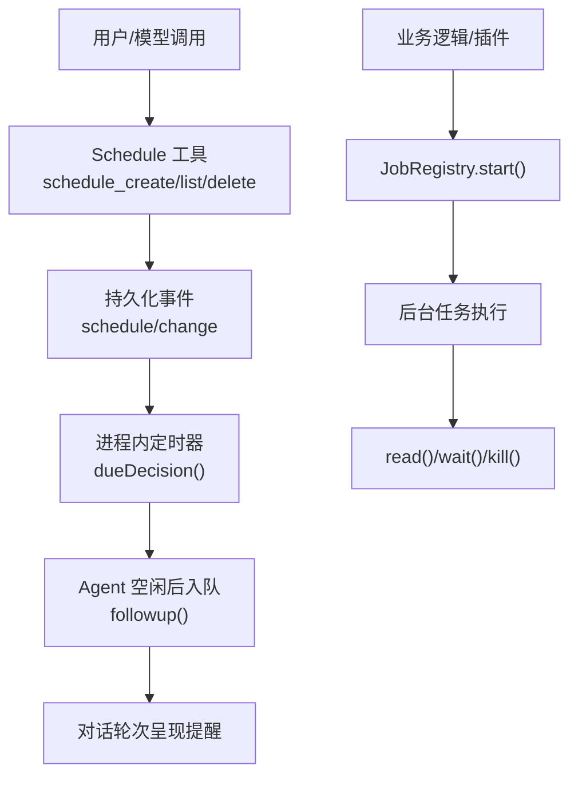
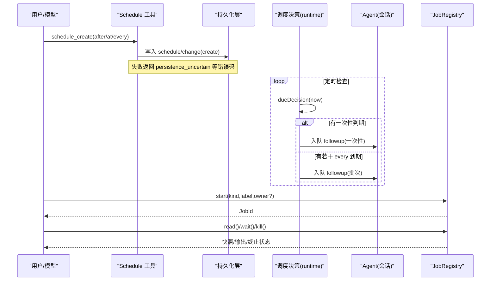
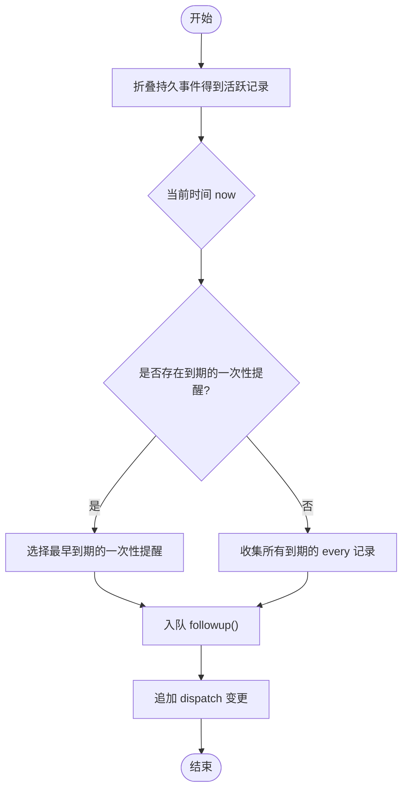
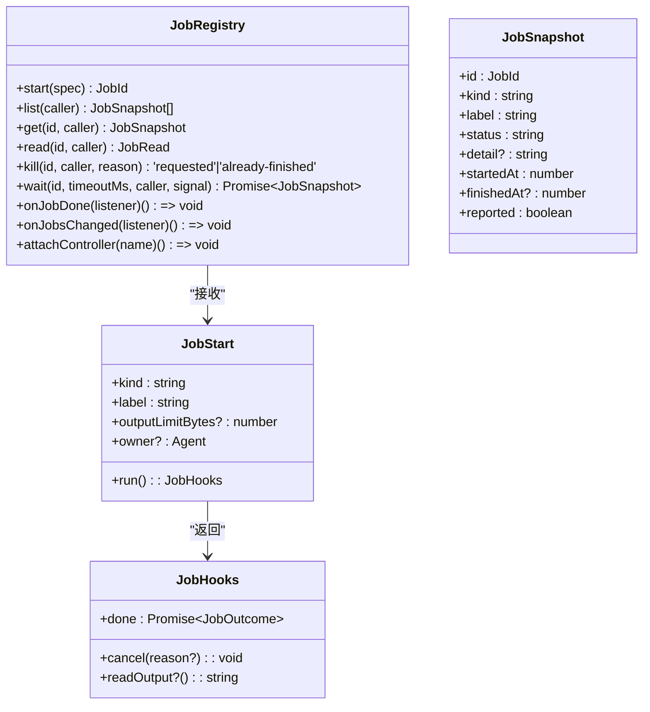
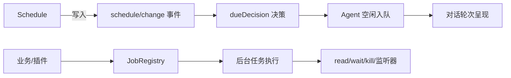

# 定时任务调度

<cite>
**本文引用的文件**
- [apps/cli/config/examples/schedule/cordis.yml](file://apps/cli/config/examples/schedule/cordis.yml)
- [docs/subsystems/schedule.md](file://docs/subsystems/schedule.md)
- [docs/subsystems/schedule.zh.md](file://docs/subsystems/schedule.zh.md)
- [docs/user/guide/schedule.md](file://docs/user/guide/schedule.md)
- [packages/schedule/schedule/src/runtime.ts](file://packages/schedule/schedule/src/runtime.ts)
- [packages/schedule/schedule/src/domain.ts](file://packages/schedule/schedule/src/domain.ts)
- [packages/schedule/schedule/tests/domain.spec.ts](file://packages/schedule/schedule/tests/domain.spec.ts)
- [docs/subsystems/jobs.md](file://docs/subsystems/jobs.md)
- [docs/subsystems/jobs.zh.md](file://docs/subsystems/jobs.zh.md)
- [.agents/notes/implemented/simplification/2026-08-09-bounded-fixed-rate-schedule.md](file://.agents/notes/implemented/simplification/2026-08-09-bounded-fixed-rate-schedule.md)
- [.agents/notes/implemented/bug-fix/2026-08-11-bounded-background-job-admission.md](file://.agents/notes/implemented/bug-fix/2026-08-11-bounded-background-job-admission.md)
</cite>

## 目录
1. [简介](#简介)
2. [项目结构](#项目结构)
3. [核心组件](#核心组件)
4. [架构总览](#架构总览)
5. [详细组件分析](#详细组件分析)
6. [依赖关系分析](#依赖关系分析)
7. [性能与并发控制](#性能与并发控制)
8. [故障排查指南](#故障排查指南)
9. [结论](#结论)
10. [附录：调度场景实践](#附录：调度场景实践)

## 简介
本文件面向使用 DeepSeek Harness 的开发者，提供“定时任务调度”的实用案例文档。内容涵盖：
- 基于 Session 内 Schedule 的周期性提醒（延时、绝对时间、固定间隔）
- Cron 表达式现状与替代方案
- 任务队列管理与并发控制（后台任务运行时）
- 任务生命周期、错误处理与重试策略
- 多场景实现示例（数据同步、监控告警、报告生成、系统维护）
- 优先级管理、资源限制与监控指标收集
- 外部系统集成（邮件、API、数据库）
- 调试、日志分析与性能优化最佳实践

## 项目结构
DeepSeek Harness 将“定时提醒”和“后台任务”拆分为两个子系统：
- Schedule：负责在 Session 内创建和管理持久化的提醒记录，并在 Agent 空闲时以对话轮次形式投递后续消息。
- Jobs：提供后台任务的注册、运行、观察与控制能力，支持按拥有者限流与并发控制。

图示来源
- [docs/subsystems/schedule.zh.md:154-186](file://docs/subsystems/schedule.zh.md#L154-L186)
- [packages/schedule/schedule/src/runtime.ts:34-62](file://packages/schedule/schedule/src/runtime.ts#L34-L62)
- [docs/subsystems/jobs.zh.md:155-157](file://docs/subsystems/jobs.zh.md#L155-L157)

章节来源
- [docs/subsystems/schedule.zh.md:1-186](file://docs/subsystems/schedule.zh.md#L1-L186)
- [docs/subsystems/jobs.zh.md:1-291](file://docs/subsystems/jobs.zh.md#L1-L291)
- [apps/cli/config/examples/schedule/cordis.yml:1-10](file://apps/cli/config/examples/schedule/cordis.yml#L1-L10)

## 核心组件
- Schedule 持久记录
  - 一次性提醒：after（延时）、at（绝对时间）
  - 固定间隔提醒：every（最小间隔 300 秒，按创建时间锚定）
  - 所有目标统一为四位年份的 RFC 3339 UTC 时间
- Schedule 决策与投递
  - dueDecision 优先选择到期的一次性提醒；若无则批量收集到期的 every 记录
  - 仅在 Agent 完全空闲时入队 followup，不中断当前轮次
- 后台任务运行时 JobRegistry
  - start/get/list/read/wait/kill/onJobDone/onJobsChanged/attachController
  - 默认每拥有者最大并发数 10，无拥有者任务共享服务级桶
  - 终止状态 first-wins，避免重复通知

章节来源
- [docs/subsystems/schedule.zh.md:7-152](file://docs/subsystems/schedule.zh.md#L7-L152)
- [docs/subsystems/schedule.zh.md:154-186](file://docs/subsystems/schedule.zh.md#L154-L186)
- [docs/subsystems/jobs.zh.md:7-157](file://docs/subsystems/jobs.zh.md#L7-L157)

## 架构总览
下图展示从配置启用到提醒投递、再到后台任务执行的端到端流程。

图示来源
- [docs/subsystems/schedule.zh.md:100-186](file://docs/subsystems/schedule.zh.md#L100-L186)
- [packages/schedule/schedule/src/runtime.ts:34-62](file://packages/schedule/schedule/src/runtime.ts#L34-L62)
- [docs/subsystems/jobs.zh.md:155-285](file://docs/subsystems/jobs.zh.md#L155-L285)

## 详细组件分析

### Schedule：类型、输入与校验
- 记录类型
  - after：延时一次性提醒
  - at：绝对时间一次性提醒
  - every：固定间隔提醒（≥300 秒），按创建时间对齐下一个目标
- 绝对时间输入
  - 支持带偏移的 RFC 3339 字符串或本地日历对象（date/time/time_zone）
  - 拒绝无效偏移与时区、非未来目标、夏令时缺口；重叠取较早时点
- 固定间隔输入与补偿
  - 每条记录独立间隔，无全局冷却或跨记录门禁
  - 错过多个周期仅投递最新一次，并直接推进到下一个对齐目标
- 校验与错误
  - 空提示词、非法规则、频率过高、时间越界等会抛出稳定错误码
  - 持久化屏障失败返回 persistence_uncertain

章节来源
- [docs/subsystems/schedule.zh.md:7-152](file://docs/subsystems/schedule.zh.md#L7-L152)
- [packages/schedule/schedule/src/domain.ts:714-758](file://packages/schedule/schedule/src/domain.ts#L714-L758)
- [packages/schedule/schedule/tests/domain.spec.ts:85-103](file://packages/schedule/schedule/tests/domain.spec.ts#L85-L103)

### Schedule：决策与投递时序
- 决策顺序
  - 先筛选到期的一次性提醒，按目标时间与创建顺序取最早一个
  - 若没有一次性到期，则收集所有到期的 every 记录组成批次
- 投递时机
  - 等待 Agent 完全空闲，进入维护阶段，再追加 followup
  - 不会调用 steer()，不中断当前轮次
- 持久化边界
  - dispatch 表示已入队，不代表模型成功或用户已读
  - 崩溃窗口可能重复提醒，属于尽力而为的至少一次交付

图示来源
- [packages/schedule/schedule/src/runtime.ts:34-62](file://packages/schedule/schedule/src/runtime.ts#L34-L62)
- [docs/subsystems/schedule.zh.md:180-186](file://docs/subsystems/schedule.zh.md#L180-L186)

章节来源
- [packages/schedule/schedule/src/runtime.ts:34-62](file://packages/schedule/schedule/src/runtime.ts#L34-L62)
- [docs/subsystems/schedule.zh.md:180-186](file://docs/subsystems/schedule.zh.md#L180-L186)

### 后台任务运行时：并发控制与生命周期
- 生命周期
  - start 预检通过后启动 run()，返回 JobHooks
  - done 在资源释放后 resolve；readOutput 用于流式消费
  - kill 请求取消，标记 stopping 并 reported
- 并发与准入
  - 默认每拥有者最大并发 10（running + stopping）
  - 无拥有者任务共享服务级桶，终端结算后释放容量
- 观测与控制
  - list/get/read/wait/kill/onJobDone/onJobsChanged/attachController
  - 完成通知 first-wins，避免重复

图示来源
- [docs/subsystems/jobs.zh.md:24-96](file://docs/subsystems/jobs.zh.md#L24-L96)
- [docs/subsystems/jobs.zh.md:155-285](file://docs/subsystems/jobs.zh.md#L155-L285)

章节来源
- [docs/subsystems/jobs.zh.md:7-157](file://docs/subsystems/jobs.zh.md#L7-L157)
- [docs/subsystems/jobs.zh.md:155-285](file://docs/subsystems/jobs.zh.md#L155-L285)

### 配置与启用
- 通过 Cordis overlay 启用 time-context 与 schedule 模块
- Web 模式可通过 patch 快速启用 Schedule 提醒

章节来源
- [apps/cli/config/examples/schedule/cordis.yml:1-10](file://apps/cli/config/examples/schedule/cordis.yml#L1-L10)
- [docs/user/guide/schedule.md:1-20](file://docs/user/guide/schedule.md#L1-L20)

## 依赖关系分析
- Schedule 依赖持久化事件与 Agent 空闲期机制进行投递
- Schedule 与 Jobs 解耦：提醒通过对话轮次呈现，复杂耗时工作可交由后台任务执行
- 并发控制由 JobRegistry 提供，按拥有者隔离，避免相互影响

图示来源
- [docs/subsystems/schedule.zh.md:100-186](file://docs/subsystems/schedule.zh.md#L100-L186)
- [docs/subsystems/jobs.zh.md:155-285](file://docs/subsystems/jobs.zh.md#L155-L285)

章节来源
- [docs/subsystems/schedule.zh.md:100-186](file://docs/subsystems/schedule.zh.md#L100-L186)
- [docs/subsystems/jobs.zh.md:155-285](file://docs/subsystems/jobs.zh.md#L155-L285)

## 性能与并发控制
- 固定间隔最小值
  - every_seconds 至少 300 秒，限制唤醒频率，避免频繁模型请求
- 批处理
  - 多条 every 同时到期合并为一个 follow-up，减少模型轮次
- 并发上限
  - 默认每拥有者最多 10 个并发任务（running + stopping）
  - 无拥有者任务共享服务级桶，防止宿主侧资源耗尽
- 资源释放
  - 任务终止后释放容量；慢停止期间仍占用槽位直至 done 结算

章节来源
- [docs/subsystems/schedule.zh.md:92-99](file://docs/subsystems/schedule.zh.md#L92-L99)
- [docs/subsystems/jobs.zh.md:155-157](file://docs/subsystems/jobs.zh.md#L155-L157)
- [.agents/notes/implemented/bug-fix/2026-08-11-bounded-background-job-admission.md:45-56](file://.agents/notes/implemented/bug-fix/2026-08-11-bounded-background-job-admission.md#L45-L56)

## 故障排查指南
- 常见错误码
  - invalid_prompt、invalid_selector、invalid_rule、invalid_time_zone、not_future、time_out_of_range、frequency_too_high、corrupt_schedule_log、internal_error
  - 持久化屏障失败：persistence_uncertain
- 诊断建议
  - 检查 scheduledAt 是否在未来且符合格式
  - 确认 every_seconds ≥ 300
  - 查看 JobRegistry 列表与快照，确认任务状态与 reported
  - 对长时间运行的任务使用 wait/kill 控制
  - 关注 dueDecision 决策结果与 followup 入队情况

章节来源
- [docs/subsystems/schedule.zh.md:154-186](file://docs/subsystems/schedule.zh.md#L154-L186)
- [docs/subsystems/jobs.zh.md:155-285](file://docs/subsystems/jobs.zh.md#L155-L285)

## 结论
- Schedule 提供轻量、可靠的 Session 内定时提醒，适合“延迟触发”“绝对时间触发”“固定间隔提醒”三类场景
- Cron 表达式在当前版本未内置；如需更复杂的日历规则，应通过后台任务（Jobs）结合外部调度器实现
- Jobs 提供强一致的并发控制、生命周期管理与观测能力，适合承载耗时、需限流的后台工作
- 两者配合可实现“提醒驱动 + 后台执行”的组合模式，兼顾易用性与可扩展性

## 附录：调度场景实践

### 定期数据同步
- 使用 Schedule.every 设置最小 300 秒间隔，触发数据拉取
- 实际同步逻辑放入后台任务，通过 JobRegistry.start 启动，read 获取增量输出，wait 等待完成
- 若网络抖动导致失败，可在任务内部实现幂等重试与退避

章节来源
- [docs/subsystems/schedule.zh.md:92-99](file://docs/subsystems/schedule.zh.md#L92-L99)
- [docs/subsystems/jobs.zh.md:155-285](file://docs/subsystems/jobs.zh.md#L155-L285)

### 监控告警
- 使用 Schedule.at 精确时间点触发告警检查
- 告警聚合与发送放在后台任务中，利用 outputLimitBytes 控制输出大小
- 通过 onJobDone 监听告警任务完成，必要时二次告警

章节来源
- [docs/subsystems/schedule.zh.md:100-152](file://docs/subsystems/schedule.zh.md#L100-L152)
- [docs/subsystems/jobs.zh.md:24-96](file://docs/subsystems/jobs.zh.md#L24-L96)

### 报告生成
- 使用 Schedule.after 在对话结束后延时生成报告
- 报告生成为后台任务，read 逐步消费生成进度，wait 等待最终结果
- 完成后通过对话轮次呈现摘要或附件链接

章节来源
- [docs/subsystems/schedule.zh.md:180-186](file://docs/subsystems/schedule.zh.md#L180-L186)
- [docs/subsystems/jobs.zh.md:141-153](file://docs/subsystems/jobs.zh.md#L141-L153)

### 系统维护任务
- 使用 Schedule.every 定期清理临时文件或压缩历史
- 维护任务受并发上限保护，避免与业务任务争抢资源
- 通过 kill 主动中止异常维护任务，确保系统健康

章节来源
- [docs/subsystems/jobs.zh.md:155-157](file://docs/subsystems/jobs.zh.md#L155-L157)
- [docs/subsystems/jobs.zh.md:219-228](file://docs/subsystems/jobs.zh.md#L219-L228)

### Cron 表达式的替代方案
- 当前版本不支持 Cron 表达式；如需复杂日历规则，建议使用外部调度器（如系统 crontab、云调度服务）触发 API 或消息，再由后台任务处理
- 对于简单周期任务，优先使用 Schedule.every 的最小间隔与批处理特性

章节来源
- [.agents/notes/implemented/simplification/2026-08-09-bounded-fixed-rate-schedule.md:19-31](file://.agents/notes/implemented/simplification/2026-08-09-bounded-fixed-rate-schedule.md#L19-L31)

### 与外部系统集成
- 邮件发送：在后台任务中调用邮件服务 API，捕获异常并重试
- API 调用：使用 read 流式读取响应片段，避免大响应阻塞
- 数据库操作：在任务中执行事务，失败回滚并通过 detail 记录原因

章节来源
- [docs/subsystems/jobs.zh.md:24-96](file://docs/subsystems/jobs.zh.md#L24-L96)
- [docs/subsystems/jobs.zh.md:141-153](file://docs/subsystems/jobs.zh.md#L141-L153)

### 调试、日志与性能优化
- 调试
  - 使用 list/get/read/wait 观察任务状态与输出
  - 对 Schedule，检查 persisted events 与 dueDecision 决策
- 日志
  - 在任务中记录关键步骤与异常，便于定位问题
- 性能
  - 合理设置 every_seconds，避免过短间隔
  - 利用批处理减少模型轮次
  - 控制 outputLimitBytes，避免过大输出

章节来源
- [docs/subsystems/jobs.zh.md:155-285](file://docs/subsystems/jobs.zh.md#L155-L285)
- [docs/subsystems/schedule.zh.md:92-99](file://docs/subsystems/schedule.zh.md#L92-L99)