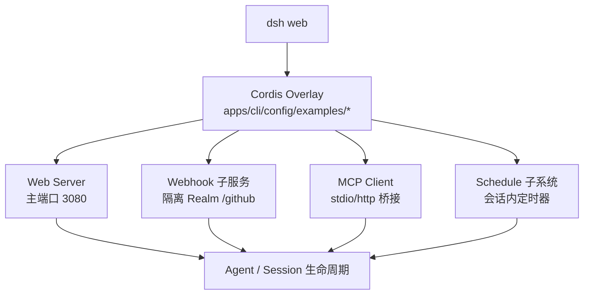
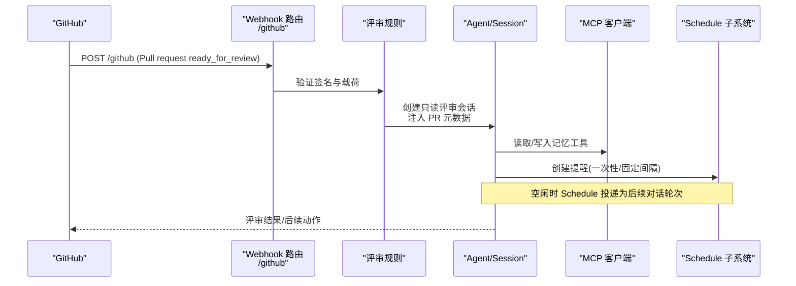
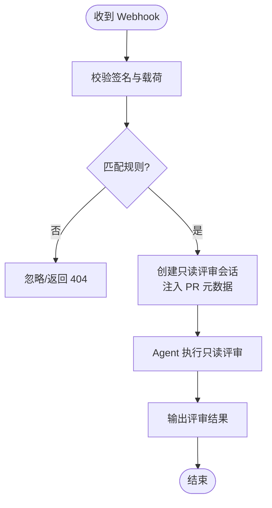
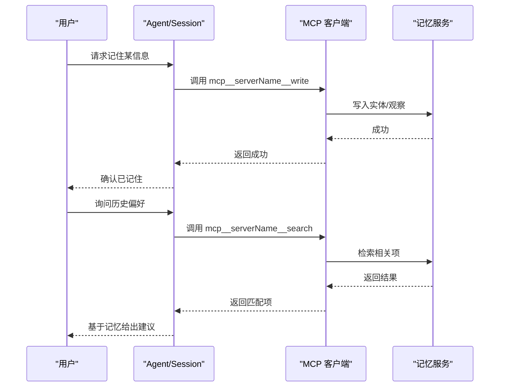
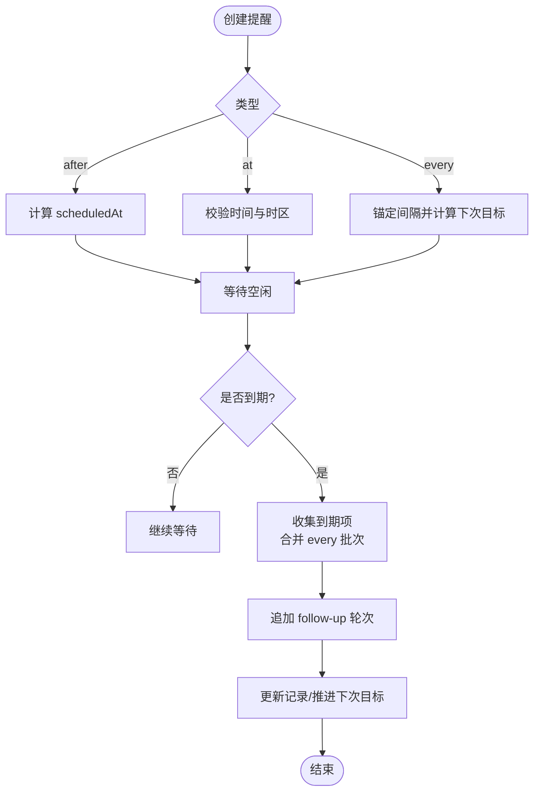
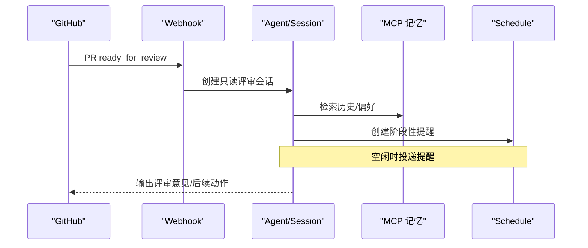
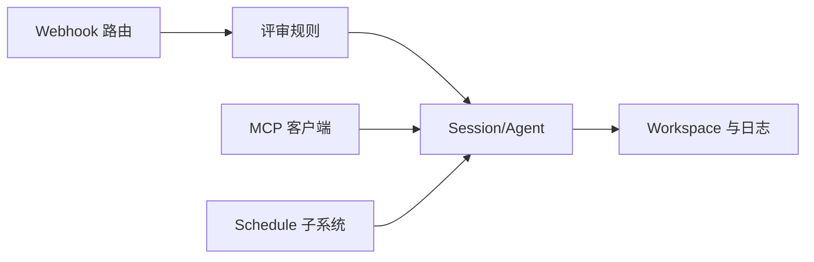

# 实战案例

<cite>
**本文引用的文件**
- [GitHub 评审指南](file://docs/user/guide/github-review.md)
- [GitHub 评审指南（中文）](file://docs/user/guide/github-review.zh.md)
- [MCP 记忆集成指南](file://docs/user/guide/mcp-memory.md)
- [MCP 记忆集成指南（中文）](file://docs/user/guide/mcp-memory.zh.md)
- [定时任务调度指南](file://docs/user/guide/schedule.md)
- [会话级定时子系统说明](file://docs/subsystems/schedule.md)
</cite>

## 目录
1. [简介](#简介)
2. [项目结构](#项目结构)
3. [核心组件](#核心组件)
4. [架构总览](#架构总览)
5. [详细组件分析](#详细组件分析)
6. [依赖关系分析](#依赖关系分析)
7. [性能考量](#性能考量)
8. [故障排查指南](#故障排查指南)
9. [结论](#结论)
10. [附录](#附录)

## 简介
本章节面向希望将 DeepSeek Harness（DSH）落地到真实业务场景的工程师与产品团队，聚焦以下四个典型用例：
- GitHub 代码审查自动化：通过 Webhook 触发只读评审会话，自动拉取 PR 上下文并生成可审计的评审记录。
- MCP 记忆集成：接入第三方记忆系统（如 Memorix、Reference Memory、Engram），实现跨会话的知识沉淀与检索。
- 定时任务调度：在会话内创建一次性或固定间隔提醒，空闲时自动追加后续对话轮次。
- 多轮对话处理：结合上述能力，构建“提示—工具调用—记忆/调度—结果反馈”的闭环工作流。

每个案例均包含：业务背景、配置要点、实现思路、使用方法、效果展示与扩展建议，并提供可复用的模板与最佳实践。

## 项目结构
DSH 以插件化与 overlay（覆盖层）为核心组织方式，用户通过 Cordis overlay 按需启用功能模块。本次实战涉及的三个 overlay 示例位于 CLI 应用配置目录中，分别对应 GitHub 评审、MCP 记忆与定时任务；配套的用户指南位于 docs/user/guide，子系统技术细节位于 docs/subsystems。

图示来源
- [GitHub 评审指南:40-72](file://docs/user/guide/github-review.md#L40-L72)
- [MCP 记忆集成指南:9-13](file://docs/user/guide/mcp-memory.md#L9-L13)
- [定时任务调度指南:5-19](file://docs/user/guide/schedule.md#L5-L19)
- [会话级定时子系统说明:1-12](file://docs/subsystems/schedule.md#L1-L12)

章节来源
- [GitHub 评审指南:1-103](file://docs/user/guide/github-review.md#L1-L103)
- [MCP 记忆集成指南:1-102](file://docs/user/guide/mcp-memory.md#L1-L102)
- [定时任务调度指南:1-20](file://docs/user/guide/schedule.md#L1-L20)
- [会话级定时子系统说明:1-187](file://docs/subsystems/schedule.md#L1-L187)

## 核心组件
- Webhook 评审规则：监听 GitHub Pull Request 事件，校验签名后创建只读评审会话，注入 PR 元数据并限制危险操作。
- MCP 记忆客户端：启动或连接外部记忆服务，发现并暴露 mcp__serverName__tool 工具，支持 stdio 与 Streamable HTTP 两种传输。
- Schedule 子系统：提供会话内持久化的提醒能力，支持 after/at/every 三种模式，空闲时投递为普通对话轮次。
- Agent/Session：承载提示词、工具调用、记忆读写与提醒投递，维护会话日志与 Workspace 上下文。

章节来源
- [GitHub 评审指南:66-72](file://docs/user/guide/github-review.md#L66-L72)
- [MCP 记忆集成指南:9-13](file://docs/user/guide/mcp-memory.md#L9-L13)
- [会话级定时子系统说明:7-12](file://docs/subsystems/schedule.md#L7-L12)

## 架构总览
下图展示了从外部事件到会话产物的端到端流程，涵盖 Webhook 评审、MCP 记忆与 Schedule 调度的交互边界。

图示来源
- [GitHub 评审指南:40-72](file://docs/user/guide/github-review.md#L40-L72)
- [MCP 记忆集成指南:9-13](file://docs/user/guide/mcp-memory.md#L9-L13)
- [会话级定时子系统说明:154-186](file://docs/subsystems/schedule.md#L154-L186)

## 详细组件分析

### 案例一：GitHub 代码审查自动化
- 业务场景
  - 当仓库中的 PR 从 draft 变为 ready for review 时，自动创建只读评审会话，减少人工重复劳动，提升评审一致性与可追溯性。
- 配置要点
  - 使用 overlay 启用 Webhook 路由与规则，默认监听独立端口并在隔离 realm 中仅注册 /github。
  - 通过环境变量注入 webhook 密钥，配合反向代理暴露公网 URL。
- 实现细节
  - 规则仅接受特定来源、仓库、事件与动作；将 PR 头 SHA 与字段注入提示词，标记为不受信任元数据，禁止文件/分支/PR/GitHub 写操作。
  - 会话选择标准 Agent preset 与只读权限 preset；Workspace 首次命中时创建，后续复用。
  - HTTP 响应为弱语义确认（202），实际结果由 Agent 生命周期与持久化保证。
- 使用方法
  - 开发环境：设置工作区与环境变量，通过 --patch 加载示例 overlay 启动。
  - 生产环境：将 overlay 合并至 profile patch，长期生效；通过反向代理暴露 /github。
- 效果展示
  - 收到 ready_for_review 事件后，自动创建带标题的根会话，模型基于 PR 上下文进行只读评审，输出结构化评审意见。
- 扩展点
  - 在 run() 中接入内部策略服务决定是否自动评审。
  - 按仓库名映射不同本地路径，实现多仓库统一入口。
  - 为 Agent 单独配置出站访问权限（如需）。

图示来源
- [GitHub 评审指南:66-72](file://docs/user/guide/github-review.md#L66-L72)

章节来源
- [GitHub 评审指南:1-103](file://docs/user/guide/github-review.md#L1-L103)
- [GitHub 评审指南（中文）:1-103](file://docs/user/guide/github-review.zh.md#L1-L103)

### 案例二：MCP 记忆集成
- 业务场景
  - 在多轮对话中沉淀用户偏好、项目知识与历史决策，使新会话能“记住”关键信息，提升连续性与个性化体验。
- 配置要点
  - 通过 overlay 启用 dsh-mcp-client，选择 stdio 或 Streamable HTTP 传输，指定 serverName、command/url、env 等。
  - 示例默认关闭，需显式 --patch 启用；跨次运行可将 insert 合并到用户 patch 层。
- 实现细节
  - DSH 负责启动/停止子进程或连接上游服务，发现 MCP 工具并以 mcp__serverName__tool 形式暴露。
  - stdio 启动前会移除敏感环境变量与 DSH_* 变量，避免凭据泄露。
  - 子进程崩溃支持带退避的重连与工具重同步；初始发现异步，首次调用前需等待工具就绪。
- 使用方法
  - 安装第三方记忆服务（如 Memorix、Reference Memory、Engram），通过 overlay 启用并验证写入/召回/使用三步骤。
- 效果展示
  - 会话 A 写入偏好，会话 B 在新会话中检索并使用该偏好，形成跨会话知识流转。
- 扩展点
  - 复制通用条目接入任意 MCP 服务器；远程服务使用 streamable-http。
  - 在模型指令中添加中性提示，引导模型在需要时调用记忆工具。

图示来源
- [MCP 记忆集成指南:9-13](file://docs/user/guide/mcp-memory.md#L9-L13)
- [MCP 记忆集成指南（中文）:9-13](file://docs/user/guide/mcp-memory.zh.md#L9-L13)

章节来源
- [MCP 记忆集成指南:1-102](file://docs/user/guide/mcp-memory.md#L1-L102)
- [MCP 记忆集成指南（中文）:1-102](file://docs/user/guide/mcp-memory.zh.md#L1-L102)

### 案例三：定时任务调度（会话内提醒）
- 业务场景
  - 在长对话中设置一次性或周期性提醒，空闲时自动追加后续对话轮次，无需外部通知渠道。
- 配置要点
  - 通过 overlay 启用 Schedule，支持 after_seconds、at、every_seconds（≥300s）三种模式。
  - 浏览器 IANA 时区随提示传入，模型据此解释自然语言时间；Schedule 不保存默认时区。
- 实现细节
  - 提醒为会话内持久化记录，存活于原始会话；冷重启恢复计时器，过期提醒优先投递。
  - 多个 overdue 的 every 记录合并为一次 follow-up，避免堆积；one-shot 先于批次投递。
  - 投递发生在 Agent 完全空闲阶段，不会打断当前轮次；失败则保持活跃状态。
- 使用方法
  - 通过模型工具 schedule_create/schedule_list/schedule_delete 管理提醒；交付标识为 session-local。
- 效果展示
  - 设置提醒后，模型在空闲时自动追加提醒内容到同一会话，用户可在对话中查看与删除。
- 扩展点
  - 结合记忆系统，让提醒携带上下文（如项目、责任人、截止时间）。
  - 在策略层过滤或合并提醒，避免噪声。

图示来源
- [定时任务调度指南:5-19](file://docs/user/guide/schedule.md#L5-L19)
- [会话级定时子系统说明:92-103](file://docs/subsystems/schedule.md#L92-L103)
- [会话级定时子系统说明:180-186](file://docs/subsystems/schedule.md#L180-L186)

章节来源
- [定时任务调度指南:1-20](file://docs/user/guide/schedule.md#L1-L20)
- [会话级定时子系统说明:1-187](file://docs/subsystems/schedule.md#L1-L187)

### 案例四：多轮对话处理（组合用例）
- 业务场景
  - 在一次评审任务中，结合 Webhook 触发、记忆检索与定时提醒，完成“拉取上下文—检索历史—制定计划—定时跟进”的完整闭环。
- 实现思路
  - Webhook 创建只读评审会话，注入 PR 元数据。
  - 模型调用 MCP 记忆工具检索相关历史与偏好。
  - 通过 Schedule 创建阶段性提醒（如“两小时后复核变更”）。
  - 空闲时 Schedule 投递提醒，模型继续推进评审与反馈。
- 效果展示
  - 评审过程具备上下文连贯性、可追踪性与节奏感，减少遗漏与遗忘。

图示来源
- [GitHub 评审指南:66-72](file://docs/user/guide/github-review.md#L66-L72)
- [MCP 记忆集成指南:9-13](file://docs/user/guide/mcp-memory.md#L9-L13)
- [会话级定时子系统说明:180-186](file://docs/subsystems/schedule.md#L180-L186)

## 依赖关系分析
- Webhook 评审
  - 依赖：WebServer（隔离 realm）、规则引擎、WorkspaceRegistry、Agent/Session。
  - 耦合：对 GitHub 事件结构与签名校验强依赖；对权限预设（只读）有明确约束。
- MCP 记忆
  - 依赖：dsh-mcp-client、上游记忆服务（stdio 或 HTTP）。
  - 耦合：工具命名约定 mcp__serverName__tool；子进程生命周期与重连策略由客户端管理。
- Schedule
  - 依赖：Session 持久化、Agent 空闲检测、队列与批处理逻辑。
  - 耦合：严格的时间解析与时区边界；overdue 合并与 one-shot 优先级。

图示来源
- [GitHub 评审指南:40-72](file://docs/user/guide/github-review.md#L40-L72)
- [MCP 记忆集成指南:9-13](file://docs/user/guide/mcp-memory.md#L9-L13)
- [会话级定时子系统说明:154-186](file://docs/subsystems/schedule.md#L154-L186)

章节来源
- [GitHub 评审指南:40-72](file://docs/user/guide/github-review.md#L40-L72)
- [MCP 记忆集成指南:9-13](file://docs/user/guide/mcp-memory.md#L9-L13)
- [会话级定时子系统说明:154-186](file://docs/subsystems/schedule.md#L154-L186)

## 性能考量
- Webhook 评审
  - 轻量规则与弱语义响应降低首包延迟；实际负载由 Agent 生命周期承担。
  - 建议通过反向代理限流与签名校验前置，减轻后端压力。
- MCP 记忆
  - 工具发现异步，首次调用前应等待工具就绪；子进程崩溃自动重连，注意退避预算。
  - 搜索为字符串匹配时复杂度较低；若引入 embedding 或图检索，需评估查询成本。
- Schedule
  - 每记录最小间隔 ≥300 秒，避免频繁定时器；overdue 合并减少模型轮次。
  - 持久化屏障确保一致性，极端情况下可能影响投递时延。

[本节为通用指导，不直接分析具体文件]

## 故障排查指南
- Webhook 评审
  - 现象：收到事件但未创建会话。
  - 排查：检查签名与载荷、规则匹配条件、Workspace 是否存在、权限预设是否为只读。
  - 参考：规则行为与交付语义。
- MCP 记忆
  - 现象：工具未出现或调用失败。
  - 排查：确认 overlay 已启用、上游服务已运行、环境变量正确、工具发现已完成；子进程崩溃后等待重连。
  - 参考：DSH 职责与传输方式。
- Schedule
  - 现象：提醒未按时投递或重复投递。
  - 排查：确认时间格式与时区、是否处于空闲阶段、是否被合并；检查持久化屏障与错误码。
  - 参考：活动视图与管理、投递边界。

章节来源
- [GitHub 评审指南:66-103](file://docs/user/guide/github-review.md#L66-L103)
- [MCP 记忆集成指南:74-102](file://docs/user/guide/mcp-memory.md#L74-L102)
- [会话级定时子系统说明:154-186](file://docs/subsystems/schedule.md#L154-L186)

## 结论
通过 Webhook 评审、MCP 记忆与 Schedule 的组合，DSH 能够支撑从事件驱动到持续对话的多种企业级场景。overlay 机制使得能力可按需启用与组合，Agent/Session 作为统一执行面，保证了可观测性与可维护性。建议在部署中强化安全边界（签名校验、只读权限、凭据隔离），并结合策略服务实现更精细的控制。

[本节为总结性内容，不直接分析具体文件]

## 附录
- 快速上手清单
  - 启用 Webhook：准备密钥与反向代理，使用 --patch 加载示例 overlay。
  - 接入 MCP：安装第三方服务，选择 overlay 并验证写入/召回/使用三步。
  - 使用 Schedule：创建提醒，观察空闲时的 follow-up 投递。
- 最佳实践
  - 始终使用只读权限预设进行自动化评审。
  - 将凭据放入环境变量或凭据引用，避免硬编码。
  - 在模型指令中加入中性提示，引导工具调用。
  - 对 Schedule 的 every 间隔设置合理下限，避免过度频繁。

[本节为补充材料，不直接分析具体文件]