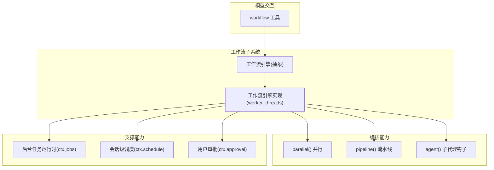
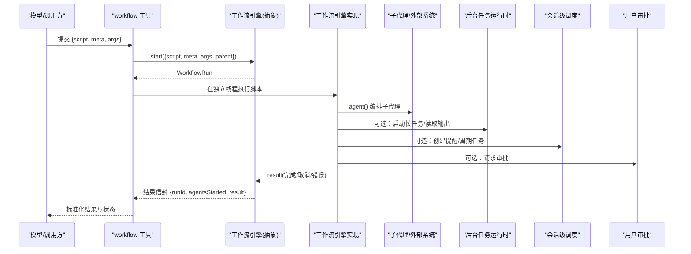
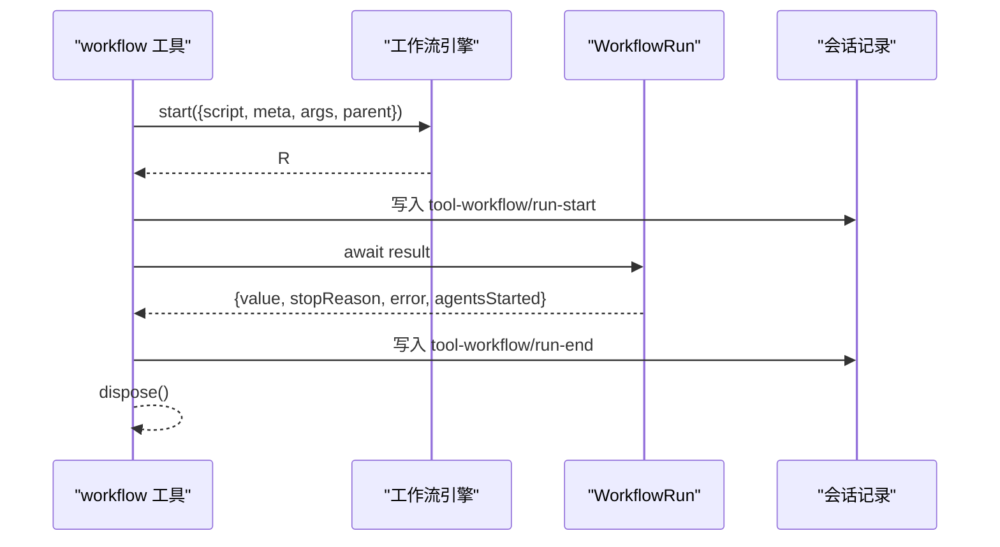
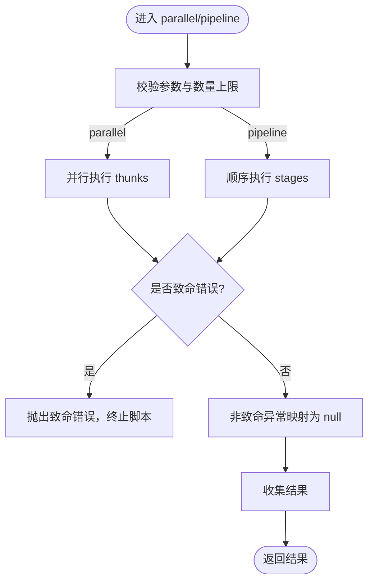
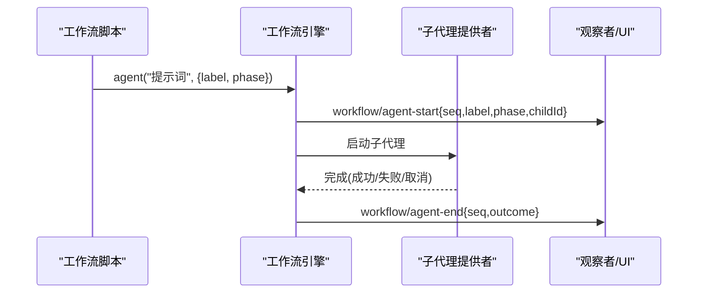
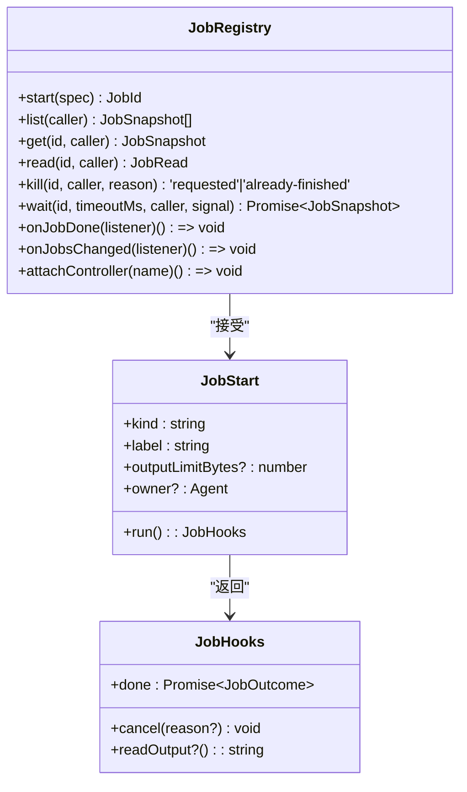
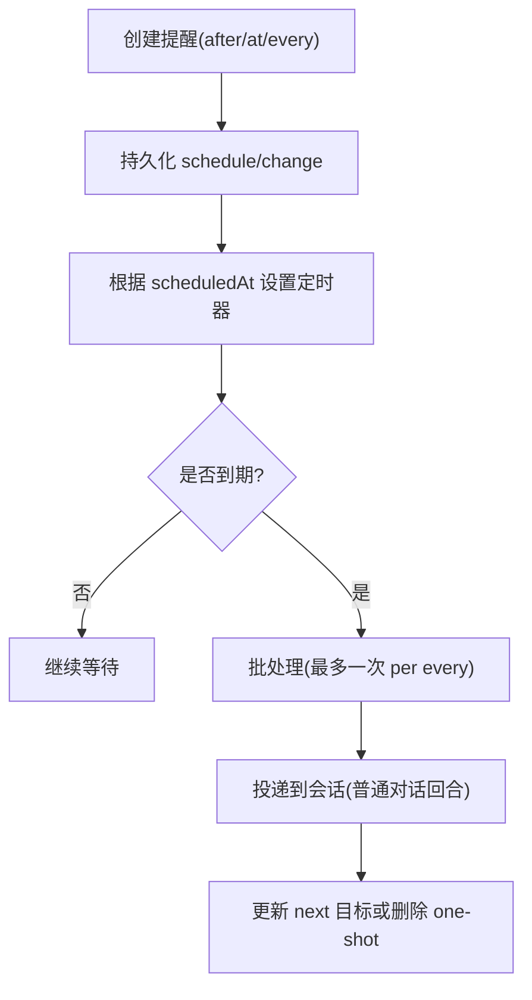
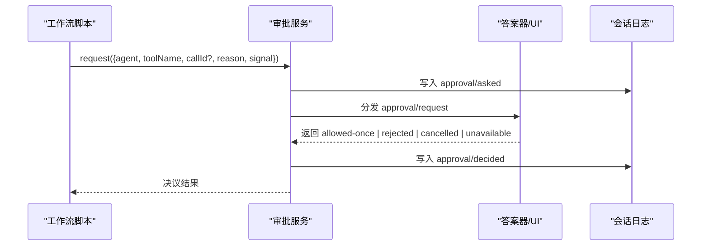
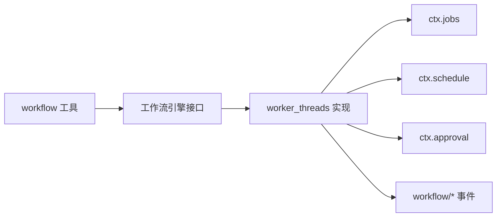

# 工作流自动化

<cite>
**本文引用的文件**
- [packages/workflow/README.md](file://packages/workflow/README.md)
- [docs/subsystems/workflow.md](file://docs/subsystems/workflow.md)
- [packages/workflow/tool-workflow/README.md](file://packages/workflow/tool-workflow/README.md)
- [packages/workflow/tool-workflow/src/index.ts](file://packages/workflow/tool-workflow/src/index.ts)
- [packages/workflow/workflow-worker-thread/src/runtime.ts](file://packages/workflow/workflow-worker-thread/src/runtime.ts)
- [packages/workflow/workflow-worker-thread/tests/workflow-worker-thread.spec.ts](file://packages/workflow/workflow-worker-thread/tests/workflow-worker-thread.spec.ts)
- [docs/subsystems/jobs.md](file://docs/subsystems/jobs.md)
- [docs/subsystems/schedule.md](file://docs/subsystems/schedule.md)
- [docs/subsystems/approval.md](file://docs/subsystems/approval.md)
</cite>

## 目录
1. [简介](#简介)
2. [项目结构](#项目结构)
3. [核心组件](#核心组件)
4. [架构总览](#架构总览)
5. [详细组件分析](#详细组件分析)
6. [依赖关系分析](#依赖关系分析)
7. [性能考虑](#性能考虑)
8. [故障排查指南](#故障排查指南)
9. [结论](#结论)
10. [附录](#附录)

## 简介
本文件面向“使用 DeepSeek Harness 构建复杂工作流”的综合实践，围绕任务编排、条件分支、并行执行、错误处理与重试、补偿事务、与调度引擎集成（如 Airflow、Temporal 或自定义调度器）、监控调试与性能优化、以及安全权限与审计日志等主题展开。内容基于仓库中工作流子系统、后台任务运行时、会话级调度与用户审批等能力进行系统化说明，并提供可落地的模式与最佳实践。

## 项目结构
DeepSeek Harness 的工作流能力由一组协作的包组成：
- 模型侧工具层：提供 workflow 工具，接收脚本、元数据与参数，负责结果封装与持久化记录。
- 工作流服务定义：抽象出工作流引擎接口与运行契约。
- 工作流引擎实现：在独立线程中执行脚本，隔离宿主事件循环，提供并发控制、组合器（parallel/pipeline）与子代理编排。
- 后台任务运行时：提供长生命周期任务的注册、观察、取消与产出读取。
- 会话级调度：提供延迟触发、绝对时间触发与固定周期提醒，用于会话内定时任务。
- 用户审批：提供细粒度动作授权与审计事件。

图表来源
- [packages/workflow/README.md:22-31](file://packages/workflow/README.md#L22-L31)
- [docs/subsystems/workflow.md:5-9](file://docs/subsystems/workflow.md#L5-L9)
- [docs/subsystems/jobs.md:157-179](file://docs/subsystems/jobs.md#L157-L179)
- [docs/subsystems/schedule.md:154-186](file://docs/subsystems/schedule.md#L154-L186)
- [docs/subsystems/approval.md:5-8](file://docs/subsystems/approval.md#L5-L8)

章节来源
- [packages/workflow/README.md:10-42](file://packages/workflow/README.md#L10-L42)
- [docs/subsystems/workflow.md:5-9](file://docs/subsystems/workflow.md#L5-L9)

## 核心组件
- 工作流工具（dsh-tool-workflow）
  - 暴露给模型的 workflow 工具，接收 script/meta/args，调用 ctx.workflowEngine 启动运行，阻塞等待结果并输出规范化的结果信封。
  - 将运行过程投影为会话内的 log-only 事件，便于 UI 展示与审计。
- 工作流引擎抽象（ctx.workflowEngine）
  - 定义 start(request) 契约，返回 WorkflowRun；result 永不拒绝，cancel/dispose 保证有界清理。
  - 通过 workflow/* 事件对外发布运行期快照，不暴露可变句柄。
- 工作流引擎实现（worker_threads）
  - 每个运行一个独立 worker，脚本在 VM 上下文内执行，同步计算不阻塞宿主事件循环。
  - 提供 parallel()/pipeline() 组合器与 agent() 钩子，支持并发上限、总量上限与阶段分组。
- 后台任务运行时（ctx.jobs）
  - 提供 JobRegistry：start/list/get/read/kill/wait/onJobDone/onJobsChanged/attachController。
  - 支持流式输出与最终输出两类任务，具备访问控制、容量限制与完成通知。
- 会话级调度（ctx.schedule）
  - 支持 after/at/every 三种规则，持久化 schedule/change 事件，冷启动恢复定时器，批量派发。
- 用户审批（ctx.approval）
  - 提供 ask/never 策略与 approval/request 瀑布，审计 approval/asked 与 approval/decided 事件。

章节来源
- [packages/workflow/tool-workflow/README.md:25-69](file://packages/workflow/tool-workflow/README.md#L25-L69)
- [docs/subsystems/workflow.md:11-112](file://docs/subsystems/workflow.md#L11-L112)
- [packages/workflow/workflow-worker-thread/src/runtime.ts:222-265](file://packages/workflow/workflow-worker-thread/src/runtime.ts#L222-L265)
- [docs/subsystems/jobs.md:24-96](file://docs/subsystems/jobs.md#L24-L96)
- [docs/subsystems/schedule.md:7-103](file://docs/subsystems/schedule.md#L7-L103)
- [docs/subsystems/approval.md:9-88](file://docs/subsystems/approval.md#L9-L88)

## 架构总览
下图展示了从模型调用到工作流执行、再到子代理与外部系统集成的端到端流程。

图表来源
- [packages/workflow/tool-workflow/README.md:63-69](file://packages/workflow/tool-workflow/README.md#L63-L69)
- [docs/subsystems/workflow.md:11-112](file://docs/subsystems/workflow.md#L11-L112)
- [docs/subsystems/jobs.md:157-179](file://docs/subsystems/jobs.md#L157-L179)
- [docs/subsystems/schedule.md:154-186](file://docs/subsystems/schedule.md#L154-L186)
- [docs/subsystems/approval.md:84-132](file://docs/subsystems/approval.md#L84-L132)

## 详细组件分析

### 工作流工具与运行生命周期
- 工具职责
  - 接收 script/meta/args，调用 ctx.workflowEngine.start，阻塞等待 result，并在 finally 中 dispose。
  - 将 run-start/run-end 与子代理开始/结束事件写入会话，供 UI 呈现与审计。
- 运行契约
  - WorkflowRun.result 永不拒绝；stopReason 包含 completed/cancelled/error。
  - cancel/dispose 保证有界清理，不会因卡住的脚本而挂起。

图表来源
- [packages/workflow/tool-workflow/README.md:63-69](file://packages/workflow/tool-workflow/README.md#L63-L69)
- [packages/workflow/tool-workflow/src/index.ts:94-130](file://packages/workflow/tool-workflow/src/index.ts#L94-L130)
- [docs/subsystems/workflow.md:93-112](file://docs/subsystems/workflow.md#L93-L112)

章节来源
- [packages/workflow/tool-workflow/README.md:25-69](file://packages/workflow/tool-workflow/README.md#L25-L69)
- [packages/workflow/tool-workflow/src/index.ts:94-130](file://packages/workflow/tool-workflow/src/index.ts#L94-L130)
- [docs/subsystems/workflow.md:93-112](file://docs/subsystems/workflow.md#L93-L112)

### 编排与并行：parallel 与 pipeline
- parallel(items)
  - 对 thunk 数组并行执行，单项异常捕获为 null；致命错误会向上抛出终止脚本。
- pipeline(items, ...stages)
  - 对每个 item 顺序执行 stages，单项异常跳过后续 stage 并置为 null；致命错误同样上抛。
- 并发与总量控制
  - 通过 acquireSlot/releaseSlot 管理并发槽位；maxTotalAgents 作为总量上限保护。

图表来源
- [packages/workflow/workflow-worker-thread/src/runtime.ts:400-458](file://packages/workflow/workflow-worker-thread/src/runtime.ts#L400-L458)
- [packages/workflow/workflow-worker-thread/src/runtime.ts:222-265](file://packages/workflow/workflow-worker-thread/src/runtime.ts#L222-L265)

章节来源
- [packages/workflow/workflow-worker-thread/src/runtime.ts:400-458](file://packages/workflow/workflow-worker-thread/src/runtime.ts#L400-L458)
- [packages/workflow/workflow-worker-thread/tests/workflow-worker-thread.spec.ts:348-384](file://packages/workflow/workflow-worker-thread/tests/workflow-worker-thread.spec.ts#L348-L384)

### 子代理编排与阶段分组
- agent(prompt, opts)
  - 校验 prompt 非空；按 opts.label/phase 生成标签与阶段；受 maxTotalAgents 限制。
- 阶段与日志
  - phase(title) 仅用于观察者分组；log(message) 输出叙述行。
- 事件
  - workflow/agent-start/agent-end 成对出现，携带 seq、label、phase、childId 与 outcome。

图表来源
- [packages/workflow/workflow-worker-thread/src/runtime.ts:249-265](file://packages/workflow/workflow-worker-thread/src/runtime.ts#L249-L265)
- [docs/subsystems/workflow.md:118-128](file://docs/subsystems/workflow.md#L118-L128)

章节来源
- [packages/workflow/workflow-worker-thread/src/runtime.ts:249-265](file://packages/workflow/workflow-worker-thread/src/runtime.ts#L249-L265)
- [docs/subsystems/workflow.md:118-128](file://docs/subsystems/workflow.md#L118-L128)

### 后台任务运行时（jobs）
- 角色定位
  - 适合需要长生命周期、可轮询输出、可取消的任务（例如 CI 步骤、数据处理作业）。
- 关键能力
  - start 原子注册；read 获取增量或终态输出；kill 请求取消；wait 等待完成；onJobDone/onJobsChanged 监听变更。
- 访问控制
  - 基于 ownerSession 的授权；id 可预测，安全边界在授权而非保密。

图表来源
- [docs/subsystems/jobs.md:24-96](file://docs/subsystems/jobs.md#L24-L96)
- [docs/subsystems/jobs.md:157-179](file://docs/subsystems/jobs.md#L157-L179)

章节来源
- [docs/subsystems/jobs.md:24-96](file://docs/subsystems/jobs.md#L24-L96)
- [docs/subsystems/jobs.md:157-179](file://docs/subsystems/jobs.md#L157-L179)

### 会话级调度（schedule）
- 规则类型
  - after：延迟一次性；at：绝对时间一次性；every：固定周期（≥5分钟），错过时跳至下一个对齐目标。
- 持久化与回放
  - 通过 schedule/change 事件持久化；冷启动重放后恢复定时器；决策时间用于选择最新到期项。
- 投递边界
  - session-local：仅在原会话存活时投递；以普通对话回合形式出现，无独立 Web 回执。

图表来源
- [docs/subsystems/schedule.md:7-103](file://docs/subsystems/schedule.md#L7-L103)
- [docs/subsystems/schedule.md:154-186](file://docs/subsystems/schedule.md#L154-L186)

章节来源
- [docs/subsystems/schedule.md:7-103](file://docs/subsystems/schedule.md#L7-L103)
- [docs/subsystems/schedule.md:154-186](file://docs/subsystems/schedule.md#L154-L186)

### 用户审批（approval）
- 策略
  - ask：委派给答案器链；never：直接拒绝，适用于无人值守场景。
- 审计
  - approval/asked 与 approval/decided 成对记录；不可被绕过。
- 集成点
  - 可在工作流中针对高风险操作发起审批，再决定是否继续。

图表来源
- [docs/subsystems/approval.md:9-88](file://docs/subsystems/approval.md#L9-L88)
- [docs/subsystems/approval.md:84-132](file://docs/subsystems/approval.md#L84-L132)

章节来源
- [docs/subsystems/approval.md:9-88](file://docs/subsystems/approval.md#L9-L88)
- [docs/subsystems/approval.md:84-132](file://docs/subsystems/approval.md#L84-L132)

## 依赖关系分析
- 松耦合
  - 工具层只依赖抽象引擎接口；引擎实现可替换（当前为 worker_threads）。
  - 工作流通过 ctx.jobs/schedule/approval 扩展能力，避免紧耦合。
- 事件驱动
  - workflow/*、tool-workflow/*、approval/*、schedule/change 等事件构成可观测性与审计基础。
- 资源边界
  - 脚本在独立线程执行，避免阻塞宿主事件循环；并发与总量上限防止失控。

图表来源
- [packages/workflow/README.md:22-31](file://packages/workflow/README.md#L22-L31)
- [docs/subsystems/workflow.md:5-9](file://docs/subsystems/workflow.md#L5-L9)

章节来源
- [packages/workflow/README.md:22-31](file://packages/workflow/README.md#L22-L31)
- [docs/subsystems/workflow.md:5-9](file://docs/subsystems/workflow.md#L5-L9)

## 性能考虑
- 并发与吞吐
  - 使用 parallel 并行无关任务；使用 pipeline 串联多阶段处理；合理设置 maxConcurrentAgents 与 maxTotalAgents。
- 资源隔离
  - 脚本在 worker 线程执行，避免阻塞主事件循环；dispose 保证资源回收。
- 输出与结果
  - 大结果通过 maxResultChars 截断；长任务建议使用 jobs.read 拉取增量输出。
- 调度批处理
  - every 规则在过期时合并为单批次，减少模型回合开销。

[本节为通用指导，不直接分析具体文件]

## 故障排查指南
- 常见错误
  - 参数非法：phase/log/agent 的参数类型与长度校验失败。
  - 容量超限：达到 maxTotalAgents 或并发上限。
  - 致命错误：组合器中的致命错误会终止脚本；非致命错误映射为 null。
- 诊断手段
  - 观察 workflow/* 事件与 tool-workflow/* 记录，确认阶段与子代理生命周期。
  - 使用 jobs.list/read/kill 查看长任务状态与输出。
  - 检查 schedule 记录与定时器是否按预期推进。
  - 通过 approval 审计事件确认审批链路。

章节来源
- [packages/workflow/workflow-worker-thread/tests/workflow-worker-thread.spec.ts:348-384](file://packages/workflow/workflow-worker-thread/tests/workflow-worker-thread.spec.ts#L348-L384)
- [docs/subsystems/workflow.md:114-128](file://docs/subsystems/workflow.md#L114-L128)
- [docs/subsystems/jobs.md:157-179](file://docs/subsystems/jobs.md#L157-L179)
- [docs/subsystems/schedule.md:154-186](file://docs/subsystems/schedule.md#L154-L186)
- [docs/subsystems/approval.md:84-132](file://docs/subsystems/approval.md#L84-L132)

## 结论
DeepSeek Harness 提供了以脚本为中心的工作流编排能力，结合并行/流水线、子代理、后台任务、会话级调度与用户审批，能够覆盖 CI/CD、数据处理管道与审批流程等多种自动化场景。通过事件驱动的观测与审计、严格的资源与并发控制、以及可插拔的引擎实现，既保证了可靠性与可维护性，也为与外部调度系统（Airflow、Temporal 或自研调度器）集成提供了清晰的对接点。

[本节为总结性内容，不直接分析具体文件]

## 附录

### 工作流定义格式与节点类型
- 工作流元数据
  - name/description/whenToUse/phases：标识与描述，phases 仅用于进度分组。
- 节点类型
  - 脚本节点：顶层脚本体，允许顶层 await，最终返回 JSON。
  - 子代理节点：通过 agent() 启动子代理，支持 label/phase。
  - 组合节点：parallel/pipeline 提供并行与流水线编排。
- 依赖关系管理
  - 通过组合器表达依赖；阶段分组提升可读性；总量与并发上限保障稳定性。

章节来源
- [docs/subsystems/workflow.md:39-65](file://docs/subsystems/workflow.md#L39-L65)
- [packages/workflow/workflow-worker-thread/src/runtime.ts:400-458](file://packages/workflow/workflow-worker-thread/src/runtime.ts#L400-L458)

### 多种自动化场景示例
- CI/CD 流水线
  - 使用 pipeline 串联 lint/test/build/deploy；用 jobs 承载耗时步骤；必要时通过 approval 审批发布。
- 数据处理管道
  - 使用 parallel 并行抽取多个数据源；pipeline 清洗/转换/聚合；jobs 拉取中间产物；schedule 周期性刷新。
- 审批流程
  - 在关键节点调用 approval.request；根据结果决定继续或回滚；记录审计事件。

[本节为概念性示例，不直接分析具体文件]

### 错误处理、重试与补偿事务
- 错误分类
  - 非致命错误：组合器中映射为 null，不影响其他项。
  - 致命错误：立即终止脚本，避免静默失败。
- 重试机制
  - 在工作流脚本中对幂等操作实施指数退避重试；对非幂等操作使用 jobs 的幂等键或去重表。
- 补偿事务
  - 在 pipeline 中记录已生效副作用；失败时按逆序执行补偿逻辑；必要时借助 jobs 异步补偿。

[本节为通用模式，不直接分析具体文件]

### 与工作流引擎集成（Airflow/Temporal/自定义调度器）
- 设计要点
  - 将 DeepSeek 工作流视为“编排层”，外部调度器负责触发、重试、超时与可视化。
  - 通过 ctx.jobs 将长任务交给外部系统托管；通过 ctx.schedule 做轻量本地定时。
  - 通过 approval 接入企业审批流。
- 集成方式
  - Airflow：将 workflow 工具调用封装为 PythonOperator/Dag；用 jobs 拉取输出。
  - Temporal：将工作流脚本作为 Step Function 编排；用 approval 做人工审批步骤。
  - 自定义调度器：通过 REST/gRPC 触发 workflowEngine.start，并订阅 events 与 jobs 状态。

[本节为概念性集成建议，不直接分析具体文件]

### 监控、调试与性能优化
- 监控
  - 订阅 workflow/* 与 tool-workflow/* 事件；采集 agentsStarted、stopReason、error。
  - 使用 jobs.onJobDone/onJobsChanged 跟踪长任务。
- 调试
  - 利用 phase/log 标注关键路径；结合会话记录回放问题。
- 优化
  - 调整并发与总量上限；拆分大结果为多次 read；合并小任务；避免在脚本中进行阻塞 I/O。

[本节为通用指导，不直接分析具体文件]

### 安全、权限与审计日志
- 安全
  - 脚本在 worker 线程执行，非安全边界；敏感操作需经 approval。
  - 输入严格校验，拒绝未知选项与越权行为。
- 权限
  - jobs 基于 ownerSession 授权；id 可预测，不依赖 id 保密。
- 审计
  - workflow/*、tool-workflow/*、approval/*、schedule/change 等事件提供完整审计轨迹。

章节来源
- [docs/subsystems/jobs.md:157-179](file://docs/subsystems/jobs.md#L157-L179)
- [docs/subsystems/approval.md:84-132](file://docs/subsystems/approval.md#L84-L132)
- [docs/subsystems/schedule.md:154-186](file://docs/subsystems/schedule.md#L154-L186)
- [docs/subsystems/workflow.md:118-128](file://docs/subsystems/workflow.md#L118-L128)