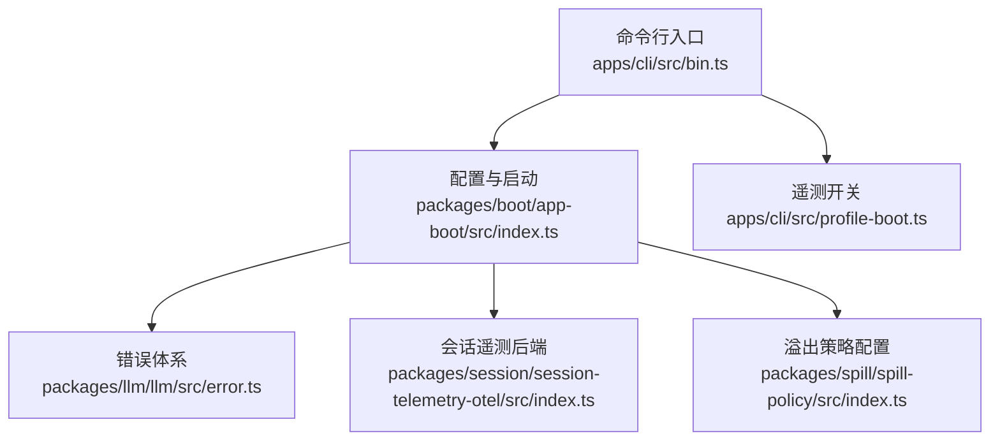
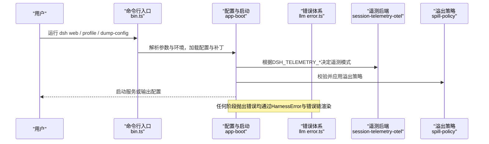
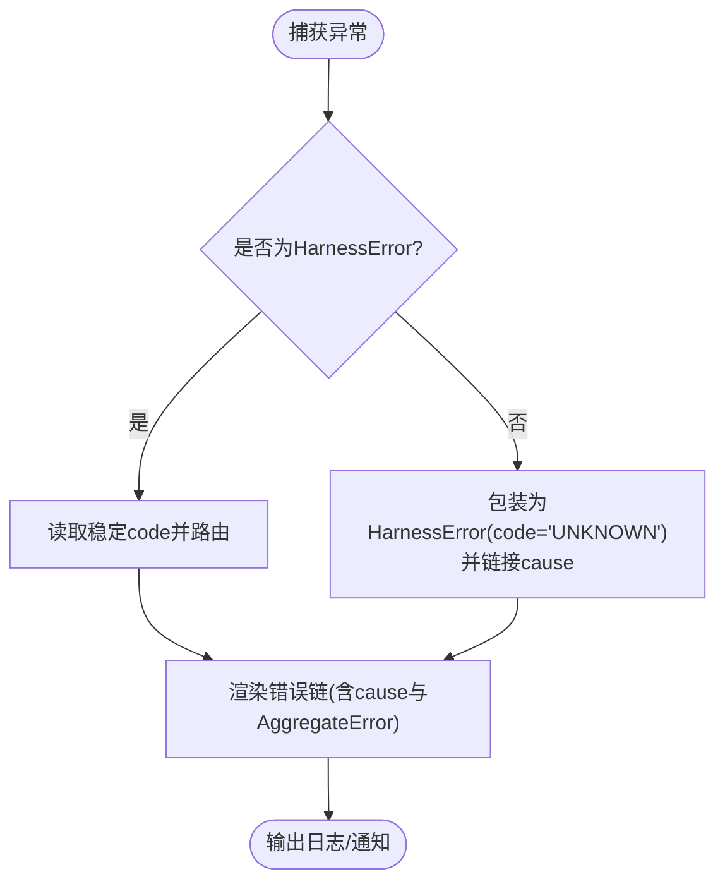
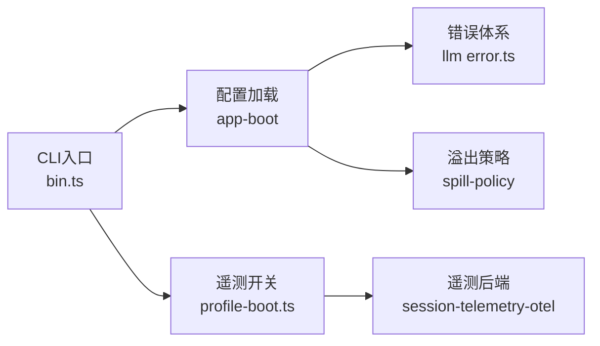

# 故障排除

<cite>
**本文引用的文件**
- [README.md](file://README.md)
- [CONTRIBUTING.md](file://CONTRIBUTING.md)
- [bin.ts](file://apps/cli/src/bin.ts)
- [profile-boot.ts](file://apps/cli/src/profile-boot.ts)
- [index.ts（应用启动）](file://packages/boot/app-boot/src/index.ts)
- [error.ts（LLM错误基类与工具）](file://packages/llm/llm/src/error.ts)
- [配置来源所有权说明](file://.agents/notes/implemented/architecture/2026-08-04-configuration-source-ownership.md)
- [反馈门控遥测默认值说明](file://.agents/notes/implemented/feature/2026-08-25-feedback-gated-telemetry-default.md)
- [OpenTelemetry会话遥测后端](file://packages/session/session-telemetry-otel/src/index.ts)
- [smoke-python-runtime.py（示例：禁用遥测）](file://scripts/smoke-python-runtime.py)
- [spill-policy 配置校验](file://packages/spill/spill-policy/src/index.ts)
- [安装锁实现（Lefthook）](file://scripts/install-lefthook.mjs)
</cite>

## 目录
1. [简介](#简介)
2. [项目结构](#项目结构)
3. [核心组件](#核心组件)
4. [架构总览](#架构总览)
5. [详细组件分析](#详细组件分析)
6. [依赖关系分析](#依赖关系分析)
7. [性能注意事项](#性能注意事项)
8. [故障排查指南](#故障排查指南)
9. [结论](#结论)
10. [附录](#附录)

## 简介
本指南面向DeepSeek Harness的安装、配置、运行时异常、性能瓶颈等常见问题的诊断与修复，提供系统化的问题定位方法、日志分析技巧、调试工具使用建议，以及典型故障场景的复现步骤与解决过程。同时汇总社区支持与获取帮助的渠道，帮助你在开发或部署中快速定位并解决问题。

## 项目结构
DeepSeek Harness采用“一切皆插件”的架构，CLI入口负责解析参数与环境，按模式加载配置文件与插件层，再启动Web UI或执行其他任务。关键路径包括：
- CLI入口：命令行参数解析与分发
- 配置与启动：分层配置加载、补丁覆盖、环境变量合并
- 错误体系：统一的HarnessError与错误链渲染
- 遥测：可配置的会话遥测开关与默认策略
- 安全与沙箱：进程/文件系统限制与溢出策略

**图示来源**
- [bin.ts:1-51](file://apps/cli/src/bin.ts#L1-L51)
- [index.ts（应用启动）:382-412](file://packages/boot/app-boot/src/index.ts#L382-L412)
- [profile-boot.ts:76-103](file://apps/cli/src/profile-boot.ts#L76-L103)
- [error.ts（LLM错误基类与工具）:1-164](file://packages/llm/llm/src/error.ts#L1-L164)
- [OpenTelemetry会话遥测后端:141-168](file://packages/session/session-telemetry-otel/src/index.ts#L141-L168)
- [spill-policy 配置校验:110-121](file://packages/spill/spill-policy/src/index.ts#L110-L121)

**章节来源**
- [README.md:17-41](file://README.md#L17-L41)
- [bin.ts:1-51](file://apps/cli/src/bin.ts#L1-L51)
- [index.ts（应用启动）:382-412](file://packages/boot/app-boot/src/index.ts#L382-L412)

## 核心组件
- 命令行入口与模式分发：解析参数后进入profile、plugin、dump-config等模式，统一加载环境与补丁。
- 配置加载与覆盖：支持用户设置、组合配置、环境变量的分层优先级；敏感信息与非敏感信息采用不同排序规则。
- 错误体系：统一的HarnessError基类，稳定code用于路由与重试；错误链渲染便于日志与UI展示。
- 遥测与隐私：默认在记录反馈时上传必要数据；可通过环境变量硬关闭遥测。
- 溢出策略：对大结果进行落盘或压缩，避免内存压力；配置项需在加载时校验。

**章节来源**
- [bin.ts:1-51](file://apps/cli/src/bin.ts#L1-L51)
- [配置来源所有权说明:17-69](file://.agents/notes/implemented/architecture/2026-08-04-configuration-source-ownership.md#L17-L69)
- [error.ts（LLM错误基类与工具）:1-164](file://packages/llm/llm/src/error.ts#L1-L164)
- [反馈门控遥测默认值说明:1-13](file://.agents/notes/implemented/feature/2026-08-25-feedback-gated-telemetry-default.md#L1-L13)
- [OpenTelemetry会话遥测后端:141-168](file://packages/session/session-telemetry-otel/src/index.ts#L141-L168)
- [spill-policy 配置校验:110-121](file://packages/spill/spill-policy/src/index.ts#L110-L121)

## 架构总览
下图展示了从命令行到配置加载、错误处理与遥测的关键交互流程。

**图示来源**
- [bin.ts:1-51](file://apps/cli/src/bin.ts#L1-L51)
- [index.ts（应用启动）:382-412](file://packages/boot/app-boot/src/index.ts#L382-L412)
- [error.ts（LLM错误基类与工具）:102-164](file://packages/llm/llm/src/error.ts#L102-L164)
- [OpenTelemetry会话遥测后端:141-168](file://packages/session/session-telemetry-otel/src/index.ts#L141-L168)
- [spill-policy 配置校验:110-121](file://packages/spill/spill-policy/src/index.ts#L110-L121)

## 详细组件分析

### 命令行入口与模式分发
- 作用：解析命令行参数与版本信息，按模式分发到profile、plugin、dump-config等子模块。
- 常见问题：
  - 未识别的模式或参数导致启动失败。
  - 环境变量未正确加载导致行为异常。
- 诊断要点：
  - 检查传入参数是否符合预期。
  - 确认环境加载函数返回的环境对象包含所需变量。
  - 查看分发的目标模块是否成功导入与执行。

**章节来源**
- [bin.ts:1-51](file://apps/cli/src/bin.ts#L1-L51)

### 配置加载与覆盖顺序
- 作用：非敏感配置遵循“显式运行 > 用户设置 > 组合配置 > 当前Shell环境 > 发现的文件 > 默认值”的顺序；敏感配置（凭据）有独立且更严格的顺序。
- 常见问题：
  - 环境变量被意外覆盖或忽略。
  - .env中的敏感变量未被应用或被拒绝。
- 诊断要点：
  - 核对各层级配置来源与优先级。
  - 确认敏感变量来源符合预期（如进程环境优先）。
  - 若出现不生效的配置，检查是否在错误的层级设置。

**章节来源**
- [配置来源所有权说明:17-69](file://.agents/notes/implemented/architecture/2026-08-04-configuration-source-ownership.md#L17-L69)

### 错误体系与日志渲染
- 作用：统一错误基类HarnessError携带稳定code；错误链渲染将cause链与AggregateError成员展开为可读文本。
- 常见问题：
  - 错误信息难以区分类型（如上下文窗口超限 vs 配额耗尽）。
  - 非Error抛出不带code，导致下游无法路由。
- 诊断要点：
  - 优先依据code进行分支处理与重试策略。
  - 使用错误链渲染输出完整上下文，便于定位根因。
  - 对未知throw进行包装，保留原始cause以便追踪。

**图示来源**
- [error.ts（LLM错误基类与工具）:1-164](file://packages/llm/llm/src/error.ts#L1-L164)

**章节来源**
- [error.ts（LLM错误基类与工具）:1-164](file://packages/llm/llm/src/error.ts#L1-L164)

### 遥测与隐私控制
- 作用：默认在记录反馈时上传必要会话数据；可通过环境变量硬关闭遥测；未启用时仅本地记录并提示。
- 常见问题：
  - 反馈报告缺少会话数据。
  - 误以为遥测已开启但实际被硬关闭。
- 诊断要点：
  - 检查DSH_TELEMETRY_MODE与DSH_TELEMETRY_DISABLED的值。
  - 在未启用模式下，确认日志中出现“遥测已禁用”的提示。
  - 在E2E或脚本中可通过禁用遥测简化测试。

**章节来源**
- [反馈门控遥测默认值说明:1-13](file://.agents/notes/implemented/feature/2026-08-25-feedback-gated-telemetry-default.md#L1-L13)
- [OpenTelemetry会话遥测后端:141-168](file://packages/session/session-telemetry-otel/src/index.ts#L141-L168)
- [smoke-python-runtime.py（示例：禁用遥测）:205-221](file://scripts/smoke-python-runtime.py#L205-L221)

### 溢出策略与内存压力
- 作用：对超出内联阈值的结果进行落盘或压缩，避免内存占用过高；配置项需在加载时校验。
- 常见问题：
  - 配置项非法导致每次调用都失败。
  - 大结果导致内存飙升或卡顿。
- 诊断要点：
  - 确保maxInlineBytes为非负整数。
  - 观察日志中关于溢出策略的警告或错误。
  - 调整阈值以平衡性能与内存。

**章节来源**
- [spill-policy 配置校验:110-121](file://packages/spill/spill-policy/src/index.ts#L110-L121)

### 安装与锁定问题（Lefthook）
- 作用：在安装钩子时使用文件锁防止并发冲突，检测锁所有权变化并报错。
- 常见问题：
  - 并发安装导致锁冲突或权限错误。
  - 锁文件损坏或符号链接导致安装失败。
- 诊断要点：
  - 检查锁文件是否存在及类型是否正确。
  - 关注EEXIST错误与锁所有权变更异常。
  - 清理残留锁文件后重试。

**章节来源**
- [安装锁实现（Lefthook）:381-415](file://scripts/install-lefthook.mjs#L381-L415)

## 依赖关系分析
- CLI入口依赖配置加载与遥测开关，二者共同影响启动行为。
- 错误体系贯穿所有组件，作为跨边界的统一错误表达。
- 溢出策略与遥测均为可选能力，受配置与环境变量控制。

**图示来源**
- [bin.ts:1-51](file://apps/cli/src/bin.ts#L1-L51)
- [index.ts（应用启动）:382-412](file://packages/boot/app-boot/src/index.ts#L382-L412)
- [profile-boot.ts:76-103](file://apps/cli/src/profile-boot.ts#L76-L103)
- [error.ts（LLM错误基类与工具）:1-164](file://packages/llm/llm/src/error.ts#L1-L164)
- [OpenTelemetry会话遥测后端:141-168](file://packages/session/session-telemetry-otel/src/index.ts#L141-L168)
- [spill-policy 配置校验:110-121](file://packages/spill/spill-policy/src/index.ts#L110-L121)

**章节来源**
- [bin.ts:1-51](file://apps/cli/src/bin.ts#L1-L51)
- [index.ts（应用启动）:382-412](file://packages/boot/app-boot/src/index.ts#L382-L412)
- [profile-boot.ts:76-103](file://apps/cli/src/profile-boot.ts#L76-L103)
- [error.ts（LLM错误基类与工具）:1-164](file://packages/llm/llm/src/error.ts#L1-L164)
- [OpenTelemetry会话遥测后端:141-168](file://packages/session/session-telemetry-otel/src/index.ts#L141-L168)
- [spill-policy 配置校验:110-121](file://packages/spill/spill-policy/src/index.ts#L110-L121)

## 性能注意事项
- 大结果处理：合理设置溢出策略阈值，避免内存峰值过高。
- 遥测开销：在生产环境中按需启用遥测，减少网络与序列化成本。
- 启动优化：精简配置层与补丁，减少加载时间。
- 监控指标：结合浏览器与宿主侧指标评估历史传输与渲染性能。

[本节为通用指导，无需特定文件引用]

## 故障排查指南

### 安装问题
- 症状：pnpm install或构建失败、Lefthook安装冲突。
- 可能原因：
  - 依赖版本不兼容或网络问题。
  - 并发安装导致锁冲突。
- 处理步骤：
  - 清理缓存与node_modules后重试。
  - 检查锁文件状态，必要时删除残留锁。
  - 确保Node.js版本与仓库要求一致。

**章节来源**
- [安装锁实现（Lefthook）:381-415](file://scripts/install-lefthook.mjs#L381-L415)

### 配置错误
- 症状：环境变量不生效、凭据未使用、端点指向错误。
- 可能原因：
  - 配置层级优先级误解。
  - .env中包含不允许的变量。
- 处理步骤：
  - 核对非敏感与敏感配置的优先级顺序。
  - 将开关与敏感信息放入进程环境或受信任位置。
  - 使用dump-config模式输出最终配置以验证。

**章节来源**
- [配置来源所有权说明:17-69](file://.agents/notes/implemented/architecture/2026-08-04-configuration-source-ownership.md#L17-L69)
- [index.ts（应用启动）:382-412](file://packages/boot/app-boot/src/index.ts#L382-L412)

### 运行时异常
- 症状：模型请求失败、空响应、上下文窗口超限、配额耗尽。
- 可能原因：
  - 输入过长或模型上下文不足。
  - 账户余额或配额用尽。
  - 凭据格式错误或过期。
- 处理步骤：
  - 依据错误码分类处理（如CONTEXT_WINDOW_EXCEEDED、QUOTA、EMPTY_RESPONSE、INVALID_CREDENTIAL）。
  - 使用错误链渲染查看完整cause链。
  - 针对凭据错误修正存储值而非重新提供。

**章节来源**
- [error.ts（LLM错误基类与工具）:24-100](file://packages/llm/llm/src/error.ts#L24-L100)
- [error.ts（LLM错误基类与工具）:102-164](file://packages/llm/llm/src/error.ts#L102-L164)

### 性能瓶颈
- 症状：界面卡顿、内存增长、历史传输慢。
- 可能原因：
  - 大结果未落盘或压缩。
  - 遥测开启带来额外开销。
  - 历史事件过多导致渲染压力。
- 处理步骤：
  - 调整溢出策略阈值。
  - 按需关闭遥测或限制上报范围。
  - 使用性能测试与指标收集定位热点。

**章节来源**
- [spill-policy 配置校验:110-121](file://packages/spill/spill-policy/src/index.ts#L110-L121)
- [OpenTelemetry会话遥测后端:141-168](file://packages/session/session-telemetry-otel/src/index.ts#L141-L168)

### 典型故障场景与解决过程
- 场景一：上下文窗口超限
  - 现象：模型返回错误，提示上下文长度超限。
  - 诊断：依据错误码识别为上下文窗口问题；查看错误链中的provider细节。
  - 修复：缩短输入或启用上下文压缩；调整系统提示与历史保留策略。
- 场景二：配额耗尽
  - 现象：请求被拒，提示余额或配额不足。
  - 诊断：依据错误码识别为配额问题；检查账户状态。
  - 修复：充值或切换账号；避免在同一账号下并发高负载任务。
- 场景三：空响应
  - 现象：完成但无内容块。
  - 诊断：识别为空响应错误码；判定为可重试的安全失败。
  - 修复：重试或调整提示词；检查模型行为。
- 场景四：凭据无效
  - 现象：认证失败，提示凭据格式错误。
  - 诊断：识别为凭据无效错误码；检查存储值。
  - 修复：修正存储的凭据值；避免在.env中放置敏感信息。

**章节来源**
- [error.ts（LLM错误基类与工具）:24-100](file://packages/llm/llm/src/error.ts#L24-L100)

### 日志分析与调试技巧
- 使用错误链渲染输出完整cause链，便于定位根因。
- 在遥测禁用模式下，确认本地记录与提示是否正常。
- 通过dump-config模式输出最终配置，验证覆盖顺序。
- 在性能测试中采集宿主与客户端指标，对比压缩与打包效果。

**章节来源**
- [error.ts（LLM错误基类与工具）:102-164](file://packages/llm/llm/src/error.ts#L102-L164)
- [OpenTelemetry会话遥测后端:141-168](file://packages/session/session-telemetry-otel/src/index.ts#L141-L168)
- [index.ts（应用启动）:382-412](file://packages/boot/app-boot/src/index.ts#L382-L412)

### 系统化方法论
- 明确问题域：安装、配置、运行时、性能。
- 收集证据：错误码、错误链、配置快照、性能指标。
- 分层定位：从CLI入口到配置加载、错误处理、遥测与溢出策略。
- 制定修复：依据错误码与配置优先级采取针对性措施。
- 验证回归：通过测试与指标确认修复有效。

[本节为方法论总结，无需特定文件引用]

## 结论
通过统一的错误体系、清晰的配置优先级、可配置的遥测与溢出策略，DeepSeek Harness提供了强大的可扩展性与可观测性。遇到问题时，应优先依据错误码与错误链进行定位，结合配置快照与性能指标进行验证，逐步缩小范围并实施修复。

[本节为总结，无需特定文件引用]

## 附录

### 社区支持与获取帮助
- 通过GitHub Discussions提交反馈或问题报告。
- 为插件仓库添加dsh-plugin主题以提升可见性。
- 加入DeepSeek Harness Discord社区获取即时帮助。

**章节来源**
- [README.md:43-47](file://README.md#L43-L47)
- [CONTRIBUTING.md:9-17](file://CONTRIBUTING.md#L9-L17)