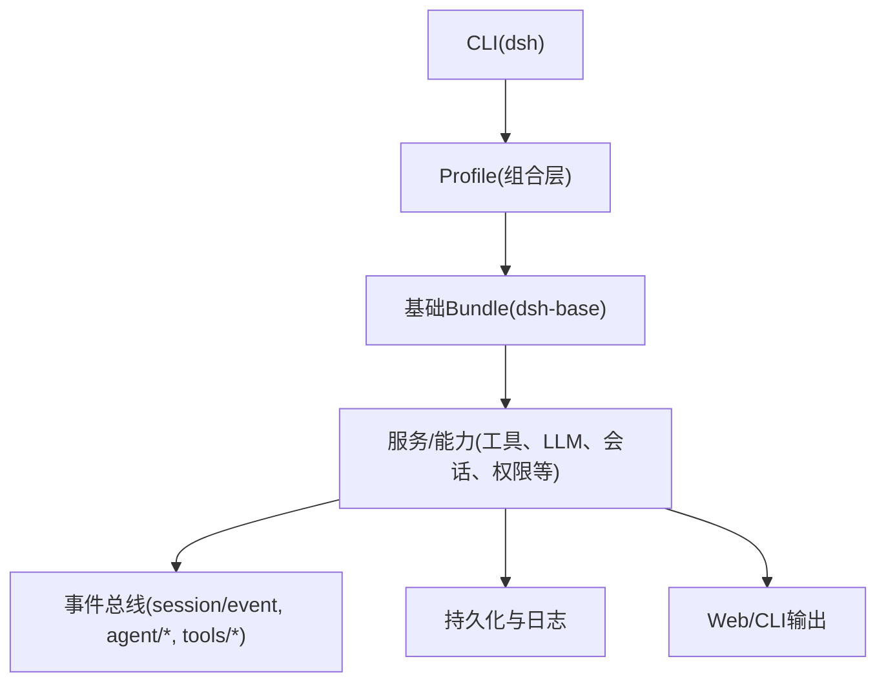
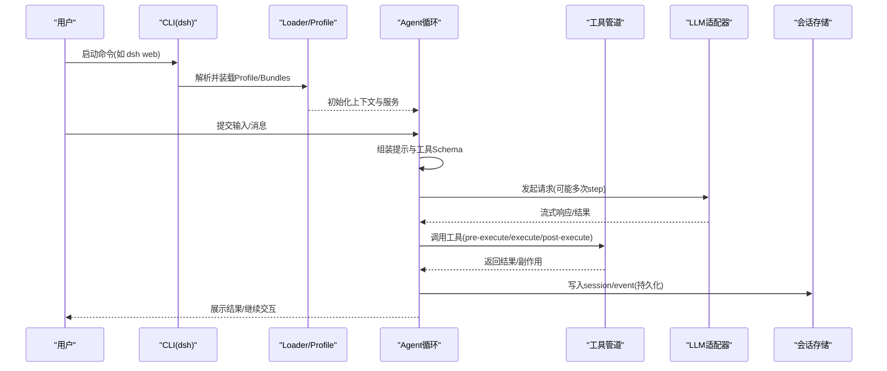
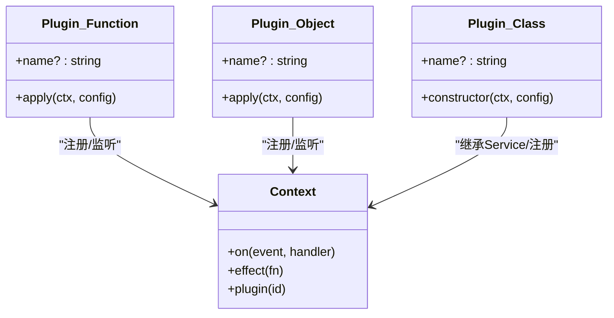
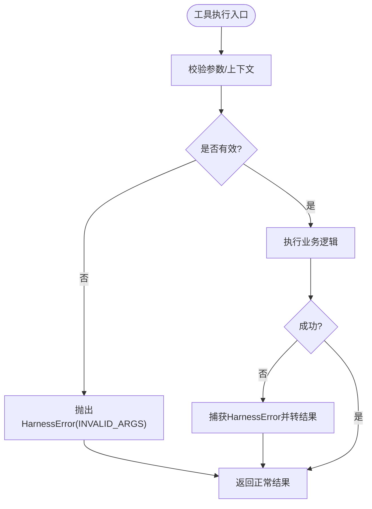
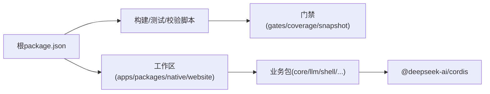

# 最佳实践

<cite>
**本文引用的文件**
- [README.md](file://README.md)
- [CONTRIBUTING.md](file://CONTRIBUTING.md)
- [package.json](file://package.json)
- [architecture.md](file://docs/architecture.md)
- [testing.md](file://docs/testing.md)
- [SAFETY.md](file://SAFETY.md)
- [01-first-plugin.md](file://docs/cordis-tutorial/01-first-plugin.md)
- [adding-a-package.md](file://docs/cookbook/adding-a-package.md)
- [extension-cookbook.md](file://docs/cookbook/extension-cookbook.md)
- [error.ts](file://packages/llm/llm/src/error.ts)
- [tools.spec.ts](file://packages/core/tools/tests/tools.spec.ts)
</cite>

## 目录
1. [简介](#简介)
2. [项目结构](#项目结构)
3. [核心组件](#核心组件)
4. [架构总览](#架构总览)
5. [详细组件分析](#详细组件分析)
6. [依赖分析](#依赖分析)
7. [性能考虑](#性能考虑)
8. [故障排查指南](#故障排查指南)
9. [结论](#结论)
10. [附录](#附录)

## 简介
本指南面向DeepSeek Harness（dsh）的开发者与插件作者，汇总在代码组织、错误处理、性能优化、安全、测试、插件开发规范、常见陷阱与生产部署等方面的最佳实践。dsh采用“一切皆插件”的微内核架构，基于Cordis进行服务注册、事件驱动与可插拔能力扩展；通过Profile与Bundle组合应用，所有功能均可被配置化替换或覆盖。

## 项目结构
- 顶层工作区由pnpm管理，包含apps、packages、native、scripts、website等子工程。
- 应用入口统一通过CLI选择Profile启动（web、headless、sdk、acp等），避免绕过dsh的私有入口。
- 插件与能力以包为单位分布在packages下，按领域分组（core、llm、shell、session、client/host等）。
- 构建与验证脚本集中在scripts，提供类型检查、lint、覆盖率、快照、发布校验等门禁。

图表来源
- [architecture.md:15-47](file://docs/architecture.md#L15-L47)
- [package.json:19-155](file://package.json#L19-L155)

章节来源
- [README.md:17-41](file://README.md#L17-L41)
- [package.json:1-18](file://package.json#L1-L18)
- [architecture.md:15-47](file://docs/architecture.md#L15-L47)

## 核心组件
- 插件系统：函数式、对象式、类式三种插件形态，均通过apply(ctx)注册服务、监听事件、声明注入依赖。
- 能力接缝（Capability Seams）：将接口定义、提供者、消费者解耦，便于替换实现（如文件系统、子进程、沙箱、模型适配器等）。
- 事件驱动：session/event为持久事实流；agent/*用于拦截运行中任务；tools/*用于工具执行前后钩子。
- 会话与提示：会话日志是模型可见上下文的唯一来源；提示组装与工具Schema由系统提示子系统聚合。
- 启动与组合：通过Profile与Bundle有序叠加，支持热重载（web默认）与一次性加载（headless/sdk/acp）。

章节来源
- [architecture.md:9-13](file://docs/architecture.md#L9-L13)
- [architecture.md:64-101](file://docs/architecture.md#L64-L101)
- [architecture.md:109-141](file://docs/architecture.md#L109-L141)
- [01-first-plugin.md:5-31](file://docs/cordis-tutorial/01-first-plugin.md#L5-L31)

## 架构总览
下图展示了从CLI到Profile、Bundle、服务与事件的调用链，以及工具执行的关键阶段。

图表来源
- [architecture.md:74-101](file://docs/architecture.md#L74-L101)
- [extension-cookbook.md:9-33](file://docs/cookbook/extension-cookbook.md#L9-L33)

## 详细组件分析

### 插件开发与命名约定
- 插件形态：优先使用函数式插件；需要暴露服务时使用类式Service；对象式插件适合轻量挂载。
- 命名约定：
  - 稳定职责命名，不绑定具体实现或未来扩展。
  - ctx键名：单数表示单一引擎/运行时/策略；复数表示注册表或多成员服务。
  - 角色后缀参考：Controller、Store、Registry、Runtime、Resolver、Policy、Executor、Gateway、Provider、Backend、Handle、Config、Service等。
- 依赖管理：通过inject声明所需服务；确保peerDependencies与devDependencies一致，遵循仓库约束脚本。

图表来源
- [01-first-plugin.md:53-77](file://docs/cordis-tutorial/01-first-plugin.md#L53-L77)
- [adding-a-package.md:41-71](file://docs/cookbook/adding-a-package.md#L41-L71)

章节来源
- [01-first-plugin.md:5-31](file://docs/cordis-tutorial/01-first-plugin.md#L5-L31)
- [adding-a-package.md:41-71](file://docs/cookbook/adding-a-package.md#L41-L71)

### 错误处理策略
- 统一错误基类：HarnessError携带稳定的machine-routable code与cause链，便于上层路由与回放。
- 工具执行错误：参数校验失败抛出结构化错误；工具抛出的HarnessError会被捕获并转为结果中的错误信息，保留code与name。
- 建议：
  - 对外暴露的错误必须包含稳定code，消费方按code分支处理，而非解析message。
  - 工具实现应尽早校验入参，失败时返回明确的INVALID_ARGS等错误。
  - 对网络、配额、上下文窗口超限等场景使用预定义常量码。

图表来源
- [error.ts:1-28](file://packages/llm/llm/src/error.ts#L1-L28)
- [tools.spec.ts:2615-2647](file://packages/core/tools/tests/tools.spec.ts#L2615-L2647)

章节来源
- [error.ts:1-28](file://packages/llm/llm/src/error.ts#L1-L28)
- [tools.spec.ts:2615-2647](file://packages/core/tools/tests/tools.spec.ts#L2615-L2647)

### 性能优化技巧
- 事件与流：充分利用session/event与streaming，减少不必要的中间态；对大文本/图片注意KV Cache影响。
- 工具执行：使用tools/pre-execute做快速拒绝；tools/execute包装超时/重试/指标；tools/result做最终审计。
- 会话压缩：在agent/pre-step触发自动压缩，或在request-error时恢复；手动压缩通过ctx.compaction。
- 资源限制：合理设置队列长度、字节上限、超时与重连退避，避免内存与CPU尖峰。
- 构建与产物：仅引入必要依赖；避免在浏览器产物泄露构建期环境变量；使用官方profile打包以减少冗余。

章节来源
- [extension-cookbook.md:9-33](file://docs/cookbook/extension-cookbook.md#L9-L33)
- [architecture.md:109-141](file://docs/architecture.md#L109-L141)

### 安全考虑
- 实验性风险：dsh可执行模型生成代码与命令、加载第三方插件、访问网络/进程/凭证/文件；误用可能导致主机受损或数据泄露。
- 沙箱局限：沙箱、审批与权限控制可降低风险但不保证隔离；不要将其作为唯一安全防线。
- 最小权限：以最低权限运行；优先使用可销毁环境（VM/容器）；备份可访问文件；谨慎暴露敏感数据。
- 插件审查：上线前审查插件、配置与待执行命令；对不可信负载保持警惕。

章节来源
- [SAFETY.md:5-27](file://SAFETY.md#L5-L27)

### 测试方法
- 分层测试：
  - 单元测试：vitest，关注边界、错误路径、事件顺序、并发竞态与契约回归。
  - 覆盖率门禁：packages内源文件行级100%（特定豁免除外）。
  - 真实API e2e：有密钥测试，冒烟流程自跳过无密钥CI。
  - 预期输出：无密钥组装CLI/进程期望对比。
  - 快照：记录session.jsonl并回放，比较持久化结果与UI渲染。
  - Web浏览器快照：Chromium比对会话驱动输出与UI-only输出。
- 原则：
  - 优先真实实现，仅mock昂贵或非确定性边界。
  - 断言外部世界状态，而非自报告。
  - 测试真实入口路径（构建产物bin/lib）。
  - 子进程启动模式区分源码与构建产物。
  - 非平凡变更需添加快照场景。

章节来源
- [testing.md:7-50](file://docs/testing.md#L7-L50)

### 插件开发规范与建议
- 包创建清单：
  - package.json字段约束（private、version、type、main/types、exports、files等）。
  - tsconfig引用与聚合归属（host/client二选一）。
  - README模板包含Model Experience与已知限制。
- 拓扑设计：
  - 接口/提供者/消费者分离，便于独立演进。
  - 命名体现当前职责，避免绑定实现或未来扩展。
- 依赖管理：
  - peerDependencies与devDependencies镜像dsh依赖范围。
  - 运行时校验器（schemastery）放入dependencies。
- 扩展点：
  - 工具、Hook、UI、协议驱动均有明确接入方式与生命周期。
  - 使用ctx.tools.guard/restrict/wrap等能力对齐呈现、查找与执行。

章节来源
- [adding-a-package.md:7-39](file://docs/cookbook/adding-a-package.md#L7-L39)
- [adding-a-package.md:41-107](file://docs/cookbook/adding-a-package.md#L41-L107)
- [extension-cookbook.md:7-93](file://docs/cookbook/extension-cookbook.md#L7-L93)

### 常见陷阱与避免方法
- 插件加载失败：模块无法解析不会直接崩溃，但会走logger上报；若新增条目“看似无效”，先检查拼写与路径。
- 默认导出替代命名导出：Loader冒烟可能仍绿，需显式断言default不存在并做round-trip校验。
- 构建产物与源码双份加载：测试中仅解析src，避免stale lib导致单例重复加载。
- 构建期环境变量泄露：DSH_CLIENT_*值进入浏览器产物即公开内容，需严格命名与最小化暴露。
- 快照更新：仅在模型转录变化时record，replay模式下禁止写入；每次diff需人工审查。

章节来源
- [01-first-plugin.md:89-92](file://docs/cordis-tutorial/01-first-plugin.md#L89-L92)
- [testing.md:32-50](file://docs/testing.md#L32-L50)
- [architecture.md:41-47](file://docs/architecture.md#L41-L47)

### 生产环境部署注意事项
- 使用官方Profile与Bundle组合，避免自定义绕过dsh的入口。
- 启用沙箱与审批策略，结合最小权限与可销毁环境。
- 固定构建产物版本与修订标识，CI门禁验证环境与摘要一致性。
- 监控与可观测：利用session/event与telemetry后端记录关键路径。
- 灰度与回滚：通过Profile层patch与overlay实现渐进式替换与回滚。

章节来源
- [architecture.md:15-47](file://docs/architecture.md#L15-L47)
- [SAFETY.md:17-27](file://SAFETY.md#L17-L27)

## 依赖分析
- 工作区与脚本：根package.json定义了workspaces与大量脚本（build、test、lint、verify、release等），统一质量门禁。
- 核心依赖：@deepseek-ai/cordis作为微内核；TypeScript、Vitest、Oxlint、tsdown等为构建与测试基础设施。
- 约束与校验：constraints脚本与工作区规则确保包元数据、导出、文件列表符合约定。

图表来源
- [package.json:1-18](file://package.json#L1-L18)
- [package.json:19-155](file://package.json#L19-L155)

章节来源
- [package.json:1-18](file://package.json#L1-L18)
- [package.json:19-155](file://package.json#L19-L155)

## 性能考虑
- 事件与流优先：尽量通过session/event与streaming传递增量数据，避免全量重建。
- 工具执行优化：前置拒绝、超时重试、指标采集、结果审计，减少无效I/O与长尾。
- 会话压缩：在合适时机触发压缩，控制上下文大小与KV Cache稳定性。
- 资源上限：队列长度、字节上限、超时与重连退避需根据场景调优。
- 构建产物精简：仅引入必要依赖，避免浏览器产物泄露构建期信息。

[本节为通用指导，无需特定文件来源]

## 故障排查指南
- 插件加载问题：检查cordis.yml条目拼写与模块解析；确认Logger已就绪。
- 工具执行异常：查看tools/pre-execute决策与tools/execute包装；核对参数Schema与错误码。
- 会话回放不一致：确认session.jsonl记录完整；必要时refresh快照并人工审查diff。
- 构建/类型错误：运行typecheck与lint；检查tsconfig引用与聚合归属。
- 覆盖率门禁失败：定位未覆盖行，判断是否为死代码或需补充测试。

章节来源
- [01-first-plugin.md:89-92](file://docs/cordis-tutorial/01-first-plugin.md#L89-L92)
- [testing.md:7-50](file://docs/testing.md#L7-L50)

## 结论
DeepSeek Harness以插件化与事件驱动为核心，提供了高度可组合、可替换的能力体系。遵循本文的最佳实践，可在代码组织、错误处理、性能、安全与测试等方面建立稳健的工程基线；同时通过规范的插件开发与严格的门禁流程，保障生态健康与生产可用。

## 附录
- 贡献方式：当前暂不接受外部PR，鼓励社区通过插件、文档与问答参与生态建设。
- 安全声明：软件处于实验阶段，未经安全审计；请负责任地使用，承担相应风险。

章节来源
- [CONTRIBUTING.md:5-23](file://CONTRIBUTING.md#L5-L23)
- [SAFETY.md:5-27](file://SAFETY.md#L5-L27)