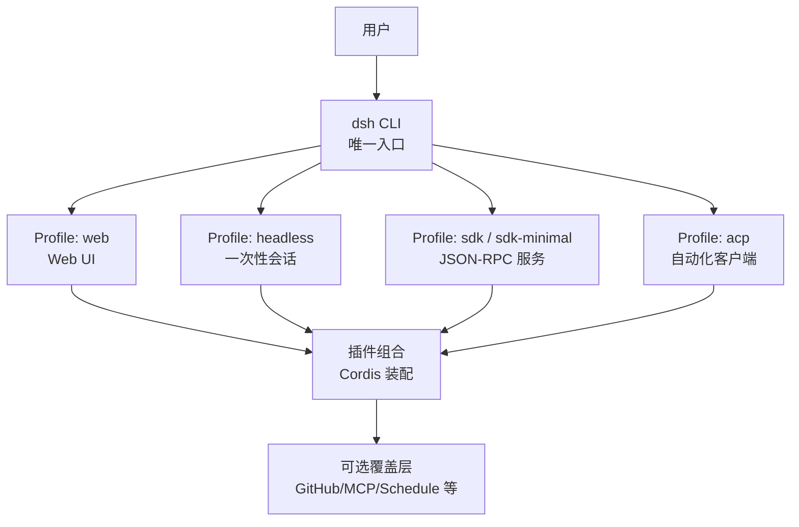
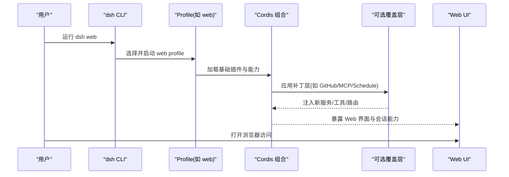
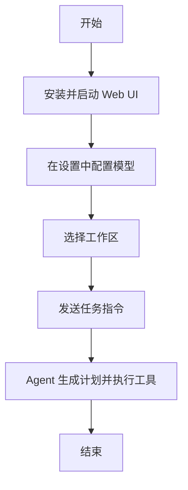
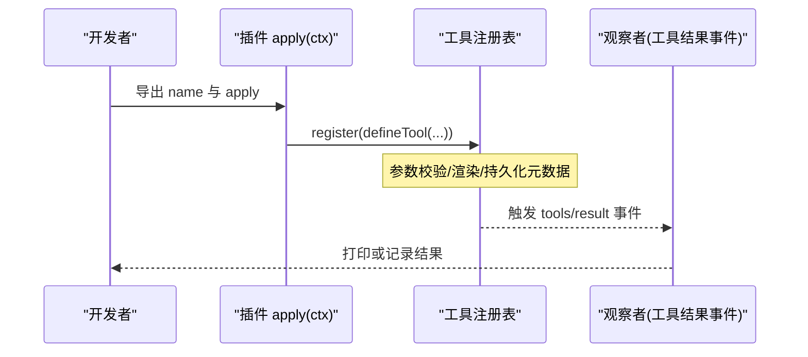
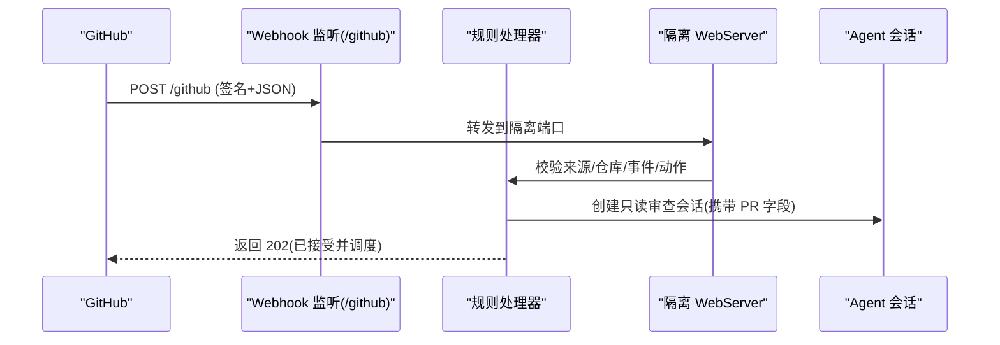
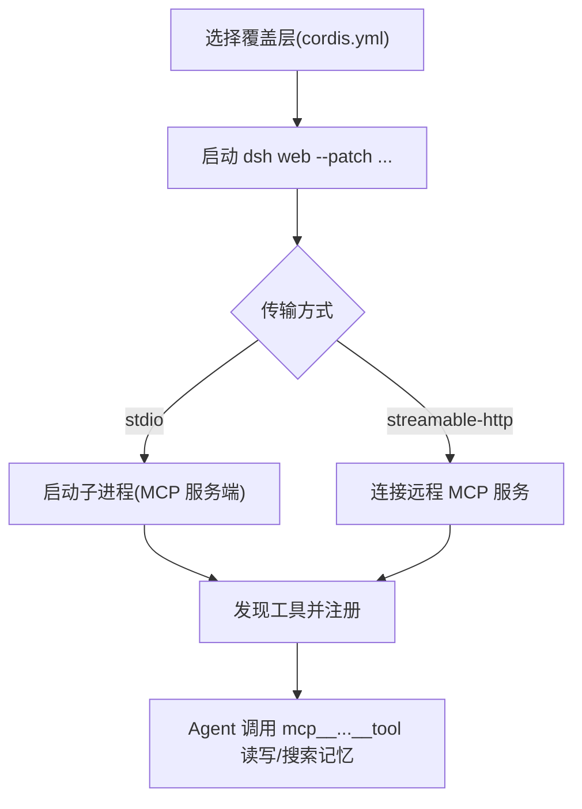
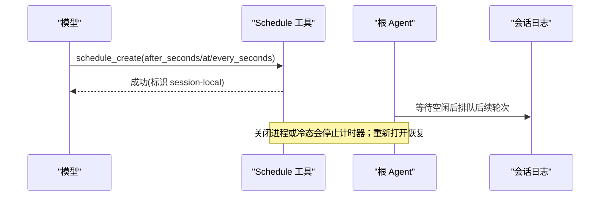
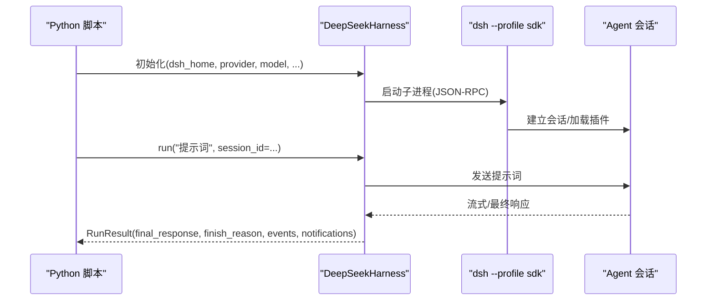
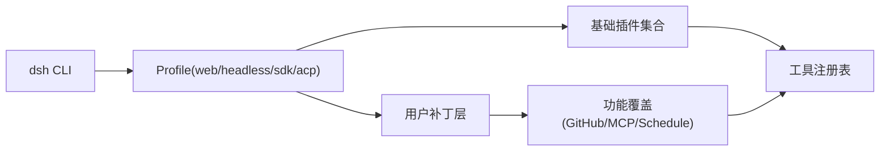

# 示例和教程

<cite>
**本文引用的文件**
- [README.md](file://README.md)
- [apps/cli/README.md](file://apps/cli/README.md)
- [docs/user/guide/index.md](file://docs/user/guide/index.md)
- [docs/user/guide/providers.md](file://docs/user/guide/providers.md)
- [docs/user/guide/github-review.md](file://docs/user/guide/github-review.md)
- [docs/user/guide/mcp-memory.md](file://docs/user/guide/mcp-memory.md)
- [docs/user/guide/schedule.md](file://docs/user/guide/schedule.md)
- [docs/cordis-tutorial/01-first-plugin.md](file://docs/cordis-tutorial/01-first-plugin.md)
- [docs/cordis-tutorial/07-into-the-harness.md](file://docs/cordis-tutorial/07-into-the-harness.md)
- [docs/cookbook/adding-a-tool.md](file://docs/cookbook/adding-a-tool.md)
- [python/sdk/README.md](file://python/sdk/README.md)
</cite>

## 目录
1. [简介](#简介)
2. [项目结构](#项目结构)
3. [核心组件](#核心组件)
4. [架构总览](#架构总览)
5. [详细组件分析](#详细组件分析)
6. [依赖关系分析](#依赖关系分析)
7. [性能注意事项](#性能注意事项)
8. [故障排除指南](#故障排除指南)
9. [结论](#结论)
10. [附录](#附录)

## 简介
本教程面向从零开始使用 DeepSeek Harness（dsh）的开发者与使用者，目标是帮助你：
- 快速安装并启动 Web UI，完成模型配置与工作区选择
- 创建你的第一个插件与工具，理解 Cordis 插件体系
- 通过实际场景示例掌握 GitHub 代码审查、MCP 记忆集成、定时任务调度等能力
- 学习最佳实践：代码组织、错误处理、性能优化
- 获取常见问题的排查思路与解决方案
- 规划后续学习路径与资源

## 项目结构
DeepSeek Harness 采用“一切皆插件”的架构，基于 Cordis 进行组合。CLI 是唯一的 Node 应用入口，Web UI、Headless、SDK、ACP 等模式均为 Profile 的不同装配方式。用户可通过 overlays（补丁层）启用可选能力，如 GitHub 审查、MCP 记忆、本地定时提醒等。

图表来源
- [apps/cli/README.md:7-47](file://apps/cli/README.md#L7-L47)
- [apps/cli/README.md:49-52](file://apps/cli/README.md#L49-L52)

章节来源
- [README.md:17-41](file://README.md#L17-L41)
- [apps/cli/README.md:7-47](file://apps/cli/README.md#L7-L47)

## 核心组件
- dsh CLI：统一入口，解析命令与参数，加载所选 Profile 并转发参数
- Profile 系统：以包为单位的可插拔装配，支持 bundles 与 patch 层叠加
- Web UI：默认提供交互式会话、工作区管理、模型设置
- SDK：Python 子进程驱动 JSON-RPC，适合脚本化与自动化
- 插件与工具：通过 Cordis 注册服务、事件、工具，形成可扩展能力

章节来源
- [apps/cli/README.md:1-56](file://apps/cli/README.md#L1-L56)
- [python/sdk/README.md:1-73](file://python/sdk/README.md#L1-L73)

## 架构总览
下图展示了从 CLI 到 Web UI、插件组合与可选覆盖层的整体交互。

图表来源
- [apps/cli/README.md:7-47](file://apps/cli/README.md#L7-L47)
- [apps/cli/README.md:49-52](file://apps/cli/README.md#L49-L52)

## 详细组件分析

### 入门：从零创建第一个智能体
步骤概览：
- 安装并启动 Web UI
- 配置模型（API Key）
- 选择工作区
- 发送第一条指令，观察 Agent 的计划与行动

章节来源
- [README.md:17-41](file://README.md#L17-L41)
- [docs/user/guide/index.md:1-31](file://docs/user/guide/index.md#L1-L31)

### 插件与工具：编写你的第一个插件与工具
- 通过 Cordis 教程了解插件三种形态（函数、对象、类）
- 使用 defineTool 注册模型可调用的工具，声明参数与输出
- 通过事件观察工具调用结果

图表来源
- [docs/cordis-tutorial/01-first-plugin.md:1-96](file://docs/cordis-tutorial/01-first-plugin.md#L1-L96)
- [docs/cordis-tutorial/07-into-the-harness.md:1-108](file://docs/cordis-tutorial/07-into-the-harness.md#L1-L108)
- [docs/cookbook/adding-a-tool.md:1-102](file://docs/cookbook/adding-a-tool.md#L1-L102)

章节来源
- [docs/cordis-tutorial/01-first-plugin.md:1-96](file://docs/cordis-tutorial/01-first-plugin.md#L1-L96)
- [docs/cordis-tutorial/07-into-the-harness.md:1-108](file://docs/cordis-tutorial/07-into-the-harness.md#L1-L108)
- [docs/cookbook/adding-a-tool.md:1-102](file://docs/cookbook/adding-a-tool.md#L1-L102)

### 实战一：GitHub 代码审查（Webhook 驱动）
目标：当 PR 从草稿变为可审查时，自动在工作区下创建带标题的只读审查会话。

图表来源
- [docs/user/guide/github-review.md:1-103](file://docs/user/guide/github-review.md#L1-L103)

章节来源
- [docs/user/guide/github-review.md:1-103](file://docs/user/guide/github-review.md#L1-L103)

### 实战二：MCP 记忆集成（第三方记忆服务）
目标：通过 MCP 客户端连接第三方记忆服务器，将工具暴露为 mcp__<serverName>__<tool>，实现跨会话的记忆读写与检索。

图表来源
- [docs/user/guide/mcp-memory.md:1-102](file://docs/user/guide/mcp-memory.md#L1-L102)

章节来源
- [docs/user/guide/mcp-memory.md:1-102](file://docs/user/guide/mcp-memory.md#L1-L102)

### 实战三：定时任务调度（会话内提醒）
目标：启用会话级 Schedule，通过 schedule_create/list/delete 管理提醒；空闲时投递后续对话轮次。

图表来源
- [docs/user/guide/schedule.md:1-20](file://docs/user/guide/schedule.md#L1-L20)

章节来源
- [docs/user/guide/schedule.md:1-20](file://docs/user/guide/schedule.md#L1-L20)

### Python SDK 自动化：用 Python 驱动 dsh
- 通过 deepseek-harness-sdk 启动 dsh 的 SDK Profile，使用 JSON-RPC 与 Agent 交互
- 支持自定义 Profile、补丁层、Provider/Model 选择、超时与令牌限制
- 结果包含最终响应、结束原因、通知与事件

图表来源
- [python/sdk/README.md:1-73](file://python/sdk/README.md#L1-L73)

章节来源
- [python/sdk/README.md:1-73](file://python/sdk/README.md#L1-L73)

## 依赖关系分析
- CLI 仅负责入口与参数分发，具体行为由 Profile 决定
- Profile 通过 bundles 与 patch 层组合能力，支持热重载与多环境覆盖
- 可选覆盖层以最小侵入方式启用功能（GitHub/MCP/Schedule），不改变默认组成
- 工具与插件通过 Cordis 的服务与事件机制解耦，便于扩展与观测

图表来源
- [apps/cli/README.md:7-47](file://apps/cli/README.md#L7-L47)
- [apps/cli/README.md:49-52](file://apps/cli/README.md#L49-L52)

章节来源
- [apps/cli/README.md:7-47](file://apps/cli/README.md#L7-L47)

## 性能注意事项
- 工具执行应遵守契约：参数校验、返回值规范化、取消信号处理
- 长耗时任务优先走后台作业通道，避免阻塞前台调用
- 渲染与展示逻辑保持纯函数，避免 I/O 与随机性，确保回放一致性
- 合理设置模型输出上限与推理强度，控制 Token 消耗与延迟
- 对网络与外部服务调用增加超时与重试策略，提升鲁棒性

章节来源
- [docs/cookbook/adding-a-tool.md:40-66](file://docs/cookbook/adding-a-tool.md#L40-L66)

## 故障排除指南
- 无法启动或找不到命令：确认已通过 npm 或源码构建正确安装，并使用 dsh 子命令
- 模型不可用或请求被拒：检查 Provider 配置、API Key、兼容性与模型输入模态
- Webhook 未触发或无会话：确认端口、反向代理、事件订阅与密钥配置
- MCP 工具不可见或调用失败：等待异步发现完成，检查传输方式与环境变量
- 定时提醒未生效：确认时间格式与时区，注意进程关闭会停止计时器但不会删除记录

章节来源
- [README.md:17-41](file://README.md#L17-L41)
- [docs/user/guide/providers.md:124-133](file://docs/user/guide/providers.md#L124-L133)
- [docs/user/guide/github-review.md:40-73](file://docs/user/guide/github-review.md#L40-L73)
- [docs/user/guide/mcp-memory.md:74-83](file://docs/user/guide/mcp-memory.md#L74-L83)
- [docs/user/guide/schedule.md:11-19](file://docs/user/guide/schedule.md#L11-L19)

## 结论
通过本教程，你已了解如何：
- 使用 dsh 启动 Web UI 并完成基本配置
- 编写插件与工具，接入模型调用链
- 利用覆盖层快速启用 GitHub 审查、MCP 记忆与定时提醒
- 通过 Python SDK 进行自动化编排
建议结合官方文档与示例继续深入，逐步构建稳定、可维护的智能体应用。

## 附录
- 学习路径推荐
  - 先修：阅读 Cordis 教程，理解插件生命周期与服务注入
  - 进阶：阅读工具开发参考，掌握参数/输出/渲染/后台作业
  - 实战：按顺序尝试 GitHub 审查、MCP 记忆、定时提醒三个场景
  - 自动化：使用 Python SDK 编排端到端流程
- 资源链接
  - 项目首页与运行说明
  - CLI 模式与 Profile 参考
  - 用户指南（Web UI、模型配置、Python SDK）
  - 工具开发与最佳实践

章节来源
- [README.md:17-41](file://README.md#L17-L41)
- [apps/cli/README.md:7-47](file://apps/cli/README.md#L7-L47)
- [docs/user/guide/index.md:1-31](file://docs/user/guide/index.md#L1-L31)
- [docs/user/guide/providers.md:1-138](file://docs/user/guide/providers.md#L1-L138)
- [docs/user/guide/python-sdk.md](file://docs/user/guide/python-sdk.md)
- [docs/cordis-tutorial/01-first-plugin.md:1-96](file://docs/cordis-tutorial/01-first-plugin.md#L1-L96)
- [docs/cookbook/adding-a-tool.md:1-102](file://docs/cookbook/adding-a-tool.md#L1-L102)
- [python/sdk/README.md:1-73](file://python/sdk/README.md#L1-L73)