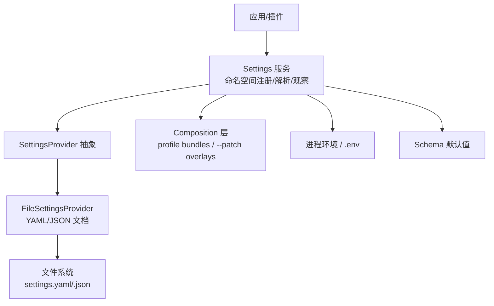
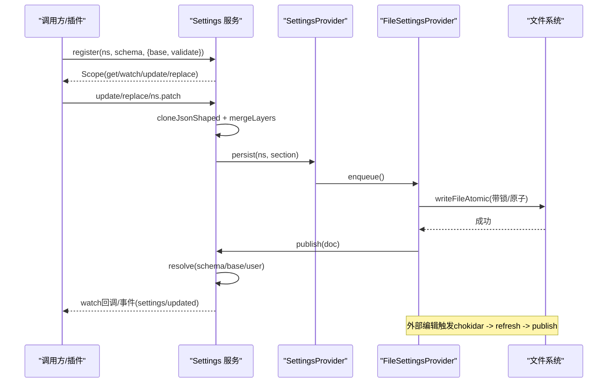
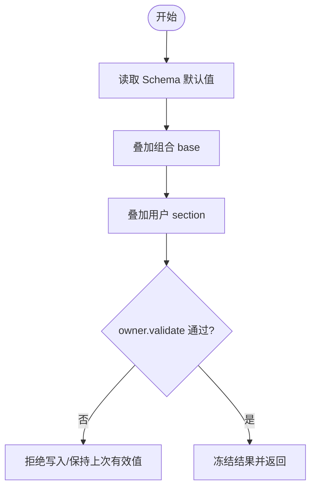
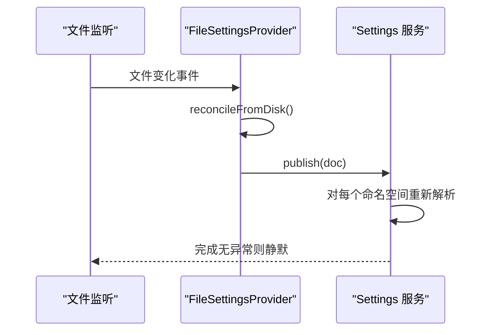
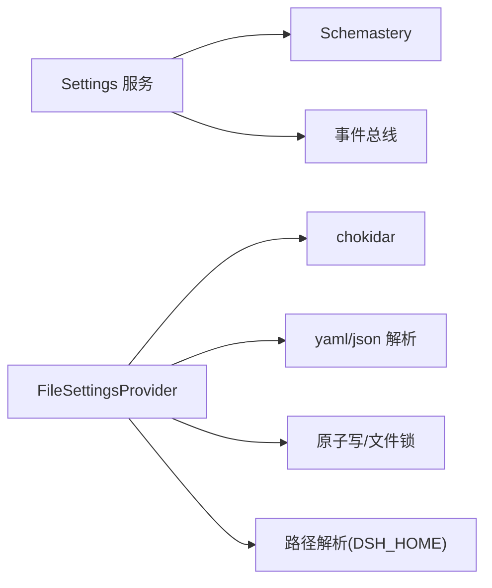

# 配置管理

<cite>
**本文引用的文件**
- [packages/settings/settings/src/index.ts](file://packages/settings/settings/src/index.ts)
- [packages/settings/settings-file/src/index.ts](file://packages/settings/settings-file/src/index.ts)
- [.agents/notes/implemented/architecture/2026-08-04-configuration-source-ownership.zh.md](file://.agents/notes/implemented/architecture/2026-08-04-configuration-source-ownership.zh.md)
- [scripts/verify-config-source-ownership.ts](file://scripts/verify-config-source-ownership.ts)
- [docs/config-catalog.md](file://docs/config-catalog.md)
- [docs/subsystems/settings.zh.md](file://docs/subsystems/settings.zh.md)
- [apps/cli/config/examples/cordis/cordis.yml](file://apps/cli/config/examples/cordis/cordis.yml)
- [packages/client/ui-settings/src/client/schema.ts](file://packages/client/ui-settings/src/client/schema.ts)
- [packages/client/ui-settings-models/src/client/store.ts](file://packages/client/ui-settings-models/src/client/store.ts)
- [packages/acp/acp/tests/mcp.spec.ts](file://packages/acp/acp/tests/mcp.spec.ts)
</cite>

## 目录
1. [简介](#简介)
2. [项目结构](#项目结构)
3. [核心组件](#核心组件)
4. [架构总览](#架构总览)
5. [详细组件分析](#详细组件分析)
6. [依赖关系分析](#依赖关系分析)
7. [性能考虑](#性能考虑)
8. [故障排查指南](#故障排查指南)
9. [结论](#结论)
10. [附录：模板与示例](#附录模板与示例)

## 简介
本文件系统性说明 DeepSeek Harness 的配置管理机制，覆盖配置层次、优先级规则、合并策略、验证与环境变量映射、动态更新与热重载实现原理，以及安全与最佳实践。目标是帮助部署方、插件作者与使用者正确理解并安全地管理全局、用户与项目级配置。

## 项目结构
DeepSeek Harness 的配置由“服务定义 + 提供者 + 文档存储”三部分构成：
- 服务定义（settings）：负责命名空间注册、值解析、变更观察、持久化接口抽象。
- 文件提供者（settings-file）：将用户设置落地为 YAML/JSON 文档，支持外部编辑的热重载。
- 组合与来源：通过 composition（profile bundles、patch overlays）、用户 settings.yaml、进程环境、.env 文件与 schema 默认值共同决定最终值。

图表来源
- [packages/settings/settings/src/index.ts:350-424](file://packages/settings/settings/src/index.ts#L350-L424)
- [packages/settings/settings-file/src/index.ts:104-182](file://packages/settings/settings-file/src/index.ts#L104-L182)

章节来源
- [packages/settings/settings/src/index.ts:350-424](file://packages/settings/settings/src/index.ts#L350-L424)
- [packages/settings/settings-file/src/index.ts:104-182](file://packages/settings/settings-file/src/index.ts#L104-L182)

## 核心组件
- Settings 服务（命名空间与合并）
  - 提供 register/describe/update/replace/mutate/watch 等能力。
  - 合并顺序：schema 默认值 → 组合 base → 用户 section。
  - 支持 owner 自定义 validate 进行跨字段校验。
- FileSettingsProvider（文件存储与热重载）
  - 支持 YAML/JSON 文档；默认路径在 harness home 下。
  - 使用 chokidar 监听文件变化，去抖后重新加载并发布。
  - 写入时采用原子写与文件锁，保证并发安全与注释保留。
- 配置来源与优先级
  - 非机密值统一顺序：本次运行显式 > 用户 settings > composition > 进程环境 > 发现的 .env > schema 默认值。
  - 凭据有独立更窄的顺序：进程环境 > $DSH_HOME/.credentials.yaml > 项目 .env > $DSH_HOME/.env。

章节来源
- [packages/settings/settings/src/index.ts:36-62](file://packages/settings/settings/src/index.ts#L36-L62)
- [packages/settings/settings/src/index.ts:696-710](file://packages/settings/settings/src/index.ts#L696-L710)
- [packages/settings/settings-file/src/index.ts:20-67](file://packages/settings/settings-file/src/index.ts#L20-L67)
- [.agents/notes/implemented/architecture/2026-08-04-configuration-source-ownership.zh.md:17-40](file://.agents/notes/implemented/architecture/2026-08-04-configuration-source-ownership.zh.md#L17-L40)

## 架构总览
下图展示从调用方到存储的完整链路，包括热重载与事件广播。

图表来源
- [packages/settings/settings/src/index.ts:534-648](file://packages/settings/settings/src/index.ts#L534-L648)
- [packages/settings/settings-file/src/index.ts:232-269](file://packages/settings/settings-file/src/index.ts#L232-L269)

## 详细组件分析

### 配置层级与合并机制
- 三层合并：schema 默认值 → 组合 base → 用户 section。
- 用户 section 来自 settings.yaml/.json 中对应 namespace 的键。
- describe 暴露 base 与 user 以便 UI 区分“继承自组合”和“用户覆盖”。

图表来源
- [packages/settings/settings/src/index.ts:696-710](file://packages/settings/settings/src/index.ts#L696-L710)
- [packages/settings/settings/src/index.ts:479-512](file://packages/settings/settings/src/index.ts#L479-L512)

章节来源
- [packages/settings/settings/src/index.ts:696-710](file://packages/settings/settings/src/index.ts#L696-L710)
- [packages/settings/settings/src/index.ts:479-512](file://packages/settings/settings/src/index.ts#L479-L512)

### 配置来源与优先级规则
- 非机密值统一顺序：
  - 本次运行显式（操作级覆盖/CLI 参数）
  - 用户 settings（settings.yaml）
  - composition（profile bundles、用户 patch layers、--patch overlays）
  - 本次启动的进程环境
  - 发现的 .env（项目根优先，其次 $DSH_HOME/.env）
  - 默认值（schema default、provider public default）
- 凭据独立顺序（更高优先级）：
  - 继承进程环境（只读且最高）
  - $DSH_HOME/.credentials.yaml（提供方管理，可写）
  - <invocation cwd>/.env
  - $DSH_HOME/.env

图表来源
- [.agents/notes/implemented/architecture/2026-08-04-configuration-source-ownership.zh.md:17-40](file://.agents/notes/implemented/architecture/2026-08-04-configuration-source-ownership.zh.md#L17-L40)

章节来源
- [.agents/notes/implemented/architecture/2026-08-04-configuration-source-ownership.zh.md:17-40](file://.agents/notes/implemented/architecture/2026-08-04-configuration-source-ownership.zh.md#L17-L40)

### 配置文件位置与格式
- 默认文档：harness home 下的 settings.yaml（或 .yml/.json）。
- 可通过 provider 配置指定 path 与 dshHome。
- 支持 YAML/JSON 两种格式，自动根据扩展名选择解析器。

章节来源
- [packages/settings/settings-file/src/index.ts:20-67](file://packages/settings/settings-file/src/index.ts#L20-L67)

### 动态配置更新与热重载
- 文件提供者使用 chokidar 监听文档变化，去抖后重新加载并发布。
- 首次初始化失败会“大声失败”，后续刷新失败仅警告并保留上次有效值。
- 写入采用原子写与文件锁，避免并发损坏；YAML 写入尽量保留注释与格式。

图表来源
- [packages/settings/settings-file/src/index.ts:232-269](file://packages/settings/settings-file/src/index.ts#L232-L269)
- [packages/settings/settings-file/src/index.ts:304-338](file://packages/settings/settings-file/src/index.ts#L304-L338)

章节来源
- [packages/settings/settings-file/src/index.ts:232-269](file://packages/settings/settings-file/src/index.ts#L232-L269)
- [packages/settings/settings-file/src/index.ts:304-338](file://packages/settings/settings-file/src/index.ts#L304-L338)

### 配置验证与环境变量映射
- 验证
  - Schema 验证：所有值经 schemastery 节点校验。
  - Owner 校验：register 时可传入 validate，用于表达 schema 无法表达的跨字段约束。
  - 客户端侧：UI 通过 rehydrate 的 schema 节点进行草稿验证。
- 环境变量映射
  - 非机密值按统一优先级链解析，确保部署层可覆盖运行时环境。
  - 凭据走独立通道，进程环境始终最高，避免被 settings/composition 覆盖。
  - 构建期检查禁止在 shipped 配置中以内联方式引用环境变量注入凭据或端点。

章节来源
- [packages/client/ui-settings/src/client/schema.ts:35-67](file://packages/client/ui-settings/src/client/schema.ts#L35-L67)
- [scripts/verify-config-source-ownership.ts:1-55](file://scripts/verify-config-source-ownership.ts#L1-L55)
- [.agents/notes/implemented/architecture/2026-08-04-configuration-source-ownership.zh.md:17-40](file://.agents/notes/implemented/architecture/2026-08-04-configuration-source-ownership.zh.md#L17-L40)

### 模型设置、工具配置与安全策略（概览）
- 模型设置
  - 通过 LLM 相关插件的配置项声明（如 provider/model、会话列表页大小、传输模式等），详见配置目录。
- 工具配置
  - 工具呈现模式、工作区指令加载、本地技能发现等由各自插件配置控制。
- 安全策略
  - 凭据来源与优先级严格限定；禁止在 shipped 配置中内联敏感环境变量。
  - 某些场景需显式信任项目（例如 web 信任主机白名单），以避免越权访问。

章节来源
- [docs/config-catalog.md:14-50](file://docs/config-catalog.md#L14-L50)
- [docs/config-catalog.md:56-80](file://docs/config-catalog.md#L56-L80)
- [docs/config-catalog.md:407-432](file://docs/config-catalog.md#L407-L432)
- [scripts/verify-config-source-ownership.ts:1-55](file://scripts/verify-config-source-ownership.ts#L1-L55)

### 配置模板与示例
- Cordis 补丁示例：演示如何通过 patch overlay 修改 bundle 中的配置（如端口、插入宿主 runner 与工具）。
- 建议将示例保存为 cordis.yml 片段，配合 --patch 使用。

章节来源
- [apps/cli/config/examples/cordis/cordis.yml:1-20](file://apps/cli/config/examples/cordis/cordis.yml#L1-L20)

## 依赖关系分析
- Settings 服务依赖：
  - Context/Service（Cordis 框架）
  - Schemastery（类型与校验）
  - 事件系统（settings/updated、settings/document-updated）
- FileSettingsProvider 依赖：
  - chokidar（文件监听）
  - yaml/json 解析器
  - 原子写与文件锁（并发安全）
  - 路径解析（harness home）

图表来源
- [packages/settings/settings/src/index.ts:1-18](file://packages/settings/settings/src/index.ts#L1-L18)
- [packages/settings/settings-file/src/index.ts:10-18](file://packages/settings/settings-file/src/index.ts#L10-L18)

章节来源
- [packages/settings/settings/src/index.ts:1-18](file://packages/settings/settings/src/index.ts#L1-L18)
- [packages/settings/settings-file/src/index.ts:10-18](file://packages/settings/settings-file/src/index.ts#L10-L18)

## 性能考虑
- 热重载去抖：默认 100ms，避免频繁重绘与重复解析。
- 串行队列：文件读写与刷新进入单一队列，防止并发竞争。
- 最小化差异：YAML 写入采用注释保留的增量 patch，减少磁盘 I/O 与格式破坏。
- 观察者序列化：watcher 回调按提交顺序串行执行，避免竞态导致的 UI 抖动。

章节来源
- [packages/settings/settings-file/src/index.ts:20-67](file://packages/settings/settings-file/src/index.ts#L20-L67)
- [packages/settings/settings-file/src/index.ts:192-208](file://packages/settings/settings-file/src/index.ts#L192-L208)
- [packages/settings/settings/src/index.ts:748-799](file://packages/settings/settings/src/index.ts#L748-L799)

## 故障排查指南
- 文档无效或不可读
  - 首次加载失败会“大声失败”；后续刷新失败仅警告并保留上次有效值。
  - 检查 YAML/JSON 语法错误与根节点是否为对象。
- 并发写入冲突
  - 多标签或多进程同时编辑同一文档可能引发冲突；使用 expectedRevision 检测并回退。
- 环境变量未生效
  - 确认是否命中了凭据独立顺序；非机密值顺序中 composition 高于进程环境，因此部署层可覆盖。
- 安全限制
  - 若 CI/容器需要覆盖 endpoint/密钥，请通过进程环境或 .credentials.yaml 注入。

章节来源
- [packages/settings/settings-file/src/index.ts:271-295](file://packages/settings/settings-file/src/index.ts#L271-L295)
- [packages/settings/settings-file/src/index.ts:304-338](file://packages/settings/settings-file/src/index.ts#L304-L338)
- [packages/settings/settings/src/index.ts:534-648](file://packages/settings/settings/src/index.ts#L534-L648)
- [.agents/notes/implemented/architecture/2026-08-04-configuration-source-ownership.zh.md:17-40](file://.agents/notes/implemented/architecture/2026-08-04-configuration-source-ownership.zh.md#L17-L40)

## 结论
DeepSeek Harness 的配置体系以“命名空间 + 分层合并 + 严格优先级”为核心，结合文件热重载与严格的凭据来源控制，既满足灵活定制，又保障安全性与稳定性。建议遵循以下原则：
- 将可复用的默认值放在 schema 默认值与组合 base 中。
- 将用户可改动的选项放入 settings.yaml 的对应 namespace。
- 将敏感信息通过进程环境或 .credentials.yaml 注入。
- 使用 --patch 与 profile bundles 做部署级覆盖，避免直接改动 shipped 配置。
- 利用 describe 与 UI 提供的 schema 校验能力，提前发现配置问题。

## 附录：模板与示例
- 基础 settings.yaml 结构
  - 顶层为命名空间段（kebab-case），每个段为一个对象。
  - 示例键名参考各插件配置目录（如 llm、tools、webserver 等）。
- Cordis 补丁示例
  - 通过 id 定位目标行并替换 config，或 insert 新条目。
- 安全建议
  - 不要在内联配置中直接引用环境变量注入凭据或端点。
  - 对外暴露的 API 网关应配置 trustedHosts，限制非环回访问。

章节来源
- [docs/config-catalog.md:14-50](file://docs/config-catalog.md#L14-L50)
- [apps/cli/config/examples/cordis/cordis.yml:1-20](file://apps/cli/config/examples/cordis/cordis.yml#L1-L20)
- [scripts/verify-config-source-ownership.ts:1-55](file://scripts/verify-config-source-ownership.ts#L1-L55)