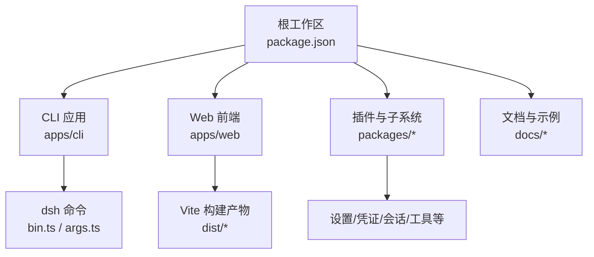
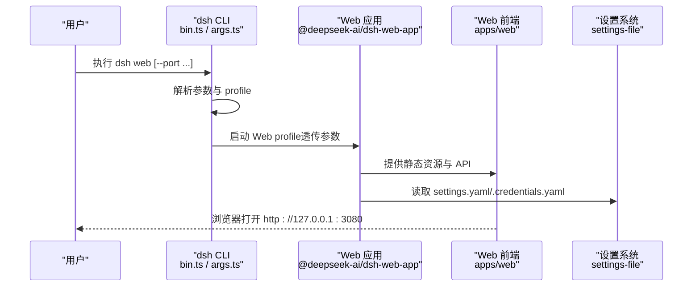
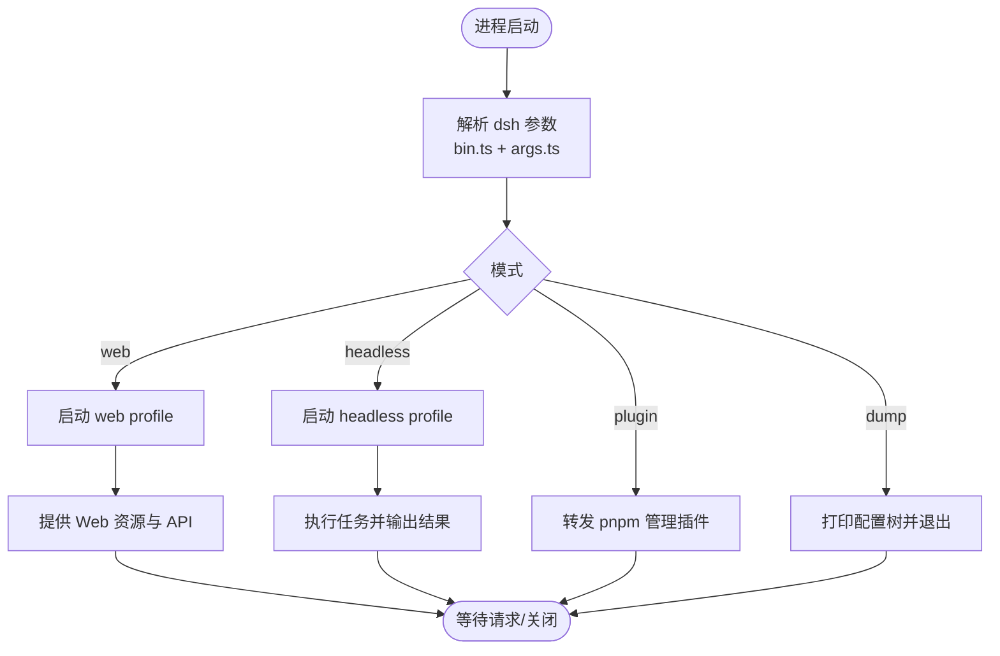
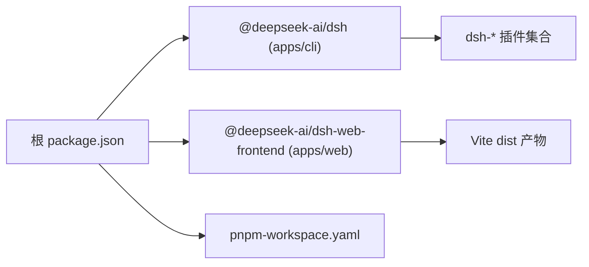

# 快速开始

<cite>
**本文引用的文件**
- [README.md](file://README.md)
- [package.json](file://package.json)
- [pnpm-workspace.yaml](file://pnpm-workspace.yaml)
- [apps/cli/package.json](file://apps/cli/package.json)
- [apps/web/package.json](file://apps/web/package.json)
- [apps/cli/src/bin.ts](file://apps/cli/src/bin.ts)
- [apps/cli/src/args.ts](file://apps/cli/src/args.ts)
- [apps/cli/README.md](file://apps/cli/README.md)
- [docs/user/guide/index.md](file://docs/user/guide/index.md)
- [docs/user/guide/providers.md](file://docs/user/guide/providers.md)
- [packages/settings/settings-file/src/index.ts](file://packages/settings/settings-file/src/index.ts)
- [packages/settings/settings/src/index.ts](file://packages/settings/settings/src/index.ts)
- [docs/config-catalog.md](file://docs/config-catalog.md)
</cite>

## 目录
1. [简介](#简介)
2. [项目结构](#项目结构)
3. [核心组件](#核心组件)
4. [架构总览](#架构总览)
5. [详细组件分析](#详细组件分析)
6. [依赖关系分析](#依赖关系分析)
7. [性能注意事项](#性能注意事项)
8. [故障排除指南](#故障排除指南)
9. [结论](#结论)
10. [附录](#附录)

## 简介
本指南面向首次接触 DeepSeek Harness（简称 dsh）的用户，目标是帮助你在最短时间内完成安装、配置并运行 Web 界面与无头模式，体验核心能力。你将学到：
- 从 npm 直接运行与从源码构建两种方式
- Node.js 环境要求与 pnpm 工作区配置要点
- 常用命令行用法（启动 Web 界面、无头模式等）
- 配置文件基本结构与常用选项
- 常见问题的定位与解决
- 验证安装成功的测试方法与基本使用示例

## 项目结构
仓库采用 monorepo 组织，根目录通过 pnpm workspace 管理多个子包与应用：
- apps/cli：提供 dsh 命令入口与 CLI 行为
- apps/web：Web 前端构建产物，由 dsh web 服务
- packages/*：插件化子系统（LLM、会话、工具、设置、存储等）
- docs：用户与开发者文档、配置目录、子系统说明
- native/python：原生与 Python SDK 相关资源

图表来源
- [package.json:1-18](file://package.json#L1-L18)
- [pnpm-workspace.yaml:1-17](file://pnpm-workspace.yaml#L1-L17)
- [apps/cli/package.json:14-16](file://apps/cli/package.json#L14-L16)
- [apps/web/package.json:1-29](file://apps/web/package.json#L1-L29)

章节来源
- [package.json:1-18](file://package.json#L1-L18)
- [pnpm-workspace.yaml:1-17](file://pnpm-workspace.yaml#L1-L17)

## 核心组件
- dsh CLI：统一入口，负责解析参数、选择 profile（如 web、headless）、将剩余参数透传给具体应用插件。
- Web 前端：基于 Vite 构建的客户端，由 dsh web 启动并托管静态资源。
- 设置系统：支持 YAML/JSON 持久化，热重载，集中管理模型、凭据等配置。
- 插件体系：以 Cordis 为基础，profile 是“插件层”的组合，可叠加 patch 覆盖默认行为。

章节来源
- [apps/cli/src/bin.ts:1-51](file://apps/cli/src/bin.ts#L1-L51)
- [apps/cli/src/args.ts:1-192](file://apps/cli/src/args.ts#L1-L192)
- [apps/cli/README.md:1-56](file://apps/cli/README.md#L1-L56)
- [apps/web/package.json:1-29](file://apps/web/package.json#L1-L29)
- [packages/settings/settings-file/src/index.ts:32-67](file://packages/settings/settings-file/src/index.ts#L32-L67)

## 架构总览
下图展示了从命令行到 Web 界面的调用链路与关键组件交互。

图表来源
- [apps/cli/src/bin.ts:14-51](file://apps/cli/src/bin.ts#L14-L51)
- [apps/cli/src/args.ts:112-192](file://apps/cli/src/args.ts#L112-L192)
- [apps/web/package.json:1-29](file://apps/web/package.json#L1-L29)
- [packages/settings/settings-file/src/index.ts:55-67](file://packages/settings/settings-file/src/index.ts#L55-L67)

## 详细组件分析

### 安装与环境准备
- Node.js 版本要求：^22.19.0 或 >=24.0.0
- 包管理器：pnpm（工作区启用 linkWorkspacePackages）
- 工作区范围：vendor/*, packages/*/*, native/landlock-run, apps/*, website, python/sdk-runtime

两种安装方式：
- 从 npm 直接运行（无需本地构建）
  - 安装 Node.js 后执行：npx @deepseek-ai/dsh web
  - 默认在 http://127.0.0.1:3080 启动 Web UI，并尝试在默认浏览器中打开；SSH 场景仅打印 URL
  - 可通过 --no-open 禁用自动打开浏览器
- 从源码构建运行
  - git clone 仓库后进入目录
  - 执行 pnpm install 与 pnpm run build
  - 执行 pnpm dsh web 使用已构建产物运行

章节来源
- [README.md:17-41](file://README.md#L17-L41)
- [package.json:8-18](file://package.json#L8-L18)
- [pnpm-workspace.yaml:1-17](file://pnpm-workspace.yaml#L1-L17)

### 命令行使用
- 启动 Web 界面
  - 命令：dsh web
  - 说明：等价于 dsh --profile web；后续参数由 Web 应用解析
  - 常用参数：--port 指定端口；--host 受安全限制（不支持 0.0.0.0）
- 无头模式（headless）
  - 命令：dsh --profile headless "你的任务"
  - 说明：一次性运行任务，输出结果后退出
- 查看配置树
  - 命令：dsh --dump-config 或 dsh --dump-default-config
  - 说明：不启动应用，仅打印组合后的 profile 配置树（是否包含用户层与 patch 不同）
- 插件管理
  - 命令：dsh plugin --profile <name> <pnpm 参数>
  - 说明：在 profile 目录下转发 pnpm 操作，用于安装/移除 profile 插件

章节来源
- [apps/cli/README.md:7-47](file://apps/cli/README.md#L7-L47)
- [apps/cli/src/args.ts:63-103](file://apps/cli/src/args.ts#L63-L103)
- [apps/cli/src/args.ts:156-181](file://apps/cli/src/args.ts#L156-L181)
- [apps/cli/tests/built-bin.e2e.ts:346-374](file://apps/cli/tests/built-bin.e2e.ts#L346-L374)

### 配置文件与常用选项
- 设置文件位置与格式
  - 默认路径：<harness home>/settings.yaml（也支持 .yml 与 .json）
  - 支持热重载与去抖刷新
- 凭据文件
  - 默认路径：<harness home>/.credentials.yaml
  - 模型密钥等敏感信息存放于此，设置中仅保存引用
- 常用配置项（节选）
  - LLM 提供商与模型：在 Web 界面“设置 → 模型”中添加与选择
  - 自定义提供商：填写 Provider ID、baseURL、协议、凭据、模型列表
  - 图像输入能力：为模型声明 input: [text, image]
  - 兼容性开关：如 supportsDeveloperRole、maxTokensField 等
- 配置树与优先级
  - profile bundles → profile cordis.patch.yml → $DSH_HOME/cordis.patch.yml → --patch 覆盖
  - 使用 --dump-default-config 查看打包层，--dump-config 查看含用户层的完整树

章节来源
- [packages/settings/settings-file/src/index.ts:55-67](file://packages/settings/settings-file/src/index.ts#L55-L67)
- [docs/user/guide/providers.md:7-133](file://docs/user/guide/providers.md#L7-L133)
- [apps/cli/README.md:33-47](file://apps/cli/README.md#L33-L47)
- [docs/config-catalog.md:1-12](file://docs/config-catalog.md#L1-L12)

### 启动流程与参数传递

图表来源
- [apps/cli/src/bin.ts:24-51](file://apps/cli/src/bin.ts#L24-L51)
- [apps/cli/src/args.ts:112-192](file://apps/cli/src/args.ts#L112-L192)

## 依赖关系分析
- 根 package.json 定义 workspaces 与脚本，scripts.dsh 指向 apps/cli 的 bin 入口
- apps/cli 暴露 dsh 命令，依赖大量 dsh-* 插件包（web、headless、sdk、acp 等）
- apps/web 构建前端产物，被 dsh web 服务托管
- pnpm-workspace.yaml 统一管理依赖与构建脚本白名单

图表来源
- [package.json:19-155](file://package.json#L19-L155)
- [apps/cli/package.json:26-97](file://apps/cli/package.json#L26-L97)
- [apps/web/package.json:24-30](file://apps/web/package.json#L24-L30)
- [pnpm-workspace.yaml:1-48](file://pnpm-workspace.yaml#L1-L48)

章节来源
- [package.json:19-155](file://package.json#L19-L155)
- [apps/cli/package.json:1-144](file://apps/cli/package.json#L1-L144)
- [apps/web/package.json:1-59](file://apps/web/package.json#L1-L59)
- [pnpm-workspace.yaml:1-79](file://pnpm-workspace.yaml#L1-L79)

## 性能注意事项
- 构建阶段：根脚本使用 tsx 与 tsdown 进行编译与打包，必要时调整内存上限（如 host 构建）
- Web 前端：Vite 构建产物按需加载，开发时可使用 dev/watch 模式提升迭代效率
- 设置热重载：settings-file 默认开启 watch，debounceMs 控制写事件合并间隔
- 并发与超时：shell/bash 工具支持超时与输出大小限制，避免长时间阻塞

章节来源
- [package.json:23-25](file://package.json#L23-L25)
- [apps/web/package.json:24-30](file://apps/web/package.json#L24-L30)
- [packages/settings/settings-file/src/index.ts:55-67](file://packages/settings/settings-file/src/index.ts#L55-L67)
- [docs/config-catalog.md:360-384](file://docs/config-catalog.md#L360-L384)

## 故障排除指南
- 无法访问远程主机（0.0.0.0）
  - 现象：绑定 0.0.0.0 被拒绝
  - 原因：安全策略禁止暴露到网络
  - 处理：使用 127.0.0.1 或通过 SSH/反向代理暴露
- 缺少凭据或模型未配置
  - 现象：MISSING_CREDENTIAL、UNKNOWN_MODEL
  - 处理：在“设置 → 模型”添加提供商与模型；或在 settings.yaml 中补充
- 自定义网关请求失败
  - 现象：网关拒绝请求
  - 处理：在 providers 配置 compat（如 supportsDeveloperRole、maxTokensField），或手动列出 models
- 图像输入被拒绝
  - 现象：发送图片时报错
  - 处理：为模型声明 input: [text, image]；或修改路由 defaultInput
- 配置未生效
  - 现象：修改 settings.yaml 后未更新
  - 处理：确认 settings-file 的 watch 与 debounceMs；重启 dsh 或重新发起请求

章节来源
- [apps/cli/tests/built-bin.e2e.ts:346-374](file://apps/cli/tests/built-bin.e2e.ts#L346-L374)
- [docs/user/guide/providers.md:124-133](file://docs/user/guide/providers.md#L124-L133)
- [packages/settings/settings-file/src/index.ts:55-67](file://packages/settings/settings-file/src/index.ts#L55-L67)

## 结论
通过以上步骤，你可以在几分钟内完成 DeepSeek Harness 的安装与运行，并使用 Web 界面或无头模式开展智能体任务。建议优先从 npm 直接运行体验核心功能，再根据需求切换到源码构建与自定义配置。遇到问题时，可参考故障排除部分快速定位。

## 附录

### 验证安装成功的基本方法
- 从 npm 运行
  - 执行 npx @deepseek-ai/dsh web
  - 检查是否在 http://127.0.0.1:3080 启动并可访问
- 从源码运行
  - 执行 pnpm install 与 pnpm run build
  - 执行 pnpm dsh web 并访问相同地址
- 无头模式验证
  - 执行 dsh --profile headless "你好"
  - 观察是否输出一次任务结果并退出

章节来源
- [README.md:17-41](file://README.md#L17-L41)
- [apps/cli/README.md:7-47](file://apps/cli/README.md#L7-L47)

### 常用命令速查
- dsh web：启动 Web 界面
- dsh --profile headless "任务"：无头模式执行任务
- dsh --dump-config：打印组合配置树
- dsh --dump-default-config：仅打印打包层配置
- dsh plugin --profile <name> add/remove/why <pkg>：管理 profile 插件

章节来源
- [apps/cli/README.md:7-47](file://apps/cli/README.md#L7-L47)
- [apps/cli/src/args.ts:63-103](file://apps/cli/src/args.ts#L63-L103)