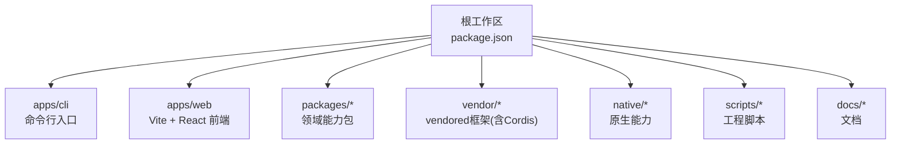
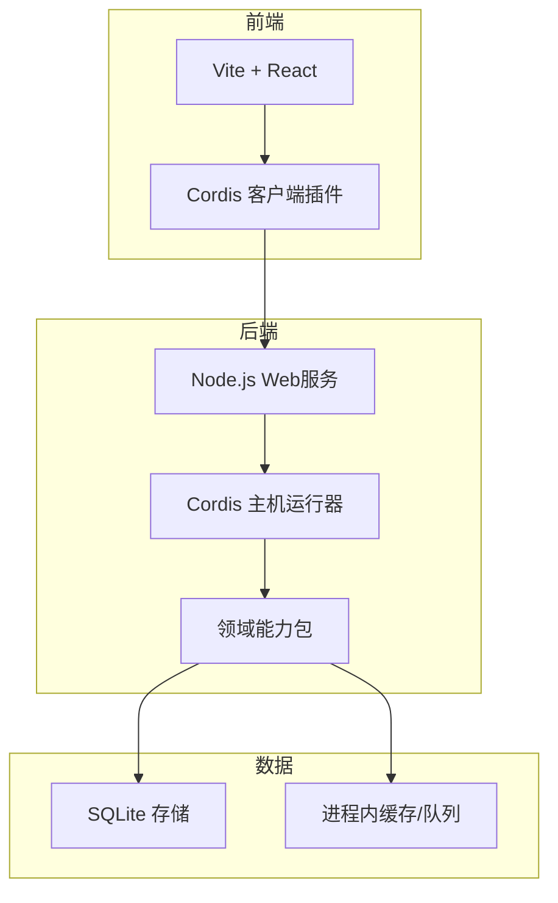
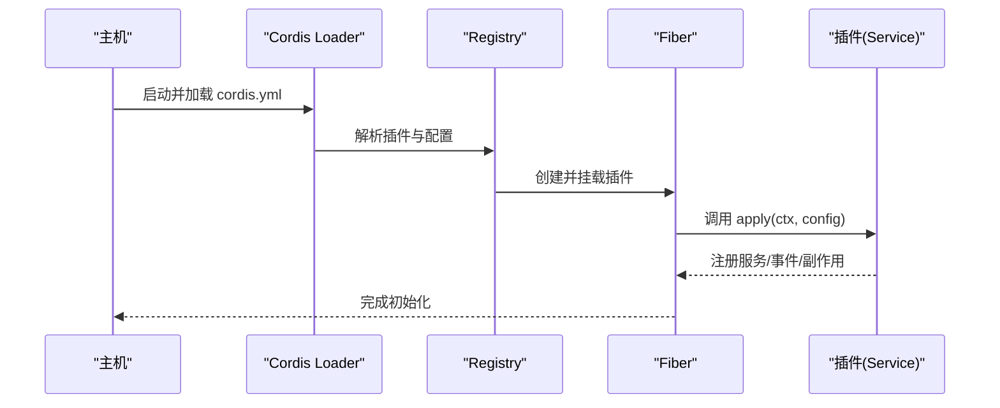
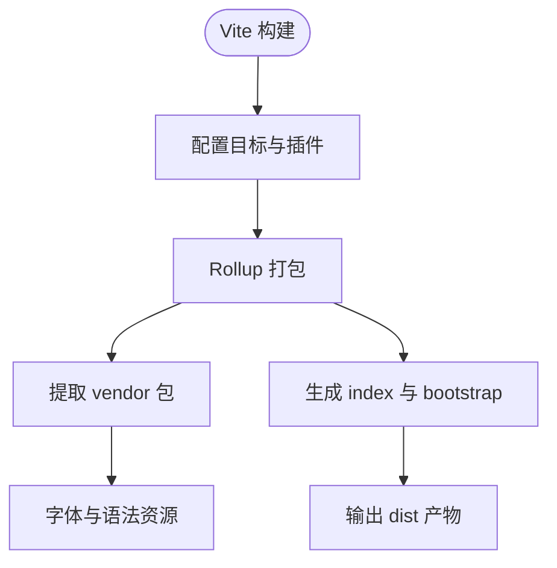
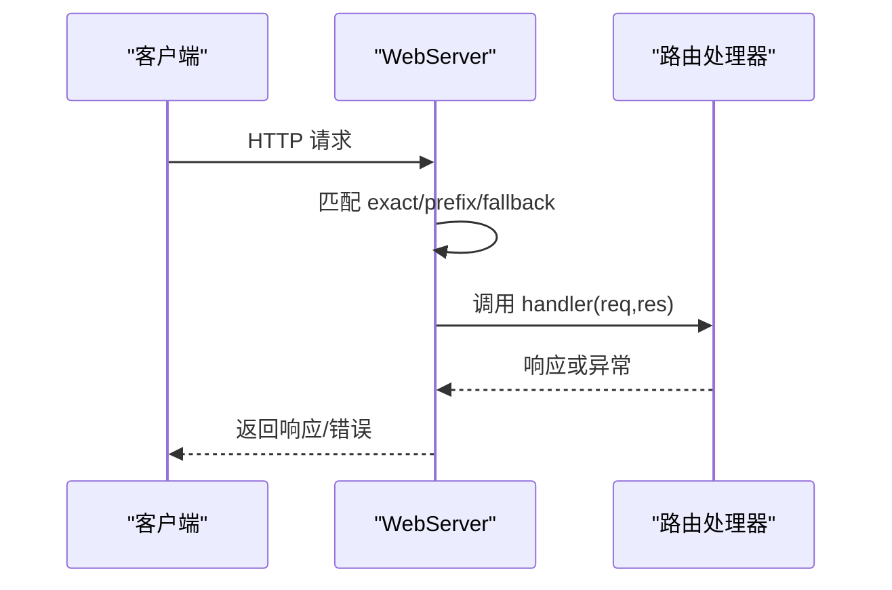
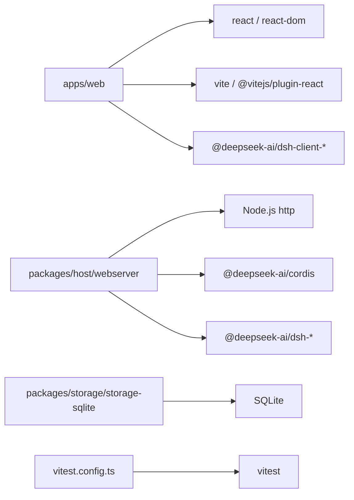

# 技术栈

<cite>
**本文引用的文件**
- [package.json](file://package.json)
- [pnpm-workspace.yaml](file://pnpm-workspace.yaml)
- [tsconfig.base.json](file://tsconfig.base.json)
- [vitest.config.ts](file://vitest.config.ts)
- [apps/web/vite.config.ts](file://apps/web/vite.config.ts)
- [apps/web/package.json](file://apps/web/package.json)
- [packages/storage/storage-sqlite/src/index.ts](file://packages/storage/storage-sqlite/src/index.ts)
- [packages/storage/storage-sqlite/package.json](file://packages/storage/storage-sqlite/package.json)
- [packages/host/webserver/src/index.ts](file://packages/host/webserver/src/index.ts)
- [docs/subsystems/web-server.zh.md](file://docs/subsystems/web-server.zh.md)
- [docs/cordis-primer.md](file://docs/cordis-primer.md)
- [scripts/rescope-vendor.ts](file://scripts/rescope-vendor.ts)
</cite>

## 目录
1. [简介](#简介)
2. [项目结构](#项目结构)
3. [核心组件](#核心组件)
4. [架构总览](#架构总览)
5. [详细组件分析](#详细组件分析)
6. [依赖关系分析](#依赖关系分析)
7. [性能考量](#性能考量)
8. [故障排查指南](#故障排查指南)
9. [结论](#结论)
10. [附录](#附录)

## 简介
本技术栈文档面向DeepSeek Harness，系统性梳理其核心技术选型与工程化体系：以TypeScript为核心语言、Cordis插件框架为扩展中枢、前端采用React+Vite、后端基于Node.js自研Web服务（非Express）、测试使用Vitest、构建与包管理采用pnpm工作区。同时说明数据库存储方案（SQLite）、消息队列/缓存策略（进程内队列与内存KV）、版本兼容与升级策略，并给出性能优化建议与替代方案评估。

## 项目结构
仓库采用Monorepo组织，根级通过pnpm工作区统一管理多个子包与应用：
- apps：产品应用入口（CLI、Web前端）
- packages：按领域拆分的可复用能力（会话、工具、存储、宿主Web服务等）
- vendor：vendored第三方框架（如Cordis、Cosmokit等），保持上游语义化版本范围
- native：原生能力（如Landlock安全沙箱）
- scripts：工程脚本（类型检查、代码质量、发布、生成目录等）
- docs：子系统与教程文档

**图表来源**
- [package.json:1-18](file://package.json#L1-L18)
- [pnpm-workspace.yaml:1-17](file://pnpm-workspace.yaml#L1-L17)

**章节来源**
- [package.json:1-18](file://package.json#L1-L18)
- [pnpm-workspace.yaml:1-17](file://pnpm-workspace.yaml#L1-L17)

## 核心组件
- TypeScript工程化与类型保障：统一目标ES2024、严格模式、路径映射、声明文件与增量编译，确保跨包类型一致与重构安全。
- Cordis插件框架：作为系统扩展中枢，提供上下文、服务注册、事件机制、生命周期管理与热更新支持。
- Web前端：React + Vite，配合自定义插件实现标题注入、预览页面生成、分包与资源路由优化。
- Web后端：基于Node.js http模块的自研Web服务，提供HTTP路由、压缩、WebSocket升级、静态SPA托管等能力。
- 存储：SQLite作为持久化后端，通过Cordis插件注册到存储中心，支持WAL/日志模式配置。
- 测试：Vitest多项目并行执行，覆盖单元、端到端、快照与Web压力测试，强制100%覆盖率门禁。
- 构建与包管理：pnpm工作区统一依赖解析与安装策略，严格的允许构建白名单与补丁机制。

**章节来源**
- [tsconfig.base.json:5-26](file://tsconfig.base.json#L5-L26)
- [docs/cordis-primer.md:7-13](file://docs/cordis-primer.md#L7-L13)
- [apps/web/vite.config.ts:140-199](file://apps/web/vite.config.ts#L140-L199)
- [packages/host/webserver/src/index.ts:124-315](file://packages/host/webserver/src/index.ts#L124-L315)
- [packages/storage/storage-sqlite/src/index.ts:18-48](file://packages/storage/storage-sqlite/src/index.ts#L18-L48)
- [vitest.config.ts:149-191](file://vitest.config.ts#L149-L191)
- [pnpm-workspace.yaml:19-48](file://pnpm-workspace.yaml#L19-L48)

## 架构总览
整体架构围绕“插件化”与“模块化”展开：
- 运行时由Cordis驱动，加载各功能插件（工具、UI、存储、调度等）。
- 前端通过Vite构建React应用，按需加载插件与语法高亮等资源。
- 后端提供HTTP/WebSocket服务，承载会话、工具调用、文件操作等能力。
- 数据层通过存储抽象接入SQLite；进程内队列用于任务编排与消息分发。

[此图为概念性架构图，不直接映射具体源码文件]

## 详细组件分析

### TypeScript与工程化
- 目标与模块：ES2024目标、esnext模块、bundler解析，启用strict、noUncheckedIndexedAccess、exactOptionalPropertyTypes等严格选项，提升类型安全性。
- 路径映射：集中定义workspace内部包的别名，避免重复实例与路径歧义。
- 增量与声明：开启composite与declaration，便于跨包引用与IDE体验。

**章节来源**
- [tsconfig.base.json:5-26](file://tsconfig.base.json#L5-L26)
- [tsconfig.base.json:27-568](file://tsconfig.base.json#L27-L568)

### Cordis插件框架
- 核心理念：插件即Service，Context是服务仓库，通过inject声明依赖，事件通信，effect注册可撤销副作用。
- 工作流：Loader读取cordis.yml，解析插件与配置，Fiber管理生命周期，Registry负责加载与依赖注入。
- 开发体验：支持HMR、分组、计时器、控制台日志等插件生态。

**图表来源**
- [docs/cordis-primer.md:7-13](file://docs/cordis-primer.md#L7-L13)
- [scripts/rescope-vendor.ts:127-142](file://scripts/rescope-vendor.ts#L127-L142)

**章节来源**
- [docs/cordis-primer.md:7-13](file://docs/cordis-primer.md#L7-L13)
- [scripts/rescope-vendor.ts:127-142](file://scripts/rescope-vendor.ts#L127-L142)

### 前端技术栈（React + Vite）
- 构建目标：es2022，启用sourcemap，分离vendor与index，按需加载语法高亮与字体资源。
- 插件定制：动态注入HTML标题、阻止独立serve、生成preview页面、手动分包控制。
- 依赖去重：dedupe react/react-dom，避免多实例导致的状态不一致。

**图表来源**
- [apps/web/vite.config.ts:140-199](file://apps/web/vite.config.ts#L140-L199)

**章节来源**
- [apps/web/vite.config.ts:140-199](file://apps/web/vite.config.ts#L140-L199)
- [apps/web/package.json:32-57](file://apps/web/package.json#L32-L57)

### 后端技术栈（Node.js Web服务）
- 自研Web服务：基于Node.js http模块，提供路由匹配、Gzip压缩、WebSocket升级、静态SPA托管。
- 配置项：host/port/compression级别与阈值，监听失败将拒绝fiber初始化。
- 错误处理：请求处理异常捕获并返回400，避免进程崩溃。

**图表来源**
- [packages/host/webserver/src/index.ts:219-315](file://packages/host/webserver/src/index.ts#L219-L315)
- [docs/subsystems/web-server.zh.md:27-51](file://docs/subsystems/web-server.zh.md#L27-L51)

**章节来源**
- [packages/host/webserver/src/index.ts:124-315](file://packages/host/webserver/src/index.ts#L124-L315)
- [docs/subsystems/web-server.zh.md:27-51](file://docs/subsystems/web-server.zh.md#L27-L51)

### 数据库存储方案（SQLite）
- 插件化存储后端：通过Cordis插件注册sqlite后端到存储中心，支持路径与journal_mode配置。
- 事务与关闭：在effect中注册与注销后端，确保生命周期可控。
- 适用场景：本地磁盘WAL模式高效读写；网络文件系统可选择回滚日志模式。

**章节来源**
- [packages/storage/storage-sqlite/src/index.ts:18-48](file://packages/storage/storage-sqlite/src/index.ts#L18-L48)
- [packages/storage/storage-sqlite/src/index.ts:135-168](file://packages/storage/storage-sqlite/src/index.ts#L135-L168)
- [packages/storage/storage-sqlite/package.json:34-46](file://packages/storage/storage-sqlite/package.json#L34-L46)

### 消息队列与缓存策略
- 进程内队列：团队消息分发通过序列化队列保证同一目标顺序执行，避免并发冲突。
- 内存缓存：会话状态、工具结果、UI插槽等大量使用内存对象与弱引用，减少I/O开销。
- 设计权衡：队列积压可能增加延迟，需结合批处理与背压策略。

**章节来源**
- [packages/experimental/agent-team/src/mailbox.ts:154-224](file://packages/experimental/agent-team/src/mailbox.ts#L154-L224)

### 测试框架（Vitest）
- 多项目隔离：thread-safe与process-bound两类项目，分别控制池化与包含套件。
- 覆盖率门禁：v8提供者，100%语句/分支/函数/行覆盖率，按文件粒度校验。
- 平台适配：Windows与Linux差异化的排除与豁免策略，pwsh可用性检测。

**章节来源**
- [vitest.config.ts:149-191](file://vitest.config.ts#L149-L191)
- [vitest.config.ts:192-362](file://vitest.config.ts#L192-L362)

### 构建工具与包管理（pnpm工作区）
- 工作区：统一vendor、packages、apps、website等子目录，linkWorkspacePackages确保本地包优先。
- 依赖策略：peerDependencyRules限制TS版本范围，allowBuilds白名单控制危险构建脚本。
- 补丁：对node-pty进行补丁修复，保证跨平台一致性。

**章节来源**
- [pnpm-workspace.yaml:1-17](file://pnpm-workspace.yaml#L1-L17)
- [pnpm-workspace.yaml:19-48](file://pnpm-workspace.yaml#L19-L48)
- [pnpm-workspace.yaml:77-79](file://pnpm-workspace.yaml#L77-L79)

## 依赖关系分析
- 前端依赖：React、Vite、@vitejs/plugin-react，以及内部client-*与ui-*包。
- 后端依赖：Node.js http模块、Cordis、领域能力包（session、tools、storage等）。
- 存储依赖：SQLite后端插件与存储抽象接口。
- 测试依赖：Vitest、Playwright（Web E2E）、JSDOM（DOM环境）。

**图表来源**
- [apps/web/package.json:32-57](file://apps/web/package.json#L32-L57)
- [packages/host/webserver/src/index.ts:124-315](file://packages/host/webserver/src/index.ts#L124-L315)
- [packages/storage/storage-sqlite/package.json:34-46](file://packages/storage/storage-sqlite/package.json#L34-L46)
- [vitest.config.ts:149-191](file://vitest.config.ts#L149-L191)

**章节来源**
- [apps/web/package.json:32-57](file://apps/web/package.json#L32-L57)
- [packages/host/webserver/src/index.ts:124-315](file://packages/host/webserver/src/index.ts#L124-L315)
- [packages/storage/storage-sqlite/package.json:34-46](file://packages/storage/storage-sqlite/package.json#L34-L46)
- [vitest.config.ts:149-191](file://vitest.config.ts#L149-L191)

## 性能考量
- 前端分包：将重型渲染依赖（math、highlight、markdown）抽离至vendor chunk，减少首屏体积与重新哈希频率。
- 资源路由：字体与语法高亮按需加载，避免阻塞主线程。
- 后端压缩：可选gzip压缩，设置合理阈值与级别，平衡CPU与带宽。
- 存储模式：本地磁盘使用WAL提升并发写入性能；网络文件系统切换回滚日志模式。
- 测试并行：Vitest分项目与fork池化，缩短CI时间。

[本节为通用性能指导，无需特定文件来源]

## 故障排查指南
- 前端独立serve报错：禁止裸Vite serve，必须通过dsh web或安装后的命令启动，避免缺少引导清单。
- 后端监听失败：端口占用或权限问题将拒绝fiber初始化，检查host/port配置与防火墙。
- 覆盖率门禁失败：定位未覆盖文件与分支，补充测试用例或申请豁免。
- Windows平台跳过：部分bash相关套件在Windows不可用，遵循平台排除策略。

**章节来源**
- [apps/web/vite.config.ts:9-12](file://apps/web/vite.config.ts#L9-L12)
- [packages/host/webserver/src/index.ts:219-237](file://packages/host/webserver/src/index.ts#L219-L237)
- [vitest.config.ts:22-58](file://vitest.config.ts#L22-L58)
- [vitest.config.ts:344-362](file://vitest.config.ts#L344-L362)

## 结论
DeepSeek Harness以TypeScript与Cordis插件框架为核心，构建了高度可扩展的Agent平台。前端采用React+Vite实现高性能交互界面，后端基于Node.js自研Web服务提供稳定可靠的HTTP/WebSocket能力。存储层通过SQLite插件化接入，满足本地与云场景需求。工程化方面，pnpm工作区与Vitest保障了依赖一致性与高质量交付。建议在后续演进中持续优化前端分包策略、后端压缩参数与存储模式选择，并完善进程内队列的背压与监控能力。

[本节为总结性内容，无需特定文件来源]

## 附录
- 版本兼容与升级策略：
  - Node.js：限定^22.19.0 || >=24.0.0，确保新特性与稳定性。
  - TypeScript：通过peerDependencyRules限制>=5 <7，避免破坏性升级。
  - 依赖白名单：allowBuilds仅放行必要构建脚本，降低供应链风险。
  - 补丁机制：对关键依赖（如node-pty）进行补丁，保证跨平台行为一致。

**章节来源**
- [package.json:8-9](file://package.json#L8-L9)
- [pnpm-workspace.yaml:23-26](file://pnpm-workspace.yaml#L23-L26)
- [pnpm-workspace.yaml:27-48](file://pnpm-workspace.yaml#L27-L48)
- [pnpm-workspace.yaml:77-79](file://pnpm-workspace.yaml#L77-L79)