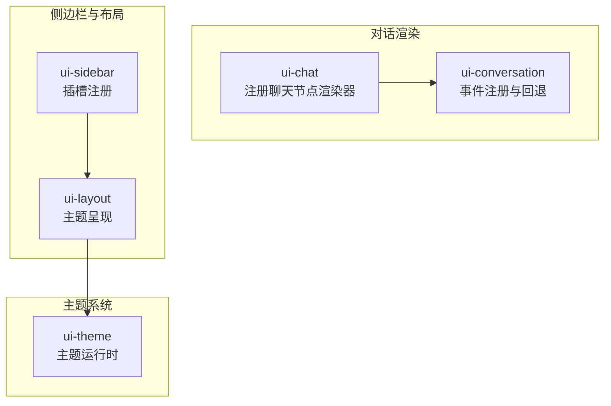
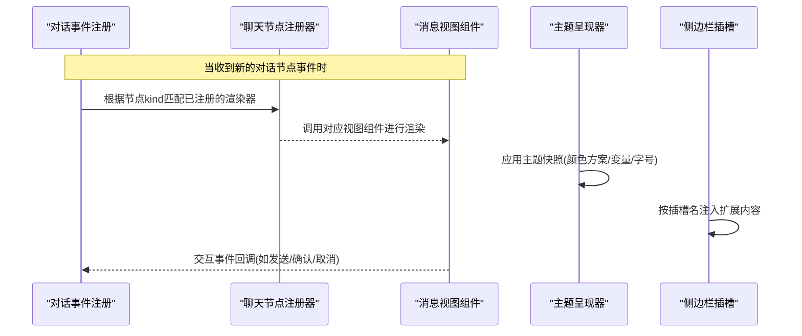
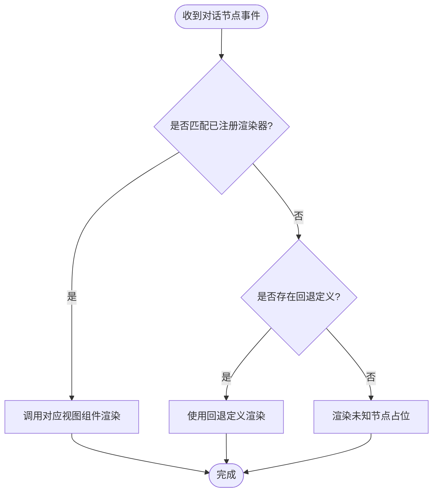
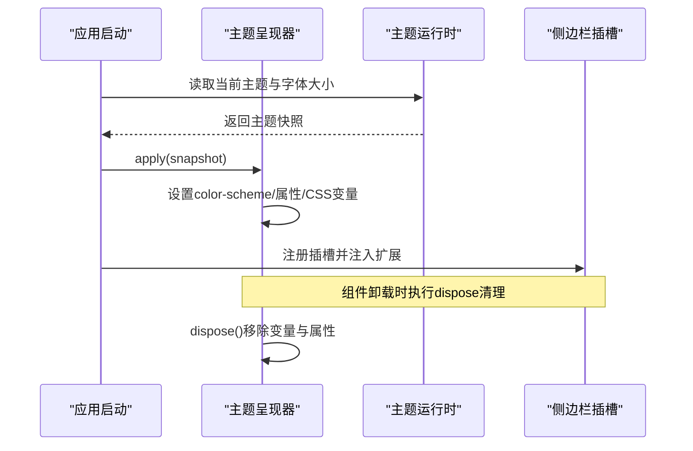
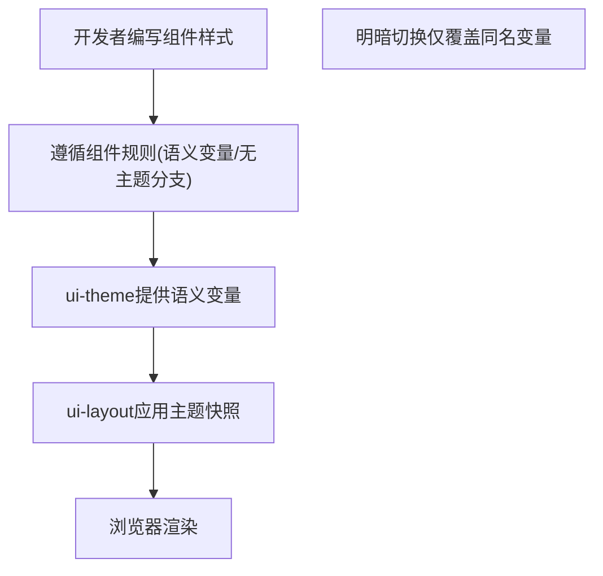
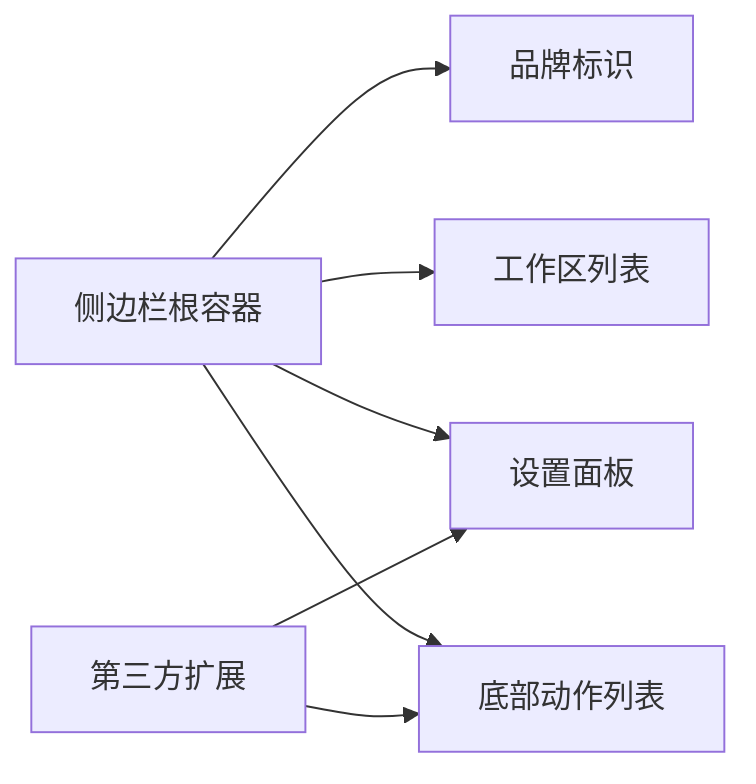
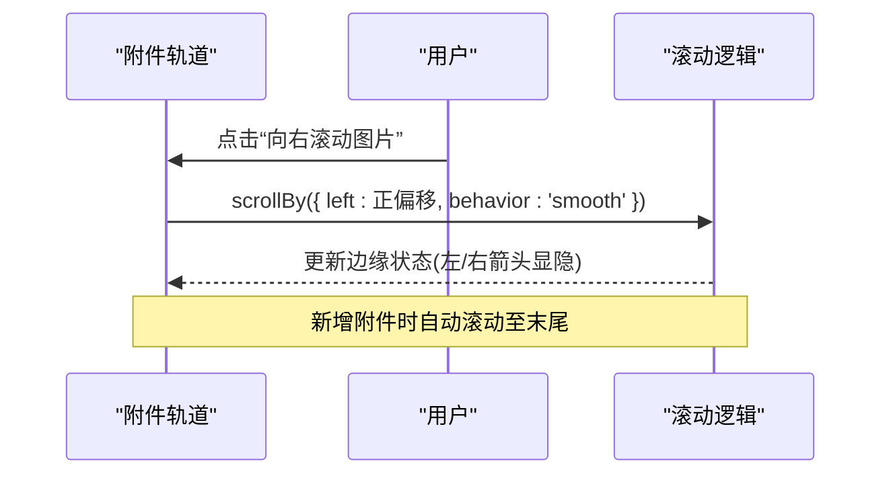
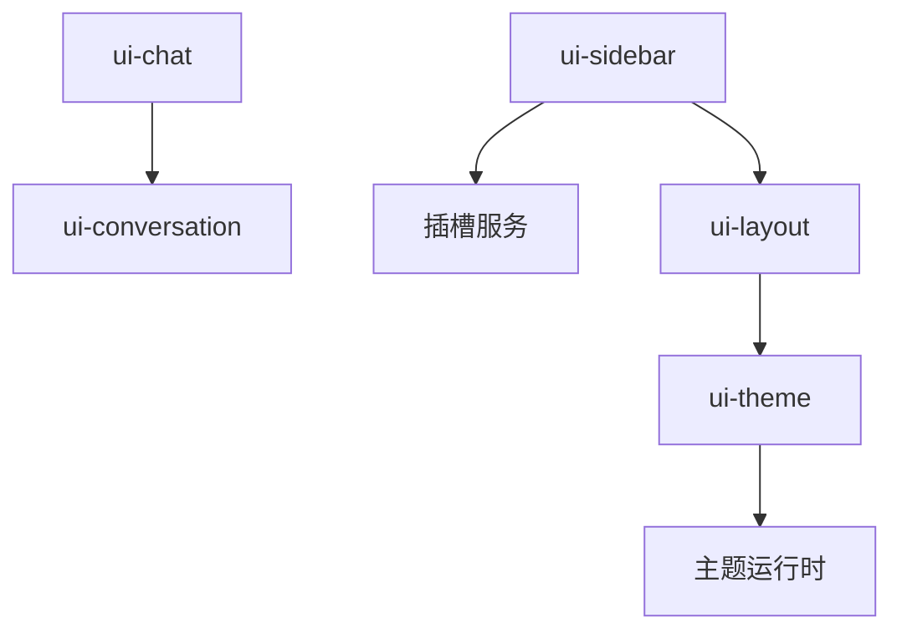

# UI扩展机制

<cite>
**本文引用的文件**
- [packages/client/ui-chat/src/client/chat/register-node-renderers.ts](file://packages/client/ui-chat/src/client/chat/register-node-renderers.ts)
- [packages/client/ui-chat/src/client/conversation-nodes/message.ts](file://packages/client/ui-chat/src/client/conversation-nodes/message.ts)
- [packages/client/ui-chat/src/client/conversation-nodes/tool.ts](file://packages/client/ui-chat/src/client/conversation-nodes/tool.ts)
- [packages/client/ui-conversation/src/client/conversation/event-registry.ts](file://packages/client/ui-conversation/src/client/conversation/event-registry.ts)
- [packages/client/ui-sidebar/src/client/index.ts](file://packages/client/ui-sidebar/src/client/index.ts)
- [packages/client/ui-layout/src/client/theme-presenter.ts](file://packages/client/ui-layout/src/client/theme-presenter.ts)
- [packages/client/ui-theme/src/client/index.ts](file://packages/client/ui-theme/src/client/index.ts)
- [docs/web-styling.md](file://docs/web-styling.md)
- [.agents/notes/implemented/process/2026-07-19-web-styling-system.md](file://.agents/notes/implemented/process/2026-07-19-web-styling-system.md)
- [apps/web/tests/trajectory-virtualization.e2e.ts](file://apps/web/tests/trajectory-virtualization.e2e.ts)
- [packages/client/ui-attachment/src/AttachmentRail.tsx](file://packages/client/ui-attachment/src/AttachmentRail.tsx)
</cite>

## 目录
1. [简介](#简介)
2. [项目结构](#项目结构)
3. [核心组件](#核心组件)
4. [架构总览](#架构总览)
5. [详细组件分析](#详细组件分析)
6. [依赖关系分析](#依赖关系分析)
7. [性能考虑](#性能考虑)
8. [故障排查指南](#故障排查指南)
9. [结论](#结论)
10. [附录](#附录)

## 简介
本文件面向DeepSeek Harness的Web UI扩展机制，聚焦以下目标：
- 对话节点注册机制：如何添加自定义消息渲染器与交互组件。
- UI组件生命周期管理：挂载、状态同步与销毁清理。
- 样式定制系统：主题切换、CSS变量注入与响应式支持。
- Web界面扩展点：侧边栏扩展、工具栏定制与对话框扩展。
- 可访问性（a11y）最佳实践。
- UI性能优化：虚拟滚动、懒加载与内存管理。

## 项目结构
围绕UI扩展的关键位置包括：
- 对话节点注册与事件分发：ui-chat与ui-conversation。
- 侧边栏插槽与布局：ui-sidebar与ui-layout。
- 主题系统与变量注入：ui-theme与ui-layout的主题呈现。
- 样式规范与约束：web-styling文档与内部实现约定。
- 性能相关：轨迹虚拟化测试与附件轨道滚动。

图表来源
- [packages/client/ui-chat/src/client/chat/register-node-renderers.ts:13-35](file://packages/client/ui-chat/src/client/chat/register-node-renderers.ts#L13-L35)
- [packages/client/ui-conversation/src/client/conversation/event-registry.ts:23-60](file://packages/client/ui-conversation/src/client/conversation/event-registry.ts#L23-L60)
- [packages/client/ui-sidebar/src/client/index.ts:33-67](file://packages/client/ui-sidebar/src/client/index.ts#L33-L67)
- [packages/client/ui-layout/src/client/theme-presenter.ts:32-68](file://packages/client/ui-layout/src/client/theme-presenter.ts#L32-L68)
- [packages/client/ui-theme/src/client/index.ts:147-169](file://packages/client/ui-theme/src/client/index.ts#L147-L169)

章节来源
- [packages/client/ui-chat/src/client/chat/register-node-renderers.ts:13-35](file://packages/client/ui-chat/src/client/chat/register-node-renderers.ts#L13-L35)
- [packages/client/ui-conversation/src/client/conversation/event-registry.ts:23-60](file://packages/client/ui-conversation/src/client/conversation/event-registry.ts#L23-L60)
- [packages/client/ui-sidebar/src/client/index.ts:33-67](file://packages/client/ui-sidebar/src/client/index.ts#L33-L67)
- [packages/client/ui-layout/src/client/theme-presenter.ts:32-68](file://packages/client/ui-layout/src/client/theme-presenter.ts#L32-L68)
- [packages/client/ui-theme/src/client/index.ts:147-169](file://packages/client/ui-theme/src/client/index.ts#L147-L169)

## 核心组件
- 对话节点注册器：通过插槽键将不同消息类型映射到对应视图组件，如用户消息、上下文、系统提示、助手步骤、命令等。
- 事件注册与回退：为未匹配的事件提供统一回退定义，确保未知节点仍可渲染。
- 侧边栏插槽：在根作用域注册品牌、工作区、设置与底部动作等插槽，供外部扩展注入内容。
- 主题呈现器：将主题快照应用到文档，设置颜色方案、字体大小轴与主题变量，并在销毁时清理。
- 主题运行时：维护主题注册表、偏好、字体大小与覆盖层，持续同步并对外暴露变更事件。

章节来源
- [packages/client/ui-chat/src/client/chat/register-node-renderers.ts:13-35](file://packages/client/ui-chat/src/client/chat/register-node-renderers.ts#L13-L35)
- [packages/client/ui-conversation/src/client/conversation/event-registry.ts:23-60](file://packages/client/ui-conversation/src/client/conversation/event-registry.ts#L23-L60)
- [packages/client/ui-sidebar/src/client/index.ts:33-67](file://packages/client/ui-sidebar/src/client/index.ts#L33-L67)
- [packages/client/ui-layout/src/client/theme-presenter.ts:32-68](file://packages/client/ui-layout/src/client/theme-presenter.ts#L32-L68)
- [packages/client/ui-theme/src/client/index.ts:147-169](file://packages/client/ui-theme/src/client/index.ts#L147-L169)

## 架构总览
下图展示从“会话事件”到“视图渲染”的主路径，以及主题与侧边栏插槽的协作关系。

图表来源
- [packages/client/ui-chat/src/client/chat/register-node-renderers.ts:13-35](file://packages/client/ui-chat/src/client/chat/register-node-renderers.ts#L13-L35)
- [packages/client/ui-conversation/src/client/conversation/event-registry.ts:23-60](file://packages/client/ui-conversation/src/client/conversation/event-registry.ts#L23-L60)
- [packages/client/ui-layout/src/client/theme-presenter.ts:32-68](file://packages/client/ui-layout/src/client/theme-presenter.ts#L32-L68)
- [packages/client/ui-sidebar/src/client/index.ts:33-67](file://packages/client/ui-sidebar/src/client/index.ts#L33-L67)

## 详细组件分析

### 对话节点注册机制
- 注册方式：通过插槽键将消息类型绑定到具体视图组件，例如用户消息、上下文、系统提示、助手步骤、命令、手动压缩等。
- 事件回退：当没有普通Definition匹配时，使用fallback Definition作为兜底渲染策略，避免未知节点导致崩溃。
- 消息类节点：针对用户、引导与注入上下文的统一注册入口，便于集中管理。
- 工具类节点：为工具调用及其嵌套子调用提供生命周期与贡献点。

图表来源
- [packages/client/ui-chat/src/client/chat/register-node-renderers.ts:13-35](file://packages/client/ui-chat/src/client/chat/register-node-renderers.ts#L13-L35)
- [packages/client/ui-conversation/src/client/conversation/event-registry.ts:23-60](file://packages/client/ui-conversation/src/client/conversation/event-registry.ts#L23-L60)
- [packages/client/ui-chat/src/client/conversation-nodes/message.ts:86-92](file://packages/client/ui-chat/src/client/conversation-nodes/message.ts#L86-L92)
- [packages/client/ui-chat/src/client/conversation-nodes/tool.ts:266-272](file://packages/client/ui-chat/src/client/conversation-nodes/tool.ts#L266-L272)

章节来源
- [packages/client/ui-chat/src/client/chat/register-node-renderers.ts:13-35](file://packages/client/ui-chat/src/client/chat/register-node-renderers.ts#L13-L35)
- [packages/client/ui-conversation/src/client/conversation/event-registry.ts:23-60](file://packages/client/ui-conversation/src/client/conversation/event-registry.ts#L23-L60)
- [packages/client/ui-chat/src/client/conversation-nodes/message.ts:86-92](file://packages/client/ui-chat/src/client/conversation-nodes/message.ts#L86-L92)
- [packages/client/ui-chat/src/client/conversation-nodes/tool.ts:266-272](file://packages/client/ui-chat/src/client/conversation-nodes/tool.ts#L266-L272)

### UI组件生命周期管理
- 挂载阶段：主题呈现器在挂载时将主题快照应用到文档，设置color-scheme、body属性与CSS变量，并更新元信息。
- 状态同步：主题运行时维护当前主题、字体大小与覆盖层，并通过事件持续同步；侧边栏插槽在挂载时注册并注入内容。
- 销毁清理：主题呈现器在销毁时移除所有由它设置的属性与变量，释放资源；插槽与效果在卸载时自动清理。

图表来源
- [packages/client/ui-layout/src/client/theme-presenter.ts:32-68](file://packages/client/ui-layout/src/client/theme-presenter.ts#L32-L68)
- [packages/client/ui-theme/src/client/index.ts:147-169](file://packages/client/ui-theme/src/client/index.ts#L147-L169)
- [packages/client/ui-sidebar/src/client/index.ts:33-67](file://packages/client/ui-sidebar/src/client/index.ts#L33-L67)

章节来源
- [packages/client/ui-layout/src/client/theme-presenter.ts:32-68](file://packages/client/ui-layout/src/client/theme-presenter.ts#L32-L68)
- [packages/client/ui-theme/src/client/index.ts:147-169](file://packages/client/ui-theme/src/client/index.ts#L147-L169)
- [packages/client/ui-sidebar/src/client/index.ts:33-67](file://packages/client/ui-sidebar/src/client/index.ts#L33-L67)

### 样式定制系统
- 主题所有权：ui-theme负责静态色板、语义别名、排版、动效、渐变、阴影与滚动条样式，以及明暗偏好；ui-layout负责将解析后的主题快照应用到文档。
- 组件规则：使用CSS Modules与clsx；仅消费语义别名；不在组件内写主题分支；保持键盘焦点可见性与减少动效行为。
- 明暗模式：通过data属性或全局选择器覆盖同一命名变量；组件不感知主题分支，仅在主题层做覆盖。
- 变量桥接：当组件确实需要局部变量时，组件定义本地变量，主题块仅覆盖该变量。

图表来源
- [docs/web-styling.md:1-26](file://docs/web-styling.md#L1-L26)
- [packages/client/ui-layout/src/client/theme-presenter.ts:32-68](file://packages/client/ui-layout/src/client/theme-presenter.ts#L32-L68)
- [.agents/notes/implemented/process/2026-07-19-web-styling-system.md:15-62](file://.agents/notes/implemented/process/2026-07-19-web-styling-system.md#L15-L62)

章节来源
- [docs/web-styling.md:1-26](file://docs/web-styling.md#L1-L26)
- [.agents/notes/implemented/process/2026-07-19-web-styling-system.md:15-62](file://.agents/notes/implemented/process/2026-07-19-web-styling-system.md#L15-L62)
- [packages/client/ui-layout/src/client/theme-presenter.ts:32-68](file://packages/client/ui-layout/src/client/theme-presenter.ts#L32-L68)

### Web界面扩展点
- 侧边栏扩展：通过sidebar插槽在根作用域注入品牌、工作区、设置与底部动作等区域，适合放置导航、快捷操作与配置面板。
- 工具栏定制：可在侧边栏底部动作列表追加按钮或菜单项，结合工作区导航触发新会话等操作。
- 对话框扩展：借助插槽机制在特定区域插入自定义对话框或面板，注意作用域与注入属性的传递。

图表来源
- [packages/client/ui-sidebar/src/client/index.ts:33-67](file://packages/client/ui-sidebar/src/client/index.ts#L33-L67)

章节来源
- [packages/client/ui-sidebar/src/client/index.ts:33-67](file://packages/client/ui-sidebar/src/client/index.ts#L33-L67)

### 复杂交互示例与第三方集成
- 附件轨道滚动：通过监听滚动几何变化显示边缘箭头，按视口分页平滑滚动，保证新增附件自动滚动到底部。
- 轨迹虚拟化：端到端测试验证长历史轨迹的虚拟滚动与分页加载，确保首屏快速与滚动锚点稳定。
- 第三方UI库集成：建议以插槽形式嵌入，避免破坏主题变量体系；通过CSS Modules隔离样式，必要时使用变量桥接。

图表来源
- [packages/client/ui-attachment/src/AttachmentRail.tsx:70-99](file://packages/client/ui-attachment/src/AttachmentRail.tsx#L70-L99)
- [apps/web/tests/trajectory-virtualization.e2e.ts:154-179](file://apps/web/tests/trajectory-virtualization.e2e.ts#L154-L179)

章节来源
- [packages/client/ui-attachment/src/AttachmentRail.tsx:70-99](file://packages/client/ui-attachment/src/AttachmentRail.tsx#L70-L99)
- [apps/web/tests/trajectory-virtualization.e2e.ts:154-179](file://apps/web/tests/trajectory-virtualization.e2e.ts#L154-L179)

## 依赖关系分析
- ui-chat依赖ui-conversation的事件注册能力，用于将消息类型映射到视图组件。
- ui-sidebar依赖slots与layout服务，注册侧边栏插槽并注入扩展内容。
- ui-layout依赖ui-theme提供的主题快照，负责将主题变量应用到文档。
- 主题运行时维护主题注册表、偏好与覆盖层，驱动ui-layout的呈现。

图表来源
- [packages/client/ui-chat/src/client/chat/register-node-renderers.ts:13-35](file://packages/client/ui-chat/src/client/chat/register-node-renderers.ts#L13-L35)
- [packages/client/ui-conversation/src/client/conversation/event-registry.ts:23-60](file://packages/client/ui-conversation/src/client/conversation/event-registry.ts#L23-L60)
- [packages/client/ui-sidebar/src/client/index.ts:33-67](file://packages/client/ui-sidebar/src/client/index.ts#L33-L67)
- [packages/client/ui-layout/src/client/theme-presenter.ts:32-68](file://packages/client/ui-layout/src/client/theme-presenter.ts#L32-L68)
- [packages/client/ui-theme/src/client/index.ts:147-169](file://packages/client/ui-theme/src/client/index.ts#L147-L169)

章节来源
- [packages/client/ui-chat/src/client/chat/register-node-renderers.ts:13-35](file://packages/client/ui-chat/src/client/chat/register-node-renderers.ts#L13-L35)
- [packages/client/ui-conversation/src/client/conversation/event-registry.ts:23-60](file://packages/client/ui-conversation/src/client/conversation/event-registry.ts#L23-L60)
- [packages/client/ui-sidebar/src/client/index.ts:33-67](file://packages/client/ui-sidebar/src/client/index.ts#L33-L67)
- [packages/client/ui-layout/src/client/theme-presenter.ts:32-68](file://packages/client/ui-layout/src/client/theme-presenter.ts#L32-L68)
- [packages/client/ui-theme/src/client/index.ts:147-169](file://packages/client/ui-theme/src/client/index.ts#L147-L169)

## 性能考虑
- 虚拟滚动：通过端到端测试验证轨迹虚拟化，确保长历史场景下的首屏加载与滚动稳定性。
- 懒加载：按需请求更早的历史页面，避免一次性加载全部数据。
- 内存管理：主题呈现器在销毁时清理所有变量与属性；附件轨道在新增时智能滚动，避免不必要的重排。
- 滚动体验：使用平滑滚动与边缘检测，提升交互流畅度。

章节来源
- [apps/web/tests/trajectory-virtualization.e2e.ts:154-179](file://apps/web/tests/trajectory-virtualization.e2e.ts#L154-L179)
- [packages/client/ui-layout/src/client/theme-presenter.ts:32-68](file://packages/client/ui-layout/src/client/theme-presenter.ts#L32-L68)
- [packages/client/ui-attachment/src/AttachmentRail.tsx:70-99](file://packages/client/ui-attachment/src/AttachmentRail.tsx#L70-L99)

## 故障排查指南
- 未知节点无法渲染：检查是否已注册对应节点的渲染器；若仍失败，确认是否设置了回退定义。
- 主题变量未生效：确认ui-layout是否正确应用主题快照；检查是否在组件中直接使用了未声明的变量。
- 侧边栏扩展未显示：确认插槽名称与作用域是否正确；检查注入函数是否被调用。
- 滚动异常：检查附件轨道的滚动几何计算与边缘状态更新逻辑。

章节来源
- [packages/client/ui-conversation/src/client/conversation/event-registry.ts:23-60](file://packages/client/ui-conversation/src/client/conversation/event-registry.ts#L23-L60)
- [packages/client/ui-layout/src/client/theme-presenter.ts:32-68](file://packages/client/ui-layout/src/client/theme-presenter.ts#L32-L68)
- [packages/client/ui-sidebar/src/client/index.ts:33-67](file://packages/client/ui-sidebar/src/client/index.ts#L33-L67)
- [packages/client/ui-attachment/src/AttachmentRail.tsx:70-99](file://packages/client/ui-attachment/src/AttachmentRail.tsx#L70-L99)

## 结论
DeepSeek Harness的UI扩展机制以插槽与事件注册为核心，配合主题系统与布局呈现，形成可扩展、可维护且高性能的Web界面生态。通过规范的样式约定与生命周期管理，开发者可以安全地注入自定义消息渲染器、交互组件与侧边栏扩展，同时保障无障碍与性能表现。

## 附录
- 可访问性（a11y）最佳实践：
  - 为交互元素提供语义化标签与可识别的名称。
  - 确保键盘可达与焦点可见，避免仅依赖鼠标交互。
  - 尊重系统减少动效偏好，禁用不必要的过渡动画。
  - 在附件轨道与滚动区域提供明确的ARIA角色与说明。
- 代码示例路径（不含具体代码）：
  - 自定义消息渲染器注册：[register-node-renderers.ts:13-35](file://packages/client/ui-chat/src/client/chat/register-node-renderers.ts#L13-L35)
  - 消息类节点注册入口：[message.ts:86-92](file://packages/client/ui-chat/src/client/conversation-nodes/message.ts#L86-L92)
  - 工具类节点生命周期：[tool.ts:266-272](file://packages/client/ui-chat/src/client/conversation-nodes/tool.ts#L266-L272)
  - 事件回退定义：[event-registry.ts:23-60](file://packages/client/ui-conversation/src/client/conversation/event-registry.ts#L23-L60)
  - 侧边栏插槽注册：[ui-sidebar index.ts:33-67](file://packages/client/ui-sidebar/src/client/index.ts#L33-L67)
  - 主题应用与清理：[theme-presenter.ts:32-68](file://packages/client/ui-layout/src/client/theme-presenter.ts#L32-68)
  - 主题运行时与覆盖层：[ui-theme index.ts:147-169](file://packages/client/ui-theme/src/client/index.ts#L147-169)
  - 样式规范参考：[web-styling.md:1-26](file://docs/web-styling.md#L1-L26)
  - 虚拟滚动验证：[trajectory-virtualization.e2e.ts:154-179](file://apps/web/tests/trajectory-virtualization.e2e.ts#L154-L179)
  - 附件轨道滚动：[AttachmentRail.tsx:70-99](file://packages/client/ui-attachment/src/AttachmentRail.tsx#L70-L99)