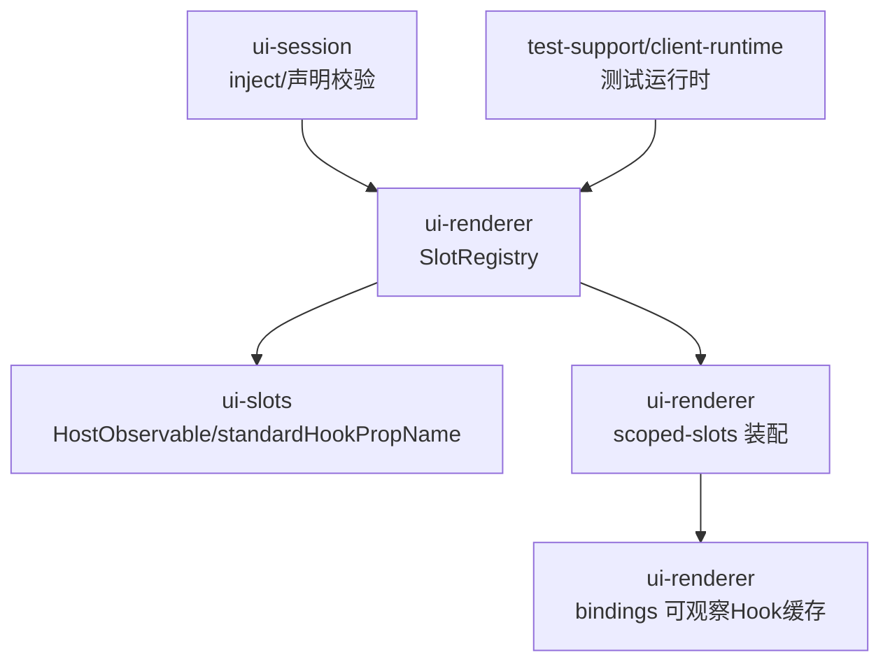
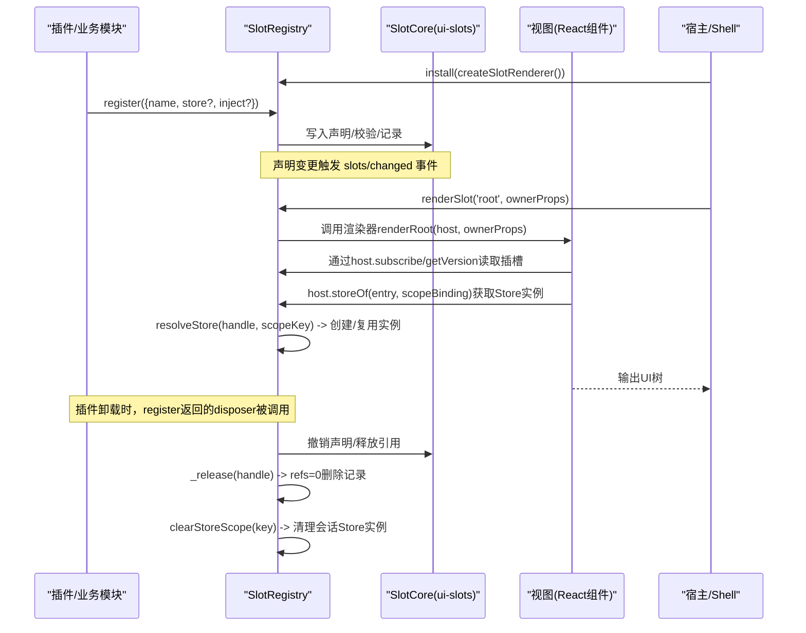
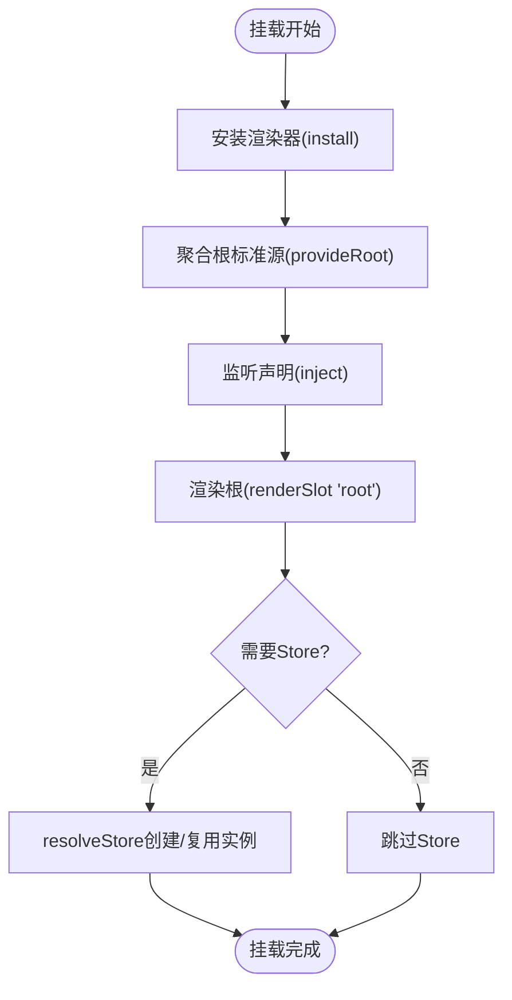
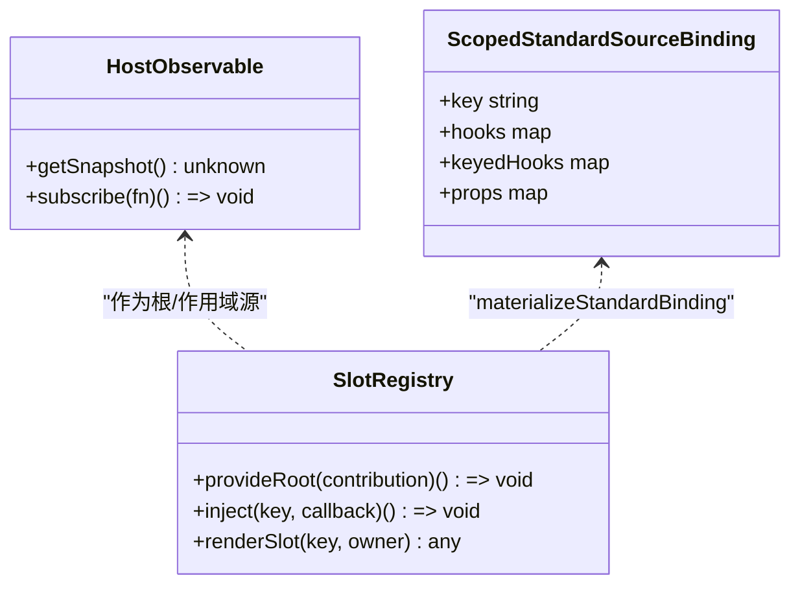
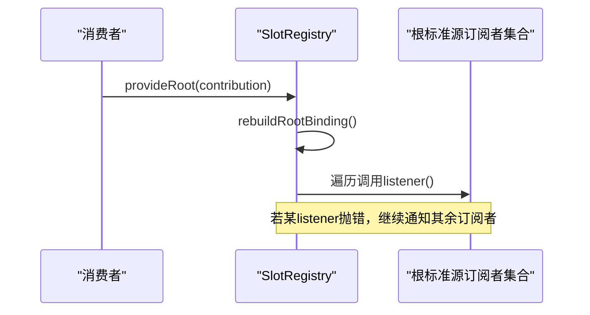
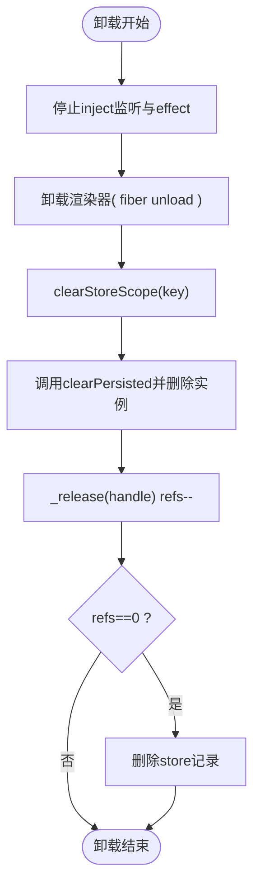
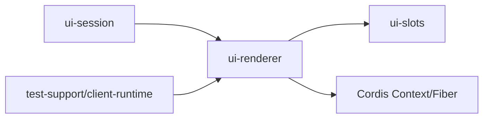

# UI组件生命周期管理

<cite>
**本文引用的文件**
- [packages/client/ui-renderer/src/client/registry.ts](file://packages/client/ui-renderer/src/client/registry.ts)
- [packages/client/ui-renderer/src/client/scoped-slots.tsx](file://packages/client/ui-renderer/src/client/scoped-slots.tsx)
- [packages/client/ui-renderer/src/client/bindings.tsx](file://packages/client/ui-renderer/src/client/bindings.tsx)
- [packages/client/ui-slots/src/renderer.ts](file://packages/client/ui-slots/src/renderer.ts)
- [packages/client/ui-session/src/client/index.ts](file://packages/client/ui-session/src/client/index.ts)
- [packages/test-support/client-runtime/src/index.ts](file://packages/test-support/client-runtime/src/index.ts)
- [packages/client/ui-renderer/tests/ui-renderer.client.spec.tsx](file://packages/client/ui-renderer/tests/ui-renderer.client.spec.tsx)
- [packages/client/ui-renderer/tests/registry.client.spec.ts](file://packages/client/ui-renderer/tests/registry.client.spec.ts)
</cite>

## 目录
1. [简介](#简介)
2. [项目结构](#项目结构)
3. [核心组件](#核心组件)
4. [架构总览](#架构总览)
5. [详细组件分析](#详细组件分析)
6. [依赖关系分析](#依赖关系分析)
7. [性能考量](#性能考量)
8. [故障排查指南](#故障排查指南)
9. [结论](#结论)
10. [附录](#附录)

## 简介
本文件面向DeepSeek Harness的UI组件生命周期管理，聚焦从创建到销毁的完整流程：挂载阶段的状态初始化与依赖注入、首次渲染过程；运行期的状态同步机制（响应式数据绑定、观察者模式）与性能优化策略；销毁阶段的资源清理（事件监听器移除、内存泄漏防护、异步操作取消）。文档同时提供自定义Hook、组件状态管理与复杂组件间通信的实践要点，并给出性能监控与调试工具的使用建议。

## 项目结构
围绕UI渲染与插槽系统的关键代码位于以下包中：
- ui-renderer：插槽注册表、渲染入口、作用域绑定与标准源装配
- ui-slots：可观察对象契约与标准Hook名称转换
- ui-session：会话级注入与声明校验
- test-support/client-runtime：测试运行时对插槽系统的安装与捕获

图表来源
- [packages/client/ui-renderer/src/client/registry.ts:95-136](file://packages/client/ui-renderer/src/client/registry.ts#L95-L136)
- [packages/client/ui-slots/src/renderer.ts:34-65](file://packages/client/ui-slots/src/renderer.ts#L34-L65)
- [packages/client/ui-renderer/src/client/scoped-slots.tsx:115-129](file://packages/client/ui-renderer/src/client/scoped-slots.tsx#L115-L129)
- [packages/client/ui-renderer/src/client/bindings.tsx:57-82](file://packages/client/ui-renderer/src/client/bindings.tsx#L57-L82)
- [packages/client/ui-session/src/client/index.ts:463-499](file://packages/client/ui-session/src/client/index.ts#L463-L499)
- [packages/test-support/client-runtime/src/index.ts:226-259](file://packages/test-support/client-runtime/src/index.ts#L226-L259)

章节来源
- [packages/client/ui-renderer/src/client/registry.ts:95-136](file://packages/client/ui-renderer/src/client/registry.ts#L95-L136)
- [packages/client/ui-slots/src/renderer.ts:34-65](file://packages/client/ui-slots/src/renderer.ts#L34-L65)
- [packages/client/ui-renderer/src/client/scoped-slots.tsx:115-129](file://packages/client/ui-renderer/src/client/scoped-slots.tsx#L115-L129)
- [packages/client/ui-renderer/src/client/bindings.tsx:57-82](file://packages/client/ui-renderer/src/client/bindings.tsx#L57-L82)
- [packages/client/ui-session/src/client/index.ts:463-499](file://packages/client/ui-session/src/client/index.ts#L463-L499)
- [packages/test-support/client-runtime/src/index.ts:226-259](file://packages/test-support/client-runtime/src/index.ts#L226-L259)

## 核心组件
- SlotRegistry（插槽注册表服务）
  - 负责插槽声明的生命周期、渲染安装、作用域适配、根标准源聚合、Store实例轴（按scope键控）以及错误上报。
  - 关键能力：install/renderSlot、provideRoot、inject、installScope、bindStoreScope、entries/snapshot/onEntryError等。
- scoped-slots（作用域装配）
  - 将标准源（hooks/keyedHooks/props）装配为稳定的React Hook或普通prop，支持可选/严格模式。
- bindings（可观察Hook绑定）
  - 基于WeakMap缓存selector Hook，避免重复订阅；提供maybeObservableHook以安全处理可选源。
- ui-slots renderer契约
  - HostObservable接口定义快照与订阅；standardHookPropName用于生成useXxx形式的Hook名。
- ui-session注入与声明校验
  - 统一声明标准成员，缺失或重复时抛出明确错误，确保注入完整性。
- test-support/client-runtime
  - 在测试环境中安装真实SlotRegistry与渲染器，捕获host以便断言。

章节来源
- [packages/client/ui-renderer/src/client/registry.ts:95-136](file://packages/client/ui-renderer/src/client/registry.ts#L95-L136)
- [packages/client/ui-renderer/src/client/scoped-slots.tsx:115-129](file://packages/client/ui-renderer/src/client/scoped-slots.tsx#L115-L129)
- [packages/client/ui-renderer/src/client/bindings.tsx:57-82](file://packages/client/ui-renderer/src/client/bindings.tsx#L57-L82)
- [packages/client/ui-slots/src/renderer.ts:34-65](file://packages/client/ui-slots/src/renderer.ts#L34-L65)
- [packages/client/ui-session/src/client/index.ts:463-499](file://packages/client/ui-session/src/client/index.ts#L463-L499)
- [packages/test-support/client-runtime/src/index.ts:226-259](file://packages/test-support/client-runtime/src/index.ts#L226-L259)

## 架构总览
下图展示了UI组件从“插件注册”到“渲染输出”，再到“卸载清理”的整体流程，以及Store实例的作用域生命周期。

图表来源
- [packages/client/ui-renderer/src/client/registry.ts:133-136](file://packages/client/ui-renderer/src/client/registry.ts#L133-L136)
- [packages/client/ui-renderer/src/client/registry.ts:172-234](file://packages/client/ui-renderer/src/client/registry.ts#L172-L234)
- [packages/client/ui-renderer/src/client/registry.ts:242-250](file://packages/client/ui-renderer/src/client/registry.ts#L242-L250)
- [packages/client/ui-renderer/src/client/registry.ts:345-359](file://packages/client/ui-renderer/src/client/registry.ts#L345-L359)
- [packages/client/ui-renderer/src/client/registry.ts:527-559](file://packages/client/ui-renderer/src/client/registry.ts#L527-L559)
- [packages/client/ui-renderer/src/client/registry.ts:562-581](file://packages/client/ui-renderer/src/client/registry.ts#L562-L581)

## 详细组件分析

### 组件挂载阶段：状态初始化与依赖注入
- 渲染安装
  - Shell调用install安装渲染器，仅允许一次安装；该安装通过ctx.effect管理生命周期，fiber卸载时自动恢复。
- 根标准源聚合
  - provideRoot收集各贡献者的hook/keyedHook/prop，去重后原子发布根绑定；变更会通知所有订阅者。
- 插槽注入与声明监听
  - inject(key, callback)在声明存在时立即执行，否则等待声明出现；回调内可返回单个或可迭代的清理函数，保证事务性设置与反向清理。
- Store实例轴
  - resolveStore根据handle与作用域键决定实例创建/复用；root作用域使用固定键，session作用域使用会话ID；scope死亡时clearStoreScope调用clearPersisted并清理实例。

图表来源
- [packages/client/ui-renderer/src/client/registry.ts:242-250](file://packages/client/ui-renderer/src/client/registry.ts#L242-L250)
- [packages/client/ui-renderer/src/client/registry.ts:275-292](file://packages/client/ui-renderer/src/client/registry.ts#L275-L292)
- [packages/client/ui-renderer/src/client/registry.ts:172-234](file://packages/client/ui-renderer/src/client/registry.ts#L172-L234)
- [packages/client/ui-renderer/src/client/registry.ts:345-359](file://packages/client/ui-renderer/src/client/registry.ts#L345-L359)
- [packages/client/ui-renderer/src/client/registry.ts:527-559](file://packages/client/ui-renderer/src/client/registry.ts#L527-L559)

章节来源
- [packages/client/ui-renderer/src/client/registry.ts:242-250](file://packages/client/ui-renderer/src/client/registry.ts#L242-L250)
- [packages/client/ui-renderer/src/client/registry.ts:275-292](file://packages/client/ui-renderer/src/client/registry.ts#L275-L292)
- [packages/client/ui-renderer/src/client/registry.ts:172-234](file://packages/client/ui-renderer/src/client/registry.ts#L172-L234)
- [packages/client/ui-renderer/src/client/registry.ts:345-359](file://packages/client/ui-renderer/src/client/registry.ts#L345-L359)
- [packages/client/ui-renderer/src/client/registry.ts:527-559](file://packages/client/ui-renderer/src/client/registry.ts#L527-L559)

### 首次渲染过程：标准源装配与Hook绑定
- 标准Hook命名
  - standardHookPropName将源名转换为useXxx形式，便于组件以Hook方式消费。
- 作用域装配
  - materializeStandardBinding将binding中的hooks/keyedHooks/props装配为稳定Hook或prop；可选模式下使用maybeObservableHook避免改变Hook调用顺序。
- 可观察Hook缓存
  - observableHook基于WeakMap缓存selector Hook，减少重复订阅；absentSource提供空实现以兼容缺省场景。

图表来源
- [packages/client/ui-slots/src/renderer.ts:34-65](file://packages/client/ui-slots/src/renderer.ts#L34-L65)
- [packages/client/ui-renderer/src/client/scoped-slots.tsx:337-359](file://packages/client/ui-renderer/src/client/scoped-slots.tsx#L337-L359)
- [packages/client/ui-renderer/src/client/bindings.tsx:57-82](file://packages/client/ui-renderer/src/client/bindings.tsx#L57-L82)
- [packages/client/ui-renderer/src/client/registry.ts:494-512](file://packages/client/ui-renderer/src/client/registry.ts#L494-L512)

章节来源
- [packages/client/ui-slots/src/renderer.ts:34-65](file://packages/client/ui-slots/src/renderer.ts#L34-L65)
- [packages/client/ui-renderer/src/client/scoped-slots.tsx:337-359](file://packages/client/ui-renderer/src/client/scoped-slots.tsx#L337-L359)
- [packages/client/ui-renderer/src/client/bindings.tsx:57-82](file://packages/client/ui-renderer/src/client/bindings.tsx#L57-L82)
- [packages/client/ui-renderer/src/client/registry.ts:494-512](file://packages/client/ui-renderer/src/client/registry.ts#L494-L512)

### 运行期状态同步：响应式与观察者
- 根标准源订阅
  - provideRoot构建的_rootSource暴露subscribe，变更时遍历listeners并调用；异常被捕获并打印，避免中断其他订阅者。
- 作用域适配器版本
  - installScope维护_scopeRevision，变更时通知订阅者，驱动作用域相关组件刷新。
- 声明变更桥接
  - SlotRegistry构造时将_slotCore.onMutate桥接到ctx.emit('slots/changed')，使上层可感知插槽声明变化。

图表来源
- [packages/client/ui-renderer/src/client/registry.ts:133-136](file://packages/client/ui-renderer/src/client/registry.ts#L133-L136)
- [packages/client/ui-renderer/src/client/registry.ts:275-292](file://packages/client/ui-renderer/src/client/registry.ts#L275-L292)
- [packages/client/ui-renderer/src/client/registry.ts:494-512](file://packages/client/ui-renderer/src/client/registry.ts#L494-L512)

章节来源
- [packages/client/ui-renderer/src/client/registry.ts:133-136](file://packages/client/ui-renderer/src/client/registry.ts#L133-L136)
- [packages/client/ui-renderer/src/client/registry.ts:275-292](file://packages/client/ui-renderer/src/client/registry.ts#L275-L292)
- [packages/client/ui-renderer/src/client/registry.ts:494-512](file://packages/client/ui-renderer/src/client/registry.ts#L494-L512)

### 组件销毁阶段：资源清理与内存保护
- 卸载控制器
  - inject返回的stop会停止监听、清理active effect；当effect处于非活跃状态(INACTIVE_EFFECT)时直接退出，避免悬挂。
- 渲染器卸载
  - install通过ctx.effect安装，fiber卸载时自动清空_renderer，防止残留引用。
- Store实例清理
  - bindStoreScope在scope Context失效时触发clearStoreScope，调用每个会话Store的clearPersisted并删除实例；_release递减refs，归零时删除记录。
- 测试验证
  - 测试用例验证mount/unmount行为、fiber.dispose后服务与渲染器的回收。

图表来源
- [packages/client/ui-renderer/src/client/registry.ts:172-234](file://packages/client/ui-renderer/src/client/registry.ts#L172-L234)
- [packages/client/ui-renderer/src/client/registry.ts:242-250](file://packages/client/ui-renderer/src/client/registry.ts#L242-L250)
- [packages/client/ui-renderer/src/client/registry.ts:326-335](file://packages/client/ui-renderer/src/client/registry.ts#L326-L335)
- [packages/client/ui-renderer/src/client/registry.ts:551-559](file://packages/client/ui-renderer/src/client/registry.ts#L551-L559)
- [packages/client/ui-renderer/src/client/registry.ts:562-581](file://packages/client/ui-renderer/src/client/registry.ts#L562-L581)
- [packages/client/ui-renderer/tests/ui-renderer.client.spec.tsx:77-103](file://packages/client/ui-renderer/tests/ui-renderer.client.spec.tsx#L77-L103)

章节来源
- [packages/client/ui-renderer/src/client/registry.ts:172-234](file://packages/client/ui-renderer/src/client/registry.ts#L172-L234)
- [packages/client/ui-renderer/src/client/registry.ts:242-250](file://packages/client/ui-renderer/src/client/registry.ts#L242-L250)
- [packages/client/ui-renderer/src/client/registry.ts:326-335](file://packages/client/ui-renderer/src/client/registry.ts#L326-L335)
- [packages/client/ui-renderer/src/client/registry.ts:551-559](file://packages/client/ui-renderer/src/client/registry.ts#L551-L559)
- [packages/client/ui-renderer/src/client/registry.ts:562-581](file://packages/client/ui-renderer/src/client/registry.ts#L562-L581)
- [packages/client/ui-renderer/tests/ui-renderer.client.spec.tsx:77-103](file://packages/client/ui-renderer/tests/ui-renderer.client.spec.tsx#L77-L103)

### 实践示例：自定义Hook、状态管理与组件通信
- 自定义Hook（基于标准源）
  - 通过standardHookPropName生成Hook名，使用observableHook/maybeObservableHook将HostObservable绑定为稳定Hook，避免每次渲染新建订阅。
  - 参考路径：[packages/client/ui-renderer/src/client/bindings.tsx:57-82](file://packages/client/ui-renderer/src/client/bindings.tsx#L57-L82)、[packages/client/ui-slots/src/renderer.ts:34-65](file://packages/client/ui-slots/src/renderer.ts#L34-L65)
- 管理组件状态（Store实例轴）
  - 使用register传入store工厂，由SlotRegistry按作用域键创建/复用实例；会话作用域在scope死亡时调用clearPersisted清理持久化状态。
  - 参考路径：[packages/client/ui-renderer/src/client/registry.ts:527-559](file://packages/client/ui-renderer/src/client/registry.ts#L527-L559)、[packages/client/ui-renderer/src/client/registry.ts:551-559](file://packages/client/ui-renderer/src/client/registry.ts#L551-L559)
- 复杂组件间通信（插槽+作用域）
  - 通过provideRoot聚合根标准源，或使用inject监听特定插槽声明变化；结合installScope提供作用域适配器，驱动跨组件状态同步。
  - 参考路径：[packages/client/ui-renderer/src/client/registry.ts:275-292](file://packages/client/ui-renderer/src/client/registry.ts#L275-L292)、[packages/client/ui-renderer/src/client/registry.ts:300-315](file://packages/client/ui-renderer/src/client/registry.ts#L300-L315)

章节来源
- [packages/client/ui-renderer/src/client/bindings.tsx:57-82](file://packages/client/ui-renderer/src/client/bindings.tsx#L57-L82)
- [packages/client/ui-slots/src/renderer.ts:34-65](file://packages/client/ui-slots/src/renderer.ts#L34-L65)
- [packages/client/ui-renderer/src/client/registry.ts:527-559](file://packages/client/ui-renderer/src/client/registry.ts#L527-L559)
- [packages/client/ui-renderer/src/client/registry.ts:551-559](file://packages/client/ui-renderer/src/client/registry.ts#L551-L559)
- [packages/client/ui-renderer/src/client/registry.ts:275-292](file://packages/client/ui-renderer/src/client/registry.ts#L275-L292)
- [packages/client/ui-renderer/src/client/registry.ts:300-315](file://packages/client/ui-renderer/src/client/registry.ts#L300-L315)

## 依赖关系分析
- 耦合与内聚
  - SlotRegistry对内封装SlotCore与Store实例轴，对外暴露简洁API；scoped-slts与bindings解耦了“源”和“Hook绑定”，提高内聚度。
- 直接/间接依赖
  - ui-renderer依赖ui-slots的HostObservable契约；ui-session通过inject与声明校验约束注入完整性；test-support依赖ui-renderer的安装契约进行捕获。
- 外部集成点
  - Cordis上下文与fiber用于effect生命周期管理；slots/changed事件桥接至应用层。

图表来源
- [packages/client/ui-renderer/src/client/registry.ts:17-25](file://packages/client/ui-renderer/src/client/registry.ts#L17-L25)
- [packages/client/ui-renderer/src/client/registry.ts:133-136](file://packages/client/ui-renderer/src/client/registry.ts#L133-L136)
- [packages/client/ui-session/src/client/index.ts:463-499](file://packages/client/ui-session/src/client/index.ts#L463-L499)
- [packages/test-support/client-runtime/src/index.ts:226-259](file://packages/test-support/client-runtime/src/index.ts#L226-L259)

章节来源
- [packages/client/ui-renderer/src/client/registry.ts:17-25](file://packages/client/ui-renderer/src/client/registry.ts#L17-L25)
- [packages/client/ui-renderer/src/client/registry.ts:133-136](file://packages/client/ui-renderer/src/client/registry.ts#L133-L136)
- [packages/client/ui-session/src/client/index.ts:463-499](file://packages/client/ui-session/src/client/index.ts#L463-L499)
- [packages/test-support/client-runtime/src/index.ts:226-259](file://packages/test-support/client-runtime/src/index.ts#L226-L259)

## 性能考量
- 首屏渲染
  - 采用一次性装配（no progressive rendering），简化启动逻辑，提升首帧确定性。
- 选择器Hook缓存
  - observableHook使用WeakMap缓存selector Hook，避免重复订阅与计算。
- 帧级更新
  - 流式数据更新业务Context并按帧发布节点，减少无关行重渲染。
- 插件化加载
  - UI特性作为独立插件加载、失败即降级，单点崩溃不影响整体。
- 大列表与长历史
  - 测试套件包含高基数性能用例，建议在开发时关注渲染稳定性与内存占用。

章节来源
- [packages/client/ui-renderer/src/client/bindings.tsx:57-82](file://packages/client/ui-renderer/src/client/bindings.tsx#L57-L82)
- [packages/client/ui-renderer/src/client/registry.ts:494-512](file://packages/client/ui-renderer/src/client/registry.ts#L494-L512)

## 故障排查指南
- 常见错误与定位
  - 重复安装渲染器：install仅允许一次，重复调用会抛错。
  - root未注册：renderSlot前必须有人注册'root'，否则会抛错。
  - 缺少标准注入：ui-session.provide要求声明的成员必须提供，缺失抛错。
  - 作用域外渲染：useScopeBinding在作用域外使用会抛错。
- 错误上报与监控
  - onEntryError可订阅插槽边界崩溃，辅助诊断插件健康。
- 调试技巧
  - 使用snapshot查看插槽声明树；通过entries/entriesOfSlot检查当前条目与胜出者。
  - 测试运行时捕获host，便于断言渲染结果。

章节来源
- [packages/client/ui-renderer/src/client/registry.ts:242-250](file://packages/client/ui-renderer/src/client/registry.ts#L242-L250)
- [packages/client/ui-renderer/src/client/registry.ts:345-359](file://packages/client/ui-renderer/src/client/registry.ts#L345-L359)
- [packages/client/ui-session/src/client/index.ts:463-499](file://packages/client/ui-session/src/client/index.ts#L463-L499)
- [packages/client/ui-renderer/src/client/bindings.tsx:42-50](file://packages/client/ui-renderer/src/client/bindings.tsx#L42-L50)
- [packages/client/ui-renderer/src/client/registry.ts:388-405](file://packages/client/ui-renderer/src/client/registry.ts#L388-L405)
- [packages/test-support/client-runtime/src/index.ts:226-259](file://packages/test-support/client-runtime/src/index.ts#L226-L259)

## 结论
DeepSeek Harness的UI组件生命周期管理以SlotRegistry为核心，结合ui-slots的可观察契约与ui-renderer的作用域装配，实现了声明式插槽、响应式状态同步与健壮的资源清理。通过Store实例轴与作用域适配器，系统在会话级实现了状态隔离与清理；通过Hook缓存与插件化加载，保障了性能与稳定性。开发者应遵循提供的注入与装配约定，合理使用observe与effect，以获得一致且高效的UI体验。

## 附录
- 快速上手清单
  - 安装渲染器：在Shell中调用install(createSlotRenderer())
  - 注册插槽：使用register声明name、children、store/inject等
  - 消费标准源：通过standardHookPropName生成的useXxx Hook或props
  - 管理作用域：使用installScope与bindStoreScope管理会话级状态
  - 清理资源：确保register/inject返回的disposer被正确调用
- 参考路径
  - 安装与渲染：[packages/client/ui-renderer/src/client/registry.ts:242-250](file://packages/client/ui-renderer/src/client/registry.ts#L242-L250)、[packages/client/ui-renderer/src/client/registry.ts:345-359](file://packages/client/ui-renderer/src/client/registry.ts#L345-L359)
  - 标准源装配：[packages/client/ui-renderer/src/client/scoped-slots.tsx:337-359](file://packages/client/ui-renderer/src/client/scoped-slots.tsx#L337-L359)
  - 可观察Hook：[packages/client/ui-renderer/src/client/bindings.tsx:57-82](file://packages/client/ui-renderer/src/client/bindings.tsx#L57-L82)
  - 会话注入校验：[packages/client/ui-session/src/client/index.ts:463-499](file://packages/client/ui-session/src/client/index.ts#L463-L499)
  - 测试运行时：[packages/test-support/client-runtime/src/index.ts:226-259](file://packages/test-support/client-runtime/src/index.ts#L226-L259)