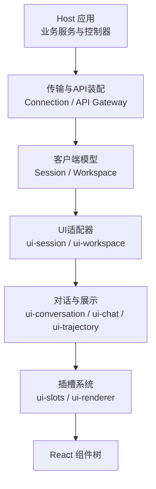
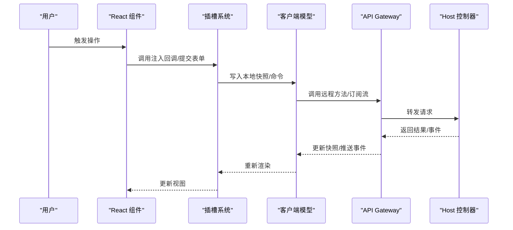
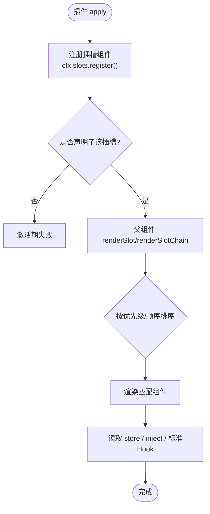

# Web界面扩展点

<cite>
**本文引用的文件**
- [Web 客户端架构](file://docs/subsystems/web-client.md)
- [Web 客户端插槽](file://docs/subsystems/slots.md)
- [扩展子系统（Cordis）](file://docs/subsystems/extensions.md)
- [插槽注册实现（ui-slots）](file://packages/client/ui-slots/src/index.ts)
</cite>

## 目录
1. [简介](#简介)
2. [项目结构](#项目结构)
3. [核心组件](#核心组件)
4. [架构总览](#架构总览)
5. [详细组件分析](#详细组件分析)
6. [依赖关系分析](#依赖关系分析)
7. [性能考虑](#性能考虑)
8. [故障排查指南](#故障排查指南)
9. [结论](#结论)
10. [附录](#附录)

## 简介
本文件面向DeepSeek Harness的Web界面扩展点，聚焦以下目标：
- 侧边栏扩展机制：插槽注册、组件挂载与状态共享方式
- 工具栏定制扩展点：按钮添加、菜单项插入、快捷键绑定
- 对话框扩展：模态框注册、内容注入、生命周期管理
- 全局扩展点配置：插件发现、依赖解析、冲突处理
- 实战示例：如何开发侧边栏组件、定制工具栏功能、实现自定义对话框
- 权限与安全：扩展点的权限控制与安全边界
- 测试与调试：扩展功能的验证方法与调试技巧

## 项目结构
Web界面扩展基于“插件化 + 插槽”的组合式体系：
- 插件通过Cordis在Host/Client两侧运行，具备版本化包管理与生命周期
- UI以Slots为统一扩展点，声明式地暴露可插拔的渲染位置
- 渲染由ui-renderer驱动，将可观察源绑定到React上下文并挂载组件树
- 会话与工作区等模型提供标准Hook，供插槽组件消费

图表来源
- [Web 客户端架构:20-30](file://docs/subsystems/web-client.md#L20-L30)
- [Web 客户端架构:54-60](file://docs/subsystems/web-client.md#L54-L60)

章节来源
- [Web 客户端架构:7-18](file://docs/subsystems/web-client.md#L7-L18)
- [Web 客户端架构:20-30](file://docs/subsystems/web-client.md#L20-L30)
- [Web 客户端架构:54-60](file://docs/subsystems/web-client.md#L54-L60)

## 核心组件
- 插槽系统（Slots）：定义可插拔的UI位置、作用域、基数与注入能力，是侧边栏、工具栏、对话框等扩展的基础
- 动态插件（Dynamic Cordis Runner）：负责插件包的发现、激活、停止、撤销与跨端通信
- 客户端模型与适配器：将Host状态映射为稳定的本地快照，并通过标准Hook暴露给UI
- 渲染器（ui-renderer）：唯一负责绑定可观察源、维护React上下文并渲染根树的包

章节来源
- [Web 客户端插槽:9-17](file://docs/subsystems/slots.md#L9-L17)
- [Web 客户端架构:54-60](file://docs/subsystems/web-client.md#L54-L60)
- [扩展子系统（Cordis）:67-257](file://docs/subsystems/extensions.md#L67-L257)

## 架构总览
Web界面扩展遵循“Host状态 → Remote传输 → Client模型 → UI适配器 → 对话/展示 → Slots → React”的数据流。用户交互通过回调回传至注入的服务或生成的Remote方法，最终由Host控制器执行权威变更并广播更新。

图表来源
- [Web 客户端架构:62-70](file://docs/subsystems/web-client.md#L62-L70)

章节来源
- [Web 客户端架构:62-70](file://docs/subsystems/web-client.md#L62-L70)

## 详细组件分析

### 侧边栏扩展机制（Sidebar Slots）
- 插槽注册：通过`ctx.slots.register()`在已声明的插槽键下注册组件；支持单值、列表、键控、链式选择等多种基数
- 组件挂载：由父级组件的`renderSlot`/`renderSlotChain`触发渲染，按优先级与顺序决定显示
- 状态共享：
  - 使用注册的store声明共享视图状态
  - 通过inject工厂闭包持有私有数据与回调
  - 框架提供的标准Hook（如useSessions/useWorkspaces）用于跨组件共享会话与工作区信息
- 当前层级：sidebar包含品牌、工作区、设置等子插槽，可在对应位置插入自定义内容

图表来源
- [Web 客户端插槽:9-17](file://docs/subsystems/slots.md#L9-L17)
- [Web 客户端插槽:44-75](file://docs/subsystems/slots.md#L44-L75)
- [Web 客户端插槽:96-104](file://docs/subsystems/slots.md#L96-L104)
- [Web 客户端插槽:106-163](file://docs/subsystems/slots.md#L106-L163)

章节来源
- [Web 客户端插槽:9-17](file://docs/subsystems/slots.md#L9-L17)
- [Web 客户端插槽:44-75](file://docs/subsystems/slots.md#L44-L75)
- [Web 客户端插槽:96-104](file://docs/subsystems/slots.md#L96-L104)
- [Web 客户端插槽:106-163](file://docs/subsystems/slots.md#L106-L163)

### 工具栏定制扩展点（Toolbar Customization）
- 按钮添加：在会话头部或输入区域对应的插槽中注册按钮组件，利用order与id控制位置与优先级
- 菜单项插入：在settings或会话头部的list/keyed插槽中追加菜单项，复用现有布局
- 快捷键绑定：通过注入的回调与标准Hook组合实现键盘事件监听与分发；避免直接耦合DOM事件，优先使用上层服务
- 注意事项：
  - 仅通过类型导入其他特性包的声明，不运行时引用其值
  - 使用插槽而非硬编码节点进行组合
  - 业务与传输状态归属各自服务，插槽store仅承载视图状态

章节来源
- [Web 客户端插槽:44-75](file://docs/subsystems/slots.md#L44-L75)
- [Web 客户端插槽:96-104](file://docs/subsystems/slots.md#L96-L104)
- [Web 客户端插槽:106-163](file://docs/subsystems/slots.md#L106-L163)

### 对话框扩展（Modal/Dialog Extension）
- 模态框注册：在shell.overlay或相关overlay插槽中注册对话框组件，确保声明存在且作用域正确
- 内容注入：通过owner props、inject工厂与store向对话框传递数据与回调
- 生命周期管理：
  - 随插槽声明的生命周期挂载/卸载
  - 通过Cordis事件或服务订阅同步宿主状态
  - 关闭时清理副作用，避免内存泄漏

章节来源
- [Web 客户端插槽:9-17](file://docs/subsystems/slots.md#L9-L17)
- [Web 客户端插槽:96-104](file://docs/subsystems/slots.md#L96-L104)

### 全局扩展点配置（Plugin Discovery, Dependency Resolution, Conflict Handling）
- 插件发现：Host启动时构建模块图，预取immediately条目，加载vendored Cordis Loader并创建所有图节点
- 依赖解析：Cordis服务注入决定激活顺序；模块图顺序仅影响同步import能否物化
- 冲突处理：
  - 对single/keyed插槽，后注册的高优先级项可替换已有呈现
  - 对list/keyed插槽，通过id/order控制顺序与去重
  - 未声明插槽的注册会在插件激活期失败，防止越权挂载

章节来源
- [Web 客户端架构:20-30](file://docs/subsystems/web-client.md#L20-L30)
- [Web 客户端插槽:44-75](file://docs/subsystems/slots.md#L44-L75)
- [扩展子系统（Cordis）:67-257](file://docs/subsystems/extensions.md#L67-L257)

### 权限控制与安全考虑
- 插件运行隔离：动态插件具备明确的Host/Client半程与生命周期，需经授权后方可运行
- 访问策略：Host控制器拥有权威状态与访问策略，Client仅维护镜像与命令
- 安全边界：
  - 组件不接收ctx、传输对象或其他插件的实现
  - 跨包仅允许类型导入，禁止运行时引用
  - 敏感操作应通过Remote方法并由Host校验

章节来源
- [Web 客户端架构:7-18](file://docs/subsystems/web-client.md#L7-L18)
- [Web 客户端架构:28-36](file://docs/subsystems/web-client.md#L28-L36)
- [Web 客户端插槽:167-175](file://docs/subsystems/slots.md#L167-L175)
- [扩展子系统（Cordis）:67-257](file://docs/subsystems/extensions.md#L67-L257)

### 实战示例（代码片段路径）
- 侧边栏组件注册与注入：
  - 参考路径：[Web 客户端插槽:19-42](file://docs/subsystems/slots.md#L19-L42)
- 插槽注册API重载与类型约束：
  - 参考路径：[插槽注册实现（ui-slots）:749-778](file://packages/client/ui-slots/src/index.ts#L749-L778)
- 动态插件生命周期（定义/运行/停止/撤销）：
  - 参考路径：[扩展子系统（Cordis）:67-257](file://docs/subsystems/extensions.md#L67-L257)

章节来源
- [Web 客户端插槽:19-42](file://docs/subsystems/slots.md#L19-L42)
- [插槽注册实现（ui-slots）:749-778](file://packages/client/ui-slots/src/index.ts#L749-L778)
- [扩展子系统（Cordis）:67-257](file://docs/subsystems/extensions.md#L67-L257)

## 依赖关系分析
- 插件与插槽：插件通过Slots贡献UI，不得直接依赖其他插件的实现
- 模型与UI：UI消费模型快照与标准Hook，不复制传输状态
- Host与Client：通过Remote与事件通道解耦，保证单向数据流

图表来源
- [Web 客户端架构:54-60](file://docs/subsystems/web-client.md#L54-L60)
- [Web 客户端架构:62-70](file://docs/subsystems/web-client.md#L62-L70)

章节来源
- [Web 客户端架构:54-60](file://docs/subsystems/web-client.md#L54-L60)
- [Web 客户端架构:62-70](file://docs/subsystems/web-client.md#L62-L70)

## 性能考虑
- 避免在插槽组件中重复创建可观察源，保持source身份稳定
- 合理使用store与inject，减少不必要的重渲染
- 列表/链式插槽注意order与优先级，避免过多高优先级项导致计算开销
- 长列表与虚拟滚动应在更高层实现，插槽仅负责局部渲染

## 故障排查指南
- 插槽未渲染：检查是否在父组件处声明了对应插槽键，以及注册是否发生在激活期
- 组件被覆盖：确认single/keyed插槽的优先级与id是否与其他项冲突
- 状态不同步：确认store与inject是否正确绑定，标准Hook是否处于正确的作用域
- 插件无法激活：查看动态插件的define/run/stop流程，确认授权与依赖满足

章节来源
- [Web 客户端插槽:9-17](file://docs/subsystems/slots.md#L9-L17)
- [Web 客户端插槽:44-75](file://docs/subsystems/slots.md#L44-L75)
- [扩展子系统（Cordis）:67-257](file://docs/subsystems/extensions.md#L67-L257)

## 结论
DeepSeek Harness的Web界面扩展以“插槽+动态插件”为核心，提供了清晰的扩展边界与安全的运行环境。通过声明式插槽注册、标准化的状态共享与严格的Host/Client职责划分，开发者可以安全、可控地扩展侧边栏、工具栏与对话框等功能。配合完善的生命周期与事件机制，扩展具备良好的可维护性与可扩展性。

## 附录
- 快速上手建议：
  - 先阅读插槽文档，明确可用插槽与作用域
  - 在插件apply中注册插槽组件，尽量使用store与inject管理状态
  - 通过Remote与服务调用Host能力，避免直接操作DOM
  - 使用e2e与单元测试验证插槽渲染与交互行为