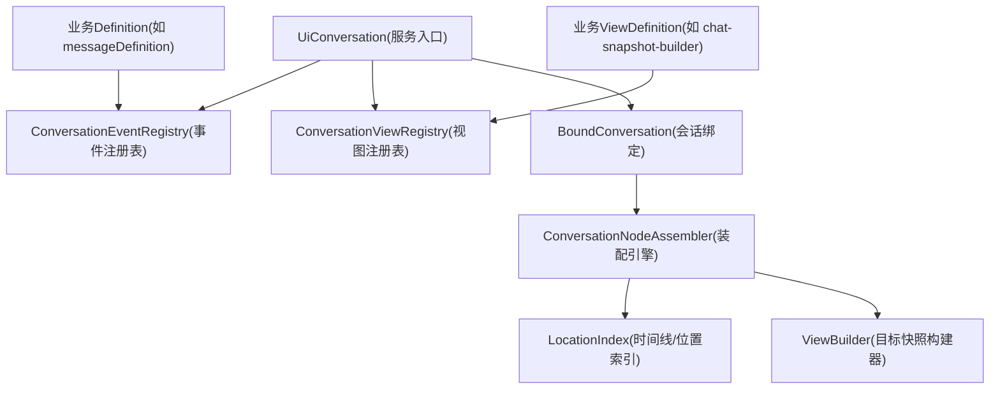
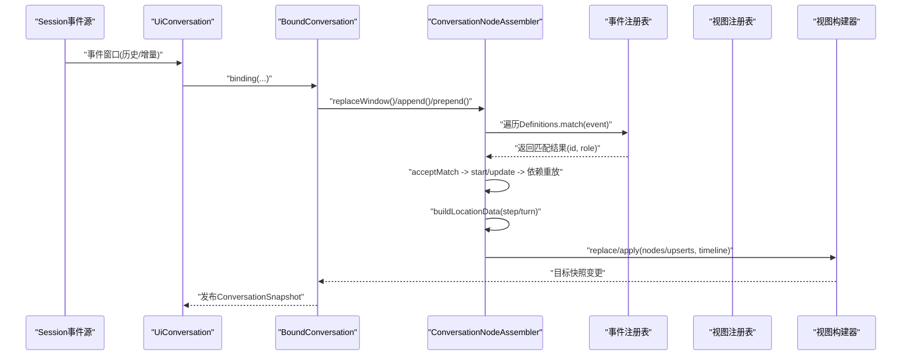
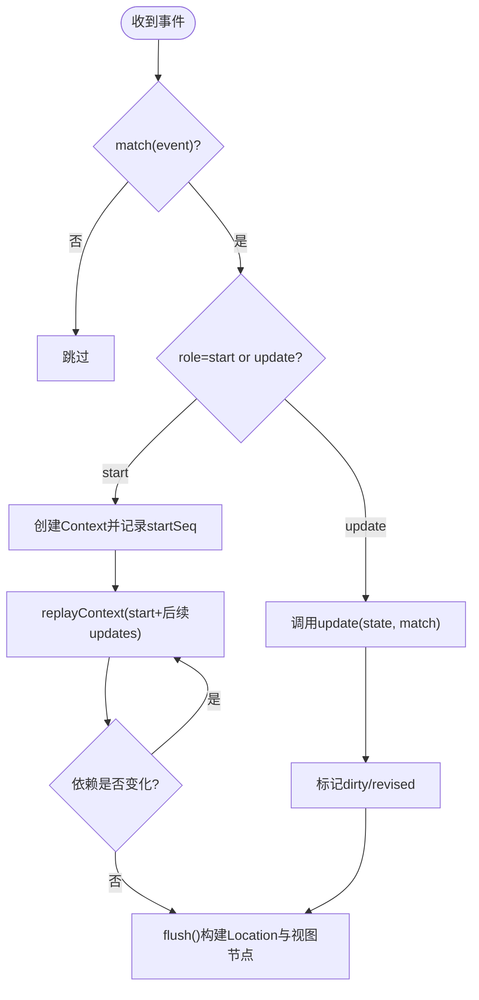
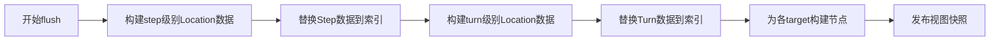
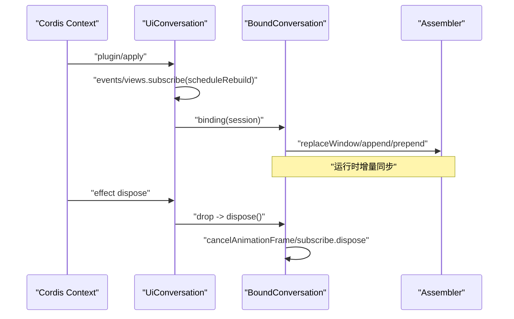
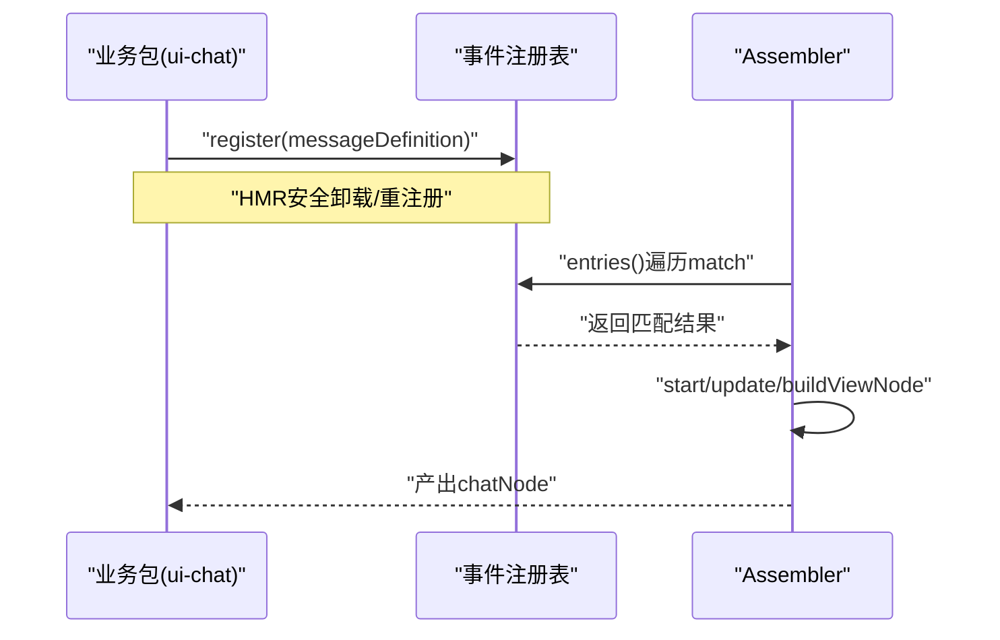
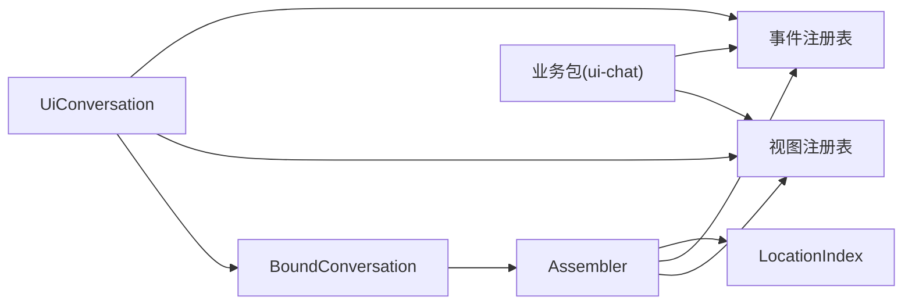

# 对话节点注册机制

<cite>
**本文引用的文件**
- [packages/client/ui-conversation/src/client/contract/conversation.ts](file://packages/client/ui-conversation/src/client/contract/conversation.ts)
- [packages/client/ui-conversation/src/client/conversation/definition-registry.ts](file://packages/client/ui-conversation/src/client/conversation/definition-registry.ts)
- [packages/client/ui-conversation/src/client/conversation/event-registry.ts](file://packages/client/ui-conversation/src/client/conversation/event-registry.ts)
- [packages/client/ui-conversation/src/client/conversation/view-registry.ts](file://packages/client/ui-conversation/src/client/conversation/view-registry.ts)
- [packages/client/ui-conversation/src/client/conversation/assembler.ts](file://packages/client/ui-conversation/src/client/conversation/assembler.ts)
- [packages/client/ui-conversation/src/client/conversation/assembly.ts](file://packages/client/ui-conversation/src/client/conversation/assembly.ts)
- [packages/client/ui-chat/src/client/conversation-nodes/message.ts](file://packages/client/ui-chat/src/client/conversation-nodes/message.ts)
- [packages/client/ui-chat/src/client/conversation-nodes/register.ts](file://packages/client/ui-chat/src/client/conversation-nodes/register.ts)
- [.agents/notes/implemented/architecture/2026-08-09-client-conversation-node-assembly.md](file://.agents/notes/implemented/architecture/2026-08-09-client-conversation-node-assembly.md)
- [packages/session/session-projection/src/index.ts](file://packages/session/session-projection/src/index.ts)
- [packages/api/session-controller/src/client/sessions/service.ts](file://packages/api/session-controller/src/client/sessions/service.ts)
</cite>

## 目录
1. [简介](#简介)
2. [项目结构](#项目结构)
3. [核心组件](#核心组件)
4. [架构总览](#架构总览)
5. [详细组件分析](#详细组件分析)
6. [依赖关系分析](#依赖关系分析)
7. [性能考量](#性能考量)
8. [故障排查指南](#故障排查指南)
9. [结论](#结论)
10. [附录：开发示例与最佳实践](#附录开发示例与最佳实践)

## 简介
本文件面向DeepSeek Harness的“对话节点注册机制”，聚焦以下目标：
- 如何注册自定义消息渲染器与交互组件（Conversation Definitions）
- 目标快照构建器的实现方式（View Builder / View Definition）
- 事件关联机制（匹配、上下文、位置信息、发布节奏）
- 会话上下文生命周期管理（挂载初始化、运行时同步、销毁清理）
- 错误处理策略与调试技巧
- 提供可操作的代码路径指引，帮助快速集成第三方UI库到对话系统

## 项目结构
围绕对话节点的核心由“契约定义 + 注册表 + 装配引擎 + 视图构建”四部分组成：
- 契约层：定义事件匹配、上下文、位置、视图节点、视图构建器等接口
- 注册表层：事件定义注册表、视图定义注册表，支持插件化扩展与HMR安全卸载
- 装配引擎：按会话窗口增量消费事件，维护Context状态机，计算Location，产出视图节点
- 视图构建：为每个目标（target）维护独立的可增量更新的快照



图表来源
- [packages/client/ui-conversation/src/client/conversation/assembly.ts:139-204](file://packages/client/ui-conversation/src/client/conversation/assembly.ts#L139-L204)
- [packages/client/ui-conversation/src/client/conversation/definition-registry.ts:5-67](file://packages/client/ui-conversation/src/client/conversation/definition-registry.ts#L5-L67)
- [packages/client/ui-conversation/src/client/conversation/assembler.ts:153-180](file://packages/client/ui-conversation/src/client/conversation/assembler.ts#L153-L180)

章节来源
- [packages/client/ui-conversation/src/client/conversation/assembly.ts:139-204](file://packages/client/ui-conversation/src/client/conversation/assembly.ts#L139-L204)
- [packages/client/ui-conversation/src/client/conversation/definition-registry.ts:5-67](file://packages/client/ui-conversation/src/client/conversation/definition-registry.ts#L5-L67)

## 核心组件
- ConversationNodeDefinition：描述一个业务对象从事件到状态的转换规则，包含 match/start/update/buildLocationData/buildViewNode 等阶段
- ConversationViewDefinition：为目标（target）创建独立的增量视图构建器，负责将节点集合转换为快照
- ConversationNodeAssembler：会话级装配器，维护Context状态机、依赖追踪、Location数据、视图节点生成与发布节奏控制
- UiConversation：服务入口，持有事件与视图注册表，管理会话绑定与图像缓存等
- 注册表基类 ConversationDefinitionRegistry：统一的生命周期与条目存储，支持订阅失效与HMR安全卸载

章节来源
- [packages/client/ui-conversation/src/client/contract/conversation.ts:167-267](file://packages/client/ui-conversation/src/client/contract/conversation.ts#L167-L267)
- [packages/client/ui-conversation/src/client/conversation/assembler.ts:153-180](file://packages/client/ui-conversation/src/client/conversation/assembler.ts#L153-L180)
- [packages/client/ui-conversation/src/client/conversation/assembly.ts:139-204](file://packages/client/ui-conversation/src/client/conversation/assembly.ts#L139-L204)
- [packages/client/ui-conversation/src/client/conversation/definition-registry.ts:5-67](file://packages/client/ui-conversation/src/client/conversation/definition-registry.ts#L5-L67)

## 架构总览
下图展示了从事件到最终视图节点的完整流程，包括匹配、上下文状态更新、位置数据发布、视图构建与快照发布。



图表来源
- [packages/client/ui-conversation/src/client/conversation/assembly.ts:81-131](file://packages/client/ui-conversation/src/client/conversation/assembly.ts#L81-L131)
- [packages/client/ui-conversation/src/client/conversation/assembler.ts:182-269](file://packages/client/ui-conversation/src/client/conversation/assembler.ts#L182-L269)
- [packages/client/ui-conversation/src/client/conversation/assembler.ts:370-420](file://packages/client/ui-conversation/src/client/conversation/assembler.ts#L370-L420)
- [packages/client/ui-conversation/src/client/conversation/assembler.ts:749-800](file://packages/client/ui-conversation/src/client/conversation/assembler.ts#L749-L800)

## 详细组件分析

### 事件匹配与上下文生命周期
- 匹配阶段：每个Definition通过match从事件中抽取稳定的业务id与角色（start/update），无上下文访问
- 启动阶段：start接收完整的当前证据（matches/location）和严格向前的reader，用于读取同kind的前驱上下文
- 更新阶段：update在已有state基础上应用新match，返回新的不可变state
- 依赖重放：当依赖的上下文或时间线变化时，自动重放受影响Context的状态
- 发布节奏：publication可为none/animation-frame/immediate，由装配器合并并调度



图表来源
- [packages/client/ui-conversation/src/client/conversation/assembler.ts:422-483](file://packages/client/ui-conversation/src/client/conversation/assembler.ts#L422-L483)
- [packages/client/ui-conversation/src/client/conversation/assembler.ts:559-590](file://packages/client/ui-conversation/src/client/conversation/assembler.ts#L559-L590)
- [packages/client/ui-conversation/src/client/conversation/assembler.ts:695-721](file://packages/client/ui-conversation/src/client/conversation/assembler.ts#L695-L721)

章节来源
- [packages/client/ui-conversation/src/client/contract/conversation.ts:167-225](file://packages/client/ui-conversation/src/client/contract/conversation.ts#L167-L225)
- [packages/client/ui-conversation/src/client/conversation/assembler.ts:422-483](file://packages/client/ui-conversation/src/client/conversation/assembler.ts#L422-L483)
- [packages/client/ui-conversation/src/client/conversation/assembler.ts:559-590](file://packages/client/ui-conversation/src/client/conversation/assembler.ts#L559-L590)
- [packages/client/ui-conversation/src/client/conversation/assembler.ts:695-721](file://packages/client/ui-conversation/src/client/conversation/assembler.ts#L695-L721)

### 目标快照构建器（View Builder / View Definition）
- 每个目标（target）拥有独立的视图构建器，负责将节点集合转换为快照
- replace用于全量重建，apply用于增量更新（仅变更节点）
- isActive可选，用于判断目标是否处于活跃活动状态
- 装配器保证节点key稳定且target正确，禁止中途移除已物化的节点（应改为隐藏可见性）

```mermaid
classDiagram
class ConversationViewDefinition {
+string target
+create() ConversationViewBuilder
+isActive?(snapshot) boolean
}
class ConversationViewBuilder {
+empty Snapshot
+replace({nodes,timeline}) Snapshot
+apply({upserts,timeline}) Snapshot
}
class UiConversation {
+views : ConversationViewRegistry
+binding(source) ConversationBinding
}
UiConversation --> ConversationViewDefinition : "注册/创建"
ConversationViewDefinition --> ConversationViewBuilder : "实例化"
```

图表来源
- [packages/client/ui-conversation/src/client/contract/conversation.ts:233-267](file://packages/client/ui-conversation/src/client/contract/conversation.ts#L233-L267)
- [packages/client/ui-conversation/src/client/conversation/assembly.ts:139-204](file://packages/client/ui-conversation/src/client/conversation/assembly.ts#L139-L204)
- [packages/client/ui-conversation/src/client/conversation/assembler.ts:280-337](file://packages/client/ui-conversation/src/client/conversation/assembler.ts#L280-L337)

章节来源
- [packages/client/ui-conversation/src/client/contract/conversation.ts:233-267](file://packages/client/ui-conversation/src/client/contract/conversation.ts#L233-L267)
- [packages/client/ui-conversation/src/client/conversation/assembler.ts:280-337](file://packages/client/ui-conversation/src/client/conversation/assembler.ts#L280-L337)

### 事件关联机制（Location与Timeline）
- Location分为step与turn两级，允许Definition发布只读的业务值到引擎拥有的Step/Turn
- Timeline由LocationIndex维护，包含turnOrder与turns映射
- 当时间线边界变化时，相关Context的location会被刷新并重放
- buildLocationData必须在step先于turn的顺序中执行，确保Turn聚合能读到Step数据



图表来源
- [packages/client/ui-conversation/src/client/conversation/assembler.ts:762-800](file://packages/client/ui-conversation/src/client/conversation/assembler.ts#L762-L800)
- [packages/client/ui-conversation/src/client/conversation/assembler.ts:280-337](file://packages/client/ui-conversation/src/client/conversation/assembler.ts#L280-L337)

章节来源
- [packages/client/ui-conversation/src/client/contract/conversation.ts:63-83](file://packages/client/ui-conversation/src/client/contract/conversation.ts#L63-L83)
- [packages/client/ui-conversation/src/client/conversation/assembler.ts:762-800](file://packages/client/ui-conversation/src/client/conversation/assembler.ts#L762-L800)

### 会话上下文生命周期管理
- 挂载初始化：UiConversation.binding为每个Session创建BoundConversation与Assembler，订阅事件源并初始化快照
- 运行时同步：BoundConversation根据事件窗口类型（replace/prepend/append）驱动Assembler；publication决定立即或动画帧合并
- 销毁清理：BoundConversation在dispose中取消帧调度、释放事件订阅；UiConversation在scope effect中管理绑定生命周期，避免内存泄漏



图表来源
- [packages/client/ui-conversation/src/client/conversation/assembly.ts:157-204](file://packages/client/ui-conversation/src/client/conversation/assembly.ts#L157-L204)
- [packages/client/ui-conversation/src/client/conversation/assembly.ts:71-79](file://packages/client/ui-conversation/src/client/conversation/assembly.ts#L71-L79)

章节来源
- [packages/client/ui-conversation/src/client/conversation/assembly.ts:157-204](file://packages/client/ui-conversation/src/client/conversation/assembly.ts#L157-L204)
- [packages/client/ui-conversation/src/client/conversation/assembly.ts:71-79](file://packages/client/ui-conversation/src/client/conversation/assembly.ts#L71-L79)

### 注册流程与示例：消息节点
- 业务包通过registerMessageConversationNode将messageDefinition注册到uiConversation.events
- registerConversationNodes集中注册Chat所需的所有节点与视图构建器
- messageDefinition匹配user/message事件，区分用户消息、引导消息与注入上下文，并输出chatNode



图表来源
- [packages/client/ui-chat/src/client/conversation-nodes/message.ts:38-92](file://packages/client/ui-chat/src/client/conversation-nodes/message.ts#L38-L92)
- [packages/client/ui-chat/src/client/conversation-nodes/register.ts:21-36](file://packages/client/ui-chat/src/client/conversation-nodes/register.ts#L21-L36)
- [packages/client/ui-conversation/src/client/conversation/event-registry.ts:5-19](file://packages/client/ui-conversation/src/client/conversation/event-registry.ts#L5-L19)

章节来源
- [packages/client/ui-chat/src/client/conversation-nodes/message.ts:38-92](file://packages/client/ui-chat/src/client/conversation-nodes/message.ts#L38-L92)
- [packages/client/ui-chat/src/client/conversation-nodes/register.ts:21-36](file://packages/client/ui-chat/src/client/conversation-nodes/register.ts#L21-L36)
- [packages/client/ui-conversation/src/client/conversation/event-registry.ts:5-19](file://packages/client/ui-conversation/src/client/conversation/event-registry.ts#L5-L19)

### 会话投影与事件驱动
- session-projection在session/created时初始化每会话的投影状态，并在session/event时驱动状态推进
- 这为对话节点提供了稳定的会话上下文基础，使节点可以基于会话事件进行状态演进

章节来源
- [packages/session/session-projection/src/index.ts:185-204](file://packages/session/session-projection/src/index.ts#L185-L204)

### 会话作用域解析
- ClientSessions提供scopeOf/sessionOf/binding等方法，用于从Cordis Context解析出会话与作用域
- 这些方法确保跨bundle的值导入一致性，避免重复实例化导致的标识不匹配问题

章节来源
- [packages/api/session-controller/src/client/sessions/service.ts:455-511](file://packages/api/session-controller/src/client/sessions/service.ts#L455-L511)

## 依赖关系分析
- UiConversation依赖事件与视图注册表，并通过BoundConversation连接会话事件源
- Assembler依赖LocationIndex以维护时间线与位置数据，同时依赖注册表获取Definitions
- 业务包通过注册表贡献自己的Definition与ViewDefinition，形成松耦合扩展点
- 注册表使用Cordis effect管理生命周期，支持HMR下的安全卸载与重注册



图表来源
- [packages/client/ui-conversation/src/client/conversation/assembly.ts:139-204](file://packages/client/ui-conversation/src/client/conversation/assembly.ts#L139-L204)
- [packages/client/ui-conversation/src/client/conversation/assembler.ts:153-180](file://packages/client/ui-conversation/src/client/conversation/assembler.ts#L153-L180)
- [packages/client/ui-chat/src/client/conversation-nodes/register.ts:21-36](file://packages/client/ui-chat/src/client/conversation-nodes/register.ts#L21-L36)

章节来源
- [packages/client/ui-conversation/src/client/conversation/assembly.ts:139-204](file://packages/client/ui-conversation/src/client/conversation/assembly.ts#L139-L204)
- [packages/client/ui-conversation/src/client/conversation/assembler.ts:153-180](file://packages/client/ui-conversation/src/client/conversation/assembler.ts#L153-L180)
- [packages/client/ui-chat/src/client/conversation-nodes/register.ts:21-36](file://packages/client/ui-chat/src/client/conversation-nodes/register.ts#L21-L36)

## 性能考量
- 增量装配：append/prepend/replace分别针对不同场景优化，避免全量扫描
- 发布节奏合并：animation-frame批量合并多次更新，减少渲染抖动
- 依赖重放最小化：仅对受影响的Context进行重放，降低CPU开销
- 视图增量更新：apply仅处理变更节点，提升大列表性能
- 时间线变更触发：仅在Location边界变化时刷新相关Context，避免不必要重算

章节来源
- [packages/client/ui-conversation/src/client/conversation/assembler.ts:182-269](file://packages/client/ui-conversation/src/client/conversation/assembler.ts#L182-L269)
- [packages/client/ui-conversation/src/client/conversation/assembler.ts:280-337](file://packages/client/ui-conversation/src/client/conversation/assembler.ts#L280-L337)
- [packages/client/ui-conversation/src/client/conversation/assembler.ts:608-622](file://packages/client/ui-conversation/src/client/conversation/assembler.ts#L608-L622)

## 故障排查指南
常见错误与定位要点：
- 重复start：同一Context收到多个start会抛出异常，检查match逻辑是否正确识别唯一id
- 先update后start：顺序违反，检查事件流与匹配逻辑
- 非追加匹配：seq不递增，检查事件窗口排序与append语义
- 节点key不稳定：buildViewNode返回的key必须等于context.key，否则抛出异常
- 目标不一致：buildViewNode返回的target必须与Definition声明一致
- 非法Location数据：turn/step范围校验失败，检查buildLocationData参数
- 视图撤回：已物化节点不能直接返回null，应改为隐藏可见性

调试建议：
- 使用activeTargets观察哪些目标处于活跃状态
- 打印publication决策，确认是否被合并为animation-frame
- 检查LocationIndex的时间线变化，确认step/turn边界是否正确
- 利用测试工具中的act/flush确保异步更新完成后再断言

章节来源
- [packages/client/ui-conversation/src/client/conversation/assembler.ts:422-483](file://packages/client/ui-conversation/src/client/conversation/assembler.ts#L422-L483)
- [packages/client/ui-conversation/src/client/conversation/assembler.ts:749-800](file://packages/client/ui-conversation/src/client/conversation/assembler.ts#L749-L800)
- [packages/client/ui-conversation/src/client/conversation/assembler.ts:280-337](file://packages/client/ui-conversation/src/client/conversation/assembler.ts#L280-L337)

## 结论
DeepSeek Harness的对话节点注册机制通过清晰的契约定义、插件化的注册表、会话级的装配引擎与增量视图构建，实现了高内聚、低耦合的对话系统扩展能力。开发者只需关注业务Definition与ViewDefinition的实现，即可快速集成自定义消息类型与交互逻辑，并借助强大的错误检测与性能优化机制，构建稳定高效的对话界面。

## 附录：开发示例与最佳实践

### 开发自定义消息类型
- 定义ConversationNodeDefinition：实现match/start/update/buildViewNode
- 注册到事件注册表：通过ctx.uiConversation.events.register(...)
- 参考路径：[packages/client/ui-chat/src/client/conversation-nodes/message.ts:38-92](file://packages/client/ui-chat/src/client/conversation-nodes/message.ts#L38-L92)

### 实现复杂用户交互逻辑
- 使用buildLocationData发布Step/Turn级别的只读数据，供其他Context读取
- 通过previous读取前驱上下文，实现跨轮次状态关联
- 参考路径：[packages/client/ui-conversation/src/client/contract/conversation.ts:150-159](file://packages/client/ui-conversation/src/client/contract/conversation.ts#L150-L159)

### 集成第三方UI库
- 实现ConversationViewDefinition，创建独立的视图构建器
- 在replace/apply中对接第三方UI的渲染API，保持节点key稳定
- 参考路径：[packages/client/ui-conversation/src/client/contract/conversation.ts:233-267](file://packages/client/ui-conversation/src/client/contract/conversation.ts#L233-L267)

### 错误处理策略
- 严格校验输入：event.seq递增、start唯一、location合法
- 防御性编程：避免返回null撤回已物化节点，改用可见性控制
- 参考路径：[packages/client/ui-conversation/src/client/conversation/assembler.ts:749-800](file://packages/client/ui-conversation/src/client/conversation/assembler.ts#L749-L800)

### 调试技巧
- 使用activeTargets监控活跃目标
- 打印publication决策，确认渲染合并策略
- 检查LocationIndex的时间线变化，定位step/turn边界问题
- 参考路径：[packages/client/ui-conversation/src/client/conversation/assembler.ts:354-364](file://packages/client/ui-conversation/src/client/conversation/assembler.ts#L354-L364)

章节来源
- [packages/client/ui-chat/src/client/conversation-nodes/message.ts:38-92](file://packages/client/ui-chat/src/client/conversation-nodes/message.ts#L38-L92)
- [packages/client/ui-conversation/src/client/contract/conversation.ts:150-159](file://packages/client/ui-conversation/src/client/contract/conversation.ts#L150-L159)
- [packages/client/ui-conversation/src/client/contract/conversation.ts:233-267](file://packages/client/ui-conversation/src/client/contract/conversation.ts#L233-L267)
- [packages/client/ui-conversation/src/client/conversation/assembler.ts:354-364](file://packages/client/ui-conversation/src/client/conversation/assembler.ts#L354-L364)
- [packages/client/ui-conversation/src/client/conversation/assembler.ts:749-800](file://packages/client/ui-conversation/src/client/conversation/assembler.ts#L749-L800)