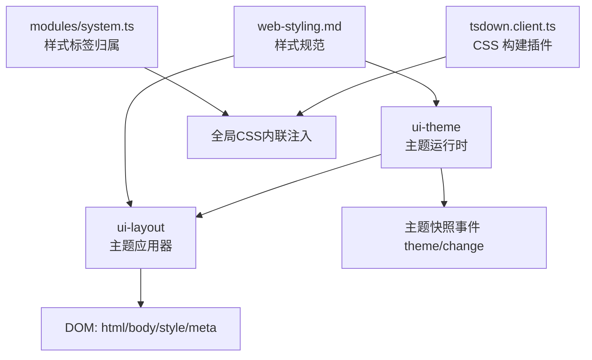
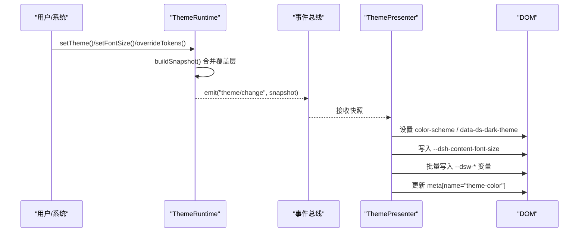
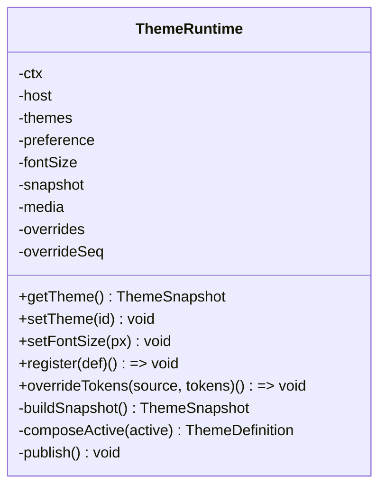
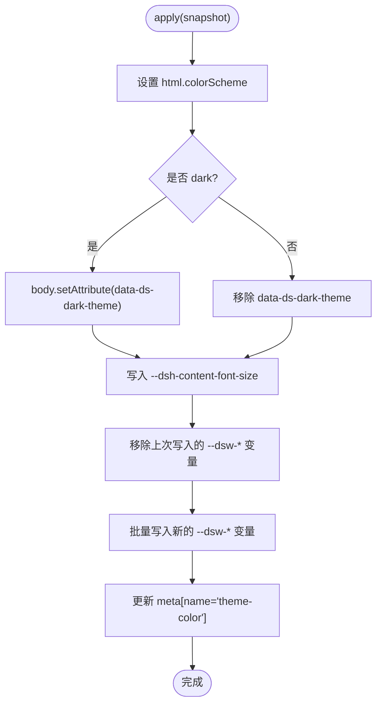
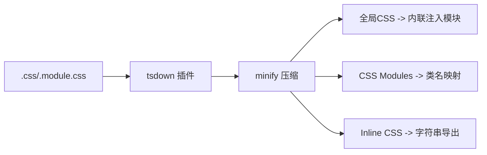
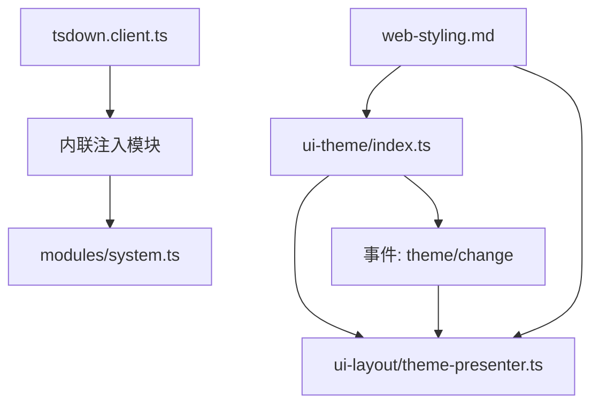

# 样式定制系统

<cite>
**本文引用的文件**
- [packages/client/ui-theme/src/client/index.ts](file://packages/client/ui-theme/src/client/index.ts)
- [packages/client/ui-layout/src/client/theme-presenter.ts](file://packages/client/ui-layout/src/client/theme-presenter.ts)
- [packages/client/tsdown.client.ts](file://packages/client/tsdown.client.ts)
- [scripts/client-bundle-css.spec.ts](file://scripts/client-bundle-css.spec.ts)
- [packages/client/modules/src/client/system.ts](file://packages/client/modules/src/client/system.ts)
- [docs/web-styling.md](file://docs/web-styling.md)
- [packages/client/ui-chat/src/client/chat/accessibility.module.css](file://packages/client/ui-chat/src/client/chat/accessibility.module.css)
- [packages/extensions/cordis-client-runner/src/client/guard.ts](file://packages/extensions/cordis-client-runner/src/client/guard.ts)
- [packages/client/ui-layout/tests/theme-presenter.client.spec.ts](file://packages/client/ui-layout/tests/theme-presenter.client.spec.ts)
- [packages/client/ui-theme/tests/theme.client.spec.ts](file://packages/client/ui-theme/tests/theme.client.spec.ts)
</cite>

## 目录
1. [简介](#简介)
2. [项目结构](#项目结构)
3. [核心组件](#核心组件)
4. [架构总览](#架构总览)
5. [详细组件分析](#详细组件分析)
6. [依赖关系分析](#依赖关系分析)
7. [性能考虑](#性能考虑)
8. [故障排查指南](#故障排查指南)
9. [结论](#结论)
10. [附录](#附录)

## 简介
本文件面向 DeepSeek Harness 的样式定制系统，系统性说明主题切换机制、CSS 变量动态注入、主题配置加载与管理、运行时切换的性能考量；响应式设计与移动端优化策略；样式隔离与第三方样式覆盖方法；无障碍访问（a11y）支持；以及样式性能优化技巧（压缩、懒加载、关键路径优化）。文档同时提供可操作的实践指引，帮助创建自定义主题、实现动态样式生成并集成设计系统。

## 项目结构
样式体系由“主题定义与注册”“主题快照发布”“DOM 应用器”“构建期 CSS 处理”“模块级样式生命周期”“规范与约束”等部分组成：
- 主题运行时：负责主题注册、偏好管理、系统配色感知、覆盖层叠加、不可变快照发布。
- DOM 应用器：将主题快照投影到文档，设置 color-scheme、暗色属性、内容字号轴、内联 CSS 变量与浏览器主题色元信息。
- 构建期 CSS：将全局 CSS 编译为内联注入脚本，支持 HMR 监听与最小化；CSS Modules 类名映射。
- 模块系统：对 <style> 标签进行归属标记与清理，保证插件/模块卸载时样式回收。
- 规范：明确 token 所有权、组件样式规则与变更流程。

图表来源
- [packages/client/ui-theme/src/client/index.ts:147-359](file://packages/client/ui-theme/src/client/index.ts#L147-L359)
- [packages/client/ui-layout/src/client/theme-presenter.ts:1-69](file://packages/client/ui-layout/src/client/theme-presenter.ts#L1-L69)
- [packages/client/tsdown.client.ts:515-571](file://packages/client/tsdown.client.ts#L515-L571)
- [packages/client/modules/src/client/system.ts:37-64](file://packages/client/modules/src/client/system.ts#L37-L64)
- [docs/web-styling.md:7-25](file://docs/web-styling.md#L7-L25)

章节来源
- [docs/web-styling.md:7-25](file://docs/web-styling.md#L7-L25)

## 核心组件
- 主题运行时 ThemeRuntime：维护内置主题（light/dark）、用户偏好（含 system）、字体大小、覆盖层（按来源顺序叠加），发布不可变快照，并通过事件通知变化。
- 主题应用器 ThemePresenter：将快照应用到 DOM，设置根 color-scheme、body 暗色属性、内容字号轴、内联 CSS 变量，并更新浏览器主题色元节点。
- 构建期 CSS 插件：将 .css 转为内联注入代码，支持 watch 与 minify；.module.css 输出类名映射；支持 inline 模式导出字符串。
- 模块样式生命周期：通过 data-plugin 标记 <style> 标签，实现插件/模块卸载时的样式回收。
- 安全守卫：在客户端运行器中对 overrideTokens 调用进行参数校验与自动注入包标识，防止误用。

章节来源
- [packages/client/ui-theme/src/client/index.ts:147-359](file://packages/client/ui-theme/src/client/index.ts#L147-L359)
- [packages/client/ui-layout/src/client/theme-presenter.ts:1-69](file://packages/client/ui-layout/src/client/theme-presenter.ts#L1-L69)
- [packages/client/tsdown.client.ts:515-571](file://packages/client/tsdown.client.ts#L515-L571)
- [packages/client/modules/src/client/system.ts:37-64](file://packages/client/modules/src/client/system.ts#L37-L64)
- [packages/extensions/cordis-client-runner/src/client/guard.ts:162-178](file://packages/extensions/cordis-client-runner/src/client/guard.ts#L162-L178)

## 架构总览
主题切换的核心链路：
- 用户或系统触发主题变化（偏好改变、系统配色变化、覆盖层变更）。
- 主题运行时计算新的 active 主题（合并覆盖层），生成不可变快照并发布 theme/change。
- 主题应用器订阅事件，将快照投影到 DOM：设置 color-scheme、暗色属性、内容字号轴、内联 CSS 变量，并更新 meta[name="theme-color"]。
- 构建期 CSS 以最小化内联方式注入，确保首屏可用与热更新。

图表来源
- [packages/client/ui-theme/src/client/index.ts:225-359](file://packages/client/ui-theme/src/client/index.ts#L225-L359)
- [packages/client/ui-layout/src/client/theme-presenter.ts:32-56](file://packages/client/ui-layout/src/client/theme-presenter.ts#L32-L56)

## 详细组件分析

### 主题运行时（ThemeRuntime）
- 职责
  - 维护主题注册表（内置 light/dark + 第三方注册）。
  - 管理用户偏好（light/dark/system）与持久化同步。
  - 监听系统 prefers-color-scheme 变化（当偏好为 system 时生效）。
  - 维护覆盖层（按来源 seq 顺序叠加，后者优先）。
  - 发布不可变快照（包含 preference、fontSize、active、themes、revision）。
- 关键点
  - 覆盖层必须提供 { light, dark } 双值，避免切换主题后不可读。
  - 字体大小受范围限制，且优先读取启动阶段 body 上的初始值以避免闪烁。
  - exportInspectTokens 暴露当前所有 token 描述，便于调试与检查。

图表来源
- [packages/client/ui-theme/src/client/index.ts:147-359](file://packages/client/ui-theme/src/client/index.ts#L147-L359)

章节来源
- [packages/client/ui-theme/src/client/index.ts:147-359](file://packages/client/ui-theme/src/client/index.ts#L147-L359)
- [packages/client/ui-theme/tests/theme.client.spec.ts:211-242](file://packages/client/ui-theme/tests/theme.client.spec.ts#L211-L242)

### 主题应用器（ThemePresenter）
- 职责
  - 将主题快照投影到文档：设置 root color-scheme、body 暗色属性、内容字号轴、内联 CSS 变量。
  - 维护 meta[name="theme-color"] 以匹配浏览器 UI 主题色。
  - 仅回滚自身写入的属性，不污染其他 inline style。
- 关键点
  - 每次 apply 会先移除上一次写入的变量，再批量写入新变量，避免残留。
  - 使用 getComputedStyle(body).backgroundColor 作为主题色元数据源，保证渲染一致性。

图表来源
- [packages/client/ui-layout/src/client/theme-presenter.ts:32-56](file://packages/client/ui-layout/src/client/theme-presenter.ts#L32-L56)

章节来源
- [packages/client/ui-layout/src/client/theme-presenter.ts:1-69](file://packages/client/ui-layout/src/client/theme-presenter.ts#L1-L69)
- [packages/client/ui-layout/tests/theme-presenter.client.spec.ts:49-96](file://packages/client/ui-layout/tests/theme-presenter.client.spec.ts#L49-L96)

### 构建期 CSS 处理与注入
- 全局 CSS：非 .module.css 的 .css 会被转换为内联注入模块，附带 data-plugin-css 标记，便于模块系统追踪与回收。
- CSS Modules：.module.css 编译为最小化类名，并导出类名映射，供组件使用。
- Inline CSS：?inline 后缀的 CSS 直接导出为字符串，便于按需插入。
- 热更新：通过 addWatchFile 监听源文件变更，保证开发体验。

图表来源
- [packages/client/tsdown.client.ts:515-571](file://packages/client/tsdown.client.ts#L515-L571)
- [scripts/client-bundle-css.spec.ts:54-100](file://scripts/client-bundle-css.spec.ts#L54-L100)

章节来源
- [packages/client/tsdown.client.ts:515-571](file://packages/client/tsdown.client.ts#L515-L571)
- [scripts/client-bundle-css.spec.ts:54-100](file://scripts/client-bundle-css.spec.ts#L54-L100)

### 模块级样式生命周期与隔离
- 样式标签归属：通过 data-plugin 标记 <style> 标签，记录其所属插件/模块。
- 回收机制：模块卸载时，依据 data-plugin 查找并移除对应样式，避免内存泄漏与样式污染。
- 与构建产物配合：构建阶段为注入的全局样式附加 data-plugin-css，便于运行时识别。

章节来源
- [packages/client/modules/src/client/system.ts:37-64](file://packages/client/modules/src/client/system.ts#L37-L64)
- [packages/client/tsdown.client.ts:543-556](file://packages/client/tsdown.client.ts#L543-L556)

### 安全与扩展点（覆盖层）
- 覆盖层 API：通过 overrideTokens(source, tokens) 叠加 token 覆盖，source 用于标识来源与生命周期管理。
- 客户端守卫：在 cordis-client-runner 中强制要求 source 为字符串，并自动替换为包标识，防止误用。
- 校验：运行时严格校验 tokens 形状，拒绝裸字符串或不完整 { light, dark } 对。

章节来源
- [packages/client/ui-theme/src/client/index.ts:292-317](file://packages/client/ui-theme/src/client/index.ts#L292-L317)
- [packages/extensions/cordis-client-runner/src/client/guard.ts:162-178](file://packages/extensions/cordis-client-runner/src/client/guard.ts#L162-L178)
- [packages/client/ui-theme/tests/theme.client.spec.ts:226-235](file://packages/client/ui-theme/tests/theme.client.spec.ts#L226-L235)

### 响应式设计与移动端优化
- 断点与布局适配：通过列宽计算逻辑在不同视口下自适应侧边栏、中心区与详情面板宽度，极端窄视口自动关闭次要区域，保障可用性。
- 滚动与溢出：针对对话列、表格等内容的水平溢出行为有预期测试，确保在小视口下的可读性与交互一致性。
- 移动端建议：结合主题变量控制间距与字号，利用共享滚动条样式保持统一视觉；遵循“文本不换行”的组件契约以保证列对齐。

章节来源
- [packages/client/ui-layout/tests/columns.client.spec.ts:62-95](file://packages/client/ui-layout/tests/columns.client.spec.ts#L62-L95)
- [apps/web/tests/expected/conversation-column-overflow/geometry.expected.md:1-10](file://apps/web/tests/expected/conversation-column-overflow/geometry.expected.md#L1-L10)
- [apps/web/tests/expected/markdown-wide-table/geometry.expected.md:1-19](file://apps/web/tests/expected/markdown-wide-table/geometry.expected.md#L1-L19)

### 样式隔离与第三方组件覆盖
- 组件样式：采用 CSS Modules 与 clsx，避免全局选择器污染。
- 主题变量：组件仅消费语义化 token（--dsw-alias-*），不直接引用静态调色板或硬编码颜色。
- 第三方覆盖：通过覆盖层 API 叠加 token 值，或使用 CSS Modules 局部覆盖，避免破坏主题选择器。

章节来源
- [docs/web-styling.md:13-21](file://docs/web-styling.md#L13-L21)
- [packages/client/ui-theme/src/client/index.ts:48-77](file://packages/client/ui-theme/src/client/index.ts#L48-L77)

### 无障碍访问（a11y）支持
- 可见性隐藏：提供 visuallyHidden 工具类，用于屏幕阅读器保留文本但视觉上隐藏。
- 焦点与动效：遵循“保留键盘焦点可见性”和“尊重 reduced-motion”的原则，避免新增过渡影响可访问性。
- 主题对比度：通过语义 token 保证明暗主题下的对比度一致。

章节来源
- [packages/client/ui-chat/src/client/chat/accessibility.module.css:1-9](file://packages/client/ui-chat/src/client/chat/accessibility.module.css#L1-L9)
- [docs/web-styling.md:18-21](file://docs/web-styling.md#L18-L21)

## 依赖关系分析
- ui-theme 提供主题运行时与设置行，向上下文提供 theme 服务。
- ui-layout 订阅 theme/change 事件，将快照应用到 DOM。
- tsdown 构建插件为全局 CSS 生成内联注入模块，并与 modules/system 协作管理样式生命周期。
- web-styling.md 作为规范约束各包的样式实践。

图表来源
- [packages/client/ui-theme/src/client/index.ts:428-479](file://packages/client/ui-theme/src/client/index.ts#L428-L479)
- [packages/client/ui-layout/src/client/theme-presenter.ts:1-69](file://packages/client/ui-layout/src/client/theme-presenter.ts#L1-L69)
- [packages/client/tsdown.client.ts:515-571](file://packages/client/tsdown.client.ts#L515-L571)
- [packages/client/modules/src/client/system.ts:37-64](file://packages/client/modules/src/client/system.ts#L37-L64)
- [docs/web-styling.md:7-25](file://docs/web-styling.md#L7-L25)

章节来源
- [packages/client/ui-theme/src/client/index.ts:428-479](file://packages/client/ui-theme/src/client/index.ts#L428-L479)
- [packages/client/ui-layout/src/client/theme-presenter.ts:1-69](file://packages/client/ui-layout/src/client/theme-presenter.ts#L1-L69)
- [packages/client/tsdown.client.ts:515-571](file://packages/client/tsdown.client.ts#L515-L571)
- [packages/client/modules/src/client/system.ts:37-64](file://packages/client/modules/src/client/system.ts#L37-L64)
- [docs/web-styling.md:7-25](file://docs/web-styling.md#L7-L25)

## 性能考虑
- 首屏关键路径
  - 全局 CSS 编译为内联注入，减少请求数，提升首屏渲染速度。
  - 内容字号轴在启动阶段从 body 读取初始值，避免首次切换导致的闪烁。
- 运行时切换
  - 主题应用器批量写入 CSS 变量，并在切换前清除旧变量，降低重排/重绘成本。
  - 使用不可变快照与 revision 计数，避免不必要的重渲染。
- 构建优化
  - CSS 最小化与类名哈希，减小体积并提高缓存命中率。
  - 通过 addWatchFile 实现热更新，缩短开发反馈周期。
- 样式回收
  - 基于 data-plugin 的样式标签归属与回收，避免内存泄漏与样式冲突。

章节来源
- [packages/client/ui-theme/src/client/index.ts:361-376](file://packages/client/ui-theme/src/client/index.ts#L361-L376)
- [packages/client/ui-layout/src/client/theme-presenter.ts:41-56](file://packages/client/ui-layout/src/client/theme-presenter.ts#L41-L56)
- [packages/client/tsdown.client.ts:515-571](file://packages/client/tsdown.client.ts#L515-L571)
- [packages/client/modules/src/client/system.ts:37-64](file://packages/client/modules/src/client/system.ts#L37-L64)

## 故障排查指南
- 主题未注册错误
  - 现象：调用 setTheme 传入未注册 id 抛出错误。
  - 排查：确认主题已通过 register 正确注册，且 id 不为 system。
- 覆盖层格式错误
  - 现象：overrideTokens 传入裸字符串或缺少 { light, dark } 成对值时报错。
  - 排查：确保每个 token 都提供 { light, dark } 字符串对。
- 变量残留问题
  - 现象：切换主题后出现旧主题变量残留。
  - 排查：确认应用器在 apply 前先移除上次写入的变量，再批量写入新变量。
- 样式泄漏
  - 现象：模块卸载后仍有样式生效。
  - 排查：检查 <style> 标签是否被正确标记 data-plugin，并确保模块卸载时执行回收。

章节来源
- [packages/client/ui-theme/src/client/index.ts:231-239](file://packages/client/ui-theme/src/client/index.ts#L231-L239)
- [packages/client/ui-theme/src/client/index.ts:308-317](file://packages/client/ui-theme/src/client/index.ts#L308-L317)
- [packages/client/ui-theme/tests/theme.client.spec.ts:226-235](file://packages/client/ui-theme/tests/theme.client.spec.ts#L226-L235)
- [packages/client/ui-layout/src/client/theme-presenter.ts:48-53](file://packages/client/ui-layout/src/client/theme-presenter.ts#L48-L53)
- [packages/client/modules/src/client/system.ts:42-52](file://packages/client/modules/src/client/system.ts#L42-L52)

## 结论
DeepSeek Harness 的样式定制系统通过“主题运行时 + DOM 应用器 + 构建期 CSS 注入 + 模块生命周期管理”形成闭环，实现了：
- 安全的主题注册与覆盖层叠加；
- 高性能的运行时切换与首屏关键路径优化；
- 清晰的样式隔离与第三方覆盖方案；
- 完善的无障碍支持与响应式适配策略。
遵循 web-styling 规范与测试策略，可在保证一致性的前提下灵活扩展主题与设计系统。

## 附录
- 快速实践
  - 创建自定义主题：通过 register 添加主题定义，提供 id、colorScheme 与 tokens。
  - 动态样式生成：使用 overrideTokens 叠加 token 覆盖层，并在生命周期结束时释放。
  - 集成设计系统：在 ui-theme 中声明 token，组件通过 --dsw-alias-* 消费，保持主题一致性。
- 参考
  - 样式规范与所有权约定见 web-styling.md。
  - 构建期 CSS 处理与注入细节见 tsdown.client.ts 与相关测试。