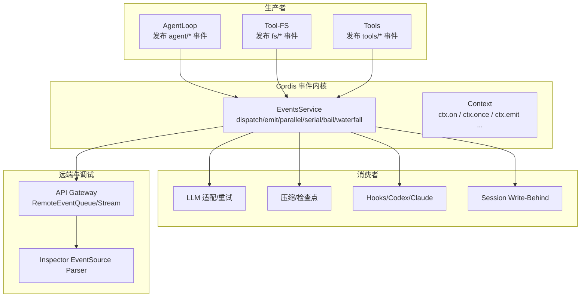
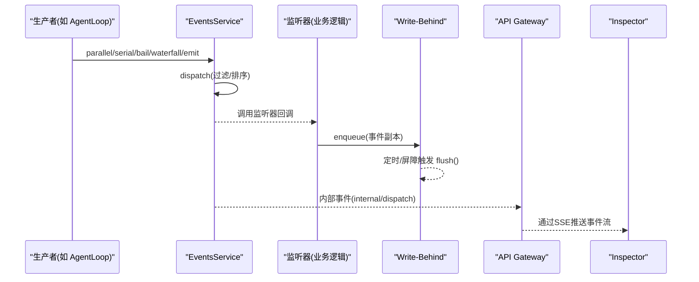
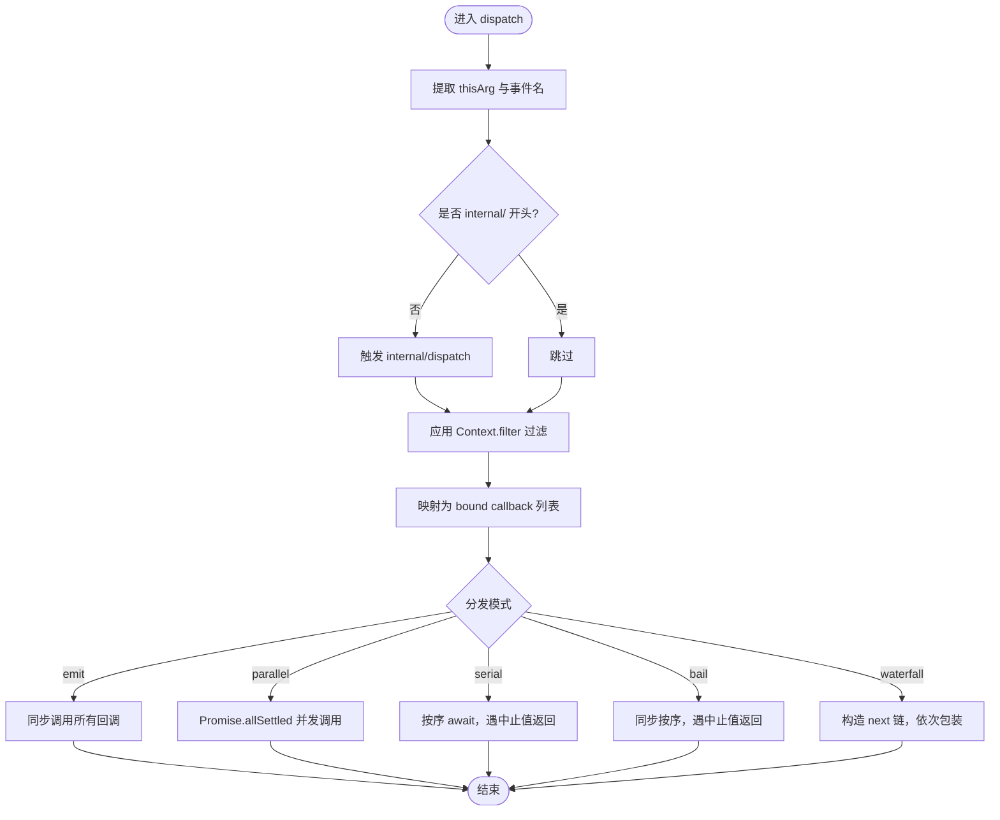
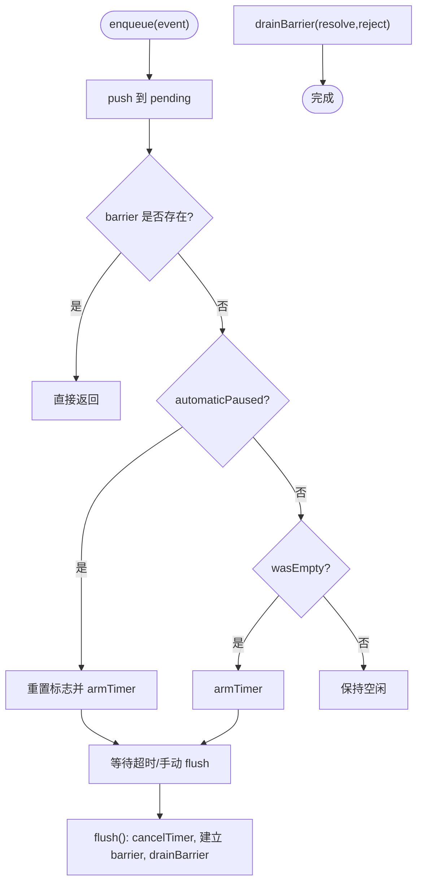
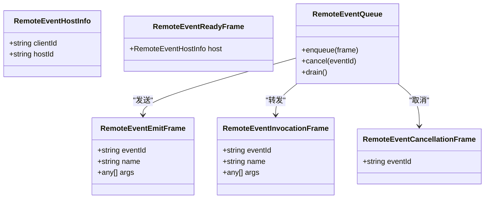
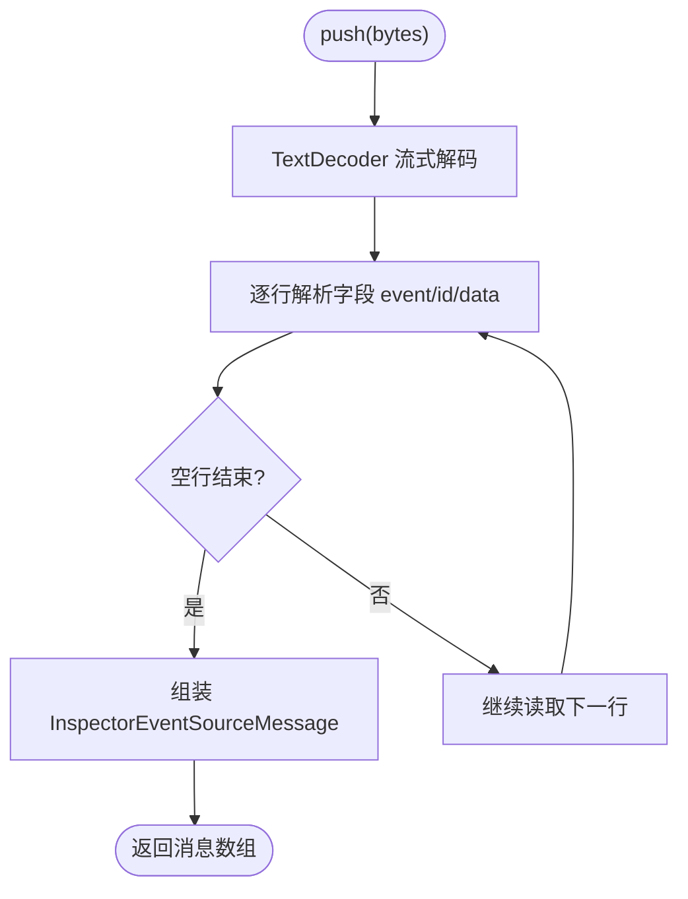
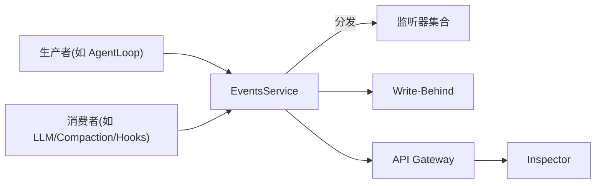

# 事件处理

<cite>
**本文引用的文件**
- [vendor/cordis/src/events.ts](file://vendor/cordis/src/events.ts)
- [docs/cordis-api/events.md](file://docs/cordis-api/events.md)
- [docs/event-producer-consumer.md](file://docs/event-producer-consumer.md)
- [packages/core/agent-loop/src/index.ts](file://packages/core/agent-loop/src/index.ts)
- [packages/session/session-persistence/src/write-behind.ts](file://packages/session/session-persistence/src/write-behind.ts)
- [packages/api/gateway/src/stream-protocol.ts](file://packages/api/gateway/src/stream-protocol.ts)
- [packages/api/gateway/src/index.ts](file://packages/api/gateway/src/index.ts)
- [packages/experimental/inspector/src/shared/network/event-source.ts](file://packages/experimental/inspector/src/shared/network/event-source.ts)
- [packages/session-query/tool-session-query/src/operations.ts](file://packages/session-query/tool-session-query/src/operations.ts)
</cite>

## 目录
1. [简介](#简介)
2. [项目结构](#项目结构)
3. [核心组件](#核心组件)
4. [架构总览](#架构总览)
5. [详细组件分析](#详细组件分析)
6. [依赖关系分析](#依赖关系分析)
7. [性能考虑](#性能考虑)
8. [故障排查指南](#故障排查指南)
9. [结论](#结论)
10. [附录](#附录)

## 简介
本文件面向 DeepSeek Harness 的事件处理系统，系统化说明事件的发布与订阅机制、事件队列管理与异步处理模型、处理器注册与调度执行流程、过滤/转换/路由机制、批处理与性能优化策略，以及监控调试工具与常见问题排查。文档以源码为依据，提供可追溯的章节来源与图示来源，帮助读者从概念到实现逐步掌握事件系统的用法与扩展方式。

## 项目结构
DeepSeek Harness 的事件系统由 Cordis 事件总线（EventsService）作为内核，各子系统通过 ctx.emit/parallel/serial/bail/waterfall 等方式发布事件；监听器通过 ctx.on/once 注册，支持上下文过滤、prepend 插入顺序、global 全局忽略过滤等选项。会话持久化层提供写后缓冲（Write-Behind）对事件进行批量落盘；API Gateway 提供远程事件流协议，配合 Inspector 的 SSE 解析器用于调试与观测。

**图表来源**
- [vendor/cordis/src/events.ts:131-319](file://vendor/cordis/src/events.ts#L131-L319)
- [packages/core/agent-loop/src/index.ts:180-379](file://packages/core/agent-loop/src/index.ts#L180-L379)
- [packages/session/session-persistence/src/write-behind.ts:35-78](file://packages/session/session-persistence/src/write-behind.ts#L35-L78)
- [packages/api/gateway/src/index.ts:889-920](file://packages/api/gateway/src/index.ts#L889-L920)
- [packages/experimental/inspector/src/shared/network/event-source.ts:1-78](file://packages/experimental/inspector/src/shared/network/event-source.ts#L1-L78)

**章节来源**
- [vendor/cordis/src/events.ts:131-319](file://vendor/cordis/src/events.ts#L131-L319)
- [docs/cordis-api/events.md:8-123](file://docs/cordis-api/events.md#L8-L123)
- [docs/event-producer-consumer.md:8-75](file://docs/event-producer-consumer.md#L8-L75)

## 核心组件
- 事件总线 EventsService：提供多种分发模式（emit、parallel、serial、bail、waterfall），统一注册/注销监听器，支持上下文过滤与 fiber 生命周期绑定。
- 上下文 API：ctx.emit/parallel/serial/bail/waterfall/on/once，暴露给所有子系统和插件。
- 事件清单与矩阵：生成式文档列出每个事件的声明位置、分发模式、生产者与消费者。
- 会话写后缓冲（Write-Behind）：将事件入队并定时批量写入，降低 I/O 压力。
- 远程事件协议（Gateway）：定义 RemoteEvent 帧类型与客户端队列，支持跨进程/网络的事件投递与取消。
- 调试与观测：Inspector 的 SSE 事件源解析器，以及工具化的事件追踪查询。

**章节来源**
- [vendor/cordis/src/events.ts:131-319](file://vendor/cordis/src/events.ts#L131-L319)
- [docs/cordis-api/events.md:8-123](file://docs/cordis-api/events.md#L8-L123)
- [docs/event-producer-consumer.md:8-75](file://docs/event-producer-consumer.md#L8-L75)
- [packages/session/session-persistence/src/write-behind.ts:35-78](file://packages/session/session-persistence/src/write-behind.ts#L35-L78)
- [packages/api/gateway/src/stream-protocol.ts:21-66](file://packages/api/gateway/src/stream-protocol.ts#L21-L66)
- [packages/experimental/inspector/src/shared/network/event-source.ts:1-78](file://packages/experimental/inspector/src/shared/network/event-source.ts#L1-L78)

## 架构总览
下图展示事件从生产到消费、再到持久化与远端同步的整体路径，包括过滤、路由、批处理与错误传播。

**图表来源**
- [vendor/cordis/src/events.ts:165-243](file://vendor/cordis/src/events.ts#L165-L243)
- [packages/session/session-persistence/src/write-behind.ts:45-72](file://packages/session/session-persistence/src/write-behind.ts#L45-L72)
- [packages/api/gateway/src/index.ts:889-920](file://packages/api/gateway/src/index.ts#L889-L920)
- [packages/experimental/inspector/src/shared/network/event-source.ts:19-43](file://packages/experimental/inspector/src/shared/network/event-source.ts#L19-L43)

## 详细组件分析

### 事件总线与分发模式（EventsService）
- 分发模式
  - emit：同步派发，不等待返回结果。
  - parallel：并发执行所有监听器，聚合异常为 AggregateError。
  - serial：按序 await，遇到“中止值”即停止。
  - bail：同步按序执行，遇到“中止值”即停止。
  - waterfall：最后一个参数为 next 延续，监听器包裹后续链，不调用 next 即否决。
- 监听器注册
  - on/once：在当前 fiber 下注册，自动随 fiber 销毁而释放；支持 prepend 和 global 选项。
- 上下文过滤
  - dispatch 时根据 thisArg 的 Context.filter 决定是否向某监听器投递。
- 内部事件
  - internal/dispatch：对外部非 internal 事件在投递前触发，便于观测与诊断。

**图表来源**
- [vendor/cordis/src/events.ts:165-243](file://vendor/cordis/src/events.ts#L165-L243)

**章节来源**
- [vendor/cordis/src/events.ts:131-319](file://vendor/cordis/src/events.ts#L131-L319)
- [docs/cordis-api/events.md:8-123](file://docs/cordis-api/events.md#L8-L123)

### 事件生产者与消费者矩阵
- 事件清单包含事件名、分发模式、声明位置、生产者与消费者。
- 典型事件
  - agent/*：AgentLoop 驱动的生命周期与状态事件。
  - session/*：会话创建、销毁、事件广播、flush 等。
  - tools/*：工具执行前后钩子与结果事件。
  - fs/*：文件系统操作意图与观察事件。
- 维护方式：由脚本从 TypeScript Program 中抽取，保证一致性。

**章节来源**
- [docs/event-producer-consumer.md:8-75](file://docs/event-producer-consumer.md#L8-L75)

### 会话写后缓冲（Write-Behind）
- 作用：将事件入队并延迟批量写入，减少频繁 I/O。
- 关键行为
  - enqueue：复制事件入队，首次有任务或恢复自动暂停时启动定时器。
  - flush：取消当前自动等待，建立 barrier 并串行 drain。
  - hasWork：指示是否有待处理工作。
- 适用场景：session/flush、session/event 等高吞吐事件落盘。

**图表来源**
- [packages/session/session-persistence/src/write-behind.ts:35-78](file://packages/session/session-persistence/src/write-behind.ts#L35-L78)

**章节来源**
- [packages/session/session-persistence/src/write-behind.ts:35-78](file://packages/session/session-persistence/src/write-behind.ts#L35-L78)

### 远程事件协议与客户端队列（API Gateway）
- 协议帧：RemoteEventHostInfo、RemoteEventReadyFrame、RemoteEventEmitFrame、RemoteEventInvocationFrame、RemoteEventCancellationFrame 等，用于跨进程/网络的事件同步。
- 客户端队列：RemoteEventQueue 管理待发送事件、重放与取消信号，保障可靠投递与幂等性。
- 使用方式：服务端通过事件总线产生事件，Gateway 将其序列化为帧并通过流传输；客户端接收并回放至本地事件系统。

**图表来源**
- [packages/api/gateway/src/stream-protocol.ts:21-66](file://packages/api/gateway/src/stream-protocol.ts#L21-L66)
- [packages/api/gateway/src/index.ts:889-920](file://packages/api/gateway/src/index.ts#L889-L920)

**章节来源**
- [packages/api/gateway/src/stream-protocol.ts:21-66](file://packages/api/gateway/src/stream-protocol.ts#L21-L66)
- [packages/api/gateway/src/index.ts:889-920](file://packages/api/gateway/src/index.ts#L889-L920)

### 调试与观测：Inspector 事件源解析器
- 功能：增量解析 Server-Sent Events（SSE）字节流，输出结构化消息（eventName、eventId、data）。
- 用途：捕获响应体中的事件流，供调试面板或自动化测试消费。

**图表来源**
- [packages/experimental/inspector/src/shared/network/event-source.ts:19-43](file://packages/experimental/inspector/src/shared/network/event-source.ts#L19-L43)

**章节来源**
- [packages/experimental/inspector/src/shared/network/event-source.ts:1-78](file://packages/experimental/inspector/src/shared/network/event-source.ts#L1-L78)

### 自定义事件处理器示例（步骤与要点）
以下为实现自定义事件处理器的推荐步骤与最佳实践（以代码片段路径代替具体代码内容）：
- 注册监听器
  - 使用 ctx.on(name, listener, options?) 或 ctx.once(...)，必要时设置 prepend 控制顺序，global 绕过上下文过滤。
  - 参考路径：[vendor/cordis/src/events.ts:288-318](file://vendor/cordis/src/events.ts#L288-L318)
- 选择分发模式
  - 需要并行无阻塞：ctx.parallel(...)
  - 需要顺序且可短路：ctx.serial(...) 或 ctx.bail(...)
  - 需要拦截/改写默认行为：ctx.waterfall(...)
  - 参考路径：[vendor/cordis/src/events.ts:183-243](file://vendor/cordis/src/events.ts#L183-L243)
- 错误处理与重试
  - 在监听器内捕获异常并记录日志；对于可重试错误，结合外部重试库或指数退避策略。
  - 对于并行模式，注意 AggregateError 聚合多个失败。
  - 参考路径：[vendor/cordis/src/events.ts:183-187](file://vendor/cordis/src/events.ts#L183-L187)
- 日志与可观测性
  - 利用 internal/dispatch 事件进行全量事件观测与审计。
  - 参考路径：[vendor/cordis/src/events.ts:165-175](file://vendor/cordis/src/events.ts#L165-L175)
- 批处理与持久化
  - 将事件入队到 Write-Behind，避免高频 I/O。
  - 参考路径：[packages/session/session-persistence/src/write-behind.ts:45-72](file://packages/session/session-persistence/src/write-behind.ts#L45-L72)
- 远端同步
  - 通过 API Gateway 的 RemoteEventQueue 将事件推送到远端客户端。
  - 参考路径：[packages/api/gateway/src/index.ts:889-920](file://packages/api/gateway/src/index.ts#L889-L920)

**章节来源**
- [vendor/cordis/src/events.ts:165-319](file://vendor/cordis/src/events.ts#L165-L319)
- [packages/session/session-persistence/src/write-behind.ts:45-72](file://packages/session/session-persistence/src/write-behind.ts#L45-L72)
- [packages/api/gateway/src/index.ts:889-920](file://packages/api/gateway/src/index.ts#L889-L920)

### 复杂事件处理逻辑：过滤、转换与路由
- 过滤：基于 Context.filter 决定监听器是否收到事件；可通过 global 选项强制接收。
- 转换：在 waterfall 模式中，监听器可修改参数或阻止后续链，实现路由与重写。
- 路由：结合事件名与数据字段，在不同监听器中分流处理；也可借助生成的事件清单定位目标。
- 参考路径：
  - 过滤与选项：[vendor/cordis/src/events.ts:112-117](file://vendor/cordis/src/events.ts#L112-L117)
  - 分发模式与 next 链：[vendor/cordis/src/events.ts:224-243](file://vendor/cordis/src/events.ts#L224-L243)
  - 事件清单：[docs/event-producer-consumer.md:8-75](file://docs/event-producer-consumer.md#L8-L75)

**章节来源**
- [vendor/cordis/src/events.ts:112-117](file://vendor/cordis/src/events.ts#L112-L117)
- [vendor/cordis/src/events.ts:224-243](file://vendor/cordis/src/events.ts#L224-L243)
- [docs/event-producer-consumer.md:8-75](file://docs/event-producer-consumer.md#L8-L75)

## 依赖关系分析
- 低耦合：事件总线与生产者/消费者通过事件名解耦，支持多对多关系。
- 内聚性：EventsService 集中实现分发与生命周期管理；Write-Behind 专注批处理与持久化。
- 外部依赖：API Gateway 依赖流协议；Inspector 依赖 SSE 解析。
- 循环依赖风险：通过事件名与接口契约避免直接模块耦合。

**图表来源**
- [vendor/cordis/src/events.ts:131-319](file://vendor/cordis/src/events.ts#L131-L319)
- [packages/core/agent-loop/src/index.ts:180-379](file://packages/core/agent-loop/src/index.ts#L180-L379)
- [packages/session/session-persistence/src/write-behind.ts:35-78](file://packages/session/session-persistence/src/write-behind.ts#L35-L78)
- [packages/api/gateway/src/index.ts:889-920](file://packages/api/gateway/src/index.ts#L889-L920)
- [packages/experimental/inspector/src/shared/network/event-source.ts:1-78](file://packages/experimental/inspector/src/shared/network/event-source.ts#L1-L78)

**章节来源**
- [vendor/cordis/src/events.ts:131-319](file://vendor/cordis/src/events.ts#L131-L319)
- [packages/core/agent-loop/src/index.ts:180-379](file://packages/core/agent-loop/src/index.ts#L180-L379)

## 性能考虑
- 选择合适的分发模式
  - 高吞吐、无副作用：优先 parallel。
  - 需要顺序与短路：serial 或 bail。
  - 需要拦截/改写：waterfall。
- 批处理与节流
  - 使用 Write-Behind 合并事件，降低 I/O 频率。
  - 合理设置最大延迟与 flush 时机，平衡实时性与吞吐。
- 远程事件
  - 使用 RemoteEventQueue 管理背压与重试，避免拥塞。
- 观测与调优
  - 通过 internal/dispatch 统计事件速率与耗时，识别瓶颈。
  - 结合 Inspector 的 SSE 解析器进行端到端链路观测。

[本节为通用指导，无需特定文件来源]

## 故障排查指南
- 事件未到达监听器
  - 检查 Context.filter 是否过滤了该监听器；必要时使用 global 选项。
  - 确认监听器已正确注册且在有效 fiber 生命周期内。
  - 参考路径：[vendor/cordis/src/events.ts:165-175](file://vendor/cordis/src/events.ts#L165-L175)
- 并行模式出现多个错误
  - 查看 AggregateError 中的 errors 列表，逐一定位失败原因。
  - 参考路径：[vendor/cordis/src/events.ts:183-187](file://vendor/cordis/src/events.ts#L183-L187)
- 持久化失败或堆积
  - 检查 Write-Behind 的 hasWork 与 flush 是否被调用；确认后台任务是否正常。
  - 参考路径：[packages/session/session-persistence/src/write-behind.ts:35-78](file://packages/session/session-persistence/src/write-behind.ts#L35-L78)
- 远端事件丢失或重复
  - 核对 RemoteEventQueue 的 enqueue/cancel/drain 流程；确认 eventId 唯一性与取消信号。
  - 参考路径：[packages/api/gateway/src/index.ts:889-920](file://packages/api/gateway/src/index.ts#L889-L920)
- 调试与取证
  - 使用 internal/dispatch 收集事件轨迹；结合 Inspector 的 SSE 解析器回放事件流。
  - 参考路径：[vendor/cordis/src/events.ts:165-175](file://vendor/cordis/src/events.ts#L165-L175)、[packages/experimental/inspector/src/shared/network/event-source.ts:19-43](file://packages/experimental/inspector/src/shared/network/event-source.ts#L19-L43)

**章节来源**
- [vendor/cordis/src/events.ts:165-187](file://vendor/cordis/src/events.ts#L165-L187)
- [packages/session/session-persistence/src/write-behind.ts:35-78](file://packages/session/session-persistence/src/write-behind.ts#L35-L78)
- [packages/api/gateway/src/index.ts:889-920](file://packages/api/gateway/src/index.ts#L889-L920)
- [packages/experimental/inspector/src/shared/network/event-source.ts:19-43](file://packages/experimental/inspector/src/shared/network/event-source.ts#L19-L43)

## 结论
DeepSeek Harness 的事件系统以 Cordis 事件总线为核心，提供灵活的分发模式、严格的上下文过滤与强大的生命周期管理；配合 Write-Behind 批处理与 API Gateway 的远程事件协议，实现了高性能、可扩展、可观测的事件处理体系。通过 internal/dispatch 与 Inspector 的 SSE 解析器，开发者可以高效地进行调试与性能优化。遵循本文的最佳实践，可在保证稳定性的同时，快速构建复杂的事件处理逻辑。

[本节为总结，无需特定文件来源]

## 附录
- 常用事件清单与矩阵：参见事件生产者与消费者矩阵，了解各事件的模式、声明位置与参与者。
- 事件追踪工具：通过工具化查询获取事件轨迹，辅助问题定位。
  - 参考路径：[packages/session-query/tool-session-query/src/operations.ts:200-214](file://packages/session-query/tool-session-query/src/operations.ts#L200-L214)

**章节来源**
- [docs/event-producer-consumer.md:8-75](file://docs/event-producer-consumer.md#L8-L75)
- [packages/session-query/tool-session-query/src/operations.ts:200-214](file://packages/session-query/tool-session-query/src/operations.ts#L200-L214)