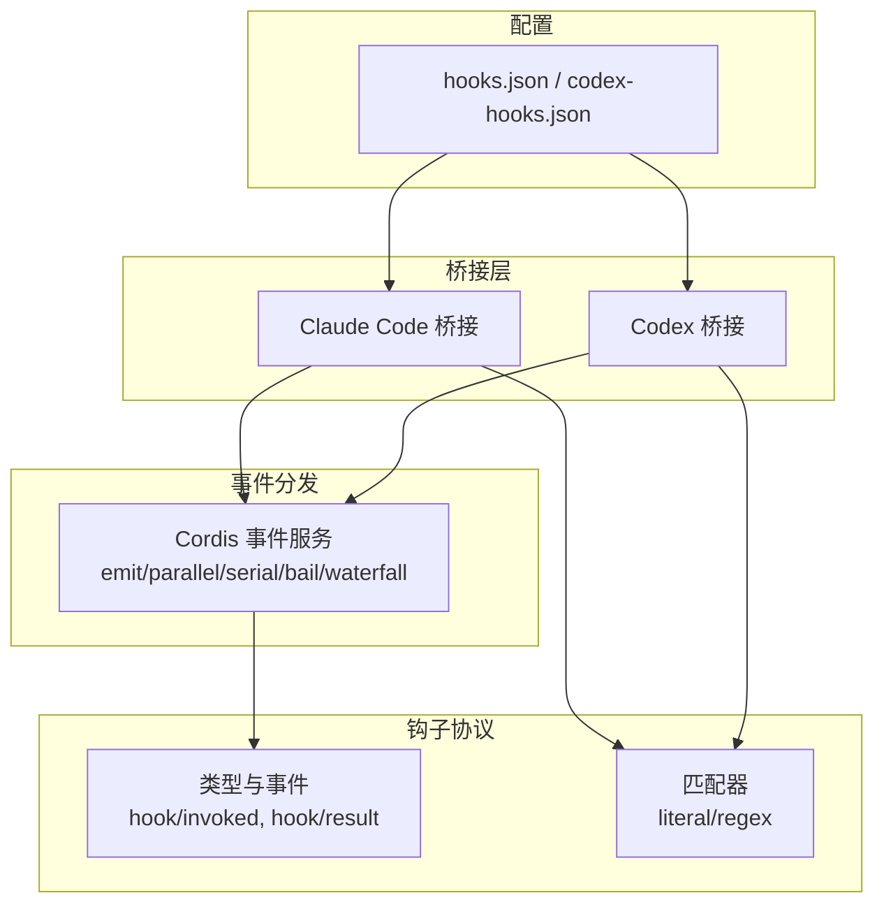
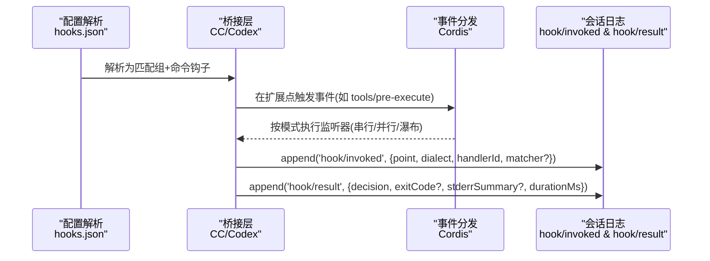
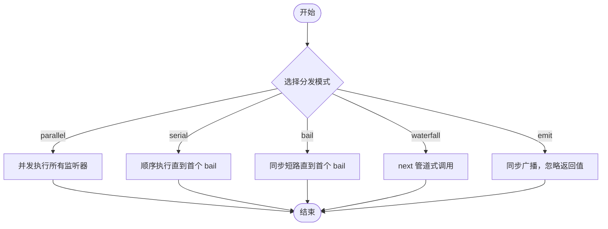
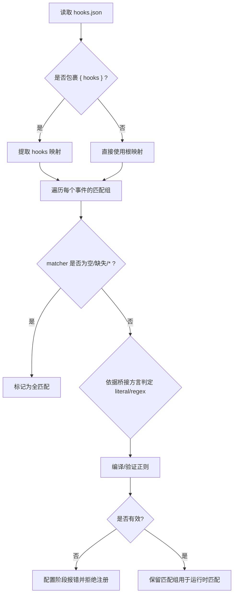
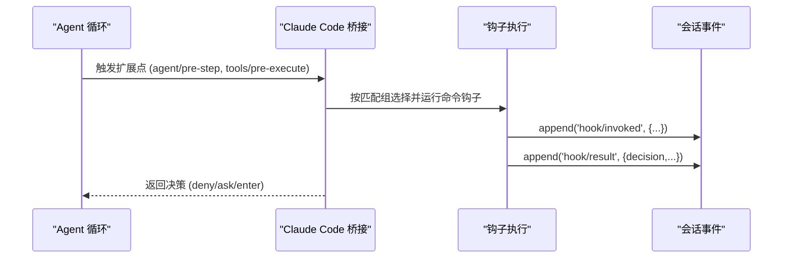
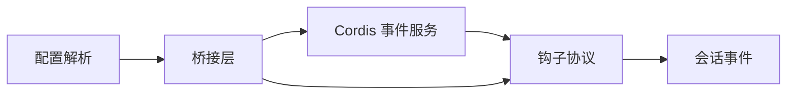

# 事件注册机制

<cite>
**本文引用的文件**
- [packages/hooks/hook-protocol/src/events.ts](file://packages/hooks/hook-protocol/src/events.ts)
- [packages/hooks/hook-protocol/src/types.ts](file://packages/hooks/hook-protocol/src/types.ts)
- [packages/hooks/hook-protocol/src/matcher.ts](file://packages/hooks/hook-protocol/src/matcher.ts)
- [packages/hooks/hooks-codex/src/config.ts](file://packages/hooks/hooks-codex/src/config.ts)
- [packages/hooks/hooks-claude-code/src/index.ts](file://packages/hooks/hooks-claude-code/src/index.ts)
- [docs/cordis-api/events.md](file://docs/cordis-api/events.md)
- [snapshots/session/hook-cc-invalid-matcher/workspace/hooks.json](file://snapshots/session/hook-cc-invalid-matcher/workspace/hooks.json)
- [snapshots/session/hook-codex-invalid-matcher/workspace/codex-hooks.json](file://snapshots/session/hook-codex-invalid-matcher/workspace/codex-hooks.json)
</cite>

## 目录
1. [简介](#简介)
2. [项目结构](#项目结构)
3. [核心组件](#核心组件)
4. [架构总览](#架构总览)
5. [详细组件分析](#详细组件分析)
6. [依赖关系分析](#依赖关系分析)
7. [性能考量](#性能考量)
8. [故障排查指南](#故障排查指南)
9. [结论](#结论)
10. [附录](#附录)

## 简介
本文件面向 DeepSeek Harness 的事件注册与钩子（Hook）系统，聚焦以下目标：
- 解释事件监听器的注册流程，包括串行与并行处理模式的配置选项。
- 说明事件类型定义、命名约定与版本兼容性管理。
- 描述如何通过配置文件声明事件监听器，包括钩子文件的结构与语法。
- 提供具体代码示例路径，展示如何注册 pre-tool、post-tool、prompt-submit 等关键钩子。
- 解释事件过滤与匹配机制，支持基于模式的事件选择和处理策略。
- 给出错误处理与异常恢复的最佳实践。

## 项目结构
围绕事件与钩子的核心实现分布在如下位置：
- 事件分发 API 与模式：由 Cordis 事件服务提供，包含 emit/parallel/serial/bail/waterfall 等分发模式，以及 on/once 注册接口。
- 钩子协议与类型：定义跨桥接（Claude Code/Codex）的通用事件、输出与匹配语义。
- 钩子桥接层：将外部工具调用或提示提交等扩展点映射到统一的钩子执行流程。
- 配置解析：将 hooks.json 等配置转换为可执行的匹配组与命令钩子。

图表来源
- [docs/cordis-api/events.md:8-123](file://docs/cordis-api/events.md#L8-L123)
- [packages/hooks/hook-protocol/src/types.ts:8-41](file://packages/hooks/hook-protocol/src/types.ts#L8-L41)
- [packages/hooks/hook-protocol/src/matcher.ts:1-29](file://packages/hooks/hook-protocol/src/matcher.ts#L1-L29)
- [packages/hooks/hooks-codex/src/config.ts:34-48](file://packages/hooks/hooks-codex/src/config.ts#L34-L48)

章节来源
- [docs/cordis-api/events.md:8-123](file://docs/cordis-api/events.md#L8-L123)
- [packages/hooks/hook-protocol/src/types.ts:8-41](file://packages/hooks/hook-protocol/src/types.ts#L8-L41)
- [packages/hooks/hook-protocol/src/matcher.ts:1-29](file://packages/hooks/hook-protocol/src/matcher.ts#L1-L29)
- [packages/hooks/hooks-codex/src/config.ts:34-48](file://packages/hooks/hooks-codex/src/config.ts#L34-L48)

## 核心组件
- 事件分发 API
  - 并发：ctx.parallel(name, ...args) 等待所有监听器完成。
  - 同步广播：ctx.emit(name, ...args) 不等待结果。
  - 串行短路：ctx.serial(name, ...args) 顺序等待，首个“bail”值即返回。
  - 同步短路：ctx.bail(name, ...args) 遇到首个同步 bail 值即停止。
  - 管道式：ctx.waterfall(name, ...args) 最后一个参数为 next，监听器可选择调用以继续链。
  - 注册：ctx.on(name, listener, options?) 与 ctx.once(name, listener, options?) 支持 prepend/global 选项。
- 钩子协议
  - 事件：hook/invoked（记录一次钩子调用）、hook/result（记录决策、退出码、stderr 摘要、耗时）。
  - 输出：HookOutput 统一表达 continue/decision/reason/additionalContext/systemMessage/updatedInput 等。
  - 匹配：MatcherGroup 表示 matcher + hooks；matcher 可为 literal 或 regex（依桥而定），空/缺失/* 表示全匹配。
- 桥接层
  - Claude Code 桥接：将 agent/pre-step、tools/pre-execute 等扩展点映射到 UserPromptSubmit、PreToolUse 等钩子事件。
  - Codex 桥接：解析 hooks.json，校验 matcher，生成可执行匹配组与命令钩子。

章节来源
- [docs/cordis-api/events.md:8-123](file://docs/cordis-api/events.md#L8-L123)
- [packages/hooks/hook-protocol/src/types.ts:8-41](file://packages/hooks/hook-protocol/src/types.ts#L8-L41)
- [packages/hooks/hook-protocol/src/types.ts:50-138](file://packages/hooks/hook-protocol/src/types.ts#L50-L138)
- [packages/hooks/hooks-claude-code/src/index.ts:217-244](file://packages/hooks/hooks-claude-code/src/index.ts#L217-L244)
- [packages/hooks/hooks-codex/src/config.ts:34-48](file://packages/hooks/hooks-codex/src/config.ts#L34-L48)

## 架构总览
下图展示了从配置到事件分发的完整链路：配置被解析为匹配组与命令钩子，桥接在扩展点触发时按匹配规则选择并运行钩子，随后通过会话事件持久化 invoked/result 对。

图表来源
- [packages/hooks/hooks-codex/src/config.ts:34-48](file://packages/hooks/hooks-codex/src/config.ts#L34-L48)
- [packages/hooks/hooks-claude-code/src/index.ts:217-244](file://packages/hooks/hooks-claude-code/src/index.ts#L217-L244)
- [packages/hooks/hook-protocol/src/events.ts:70-104](file://packages/hooks/hook-protocol/src/events.ts#L70-L104)
- [docs/cordis-api/events.md:8-123](file://docs/cordis-api/events.md#L8-L123)

## 详细组件分析

### 事件注册与分发模式
- 注册监听器
  - ctx.on(name, listener, options?): 在当前 fiber 下注册监听器，支持 prepend（前置）与 global（忽略上下文过滤）。
  - ctx.once(name, listener, options?): 仅触发一次的监听器。
- 分发模式
  - parallel：并发执行所有监听器，全部完成后 resolve。
  - serial：顺序执行，遇到首个非空/非 false/非 undefined 返回值即停止。
  - bail：同步短路，遇到首个同步 bail 值即停止。
  - waterfall：最后一个参数为 next，监听器可选择调用以继续后续监听器。
  - emit：同步广播，忽略返回值。

图表来源
- [docs/cordis-api/events.md:8-123](file://docs/cordis-api/events.md#L8-L123)

章节来源
- [docs/cordis-api/events.md:8-123](file://docs/cordis-api/events.md#L8-L123)

### 钩子配置与匹配机制
- 配置结构
  - hooks.json / codex-hooks.json：顶层可包裹 { hooks: … } 或直接为事件映射。
  - 每个事件为一个数组，元素为匹配组：{ matcher?: string; hooks: CommandHook[] }。
  - CommandHook：{ type: 'command', command, timeoutSec? }。
- 匹配规则
  - 空/缺失/* 表示全匹配。
  - Claude Code：纯字母数字/下划线/竖线的字面量模式（竖线分隔精确匹配），否则视为正则。
  - Codex：非空模式一律视为未锚定正则。
  - 无效正则：配置阶段抛出诊断错误，阻止监听器注册；运行时非法正则作为不匹配处理。
- 特殊事件
  - UserPromptSubmit、Stop 无匹配主体，其 matcher 字段会被丢弃。

图表来源
- [packages/hooks/hooks-codex/src/config.ts:34-48](file://packages/hooks/hooks-codex/src/config.ts#L34-L48)
- [packages/hooks/hook-protocol/src/matcher.ts:1-29](file://packages/hooks/hook-protocol/src/matcher.ts#L1-L29)
- [snapshots/session/hook-cc-invalid-matcher/workspace/hooks.json:1-19](file://snapshots/session/hook-cc-invalid-matcher/workspace/hooks.json#L1-L19)
- [snapshots/session/hook-codex-invalid-matcher/workspace/codex-hooks.json:1-19](file://snapshots/session/hook-codex-invalid-matcher/workspace/codex-hooks.json#L1-L19)

章节来源
- [packages/hooks/hooks-codex/src/config.ts:34-48](file://packages/hooks/hooks-codex/src/config.ts#L34-L48)
- [packages/hooks/hook-protocol/src/matcher.ts:1-29](file://packages/hooks/hook-protocol/src/matcher.ts#L1-L29)
- [snapshots/session/hook-cc-invalid-matcher/workspace/hooks.json:1-19](file://snapshots/session/hook-cc-invalid-matcher/workspace/hooks.json#L1-L19)
- [snapshots/session/hook-codex-invalid-matcher/workspace/codex-hooks.json:1-19](file://snapshots/session/hook-codex-invalid-matcher/workspace/codex-hooks.json#L1-L19)

### 桥接与扩展点映射
- Claude Code 桥接
  - 将 agent/pre-step 映射为 UserPromptSubmit（提示文本为负载，无匹配主体）。
  - 将 tools/pre-execute 映射为 PreToolUse（匹配主体为工具名）。
  - 根据合并后的决策决定 deny/ask/enter 等行为。
- 事件持久化
  - 每次钩子调用写入 hook/invoked（turn、point、dialect、handlerId、可选 matcher）。
  - 钩子结束后写入 hook/result（decision、exitCode、stderrSummary、durationMs）。

图表来源
- [packages/hooks/hooks-claude-code/src/index.ts:217-244](file://packages/hooks/hooks-claude-code/src/index.ts#L217-L244)
- [packages/hooks/hook-protocol/src/events.ts:70-104](file://packages/hooks/hook-protocol/src/events.ts#L70-L104)

章节来源
- [packages/hooks/hooks-claude-code/src/index.ts:217-244](file://packages/hooks/hooks-claude-code/src/index.ts#L217-L244)
- [packages/hooks/hook-protocol/src/events.ts:70-104](file://packages/hooks/hook-protocol/src/events.ts#L70-L104)

### 事件类型、命名约定与版本兼容
- 事件命名
  - 会话级日志事件：hook/invoked、hook/result，属于 log-only 事件，不携带 surfaceOp。
  - 桥接事件名：UserPromptSubmit、PreToolUse 等，由桥接层统一暴露给上层。
- 版本兼容
  - 桥接层负责将不同协议的输出归一化为 HookOutput，屏蔽差异。
  - 对于不支持或异步的钩子类型，解析阶段会跳过并记录原因，避免启动失败。
  - 配置解析对未知事件与畸形条目采取忽略策略，增强鲁棒性。

章节来源
- [packages/hooks/hook-protocol/src/types.ts:8-41](file://packages/hooks/hook-protocol/src/types.ts#L8-L41)
- [packages/hooks/hook-protocol/src/types.ts:50-138](file://packages/hooks/hook-protocol/src/types.ts#L50-L138)
- [packages/hooks/hooks-codex/src/config.ts:34-48](file://packages/hooks/hooks-codex/src/config.ts#L34-L48)

### 通过配置文件声明事件监听器
- 基本结构
  - 顶层可包裹 { hooks: … } 或直接为事件映射。
  - 每个事件对应一个数组，元素为匹配组 { matcher?, hooks: CommandHook[] }。
  - CommandHook 至少包含 type: 'command' 与 command。
- 示例参考
  - Claude Code 快照：[hooks.json:1-19](file://snapshots/session/hook-cc-invalid-matcher/workspace/hooks.json#L1-L19)
  - Codex 快照：[codex-hooks.json:1-19](file://snapshots/session/hook-codex-invalid-matcher/workspace/codex-hooks.json#L1-L19)
- 关键要点
  - 无 matcher 或 matcher 为空/缺失/* 表示全匹配。
  - 无效正则会在配置阶段报错，阻止注册。
  - UserPromptSubmit、Stop 的 matcher 会被丢弃。

章节来源
- [snapshots/session/hook-cc-invalid-matcher/workspace/hooks.json:1-19](file://snapshots/session/hook-cc-invalid-matcher/workspace/hooks.json#L1-L19)
- [snapshots/session/hook-codex-invalid-matcher/workspace/codex-hooks.json:1-19](file://snapshots/session/hook-codex-invalid-matcher/workspace/codex-hooks.json#L1-L19)
- [packages/hooks/hooks-codex/src/config.ts:34-48](file://packages/hooks/hooks-codex/src/config.ts#L34-L48)

### 注册不同类型的事件监听器（示例路径）
- prompt-submit（UserPromptSubmit）
  - 在 Claude Code 桥接中，agent/pre-step 被映射为 UserPromptSubmit，使用提示文本作为负载，无匹配主体。
  - 参考：[hooks-claude-code/src/index.ts:217-244](file://packages/hooks/hooks-claude-code/src/index.ts#L217-L244)
- pre-tool（PreToolUse）
  - 在 Claude Code 桥接中，tools/pre-execute 被映射为 PreToolUse，匹配主体为工具名。
  - 参考：[hooks-claude-code/src/index.ts:237-244](file://packages/hooks/hooks-claude-code/src/index.ts#L237-L244)
- post-tool
  - 可通过在配置中为相应事件添加匹配组与命令钩子来实现；若需特定后处理逻辑，可在桥接层扩展对应事件。
  - 参考配置结构：[hooks-codex/src/config.ts:34-48](file://packages/hooks/hooks-codex/src/config.ts#L34-L48)
- 事件注册 API
  - 使用 ctx.on(ctx.once) 注册监听器，并通过 ctx.parallel/serial/bail/waterfall/emit 控制执行模式。
  - 参考：[events.md:8-123](file://docs/cordis-api/events.md#L8-L123)

章节来源
- [packages/hooks/hooks-claude-code/src/index.ts:217-244](file://packages/hooks/hooks-claude-code/src/index.ts#L217-L244)
- [packages/hooks/hooks-codex/src/config.ts:34-48](file://packages/hooks/hooks-codex/src/config.ts#L34-L48)
- [docs/cordis-api/events.md:8-123](file://docs/cordis-api/events.md#L8-L123)

### 事件过滤与匹配机制
- 匹配模式
  - 全匹配：空/缺失/*。
  - 字面量（Claude Code）：仅字母数字/下划线/竖线，竖线分隔多个精确值。
  - 正则（Codex 与 Claude Code 的非字面量）：未锚定匹配。
- 运行时行为
  - 无效正则在配置阶段报错；运行时非法正则视为不匹配。
  - 匹配成功后，按配置中的 hooks 列表依次执行命令钩子。
- 特殊事件
  - UserPromptSubmit、Stop 无匹配主体，其 matcher 字段会被丢弃。

章节来源
- [packages/hooks/hook-protocol/src/matcher.ts:1-29](file://packages/hooks/hook-protocol/src/matcher.ts#L1-L29)
- [packages/hooks/hooks-codex/src/config.ts:34-48](file://packages/hooks/hooks-codex/src/config.ts#L34-L48)

### 错误处理与异常恢复最佳实践
- 配置阶段
  - 无效正则立即抛出诊断错误，阻止监听器注册，避免运行时不可预期行为。
  - 未知事件与畸形条目被忽略，保证启动稳定性。
- 运行时
  - 钩子输出通过 HookOutput 统一表达，decision/continue/reason 等字段决定后续流程。
  - stderr 摘要有字符上限，避免日志膨胀。
  - 会话事件 hook/invoked 与 hook/result 成对记录，便于审计与回溯。
- 建议
  - 在钩子中捕获异常并返回明确的 decision/continue/reason，确保上游能正确恢复。
  - 合理设置超时与资源清理，避免阻塞主流程。
  - 使用全局监听器（global）需谨慎，避免绕过上下文过滤导致副作用。

章节来源
- [packages/hooks/hook-protocol/src/types.ts:82-138](file://packages/hooks/hook-protocol/src/types.ts#L82-L138)
- [packages/hooks/hook-protocol/src/events.ts:70-104](file://packages/hooks/hook-protocol/src/events.ts#L70-L104)
- [packages/hooks/hooks-codex/src/config.ts:34-48](file://packages/hooks/hooks-codex/src/config.ts#L34-L48)

## 依赖关系分析
- 事件分发依赖 Cordis 事件服务，提供多种执行模式与注册能力。
- 钩子协议定义跨桥接的统一事件与输出，降低耦合。
- 桥接层依赖配置解析与匹配器，将扩展点映射到统一事件。
- 会话事件用于持久化钩子调用与结果，支撑审计与调试。

图表来源
- [docs/cordis-api/events.md:8-123](file://docs/cordis-api/events.md#L8-L123)
- [packages/hooks/hook-protocol/src/types.ts:8-41](file://packages/hooks/hook-protocol/src/types.ts#L8-L41)
- [packages/hooks/hooks-codex/src/config.ts:34-48](file://packages/hooks/hooks-codex/src/config.ts#L34-L48)

章节来源
- [docs/cordis-api/events.md:8-123](file://docs/cordis-api/events.md#L8-L123)
- [packages/hooks/hook-protocol/src/types.ts:8-41](file://packages/hooks/hook-protocol/src/types.ts#L8-L41)
- [packages/hooks/hooks-codex/src/config.ts:34-48](file://packages/hooks/hooks-codex/src/config.ts#L34-L48)

## 性能考量
- 并发 vs 串行
  - 高吞吐场景优先使用 parallel，但需注意监听器间的竞态与资源竞争。
  - 需要严格顺序或短路控制的场景使用 serial/bail。
- 匹配开销
  - 复杂正则可能带来匹配成本，尽量使用字面量或简化模式。
- 日志体积
  - stderr 摘要已做截断，但仍应避免在钩子中输出大量数据。
- 超时与资源
  - 为命令钩子设置合理超时，及时释放资源，防止阻塞。

## 故障排查指南
- 配置阶段报错
  - 检查 hooks.json 中的 matcher 是否为合法正则；Claude Code 的字面量模式需符合规范。
  - 参考无效匹配器快照进行对比：[hooks.json:1-19](file://snapshots/session/hook-cc-invalid-matcher/workspace/hooks.json#L1-L19)、[codex-hooks.json:1-19](file://snapshots/session/hook-codex-invalid-matcher/workspace/codex-hooks.json#L1-L19)。
- 钩子未触发
  - 确认事件名称与匹配主体是否正确（如 PreToolUse 的工具名）。
  - 检查 UserPromptSubmit、Stop 的 matcher 是否被丢弃。
- 行为不符合预期
  - 查看 hook/invoked 与 hook/result 事件，核对 decision、exitCode、stderrSummary、durationMs。
  - 检查钩子输出是否符合 HookOutput 约定。

章节来源
- [snapshots/session/hook-cc-invalid-matcher/workspace/hooks.json:1-19](file://snapshots/session/hook-cc-invalid-matcher/workspace/hooks.json#L1-L19)
- [snapshots/session/hook-codex-invalid-matcher/workspace/codex-hooks.json:1-19](file://snapshots/session/hook-codex-invalid-matcher/workspace/codex-hooks.json#L1-L19)
- [packages/hooks/hook-protocol/src/events.ts:70-104](file://packages/hooks/hook-protocol/src/events.ts#L70-L104)
- [packages/hooks/hook-protocol/src/types.ts:82-138](file://packages/hooks/hook-protocol/src/types.ts#L82-L138)

## 结论
DeepSeek Harness 的事件注册与钩子系统通过 Cordis 事件服务提供灵活的分发模式，配合统一的钩子协议与桥接层，实现了跨方言的一致性与可扩展性。配置驱动的匹配机制使事件选择清晰可控，会话事件提供了完整的审计与回溯能力。遵循本文的最佳实践，可以在保证稳定性的同时获得良好的性能与可维护性。

## 附录
- 事件 API 参考：[events.md:8-123](file://docs/cordis-api/events.md#L8-L123)
- 钩子协议类型：[types.ts:8-138](file://packages/hooks/hook-protocol/src/types.ts#L8-138)
- 匹配器实现：[matcher.ts:1-29](file://packages/hooks/hook-protocol/src/matcher.ts#L1-L29)
- 配置解析：[config.ts:34-48](file://packages/hooks/hooks-codex/src/config.ts#L34-L48)
- 桥接映射：[hooks-claude-code/index.ts:217-244](file://packages/hooks/hooks-claude-code/src/index.ts#L217-L244)
- 配置样例：[hooks.json:1-19](file://snapshots/session/hook-cc-invalid-matcher/workspace/hooks.json#L1-L19)、[codex-hooks.json:1-19](file://snapshots/session/hook-codex-invalid-matcher/workspace/codex-hooks.json#L1-L19)