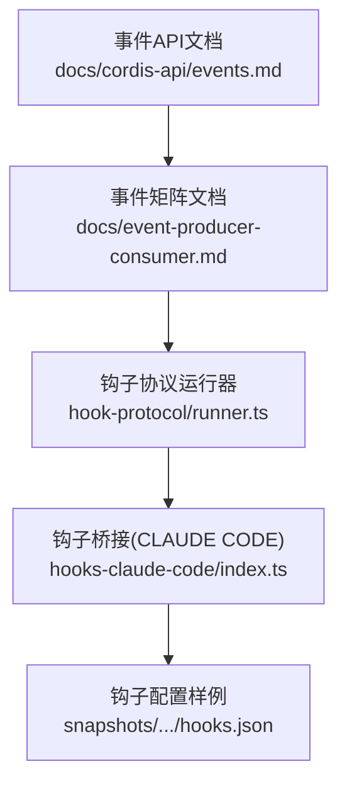
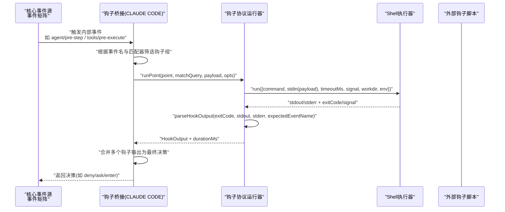
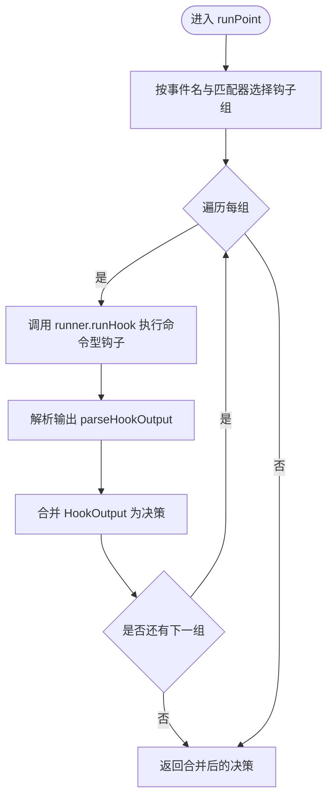
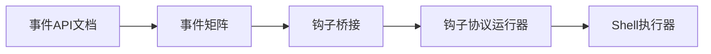

# 事件系统扩展

<cite>
**本文引用的文件**
- [packages/hooks/hook-protocol/src/runner.ts](file://packages/hooks/hook-protocol/src/runner.ts)
- [packages/hooks/hooks-claude-code/src/index.ts](file://packages/hooks/hooks-claude-code/src/index.ts)
- [docs/cordis-api/events.md](file://docs/cordis-api/events.md)
- [docs/event-producer-consumer.md](file://docs/event-producer-consumer.md)
- [snapshots/session/hook-cc-invalid-matcher/workspace/hooks.json](file://snapshots/session/hook-cc-invalid-matcher/workspace/hooks.json)
- [snapshots/session/hook-codex-invalid-matcher/workspace/codex-hooks.json](file://snapshots/session/hook-codex-invalid-matcher/workspace/codex-hooks.json)
</cite>

## 目录
1. [简介](#简介)
2. [项目结构](#项目结构)
3. [核心组件](#核心组件)
4. [架构总览](#架构总览)
5. [详细组件分析](#详细组件分析)
6. [依赖关系分析](#依赖关系分析)
7. [性能考虑](#性能考虑)
8. [故障排查指南](#故障排查指南)
9. [结论](#结论)
10. [附录](#附录)

## 简介
本文件面向 DeepSeek Harness 的事件系统扩展，聚焦以下目标：
- 事件监听器的注册机制与串行/并行处理模式配置与使用
- 事件类型定义、发布与订阅的完整流程
- 钩子系统（hooks）工作原理，包括 pre-tool、post-tool、prompt-submit 等关键钩子的触发时机与执行顺序
- 事件过滤与匹配机制，支持基于模式的事件选择和处理
- 具体示例路径，展示如何注册监听器、处理不同类型事件以及实现复杂逻辑
- 性能优化建议：批量处理、异步处理、错误恢复策略
- 调试与监控事件系统的工具与方法

## 项目结构
围绕事件系统与钩子，仓库中相关的关键位置如下：
- 事件分发 API 文档：提供 ctx.emit、ctx.parallel、ctx.serial、ctx.bail、ctx.waterfall、ctx.on、ctx.once 等能力说明
- 事件生产者/消费者矩阵：列出各子系统声明、派发与监听的事件及模式
- 钩子协议运行器：负责以 shell 方式执行命令型钩子，解析输出并上报时长
- 钩子桥接实现（Claude Code）：将内部事件映射到 hooks 点（如 PreToolUse、UserPromptSubmit），并驱动匹配与合并结果
- 快照配置：包含不同场景下的 hooks.json 配置样例，用于验证匹配器与行为

图表来源
- [docs/cordis-api/events.md:8-123](file://docs/cordis-api/events.md#L8-L123)
- [docs/event-producer-consumer.md:8-66](file://docs/event-producer-consumer.md#L8-L66)
- [packages/hooks/hook-protocol/src/runner.ts:22-107](file://packages/hooks/hook-protocol/src/runner.ts#L22-L107)
- [packages/hooks/hooks-claude-code/src/index.ts:128-244](file://packages/hooks/hooks-claude-code/src/index.ts#L128-L244)
- [snapshots/session/hook-cc-invalid-matcher/workspace/hooks.json:1-19](file://snapshots/session/hook-cc-invalid-matcher/workspace/hooks.json#L1-L19)

章节来源
- [docs/cordis-api/events.md:8-123](file://docs/cordis-api/events.md#L8-L123)
- [docs/event-producer-consumer.md:8-66](file://docs/event-producer-consumer.md#L8-L66)

## 核心组件
- 事件分发 API（Cordis）
  - 并发模式：parallel（全部并行等待）、emit（同步忽略返回值）
  - 顺序控制：serial（按序等待直到某个监听器返回“中止值”）、bail（同步短路）、waterfall（链式 next 包装）
  - 监听器注册：on/once，支持 prepend/global 选项
- 事件矩阵
  - 明确每个事件的声明方、派发方、监听方与派发模式
  - 例如 agent/pre-step、tools/pre-execute、tools/post-execute、agent/turn-stopping 等由 hooks 桥接参与
- 钩子协议运行器
  - 通过 shell 执行命令型钩子，注入 payload、环境变量、工作目录、超时与取消信号
  - 解析钩子输出（含 hookSpecificOutput），记录耗时，异常转为非阻塞错误
- 钩子桥接（Claude Code）
  - 将内部事件映射为 hooks 点：UserPromptSubmit → agent/pre-step；PreToolUse → tools/pre-execute
  - 对每个事件组进行匹配器筛选，收集多个钩子输出并合并决策（deny/ask/enter 等）

章节来源
- [docs/cordis-api/events.md:8-123](file://docs/cordis-api/events.md#L8-L123)
- [docs/event-producer-consumer.md:18-66](file://docs/event-producer-consumer.md#L18-L66)
- [packages/hooks/hook-protocol/src/runner.ts:22-107](file://packages/hooks/hook-protocol/src/runner.ts#L22-L107)
- [packages/hooks/hooks-claude-code/src/index.ts:128-244](file://packages/hooks/hooks-claude-code/src/index.ts#L128-L244)

## 架构总览
下图展示了从事件产生到钩子执行的端到端流程，涵盖事件矩阵中的关键事件与钩子桥接。

图表来源
- [docs/event-producer-consumer.md:18-66](file://docs/event-producer-consumer.md#L18-L66)
- [packages/hooks/hooks-claude-code/src/index.ts:128-244](file://packages/hooks/hooks-claude-code/src/index.ts#L128-L244)
- [packages/hooks/hook-protocol/src/runner.ts:67-107](file://packages/hooks/hook-protocol/src/runner.ts#L67-L107)

## 详细组件分析

### 事件监听器注册与分发模式
- 注册监听器
  - ctx.on(name, listener, options?)：在当前 fiber 下注册监听器，支持 prepend/global
  - ctx.once(name, listener, options?)：仅触发一次的监听器
- 分发模式
  - emit：同步调用，忽略返回值
  - parallel：所有监听器并发执行，Promise.all 等待
  - serial：按序等待，遇到首个“中止值”即停止
  - bail：同步短路，遇到首个“中止值”立即返回
  - waterfall：链式 next，允许拦截或改写后续行为

章节来源
- [docs/cordis-api/events.md:8-123](file://docs/cordis-api/events.md#L8-L123)

### 事件类型定义、发布与订阅流程
- 事件类型与模式在事件矩阵中集中维护，便于追踪声明、派发与监听关系
- 典型流程
  - 声明：子系统在类型中声明事件
  - 派发：核心模块按模式调用 ctx.* 方法
  - 订阅：其他模块通过 ctx.on/once 注册监听器
- 示例关注点
  - agent/pre-step：waterfall 模式，适合上下文注入与决策拦截
  - tools/pre-execute/tools/post-execute：waterfall 模式，适合工具执行前后钩子
  - agent/turn-stopping：serial 模式，适合有序清理或中断

章节来源
- [docs/event-producer-consumer.md:18-66](file://docs/event-producer-consumer.md#L18-L66)

### 钩子系统（hooks）工作原理与执行顺序
- 关键钩子点
  - UserPromptSubmit：对应 agent/pre-step，用于在用户提示提交前注入上下文或拒绝
  - PreToolUse：对应 tools/pre-execute，用于工具执行前的校验、审批或改写
  - PostToolUse：对应 tools/post-execute，用于工具执行后的审计、统计或副作用处理
- 执行顺序
  - 桥接层按事件名与匹配器筛选出多组钩子
  - 每组内依次执行命令型钩子，收集 HookOutput
  - 合并多个钩子输出形成最终决策（deny/ask/enter 等）
- 超时与取消
  - 默认超时时间来自协议层常量，可通过 per-hook 配置覆盖
  - 通过 AbortSignal 支持上层取消

章节来源
- [packages/hooks/hooks-claude-code/src/index.ts:128-244](file://packages/hooks/hooks-claude-code/src/index.ts#L128-L244)
- [packages/hooks/hook-protocol/src/runner.ts:22-47](file://packages/hooks/hook-protocol/src/runner.ts#L22-L47)

### 事件过滤与匹配机制
- 匹配器作用域
  - 针对特定事件（如 PreToolUse）的匹配查询（matchQuery）通常是工具名或会话来源
  - 某些事件（如 UserPromptSubmit）忽略匹配器主体
- 配置结构
  - hooks.json 中以事件名为键，值为匹配器与钩子列表
  - 匹配器失败时该组钩子不执行
- 无效匹配器处理
  - 当正则表达式非法时，桥接层会发出警告并跳过该组

章节来源
- [snapshots/session/hook-cc-invalid-matcher/workspace/hooks.json:1-19](file://snapshots/session/hook-cc-invalid-matcher/workspace/hooks.json#L1-L19)
- [snapshots/session/hook-codex-invalid-matcher/workspace/codex-hooks.json:1-19](file://snapshots/session/hook-codex-invalid-matcher/workspace/codex-hooks.json#L1-L19)
- [packages/hooks/hooks-claude-code/src/index.ts:128-151](file://packages/hooks/hooks-claude-code/src/index.ts#L128-L151)

### 代码级流程图：钩子执行与输出解析

图表来源
- [packages/hooks/hooks-claude-code/src/index.ts:128-244](file://packages/hooks/hooks-claude-code/src/index.ts#L128-L244)
- [packages/hooks/hook-protocol/src/runner.ts:67-107](file://packages/hooks/hook-protocol/src/runner.ts#L67-L107)

## 依赖关系分析
- 事件矩阵定义了跨包的事件依赖关系，确保事件生产与消费的可追溯性
- 钩子桥接依赖事件矩阵中的关键事件（如 agent/pre-step、tools/pre-execute）
- 钩子协议运行器依赖 ShellExecutor 完成命令执行，并通过 codec 解析输出

图表来源
- [docs/cordis-api/events.md:8-123](file://docs/cordis-api/events.md#L8-L123)
- [docs/event-producer-consumer.md:18-66](file://docs/event-producer-consumer.md#L18-L66)
- [packages/hooks/hook-protocol/src/runner.ts:67-107](file://packages/hooks/hook-protocol/src/runner.ts#L67-L107)

章节来源
- [docs/event-producer-consumer.md:18-66](file://docs/event-producer-consumer.md#L18-L66)

## 性能考虑
- 批量处理
  - 对于高频事件（如 session/flush），优先使用 parallel 模式聚合处理
  - 对工具执行前后事件（pre/post-execute）可结合批处理减少 I/O 开销
- 异步处理
  - 使用 parallel 并发执行无状态监听器，缩短整体延迟
  - 对长耗时任务（如外部脚本）设置合理超时与取消信号
- 错误恢复
  - 钩子执行异常应视为非阻塞错误，避免影响主流程
  - 对非法匹配器进行告警并跳过，保证系统稳定性
- 资源限制
  - 通过 defaultTimeoutMs 与 per-hook timeoutSec 控制资源占用
  - 使用 AbortSignal 及时终止长时间运行的钩子

[本节为通用指导，无需特定文件引用]

## 故障排查指南
- 常见症状
  - 钩子未触发：检查事件名与匹配器是否正确；确认事件矩阵中该事件是否存在
  - 钩子执行超时：调整 defaultTimeoutMs 或 per-hook timeoutSec
  - 正则匹配器报错：修正 hooks.json 中的 matcher 表达式
- 定位步骤
  - 查看事件矩阵，确认事件派发与监听关系
  - 检查桥接层日志，确认 runPoint 是否被调用
  - 检查 runner 输出，确认 parseHookOutput 是否成功解析
- 参考路径
  - 事件API与模式：docs/cordis-api/events.md
  - 事件矩阵：docs/event-producer-consumer.md
  - 钩子运行器：packages/hooks/hook-protocol/src/runner.ts
  - 钩子桥接：packages/hooks/hooks-claude-code/src/index.ts
  - 配置样例：snapshots/session/*/hooks.json

章节来源
- [docs/cordis-api/events.md:8-123](file://docs/cordis-api/events.md#L8-L123)
- [docs/event-producer-consumer.md:18-66](file://docs/event-producer-consumer.md#L18-L66)
- [packages/hooks/hook-protocol/src/runner.ts:67-107](file://packages/hooks/hook-protocol/src/runner.ts#L67-L107)
- [packages/hooks/hooks-claude-code/src/index.ts:128-244](file://packages/hooks/hooks-claude-code/src/index.ts#L128-L244)
- [snapshots/session/hook-cc-invalid-matcher/workspace/hooks.json:1-19](file://snapshots/session/hook-cc-invalid-matcher/workspace/hooks.json#L1-L19)

## 结论
DeepSeek Harness 的事件系统通过 Cordis 提供了灵活的分发模式（emit/parallel/serial/bail/waterfall），配合事件矩阵实现了清晰的解耦与可观测性。钩子系统以命令型脚本为核心，借助协议运行器统一执行与解析，桥接层将内部事件映射为 hooks 点，支持强大的匹配与决策合并。通过合理的超时、取消与错误恢复策略，可在高吞吐场景下保持稳健与高效。

[本节为总结，无需特定文件引用]

## 附录
- 快速参考：事件模式与用途
  - emit：轻量通知，无需等待
  - parallel：并发聚合，降低尾延迟
  - serial：顺序处理，首个“中止值”短路
  - bail：同步短路，快速失败
  - waterfall：链式拦截与改写
- 钩子关键点
  - UserPromptSubmit：在提示提交前注入上下文或拒绝
  - PreToolUse：工具执行前校验、审批或改写
  - PostToolUse：工具执行后审计、统计或副作用处理

[本节为补充信息，无需特定文件引用]