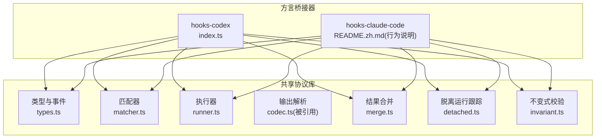
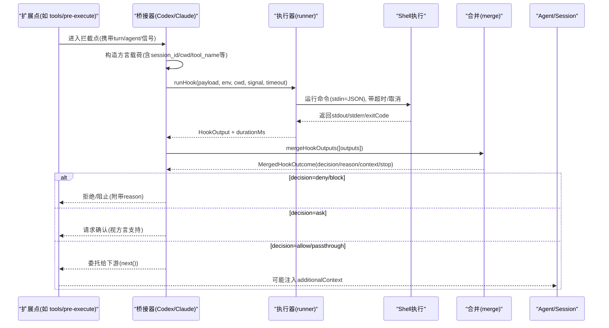
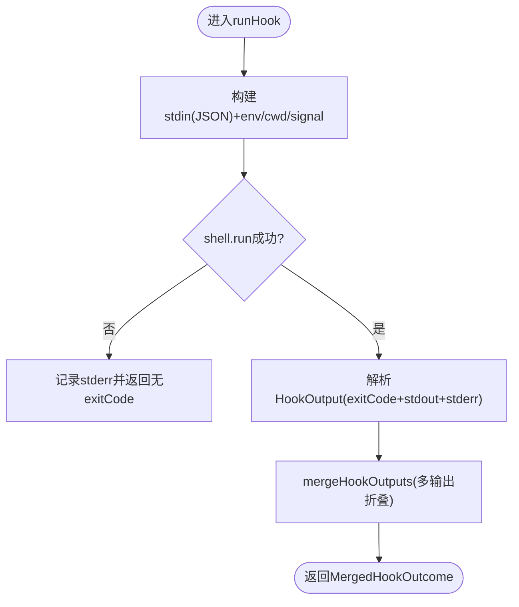
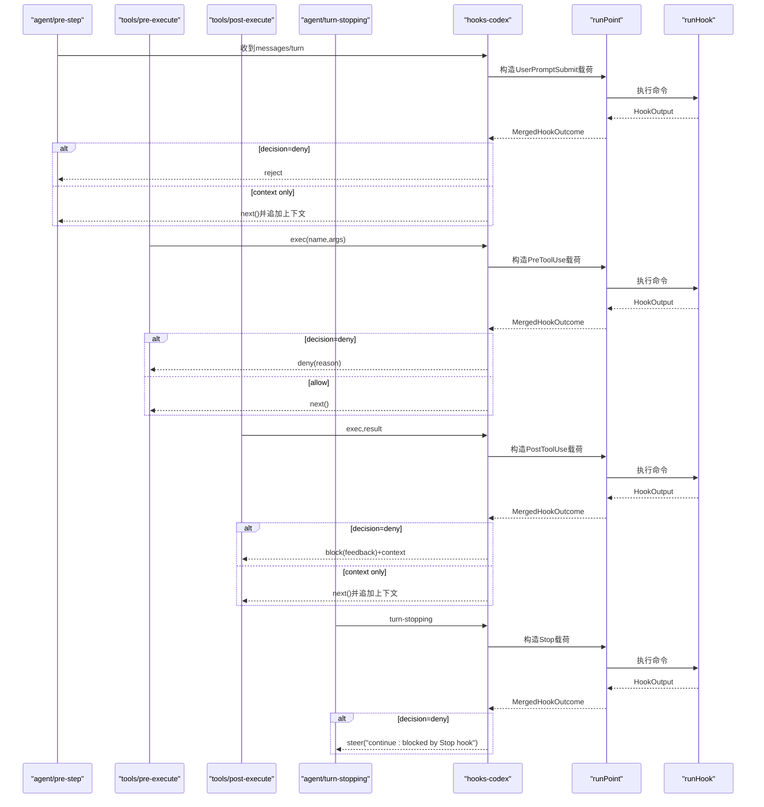
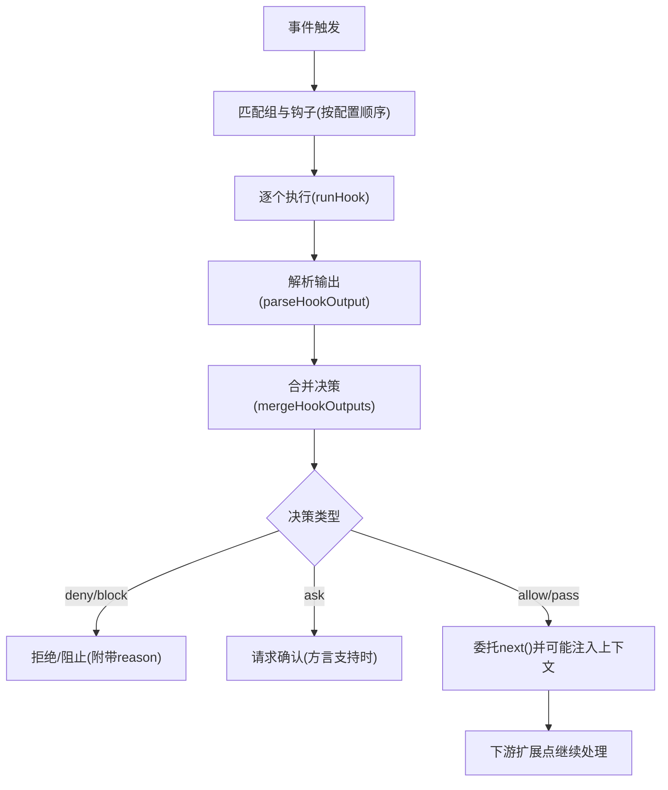
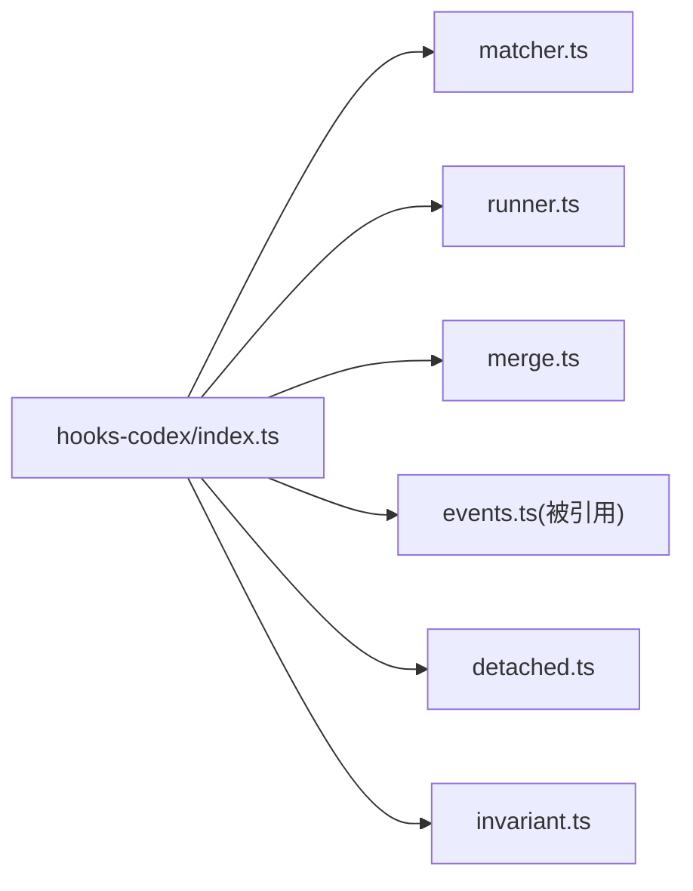

# 钩子系统

<cite>
**本文引用的文件**
- [packages/hooks/hook-protocol/src/index.ts](file://packages/hooks/hook-protocol/src/index.ts)
- [packages/hooks/hook-protocol/src/types.ts](file://packages/hooks/hook-protocol/src/types.ts)
- [packages/hooks/hook-protocol/src/runner.ts](file://packages/hooks/hook-protocol/src/runner.ts)
- [packages/hooks/hook-protocol/src/matcher.ts](file://packages/hooks/hook-protocol/src/matcher.ts)
- [packages/hooks/hook-protocol/src/merge.ts](file://packages/hooks/hook-protocol/src/merge.ts)
- [packages/hooks/hook-protocol/src/detached.ts](file://packages/hooks/hook-protocol/src/detached.ts)
- [packages/hooks/hook-protocol/src/invariant.ts](file://packages/hooks/hook-protocol/src/invariant.ts)
- [packages/hooks/hook-protocol/tests/invariant.spec.ts](file://packages/hooks/hook-protocol/tests/invariant.spec.ts)
- [packages/hooks/hooks-codex/src/index.ts](file://packages/hooks/hooks-codex/src/index.ts)
- [packages/hooks/hooks-claude-code/README.zh.md](file://packages/hooks/hooks-claude-code/README.zh.md)
</cite>

## 目录
1. [简介](#简介)
2. [项目结构](#项目结构)
3. [核心组件](#核心组件)
4. [架构总览](#架构总览)
5. [详细组件分析](#详细组件分析)
6. [依赖关系分析](#依赖关系分析)
7. [性能考虑](#性能考虑)
8. [故障排查指南](#故障排查指南)
9. [结论](#结论)
10. [附录](#附录)

## 简介
本文件系统性地说明 DeepSeek Harness 的钩子（Hook）子系统：工作原理、执行生命周期、触发时机与顺序；Claude Code 与 Codex 两种钩子协议的差异与兼容性；关键钩子点（预工具 pre-tool、后工具 post-tool、提示提交 prompt-submit、会话启动 session-start、停止 stop、子 agent 启动/停止）的使用场景与实现方式；如何编写自定义钩子（参数传递、上下文获取、结果返回）；权限控制与安全性；以及性能优化与调试技巧。

## 项目结构
钩子系统由“共享协议库”和“方言桥接器”两部分组成：
- 共享协议库（hook-protocol）：提供匹配、命令执行、输出解析、结果合并、持久化事件记录、脱离运行（detached）等通用能力。
- 方言桥接器：将外部工具的钩子配置映射到 Harness 的拦截扩展点，并负责载荷构造、环境注入、决策映射。当前包含：
  - hooks-codex：适配未修改的 Codex command 钩子。
  - hooks-claude-code：适配 Claude Code 的 hooks.json/settings 中的 command 钩子。

图表来源
- [packages/hooks/hook-protocol/src/index.ts:1-26](file://packages/hooks/hook-protocol/src/index.ts#L1-L26)
- [packages/hooks/hook-protocol/src/types.ts:1-138](file://packages/hooks/hook-protocol/src/types.ts#L1-L138)
- [packages/hooks/hook-protocol/src/matcher.ts:1-66](file://packages/hooks/hook-protocol/src/matcher.ts#L1-L66)
- [packages/hooks/hook-protocol/src/runner.ts:1-107](file://packages/hooks/hook-protocol/src/runner.ts#L1-L107)
- [packages/hooks/hook-protocol/src/merge.ts:1-101](file://packages/hooks/hook-protocol/src/merge.ts#L1-L101)
- [packages/hooks/hook-protocol/src/detached.ts:1-32](file://packages/hooks/hook-protocol/src/detached.ts#L1-L32)
- [packages/hooks/hook-protocol/src/invariant.ts:87-121](file://packages/hooks/hook-protocol/src/invariant.ts#L87-L121)
- [packages/hooks/hooks-codex/src/index.ts:1-330](file://packages/hooks/hooks-codex/src/index.ts#L1-L330)
- [packages/hooks/hooks-claude-code/README.zh.md:1-195](file://packages/hooks/hooks-claude-code/README.zh.md#L1-L195)

章节来源
- [packages/hooks/hook-protocol/src/index.ts:1-26](file://packages/hooks/hook-protocol/src/index.ts#L1-L26)
- [packages/hooks/hooks-codex/src/index.ts:1-330](file://packages/hooks/hooks-codex/src/index.ts#L1-L330)
- [packages/hooks/hooks-claude-code/README.zh.md:1-195](file://packages/hooks/hooks-claude-code/README.zh.md#L1-L195)

## 核心组件
- 类型与事件（types.ts）
  - 定义跨方言的 HookDialect、CommandHook、MatcherGroup、MatcherMode、HookOutput 等核心类型。
  - 在 SessionEventMap 中注册 hook/invoked 与 hook/result 两个日志型事件，用于追踪每次钩子调用与结果。
- 匹配器（matcher.ts）
  - 支持“全匹配”（缺失/空/“*”）与按方言解释的模式：Claude Code 对纯字母数字下划线加竖线的模式做字面量管道匹配，否则作为正则；Codex 始终使用正则。
  - 提供 matcherDiagnostic 用于配置期诊断非法正则。
- 执行器（runner.ts）
  - 通过 ShellExecutor 运行命令，传入 JSON 载荷到 stdin，处理超时、工作目录、环境变量、AbortSignal 取消。
  - 捕获基础设施异常时不抛错，而是以无 exitCode 的结果记录 stderr 信息，保证主流程稳定。
- 输出解析（codec.ts，被引用）
  - 根据退出码与 stdout/stderr 解析为统一的 HookOutput，并支持事件名校验（expectedEventName）。
- 结果合并（merge.ts）
  - 将多个匹配钩子的输出折叠为单一决策：deny > ask > allow；首个 continue:false 决定 stop；reason 仅保留最高优先级原因；additionalContext/systemMessages 按顺序累积。
- 脱离运行（detached.ts）
  - 对没有等待方的 emit 形状钩子（如 SessionStart、SubagentStart/Stop）进行运行链跟踪，在 dispose 时中止仍在运行的进程并排空后续回调，确保资源释放。
- 不变式（invariant.ts）
  - 在内部分发阶段对 hook/invoked 与 hook/result 配对进行一致性校验，确保事件发生在有效 turn 内且与已暂存的事件对应。

章节来源
- [packages/hooks/hook-protocol/src/types.ts:1-138](file://packages/hooks/hook-protocol/src/types.ts#L1-L138)
- [packages/hooks/hook-protocol/src/matcher.ts:1-66](file://packages/hooks/hook-protocol/src/matcher.ts#L1-L66)
- [packages/hooks/hook-protocol/src/runner.ts:1-107](file://packages/hooks/hook-protocol/src/runner.ts#L1-L107)
- [packages/hooks/hook-protocol/src/merge.ts:1-101](file://packages/hooks/hook-protocol/src/merge.ts#L1-L101)
- [packages/hooks/hook-protocol/src/detached.ts:1-32](file://packages/hooks/hook-protocol/src/detached.ts#L1-L32)
- [packages/hooks/hook-protocol/src/invariant.ts:87-121](file://packages/hooks/hook-protocol/src/invariant.ts#L87-L121)

## 架构总览
钩子执行从“桥接器监听扩展点”开始，构建方言特定的载荷，调用共享执行器运行命令，解析输出并合并决策，再映射回 Harness 的拦截决策或注入上下文。

图表来源
- [packages/hooks/hooks-codex/src/index.ts:188-270](file://packages/hooks/hooks-codex/src/index.ts#L188-L270)
- [packages/hooks/hook-protocol/src/runner.ts:67-107](file://packages/hooks/hook-protocol/src/runner.ts#L67-L107)
- [packages/hooks/hook-protocol/src/merge.ts:62-101](file://packages/hooks/hook-protocol/src/merge.ts#L62-L101)

## 详细组件分析

### 共享协议库（hook-protocol）
- 类型与事件
  - 统一了 CommandHook、MatcherGroup、HookOutput 等跨方言类型，并在会话事件中登记 hook/invoked 与 hook/result，便于审计与回放。
- 匹配器
  - 提供安全的运行时匹配：无效正则不会抛错，而是视为不匹配；配置期可通过 matcherDiagnostic 提前发现错误。
- 执行器
  - 封装了超时、取消、工作目录与环境变量注入；失败路径不中断主循环，仅记录 stderr。
- 结果合并
  - 严格遵循 deny > ask > allow 的优先级；首个 continue:false 决定 stop；reason 仅来自获胜等级；上下文与系统消息按顺序累积。
- 脱离运行
  - 对无等待方的钩子（如 SessionStart、SubagentStart/Stop）进行跟踪，确保 fiber 释放时所有钩子进程与回调均被中止并排空。
- 不变式
  - 在 internal/dispatch 阶段对 hook/invoked 与 hook/result 进行配对校验，确保事件发生在打开的 turn 内且与暂存事件一致。

图表来源
- [packages/hooks/hook-protocol/src/runner.ts:67-107](file://packages/hooks/hook-protocol/src/runner.ts#L67-L107)
- [packages/hooks/hook-protocol/src/merge.ts:62-101](file://packages/hooks/hook-protocol/src/merge.ts#L62-L101)

章节来源
- [packages/hooks/hook-protocol/src/types.ts:1-138](file://packages/hooks/hook-protocol/src/types.ts#L1-L138)
- [packages/hooks/hook-protocol/src/matcher.ts:1-66](file://packages/hooks/hook-protocol/src/matcher.ts#L1-L66)
- [packages/hooks/hook-protocol/src/runner.ts:1-107](file://packages/hooks/hook-protocol/src/runner.ts#L1-L107)
- [packages/hooks/hook-protocol/src/merge.ts:1-101](file://packages/hooks/hook-protocol/src/merge.ts#L1-L101)
- [packages/hooks/hook-protocol/src/detached.ts:1-32](file://packages/hooks/hook-protocol/src/detached.ts#L1-L32)
- [packages/hooks/hook-protocol/src/invariant.ts:87-121](file://packages/hooks/hook-protocol/src/invariant.ts#L87-L121)

### Codex 桥接器（hooks-codex）
- 支持的钩子点
  - SessionStart、UserPromptSubmit、PreToolUse、PostToolUse、Stop。
- 载荷与环境
  - snake_case 字段，每个事件携带 model；转义 trailing newline=false；不包含完整的环境替换（如 ${CLAUDE_PLUGIN_ROOT}），也不支持 http/prompt/agent handler。
- 匹配策略
  - 始终使用正则匹配；忽略 systemMessage；不支持 allow/ask 语义（仅阻塞）。
- 扩展点映射
  - UserPromptSubmit → PreStepDecision（reject 或追加上下文）。
  - PreToolUse → PreToolDecision（deny 则阻止）。
  - PostToolUse → PostToolDecision（block 反馈或追加上下文）。
  - Stop → 在 turn-stopping 边界注入 steering 强制继续。
  - SessionStart/SubagentStart/Stop 通过 detached 运行并注入上下文或观测。

图表来源
- [packages/hooks/hooks-codex/src/index.ts:188-270](file://packages/hooks/hooks-codex/src/index.ts#L188-L270)
- [packages/hooks/hook-protocol/src/runner.ts:67-107](file://packages/hooks/hook-protocol/src/runner.ts#L67-L107)

章节来源
- [packages/hooks/hooks-codex/src/index.ts:1-330](file://packages/hooks/hooks-codex/src/index.ts#L1-L330)

### Claude Code 桥接器（hooks-claude-code）
- 支持的钩子点
  - SessionStart、UserPromptSubmit、PreToolUse、PostToolUse、Stop、SubagentStart、SubagentStop。
- 载荷与环境
  - 支持 command handler；${CLAUDE_PLUGIN_ROOT} 与 ${CLAUDE_PROJECT_DIR} 替换；设置 CLAUDE_PROJECT_DIR 环境变量；默认超时 600s；stderr 摘要长度可配。
- 匹配策略
  - 字面量管道匹配优先（当模式为纯字母数字/下划线/竖线），否则正则；匹配器串行运行。
- 扩展点映射
  - SessionStart → 注入 additionalContext（detach 运行）。
  - UserPromptSubmit → 可阻塞或附加上下文。
  - PreToolUse → deny/ask 可用；allow 不预审批；updatedInput 记录但不应用。
  - PostToolUse → 可阻塞反馈或附加上下文；tool_response 展平为文本。
  - Stop → 阻塞会强制 continuation；stop_hook_active 始终 false。
  - SubagentStart/Stop → start 尽力而为注入同进程 child 上下文；stop 仅观测。

章节来源
- [packages/hooks/hooks-claude-code/README.zh.md:1-195](file://packages/hooks/hooks-claude-code/README.zh.md#L1-L195)

### 关键钩子点与生命周期
- 触发时机与顺序
  - 同一事件的多个匹配钩子按配置顺序串行运行；每个钩子都会产生 hook/invoked 与 hook/result 事件对。
  - 合并规则：deny > ask > allow；首个 continue:false 决定 stop；reason 仅来自获胜等级；上下文与系统消息按顺序累积。
- 执行生命周期
  - 构造载荷 → 运行命令（受超时/取消/工作目录约束）→ 解析输出 → 合并决策 → 映射到扩展点决策或注入上下文。
  - 对于无等待方的钩子（SessionStart、SubagentStart/Stop），通过 detached 跟踪运行链，确保 fiber 释放时全部中止并排空。

图表来源
- [packages/hooks/hook-protocol/src/merge.ts:62-101](file://packages/hooks/hook-protocol/src/merge.ts#L62-L101)
- [packages/hooks/hook-protocol/src/runner.ts:67-107](file://packages/hooks/hook-protocol/src/runner.ts#L67-L107)

章节来源
- [packages/hooks/hook-protocol/src/merge.ts:1-101](file://packages/hooks/hook-protocol/src/merge.ts#L1-L101)
- [packages/hooks/hook-protocol/src/runner.ts:1-107](file://packages/hooks/hook-protocol/src/runner.ts#L1-L107)

## 依赖关系分析
- 桥接器依赖共享协议库：
  - hooks-codex 直接导入 matcher、runHook、parseHookOutput、mergeHookOutputs、appendHookInvoked/Result、createDetachedRuns 等。
  - hooks-claude-code 的行为与限制由 README 文档明确，其实现同样基于共享协议库。
- 不变式与测试：
  - invariant.ts 在 internal/dispatch 阶段校验 hook/invoked 与 hook/result 的配对与 turn 范围；tests/invariant.spec.ts 验证恢复与拒绝逻辑。

图表来源
- [packages/hooks/hooks-codex/src/index.ts:24-37](file://packages/hooks/hooks-codex/src/index.ts#L24-L37)
- [packages/hooks/hook-protocol/src/index.ts:1-26](file://packages/hooks/hook-protocol/src/index.ts#L1-L26)

章节来源
- [packages/hooks/hooks-codex/src/index.ts:1-330](file://packages/hooks/hooks-codex/src/index.ts#L1-L330)
- [packages/hooks/hook-protocol/src/index.ts:1-26](file://packages/hooks/hook-protocol/src/index.ts#L1-L26)
- [packages/hooks/hook-protocol/src/invariant.ts:87-121](file://packages/hooks/hook-protocol/src/invariant.ts#L87-L121)
- [packages/hooks/hook-protocol/tests/invariant.spec.ts:48-83](file://packages/hooks/hook-protocol/tests/invariant.spec.ts#L48-L83)

## 性能考虑
- 超时与取消
  - 默认每钩子超时 600,000ms；可通过 per-hook timeoutSec 覆盖；通过 AbortSignal 支持操作级取消。
- 串行执行
  - 同一事件上的匹配钩子串行运行，避免并发竞争，代价是延迟增加；决策合并与顺序无关，结果与参考引擎并发语义一致。
- 上下文成本
  - 钩子不返回上下文时无额外成本；返回的上下文会被记录并在后续会话请求中重发，直到压缩。
- 脱离运行
  - 对无等待方的钩子进行跟踪，dispose 时中止并排空，避免进程泄漏与长尾回调。
- 建议
  - 合理设置超时与 stderr 摘要上限；避免在钩子中进行重型计算；尽量复用上下文；谨慎使用阻塞决策以避免无限 continuation。

[本节为通用指导，无需特定文件来源]

## 故障排查指南
- 常见症状
  - 钩子未触发：检查 matcher 是否匹配；确认配置加载成功；查看 skipped 事件日志。
  - 钩子崩溃或超时：查看 hook/result 的 stderrSummary 与 durationMs；确认 shell 可用与工作目录正确。
  - 决策不符合预期：核对合并规则（deny > ask > allow）；确认是否有多个钩子冲突。
- 定位方法
  - 通过 hook/invoked 与 hook/result 事件对定位具体 handlerId 与 point。
  - 使用 invariant 校验：若出现“outside any open turn”或“open turn is X”错误，检查事件是否在有效 turn 内发布。
- 修复建议
  - 修正 matcher 语法；调整超时；减少 stderr 输出；避免无条件阻塞 Stop 钩子导致循环。

章节来源
- [packages/hooks/hook-protocol/tests/invariant.spec.ts:48-83](file://packages/hooks/hook-protocol/tests/invariant.spec.ts#L48-L83)
- [packages/hooks/hook-protocol/src/invariant.ts:87-121](file://packages/hooks/hook-protocol/src/invariant.ts#L87-L121)
- [packages/hooks/hook-protocol/src/runner.ts:86-107](file://packages/hooks/hook-protocol/src/runner.ts#L86-L107)

## 结论
DeepSeek Harness 的钩子系统通过“共享协议库 + 方言桥接器”的设计，既保证了跨工具的一致性，又保留了各工具的语义差异。它提供了严格的匹配、执行、合并与不变式保障，并通过脱离运行机制确保资源安全释放。开发者可基于此快速实现预工具、后工具、提示提交、会话启动与停止等关键钩子，同时兼顾性能与安全。

[本节为总结性内容，无需特定文件来源]

## 附录

### 钩子协议对比（Claude Code vs Codex）
- 载荷格式
  - Claude Code：camelCase 为主，支持更多字段；Codex：snake_case，model 字段在每个事件上。
- 匹配模式
  - Claude Code：字面量管道优先，否则正则；Codex：始终正则。
- 环境变量与替换
  - Claude Code：支持 ${CLAUDE_PLUGIN_ROOT} 与 ${CLAUDE_PROJECT_DIR} 替换，并设置 CLAUDE_PROJECT_DIR；Codex：不执行命令替换，不注入完整环境。
- Handler 支持
  - Claude Code：仅 command handler；跳过 http/mcp_tool/prompt/agent；部分选项不被遵循。
  - Codex：仅 command handler；无 pre-tool 批准或重写路径；仅尊重阻塞决策。
- 行为差异
  - Claude Code：PreToolUse 支持 deny/ask；PostToolUse 支持反馈与上下文；Stop 可强制 continuation。
  - Codex：仅阻塞决策；Stop 强制 continuation 但 stop_hook_active 始终 false。

章节来源
- [packages/hooks/hooks-claude-code/README.zh.md:172-182](file://packages/hooks/hooks-claude-code/README.zh.md#L172-L182)
- [packages/hooks/hooks-codex/src/index.ts:1-330](file://packages/hooks/hooks-codex/src/index.ts#L1-L330)

### 自定义钩子编写要点
- 参数传递
  - 通过 stdin 接收 JSON 载荷；注意 trailing newline（Claude Code 有，Codex 无）。
- 上下文获取
  - 从载荷中读取 session_id、cwd、transcript_path、tool_name、prompt 等字段；必要时通过环境变量获取项目路径。
- 结果返回
  - 通过 stdout 输出结构化 JSON；支持 decision、reason、additionalContext、systemMessage、updatedInput 等字段；退出码也影响决策。
- 权限与安全
  - 使用 ShellExecutor 的凭据清理与进程组取消；设置合理超时；避免敏感信息泄露到 stderr；对输入进行最小信任原则处理。
- 调试技巧
  - 关注 hook/invoked 与 hook/result 事件对；检查 stderrSummary 与 durationMs；利用 matcherDiagnostic 提前发现正则错误；在开发阶段逐步缩小 matcher 范围。

章节来源
- [packages/hooks/hook-protocol/src/types.ts:1-138](file://packages/hooks/hook-protocol/src/types.ts#L1-L138)
- [packages/hooks/hook-protocol/src/runner.ts:22-47](file://packages/hooks/hook-protocol/src/runner.ts#L22-L47)
- [packages/hooks/hook-protocol/src/matcher.ts:31-44](file://packages/hooks/hook-protocol/src/matcher.ts#L31-L44)