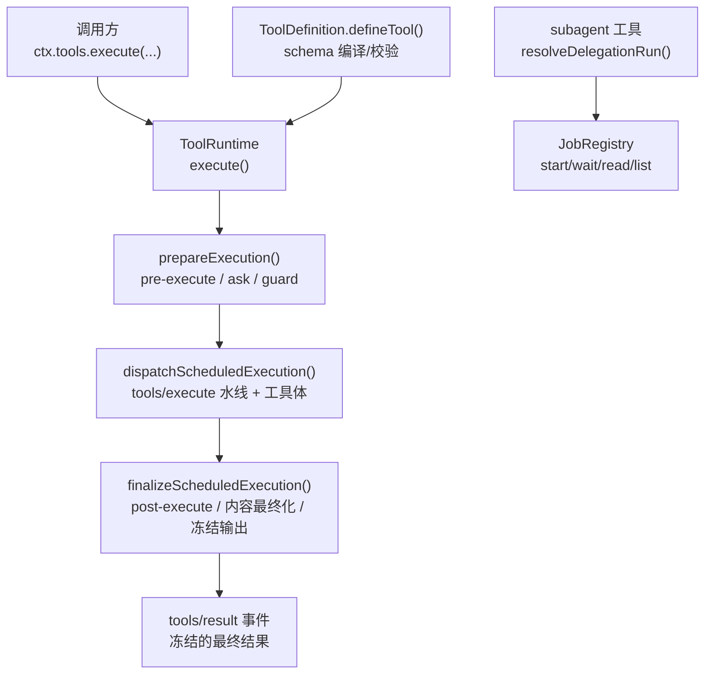
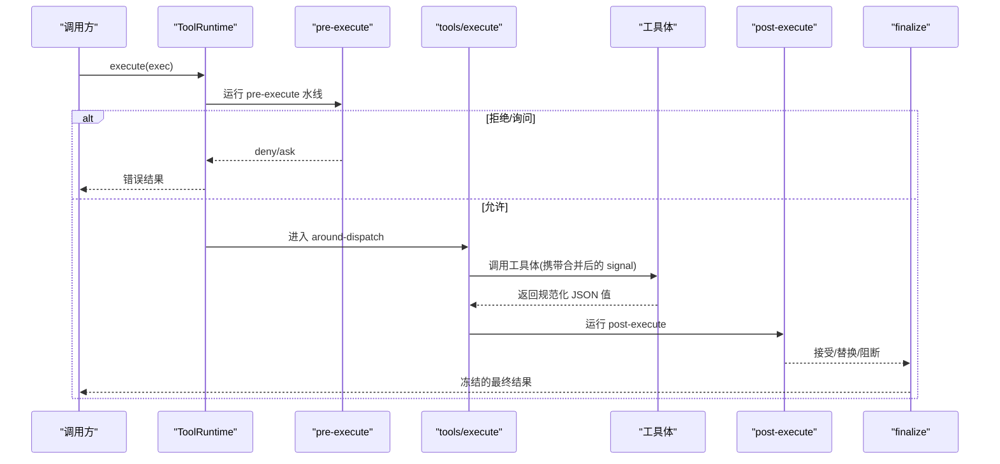
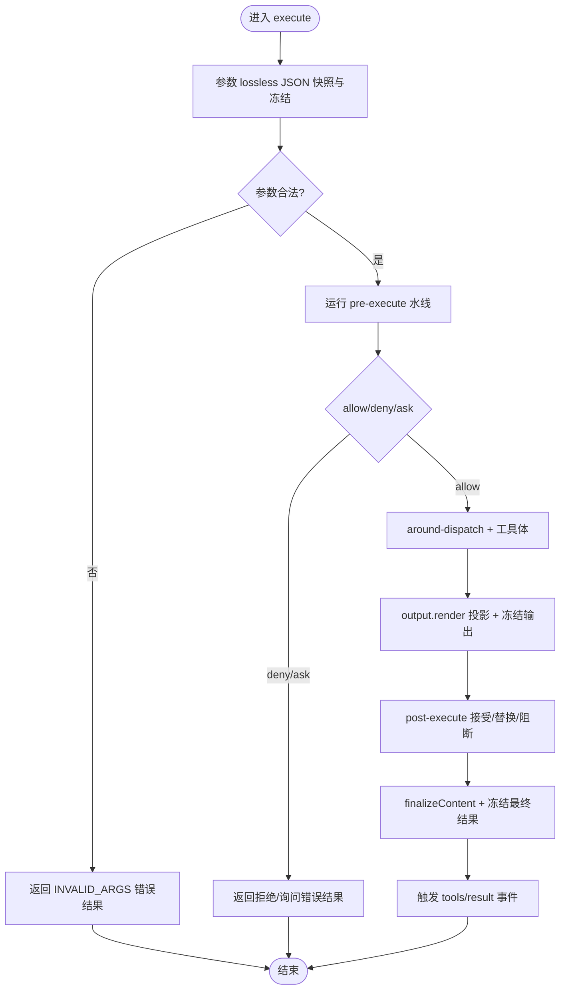
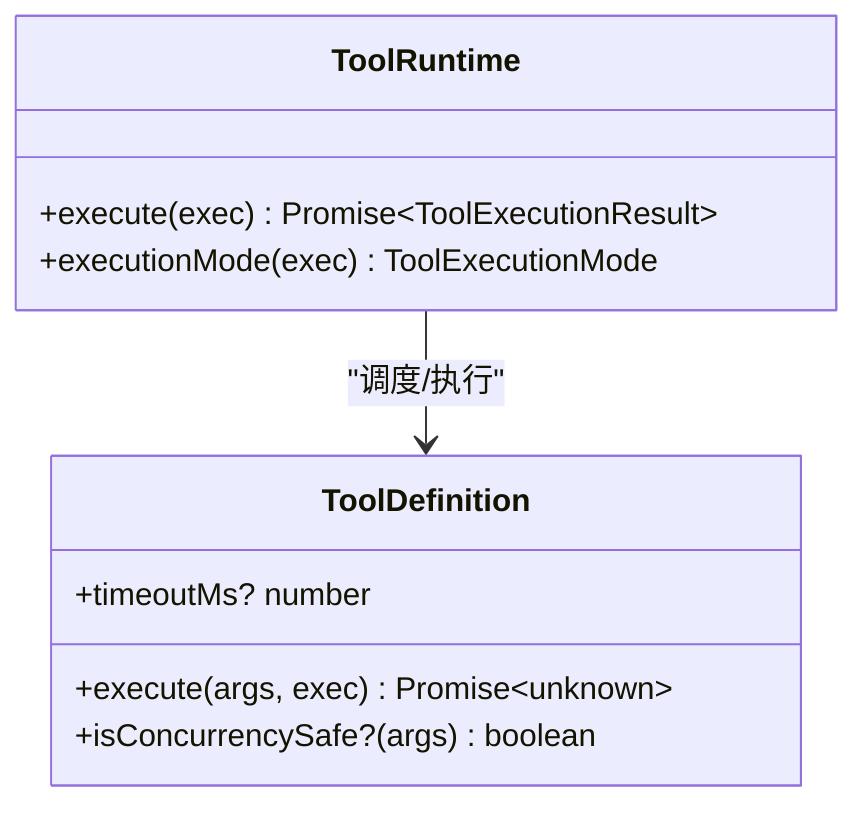
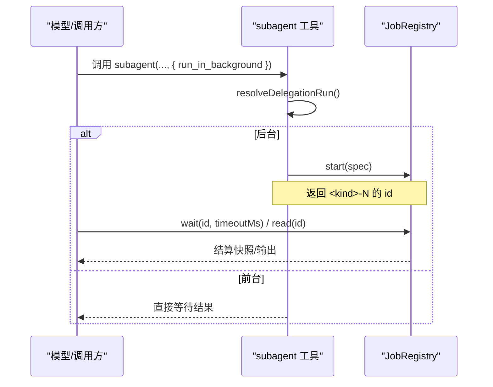
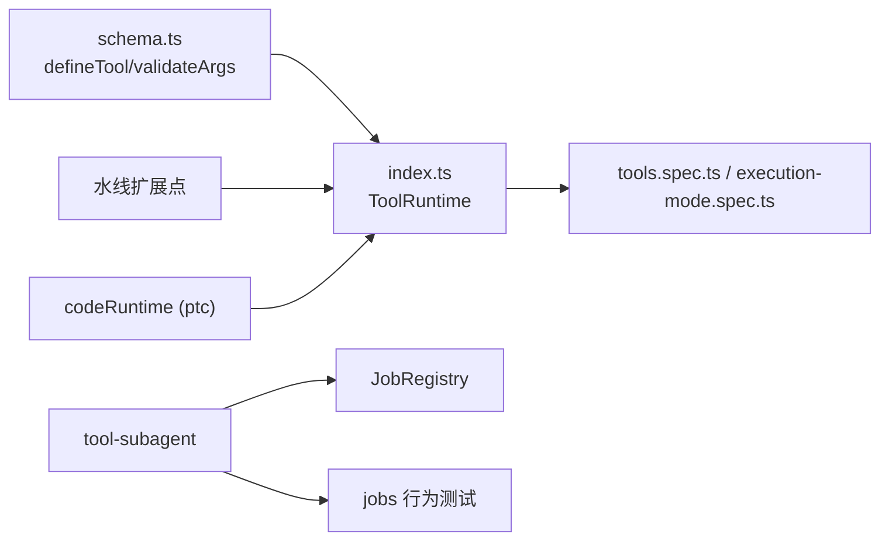

# 工具执行模型

<cite>
**本文引用的文件**
- [packages/core/tools/src/index.ts](file://packages/core/tools/src/index.ts)
- [packages/core/tools/src/schema.ts](file://packages/core/tools/src/schema.ts)
- [packages/subagent/tool-subagent/src/index.ts](file://packages/subagent/tool-subagent/src/index.ts)
- [docs/subsystems/jobs.md](file://docs/subsystems/jobs.md)
- [packages/core/agent-loop/tests/tool-calls.spec.ts](file://packages/core/agent-loop/tests/tool-calls.spec.ts)
- [packages/core/tools/tests/tools.spec.ts](file://packages/core/tools/tests/tools.spec.ts)
- [packages/core/tools/tests/execution-mode.spec.ts](file://packages/core/tools/tests/execution-mode.spec.ts)
- [packages/guard/timeout-policy/tests/timeout-policy.spec.ts](file://packages/guard/timeout-policy/tests/timeout-policy.spec.ts)
</cite>

## 目录
1. [简介](#简介)
2. [项目结构](#项目结构)
3. [核心组件](#核心组件)
4. [架构总览](#架构总览)
5. [详细组件分析](#详细组件分析)
6. [依赖关系分析](#依赖关系分析)
7. [性能考虑](#性能考虑)
8. [故障排查指南](#故障排查指南)
9. [结论](#结论)
10. [附录：执行模式示例](#附录：执行模式示例)

## 简介
本文件面向 DeepSeek Harness 的“工具执行模型”，聚焦 execute 函数的执行契约、参数验证与返回值序列化、错误处理机制，以及异步执行模型（并发控制、超时处理、信号取消）和后台任务支持（run_in_background、任务调度与结果获取）。文档同时提供同步、异步与后台任务的实践指引，并给出性能优化与故障恢复建议。

## 项目结构
围绕工具执行的核心代码集中在 core/tools 包中，配合 subagent 工具实现后台任务调度，jobs 子系统提供通用后台任务抽象与本地实现。测试用例覆盖执行流程、并发模式、超时与取消等关键行为。

图表来源
- [packages/core/tools/src/index.ts:1341-1600](file://packages/core/tools/src/index.ts#L1341-L1600)
- [packages/subagent/tool-subagent/src/index.ts:279-306](file://packages/subagent/tool-subagent/src/index.ts#L279-L306)
- [docs/subsystems/jobs.md:163-285](file://docs/subsystems/jobs.md#L163-L285)
- [packages/core/tools/src/schema.ts:545-618](file://packages/core/tools/src/schema.ts#L545-L618)

章节来源
- [packages/core/tools/src/index.ts:1341-1600](file://packages/core/tools/src/index.ts#L1341-L1600)
- [packages/core/tools/src/schema.ts:545-618](file://packages/core/tools/src/schema.ts#L545-L618)
- [packages/subagent/tool-subagent/src/index.ts:279-306](file://packages/subagent/tool-subagent/src/index.ts#L279-L306)
- [docs/subsystems/jobs.md:163-285](file://docs/subsystems/jobs.md#L163-L285)

## 核心组件
- ToolRuntime：工具注册表与执行管道，负责 prepare → dispatch → finalize 的完整生命周期，统一处理取消、超时、错误与结果冻结。
- ToolDefinition/defineTool：声明工具参数 schema、输出 schema、可选超时、并发安全分类器、呈现函数与执行体；在定义阶段完成 schema 编译与运行时校验。
- 子代理工具（subagent tool）：将模型的 run_in_background 请求解析为前台或后台执行路由。
- JobRegistry：后台任务抽象接口，提供 start/list/get/read/kill/wait/onJobDone/onJobsChanged/attachController 能力。

章节来源
- [packages/core/tools/src/index.ts:221-288](file://packages/core/tools/src/index.ts#L221-L288)
- [packages/core/tools/src/schema.ts:482-618](file://packages/core/tools/src/schema.ts#L482-L618)
- [packages/subagent/tool-subagent/src/index.ts:279-306](file://packages/subagent/tool-subagent/src/index.ts#L279-L306)
- [docs/subsystems/jobs.md:163-285](file://docs/subsystems/jobs.md#L163-L285)

## 架构总览
工具执行采用“可插拔水线”的流水线设计：
- pre-execute：允许/拒绝/询问（审批），支持作用域过滤。
- around-dispatch（tools/execute）：可注入超时、重试、指标等横切逻辑；可替换 exec.signal，但必须融合原始 caller 信号，不能移除。
- 工具体：仅返回“规范化的 JSON 值”，由 output.render 投影为模型可见内容。
- post-execute：接受/替换/阻断结果，附加上下文。
- finalize：定义级 finalizeContent 与冻结输出，触发 tools/result 事件。

图表来源
- [packages/core/tools/src/index.ts:1458-1598](file://packages/core/tools/src/index.ts#L1458-L1598)

章节来源
- [packages/core/tools/src/index.ts:1458-1598](file://packages/core/tools/src/index.ts#L1458-L1598)

## 详细组件分析

### execute 执行契约：参数验证、返回值序列化、错误处理
- 参数验证
  - defineTool 在定义时编译参数 schema 与输出 schema；执行前对 arguments 进行 lossless JSON 快照与深冻结。
  - 若参数不合法，抛出结构化错误（INVALID_ARGS），并在结果中以 isError=true 的形式返回，附带人类可读消息。
- 返回值序列化
  - 工具体仅返回“规范化的 JSON 值”；随后通过 output.render 投影为 ContentBlock[]，并通过 snapshotJsonValue 确保可持久化与回放。
  - 任何非 lossless JSON 的值会被转换为 INVALID_TOOL_OUTPUT 错误。
- 错误处理
  - 未知工具：UNKNOWN_TOOL。
  - 参数非法：INVALID_ARGS。
  - 输出非法：INVALID_TOOL_OUTPUT。
  - 取消：区分“未开始即取消”（ABORTED_BEFORE_DISPATCH）与“已开始工作后取消”（ABORTED）。
  - 超时：由 timeout policy 包装为 TOOL_TIMEOUT。

图表来源
- [packages/core/tools/src/index.ts:1363-1450](file://packages/core/tools/src/index.ts#L1363-L1450)
- [packages/core/tools/src/index.ts:1531-1598](file://packages/core/tools/src/index.ts#L1531-L1598)
- [packages/core/tools/src/schema.ts:563-590](file://packages/core/tools/src/schema.ts#L563-L590)

章节来源
- [packages/core/tools/src/index.ts:1363-1450](file://packages/core/tools/src/index.ts#L1363-L1450)
- [packages/core/tools/src/index.ts:1531-1598](file://packages/core/tools/src/index.ts#L1531-L1598)
- [packages/core/tools/src/schema.ts:563-590](file://packages/core/tools/src/schema.ts#L563-L590)

### 异步执行模型：并发控制、超时处理、信号取消
- 并发控制
  - 每个工具可选择声明 isConcurrencySafe(args)，仅当严格返回 true 时才允许与兄弟调用并行；否则默认独占执行。
  - PTC 模式下，可通过配置 maxParallelSubCalls 限制程序内子调用的并发度。
- 超时处理
  - 工具可声明 timeoutMs；由 timeout policy 作为 around-dispatch 包装，到达截止时将结果替换为 TOOL_TIMEOUT。
  - 即使工具抛出了 AbortError，若该信号来自内部 deadline，也会被归一化为 TOOL_TIMEOUT。
- 信号取消
  - 每次执行都会将 caller 的 AbortSignal 与 wrapper 替换的信号融合；工具体必须观察/转发 exec.signal。
  - 取消发生在工具体之前：返回 ABORTED_BEFORE_DISPATCH；发生在之后：返回 ABORTED，且不会放弃已启动的工作，等待其达到静默后再返回取消结果。

图表来源
- [packages/core/tools/src/index.ts:221-288](file://packages/core/tools/src/index.ts#L221-L288)
- [packages/core/tools/src/index.ts:1275-1284](file://packages/core/tools/src/index.ts#L1275-L1284)
- [packages/core/tools/src/index.ts:1526-1559](file://packages/core/tools/src/index.ts#L1526-L1559)

章节来源
- [packages/core/tools/src/index.ts:1275-1284](file://packages/core/tools/src/index.ts#L1275-L1284)
- [packages/core/tools/src/index.ts:1526-1559](file://packages/core/tools/src/index.ts#L1526-L1559)
- [packages/core/tools/tests/execution-mode.spec.ts:40-67](file://packages/core/tools/tests/execution-mode.spec.ts#L40-L67)
- [packages/core/agent-loop/tests/tool-calls.spec.ts:117-142](file://packages/core/agent-loop/tests/tool-calls.spec.ts#L117-L142)
- [packages/guard/timeout-policy/tests/timeout-policy.spec.ts:97-129](file://packages/guard/timeout-policy/tests/timeout-policy.spec.ts#L97-L129)

### 后台任务支持：run_in_background、任务调度与结果获取
- 路由决策
  - subagent 工具根据 request.run_in_background 与 options.backgroundEnabled/continuable 决定前台或后台执行。
  - 当 backgroundEnabled=false 时，显式请求后台会抛出错误；否则默认可能走后台（取决于是否可继续）。
- 任务调度
  - 使用 JobRegistry.start 启动后台任务，返回稳定 id；支持 list/get/read/kill/wait 等操作。
  - 每个 owner 有并发上限（默认 10），超限时 start 会拒绝。
- 结果获取
  - read 读取流式增量或终态输出；wait 等待结算或超时；onJobDone 监听完成；onJobsChanged 观察可见集合变化。
  - 服务销毁时会取消并等待合规的生产者，保证资源释放。

图表来源
- [packages/subagent/tool-subagent/src/index.ts:279-306](file://packages/subagent/tool-subagent/src/index.ts#L279-L306)
- [docs/subsystems/jobs.md:163-285](file://docs/subsystems/jobs.md#L163-L285)

章节来源
- [packages/subagent/tool-subagent/src/index.ts:279-306](file://packages/subagent/tool-subagent/src/index.ts#L279-L306)
- [docs/subsystems/jobs.md:163-285](file://docs/subsystems/jobs.md#L163-L285)

### 执行模式与管道细节
- 模式折叠（PTC）
  - 在 ptc 模式下，模型只能直接调用保留的 run_code 传输；其他工具需通过 SDK 子调度访问。
- 作用域与可见性
  - 工具按 scope 层叠加，局部注册可遮蔽全局；restrict 可裁剪全局可见集。
- 呈现与类型生成
  - schemas() 暴露给模型的参数 schema；SDK 渲染器基于语言生成类型提示与调用方式。

章节来源
- [packages/core/tools/src/index.ts:855-901](file://packages/core/tools/src/index.ts#L855-L901)
- [packages/core/tools/src/index.ts:980-1001](file://packages/core/tools/src/index.ts#L980-L1001)
- [packages/core/tools/src/index.ts:1233-1266](file://packages/core/tools/src/index.ts#L1233-L1266)

## 依赖关系分析
- ToolRuntime 依赖：
  - schema.ts：参数/输出 schema 编译与校验。
  - 水线机制（waterfall）：pre-execute、tools/execute、post-execute 扩展点。
  - codeRuntime（ptc 模式）：用于生成 SDK 与执行代码。
- subagent 工具依赖：
  - JobRegistry：后台任务生命周期管理。
- 测试覆盖：
  - 并发模式、超时、取消、PTC 模式下的行为均有多处断言。

图表来源
- [packages/core/tools/src/schema.ts:482-618](file://packages/core/tools/src/schema.ts#L482-L618)
- [packages/core/tools/src/index.ts:1341-1600](file://packages/core/tools/src/index.ts#L1341-L1600)
- [packages/subagent/tool-subagent/src/index.ts:279-306](file://packages/subagent/tool-subagent/src/index.ts#L279-L306)
- [docs/subsystems/jobs.md:163-285](file://docs/subsystems/jobs.md#L163-L285)

章节来源
- [packages/core/tools/src/index.ts:1341-1600](file://packages/core/tools/src/index.ts#L1341-L1600)
- [packages/core/tools/src/schema.ts:482-618](file://packages/core/tools/src/schema.ts#L482-L618)
- [packages/subagent/tool-subagent/src/index.ts:279-306](file://packages/subagent/tool-subagent/src/index.ts#L279-L306)
- [docs/subsystems/jobs.md:163-285](file://docs/subsystems/jobs.md#L163-L285)

## 性能考虑
- 并发策略
  - 为只读或无副作用的工具声明 isConcurrencySafe(true)，以启用并行执行，减少整体延迟。
  - 在 PTC 模式下合理设置 maxParallelSubCalls，避免过多子调用导致资源争用。
- 超时与取消
  - 为长耗时工具声明 timeoutMs，结合工具体内对 exec.signal 的响应，确保及时释放资源。
  - 上游调用应尽早传递取消信号，避免无效计算。
- 输出与序列化
  - 保持 output.schema 精简，避免大对象序列化开销；必要时使用分块/流式输出。
- 后台任务
  - 将独立任务设为后台执行，主流程继续推进；通过 JobRegistry.wait/read 获取结果，避免阻塞。

[本节为通用指导，无需特定文件引用]

## 故障排查指南
- 常见错误码与定位
  - UNKNOWN_TOOL：工具名不可见或被模式折叠拒绝；检查 scope 与 mode 配置。
  - INVALID_ARGS：参数不符合 schema；检查 required/类型约束。
  - INVALID_TOOL_OUTPUT：返回值不符合 output.schema；检查 render 投影与值类型。
  - TOOL_TIMEOUT：超过工具声明的 timeoutMs；检查工具体是否响应信号。
  - ABORTED / ABORTED_BEFORE_DISPATCH：取消时机不同；检查上游信号与工具体是否提前退出。
- 调试步骤
  - 订阅 tools/result 事件，查看冻结的最终结果与执行元信息。
  - 在 tools/execute 水线中记录 exec.name、exec.arguments 与 exec.signal 状态。
  - 对 PTC 模式，确认 codeRuntime 语言与 SDK 渲染器可用。
- 参考断言
  - 取消与超时行为、参数校验、并发模式等均有测试用例覆盖，可作为对照。

章节来源
- [packages/core/tools/tests/tools.spec.ts:75-93](file://packages/core/tools/tests/tools.spec.ts#L75-L93)
- [packages/core/tools/tests/tools.spec.ts:2165-2204](file://packages/core/tools/tests/tools.spec.ts#L2165-L2204)
- [packages/core/tools/tests/tools.spec.ts:2556-2613](file://packages/core/tools/tests/tools.spec.ts#L2556-L2613)
- [packages/core/tools/tests/tools.spec.ts:1510-1544](file://packages/core/tools/tests/tools.spec.ts#L1510-L1544)
- [packages/core/tools/tests/tools.spec.ts:1614-1644](file://packages/core/tools/tests/tools.spec.ts#L1614-L1644)
- [packages/guard/timeout-policy/tests/timeout-policy.spec.ts:97-129](file://packages/guard/timeout-policy/tests/timeout-policy.spec.ts#L97-L129)

## 结论
DeepSeek Harness 的工具执行模型以强契约、可扩展水线与严格的序列化保障为核心，提供一致的参数验证、返回值投影与错误分类。通过 isConcurrencySafe 与 maxParallelSubCalls 实现细粒度并发控制；通过 timeoutMs 与统一的 AbortSignal 融合机制实现可靠的超时与取消；通过 subagent 与 JobRegistry 提供健壮的后台任务能力。遵循本文的实践与排障建议，可在保证一致性与可观测性的前提下，获得高吞吐与低延迟的执行体验。

[本节为总结，无需特定文件引用]

## 附录：执行模式示例
以下示例以“路径引用”形式给出，便于在仓库中定位具体用法与断言。

- 同步执行（阻塞等待结果）
  - 参考：[packages/core/tools/tests/tools.spec.ts:86-93](file://packages/core/tools/tests/tools.spec.ts#L86-L93)
  - 要点：调用 ctx.tools.execute 并 await 结果；参数合法则返回 content/value；非法则返回 isError=true。

- 异步执行（并发与超时）
  - 并发：参考 [packages/core/agent-loop/tests/tool-calls.spec.ts:117-142](file://packages/core/agent-loop/tests/tool-calls.spec.ts#L117-L142)
  - 超时：参考 [packages/guard/timeout-policy/tests/timeout-policy.spec.ts:97-129](file://packages/guard/timeout-policy/tests/timeout-policy.spec.ts#L97-L129)
  - 取消：参考 [packages/core/tools/tests/tools.spec.ts:1510-1544](file://packages/core/tools/tests/tools.spec.ts#L1510-L1544)

- 后台任务（run_in_background）
  - 路由决策：参考 [packages/subagent/tool-subagent/src/index.ts:279-306](file://packages/subagent/tool-subagent/src/index.ts#L279-L306)
  - 任务管理：参考 [docs/subsystems/jobs.md:163-285](file://docs/subsystems/jobs.md#L163-L285)
  - 典型流程：start → wait/read → onJobDone 监听完成。

[本节为示例索引，无需额外说明]