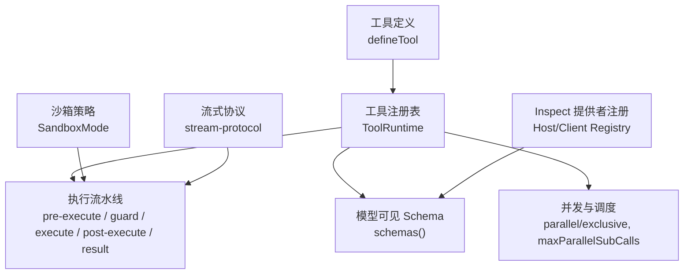
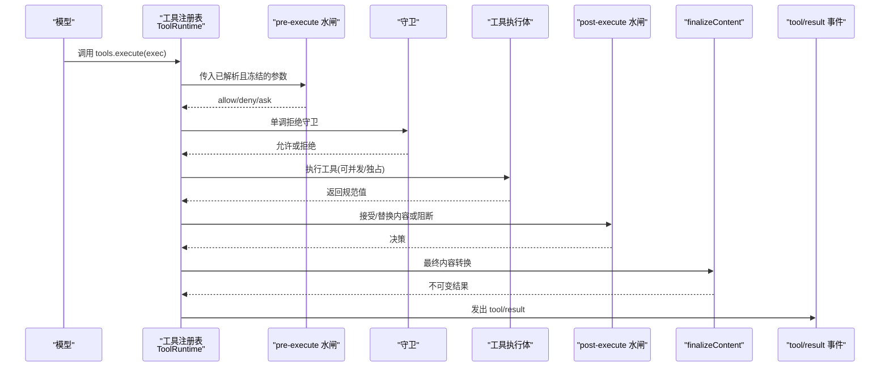
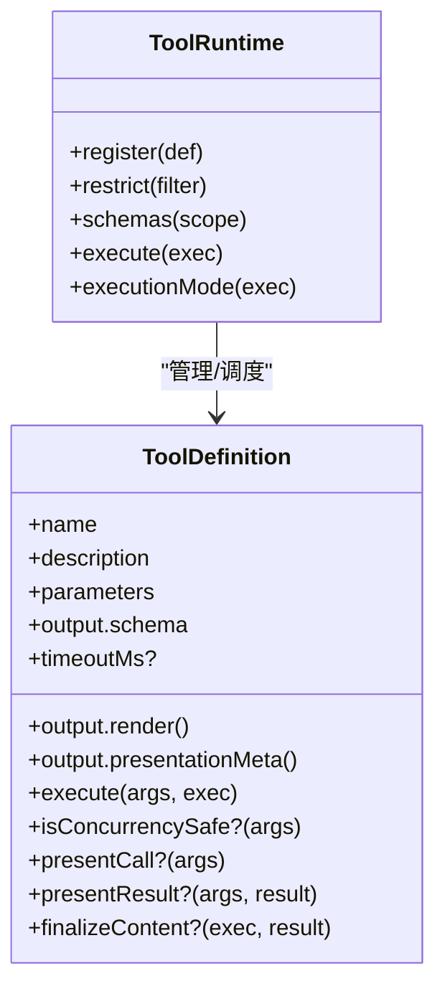
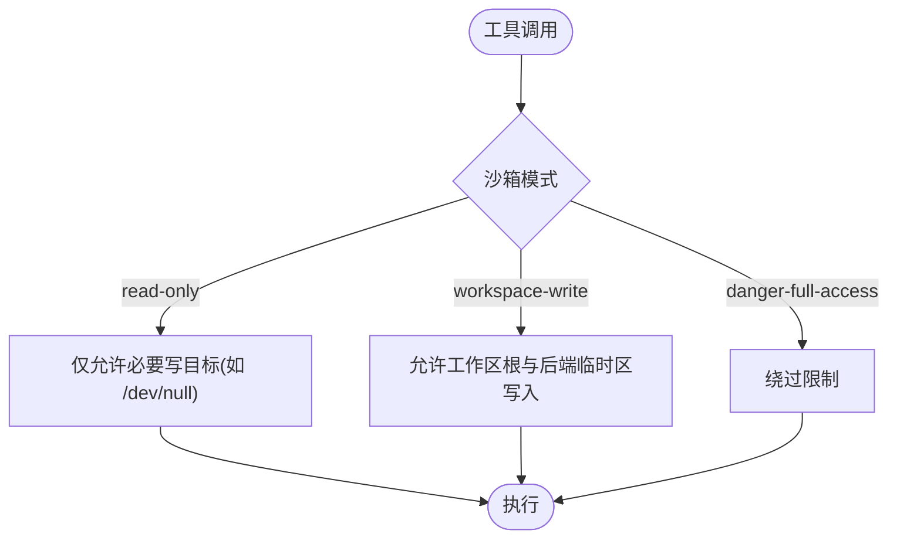
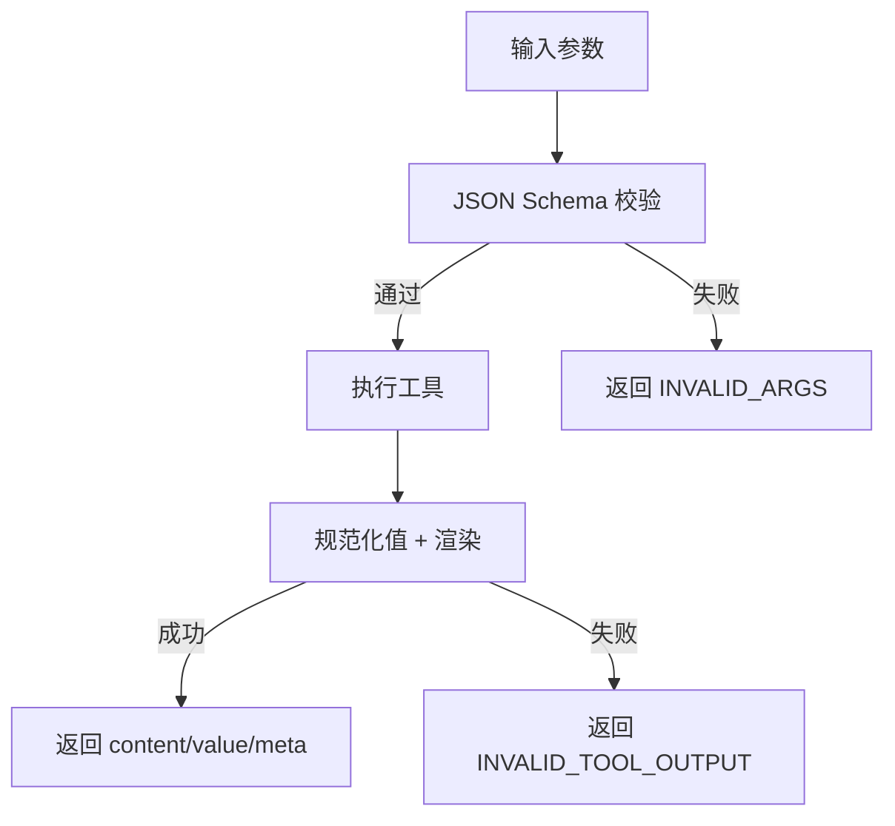
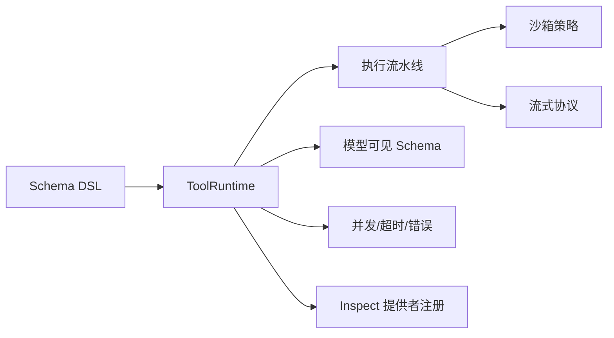

# 工具扩展点

<cite>
**本文引用的文件**
- [packages/core/tools/src/index.ts](file://packages/core/tools/src/index.ts)
- [packages/core/tools/src/schema.ts](file://packages/core/tools/src/schema.ts)
- [docs/subsystems/tools.md](file://docs/subsystems/tools.md)
- [docs/tool-catalog.md](file://docs/tool-catalog.md)
- [docs/subsystems/sandbox.md](file://docs/subsystems/sandbox.md)
- [packages/sandbox/sandbox/src/roots.ts](file://packages/sandbox/sandbox/src/roots.ts)
- [packages/sandbox/sandbox-windows-acl/src/index.ts](file://packages/sandbox/sandbox-windows-acl/src/index.ts)
- [packages/api/gateway/src/stream-protocol.ts](file://packages/api/gateway/src/stream-protocol.ts)
- [packages/api/gateway/tests/stream-protocol.host.spec.ts](file://packages/api/gateway/tests/stream-protocol.host.spec.ts)
- [packages/api/gateway/tests/remote-event-protocol.host.spec.ts](file://packages/api/gateway/tests/remote-event-protocol.host.spec.ts)
- [packages/core/tools/tests/ptc.spec.ts](file://packages/core/tools/tests/ptc.spec.ts)
- [packages/extensions/cordis-host-runner/src/inspect-registry.ts](file://packages/extensions/cordis-host-runner/src/inspect-registry.ts)
- [packages/extensions/cordis-client-runner/src/client/providers.ts](file://packages/extensions/cordis-client-runner/src/client/providers.ts)
- [packages/extensions/cordis-client-runner/src/client/inspect-registry.ts](file://packages/extensions/cordis-client-runner/src/client/inspect-registry.ts)
- [.agents/notes/implemented/architecture/2026-06-17-filesystem-capability-seam.zh.md](file://.agents/notes/implemented/architecture/2026-06-17-filesystem-capability-seam.zh.md)
</cite>

## 目录
1. [简介](#简介)
2. [项目结构](#项目结构)
3. [核心组件](#核心组件)
4. [架构总览](#架构总览)
5. [详细组件分析](#详细组件分析)
6. [依赖关系分析](#依赖关系分析)
7. [性能考虑](#性能考虑)
8. [故障排查指南](#故障排查指南)
9. [结论](#结论)
10. [附录](#附录)

## 简介
本文件面向 DeepSeek Harness 的工具扩展点，系统性说明工具的注册与发现、权限与安全沙箱、参数验证与结果序列化、异步执行模型（并发控制、超时与错误恢复）、以及测试调试与性能优化实践。文档以仓库中的工具运行时、Schema DSL、沙箱策略、流式协议和示例工具为依据，提供可操作的指导与图示。

## 项目结构
DeepSeek Harness 的工具系统由“工具定义 + 注册表 + 执行流水线”构成，并通过插件化能力挂载到 Cordis 上下文。关键位置：
- 工具运行时与管线：packages/core/tools/src/index.ts
- 统一 Schema DSL 与 defineTool：packages/core/tools/src/schema.ts
- 子系统文档：docs/subsystems/tools.md、docs/tool-catalog.md
- 进程沙箱策略：docs/subsystems/sandbox.md、packages/sandbox/*
- 流式协议与校验：packages/api/gateway/src/stream-protocol.ts
- 动态 Inspect 提供者注册：packages/extensions/cordis-*-runner/src/*



**图表来源**
- [packages/core/tools/src/index.ts:788-800](file://packages/core/tools/src/index.ts#L788-L800)
- [packages/core/tools/src/schema.ts:545-618](file://packages/core/tools/src/schema.ts#L545-L618)
- [docs/subsystems/tools.md:10-152](file://docs/subsystems/tools.md#L10-L152)
- [docs/subsystems/sandbox.md:9-39](file://docs/subsystems/sandbox.md#L9-L39)
- [packages/api/gateway/src/stream-protocol.ts:315-345](file://packages/api/gateway/src/stream-protocol.ts#L315-L345)
- [packages/extensions/cordis-host-runner/src/inspect-registry.ts:52-96](file://packages/extensions/cordis-host-runner/src/inspect-registry.ts#L52-L96)

**章节来源**
- [packages/core/tools/src/index.ts:788-800](file://packages/core/tools/src/index.ts#L788-L800)
- [packages/core/tools/src/schema.ts:545-618](file://packages/core/tools/src/schema.ts#L545-L618)
- [docs/subsystems/tools.md:10-152](file://docs/subsystems/tools.md#L10-L152)
- [docs/subsystems/sandbox.md:9-39](file://docs/subsystems/sandbox.md#L9-L39)
- [packages/api/gateway/src/stream-protocol.ts:315-345](file://packages/api/gateway/src/stream-protocol.ts#L315-L345)
- [packages/extensions/cordis-host-runner/src/inspect-registry.ts:52-96](file://packages/extensions/cordis-host-runner/src/inspect-registry.ts#L52-L96)

## 核心组件
- 工具定义与 Schema DSL
  - 使用 defineTool 声明 name、description、parameters、output（schema + render + presentationMeta），可选 timeoutMs、isConcurrencySafe、presentCall/presentResult、finalizeContent。
  - 参数与输出通过统一的 ValueSchemaSpec 编译为受支持的 JSON Schema 子集，确保类型推导与运行时校验一致。
- 工具注册表与执行流水线
  - ToolRuntime 维护可见工具集合、作用域限制、守卫与钩子；execute 走 pre-execute → guard → around-dispatch → post-execute → finalizeContent → result。
  - 支持 parallel/exclusive 调度模式与 maxParallelSubCalls 并发上限。
- 模型可见 Schema 投影
  - schemas() 仅暴露 name/description/parameters，不泄露执行回调，保证模型请求安全。
- 动态 Inspect 提供者
  - Host/Client 各自维护 Provider 注册表，支持列出与查询只读方法，用于动态包开发时的能力发现。

**章节来源**
- [packages/core/tools/src/schema.ts:545-618](file://packages/core/tools/src/schema.ts#L545-L618)
- [docs/subsystems/tools.md:10-152](file://docs/subsystems/tools.md#L10-L152)
- [packages/core/tools/src/index.ts:788-800](file://packages/core/tools/src/index.ts#L788-L800)
- [packages/extensions/cordis-host-runner/src/inspect-registry.ts:52-96](file://packages/extensions/cordis-host-runner/src/inspect-registry.ts#L52-L96)
- [packages/extensions/cordis-client-runner/src/client/providers.ts:134-172](file://packages/extensions/cordis-client-runner/src/client/providers.ts#L134-L172)
- [packages/extensions/cordis-client-runner/src/client/inspect-registry.ts:38-73](file://packages/extensions/cordis-client-runner/src/client/inspect-registry.ts#L38-L73)

## 架构总览
下图展示一次工具调用的端到端流程：从模型侧的 schema 可见性，到注册表的参数校验、策略门控、执行、结果序列化与持久化事件。



**图表来源**
- [packages/core/tools/src/index.ts:788-800](file://packages/core/tools/src/index.ts#L788-L800)
- [docs/subsystems/tools.md:170-405](file://docs/subsystems/tools.md#L170-L405)

## 详细组件分析

### 工具定义与注册
- 定义工具
  - 使用 defineTool 声明参数与输出 Schema，自动完成类型推断与运行时校验。
  - 输出包含 schema、render（将规范值转为 ContentBlock[]）与可选 presentationMeta。
- 注册与可见性
  - 通过 ctx.tools.register 注册；可通过 restrict 对全局工具进行 allow/deny 过滤。
  - schemas() 生成模型可见的 ToolSchema[]，不包含执行回调。
- 动态 Inspect 提供者
  - Host/Client 分别维护 Provider 注册表，支持 list/query/self 等只读能力发现。



**图表来源**
- [packages/core/tools/src/schema.ts:545-618](file://packages/core/tools/src/schema.ts#L545-L618)
- [packages/core/tools/src/index.ts:788-800](file://packages/core/tools/src/index.ts#L788-L800)

**章节来源**
- [packages/core/tools/src/schema.ts:545-618](file://packages/core/tools/src/schema.ts#L545-L618)
- [packages/core/tools/src/index.ts:788-800](file://packages/core/tools/src/index.ts#L788-L800)
- [packages/extensions/cordis-host-runner/src/inspect-registry.ts:52-96](file://packages/extensions/cordis-host-runner/src/inspect-registry.ts#L52-L96)
- [packages/extensions/cordis-client-runner/src/client/inspect-registry.ts:38-73](file://packages/extensions/cordis-client-runner/src/client/inspect-registry.ts#L38-L73)

### 权限控制与安全沙箱
- 沙箱模式
  - SandboxMode 控制文件系统效果：read-only、workspace-write、danger-full-access。
  - 根路径派生：workspace-write 允许工作区根与后端承诺的临时区域写入。
- 平台实现
  - Windows ACL 受限令牌、bwrap/Landlock 等后端在各自包中实现。
- 工具侧配合
  - 工具执行体需遵循沙箱约束；被拒绝的文件操作会报告为沙箱拒绝而非命令失败。



**图表来源**
- [docs/subsystems/sandbox.md:9-39](file://docs/subsystems/sandbox.md#L9-L39)
- [packages/sandbox/sandbox/src/roots.ts:1-18](file://packages/sandbox/sandbox/src/roots.ts#L1-L18)
- [packages/sandbox/sandbox-windows-acl/src/index.ts:213-236](file://packages/sandbox/sandbox-windows-acl/src/index.ts#L213-L236)

**章节来源**
- [docs/subsystems/sandbox.md:9-39](file://docs/subsystems/sandbox.md#L9-L39)
- [packages/sandbox/sandbox/src/roots.ts:1-18](file://packages/sandbox/sandbox/src/roots.ts#L1-L18)
- [packages/sandbox/sandbox-windows-acl/src/index.ts:213-236](file://packages/sandbox/sandbox-windows-acl/src/index.ts#L213-L236)

### 参数验证与结果序列化
- 参数验证
  - 所有工具参数通过统一的 ValueSchemaSpec 编译为 JSON Schema 并严格校验；非法参数抛出 INVALID_ARGS。
- 结果序列化
  - 工具返回值必须匹配 output.schema；渲染器与 presentationMeta 必须返回可快照的 lossless JSON。
  - 非 JSON 或无法序列化的值会被转换为结构化错误（INVALID_TOOL_OUTPUT）。
- 流式协议校验
  - 远程流消息必须为合法 JSON 对象，字段严格校验；非法消息将被拒绝。



**图表来源**
- [packages/core/tools/src/schema.ts:432-480](file://packages/core/tools/src/schema.ts#L432-L480)
- [packages/core/tools/src/index.ts:513-554](file://packages/core/tools/src/index.ts#L513-L554)
- [packages/api/gateway/src/stream-protocol.ts:315-345](file://packages/api/gateway/src/stream-protocol.ts#L315-L345)

**章节来源**
- [packages/core/tools/src/schema.ts:432-480](file://packages/core/tools/src/schema.ts#L432-L480)
- [packages/core/tools/src/index.ts:513-554](file://packages/core/tools/src/index.ts#L513-L554)
- [packages/api/gateway/src/stream-protocol.ts:315-345](file://packages/api/gateway/src/stream-protocol.ts#L315-L345)

### 异步执行模型：并发、超时与错误恢复
- 并发控制
  - isConcurrencySafe 标记可并行；否则形成独占屏障。
  - PTC 模式下 run_code 的子调用受 maxParallelSubCalls 限制，默认 10。
- 超时处理
  - 工具可声明 timeoutMs；由 around-dispatch 包装执行，结合 exec.signal 协作取消。
- 错误恢复
  - 未知工具、参数错误、输出错误均映射为结构化错误码（UNKNOWN_TOOL、INVALID_ARGS、INVALID_TOOL_OUTPUT）。
  - 取消分为 ABORTED_BEFORE_DISPATCH 与 ABORTED 两种状态。

```mermaid
sequenceDiagram
participant Loop as "调度器"
participant Reg as "注册表"
participant Tool as "工具执行体"
Loop->>Reg : executionMode(exec)
alt 可并行
Reg->>Tool : 并发执行(受 maxParallelSubCalls 限制)
else 独占
Reg->>Tool : 串行执行
end
Tool-->>Reg : 正常/错误/取消
Reg-->>Loop : 标准化结果
```

**图表来源**
- [packages/core/tools/tests/ptc.spec.ts:486-603](file://packages/core/tools/tests/ptc.spec.ts#L486-L603)
- [packages/core/tools/src/index.ts:651-675](file://packages/core/tools/src/index.ts#L651-L675)
- [packages/core/tools/src/index.ts:469-474](file://packages/core/tools/src/index.ts#L469-L474)

**章节来源**
- [packages/core/tools/tests/ptc.spec.ts:486-603](file://packages/core/tools/tests/ptc.spec.ts#L486-L603)
- [packages/core/tools/src/index.ts:651-675](file://packages/core/tools/src/index.ts#L651-L675)
- [packages/core/tools/src/index.ts:469-474](file://packages/core/tools/src/index.ts#L469-L474)

### 具体工具示例与最佳实践
- 文件系统工具（read/write/edit）
  - 面向模型的 read/write/edit 接口稳定，后端差异被封装在 ctx.fs。
  - 默认要求先读取再编辑/写入已有文件（观测策略）。
- 网络请求工具（web_fetch/web_search）
  - 通过 ctx.web 抽象后端，保持模型可见 schema 稳定。
- 数据处理工具（run_code）
  - 在 PTC 模式下作为唯一直接入口，内部通过 SDK 绑定调度工具调用，遵守并发与策略。

参考：
- 文件系统工具契约与行为：[文件系统能力 seam:35-126](file://.agents/notes/implemented/architecture/2026-06-17-filesystem-capability-seam.zh.md#L35-L126)
- 工具目录与描述：[工具目录:1-44](file://docs/tool-catalog.md#L1-L44)

**章节来源**
- [.agents/notes/implemented/architecture/2026-06-17-filesystem-capability-seam.zh.md:35-126](file://.agents/notes/implemented/architecture/2026-06-17-filesystem-capability-seam.zh.md#L35-L126)
- [docs/tool-catalog.md:1-44](file://docs/tool-catalog.md#L1-L44)

## 依赖关系分析
- 工具运行时依赖
  - 工具定义与 Schema DSL（schema.ts）
  - 执行流水线（index.ts）
  - 沙箱策略（sandbox）
  - 流式协议（api gateway）
  - 动态 Inspect 提供者（cordis runner）
- 外部集成点
  - ctx.fs、ctx.shell、ctx.jobs、ctx.web、ctx.sessionQuery 等能力 seam
  - Cordis 事件与上下文注入



**图表来源**
- [packages/core/tools/src/schema.ts:545-618](file://packages/core/tools/src/schema.ts#L545-L618)
- [packages/core/tools/src/index.ts:788-800](file://packages/core/tools/src/index.ts#L788-L800)
- [docs/subsystems/sandbox.md:9-39](file://docs/subsystems/sandbox.md#L9-L39)
- [packages/api/gateway/src/stream-protocol.ts:315-345](file://packages/api/gateway/src/stream-protocol.ts#L315-L345)
- [packages/extensions/cordis-host-runner/src/inspect-registry.ts:52-96](file://packages/extensions/cordis-host-runner/src/inspect-registry.ts#L52-L96)

**章节来源**
- [packages/core/tools/src/schema.ts:545-618](file://packages/core/tools/src/schema.ts#L545-L618)
- [packages/core/tools/src/index.ts:788-800](file://packages/core/tools/src/index.ts#L788-L800)
- [docs/subsystems/sandbox.md:9-39](file://docs/subsystems/sandbox.md#L9-L39)
- [packages/api/gateway/src/stream-protocol.ts:315-345](file://packages/api/gateway/src/stream-protocol.ts#L315-L345)
- [packages/extensions/cordis-host-runner/src/inspect-registry.ts:52-96](file://packages/extensions/cordis-host-runner/src/inspect-registry.ts#L52-L96)

## 性能考虑
- 缓存策略
  - 对重复读取的文件内容可使用会话级缓存；注意失效策略（版本/观测）。
- 批处理
  - 批量 glob/grep 结果可截断并保存完整列表，避免大响应阻塞。
- 资源管理
  - 合理设置 timeoutMs 与 maxParallelSubCalls；长任务使用后台作业（jobs）并回收。
- 流式输出
  - 使用流式协议传输大结果，减少内存峰值；严格校验消息格式。

[本节提供通用指导，无需特定文件引用]

## 故障排查指南
- 常见错误码
  - UNKNOWN_TOOL：未注册或不可见的工具名。
  - INVALID_ARGS：参数不符合参数 Schema。
  - INVALID_TOOL_OUTPUT：返回值或渲染结果不符合输出 Schema。
  - ABORTED_BEFORE_DISPATCH / ABORTED：取消发生在执行前或执行中。
- 定位步骤
  - 检查工具是否注册且可见（schemas()）。
  - 检查参数是否符合 Schema（validateArgs）。
  - 检查输出渲染是否返回 lossless JSON。
  - 检查沙箱模式与权限（read-only/workspace-write）。
  - 检查流式协议消息是否合法（parseMessage）。

**章节来源**
- [packages/core/tools/src/index.ts:469-554](file://packages/core/tools/src/index.ts#L469-L554)
- [packages/api/gateway/tests/stream-protocol.host.spec.ts:51-68](file://packages/api/gateway/tests/stream-protocol.host.spec.ts#L51-L68)
- [packages/api/gateway/tests/remote-event-protocol.host.spec.ts:249-287](file://packages/api/gateway/tests/remote-event-protocol.host.spec.ts#L249-L287)

## 结论
DeepSeek Harness 的工具扩展点通过统一的 Schema DSL、严格的注册与执行流水线、以及沙箱与流式协议保障，提供了安全、可扩展且高性能的工具生态。开发者应遵循 defineTool 约定、合理使用并发与超时、并在沙箱内实现敏感操作；借助 Inspect 提供者与工具目录，可高效发现与组合能力。

## 附录
- 快速上手
  - 使用 defineTool 声明工具，注册到 ctx.tools。
  - 通过 ctx.tools.schemas() 确认模型可见性。
  - 在工具中遵循沙箱模式与超时策略。
- 参考文档
  - 工具子系统文档：[tools.md](file://docs/subsystems/tools.md)
  - 工具目录：[tool-catalog.md](file://docs/tool-catalog.md)
  - 沙箱子系统：[sandbox.md](file://docs/subsystems/sandbox.md)

[本节为补充信息，无需特定文件引用]