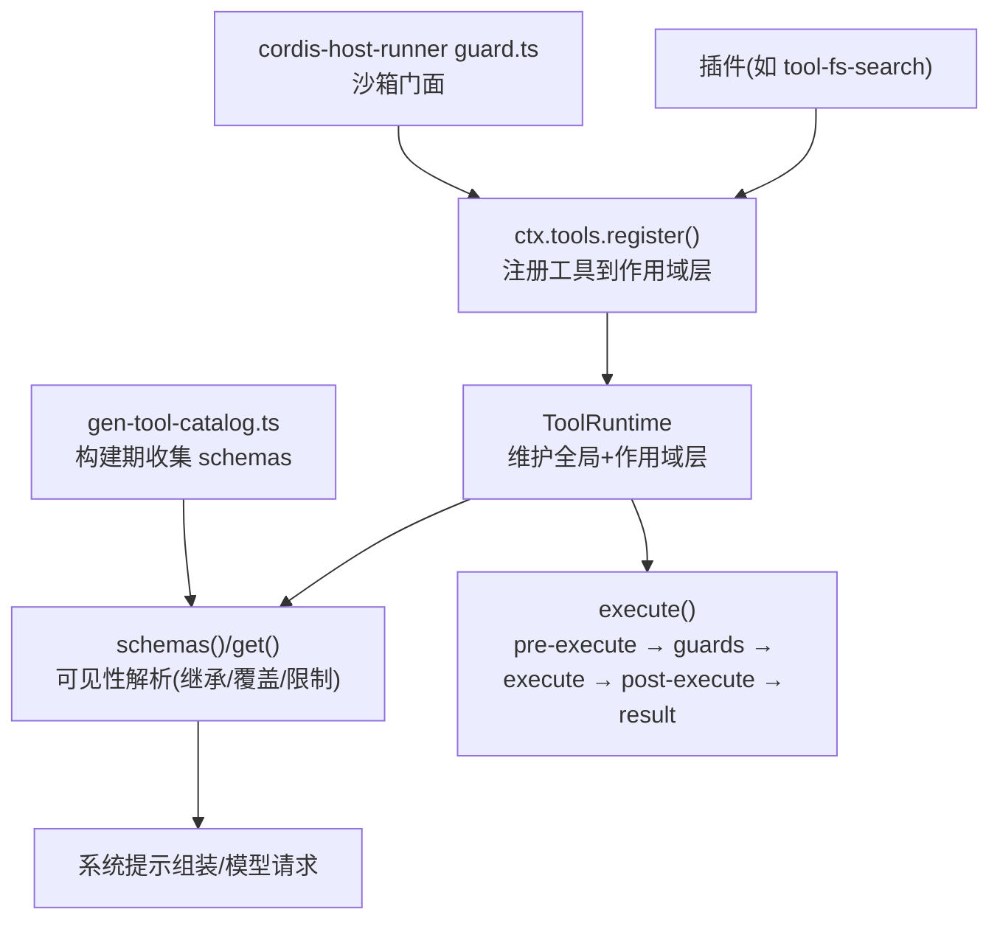
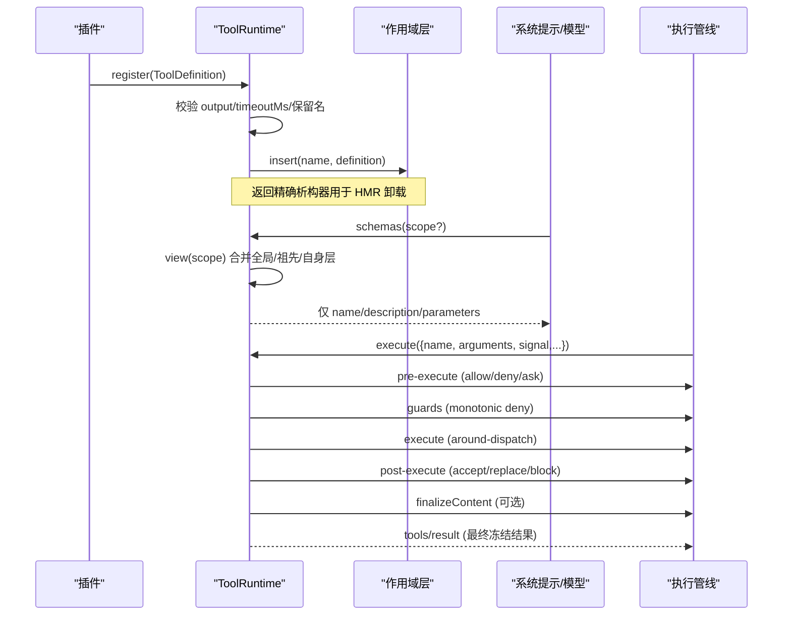
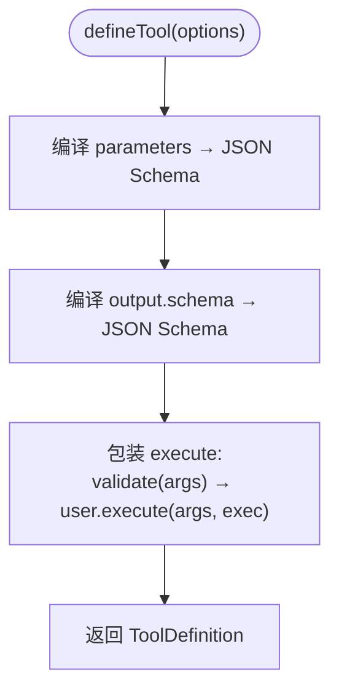
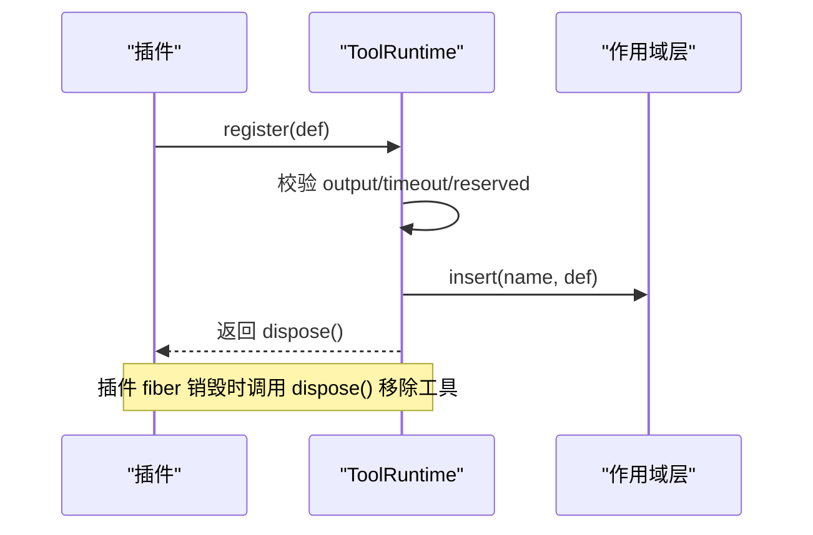
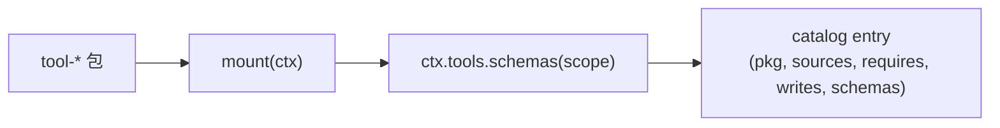
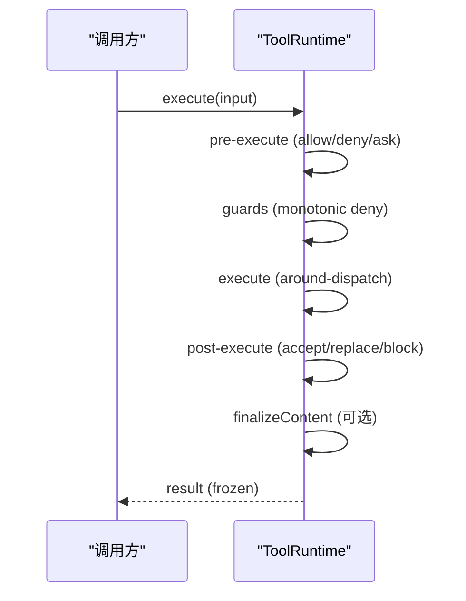
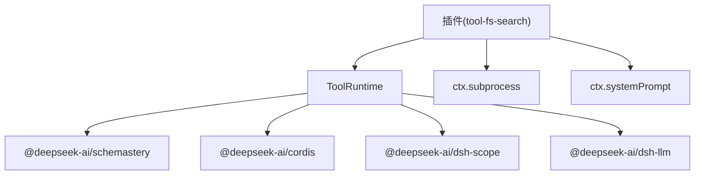

# 工具注册与发现

<cite>
**本文引用的文件**
- [packages/core/tools/src/index.ts](file://packages/core/tools/src/index.ts)
- [packages/core/tools/src/schema.ts](file://packages/core/tools/src/schema.ts)
- [packages/fs/tool-fs-search/src/index.ts](file://packages/fs/tool-fs-search/src/index.ts)
- [scripts/gen-tool-catalog.ts](file://scripts/gen-tool-catalog.ts)
- [packages/extensions/cordis-host-runner/src/guard.ts](file://packages/extensions/cordis-host-runner/src/guard.ts)
- [packages/subagent/tool-subagent-control/tests/list-agents.spec.ts](file://packages/subagent/tool-subagent-control/tests/list-agents.spec.ts)
- [packages/core/tools/tests/tools.spec.ts](file://packages/core/tools/tests/tools.spec.ts)
- [docs/subsystems/tools.md](file://docs/subsystems/tools.md)
</cite>

## 目录
1. [简介](#简介)
2. [项目结构](#项目结构)
3. [核心组件](#核心组件)
4. [架构总览](#架构总览)
5. [详细组件分析](#详细组件分析)
6. [依赖关系分析](#依赖关系分析)
7. [性能考量](#性能考量)
8. [故障排查指南](#故障排查指南)
9. [结论](#结论)
10. [附录](#附录)

## 简介
本文件聚焦 DeepSeek Harness 的“工具注册与发现”机制，系统性说明：
- 如何使用 defineTool 声明工具（名称、描述、参数 schema、输出 schema、执行函数等）
- 如何通过 ctx.tools.register() 将工具加入注册表，并理解其作用域与生命周期
- 插件如何自动注册/注销工具（HMR 安全）
- 工具发现的实现原理（扫描与加载、命名空间组织）
- 不同类型工具的注册示例（简单、异步、复杂）
- 错误处理与调试技巧

## 项目结构
围绕工具注册与发现的关键代码分布在以下位置：
- 工具运行时与注册表：packages/core/tools/src/index.ts
- 工具定义 DSL 与类型推导：packages/core/tools/src/schema.ts
- 插件式工具包示例（文件系统搜索）：packages/fs/tool-fs-search/src/index.ts
- 工具目录生成与收集（构建期发现）：scripts/gen-tool-catalog.ts
- 沙箱化工具 API 门面（限制暴露能力）：packages/extensions/cordis-host-runner/src/guard.ts
- HMR 安全与生命周期测试：packages/subagent/tool-subagent-control/tests/list-agents.spec.ts
- 注册行为与错误用例：packages/core/tools/tests/tools.spec.ts
- 子系统文档（概念与契约）：docs/subsystems/tools.md

图表来源
- [packages/core/tools/src/index.ts:1030-1061](file://packages/core/tools/src/index.ts#L1030-L1061)
- [packages/fs/tool-fs-search/src/index.ts:127-160](file://packages/fs/tool-fs-search/src/index.ts#L127-L160)
- [scripts/gen-tool-catalog.ts:684-715](file://scripts/gen-tool-catalog.ts#L684-L715)
- [packages/extensions/cordis-host-runner/src/guard.ts:639-655](file://packages/extensions/cordis-host-runner/src/guard.ts#L639-L655)

章节来源
- [packages/core/tools/src/index.ts:1030-1061](file://packages/core/tools/src/index.ts#L1030-L1061)
- [packages/fs/tool-fs-search/src/index.ts:127-160](file://packages/fs/tool-fs-search/src/index.ts#L127-L160)
- [scripts/gen-tool-catalog.ts:684-715](file://scripts/gen-tool-catalog.ts#L684-L715)
- [packages/extensions/cordis-host-runner/src/guard.ts:639-655](file://packages/extensions/cordis-host-runner/src/guard.ts#L639-L655)

## 核心组件
- ToolRuntime（注册表与执行管线）
  - register(): 校验并插入工具定义，返回精确的析构器以支持 HMR 安全卸载
  - schemas()/get(): 基于作用域链计算可见的工具集合（继承、覆盖、限制）
  - execute(): 统一执行流水线（pre-execute → guards → around-dispatch → post-execute → finalizeContent → result）
- defineTool（工具定义 DSL）
  - 参数 schema：ParameterSchemaSpec → JSON Schema
  - 输出 schema：ValueSchemaSpec → JSON Schema + render/presentationMeta
  - 执行函数：validate(args) → execute(args, exec)
- 插件与工具包
  - 通过 Cordis 插件 apply(ctx, config) 调用 ctx.tools.register() 批量注册
  - 使用 inject 声明依赖（tools、systemPrompt、subprocess 等）
- 构建期发现
  - gen-tool-catalog.ts 为每个工具包创建独立 Context，挂载后收集 schemas，形成目录

章节来源
- [packages/core/tools/src/index.ts:1030-1061](file://packages/core/tools/src/index.ts#L1030-L1061)
- [packages/core/tools/src/schema.ts:482-590](file://packages/core/tools/src/schema.ts#L482-L590)
- [packages/fs/tool-fs-search/src/index.ts:66-71](file://packages/fs/tool-fs-search/src/index.ts#L66-L71)
- [scripts/gen-tool-catalog.ts:684-715](file://scripts/gen-tool-catalog.ts#L684-L715)

## 架构总览
下图展示了从插件注册到工具发现与调用的完整流程。

图表来源
- [packages/core/tools/src/index.ts:1030-1061](file://packages/core/tools/src/index.ts#L1030-L1061)
- [packages/core/tools/src/index.ts:1151-1191](file://packages/core/tools/src/index.ts#L1151-L1191)
- [docs/subsystems/tools.md:170-173](file://docs/subsystems/tools.md#L170-L173)

## 详细组件分析

### 使用 defineTool 声明工具
- 参数 schema：使用 ParameterSchemaSpec 描述属性与 required，编译为标准 JSON Schema
- 输出 schema：使用 ValueSchemaSpec 描述返回值类型，并提供 render 与可选 presentationMeta
- 执行函数：defineTool 内部先 validate(args)，再调用用户 execute；异常会转为结构化错误
- 超时预算：可声明 timeoutMs（正有限数），由策略在 around-dispatch 中执行

图表来源
- [packages/core/tools/src/schema.ts:482-590](file://packages/core/tools/src/schema.ts#L482-L590)

章节来源
- [packages/core/tools/src/schema.ts:482-590](file://packages/core/tools/src/schema.ts#L482-L590)
- [docs/subsystems/tools.md:98-151](file://docs/subsystems/tools.md#L98-L151)

### 工具注册与生命周期
- 注册：ctx.tools.register(definition)
  - 校验 output 结构、output.schema 合法性、timeoutMs 范围
  - 拒绝保留名（如 run_code）
  - 通过 layers.effect 插入当前作用域层，并返回精确析构器
- 作用域与可见性：
  - 全局层 + 祖先层继承，当前作用域层覆盖
  - restrict() 对继承的工具进行 allow/deny 过滤
- 生命周期/HMR：
  - 插件 fiber 销毁时，register 返回的析构器会被调用，确保工具被移除
  - 测试验证了重复注册失败、fiber.dispose 后工具消失

图表来源
- [packages/core/tools/src/index.ts:1030-1061](file://packages/core/tools/src/index.ts#L1030-L1061)
- [packages/subagent/tool-subagent-control/tests/list-agents.spec.ts:248-257](file://packages/subagent/tool-subagent-control/tests/list-agents.spec.ts#L248-L257)

章节来源
- [packages/core/tools/src/index.ts:1030-1061](file://packages/core/tools/src/index.ts#L1030-L1061)
- [packages/subagent/tool-subagent-control/tests/list-agents.spec.ts:248-257](file://packages/subagent/tool-subagent-control/tests/list-agents.spec.ts#L248-L257)
- [packages/core/tools/tests/tools.spec.ts:1978-1997](file://packages/core/tools/tests/tools.spec.ts#L1978-L1997)

### 工具发现与命名空间
- 运行期发现：
  - 插件通过 inject(['tools', ...]) 获取 ctx.tools，并在 apply(ctx, config) 中调用 register
  - 工具按名称组织，同一作用域内同名冲突会报错
  - 可通过 restrict() 对继承的工具集进行 allow/deny 过滤
- 构建期发现：
  - scripts/gen-tool-catalog.ts 为每个工具包创建独立 Context，挂载 SystemPrompt 与 ToolRuntime，然后 mount 插件，收集 schemas() 并生成目录
  - 保证所有 shipped 工具包都被清单覆盖，新增工具必须登记

图表来源
- [scripts/gen-tool-catalog.ts:684-715](file://scripts/gen-tool-catalog.ts#L684-L715)

章节来源
- [packages/fs/tool-fs-search/src/index.ts:66-71](file://packages/fs/tool-fs-search/src/index.ts#L66-L71)
- [scripts/gen-tool-catalog.ts:684-715](file://scripts/gen-tool-catalog.ts#L684-L715)

### 执行管线与事件
- 执行顺序：pre-execute → guards → execute（around-dispatch）→ post-execute → finalizeContent → result
- 关键事件：
  - tools/pre-execute：允许/拒绝/询问（需审批服务）
  - tools/execute：超时、重试、指标等横切逻辑
  - tools/post-execute：接受/替换 value 或 content/阻断
  - tools/result：最终冻结结果的观察者
- 嵌套调用：子调用可携带 parent token，meta 在嵌套场景下抑制

图表来源
- [docs/subsystems/tools.md:170-173](file://docs/subsystems/tools.md#L170-L173)
- [packages/core/tools/src/index.ts:142-197](file://packages/core/tools/src/index.ts#L142-L197)

章节来源
- [docs/subsystems/tools.md:170-173](file://docs/subsystems/tools.md#L170-L173)
- [packages/core/tools/src/index.ts:142-197](file://packages/core/tools/src/index.ts#L142-L197)

### 示例：不同类型工具的注册
- 简单工具：使用 defineTool 声明参数与输出，直接返回标量或对象
- 异步工具：execute 返回 Promise，注意遵循 exec.signal 取消语义
- 复杂工具：组合多个子调用、附加上下文、设置 concludesTurn 标记结束本轮

参考路径（不展示代码内容）：
- 简单/异步/复杂工具注册与执行：[packages/core/tools/tests/tools.spec.ts:23-34](file://packages/core/tools/tests/tools.spec.ts#L23-L34)、[packages/core/tools/tests/tools.spec.ts:86-94](file://packages/core/tools/tests/tools.spec.ts#L86-L94)
- 插件批量注册（glob/grep）：[packages/fs/tool-fs-search/src/index.ts:127-160](file://packages/fs/tool-fs-search/src/index.ts#L127-L160)

章节来源
- [packages/core/tools/tests/tools.spec.ts:23-34](file://packages/core/tools/tests/tools.spec.ts#L23-L34)
- [packages/core/tools/tests/tools.spec.ts:86-94](file://packages/core/tools/tests/tools.spec.ts#L86-L94)
- [packages/fs/tool-fs-search/src/index.ts:127-160](file://packages/fs/tool-fs-search/src/index.ts#L127-L160)

## 依赖关系分析
- ToolRuntime 依赖：
  - @deepseek-ai/cordis（Context/Service）
  - @deepseek-ai/dsh-scope（作用域层）
  - @deepseek-ai/dsh-llm（类型与错误）
  - @deepseek-ai/schemastery（JSON Schema 校验）
  - 各子系统（systemPrompt、codeRuntime、approval 等）
- 插件依赖：
  - 通过 inject 声明所需服务（tools、systemPrompt、subprocess 等）
  - 在 apply(ctx, config) 中完成注册

图表来源
- [packages/core/tools/src/index.ts:1-28](file://packages/core/tools/src/index.ts#L1-L28)
- [packages/fs/tool-fs-search/src/index.ts:29-35](file://packages/fs/tool-fs-search/src/index.ts#L29-L35)

章节来源
- [packages/core/tools/src/index.ts:1-28](file://packages/core/tools/src/index.ts#L1-L28)
- [packages/fs/tool-fs-search/src/index.ts:29-35](file://packages/fs/tool-fs-search/src/index.ts#L29-L35)

## 性能考量
- 注册开销低：register 仅做轻量校验与 Map 插入
- 可见性计算：view() 遍历作用域链一次，复杂度与层级线性相关
- 执行管线：
  - pre/post-execute 水线应尽量避免阻塞与重计算
  - isConcurrencySafe 可启用并行调度，减少端到端延迟
- 超时预算：合理设置 timeoutMs，配合策略避免长尾任务

## 故障排查指南
常见错误与定位方法：
- 未声明 output 或 output 字段非法：register 抛出 TypeError
- timeoutMs 非正有限数：register 抛出 TypeError
- 重复注册同名工具：抛出 already registered
- 未知工具调用：返回 UNKNOWN_TOOL 结构化错误
- 输出值与 schema 不匹配：INVALID_TOOL_OUTPUT
- 审批缺失导致 ask 降级为 deny：检查 approval 服务是否挂载

调试技巧：
- 监听 tools/change 观察注册/注销变化
- 监听 tools/result 查看最终冻结结果
- 使用 ctx.tools.schemas(scope) 确认可见工具集合
- 在 pre-execute/execute/post-execute 中添加日志（注意不要泄露敏感信息）

章节来源
- [packages/core/tools/tests/tools.spec.ts:1966-1997](file://packages/core/tools/tests/tools.spec.ts#L1966-L1997)
- [packages/core/tools/tests/tools.spec.ts:620-674](file://packages/core/tools/tests/tools.spec.ts#L620-L674)
- [packages/core/tools/tests/tools.spec.ts:237-260](file://packages/core/tools/tests/tools.spec.ts#L237-L260)
- [docs/subsystems/tools.md:576-599](file://docs/subsystems/tools.md#L576-L599)

## 结论
DeepSeek Harness 的工具系统通过 defineTool 提供强类型的工具声明，结合 ctx.tools.register 的作用域注册与生命周期管理，实现了安全的插件化扩展。工具发现既支持运行期插件注入，也支持构建期目录生成，便于审计与发布。统一的执行管线与事件机制使得权限控制、超时、重试、结果规范化等横切关注点得以解耦。遵循本文规范，可以高效地开发、注册与调试各类工具。

## 附录
- 快速上手步骤
  - 在插件 apply(ctx, config) 中注入 tools，调用 ctx.tools.register(defineTool({...}))
  - 如需受限可见性，使用 ctx.tools.restrict({ allow/deny })
  - 通过 ctx.tools.schemas() 验证已注册工具
- 参考路径
  - 工具定义 DSL：[packages/core/tools/src/schema.ts:482-590](file://packages/core/tools/src/schema.ts#L482-L590)
  - 注册与可见性：[packages/core/tools/src/index.ts:1030-1061](file://packages/core/tools/src/index.ts#L1030-L1061), [packages/core/tools/src/index.ts:1151-1191](file://packages/core/tools/src/index.ts#L1151-L1191)
  - 插件示例：[packages/fs/tool-fs-search/src/index.ts:127-160](file://packages/fs/tool-fs-search/src/index.ts#L127-L160)
  - 构建期目录：[scripts/gen-tool-catalog.ts:684-715](file://scripts/gen-tool-catalog.ts#L684-L715)
  - 沙箱门面：[packages/extensions/cordis-host-runner/src/guard.ts:639-655](file://packages/extensions/cordis-host-runner/src/guard.ts#L639-L655)
  - 子系统文档：[docs/subsystems/tools.md:9-151](file://docs/subsystems/tools.md#L9-L151)