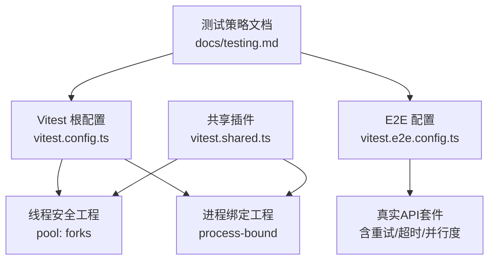
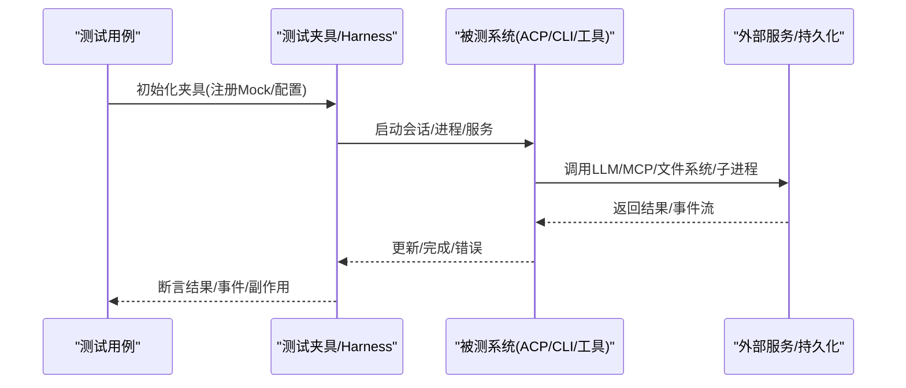
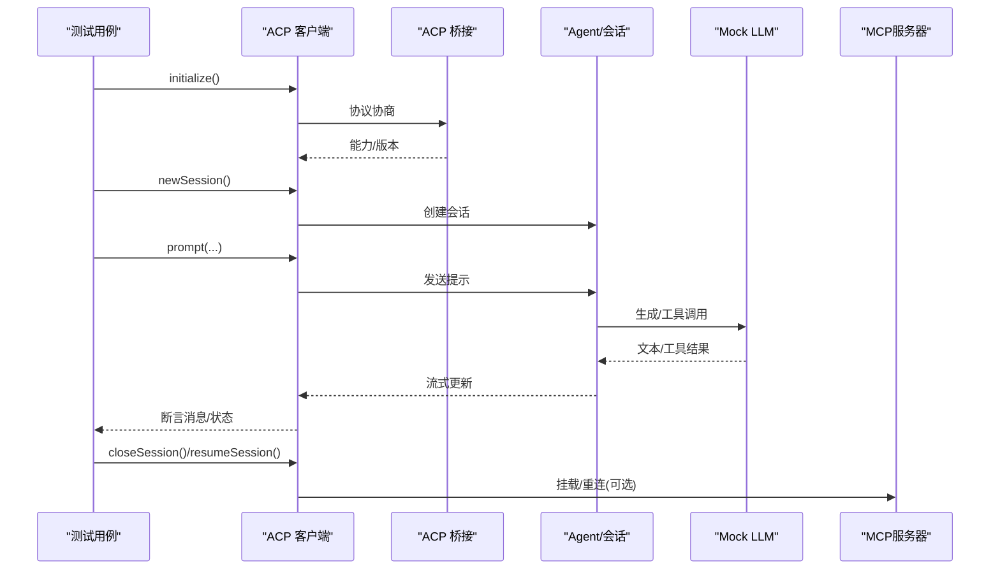
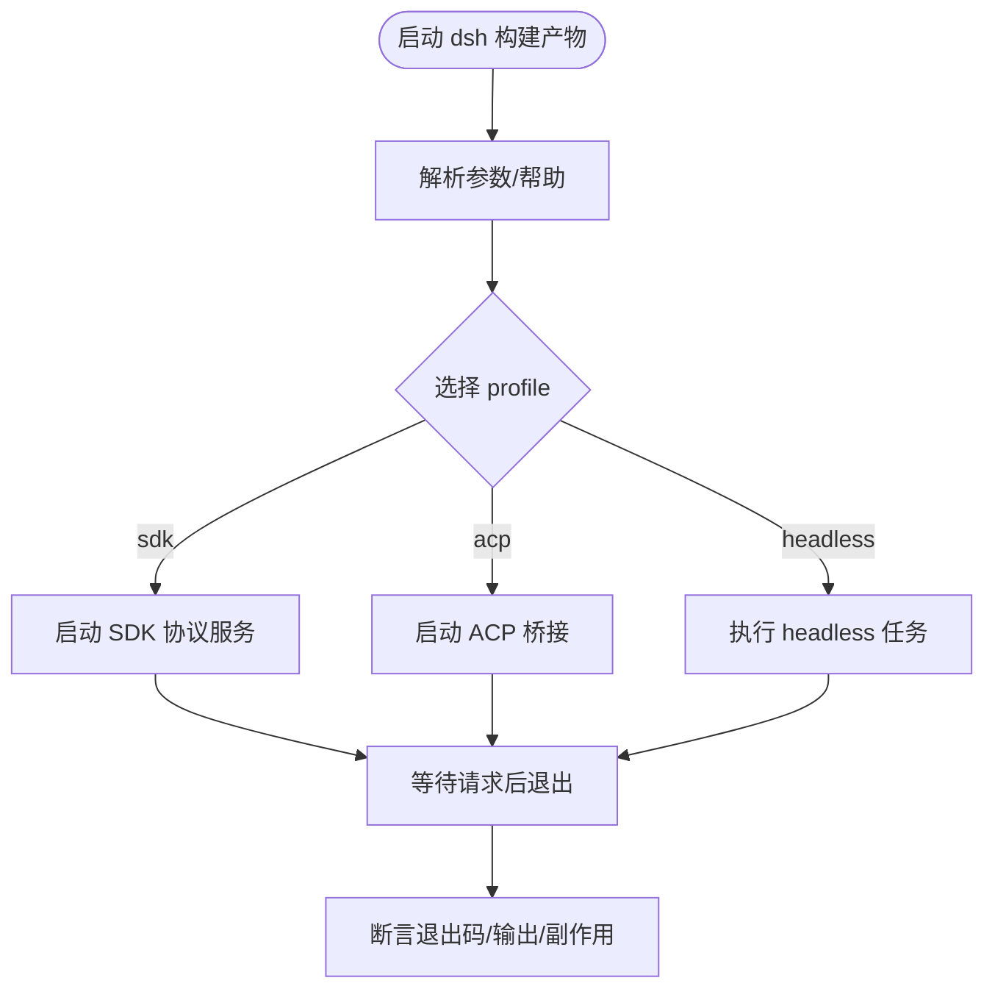
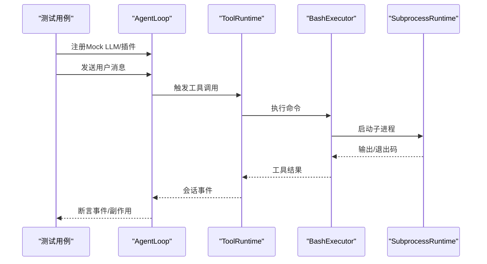
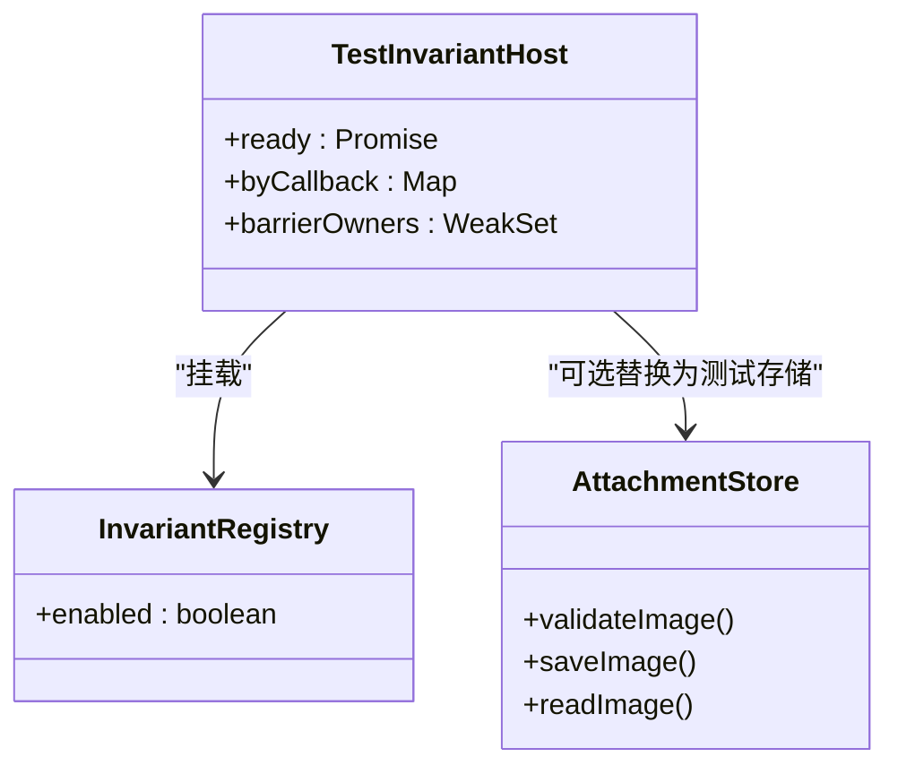
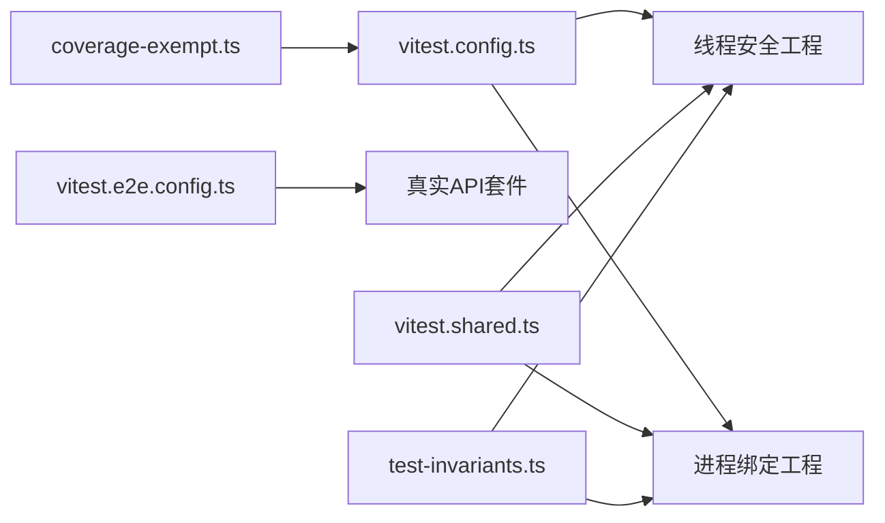

# 工具测试与调试

<cite>
**本文引用的文件**
- [vitest.config.ts](file://vitest.config.ts)
- [vitest.e2e.config.ts](file://vitest.e2e.config.ts)
- [vitest.shared.ts](file://vitest.shared.ts)
- [testing.md](file://docs/testing.md)
- [bridge.spec.ts](file://packages/acp/acp/tests/bridge.spec.ts)
- [harness.ts](file://packages/acp/acp/tests/harness.ts)
- [built-bin.e2e.ts](file://apps/cli/tests/built-bin.e2e.ts)
- [integration.spec.ts](file://packages/shell/tool-bash/tests/integration.spec.ts)
- [test-invariants.ts](file://scripts/test-invariants.ts)
- [coverage-exempt.ts](file://scripts/coverage-exempt.ts)
- [README.md](file://packages/test-support/README.md)
</cite>

## 目录
1. [简介](#简介)
2. [项目结构](#项目结构)
3. [核心组件](#核心组件)
4. [架构总览](#架构总览)
5. [详细组件分析](#详细组件分析)
6. [依赖关系分析](#依赖关系分析)
7. [性能考虑](#性能考虑)
8. [故障排查指南](#故障排查指南)
9. [结论](#结论)
10. [附录](#附录)

## 简介
本文件面向DeepSeek Harness的工具测试与调试，系统化说明单元测试、集成测试、调试技巧、性能与压力测试方法，并给出覆盖正常流程、边界情况与错误场景的示例路径。文档基于仓库中的测试配置、测试策略文档与代表性测试实现进行提炼，帮助读者快速建立可复用的测试与排障体系。

## 项目结构
仓库采用分层测试组织：
- 单元测试：位于各包的 tests 目录，使用 Vitest，按“线程安全”和“进程绑定”两类工程隔离执行，确保进程级副作用不互相污染。
- 端到端测试：独立配置文件，支持真实API调用（可选），通过环境变量控制并行度与重试。
- 覆盖率门禁：对 packages/*/src 源码要求每文件100%覆盖，配合排除清单与平台差异处理。
- 共享能力：统一的装饰器预处理、tsconfig路径解析、全局不变量注入等。

图表来源
- [vitest.config.ts:149-191](file://vitest.config.ts#L149-L191)
- [vitest.e2e.config.ts:31-61](file://vitest.e2e.config.ts#L31-L61)
- [vitest.shared.ts:15-42](file://vitest.shared.ts#L15-L42)
- [testing.md:7-15](file://docs/testing.md#L7-L15)

章节来源
- [vitest.config.ts:112-191](file://vitest.config.ts#L112-L191)
- [vitest.e2e.config.ts:1-61](file://vitest.e2e.config.ts#L1-L61)
- [vitest.shared.ts:1-42](file://vitest.shared.ts#L1-L42)
- [testing.md:7-15](file://docs/testing.md#L7-L15)

## 核心组件
- 测试运行与隔离
  - 双工程模式：线程安全工程与进程绑定工程分离，避免进程级状态污染。
  - 平台适配：Windows/macOS/Linux 的差异排除与覆盖豁免。
  - 覆盖率门禁：每文件100%，附带精确未覆盖位置报告。
- 端到端测试
  - 真实API套件：支持凭据加载、超时与重试、并发控制。
  - 构建产物验证：直接运行编译后的二进制入口，验证真实装配链路。
- 测试支撑
  - 装饰器预处理：统一在Vite解析前转译TypeScript装饰器。
  - 全局不变量：自动挂载包内 invariant 检查，保证运行时契约。
  - 覆盖率豁免：重型或不可测套件白名单管理。

章节来源
- [vitest.config.ts:149-191](file://vitest.config.ts#L149-L191)
- [vitest.config.ts:192-362](file://vitest.config.ts#L192-L362)
- [vitest.e2e.config.ts:1-61](file://vitest.e2e.config.ts#L1-L61)
- [vitest.shared.ts:15-42](file://vitest.shared.ts#L15-L42)
- [test-invariants.ts:1-109](file://scripts/test-invariants.ts#L1-L109)
- [coverage-exempt.ts:28-50](file://scripts/coverage-exempt.ts#L28-L50)
- [testing.md:7-15](file://docs/testing.md#L7-L15)

## 架构总览
下图展示从测试入口到被测系统的典型调用链，涵盖ACP桥接、CLI构建产物、以及Shell工具集成测试。

图表来源
- [bridge.spec.ts:35-91](file://packages/acp/acp/tests/bridge.spec.ts#L35-L91)
- [harness.ts:287-309](file://packages/acp/acp/tests/harness.ts#L287-L309)
- [built-bin.e2e.ts:427-564](file://apps/cli/tests/built-bin.e2e.ts#L427-L564)
- [integration.spec.ts:20-41](file://packages/shell/tool-bash/tests/integration.spec.ts#L20-L41)

## 详细组件分析

### ACP 自动化桥接测试
- 目标：验证协议协商、会话生命周期、配置选项、MCP挂载、取消与恢复等。
- 关键实践
  - 使用夹具封装客户端与服务端连接，集中管理会话与更新监听。
  - 通过Mock LLM适配器驱动完整对话轮次，断言消息、工具调用与状态。
  - 覆盖并发关闭、重复恢复、无效游标、配置变更传播等边界与异常路径。

图表来源
- [bridge.spec.ts:35-91](file://packages/acp/acp/tests/bridge.spec.ts#L35-L91)
- [bridge.spec.ts:109-157](file://packages/acp/acp/tests/bridge.spec.ts#L109-L157)
- [bridge.spec.ts:159-245](file://packages/acp/acp/tests/bridge.spec.ts#L159-L245)
- [bridge.spec.ts:323-415](file://packages/acp/acp/tests/bridge.spec.ts#L323-L415)
- [bridge.spec.ts:716-792](file://packages/acp/acp/tests/bridge.spec.ts#L716-L792)
- [harness.ts:287-309](file://packages/acp/acp/tests/harness.ts#L287-L309)

章节来源
- [bridge.spec.ts:35-91](file://packages/acp/acp/tests/bridge.spec.ts#L35-L91)
- [bridge.spec.ts:109-157](file://packages/acp/acp/tests/bridge.spec.ts#L109-L157)
- [bridge.spec.ts:159-245](file://packages/acp/acp/tests/bridge.spec.ts#L159-L245)
- [bridge.spec.ts:323-415](file://packages/acp/acp/tests/bridge.spec.ts#L323-L415)
- [bridge.spec.ts:716-792](file://packages/acp/acp/tests/bridge.spec.ts#L716-L792)
- [harness.ts:287-309](file://packages/acp/acp/tests/harness.ts#L287-L309)

### CLI 构建产物端到端测试
- 目标：验证发布入口的行为，包括参数校验、帮助输出、SDK/ACP/Headless 模式的启动与退出、信号处理、热重载与配置层叠加。
- 关键实践
  - 直接以 Node 运行编译后的 bin.js，绕过 tsx 掩盖的问题。
  - 通过临时目录与最小化 profile 构造环境，断言文件标记与输出。
  - 使用 Mock LLM 服务端模拟模型响应，验证网络交互与鉴权头。

图表来源
- [built-bin.e2e.ts:329-401](file://apps/cli/tests/built-bin.e2e.ts#L329-L401)
- [built-bin.e2e.ts:427-564](file://apps/cli/tests/built-bin.e2e.ts#L427-L564)
- [built-bin.e2e.ts:566-592](file://apps/cli/tests/built-bin.e2e.ts#L566-L592)
- [built-bin.e2e.ts:677-743](file://apps/cli/tests/built-bin.e2e.ts#L677-L743)

章节来源
- [built-bin.e2e.ts:329-401](file://apps/cli/tests/built-bin.e2e.ts#L329-L401)
- [built-bin.e2e.ts:427-564](file://apps/cli/tests/built-bin.e2e.ts#L427-L564)
- [built-bin.e2e.ts:566-592](file://apps/cli/tests/built-bin.e2e.ts#L566-L592)
- [built-bin.e2e.ts:677-743](file://apps/cli/tests/built-bin.e2e.ts#L677-L743)

### Shell 工具集成测试（Bash）
- 目标：以脚本化Mock模型驱动真实 Bash 工具，验证工具调用、作业调度、子进程执行与事件流转。
- 关键实践
  - 组装 AgentLoop、工具运行时、本地子进程与 Bash 执行器。
  - 通过会话事件断言工具调用与结果，验证跨子系统协作。

图表来源
- [integration.spec.ts:20-41](file://packages/shell/tool-bash/tests/integration.spec.ts#L20-L41)

章节来源
- [integration.spec.ts:20-41](file://packages/shell/tool-bash/tests/integration.spec.ts#L20-L41)

### 测试基础设施与不变量
- 全局不变量宿主：自动发现并挂载各包的 invariant 检查，确保测试期间运行时契约生效。
- 装饰器预处理：统一在Vite解析前将TS装饰器转译为可执行代码。
- 覆盖率豁免：对重型或不可测套件进行白名单管理，保持CI稳定。

图表来源
- [test-invariants.ts:159-211](file://scripts/test-invariants.ts#L159-L211)
- [test-invariants.ts:114-135](file://scripts/test-invariants.ts#L114-L135)
- [vitest.shared.ts:15-42](file://vitest.shared.ts#L15-L42)
- [coverage-exempt.ts:28-50](file://scripts/coverage-exempt.ts#L28-L50)

章节来源
- [test-invariants.ts:1-109](file://scripts/test-invariants.ts#L1-L109)
- [test-invariants.ts:159-211](file://scripts/test-invariants.ts#L159-L211)
- [vitest.shared.ts:15-42](file://vitest.shared.ts#L15-L42)
- [coverage-exempt.ts:28-50](file://scripts/coverage-exempt.ts#L28-L50)

## 依赖关系分析
- 测试框架与配置
  - Vitest 根配置定义测试包含范围、排除规则、覆盖率阈值与报告。
  - E2E 配置独立于单元，支持凭据与环境变量，控制并发与重试。
- 共享能力
  - 装饰器预处理插件在所有源模式测试中复用。
  - 全局不变量宿主在每个测试根自动启用，保障契约。
- 平台与覆盖
  - Windows/macOS/Linux 差异通过排除与豁免清单管理。
  - 覆盖率门禁严格，但允许合理豁免以保持CI效率。

图表来源
- [vitest.config.ts:149-191](file://vitest.config.ts#L149-L191)
- [vitest.e2e.config.ts:31-61](file://vitest.e2e.config.ts#L31-L61)
- [vitest.shared.ts:15-42](file://vitest.shared.ts#L15-L42)
- [test-invariants.ts:159-211](file://scripts/test-invariants.ts#L159-L211)
- [coverage-exempt.ts:28-50](file://scripts/coverage-exempt.ts#L28-L50)

章节来源
- [vitest.config.ts:149-191](file://vitest.config.ts#L149-L191)
- [vitest.e2e.config.ts:31-61](file://vitest.e2e.config.ts#L31-L61)
- [vitest.shared.ts:15-42](file://vitest.shared.ts#L15-L42)
- [test-invariants.ts:159-211](file://scripts/test-invariants.ts#L159-L211)
- [coverage-exempt.ts:28-50](file://scripts/coverage-exempt.ts#L28-L50)

## 性能考虑
- 并发与隔离
  - 单元测试默认使用 fork 池，避免线程共享状态导致的竞态。
  - E2E 通过环境变量控制最大工作进程数，平衡速度与资源占用。
- 超时与重试
  - E2E 设置较长超时与重试次数，降低网络抖动影响。
- 覆盖率开销
  - 覆盖率门禁严格，重型套件可通过豁免清单减少测量成本。
- 建议
  - 优先使用轻量夹具与Mock，减少I/O与外部依赖。
  - 对耗时操作使用异步等待与条件轮询，避免固定sleep。
  - 在CI中使用分区覆盖率与并行执行，缩短反馈时间。

[本节提供通用指导，无需特定文件引用]

## 故障排查指南
- 常见症状与定位
  - 进程卡死：检查是否缺少清理逻辑或信号处理；参考CLI生命周期测试中的就绪/中断/处置标记。
  - 协议不一致：核对协议版本与能力声明；参考ACP桥接测试中的initialize与能力断言。
  - 配置未生效：确认patch层与profile层叠加顺序；参考CLI热重载与配置回退测试。
  - 覆盖率失败：查看未覆盖位置报告，区分死代码与缺失测试。
- 调试技巧
  - 日志：在关键路径打印结构化信息，结合E2O输出与stderr。
  - 断点：在夹具与入口函数处打断点，观察会话状态与事件流。
  - 跟踪：利用会话事件与工具调用事件，绘制时序图辅助定位。
- 参考路径
  - 生命周期与信号处理：[built-bin.e2e.ts:677-743](file://apps/cli/tests/built-bin.e2e.ts#L677-L743)
  - 协议协商与能力：[bridge.spec.ts:35-91](file://packages/acp/acp/tests/bridge.spec.ts#L35-L91)
  - 配置热重载：[built-bin.e2e.ts:693-743](file://apps/cli/tests/built-bin.e2e.ts#L693-L743)
  - 覆盖率报告：[vitest.config.ts:192-362](file://vitest.config.ts#L192-L362)

章节来源
- [built-bin.e2e.ts:677-743](file://apps/cli/tests/built-bin.e2e.ts#L677-L743)
- [bridge.spec.ts:35-91](file://packages/acp/acp/tests/bridge.spec.ts#L35-L91)
- [vitest.config.ts:192-362](file://vitest.config.ts#L192-L362)

## 结论
本仓库建立了完善的测试分层与质量门禁：单元测试强调隔离与契约，端到端测试验证真实装配与外部交互，覆盖率门禁确保关键路径被充分覆盖。通过夹具与Mock，既能高效验证正常流程，也能覆盖边界与异常场景。结合日志、断点与事件跟踪，可快速定位问题。建议在新增功能时同步补充对应层级测试，并遵循现有夹具与配置约定，保持CI稳定与反馈迅速。

[本节为总结性内容，无需特定文件引用]

## 附录
- 测试策略概览
  - 分层：单元、覆盖率门禁、真实API端到端、预期输出、快照、Web浏览器快照。
  - 原则：优先真实实现而非Mock；验证世界而非自报告；测试真实入口路径。
- 测试支撑包
  - 提供无密钥、确定性的测试夹具、回放与故障注入能力。

章节来源
- [testing.md:7-15](file://docs/testing.md#L7-L15)
- [testing.md:18-37](file://docs/testing.md#L18-L37)
- [README.md](file://packages/test-support/README.md)