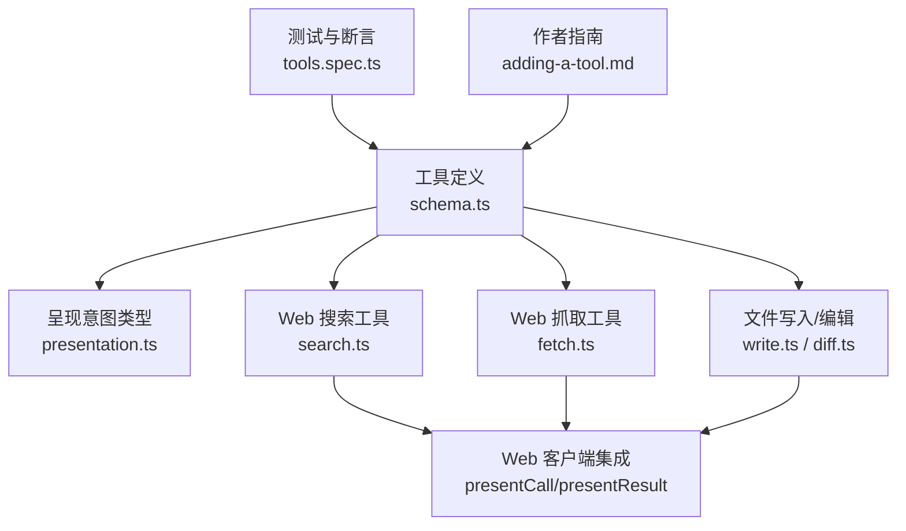
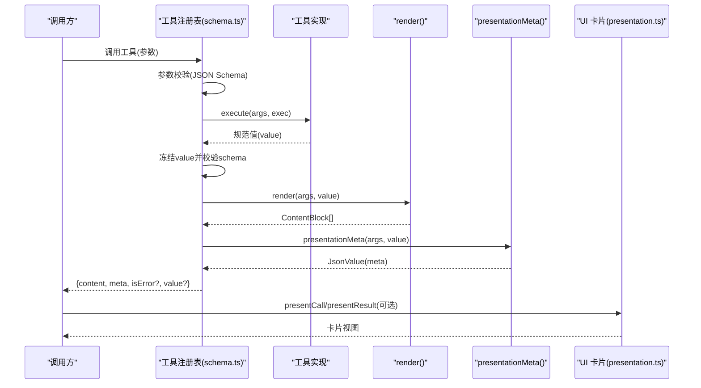
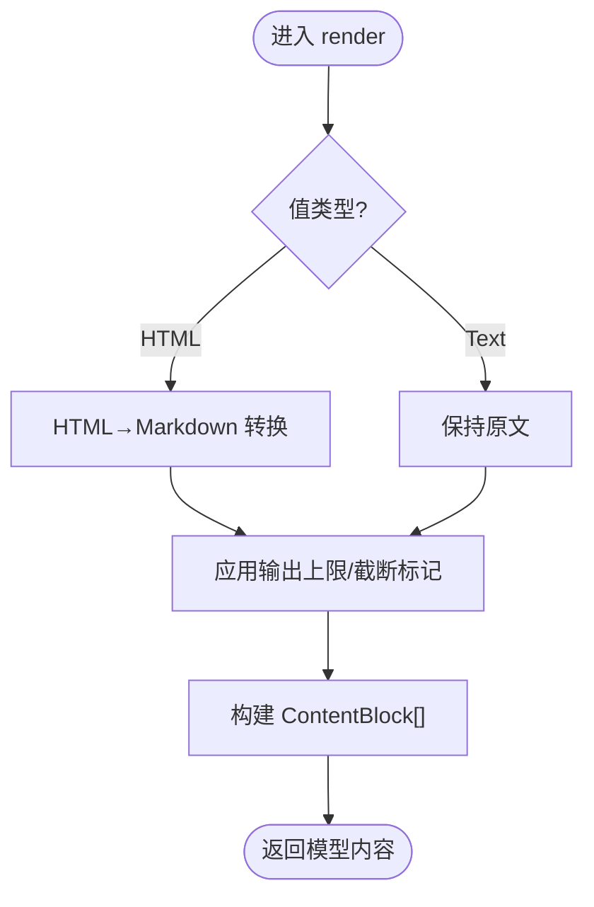
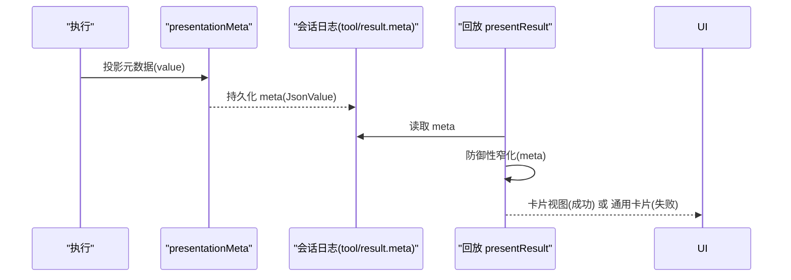
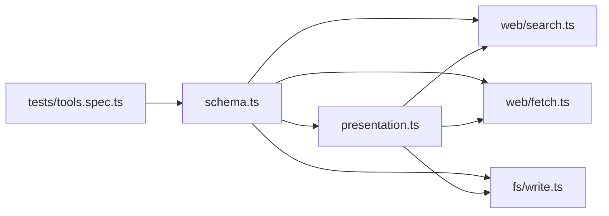

# 工具输出渲染

<cite>
**本文引用的文件**
- [packages/core/tools/src/schema.ts](file://packages/core/tools/src/schema.ts)
- [packages/core/tools/src/presentation.ts](file://packages/core/tools/src/presentation.ts)
- [packages/web/tool-web/src/fetch.ts](file://packages/web/tool-web/src/fetch.ts)
- [packages/web/tool-web/src/search.ts](file://packages/web/tool-web/src/search.ts)
- [packages/fs/tool-fs/src/diff.ts](file://packages/fs/tool-fs/src/diff.ts)
- [packages/fs/tool-fs/src/write.ts](file://packages/fs/tool-fs/src/write.ts)
- [packages/core/tools/tests/tools.spec.ts](file://packages/core/tools/tests/tools.spec.ts)
- [docs/cookbook/adding-a-tool.md](file://docs/cookbook/adding-a-tool.md)
</cite>

## 目录
1. [简介](#简介)
2. [项目结构](#项目结构)
3. [核心组件](#核心组件)
4. [架构总览](#架构总览)
5. [详细组件分析](#详细组件分析)
6. [依赖关系分析](#依赖关系分析)
7. [性能考虑](#性能考虑)
8. [故障排查指南](#故障排查指南)
9. [结论](#结论)
10. [附录](#附录)

## 简介
本文件系统性说明 DeepSeek Harness 中“工具输出渲染”的机制：从 output.schema 的定义与值序列化，到 render 函数如何将工具结果转换为模型友好的文本；再到 presentationMeta 如何持久化结构化数据并支持 UI 状态重放。文档同时给出文本输出、结构化数据、文件差异显示等具体示例路径，并提供 UI 卡片开发与 Web 客户端集成的最佳实践。

## 项目结构
围绕工具输出渲染的关键代码分布在以下模块：
- 工具定义与 schema 编译、类型推断、执行包装：packages/core/tools/src/schema.ts
- 呈现意图（UI 卡片）类型与契约：packages/core/tools/src/presentation.ts
- Web 工具（web_search、web_fetch）的输出渲染与元数据投影：packages/web/tool-web/src/search.ts、packages/web/tool-web/src/fetch.ts
- 文件写入/编辑的差异展示：packages/fs/tool-fs/src/write.ts、packages/fs/tool-fs/src/diff.ts
- 行为验证测试：packages/core/tools/tests/tools.spec.ts
- 作者指南与约定：docs/cookbook/adding-a-tool.md

图表来源
- [packages/core/tools/src/schema.ts:545-617](file://packages/core/tools/src/schema.ts#L545-L617)
- [packages/core/tools/src/presentation.ts:10-390](file://packages/core/tools/src/presentation.ts#L10-L390)
- [packages/web/tool-web/src/search.ts:323-375](file://packages/web/tool-web/src/search.ts#L323-L375)
- [packages/web/tool-web/src/fetch.ts:455-513](file://packages/web/tool-web/src/fetch.ts#L455-L513)
- [packages/fs/tool-fs/src/write.ts:122-149](file://packages/fs/tool-fs/src/write.ts#L122-L149)
- [packages/core/tools/tests/tools.spec.ts:96-130](file://packages/core/tools/tests/tools.spec.ts#L96-L130)
- [docs/cookbook/adding-a-tool.md:65-97](file://docs/cookbook/adding-a-tool.md#L65-L97)

章节来源
- [packages/core/tools/src/schema.ts:545-617](file://packages/core/tools/src/schema.ts#L545-L617)
- [packages/core/tools/src/presentation.ts:10-390](file://packages/core/tools/src/presentation.ts#L10-L390)
- [packages/web/tool-web/src/search.ts:323-375](file://packages/web/tool-web/src/search.ts#L323-L375)
- [packages/web/tool-web/src/fetch.ts:455-513](file://packages/web/tool-web/src/fetch.ts#L455-L513)
- [packages/fs/tool-fs/src/write.ts:122-149](file://packages/fs/tool-fs/src/write.ts#L122-L149)
- [packages/core/tools/tests/tools.spec.ts:96-130](file://packages/core/tools/tests/tools.spec.ts#L96-L130)
- [docs/cookbook/adding-a-tool.md:65-97](file://docs/cookbook/adding-a-tool.md#L65-L97)

## 核心组件
- output.schema：用于声明工具返回值的 JSON Schema 子集，支持 string/number/integer/boolean/null/array/object/json/oneOf，并通过 valueSchemaSpecToJsonSchema 编译为受控的原始 JSON Schema，随后在 execute 返回值上执行严格校验。
- output.render：纯函数，将已校验的规范值转换为模型友好的 ContentBlock[]（通常为 text）。
- output.presentationMeta：可选的纯函数，从规范值投影出可重放的 JSON 元数据，随 tool/result 持久化，供 presentResult 在回放时重建 UI 卡片。
- presentCall/presentResult：可选的呈现方法，分别描述“待执行”和“已完成”的 UI 卡片意图（generic/terminal/diff/search/read/web），与 model-facing 内容解耦。

章节来源
- [packages/core/tools/src/schema.ts:12-95](file://packages/core/tools/src/schema.ts#L12-L95)
- [packages/core/tools/src/schema.ts:438-458](file://packages/core/tools/src/schema.ts#L438-L458)
- [packages/core/tools/src/schema.ts:482-536](file://packages/core/tools/src/schema.ts#L482-L536)
- [packages/core/tools/src/schema.ts:545-617](file://packages/core/tools/src/schema.ts#L545-L617)
- [packages/core/tools/src/presentation.ts:10-390](file://packages/core/tools/src/presentation.ts#L10-L390)

## 架构总览
下图展示了工具执行到输出的完整链路：参数校验 → 执行 → 返回值规范化与冻结 → render 生成模型内容 → presentationMeta 生成可重放元数据 → presentCall/presentResult 驱动 UI 卡片。

图表来源
- [packages/core/tools/src/schema.ts:545-617](file://packages/core/tools/src/schema.ts#L545-L617)
- [packages/core/tools/src/presentation.ts:10-390](file://packages/core/tools/src/presentation.ts#L10-L390)

## 详细组件分析

### output.schema 定义与值序列化
- 支持的类型：string、number、integer、boolean、null、array、object（需显式 additionalProperties）、json（注解型）、oneOf（精确一选）。
- 编译过程：author-facing ValueSchemaSpec → 受控 JSON Schema 节点，拒绝不支持关键字，强制 object 的 openness 显式声明。
- 运行时校验：execute 返回值必须匹配 output.schema；不匹配或丢失保真转换会抛出 INVALID_TOOL_OUTPUT。
- 类型推断：InferValue/InferArgs 提供强类型提示，深度限制在 16 层后回退为 JsonValue。

章节来源
- [packages/core/tools/src/schema.ts:12-95](file://packages/core/tools/src/schema.ts#L12-L95)
- [packages/core/tools/src/schema.ts:438-458](file://packages/core/tools/src/schema.ts#L438-L458)
- [packages/core/tools/tests/tools.spec.ts:237-260](file://packages/core/tools/tests/tools.spec.ts#L237-L260)

### render 函数的实现与模型友好文本
- 职责：将规范值转为 ContentBlock[]，通常以 text 为主，避免 UI-only 格式混入。
- 示例：
  - web_fetch：formatFetchOutput 将 HTML→Markdown 并附加头部与截断提示，统一作为 render 文本。
  - web_search：formatSearchOutput 组装答案、来源列表与引用提示。
  - 简单文本：直接返回 [{ type: 'text', text }]。

图表来源
- [packages/web/tool-web/src/fetch.ts:243-349](file://packages/web/tool-web/src/fetch.ts#L243-L349)
- [packages/web/tool-web/src/search.ts:73-94](file://packages/web/tool-web/src/search.ts#L73-L94)

章节来源
- [packages/web/tool-web/src/fetch.ts:455-513](file://packages/web/tool-web/src/fetch.ts#L455-L513)
- [packages/web/tool-web/src/search.ts:323-375](file://packages/web/tool-web/src/search.ts#L323-L375)

### presentationMeta 的使用：持久化与重放
- 作用：从规范值投影出可序列化的 JSON 元数据，随 tool/result 持久化，供 presentResult 在回放时重建 UI 卡片。
- 设计要点：
  - 纯函数：无 I/O、无时钟/随机，确保回放一致性。
  - 防御性窄化：presentResult 对 meta 做严格校验，失败则回退通用卡片，绝不抛错。
  - 与 render 一致：例如 fetch 的 truncated 来自 render 的有效截断，保证卡片与模型可见文本一致。
- 示例：
  - web_fetch：fetchMetaFromValue 产出 { url, statusCode, truncated }。
  - web_search：searchMetaFromValue 产出 { sources, truncated, answer? }。
  - fs write/edit：diffsFromMeta 产出 { diffs }，用于差异卡片。

图表来源
- [packages/web/tool-web/src/fetch.ts:381-410](file://packages/web/tool-web/src/fetch.ts#L381-L410)
- [packages/web/tool-web/src/search.ts:124-159](file://packages/web/tool-web/src/search.ts#L124-L159)
- [packages/fs/tool-fs/src/diff.ts:1-20](file://packages/fs/tool-fs/src/diff.ts#L1-L20)

章节来源
- [packages/web/tool-web/src/fetch.ts:381-410](file://packages/web/tool-web/src/fetch.ts#L381-L410)
- [packages/web/tool-web/src/search.ts:124-159](file://packages/web/tool-web/src/search.ts#L124-L159)
- [packages/fs/tool-fs/src/diff.ts:1-20](file://packages/fs/tool-fs/src/diff.ts#L1-L20)

### 不同类型输出的渲染示例（含路径）
- 文本输出：web_search/formatSearchOutput 将搜索结果格式化为一整段模型可读文本。
  - 参考路径：[packages/web/tool-web/src/search.ts:73-94](file://packages/web/tool-web/src/search.ts#L73-L94)
- 结构化数据：web_fetch 返回对象 { url, statusCode, body, truncated }，render 将其转成 Markdown 文本块。
  - 参考路径：[packages/web/tool-web/src/fetch.ts:455-513](file://packages/web/tool-web/src/fetch.ts#L455-L513)
- 文件差异显示：write/edit 通过 presentCall/presentResult 返回 diff 卡片，meta 携带 applied hunks 或 whole-file diff。
  - 参考路径：[packages/fs/tool-fs/src/write.ts:122-149](file://packages/fs/tool-fs/src/write.ts#L122-L149)
  - 参考路径：[packages/fs/tool-fs/src/diff.ts:1-20](file://packages/fs/tool-fs/src/diff.ts#L1-L20)

章节来源
- [packages/web/tool-web/src/search.ts:73-94](file://packages/web/tool-web/src/search.ts#L73-L94)
- [packages/web/tool-web/src/fetch.ts:455-513](file://packages/web/tool-web/src/fetch.ts#L455-L513)
- [packages/fs/tool-fs/src/write.ts:122-149](file://packages/fs/tool-fs/src/write.ts#L122-L149)
- [packages/fs/tool-fs/src/diff.ts:1-20](file://packages/fs/tool-fs/src/diff.ts#L1-L20)

### UI 卡片开发与 Web 客户端集成最佳实践
- 卡片类型选择：
  - generic：默认行卡，适合大多数工具。
  - terminal：命令类工具，保留原始输出与退出码/信号。
  - diff：文件变更，call-time 用 args 推导 oldText=null，result-time 用 meta 恢复 applied hunks。
  - search/read/web：发现/读取/网络检索的结构化结果视图。
- 纯函数约束：presentCall/presentResult 必须在回放中稳定运行，禁止 I/O、禁止读取会话状态。
- 元数据优先：需要持久化且无法从 render 文本无损恢复的信息（如 sources、truncated、statusCode）放入 presentationMeta。
- Web 客户端集成：
  - 通过 slot 注册 wire 工具名，解析 ToolCallBlock 的 arguments/content/error/meta，本地校验后渲染；不支持则回退通用行。
  - 不要存储 React props 或选中态到 meta；仅存可重放的结构性事实。

章节来源
- [packages/core/tools/src/presentation.ts:10-390](file://packages/core/tools/src/presentation.ts#L10-L390)
- [docs/cookbook/adding-a-tool.md:65-97](file://docs/cookbook/adding-a-tool.md#L65-L97)

## 依赖关系分析
- schema.ts 是核心：负责参数与输出 schema 编译、执行包装、呈现方法的软校验封装。
- presentation.ts 提供中性词汇表，被各工具（web、fs、shell、terminal）复用。
- web/tool-web 依赖 schema.ts 的 defineTool，使用 presentation.ts 的视图类型，并通过 presentationMeta 传递可重放元数据。
- fs/tool-fs 通过 meta 传递 diff 信息，presentResult 据此渲染差异卡片。
- tests/tools.spec.ts 覆盖关键行为：缺少 output、schema 不匹配、render/presentationMeta 抛错处理、meta 投影等。

图表来源
- [packages/core/tools/src/schema.ts:545-617](file://packages/core/tools/src/schema.ts#L545-L617)
- [packages/core/tools/src/presentation.ts:10-390](file://packages/core/tools/src/presentation.ts#L10-L390)
- [packages/web/tool-web/src/search.ts:323-375](file://packages/web/tool-web/src/search.ts#L323-L375)
- [packages/web/tool-web/src/fetch.ts:455-513](file://packages/web/tool-web/src/fetch.ts#L455-L513)
- [packages/fs/tool-fs/src/write.ts:122-149](file://packages/fs/tool-fs/src/write.ts#L122-L149)
- [packages/core/tools/tests/tools.spec.ts:96-130](file://packages/core/tools/tests/tools.spec.ts#L96-L130)

章节来源
- [packages/core/tools/src/schema.ts:545-617](file://packages/core/tools/src/schema.ts#L545-L617)
- [packages/core/tools/src/presentation.ts:10-390](file://packages/core/tools/src/presentation.ts#L10-L390)
- [packages/web/tool-web/src/search.ts:323-375](file://packages/web/tool-web/src/search.ts#L323-L375)
- [packages/web/tool-web/src/fetch.ts:455-513](file://packages/web/tool-web/src/fetch.ts#L455-L513)
- [packages/fs/tool-fs/src/write.ts:122-149](file://packages/fs/tool-fs/src/write.ts#L122-L149)
- [packages/core/tools/tests/tools.spec.ts:96-130](file://packages/core/tools/tests/tools.spec.ts#L96-L130)

## 性能考虑
- HTML→Markdown 转换存在同步 DOM 遍历风险，web_fetch 通过最大嵌套深度保护与异常兜底避免阻塞事件循环。
- 渲染缓存：同一 result + maxOutputChars 的渲染结果会被缓存，避免重复计算。
- 输出上限：render 文本整体受部署配置限制，并在必要时追加截断提示，确保模型侧与 UI 侧一致。
- 多查询合并：web_search 并发查询并去重合并，控制结果数量，避免过大响应。

章节来源
- [packages/web/tool-web/src/fetch.ts:112-121](file://packages/web/tool-web/src/fetch.ts#L112-L121)
- [packages/web/tool-web/src/fetch.ts:303-349](file://packages/web/tool-web/src/fetch.ts#L303-L349)
- [packages/web/tool-web/src/search.ts:231-293](file://packages/web/tool-web/src/search.ts#L231-L293)

## 故障排查指南
- 缺少 output 或字段不完整：注册时会抛出明确错误，要求声明 { schema, render, presentationMeta? }。
- 返回值与 schema 不匹配：执行阶段抛出 INVALID_TOOL_OUTPUT，包含具体违反信息。
- render/presentationMeta 抛错：统一捕获为 ToolOutputError，isError=true，便于上层处理。
- 回放时 meta 缺失或畸形：presentResult 防御性窄化失败时回退通用卡片，不会崩溃。

章节来源
- [packages/core/tools/tests/tools.spec.ts:233-260](file://packages/core/tools/tests/tools.spec.ts#L233-L260)
- [packages/core/tools/tests/tools.spec.ts:284-340](file://packages/core/tools/tests/tools.spec.ts#L284-L340)
- [packages/web/tool-web/src/fetch.ts:397-410](file://packages/web/tool-web/src/fetch.ts#L397-L410)
- [packages/web/tool-web/src/search.ts:171-190](file://packages/web/tool-web/src/search.ts#L171-L190)

## 结论
DeepSeek Harness 的工具输出渲染通过“规范值 + render + presentationMeta + presenters”的分层设计，实现了：
- 模型友好文本与 UI 卡片解耦；
- 可重放的结构化元数据支撑复杂 UI 状态；
- 严格的 schema 校验保障稳定性；
- 清晰的扩展点便于新增工具与客户端集成。

遵循上述约定，可在保证性能与安全的前提下，提供一致的跨端体验。

## 附录
- 快速对照表
  - 文本输出：web_search/formatSearchOutput
    - 参考路径：[packages/web/tool-web/src/search.ts:73-94](file://packages/web/tool-web/src/search.ts#L73-L94)
  - 结构化数据：web_fetch 对象值 + render 文本
    - 参考路径：[packages/web/tool-web/src/fetch.ts:455-513](file://packages/web/tool-web/src/fetch.ts#L455-L513)
  - 文件差异：write/edit 的 diff 卡片与 meta
    - 参考路径：[packages/fs/tool-fs/src/write.ts:122-149](file://packages/fs/tool-fs/src/write.ts#L122-L149)
    - 参考路径：[packages/fs/tool-fs/src/diff.ts:1-20](file://packages/fs/tool-fs/src/diff.ts#L1-L20)
  - 元数据投影：web_fetch/search 的 meta 生成与窄化
    - 参考路径：[packages/web/tool-web/src/fetch.ts:381-410](file://packages/web/tool-web/src/fetch.ts#L381-L410)
    - 参考路径：[packages/web/tool-web/src/search.ts:124-159](file://packages/web/tool-web/src/search.ts#L124-L159)
  - 呈现契约：presentCall/presentResult 的类型与规则
    - 参考路径：[packages/core/tools/src/presentation.ts:10-390](file://packages/core/tools/src/presentation.ts#L10-L390)
  - 作者指南：output.schema 设计与 UI 卡片分离
    - 参考路径：[docs/cookbook/adding-a-tool.md:65-97](file://docs/cookbook/adding-a-tool.md#L65-L97)