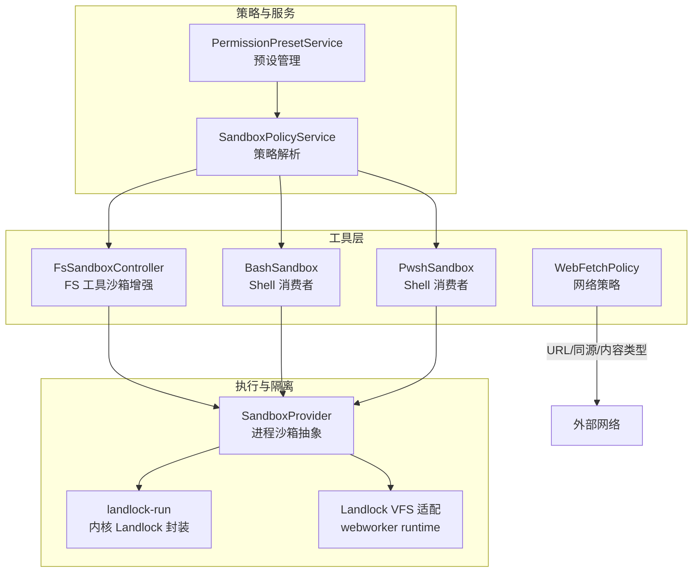
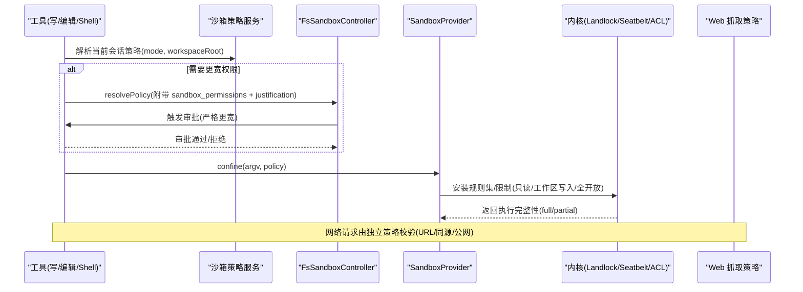
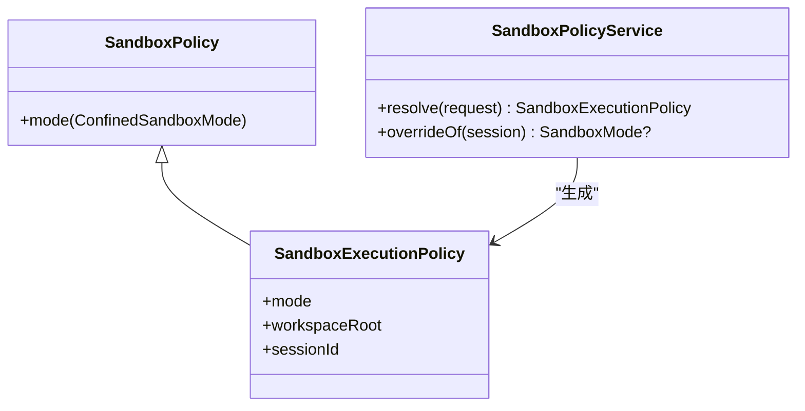
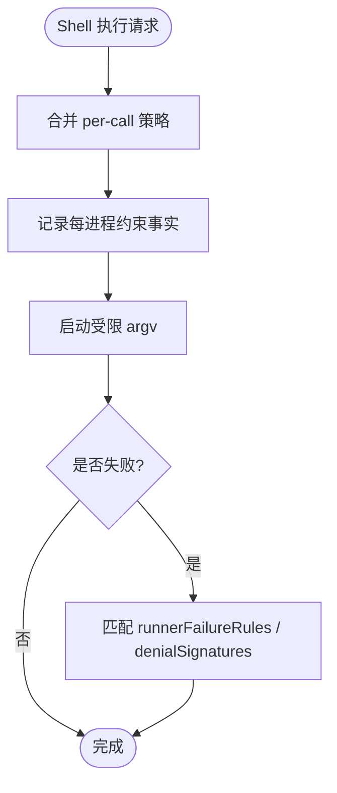
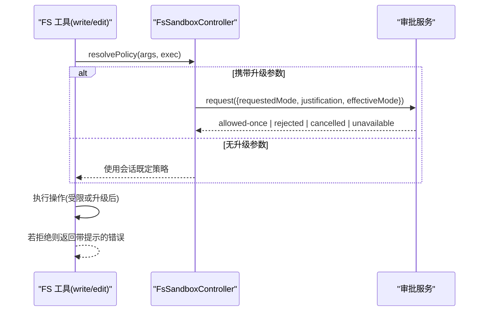
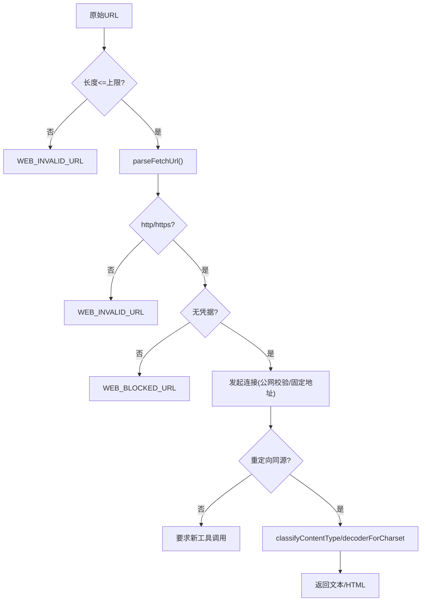
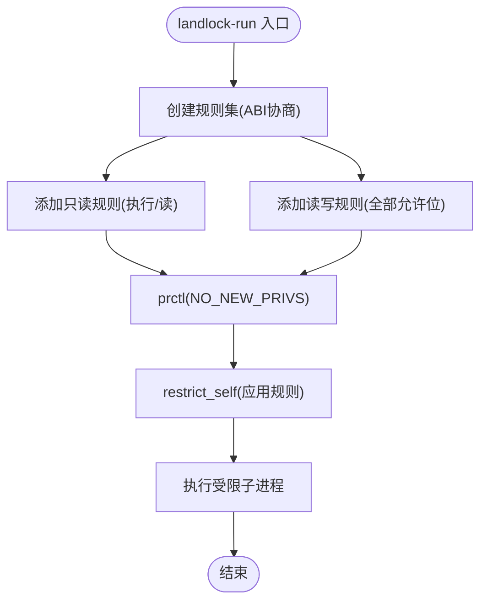
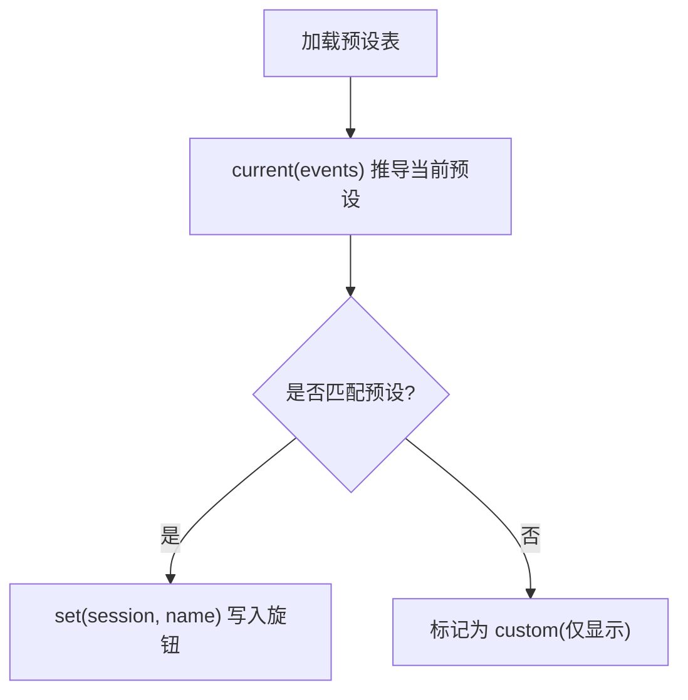
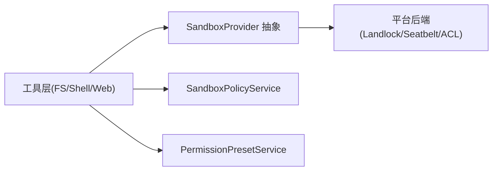

# 权限控制与安全沙箱

<cite>
**本文引用的文件**
- [packages/sandbox/sandbox/src/index.ts](file://packages/sandbox/sandbox/src/index.ts)
- [packages/sandbox/sandbox-policy/src/index.ts](file://packages/sandbox/sandbox-policy/src/index.ts)
- [packages/shell/bash-sandbox/src/index.ts](file://packages/shell/bash-sandbox/src/index.ts)
- [packages/shell/pwsh-sandbox/src/index.ts](file://packages/shell/pwsh-sandbox/src/index.ts)
- [packages/fs/tool-fs/src/sandbox.ts](file://packages/fs/tool-fs/src/sandbox.ts)
- [packages/web/web-fetch-http/src/policy.ts](file://packages/web/web-fetch-http/src/policy.ts)
- [native/landlock-run/packages/entry/src/main.c](file://native/landlock-run/packages/entry/src/main.c)
- [packages/experimental/webworker-runtime/src/shell/process/landlock.ts](file://packages/experimental/webworker-runtime/src/shell/process/landlock.ts)
- [docs/subsystems/sandbox.md](file://docs/subsystems/sandbox.md)
- [docs/subsystems/permission-presets.md](file://docs/subsystems/permission-presets.md)
- [docs/subsystems/web.md](file://docs/subsystems/web.md)
- [packages/client/connection/src/api-request-trust.ts](file://packages/client/connection/src/api-request-trust.ts)
- [packages/credentials/credentials-local/src/index.ts](file://packages/credentials/credentials-local/src/index.ts)
</cite>

## 目录
1. [简介](#简介)
2. [项目结构](#项目结构)
3. [核心组件](#核心组件)
4. [架构总览](#架构总览)
5. [详细组件分析](#详细组件分析)
6. [依赖关系分析](#依赖关系分析)
7. [性能考虑](#性能考虑)
8. [故障排查指南](#故障排查指南)
9. [结论](#结论)
10. [附录](#附录)

## 简介
本文件系统性阐述 DeepSeek Harness 的工具权限控制与安全沙箱机制，覆盖文件系统访问、网络请求、进程执行等操作的权限检查与隔离策略；说明安全沙箱的实现原理（资源隔离、系统调用拦截、资源限制）；解释权限策略的配置与管理（预定义策略与自定义策略）；并提供细粒度权限控制的实践路径与最佳实践。

## 项目结构
围绕“工具权限控制与安全沙箱”的关键代码分布在以下模块：
- 进程沙箱抽象与策略服务：sandbox、sandbox-policy
- Shell 沙箱消费者：bash-sandbox、pwsh-sandbox
- 文件系统工具沙箱增强：tool-fs/sandbox
- Web 抓取策略：web-fetch-http/policy
- 内核级沙箱实现：native/landlock-run（Linux Landlock）、experimental webworker runtime 的 landlock 适配
- 客户端 API 信任校验：client/connection/api-request-trust
- 凭证安全：credentials-local

图表来源
- [docs/subsystems/sandbox.md:1-219](file://docs/subsystems/sandbox.md#L1-L219)
- [docs/subsystems/permission-presets.md:1-132](file://docs/subsystems/permission-presets.md#L1-L132)
- [packages/sandbox/sandbox/src/index.ts](file://packages/sandbox/sandbox/src/index.ts)
- [packages/sandbox/sandbox-policy/src/index.ts](file://packages/sandbox/sandbox-policy/src/index.ts)
- [packages/shell/bash-sandbox/src/index.ts](file://packages/shell/bash-sandbox/src/index.ts)
- [packages/shell/pwsh-sandbox/src/index.ts](file://packages/shell/pwsh-sandbox/src/index.ts)
- [packages/fs/tool-fs/src/sandbox.ts](file://packages/fs/tool-fs/src/sandbox.ts)
- [packages/web/web-fetch-http/src/policy.ts](file://packages/web/web-fetch-http/src/policy.ts)
- [native/landlock-run/packages/entry/src/main.c](file://native/landlock-run/packages/entry/src/main.c)
- [packages/experimental/webworker-runtime/src/shell/process/landlock.ts](file://packages/experimental/webworker-runtime/src/shell/process/landlock.ts)

章节来源
- [docs/subsystems/sandbox.md:1-219](file://docs/subsystems/sandbox.md#L1-L219)
- [docs/subsystems/permission-presets.md:1-132](file://docs/subsystems/permission-presets.md#L1-L132)

## 核心组件
- 进程沙箱抽象（SandboxProvider）：将受控 argv 包装为在策略下执行的受限命令，返回受限 argv、执行完整性（full/partial）以及诊断规则。
- 沙箱策略服务（SandboxPolicyService）：按会话与部署配置解析每次调用的完整执行策略（模式与工作区根），并支持显式升级重试。
- Shell 沙箱消费者（bash/pwsh）：将策略注入到 shell 执行请求中，维护每进程约束事实，用于结果归因与错误分类。
- 文件系统工具沙箱增强（FsSandboxController）：为 write/edit 工具提供“一次性更宽权限”的升级流程，结合审批服务完成严格更宽的授权。
- Web 抓取策略：对 URL 长度、协议、凭据、同源重定向等进行前置校验，阻断 SSRF 与非公开地址访问。
- 内核级沙箱（Landlock）：通过创建规则集、设置 no_new_privs、restrict_self 等方式限制子进程的读写/执行等系统调用。
- 客户端 API 信任校验：基于 Host、Origin/Fetch-Metadata 等头信息防御 DNS 重绑定与跨站滥用。
- 凭证安全：拒绝可被其他用户读取的凭证文件，确保最小权限。

章节来源
- [packages/sandbox/sandbox/src/index.ts](file://packages/sandbox/sandbox/src/index.ts)
- [packages/sandbox/sandbox-policy/src/index.ts](file://packages/sandbox/sandbox-policy/src/index.ts)
- [packages/shell/bash-sandbox/src/index.ts](file://packages/shell/bash-sandbox/src/index.ts)
- [packages/shell/pwsh-sandbox/src/index.ts](file://packages/shell/pwsh-sandbox/src/index.ts)
- [packages/fs/tool-fs/src/sandbox.ts](file://packages/fs/tool-fs/src/sandbox.ts)
- [packages/web/web-fetch-http/src/policy.ts](file://packages/web/web-fetch-http/src/policy.ts)
- [native/landlock-run/packages/entry/src/main.c](file://native/landlock-run/packages/entry/src/main.c)
- [packages/client/connection/src/api-request-trust.ts](file://packages/client/connection/src/api-request-trust.ts)
- [packages/credentials/credentials-local/src/index.ts](file://packages/credentials/credentials-local/src/index.ts)

## 架构总览
下图展示从工具调用到沙箱执行的端到端流程，包括策略解析、升级审批、内核拦截与网络策略。

图表来源
- [packages/sandbox/sandbox/src/index.ts](file://packages/sandbox/sandbox/src/index.ts)
- [packages/sandbox/sandbox-policy/src/index.ts](file://packages/sandbox/sandbox-policy/src/index.ts)
- [packages/fs/tool-fs/src/sandbox.ts](file://packages/fs/tool-fs/src/sandbox.ts)
- [native/landlock-run/packages/entry/src/main.c](file://native/landlock-run/packages/entry/src/main.c)
- [packages/web/web-fetch-http/src/policy.ts](file://packages/web/web-fetch-http/src/policy.ts)

## 详细组件分析

### 进程沙箱抽象与策略服务
- 模式与执行完整性：read-only、workspace-write、danger-full-access；full/partial 表示后端能完全或仅部分实现承诺的文件效果。
- 每次调用策略：包含 mode、workspaceRoot、sessionId；provider 以 per-call 方式接收策略，避免共享状态污染。
- 策略解析优先级：显式批准 > 会话事件 > 部署默认；工作区根来自会话不可变 cwd 或配置回退。

图表来源
- [docs/subsystems/sandbox.md:41-94](file://docs/subsystems/sandbox.md#L41-L94)
- [packages/sandbox/sandbox-policy/src/index.ts](file://packages/sandbox/sandbox-policy/src/index.ts)

章节来源
- [docs/subsystems/sandbox.md:1-219](file://docs/subsystems/sandbox.md#L1-L219)
- [packages/sandbox/sandbox-policy/src/index.ts](file://packages/sandbox/sandbox-policy/src/index.ts)

### Shell 沙箱消费者（bash/pwsh）
- 将策略注入执行请求，保留每进程约束事实（模式、执行完整性、拒绝签名、失败规则、工作目录）。
- 默认能力事实使用部署默认模式；实际执行携带 per-call 策略。

图表来源
- [packages/shell/bash-sandbox/src/index.ts](file://packages/shell/bash-sandbox/src/index.ts)
- [packages/shell/pwsh-sandbox/src/index.ts](file://packages/shell/pwsh-sandbox/src/index.ts)

章节来源
- [packages/shell/bash-sandbox/src/index.ts](file://packages/shell/bash-sandbox/src/index.ts)
- [packages/shell/pwsh-sandbox/src/index.ts](file://packages/shell/pwsh-sandbox/src/index.ts)

### 文件系统工具的细粒度权限控制（write/edit）
- 升级参数：sandbox_permissions（更宽模式）+ justification（理由），仅在存在限制型后端时暴露。
- 审批流程：必须严格更宽且经审批服务一次批准；未提供则沿用会话既定策略。
- 错误映射：将 FS_SANDBOX_DENIED 转换为带提示的可读错误，便于模型重试。

图表来源
- [packages/fs/tool-fs/src/sandbox.ts](file://packages/fs/tool-fs/src/sandbox.ts)

章节来源
- [packages/fs/tool-fs/src/sandbox.ts](file://packages/fs/tool-fs/src/sandbox.ts)

### Web 抓取的网络策略
- URL 校验：最大长度、仅 http/https、禁止内嵌凭据。
- 同源重定向：跨源重定向需新的工具调用与公网地址校验，防止 SSRF。
- 内容类型：仅解码文本类响应，未知编码报错而非静默乱码。

图表来源
- [packages/web/web-fetch-http/src/policy.ts](file://packages/web/web-fetch-http/src/policy.ts)
- [docs/subsystems/web.md:121-131](file://docs/subsystems/web.md#L121-L131)

章节来源
- [packages/web/web-fetch-http/src/policy.ts](file://packages/web/web-fetch-http/src/policy.ts)
- [docs/subsystems/web.md:121-131](file://docs/subsystems/web.md#L121-L131)

### 内核级沙箱（Landlock）与资源限制
- 规则集创建：根据 ABI 协商支持的访问位集合，分别授予只读与读写根。
- 提升防护：先设置 no_new_privs，再 restrict_self，阻止提权与逃逸。
- 失败语义：无法启用 Landlock 时关闭执行，绝不静默放行。

图表来源
- [native/landlock-run/packages/entry/src/main.c](file://native/landlock-run/packages/entry/src/main.c)

章节来源
- [native/landlock-run/packages/entry/src/main.c](file://native/landlock-run/packages/entry/src/main.c)

### 权限策略配置与管理（预定义与自定义）
- 预设表：将沙箱模式与审批策略打包为命名预设，默认包含“工作区写入+询问”和“危险全开+从不询问”。
- 当前预设推导：基于会话有效模式与审批策略，优先保留用户上次选择，否则取声明顺序首个匹配项，否则为“custom”。
- 切换行为：记录日志事件，仅当旋钮值变化时才写入底层 setter。

图表来源
- [docs/subsystems/permission-presets.md:1-132](file://docs/subsystems/permission-presets.md#L1-L132)

章节来源
- [docs/subsystems/permission-presets.md:1-132](file://docs/subsystems/permission-presets.md#L1-L132)

### 客户端 API 信任与凭证安全
- API 信任：校验 Host、同源标记，防御 DNS 重绑定与跨站请求。
- 凭证保护：拒绝组/其他可读的凭证文件，强制最小权限。

章节来源
- [packages/client/connection/src/api-request-trust.ts](file://packages/client/connection/src/api-request-trust.ts)
- [packages/credentials/credentials-local/src/index.ts](file://packages/credentials/credentials-local/src/index.ts)

## 依赖关系分析
- 松耦合：工具层不直接依赖具体平台后端，通过 SandboxProvider 抽象解耦。
- 策略集中：SandboxPolicyService 统一解析策略，避免各消费者重复逻辑。
- 诊断解耦：Shell 消费者通过 denialSignatures 与 runnerFailureRules 区分“被沙箱拒绝”和“沙箱运行器失败”。
- 网络与文件隔离：Web 策略与文件沙箱各自独立，互不干扰。

图表来源
- [packages/sandbox/sandbox/src/index.ts](file://packages/sandbox/sandbox/src/index.ts)
- [packages/sandbox/sandbox-policy/src/index.ts](file://packages/sandbox/sandbox-policy/src/index.ts)
- [docs/subsystems/sandbox.md:1-219](file://docs/subsystems/sandbox.md#L1-L219)

## 性能考虑
- 策略解析与审批：尽量缓存会话策略，减少重复解析；审批仅在升级路径触发。
- 沙箱启动：规则集创建与 restrict_self 有固定开销，应避免频繁重启受限进程；复用会话上下文。
- 网络策略：URL 解析与同源判断为轻量计算，但连接建立与重定向链较长时需关注超时与带宽限制。
- 诊断匹配：stderr 过滤与签名匹配应在最小范围内进行，避免全量扫描。

## 故障排查指南
- 沙箱不可用：当无可用后端时抛出 SANDBOX_UNAVAILABLE；检查平台能力（如 Landlock 是否启用）。
- 部分执行：partial 表示仅部分文件效果被限制；如需绝对边界应拒绝或上报。
- 审批失败：missing approval service、no agent to route、channel unavailable 等明确错误；确认审批通道与 Agent 上下文。
- 网络拒绝：URL 非法、非 http/https、含凭据、跨源重定向未重新调用；检查 URL 与策略。
- 凭证错误：文件权限过宽导致拒绝；修正为 0600。

章节来源
- [docs/subsystems/sandbox.md:152-157](file://docs/subsystems/sandbox.md#L152-L157)
- [packages/fs/tool-fs/src/sandbox.ts](file://packages/fs/tool-fs/src/sandbox.ts)
- [packages/web/web-fetch-http/src/policy.ts](file://packages/web/web-fetch-http/src/policy.ts)
- [packages/credentials/credentials-local/src/index.ts](file://packages/credentials/credentials-local/src/index.ts)

## 结论
DeepSeek Harness 通过“策略服务 + 抽象提供者 + 平台后端”的分层设计，实现了工具执行的细粒度权限控制与强隔离的安全沙箱。文件系统、网络与进程执行各自具备明确的策略与校验点；升级路径结合审批服务保证最小权限原则。建议在部署中优先使用 read-only/workspace-write，谨慎开启 danger-full-access，并结合预设与审计事件进行治理。

## 附录
- 关键概念速查
  - 沙箱模式：read-only、workspace-write、danger-full-access
  - 执行完整性：full、partial
  - 升级参数：sandbox_permissions、justification
  - 网络策略：URL 长度/协议/凭据/同源重定向
  - 内核限制：Landlock 规则集、no_new_privs、restrict_self