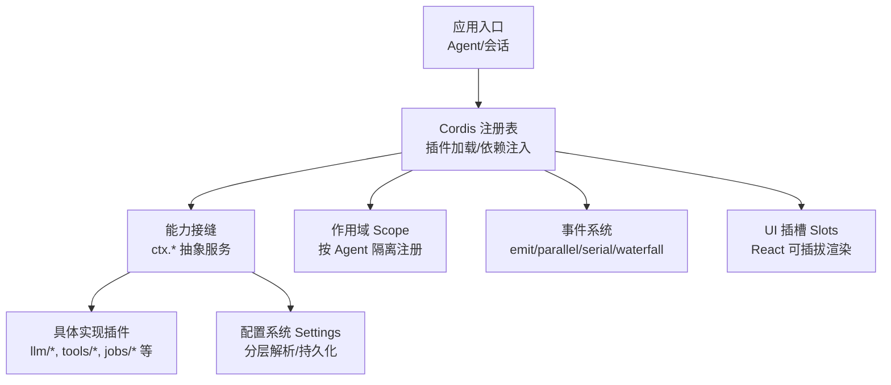
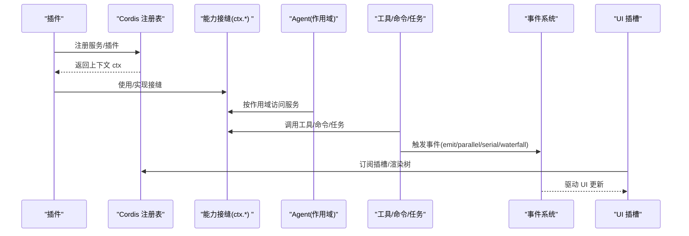
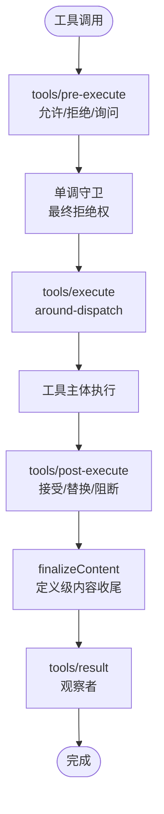
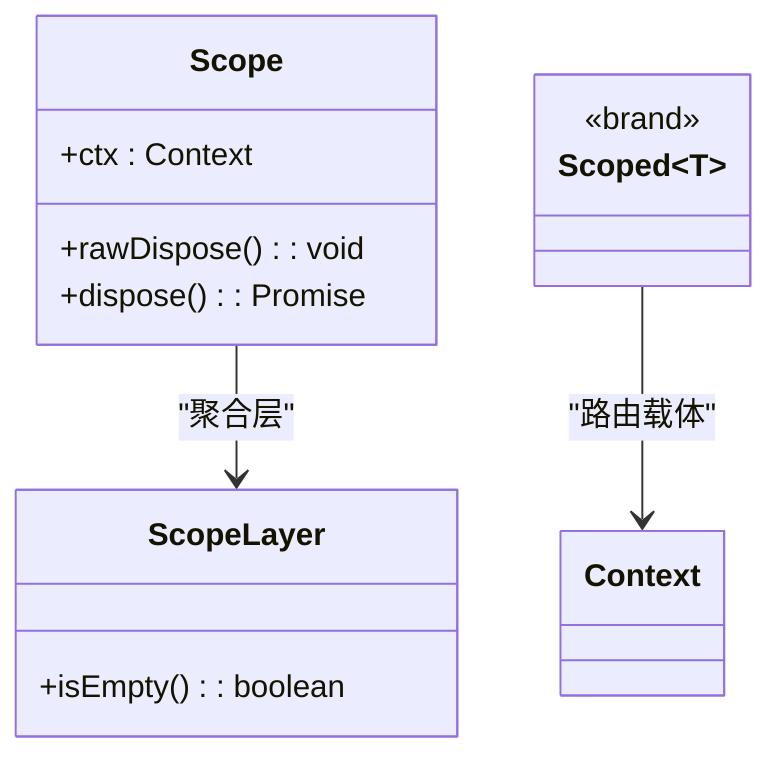
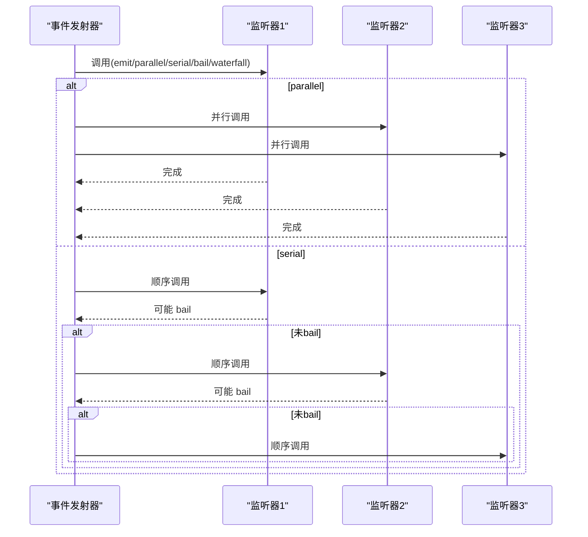
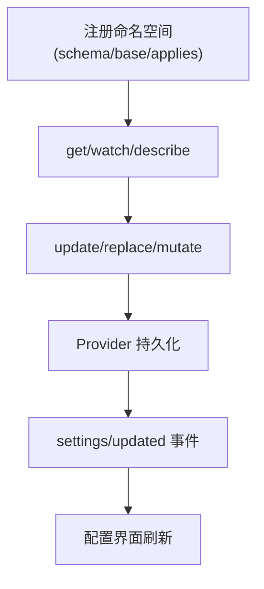
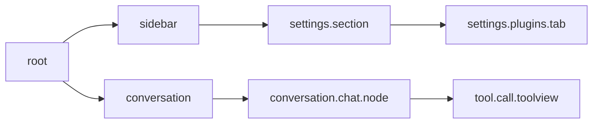
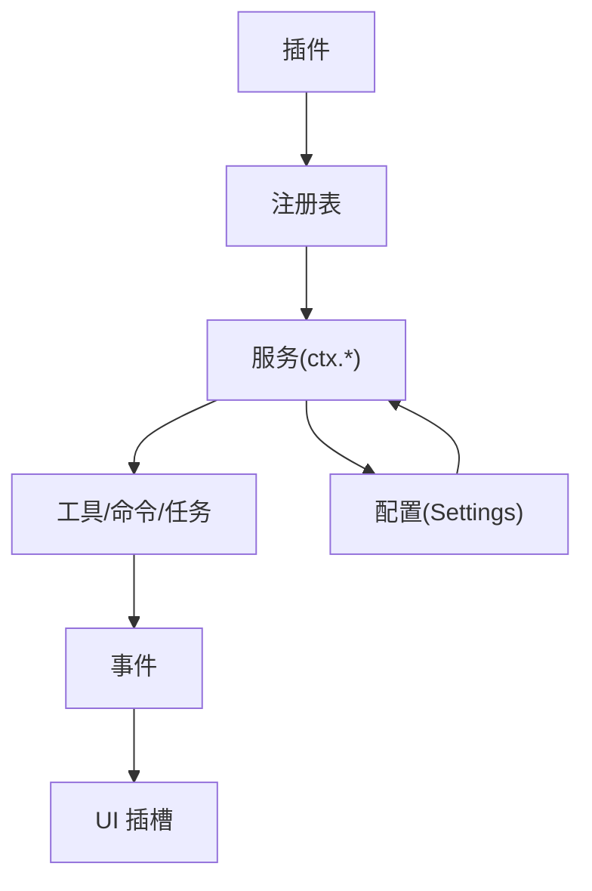

# 扩展点设计

<cite>
**本文引用的文件**
- [能力接缝与核心服务](file://docs/capability-seams.md)
- [扩展子系统](file://docs/subsystems/extensions.md)
- [作用域注册](file://docs/subsystems/scope.md)
- [事件系统（Cordis）](file://docs/cordis-api/events.md)
- [工具子系统](file://docs/subsystems/tools.md)
- [人类命令子系统](file://docs/subsystems/commands.md)
- [后台任务子系统](file://docs/subsystems/jobs.md)
- [用户设置子系统](file://docs/subsystems/settings.md)
- [Web 客户端插槽](file://docs/subsystems/slots.md)
- [插件注册表](file://docs/cordis-api/registry.md)
- [服务基类](file://docs/cordis-api/service.md)
</cite>

## 目录
1. [简介](#简介)
2. [项目结构](#项目结构)
3. [核心组件](#核心组件)
4. [架构总览](#架构总览)
5. [详细组件分析](#详细组件分析)
6. [依赖关系分析](#依赖关系分析)
7. [性能考量](#性能考量)
8. [故障排查指南](#故障排查指南)
9. [结论](#结论)
10. [附录](#附录)

## 简介
本文件面向希望为 DeepSeek Harness 添加新能力的开发者，系统性说明扩展点设计与最佳实践。内容覆盖：
- 如何添加新的模型提供商、工具、命令、后台任务等
- 能力接缝（capability seams）的实现方式与选择原则
- 作用域（scope）机制在单个智能体级别的注册与隔离
- 事件监听器的注册与调用机制（串行、并行、瀑布流）
- 配置扩展点（Profile 覆盖、补丁文件、运行时配置修改）
- UI 扩展点（对话节点注册与渲染器集成）
- 常见扩展需求的代码示例与配置模板路径
- 扩展点选择指南，帮助根据需求选择合适的扩展机制

## 项目结构
DeepSeek Harness 采用“能力接缝 + 插件化”的架构：核心包定义抽象服务（seam），具体实现以插件形式加载；通过 Cordis 注册表进行依赖注入与服务发现；通过作用域将注册与生命周期绑定到 Agent；通过事件系统进行跨模块通信；通过 Slots 提供 Web UI 的可插拔渲染。

图表来源
- [能力接缝与核心服务:1-537](file://docs/capability-seams.md#L1-L537)
- [插件注册表:1-153](file://docs/cordis-api/registry.md#L1-L153)
- [Web 客户端插槽:1-175](file://docs/subsystems/slots.md#L1-L175)

章节来源
- [能力接缝与核心服务:1-537](file://docs/capability-seams.md#L1-L537)
- [插件注册表:1-153](file://docs/cordis-api/registry.md#L1-L153)

## 核心组件
- 能力接缝（Seams）：以 ctx.* 暴露的抽象服务，如 LLM、工具、设置、存储、查询等，由多个插件实现同一接口，便于替换与组合。
- 插件与注册表：通过 Cordis 的 ctx.plugin/inject 加载插件，声明依赖并获取服务实例。
- 作用域（Scope）：以 Agent 为键的隔离层，使同一注册在不同 Agent 下可见且独立。
- 事件系统：提供 emit、parallel、serial、bail、waterfall 多种分发模式，支持范围过滤。
- 工具管道：统一的工具注册、执行、策略拦截、结果呈现与审计。
- 后台任务：统一的任务注册、生命周期、输出读取与控制。
- 设置系统：命名空间化的配置，支持 schema、base 层、用户层、持久化与变更事件。
- UI 插槽：基于 React 的插槽体系，允许功能插件贡献对话节点、侧边栏、设置项等。

章节来源
- [能力接缝与核心服务:464-537](file://docs/capability-seams.md#L464-L537)
- [插件注册表:8-153](file://docs/cordis-api/registry.md#L8-L153)
- [作用域注册:1-60](file://docs/subsystems/scope.md#L1-L60)
- [事件系统:1-208](file://docs/cordis-api/events.md#L1-L208)
- [工具子系统:1-721](file://docs/subsystems/tools.md#L1-L721)
- [后台任务子系统:1-291](file://docs/subsystems/jobs.md#L1-L291)
- [用户设置子系统:1-388](file://docs/subsystems/settings.md#L1-L388)
- [Web 客户端插槽:1-175](file://docs/subsystems/slots.md#L1-L175)

## 架构总览
下图展示了扩展点在运行时的交互关系：插件通过注册表提供服务，Agent 作用域决定可见性；工具、命令、任务等通过能力接缝访问底层实现；事件贯穿各子系统；UI 插槽负责渲染。

图表来源
- [插件注册表:8-153](file://docs/cordis-api/registry.md#L8-L153)
- [能力接缝与核心服务:464-537](file://docs/capability-seams.md#L464-L537)
- [事件系统:1-208](file://docs/cordis-api/events.md#L1-L208)
- [Web 客户端插槽:1-175](file://docs/subsystems/slots.md#L1-L175)

## 详细组件分析

### 能力接缝（Capability Seams）
- 概念：每个 ctx.* 是一个能力接缝，定义一组抽象能力；多个插件可实现同一接缝，由宿主在组合时选择具体实现。
- 典型接缝：LLM 适配器、工具注册与执行、设置、存储、查询、权限、沙箱、工作流、Webhook、动态插件运行器等。
- 选择原则：
  - 需要替换底层实现（如 LLM、存储、文件系统）→ 使用对应 seam
  - 需要扩展模型请求字段或扩展行为 → 使用 deepseek-llm-api-extensions 等专用接缝
  - 需要新增通用能力（如工具、命令、任务）→ 通过对应子系统注册，而非直接耦合到业务代码

章节来源
- [能力接缝与核心服务:464-537](file://docs/capability-seams.md#L464-L537)

### 添加新的模型提供商（LLM 适配器）
- 步骤概览：
  1. 实现 LLM 适配器，遵循 ctx.llm 接缝约定
  2. 在插件中注册该适配器
  3. 通过设置系统暴露 provider profile，供用户选择
  4. 如需扩展 DeepSeek 请求字段，使用 ctx.deepseekLlmApiExtensions 接缝
- 关键要点：
  - 适配器需支持流式响应与取消信号
  - 通过 settings 暴露 provider 配置，支持 base 层与用户层覆盖
  - 若涉及凭证，使用 credentials seam 管理密钥

章节来源
- [能力接缝与核心服务:464-537](file://docs/capability-seams.md#L464-L537)
- [用户设置子系统:1-388](file://docs/subsystems/settings.md#L1-L388)

### 添加新工具
- 步骤概览：
  1. 使用 defineTool 或 ToolDefinition 注册工具，声明参数 schema、输出 schema、execute、可选 finalizeContent/presentCall/presentResult
  2. 通过 ctx.tools.guard 添加单调策略守卫（不可被后续 listener 撤销）
  3. 通过 ctx.tools.execute 进入管道：pre-execute → guards → execute → post-execute → finalizeContent → result
  4. 使用 presentCall/presentResult 提供 UI 呈现意图（终端、diff、read、search、web 等）
- 并发与调度：
  - isConcurrencySafe 可让工具加入并行组；否则走独占模式
  - timeoutMs 用于协作式超时（配合工具调用超时策略）
- 审计与观察：
  - tools/result 事件接收冻结的最终结果
  - tools/ptc-dispatch-log 可改写 run_code 子调度的日志副本

图表来源
- [工具子系统:170-405](file://docs/subsystems/tools.md#L170-L405)
- [工具子系统:470-721](file://docs/subsystems/tools.md#L470-L721)

章节来源
- [工具子系统:1-721](file://docs/subsystems/tools.md#L1-L721)

### 添加人类命令
- 步骤概览：
  1. 注册 CommandDefinition（name、description、input、handler）
  2. 通过 ctx.commands.execute 直接对目标 Agent 执行命令，不经过模型消息
  3. 支持图片附件与记录 rawInput
- 适用场景：
  - 快速调试、运维操作、非模型驱动的交互流程

章节来源
- [人类命令子系统:1-211](file://docs/subsystems/commands.md#L1-L211)

### 添加后台任务
- 步骤概览：
  1. 实现 JobStart.run()，返回 JobHooks（cancel、done、readOutput）
  2. 通过 ctx.jobs.start 注册任务，获得 JobId
  3. 通过 list/get/read/kill/wait 控制任务
  4. 通过 onJobDone/onJobsChanged 监听完成与集合变化
- 关键点：
  - 任务拥有者（owner）与授权基于 SessionId
  - 输出可以是流式（readOutput）或一次性（output）
  - 终止语义：killed（主动停止）、completed（正常结束）、failed（异常）

章节来源
- [后台任务子系统:1-291](file://docs/subsystems/jobs.md#L1-L291)

### 作用域（Scope）机制
- 概念：
  - ScopeKey 是透明标识，通常使用 Agent 对象作为键
  - Scoped<T> 是编译期品牌，限定事件分发的 this 类型
  - ScopeLayer/ScopedLayers 维护全局层与精确作用域层的合并视图
- 用途：
  - 工具注册可在 Agent 作用域内遮蔽全局注册
  - 事件监听可按 Agent 过滤
  - 设置、命令、工具等均可按作用域生效
- 生命周期：
  - Scope.rawDispose 保留精确 disposer 以便有序复合效果
  - Scope.dispose 提供共享静默边界

图表来源
- [作用域注册:1-60](file://docs/subsystems/scope.md#L1-L60)

章节来源
- [作用域注册:1-60](file://docs/subsystems/scope.md#L1-L60)

### 事件监听器注册与调用
- 注册：
  - ctx.on(name, listener, options?)：注册监听器，返回 disposer
  - ctx.once(name, listener, options?)：仅触发一次
  - options.prepend 控制插入顺序；options.global 可绕过作用域过滤
- 调用模式：
  - emit：同步分发，忽略返回值
  - parallel：并发等待所有监听器
  - serial：顺序等待直到某个监听器 bail
  - bail：同步 bail 短路
  - waterfall：链式 next 回调，支持拦截与改写
- 作用域：
  - 多数事件支持按 Agent 过滤；某些注册通知（如 tools/change）为未过滤的全局通知

图表来源
- [事件系统:1-208](file://docs/cordis-api/events.md#L1-L208)

章节来源
- [事件系统:1-208](file://docs/cordis-api/events.md#L1-L208)

### 配置扩展点（Settings）
- 命名空间：
  - 每个插件注册一个 SettingsNamespace，绑定 schema、base 层、applies（live/restart）
- 读写：
  - get/watch/update/replace/mutate 提供读、观察、合并、替换、路径编辑
  - describe 生成配置 UI 所需的描述（含 redactSecrets）
- 事件：
  - settings/document-updated：原始用户段变更（即使解析值不变）
  - settings/updated：解析值提交后的变更（深相等不触发）
- 远程控制器：
  - ctx.settingsController 提供 Remote API，处理红acted 视图与冲突分类

图表来源
- [用户设置子系统:1-388](file://docs/subsystems/settings.md#L1-L388)

章节来源
- [用户设置子系统:1-388](file://docs/subsystems/settings.md#L1-L388)

### UI 扩展点（Slots）
- 插槽体系：
  - SlotMap 声明键、基数（single/list/keyed/chain）、作用域（root/session-maybe/session）、所有者属性、注入面
  - 通过 ctx.slots.register 贡献组件；通过 ctx.slots.inject 注入到已声明插槽
- 标准钩子：
  - useSessions/useSession/useConversation/useTrajectory 等框架提供的 hook
- 当前层级：
  - root/sidebar/conversation/details/shell.overlay 等区域，支持细粒度扩展（如 conversation.chat.node、tool.call.toolview）
- 规则：
  - 仅通过 import type 引用其他插件的类型
  - 业务状态留在服务或模型，插槽只持有视图状态
  - 保持 observable 源稳定，避免频繁重建

图表来源
- [Web 客户端插槽:106-165](file://docs/subsystems/slots.md#L106-L165)

章节来源
- [Web 客户端插槽:1-175](file://docs/subsystems/slots.md#L1-L175)

### 动态插件与扩展子系统
- 动态插件：
  - ctx.dynamicCordisRunner 提供 define/run/stop/invoke 等能力，支持 Host/Client 双端
  - 支持审批流程、版本切换、源码检索、清单同步
- 检查器：
  - ctx.cordisInspect 提供跨页面路由与清单镜像，支持 Client 查询与 Host 查询
- 事件：
  - cordis/dynamic-package、cordis/dynamic-retract、cordis/request-run 等事件驱动生命周期

章节来源
- [扩展子系统:1-383](file://docs/subsystems/extensions.md#L1-L383)

## 依赖关系分析
- 插件与注册表：
  - 插件通过 ctx.plugin 加载，声明 inject 依赖；服务通过 Service 基类注册到 ctx.*
- 能力接缝与实现：
  - 多个实现可并存于不同作用域；Agent 作用域决定可见性与优先级
- 工具/命令/任务：
  - 均通过各自子系统注册，受策略与事件约束；工具管道提供强一致的结果与审计
- UI 与数据：
  - Slots 仅消费框架提供的 hook 与 store；业务数据来自 Cordis 服务或模型

图表来源
- [插件注册表:8-153](file://docs/cordis-api/registry.md#L8-L153)
- [服务基类:1-103](file://docs/cordis-api/service.md#L1-L103)
- [能力接缝与核心服务:464-537](file://docs/capability-seams.md#L464-L537)

章节来源
- [插件注册表:8-153](file://docs/cordis-api/registry.md#L8-L153)
- [服务基类:1-103](file://docs/cordis-api/service.md#L1-L103)
- [能力接缝与核心服务:464-537](file://docs/capability-seams.md#L464-L537)

## 性能考量
- 工具并发：
  - 合理声明 isConcurrencySafe，减少独占阻塞；注意共享状态并发安全
- 事件分发：
  - 高频场景优先使用 emit；需要收敛时使用 serial/bail；需要并行计算使用 parallel
- 设置写入：
  - update/replace/mutate 会序列化写入；避免频繁小写；使用 mutate 进行路径级增量
- 任务输出：
  - 流式任务使用 readOutput 分批消费；设置 outputLimitBytes 控制模型可见输出大小
- UI 渲染：
  - 保持 observable 源稳定；避免在插槽中创建昂贵计算；使用 store 缓存视图状态

[本节为通用指导，无需特定文件引用]

## 故障排查指南
- 工具失败：
  - 检查 pre-execute 是否 deny/ask；确认 guard 是否拒绝；查看 tools/result 事件中的错误信息
- 事件未触发：
  - 确认监听器是否正确注册与作用域过滤；必要时使用 global 选项
- 设置冲突：
  - 使用 expectedRevision 防止并发覆盖；检查 settings/updated 与 settings/document-updated 事件
- 任务卡住：
  - 检查 cancel 是否被调用；确认 done 是否 resolve；查看 onJobDone 的状态
- UI 不更新：
  - 检查插槽声明与注册是否匹配；确认 store 与 hooks 是否稳定；查看插槽层级与 scope

章节来源
- [工具子系统:170-721](file://docs/subsystems/tools.md#L170-L721)
- [事件系统:1-208](file://docs/cordis-api/events.md#L1-L208)
- [用户设置子系统:1-388](file://docs/subsystems/settings.md#L1-L388)
- [后台任务子系统:1-291](file://docs/subsystems/jobs.md#L1-L291)
- [Web 客户端插槽:1-175](file://docs/subsystems/slots.md#L1-L175)

## 结论
DeepSeek Harness 通过能力接缝、插件化、作用域、事件系统与 UI 插槽，提供了强大而灵活的扩展机制。开发者应根据需求选择合适的扩展点：
- 替换底层能力 → 使用对应 seam
- 新增模型能力 → 实现 LLM 适配器并通过 settings 暴露
- 扩展工具/命令/任务 → 使用对应子系统注册
- 扩展 UI → 使用 Slots 贡献节点与渲染器
- 跨模块通信 → 使用事件系统（emit/parallel/serial/waterfall）
- 配置管理 → 使用 Settings 命名空间与控制器

遵循上述最佳实践，可构建高内聚、低耦合、易替换的扩展生态。

[本节为总结，无需特定文件引用]

## 附录

### 扩展点选择指南
- 需要替换 LLM 提供商 → 实现 ctx.llm 接缝，并通过 settings 暴露 provider profile
- 需要扩展 DeepSeek 请求字段 → 使用 ctx.deepseekLlmApiExtensions 接缝
- 需要新增工具 → 使用 defineTool/ToolDefinition，并通过 ctx.tools 注册
- 需要人类命令 → 使用 ctx.commands 注册 CommandDefinition
- 需要后台任务 → 实现 JobStart.run，通过 ctx.jobs 注册
- 需要配置扩展 → 注册 SettingsNamespace，使用 update/replace/mutate
- 需要 UI 扩展 → 使用 ctx.slots.register 贡献插槽组件
- 需要跨模块通信 → 使用事件系统（emit/parallel/serial/waterfall）

[本节为指南，无需特定文件引用]

### 代码示例与配置模板路径
- 添加工具示例与配置模板：
  - [添加工具文档](file://docs/cookbook/adding-a-tool.md)
- 添加 LLM 适配器示例与配置模板：
  - [添加 LLM 适配器文档](file://docs/cookbook/adding-an-llm-adapter.md)
- 添加设置卡片示例与配置模板：
  - [添加设置卡片文档](file://docs/cookbook/adding-a-settings-card.md)
- 扩展食谱（综合示例）：
  - [扩展食谱文档](file://docs/cookbook/extension-cookbook.md)

章节来源
- [添加工具文档:1-200](file://docs/cookbook/adding-a-tool.md#L1-L200)
- [添加 LLM 适配器文档:1-200](file://docs/cookbook/adding-an-llm-adapter.md#L1-L200)
- [添加设置卡片文档:1-200](file://docs/cookbook/adding-a-settings-card.md#L1-L200)
- [扩展食谱文档:1-200](file://docs/cookbook/extension-cookbook.md#L1-L200)