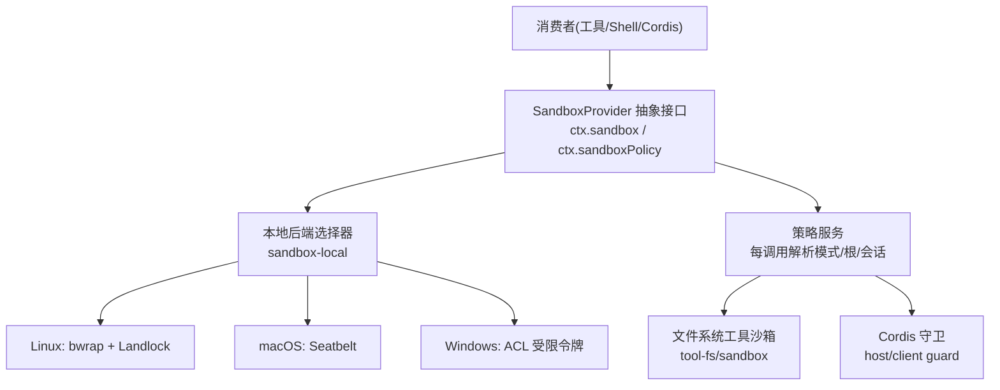
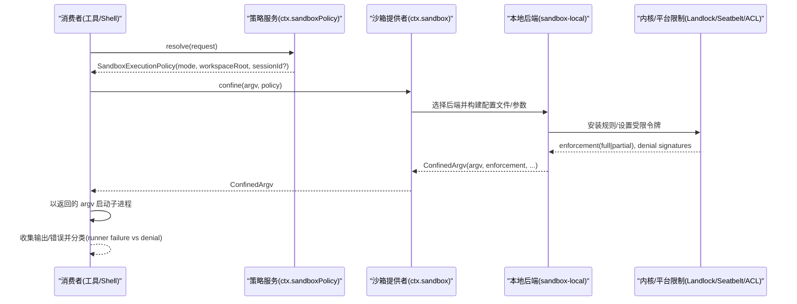
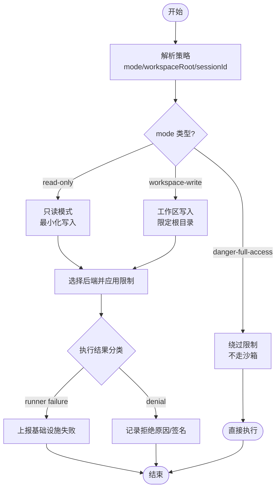
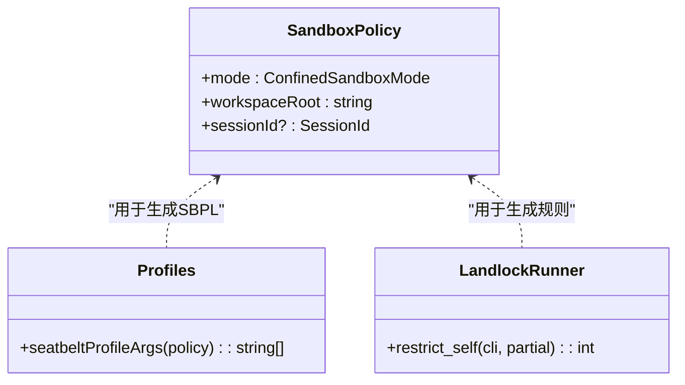
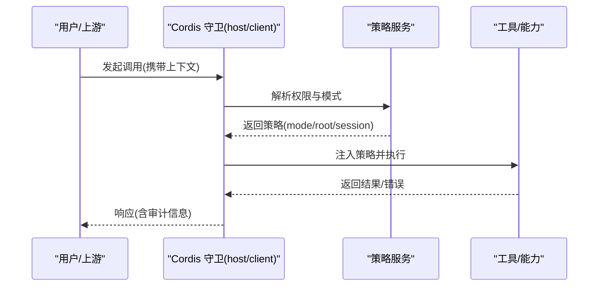
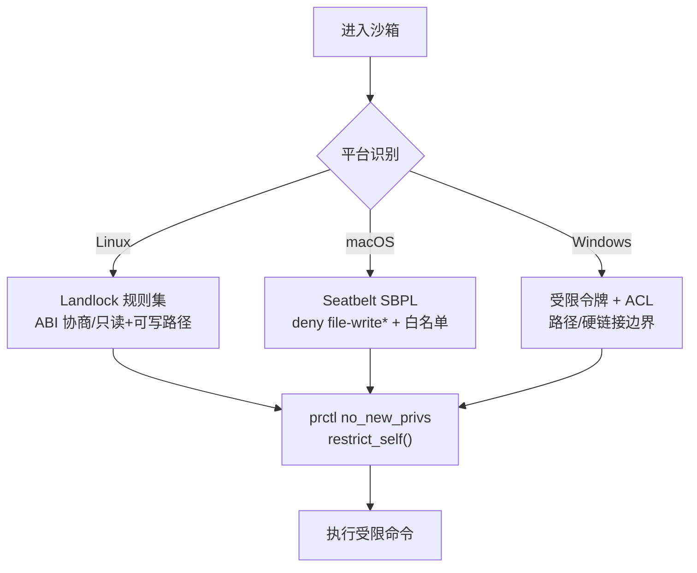
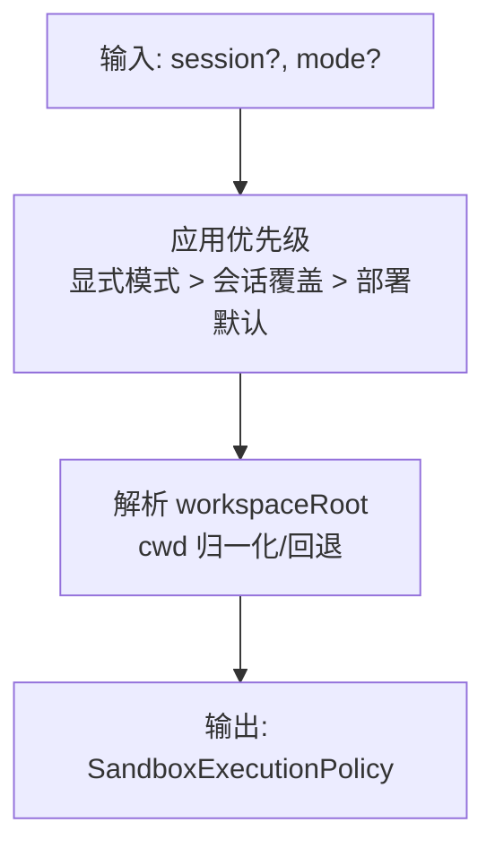
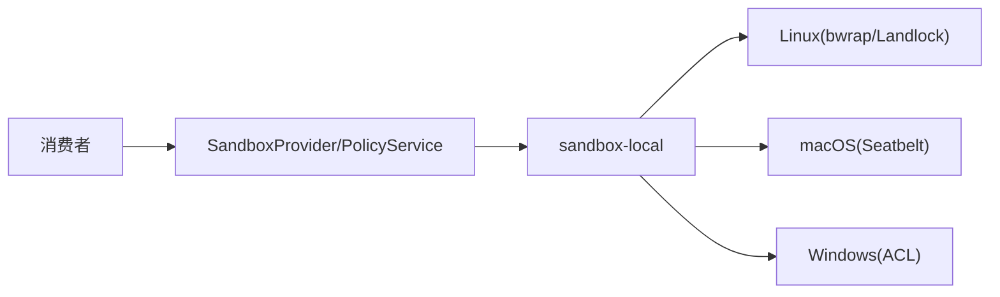

# 安全隔离

<cite>
**本文引用的文件**
- [packages/sandbox/sandbox/src/index.ts](file://packages/sandbox/sandbox/src/index.ts)
- [packages/sandbox/sandbox-local/src/profiles.ts](file://packages/sandbox/sandbox-local/src/profiles.ts)
- [native/landlock-run/packages/entry/src/main.c](file://native/landlock-run/packages/entry/src/main.c)
- [docs/subsystems/sandbox.md](file://docs/subsystems/sandbox.md)
- [packages/fs/tool-fs/src/sandbox.ts](file://packages/fs/tool-fs/src/sandbox.ts)
- [packages/extensions/cordis-host-runner/src/guard.ts](file://packages/extensions/cordis-host-runner/src/guard.ts)
- [packages/extensions/cordis-client-runner/src/client/guard.ts](file://packages/extensions/cordis-client-runner/src/client/guard.ts)
- [docs/subsystems/permission-presets.md](file://docs/subsystems/permission-presets.md)
</cite>

## 目录
1. [简介](#简介)
2. [项目结构](#项目结构)
3. [核心组件](#核心组件)
4. [架构总览](#架构总览)
5. [详细组件分析](#详细组件分析)
6. [依赖关系分析](#依赖关系分析)
7. [性能考量](#性能考量)
8. [故障排查指南](#故障排查指南)
9. [结论](#结论)
10. [附录](#附录)

## 简介
本文件系统性阐述 DeepSeek Harness 的插件安全隔离机制，覆盖进程隔离、内存与文件系统隔离、权限控制模型（细粒度定义、动态检查、继承）、沙箱环境实现（资源限制、网络访问控制、系统调用过滤）、安全策略配置与管理（策略定义、规则匹配、执行引擎），以及安全审计与监控（行为日志、异常检测、威胁防护）。文档同时提供可落地的代码级参考路径，帮助读者在工程中实现安全的插件运行环境。

## 项目结构
围绕“进程沙箱 + 策略服务 + 平台后端”的分层设计：
- 抽象接口层：统一进程沙箱能力边界与策略解析入口
- 本地后端层：Linux bwrap/Landlock、macOS Seatbelt、Windows ACL 受限令牌等具体实现
- 策略服务层：按会话/请求解析每调用的执行策略（模式、工作区根、会话标识）
- 工具与宿主集成：文件系统工具、Shell 工具、Cordis 宿主/客户端守卫等消费方
- 原生内核态辅助：Landlock 规则集安装与 ABI 协商

**图表来源**
- [docs/subsystems/sandbox.md:1-10](file://docs/subsystems/sandbox.md#L1-L10)
- [packages/sandbox/sandbox/src/index.ts](file://packages/sandbox/sandbox/src/index.ts)
- [packages/sandbox/sandbox-local/src/profiles.ts:38-58](file://packages/sandbox/sandbox-local/src/profiles.ts#L38-L58)
- [native/landlock-run/packages/entry/src/main.c:220-267](file://native/landlock-run/packages/entry/src/main.c#L220-L267)

**章节来源**
- [docs/subsystems/sandbox.md:1-10](file://docs/subsystems/sandbox.md#L1-L10)

## 核心组件
- 进程沙箱抽象与策略服务
  - 通过统一的 confine 接口将任意 argv 包装为受控执行；策略服务为每次能力调用解析完整执行策略（模式、工作区根、会话 ID）。
- 本地后端实现
  - Linux：bwrap 绑定只读/可写根，配合 Landlock 内核沙箱进行系统调用与文件系统访问控制；Seatbelt（macOS）与 Windows ACL 受限令牌作为其他平台后端。
- 工具与宿主集成
  - 文件系统工具沙箱对读写路径做白名单与边界约束；Cordis 宿主/客户端守卫负责跨进程/跨信任边界的权限校验与上下文传递。

**章节来源**
- [docs/subsystems/sandbox.md:10-94](file://docs/subsystems/sandbox.md#L10-L94)
- [packages/sandbox/sandbox/src/index.ts](file://packages/sandbox/sandbox/src/index.ts)
- [packages/sandbox/sandbox-local/src/profiles.ts:38-58](file://packages/sandbox/sandbox-local/src/profiles.ts#L38-L58)
- [native/landlock-run/packages/entry/src/main.c:220-267](file://native/landlock-run/packages/entry/src/main.c#L220-L267)
- [packages/fs/tool-fs/src/sandbox.ts](file://packages/fs/tool-fs/src/sandbox.ts)
- [packages/extensions/cordis-host-runner/src/guard.ts](file://packages/extensions/cordis-host-runner/src/guard.ts)
- [packages/extensions/cordis-client-runner/src/client/guard.ts](file://packages/extensions/cordis-client-runner/src/client/guard.ts)

## 架构总览
下图展示一次受控执行的端到端流程：消费者解析策略 → 选择后端 → 生成受限 argv → 启动子进程并应用内核/平台限制 → 返回执行结果与诊断信息。

**图表来源**
- [docs/subsystems/sandbox.md:41-157](file://docs/subsystems/sandbox.md#L41-L157)
- [packages/sandbox/sandbox/src/index.ts](file://packages/sandbox/sandbox/src/index.ts)
- [packages/sandbox/sandbox-local/src/profiles.ts:38-58](file://packages/sandbox/sandbox-local/src/profiles.ts#L38-L58)
- [native/landlock-run/packages/entry/src/main.c:220-267](file://native/landlock-run/packages/entry/src/main.c#L220-L267)

## 详细组件分析

### 进程隔离与策略解析
- 模式与执行完整性
  - read-only：仅允许必要写入目标（如 /dev/null）
  - workspace-write：允许在工作区根与后端临时区域写入
  - danger-full-access：绕过限制（不通过 ctx.sandbox）
  - enforcement：full/partial，指示当前后端能覆盖的策略范围
- 每调用策略
  - 包含 mode、workspaceRoot、sessionId；由策略服务集中解析，避免各消费方重复逻辑
- 失败分类
  - runnerFailureRules：区分“沙箱基础设施失败”和“被沙箱拒绝”两类错误

**图表来源**
- [docs/subsystems/sandbox.md:10-157](file://docs/subsystems/sandbox.md#L10-L157)

**章节来源**
- [docs/subsystems/sandbox.md:10-157](file://docs/subsystems/sandbox.md#L10-L157)

### 文件系统隔离与白名单
- 可写根计算
  - 基于策略中的 workspaceRoot 与后端临时区域，去重并规范化后生成 SBPL/规则列表
- 平台后端
  - macOS Seatbelt：通过 SBPL 字符串构造 allow/deny 规则，显式允许 /dev/null 与子路径写入
  - Linux Landlock：按 ABI 协商能力位，为只读/可写路径分别授予读取/执行或全部文件系统访问
- 工具侧约束
  - tool-fs 沙箱进一步对工作区内的读写路径进行白名单与边界校验，确保与后端一致

**图表来源**
- [packages/sandbox/sandbox-local/src/profiles.ts:38-58](file://packages/sandbox/sandbox-local/src/profiles.ts#L38-L58)
- [native/landlock-run/packages/entry/src/main.c:220-267](file://native/landlock-run/packages/entry/src/main.c#L220-L267)

**章节来源**
- [packages/sandbox/sandbox-local/src/profiles.ts:38-58](file://packages/sandbox/sandbox-local/src/profiles.ts#L38-L58)
- [native/landlock-run/packages/entry/src/main.c:220-267](file://native/landlock-run/packages/entry/src/main.c#L220-L267)
- [packages/fs/tool-fs/src/sandbox.ts](file://packages/fs/tool-fs/src/sandbox.ts)

### 权限控制系统（细粒度、动态检查、继承）
- 细粒度权限定义
  - 通过预设与策略组合，精确声明每个能力/工具的访问范围（如文件系统、网络、进程可见性）
- 动态权限检查
  - 在每次调用前根据会话上下文与策略服务解析的结果进行动态判定，支持重试时提升/降级模式
- 权限继承
  - 子代理/子进程从父上下文继承最小必要权限，必要时经审批升级；未获授权的调用直接拒绝

**图表来源**
- [packages/extensions/cordis-host-runner/src/guard.ts](file://packages/extensions/cordis-host-runner/src/guard.ts)
- [packages/extensions/cordis-client-runner/src/client/guard.ts](file://packages/extensions/cordis-client-runner/src/client/guard.ts)
- [docs/subsystems/permission-presets.md](file://docs/subsystems/permission-presets.md)

**章节来源**
- [packages/extensions/cordis-host-runner/src/guard.ts](file://packages/extensions/cordis-host-runner/src/guard.ts)
- [packages/extensions/cordis-client-runner/src/client/guard.ts](file://packages/extensions/cordis-client-runner/src/client/guard.ts)
- [docs/subsystems/permission-presets.md](file://docs/subsystems/permission-presets.md)

### 沙箱环境实现（资源限制、网络访问控制、系统调用过滤）
- 资源限制
  - 通过容器/微虚拟机/进程限制等手段限制 CPU、内存、文件句柄等（与 ctx.sandbox 并列的能力缝）
- 网络访问控制
  - 默认拒绝出站连接，按需放行受信任域名/IP；结合策略与服务网关进行二次校验
- 系统调用过滤
  - Linux Landlock：按 ABI 协商能力位，仅授予必要的文件系统访问；禁止提权（no_new_privs）
  - macOS Seatbelt：通过 SBPL 限制文件与进程行为
  - Windows ACL：使用受限令牌与路径 ACL 限制

**图表来源**
- [native/landlock-run/packages/entry/src/main.c:220-267](file://native/landlock-run/packages/entry/src/main.c#L220-L267)
- [packages/sandbox/sandbox-local/src/profiles.ts:38-58](file://packages/sandbox/sandbox-local/src/profiles.ts#L38-L58)

**章节来源**
- [native/landlock-run/packages/entry/src/main.c:220-267](file://native/landlock-run/packages/entry/src/main.c#L220-L267)
- [packages/sandbox/sandbox-local/src/profiles.ts:38-58](file://packages/sandbox/sandbox-local/src/profiles.ts#L38-L58)

### 安全策略的配置与管理（定义、匹配、执行）
- 策略定义
  - 部署默认模式、会话覆盖、每调用显式模式优先级；工作区根回退到配置根
- 规则匹配
  - 根据会话 cwd、已批准的重试模式、部署默认值确定最终模式与根
- 执行引擎
  - 策略服务集中解析，消费者一次性获取策略后再决定执行路径；后端仅接收完全指定的策略

**图表来源**
- [docs/subsystems/sandbox.md:41-94](file://docs/subsystems/sandbox.md#L41-L94)

**章节来源**
- [docs/subsystems/sandbox.md:41-94](file://docs/subsystems/sandbox.md#L41-L94)

### 代码示例参考路径（权限声明、资源限制、安全检查）
- 权限声明与策略解析
  - 策略服务与模式定义：[docs/subsystems/sandbox.md:10-94](file://docs/subsystems/sandbox.md#L10-L94)
  - 权限预设与上下文：[docs/subsystems/permission-presets.md](file://docs/subsystems/permission-presets.md)
- 资源限制与系统调用过滤
  - Landlock 规则安装与 ABI 协商：[native/landlock-run/packages/entry/src/main.c:220-267](file://native/landlock-run/packages/entry/src/main.c#L220-L267)
  - Seatbelt 配置文件生成：[packages/sandbox/sandbox-local/src/profiles.ts:38-58](file://packages/sandbox/sandbox-local/src/profiles.ts#L38-L58)
- 安全检查与守卫
  - 文件系统工具沙箱：[packages/fs/tool-fs/src/sandbox.ts](file://packages/fs/tool-fs/src/sandbox.ts)
  - Cordis 宿主/客户端守卫：[packages/extensions/cordis-host-runner/src/guard.ts](file://packages/extensions/cordis-host-runner/src/guard.ts)、[packages/extensions/cordis-client-runner/src/client/guard.ts](file://packages/extensions/cordis-client-runner/src/client/guard.ts)

**章节来源**
- [docs/subsystems/sandbox.md:10-94](file://docs/subsystems/sandbox.md#L10-L94)
- [docs/subsystems/permission-presets.md](file://docs/subsystems/permission-presets.md)
- [native/landlock-run/packages/entry/src/main.c:220-267](file://native/landlock-run/packages/entry/src/main.c#L220-L267)
- [packages/sandbox/sandbox-local/src/profiles.ts:38-58](file://packages/sandbox/sandbox-local/src/profiles.ts#L38-L58)
- [packages/fs/tool-fs/src/sandbox.ts](file://packages/fs/tool-fs/src/sandbox.ts)
- [packages/extensions/cordis-host-runner/src/guard.ts](file://packages/extensions/cordis-host-runner/src/guard.ts)
- [packages/extensions/cordis-client-runner/src/client/guard.ts](file://packages/extensions/cordis-client-runner/src/client/guard.ts)

## 依赖关系分析
- 松耦合抽象
  - 消费者仅依赖 SandboxProvider/SandboxPolicyService 抽象，屏蔽平台差异
- 后端可插拔
  - sandbox-local 封装多平台实现，便于替换或扩展
- 策略驱动
  - 所有限制均以策略为中心，避免硬编码与状态漂移

**图表来源**
- [docs/subsystems/sandbox.md:1-10](file://docs/subsystems/sandbox.md#L1-L10)
- [packages/sandbox/sandbox/src/index.ts](file://packages/sandbox/sandbox/src/index.ts)

**章节来源**
- [docs/subsystems/sandbox.md:1-10](file://docs/subsystems/sandbox.md#L1-L10)

## 性能考量
- 策略解析开销低：每调用一次解析，避免重复计算
- 后端选择缓存：单一候选时可跳过探测链
- 最小化写入：read-only 模式减少磁盘 IO 与锁竞争
- 内核态限制高效：Landlock/Seatbelt/ACL 在内核或运行时快速生效，避免用户态频繁拦截

## 故障排查指南
- 常见错误分类
  - Runner Failure：沙箱基础设施失败（未执行命令），需优先检查后端可用性、ABI 支持、no_new_privs 设置
  - Denial：被沙箱拒绝（EROFS/EACCES/EPERM 等），对照后端提供的 denial signatures 定位
- 排查步骤
  - 确认策略模式与 workspaceRoot 是否正确
  - 检查后端是否可用且处于 full/partial 状态
  - 查看 stderr 中是否命中 runnerFailureRules 或 denial signatures
  - 逐步放宽策略（经审批）验证是否为权限不足导致

**章节来源**
- [docs/subsystems/sandbox.md:96-157](file://docs/subsystems/sandbox.md#L96-L157)

## 结论
DeepSeek Harness 通过“抽象接口 + 策略服务 + 多平台后端”的分层设计，实现了高内聚、低耦合的插件安全隔离体系。它以策略为中心，将进程隔离、文件系统白名单、系统调用过滤与权限继承有机结合，并提供完善的错误分类与可观测性基础，满足生产环境对安全性与可运维性的双重需求。

## 附录
- 术语
  - 进程隔离：通过受限子进程与内核/平台限制隔离执行环境
  - 文件系统隔离：基于白名单与只读绑定限制文件访问
  - 系统调用过滤：内核态限制敏感系统调用与设备访问
  - 权限继承：子上下文从父上下文继承最小必要权限
- 参考路径
  - 策略与模式：[docs/subsystems/sandbox.md:10-94](file://docs/subsystems/sandbox.md#L10-L94)
  - 后端实现：[packages/sandbox/sandbox-local/src/profiles.ts:38-58](file://packages/sandbox/sandbox-local/src/profiles.ts#L38-L58)、[native/landlock-run/packages/entry/src/main.c:220-267](file://native/landlock-run/packages/entry/src/main.c#L220-L267)
  - 守卫与工具：[packages/extensions/cordis-host-runner/src/guard.ts](file://packages/extensions/cordis-host-runner/src/guard.ts)、[packages/fs/tool-fs/src/sandbox.ts](file://packages/fs/tool-fs/src/sandbox.ts)