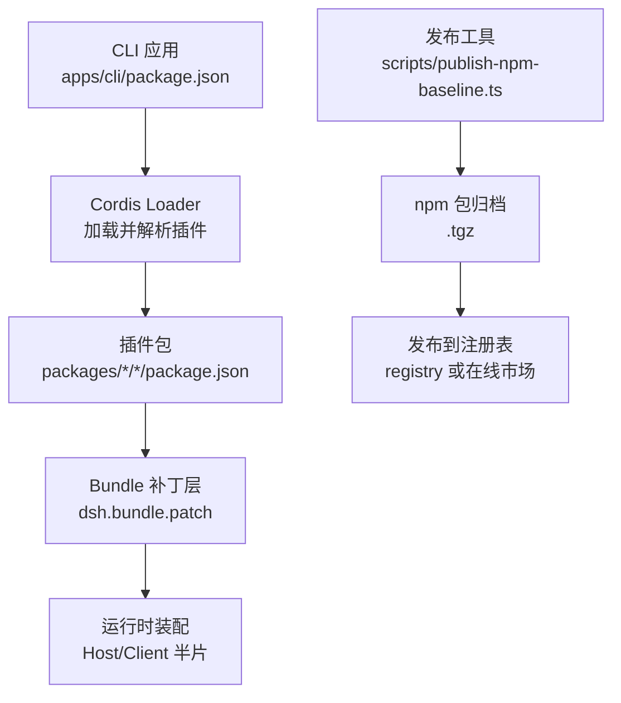
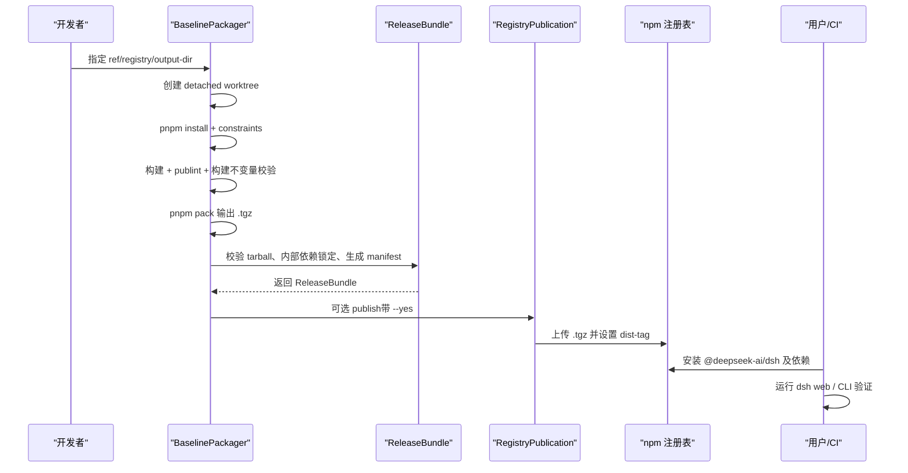
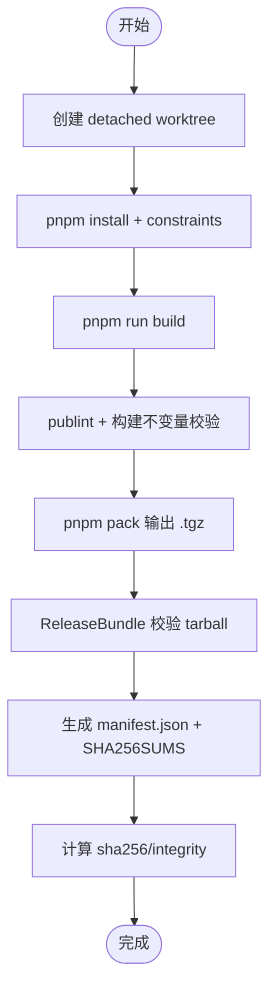
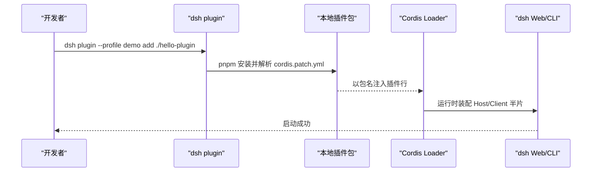
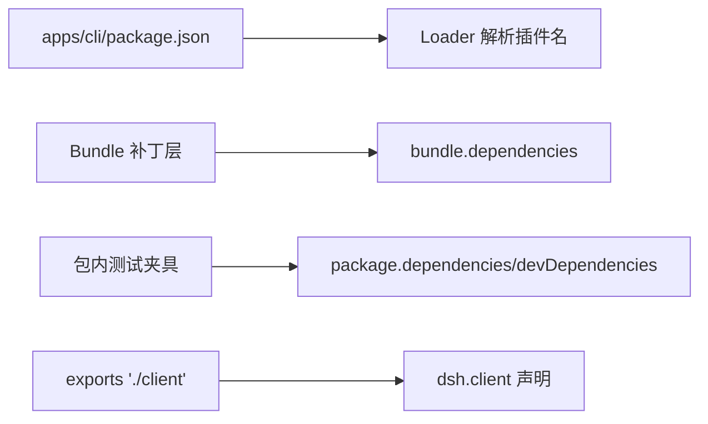

# 打包与分发

<cite>
**本文引用的文件**
- [publish-npm-baseline.ts](file://scripts/publish-npm-baseline.ts)
- [verify-cordis-config.ts](file://scripts/verify-cordis-config.ts)
- [cordis.yml（示例）](file://apps/cli/config/examples/cordis/cordis.yml)
- [publish.md（用户指南）](file://docs/user/develop/basic/publish.md)
- [05-config.md](file://docs/cordis-tutorial/05-config.md)
- [config.zh.md](file://docs/user/develop/basic/config.zh.md)
- [assemble-prebuilds.mjs](file://native/landlock-run/scripts/assemble-prebuilds.mjs)
- [verify-release.mjs](file://native/landlock-run/scripts/verify-release.mjs)
- [build.ts](file://native/landlock-run/scripts/build.ts)
- [client-build-environment.ts](file://scripts/client-build-environment.ts)
</cite>

## 目录
1. [简介](#简介)
2. [项目结构](#项目结构)
3. [核心组件](#核心组件)
4. [架构总览](#架构总览)
5. [详细组件分析](#详细组件分析)
6. [依赖关系分析](#依赖关系分析)
7. [性能考虑](#性能考虑)
8. [故障排查指南](#故障排查指南)
9. [结论](#结论)
10. [附录](#附录)

## 简介
本文件面向 DeepSeek Harness 的插件打包与分发机制，聚焦以下目标：
- 插件包结构与清单规范：目录组织、文件命名约定、元数据定义。
- 插件清单格式与内容要求：依赖声明、版本约束、兼容性信息。
- 构建与打包流程：编译、压缩、签名与验证。
- 分发机制：本地安装、远程仓库与在线市场。
- 可操作示例：配置文件编写、构建脚本设置与发布流程。
- 版本管理策略：语义化版本、依赖解析与冲突解决。

## 项目结构
DeepSeek Harness 采用多包工作区组织，插件以 npm 包形式存在并通过 Cordis Loader 在运行时装配。关键目录与职责：
- scripts：构建、校验、发布工具链（如 baseline packager、配置校验）。
- packages：各功能模块与插件包，部分通过 dsh.bundle.patch 声明“补丁层”。
- apps/cli：CLI 应用，其 package.json 作为应用级依赖面，供 Loader 解析插件名。
- native/landlock-run：原生二进制产物组装与发布脚本。
- docs：用户与开发者文档，包含插件发布与配置教程。

图表来源
- [publish-npm-baseline.ts:541-612](file://scripts/publish-npm-baseline.ts#L541-L612)
- [verify-cordis-config.ts:226-266](file://scripts/verify-cordis-config.ts#L226-L266)

章节来源
- [publish-npm-baseline.ts:237-295](file://scripts/publish-npm-baseline.ts#L237-L295)
- [verify-cordis-config.ts:226-266](file://scripts/verify-cordis-config.ts#L226-L266)

## 核心组件
- BaselinePackager：基于指定提交创建独立工作树，执行构建、校验、打包，生成可发布的工件集合。
- ReleaseBundle：对已打包的 .tgz 进行完整性校验、内部依赖锁定、清单生成与本地验证。
- RegistryPublication：将制品发布到指定 npm 注册表，维护 dist-tag 并做远端一致性校验。
- verify-cordis-config：校验所有 cordis.yml 中的插件引用是否能在对应依赖面中解析，防止未声明依赖。
- 原生构建脚本：assemble-prebuilds.mjs、verify-release.mjs、build.ts 负责平台二进制产物组装与校验。
- 客户端构建环境校验：client-build-environment.ts 校验构建记录与产物摘要。

章节来源
- [publish-npm-baseline.ts:495-612](file://scripts/publish-npm-baseline.ts#L495-L612)
- [publish-npm-baseline.ts:297-423](file://scripts/publish-npm-baseline.ts#L297-L423)
- [publish-npm-baseline.ts:615-765](file://scripts/publish-npm-baseline.ts#L615-L765)
- [verify-cordis-config.ts:226-387](file://scripts/verify-cordis-config.ts#L226-L387)
- [assemble-prebuilds.mjs:1-51](file://native/landlock-run/scripts/assemble-prebuilds.mjs#L1-L51)
- [verify-release.mjs:28-54](file://native/landlock-run/scripts/verify-release.mjs#L28-L54)
- [build.ts:73-86](file://native/landlock-run/scripts/build.ts#L73-L86)
- [client-build-environment.ts:369-393](file://scripts/client-build-environment.ts#L369-L393)

## 架构总览
下图展示从源码到可分发包再到安装的端到端流程，涵盖构建、校验、打包、发布与安装验证。

图表来源
- [publish-npm-baseline.ts:503-612](file://scripts/publish-npm-baseline.ts#L503-L612)
- [publish-npm-baseline.ts:615-765](file://scripts/publish-npm-baseline.ts#L615-L765)

## 详细组件分析

### 插件包结构与清单规范
- 包根目录：每个插件为独立 npm 包，位于 packages/<group>/<name>/ 或 vendor/<name>/。
- 清单文件：package.json 必须包含 name、version、type、main、files 等字段；若为插件包，需声明 dsh.bundle.patch 指向补丁清单。
- 补丁清单：cordis.patch.yml 是 YAML 数组形式的 Loader 行列表，使用包名引用插件，而非相对路径，以便 Node 解析已安装包。
- 入口代码：插件入口导出 name 与 apply（或类），用于宿主/客户端半片装配。

章节来源
- [publish.md:33-81](file://docs/user/develop/basic/publish.md#L33-L81)
- [verify-cordis-config.ts:226-266](file://scripts/verify-cordis-config.ts#L226-L266)

### 插件清单文件格式与内容要求
- 补丁清单（cordis.patch.yml）：
  - 顶层为数组，每项为 Loader 行，支持 id、name、inject、intercept、isolate、disabled 等元数据。
  - 使用 name 引用包名，便于在已安装环境中解析。
  - disabled 支持 !!js 表达式，但仅该字段允许插值，其他元数据必须静态。
- 依赖声明：
  - 插件包的依赖需在 package.json 中显式声明；Loader 会校验 cordis.yml 中引用的插件名是否在依赖面中。
  - Bundle 层的 patch 行必须能从该 bundle 自身的 dependencies 解析。
- 版本与兼容性：
  - 发布时内部依赖会被锁定为精确版本，避免漂移。
  - 客户端/宿主半片需通过 dsh.client 声明与 exports "./client" 保持一致。

章节来源
- [verify-cordis-config.ts:487-542](file://scripts/verify-cordis-config.ts#L487-L542)
- [verify-cordis-config.ts:104-117](file://scripts/verify-cordis-config.ts#L104-L117)
- [publish-npm-baseline.ts:837-872](file://scripts/publish-npm-baseline.ts#L837-L872)

### 构建与打包流程
- 构建阶段：
  - 在 detached worktree 中执行 pnpm install、pnpm run constraints、pnpm run build。
  - 执行 publint 与 verify-built-package-invariants 保证包质量。
- 打包阶段：
  - 使用 pnpm pack 将所有包输出为 .tgz。
  - ReleaseBundle 校验每个 tarball 的 name/version/private/workspace 协议、内部依赖锁定、计算 sha256/integrity，并生成 manifest.json 与 SHA256SUMS。
- 签名与验证：
  - 通过 integrity 与 sha256 校验确保制品不可篡改。
  - 原生二进制通过 assemble-prebuilds.mjs 复制并 chmod，verify-platform-binaries 检查 ELF 架构。
  - verify-release.mjs 校验 tag/version 一致性与预构建产物。

图表来源
- [publish-npm-baseline.ts:541-612](file://scripts/publish-npm-baseline.ts#L541-L612)
- [publish-npm-baseline.ts:297-423](file://scripts/publish-npm-baseline.ts#L297-L423)
- [assemble-prebuilds.mjs:1-51](file://native/landlock-run/scripts/assemble-prebuilds.mjs#L1-L51)
- [verify-release.mjs:28-54](file://native/landlock-run/scripts/verify-release.mjs#L28-L54)

章节来源
- [publish-npm-baseline.ts:503-612](file://scripts/publish-npm-baseline.ts#L503-L612)
- [publish-npm-baseline.ts:297-423](file://scripts/publish-npm-baseline.ts#L297-L423)
- [assemble-prebuilds.mjs:1-51](file://native/landlock-run/scripts/assemble-prebuilds.mjs#L1-L51)
- [verify-release.mjs:28-54](file://native/landlock-run/scripts/verify-release.mjs#L28-L54)
- [build.ts:73-86](file://native/landlock-run/scripts/build.ts#L73-L86)

### 分发机制
- 本地安装：
  - 通过 dsh plugin --profile <name> add <path> 将本地插件安装到 profile，由 pnpm 管理依赖。
  - 插件通过 cordis.patch.yml 以包名引用，被 Loader 在运行时激活。
- 远程仓库：
  - 使用 publish-npm-baseline.ts 的 release 命令将制品发布到指定 registry，并设置 dist-tag。
  - 发布前会 ping 注册表、校验身份、对比远端 integrity 与 dist-tag。
- 在线市场：
  - 发布到 npm 兼容注册表后，可通过标准 npm 客户端安装；@deepseek-ai/dsh 作为入口包提供 CLI/Web。

图表来源
- [publish.md:75-81](file://docs/user/develop/basic/publish.md#L75-L81)
- [cordis.yml（示例）:9-20](file://apps/cli/config/examples/cordis/cordis.yml#L9-L20)

章节来源
- [publish.md:75-81](file://docs/user/develop/basic/publish.md#L75-L81)
- [publish-npm-baseline.ts:615-765](file://scripts/publish-npm-baseline.ts#L615-L765)

### 配置与 Schema 校验
- 插件可导出 Config schema（Standard Schema/Schemastery），在 apply 前由 Loader 校验并填充默认值。
- 错误配置会导致加载失败，并提供精确的错误位置，避免半配置启动。

章节来源
- [05-config.md:1-66](file://docs/cordis-tutorial/05-config.md#L1-L66)
- [config.zh.md:1-72](file://docs/user/develop/basic/config.zh.md#L1-L72)

### 版本管理与冲突解决
- 语义化版本：
  - 根 package.json 的版本为基准版本，发布时派生版本号包含时间戳与短提交哈希。
  - 所有包在发布阶段统一设置为 releaseVersion，避免版本漂移。
- 依赖解析：
  - 内部依赖在发布时被锁定为精确版本，确保可重现安装。
  - Loader 校验插件引用必须在依赖面中解析，缺失则报错。
- 冲突解决：
  - 通过 dist-tag 管理不同分支/版本的可见性。
  - 发布器会检查远端是否存在相同 integrity，避免重复覆盖。

章节来源
- [publish-npm-baseline.ts:237-295](file://scripts/publish-npm-baseline.ts#L237-L295)
- [publish-npm-baseline.ts:837-872](file://scripts/publish-npm-baseline.ts#L837-L872)
- [publish-npm-baseline.ts:615-765](file://scripts/publish-npm-baseline.ts#L615-L765)

## 依赖关系分析
- 插件引用与依赖面：
  - 应用级 overlays 与 shipped 配置从 apps/cli 的依赖面解析。
  - Bundle 层的 patch 行必须从该 bundle 的 dependencies 解析。
  - 包内测试夹具从自身 package.json 的 dependencies/devDependencies 解析。
- 客户端半片声明：
  - 若包导出 "./client"，必须同时声明 dsh.client，否则浏览器半片不会被服务。

图表来源
- [verify-cordis-config.ts:226-266](file://scripts/verify-cordis-config.ts#L226-L266)
- [verify-cordis-config.ts:104-117](file://scripts/verify-cordis-config.ts#L104-L117)

章节来源
- [verify-cordis-config.ts:226-387](file://scripts/verify-cordis-config.ts#L226-L387)

## 性能考虑
- 构建缓存与并行：
  - 使用 pnpm workspace 与 frozen lockfile 提升安装稳定性与速度。
  - 构建与校验步骤顺序执行以保证正确性，可在 CI 中并行化不同包的任务。
- 产物体积：
  - 通过 files 字段仅包含必要文件，减少包体积。
  - 原生二进制使用静态链接与最小化选项降低依赖。
- 网络与注册表：
  - 发布前 ping 注册表并校验身份，减少无效请求。
  - 使用 integrity 与 dist-tag 避免重复上传与冲突。

[本节提供通用指导，不直接分析具体文件]

## 故障排查指南
- 插件未解析：
  - 检查 cordis.yml 中 name 是否在对应依赖面中声明。
  - 确认 Bundle 补丁行的插件名可从 bundle.dependencies 解析。
- 客户端半片未生效：
  - 若导出 "./client"，需声明 dsh.client；否则浏览器半片不会服务。
- 构建失败：
  - 检查 pnpm constraints、publint、verify-built-package-invariants 输出。
  - 原生构建失败时确认 musl-tools 安装与环境变量。
- 发布失败：
  - 校验 registry 可达、身份有效、dist-tag 设置正确。
  - 比对远端 integrity 与本地制品是否一致。

章节来源
- [verify-cordis-config.ts:226-387](file://scripts/verify-cordis-config.ts#L226-L387)
- [publish-npm-baseline.ts:615-765](file://scripts/publish-npm-baseline.ts#L615-L765)
- [build.ts:73-86](file://native/landlock-run/scripts/build.ts#L73-L86)
- [client-build-environment.ts:369-393](file://scripts/client-build-environment.ts#L369-L393)

## 结论
DeepSeek Harness 的插件体系以 npm 包为核心，结合 Cordis Loader 的补丁层实现灵活装配。通过严格的依赖解析、构建校验与发布流程，确保插件的可移植性与可重现性。建议遵循本文的结构规范与流程，配合版本管理与冲突解决策略，实现高质量的插件开发与分发。

## 附录
- 快速上手：
  - 创建插件包：定义 package.json、插件入口与 cordis.patch.yml。
  - 本地安装：使用 dsh plugin --profile <name> add <path>。
  - 发布到注册表：运行 publish-npm-baseline.ts 的 pack/release 命令。
- 参考文件：
  - 插件发布指南：[publish.md](file://docs/user/develop/basic/publish.md)
  - 配置与 Schema：[05-config.md](file://docs/cordis-tutorial/05-config.md)、[config.zh.md](file://docs/user/develop/basic/config.zh.md)
  - 示例补丁：[cordis.yml（示例）](file://apps/cli/config/examples/cordis/cordis.yml)
  - 发布工具：[publish-npm-baseline.ts](file://scripts/publish-npm-baseline.ts)
  - 配置校验：[verify-cordis-config.ts](file://scripts/verify-cordis-config.ts)
  - 原生构建：[assemble-prebuilds.mjs](file://native/landlock-run/scripts/assemble-prebuilds.mjs)、[verify-release.mjs](file://native/landlock-run/scripts/verify-release.mjs)、[build.ts](file://native/landlock-run/scripts/build.ts)
  - 构建环境校验：[client-build-environment.ts](file://scripts/client-build-environment.ts)