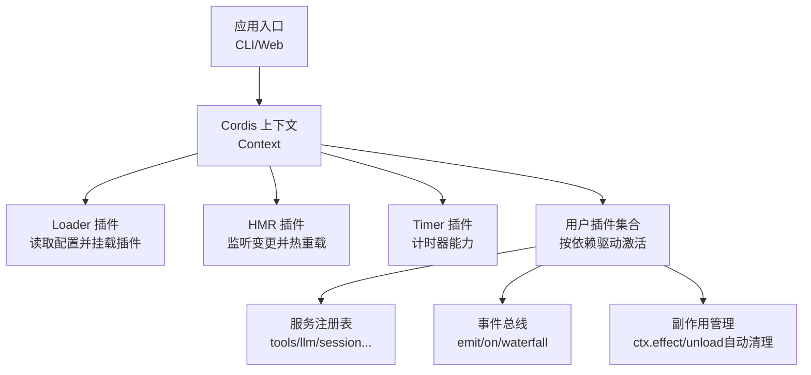
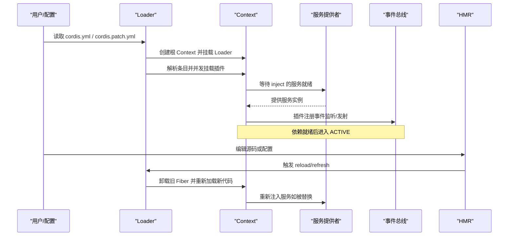
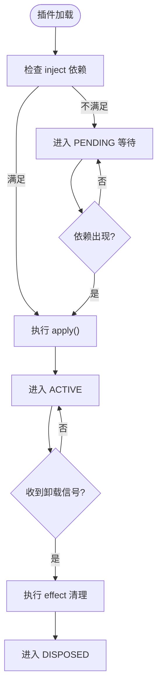
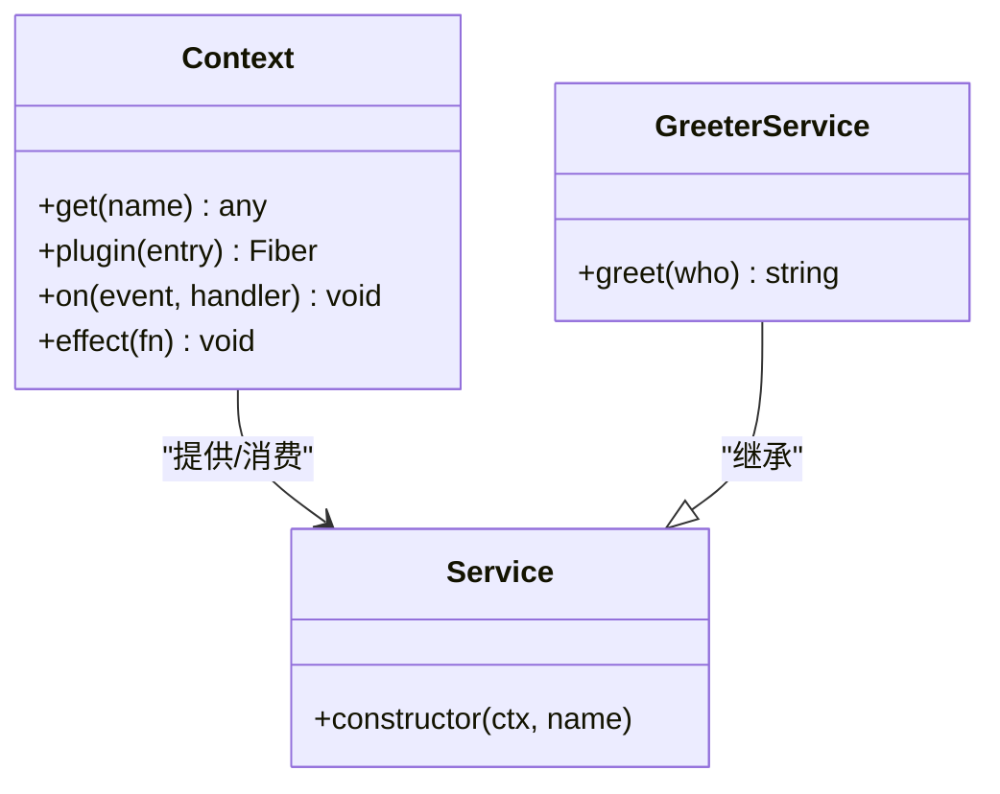
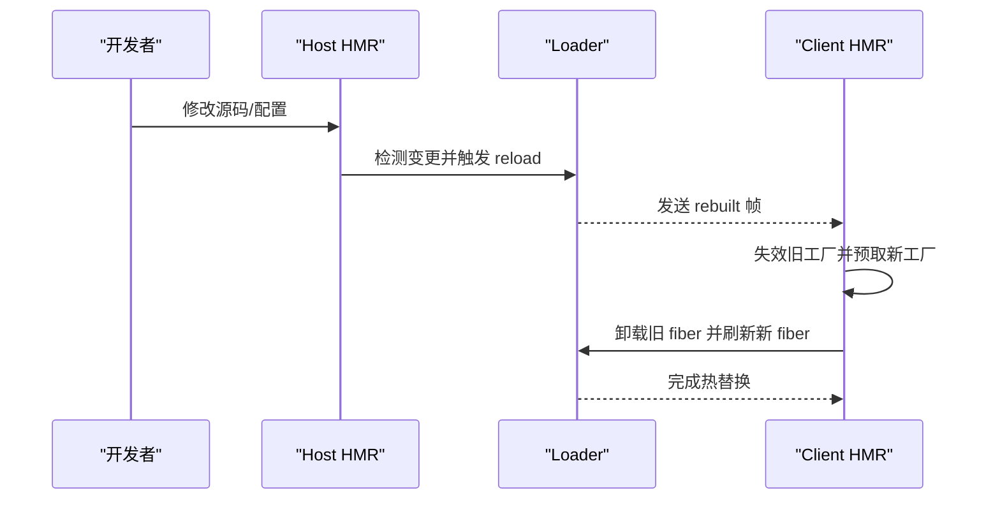
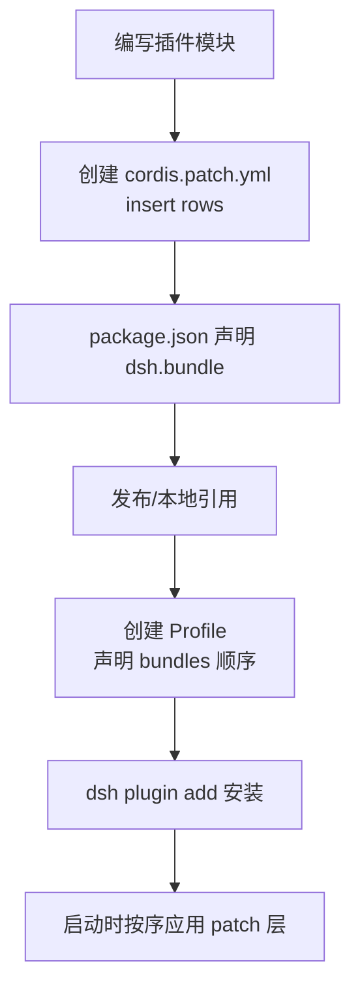
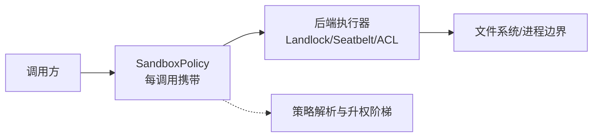
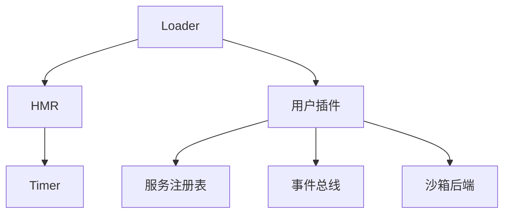

# 插件扩展机制

<cite>
**本文引用的文件**
- [01-first-plugin.md](file://docs/cordis-tutorial/01-first-plugin.md)
- [02-lifecycle-and-effects.md](file://docs/cordis-tutorial/02-lifecycle-and-effects.md)
- [03-services.md](file://docs/cordis-tutorial/03-services.md)
- [04-events.md](file://docs/cordis-tutorial/04-events.md)
- [06-composition-and-hmr.md](file://docs/cordis-tutorial/06-composition-and-hmr.md)
- [07-into-the-harness.md](file://docs/cordis-tutorial/07-into-the-harness.md)
- [index.md](file://docs/user/develop/framework/index.md)
- [service.md](file://docs/user/develop/framework/service.md)
- [inherited.md](file://docs/cordis-api/inherited.md)
- [prompt.ts](file://packages/extensions/tool-cordis/src/prompt.ts)
- [client-plugin-loading-model.md](file://.agents/notes/implemented/architecture/2026-07-23-client-plugin-loading-model.md)
- [hmr-config.spec.ts](file://packages/boot/app-boot/tests/hmr-config.spec.ts)
- [index.ts](file://packages/client/hmr/src/index.ts)
- [client/index.ts](file://packages/client/hmr/src/client/index.ts)
- [profile-hmr.spec.ts](file://apps/cli/tests/profile-hmr.spec.ts)
- [verify-cordis-config.ts](file://scripts/verify-cordis-config.ts)
- [check-workspace-constraints.ts](file://scripts/check-workspace-constraints.ts)
- [publish.md](file://docs/user/develop/basic/publish.md)
- [cordis.patch.yml](file://packages/bundle/base/cordis.patch.yml)
- [profile.ts](file://packages/boot/app-boot/src/profile.ts)
- [sandbox.md](file://docs/subsystems/sandbox.md)
- [README.zh.md](file://packages/sandbox/sandbox-local/README.zh.md)
- [profiles.ts](file://packages/sandbox/sandbox-local/src/profiles.ts)
- [sandbox-windows-acl/index.ts](file://packages/sandbox/sandbox-windows-acl/src/index.ts)
</cite>

## 目录
1. [简介](#简介)
2. [项目结构](#项目结构)
3. [核心组件](#核心组件)
4. [架构总览](#架构总览)
5. [详细组件分析](#详细组件分析)
6. [依赖分析](#依赖分析)
7. [性能考虑](#性能考虑)
8. [故障排查指南](#故障排查指南)
9. [结论](#结论)
10. [附录](#附录)

## 简介
本文件系统性阐述 DeepSeek Harness 的插件扩展机制，覆盖插件生命周期、依赖管理、通信协议、打包与分发、动态加载与热重载、插件间通信、安全隔离、开发调试与性能分析等主题。内容基于 Cordis 运行时与 Harness 子系统实现，提供从概念到代码级映射的可视化说明，帮助读者从零开始构建、安装、运行和调试插件。

## 项目结构
DeepSeek Harness 将“插件”抽象为可组合的能力单元：每个插件通过 Context 暴露或消费服务、注册工具、监听事件、管理副作用，并通过配置文件（cordis.yml / cordis.patch.yml）进行装配。宿主侧与浏览器侧共享同一套 Cordis 插件模型，但模块系统与热更新通道不同。



图表来源
- [01-first-plugin.md:23-51](file://docs/cordis-tutorial/01-first-plugin.md#L23-L51)
- [06-composition-and-hmr.md:23-59](file://docs/cordis-tutorial/06-composition-and-hmr.md#L23-L59)
- [inherited.md:23-38](file://docs/cordis-api/inherited.md#L23-L38)

章节来源
- [01-first-plugin.md:23-51](file://docs/cordis-tutorial/01-first-plugin.md#L23-L51)
- [06-composition-and-hmr.md:23-59](file://docs/cordis-tutorial/06-composition-and-hmr.md#L23-L59)

## 核心组件
- 插件形态与入口
  - 函数型、对象型、类服务型三种插件形态；apply(ctx) 是统一入口，name 用于诊断标识。
- 生命周期与纤维（Fiber）状态机
  - PENDING → LOADING → ACTIVE → UNLOADING → DISPOSED，失败分支 FAILED。
- 依赖注入与服务
  - inject 声明硬依赖；ctx.get 获取可选服务；服务替换时依赖方自动卸载再重加载。
- 事件系统
  - emit/parallel/serial/bail/waterfall 五种分发模式；waterfall 支持拦截与短路。
- 副作用与自动清理
  - ctx.on、ctx.plugin、Service 注册、工具注册均为 effect；外部资源用 ctx.effect 包装并返回清理函数。
- 热模块替换（HMR）
  - Loader + HMR + Timer 协作；保存即重载，PENDING 状态需显式启用 timer。
- 打包与分发
  - Bundle（贡献 patch 层）与 Profile（声明 bundles 顺序）；dsh plugin add 安装；patchReload 控制用户补丁热重载策略。
- 安全与沙箱
  - SandboxPolicy 逐调用携带；full/partial 执行完整性；Windows ACL、macOS Seatbelt、Linux Landlock 后端。

章节来源
- [01-first-plugin.md:53-91](file://docs/cordis-tutorial/01-first-plugin.md#L53-L91)
- [02-lifecycle-and-effects.md:68-94](file://docs/cordis-tutorial/02-lifecycle-and-effects.md#L68-L94)
- [03-services.md:44-94](file://docs/cordis-tutorial/03-services.md#L44-L94)
- [04-events.md:80-140](file://docs/cordis-tutorial/04-events.md#L80-L140)
- [06-composition-and-hmr.md:23-59](file://docs/cordis-tutorial/06-composition-and-hmr.md#L23-L59)
- [publish.md:9-73](file://docs/user/develop/basic/publish.md#L9-L73)
- [profile.ts:55-91](file://packages/boot/app-boot/src/profile.ts#L55-L91)
- [sandbox.md:23-39](file://docs/subsystems/sandbox.md#L23-L39)

## 架构总览
下图展示宿主与客户端在插件加载、服务发现、事件通信与热重载方面的整体交互。



图表来源
- [01-first-plugin.md:23-51](file://docs/cordis-tutorial/01-first-plugin.md#L23-L51)
- [06-composition-and-hmr.md:23-59](file://docs/cordis-tutorial/06-composition-and-hmr.md#L23-L59)
- [inherited.md:23-38](file://docs/cordis-api/inherited.md#L23-L38)

## 详细组件分析

### 插件生命周期与副作用管理
- 状态机：PENDING/LOADING/ACTIVE/FAILED/UNLOADING/DISPOSED。
- 副作用：所有通过 ctx 注册的监听、工具、服务等在卸载时自动撤销；外部资源使用 ctx.effect 包装并返回清理函数。
- 依赖驱动：inject 缺失导致 PENDING；服务消失会触发依赖方卸载并待其回归后重新加载。



图表来源
- [02-lifecycle-and-effects.md:68-94](file://docs/cordis-tutorial/02-lifecycle-and-effects.md#L68-L94)
- [03-services.md:74-94](file://docs/cordis-tutorial/03-services.md#L74-L94)

章节来源
- [02-lifecycle-and-effects.md:68-94](file://docs/cordis-tutorial/02-lifecycle-and-effects.md#L68-L94)
- [03-services.md:74-94](file://docs/cordis-tutorial/03-services.md#L74-L94)

### 服务与依赖管理
- 提供：继承 Service 并在 apply 中通过 ctx.plugin 注册；TypeScript 通过 declare module 合并类型。
- 消费：inject 声明硬依赖；ctx.get 获取可选服务；服务替换时依赖方自动卸载再重加载。
- 命名空间：服务名全局唯一，建议前缀化避免冲突。



图表来源
- [03-services.md:7-42](file://docs/cordis-tutorial/03-services.md#L7-L42)
- [03-services.md:44-94](file://docs/cordis-tutorial/03-services.md#L44-L94)

章节来源
- [03-services.md:7-94](file://docs/cordis-tutorial/03-services.md#L7-L94)

### 事件总线与插件间通信
- 事件声明：通过 interface Events 合并事件签名，确保 emit/on 类型安全。
- 分发模式：emit（同步广播）、parallel（并行）、serial（串行首个非空返回）、bail（同步串行）、waterfall（中间件式拦截/短路）。
- Waterfall 语义：未调用 next 即为有意短路；观察型监听必须调用 next。

```mermaid
sequenceDiagram
participant P as "生产者插件"
participant E as "事件总线"
participant L1 as "监听器A"
participant L2 as "监听器B"
P->>E : emit("stats/report", name, count)
E-->>L1 : 回调(name, count)
E-->>L2 : 回调(name, count)
Note over E,L1,L2 : 若为 waterfall，则传入 next() 并允许短路
```

图表来源
- [04-events.md:7-78](file://docs/cordis-tutorial/04-events.md#L7-L78)
- [04-events.md:80-140](file://docs/cordis-tutorial/04-events.md#L80-L140)

章节来源
- [04-events.md:7-140](file://docs/cordis-tutorial/04-events.md#L7-L140)

### 动态加载与热重载（HMR）
- 宿主侧：Loader + HMR + Timer；保存即重载，PENDING 需显式启用 timer。
- 浏览器侧：client-hmr 订阅 SSE 事件流，按 id 定位 loader entry，先失效再预取，再卸载旧 fiber 并刷新新 fiber；样式标签按 data-plugin 清理。
- 配置：cordis.patch.yml 中 hmr 默认 disabled，可通过 profile 层启用；patchReload 控制用户补丁热重载策略。



图表来源
- [06-composition-and-hmr.md:23-59](file://docs/cordis-tutorial/06-composition-and-hmr.md#L23-L59)
- [client/index.ts:93-185](file://packages/client/hmr/src/client/index.ts#L93-L185)
- [index.ts:63-91](file://packages/client/hmr/src/index.ts#L63-L91)
- [hmr-config.spec.ts:12-23](file://packages/boot/app-boot/tests/hmr-config.spec.ts#L12-L23)
- [profile-hmr.spec.ts:36-46](file://apps/cli/tests/profile-hmr.spec.ts#L36-L46)

章节来源
- [06-composition-and-hmr.md:23-59](file://docs/cordis-tutorial/06-composition-and-hmr.md#L23-L59)
- [client/index.ts:93-185](file://packages/client/hmr/src/client/index.ts#L93-L185)
- [index.ts:63-91](file://packages/client/hmr/src/index.ts#L63-L91)
- [hmr-config.spec.ts:12-23](file://packages/boot/app-boot/tests/hmr-config.spec.ts#L12-L23)
- [profile-hmr.spec.ts:36-46](file://apps/cli/tests/profile-hmr.spec.ts#L36-L46)

### 打包与分发：Bundle 与 Profile
- Bundle：npm 包，声明 dsh.bundle.patch 指向 cordis.patch.yml，回答“贡献什么”。
- Profile：位于 $DSH_HOME/profiles/<name>，声明 dsh.profile.bundles 列表与 patchReload，回答“如何组合”。
- 安装：dsh plugin --profile <name> add <bundle>；层顺序由 bundles 数组决定，用户 patch 最后生效。
- 校验：脚本验证 bundle 引用与依赖一致性，防止未声明依赖。



图表来源
- [publish.md:9-73](file://docs/user/develop/basic/publish.md#L9-L73)
- [profile.ts:55-91](file://packages/boot/app-boot/src/profile.ts#L55-L91)
- [verify-cordis-config.ts:249-387](file://scripts/verify-cordis-config.ts#L249-L387)

章节来源
- [publish.md:9-73](file://docs/user/develop/basic/publish.md#L9-L73)
- [profile.ts:55-91](file://packages/boot/app-boot/src/profile.ts#L55-L91)
- [verify-cordis-config.ts:249-387](file://scripts/verify-cordis-config.ts#L249-L387)

### 插件安全机制：沙箱隔离与权限控制
- 设计理念：按约定限制同世界；策略随调用传递；故障关闭；统一的拒绝与升权词汇。
- 执行完整性：full/partial 区分后端对文件效应的完整治理能力。
- 平台后端：Linux bwrap/Landlock、macOS Seatbelt、Windows 受限令牌/ACL。
- 策略生成：Seatbelt SBPL 写入根推导与只写白名单。



图表来源
- [sandbox.md:23-39](file://docs/subsystems/sandbox.md#L23-L39)
- [README.zh.md:82-96](file://packages/sandbox/sandbox-local/README.zh.md#L82-L96)
- [profiles.ts:38-58](file://packages/sandbox/sandbox-local/src/profiles.ts#L38-L58)
- [sandbox-windows-acl/index.ts:213-236](file://packages/sandbox/sandbox-windows-acl/src/index.ts#L213-L236)

章节来源
- [sandbox.md:23-39](file://docs/subsystems/sandbox.md#L23-L39)
- [README.zh.md:82-96](file://packages/sandbox/sandbox-local/README.zh.md#L82-L96)
- [profiles.ts:38-58](file://packages/sandbox/sandbox-local/src/profiles.ts#L38-L58)
- [sandbox-windows-acl/index.ts:213-236](file://packages/sandbox/sandbox-windows-acl/src/index.ts#L213-L236)

### 前端组件、后端服务与配置示例路径
- 前端组件（浏览器端插件）：通过 client-hmr 热替换，遵循纯 JS 与 React.createElement 约束，避免直接依赖全局。
- 后端服务（宿主端插件）：通过 Service 暴露能力，工具通过 tools.register 注册，结果经 events 传播。
- 配置文件：cordis.yml（本地调试），cordis.patch.yml（Bundle 层），profile 的 package.json（bundles 顺序与 patchReload）。

章节来源
- [prompt.ts:54-82](file://packages/extensions/tool-cordis/src/prompt.ts#L54-L82)
- [07-into-the-harness.md:7-94](file://docs/cordis-tutorial/07-into-the-harness.md#L7-L94)
- [publish.md:9-73](file://docs/user/develop/basic/publish.md#L9-L73)

## 依赖分析
- 组件耦合
  - Loader 与 HMR 强耦合于 Cordis 内部接口；client-hmr 依赖 modules 与 loader 服务。
  - 插件通过服务名解耦，避免直接导入实现；服务替换时依赖方自动卸载并重载。
- 外部依赖
  - 平台相关沙箱后端（Landlock/Seatbelt/ACL）；Node 模块系统与浏览器模块系统差异由 dsh-client-modules 桥接。
- 循环依赖
  - 通过事件与服务的单向契约避免循环；waterfall 仅用于横切逻辑。



图表来源
- [06-composition-and-hmr.md:23-59](file://docs/cordis-tutorial/06-composition-and-hmr.md#L23-L59)
- [client-plugin-loading-model.md:1-116](file://.agents/notes/implemented/architecture/2026-07-23-client-plugin-loading-model.md#L1-L116)
- [sandbox.md:23-39](file://docs/subsystems/sandbox.md#L23-L39)

章节来源
- [06-composition-and-hmr.md:23-59](file://docs/cordis-tutorial/06-composition-and-hmr.md#L23-L59)
- [client-plugin-loading-model.md:1-116](file://.agents/notes/implemented/architecture/2026-07-23-client-plugin-loading-model.md#L1-L116)
- [sandbox.md:23-39](file://docs/subsystems/sandbox.md#L23-L39)

## 性能考虑
- 依赖驱动加载减少无效初始化；PENDING 不会阻塞事件循环。
- HMR 采用失效→预取→卸载→刷新的有序流程，避免重复注册与样式污染。
- 事件分发选择合适模式：高频通知用 emit，需要聚合结果用 parallel，决策链用 waterfall。
- 沙箱策略最小化授权范围，降低越权开销。

[本节为通用指导，无需特定文件来源]

## 故障排查指南
- 插件无输出且处于 PENDING：检查是否缺少 inject 的服务（如 timer），或通过 registry 枚举 fibers 查看状态。
- HMR 不生效：确认已启用 hmr 插件与 timer；检查 patchReload 配置；浏览器端确认 SSE 事件与 entry id 匹配。
- 服务替换导致行为异常：确认依赖方是否正确卸载并重新加载；避免持有过期服务引用。
- 沙箱报错：检查 SandboxPolicy 模式与平台后端可用性；partial 模式下严格消费者应拒绝降级。

章节来源
- [06-composition-and-hmr.md:61-109](file://docs/cordis-tutorial/06-composition-and-hmr.md#L61-L109)
- [inherited.md:23-38](file://docs/cordis-api/inherited.md#L23-L38)
- [sandbox.md:23-39](file://docs/subsystems/sandbox.md#L23-L39)

## 结论
DeepSeek Harness 以 Cordis 为核心，将插件视为可组合、可替换、可热更新的能力单元。通过依赖驱动的生命周期、类型安全的事件系统、严格的沙箱策略以及清晰的打包分发模型，实现了高内聚、低耦合的扩展生态。开发者可基于此快速构建前后端插件，并通过配置与层叠机制灵活定制运行时行为。

## 附录

### 常用命令与配置要点
- 本地调试：node --import tsx vendor/cordis/bin.js；在 cordis.yml 中列出插件条目。
- 启用 HMR：在 cordis.patch.yml 中添加 hmr 条目并启用 timer；profile 层可设置 patchReload。
- 安装插件：dsh plugin --profile <name> add <bundle>；确认 bundles 顺序与依赖声明一致。

章节来源
- [01-first-plugin.md:23-51](file://docs/cordis-tutorial/01-first-plugin.md#L23-L51)
- [06-composition-and-hmr.md:23-59](file://docs/cordis-tutorial/06-composition-and-hmr.md#L23-L59)
- [publish.md:75-81](file://docs/user/develop/basic/publish.md#L75-L81)

### 参考实现与基线
- 基础 Bundle 层：包含 timer、llm、session、storage、sandbox、tools、web 等核心插件行，作为各模式的起点。
- 客户端 HMR：client-hmr 订阅事件流并按 id 刷新 entry；host 侧通过 stat 轮询与 rebuilt 通知驱动。

章节来源
- [cordis.patch.yml:15-502](file://packages/bundle/base/cordis.patch.yml#L15-L502)
- [client/index.ts:93-185](file://packages/client/hmr/src/client/index.ts#L93-L185)
- [index.ts:63-91](file://packages/client/hmr/src/index.ts#L63-L91)