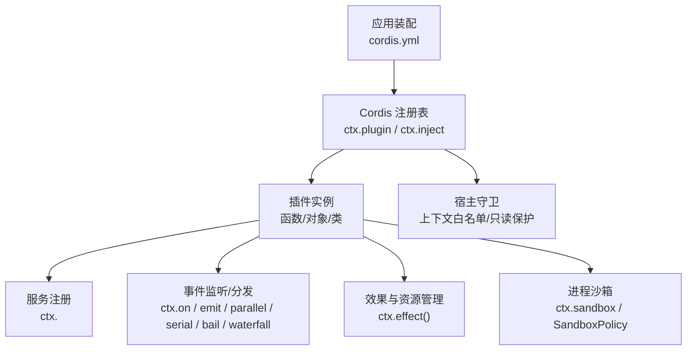
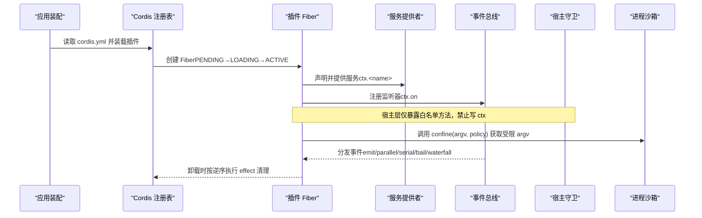
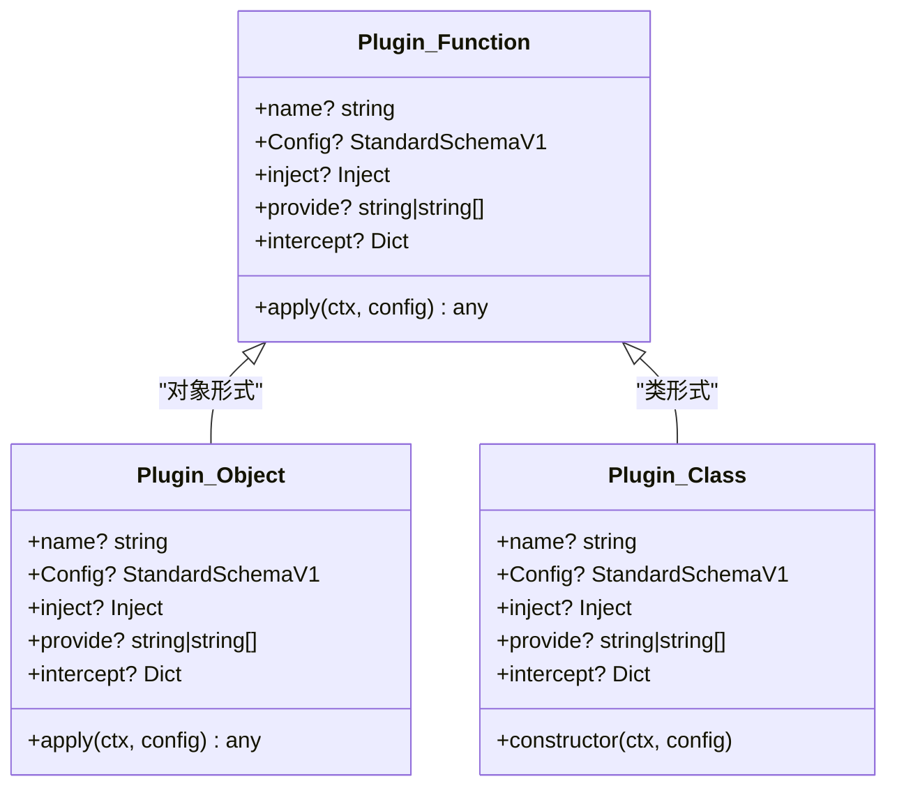
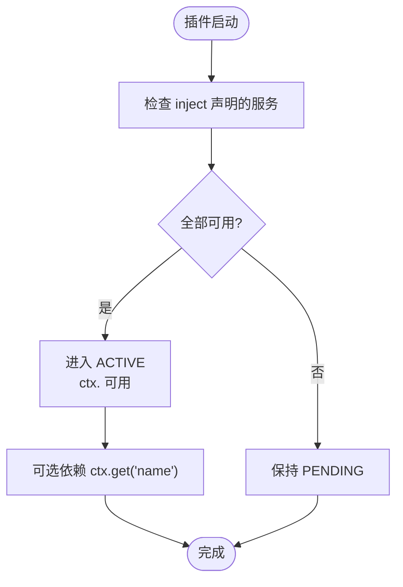
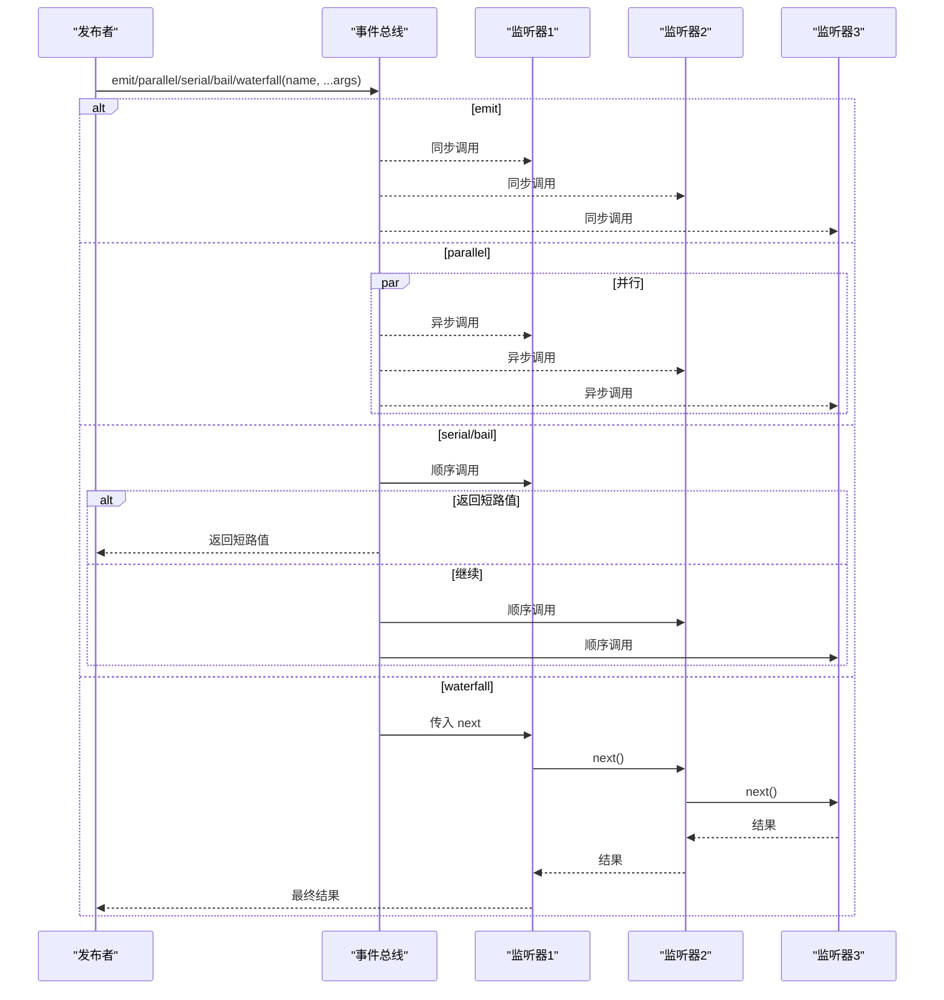
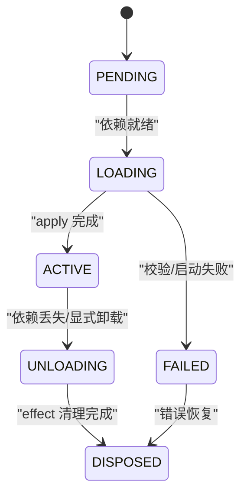
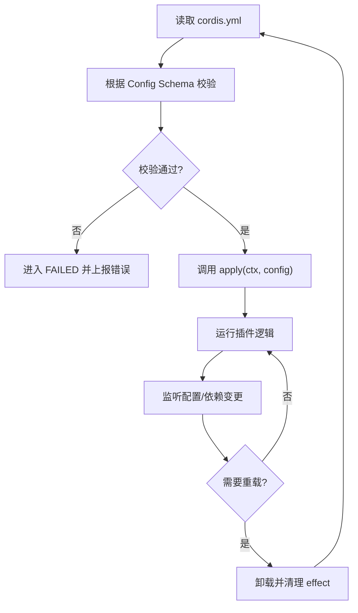
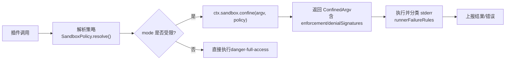
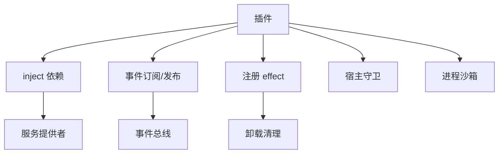

# 插件架构设计

<cite>
**本文引用的文件**
- [服务接口文档](file://docs/cordis-api/service.md)
- [事件接口文档](file://docs/cordis-api/events.md)
- [注册表与插件入口文档](file://docs/cordis-api/registry.md)
- [Cordis 入门指南](file://docs/cordis-primer.md)
- [教程：第一个插件](file://docs/cordis-tutorial/01-first-plugin.md)
- [教程：生命周期与效果](file://docs/cordis-tutorial/02-lifecycle-and-effects.md)
- [教程：服务与依赖注入](file://docs/cordis-tutorial/03-services.md)
- [教程：事件通信](file://docs/cordis-tutorial/04-events.md)
- [教程：配置系统](file://docs/cordis-tutorial/05-config.md)
- [子系统：进程沙箱](file://docs/subsystems/sandbox.md)
- [宿主运行器守卫（上下文白名单）](file://packages/extensions/cordis-host-runner/src/guard.ts)
- [宿主运行器生命周期（缺失服务检测）](file://packages/extensions/cordis-host-runner/src/lifecycle.ts)
</cite>

## 目录
1. [简介](#简介)
2. [项目结构](#项目结构)
3. [核心组件](#核心组件)
4. [架构总览](#架构总览)
5. [详细组件分析](#详细组件分析)
6. [依赖关系分析](#依赖关系分析)
7. [性能考量](#性能考量)
8. [故障排查指南](#故障排查指南)
9. [结论](#结论)
10. [附录](#附录)

## 简介
本文件面向 DeepSeek Harness 的插件架构，围绕微内核、插件隔离、依赖注入、生命周期管理、插件间通信、配置管理与安全模型进行系统化说明。DeepSeek Harness 基于 Cordis 插件框架，将“应用由插件组合”的理念贯穿加载、初始化、运行与卸载全过程；通过服务发现与事件总线实现松耦合扩展，通过配置校验与环境注入保证可维护性与可观测性，并通过沙箱与上下文白名单提供运行时隔离与权限控制。

## 项目结构
- 插件框架与 API 定义位于 Cordis 相关文档与宿主运行器中，包括服务、事件、注册表、生命周期等。
- 教程文档以循序渐进的方式展示如何编写插件、声明依赖、使用事件与配置。
- 子系统文档描述进程级沙箱策略，为插件执行提供资源限制与隔离保障。
- 宿主运行器在加载与运行期对上下文访问进行白名单与守卫，防止插件越权访问内部能力。

**图示来源**
- [注册表与插件入口文档:35-56](file://docs/cordis-api/registry.md#L35-L56)
- [服务接口文档:1-23](file://docs/cordis-api/service.md#L1-L23)
- [事件接口文档:8-208](file://docs/cordis-api/events.md#L8-L208)
- [宿主运行器守卫:759-794](file://packages/extensions/cordis-host-runner/src/guard.ts#L759-L794)
- [子系统：进程沙箱:9-39](file://docs/subsystems/sandbox.md#L9-L39)

**章节来源**
- [注册表与插件入口文档:35-56](file://docs/cordis-api/registry.md#L35-L56)
- [服务接口文档:1-23](file://docs/cordis-api/service.md#L1-L23)
- [事件接口文档:8-208](file://docs/cordis-api/events.md#L8-L208)
- [宿主运行器守卫:759-794](file://packages/extensions/cordis-host-runner/src/guard.ts#L759-L794)
- [子系统：进程沙箱:9-39](file://docs/subsystems/sandbox.md#L9-L39)

## 核心组件
- 微内核（Cordis）：提供 Context、Fiber、Service、Event、Registry 等基础能力，插件通过标准入口（函数/对象/类）接入。
- 服务与依赖注入：插件通过 inject 声明所需服务，框架确保依赖就绪后再启动；服务以稳定键名暴露于 ctx。
- 事件总线：支持多种分发模式（emit、parallel、serial、bail、waterfall），用于解耦通信与拦截。
- 生命周期与效果：插件实例以 Fiber 状态机管理，所有注册均作为 effect，卸载时自动回滚。
- 配置系统：每个插件可声明 Config Schema，加载前校验；支持 !!js 动态计算与环境变量注入。
- 安全模型：上下文白名单与只读保护；进程级沙箱策略（read-only/workspace-write/danger-full-access）与后端执行完整性报告。

**章节来源**
- [Cordis 入门指南:7-13](file://docs/cordis-primer.md#L7-L13)
- [教程：生命周期与效果:67-94](file://docs/cordis-tutorial/02-lifecycle-and-effects.md#L67-L94)
- [教程：服务与依赖注入:44-79](file://docs/cordis-tutorial/03-services.md#L44-L79)
- [教程：事件通信:80-141](file://docs/cordis-tutorial/04-events.md#L80-L141)
- [教程：配置系统:1-81](file://docs/cordis-tutorial/05-config.md#L1-L81)
- [子系统：进程沙箱:9-39](file://docs/subsystems/sandbox.md#L9-L39)

## 架构总览
下图展示了从应用装配到插件运行的整体流程：YAML 配置驱动 Loader 挂载插件，注册表解析依赖并创建 Fiber，插件通过 Service 暴露能力、通过 Event 通信，并通过 effect 管理资源；宿主层对上下文访问进行白名单与只读保护，执行路径通过沙箱策略限制文件系统影响。

**图示来源**
- [注册表与插件入口文档:35-56](file://docs/cordis-api/registry.md#L35-L56)
- [事件接口文档:8-208](file://docs/cordis-api/events.md#L8-L208)
- [宿主运行器守卫:759-794](file://packages/extensions/cordis-host-runner/src/guard.ts#L759-L794)
- [子系统：进程沙箱:152-187](file://docs/subsystems/sandbox.md#L152-L187)

## 详细组件分析

### 微内核与插件入口（函数/对象/类）
- 插件入口支持三种形态：函数插件、对象插件（含 apply）、类插件（继承 Service）。
- 插件元数据包含 name、Config、inject、provide、intercept，用于诊断、校验、依赖与拦截配置。
- 运行时记录 Runtime 共享同一回调标识，便于多 Fiber 实例的生命周期管理。

**图示来源**
- [注册表与插件入口文档:58-121](file://docs/cordis-api/registry.md#L58-L121)

**章节来源**
- [教程：第一个插件:53-77](file://docs/cordis-tutorial/01-first-plugin.md#L53-L77)
- [注册表与插件入口文档:58-121](file://docs/cordis-api/registry.md#L58-L121)

### 依赖注入与服务发现
- 插件通过 inject 声明硬依赖，框架等待所有服务就绪后才进入 ACTIVE。
- 服务以稳定键名暴露于 ctx，消费者无需知道具体实现，便于替换与热更新。
- 可选依赖通过 ctx.get('name') 探测，避免强耦合。

**图示来源**
- [教程：服务与依赖注入:44-79](file://docs/cordis-tutorial/03-services.md#L44-L79)
- [宿主运行器生命周期:47-57](file://packages/extensions/cordis-host-runner/src/lifecycle.ts#L47-L57)

**章节来源**
- [教程：服务与依赖注入:44-79](file://docs/cordis-tutorial/03-services.md#L44-L79)
- [宿主运行器生命周期:47-57](file://packages/extensions/cordis-host-runner/src/lifecycle.ts#L47-L57)

### 事件总线与消息传递
- 事件分发模式：
  - emit：同步广播，不收集返回值。
  - parallel：并发执行所有监听器，统一 await。
  - serial：顺序执行，首个非空返回值短路。
  - bail：同步版本的 serial。
  - waterfall：中间件式链式处理，支持 next() 与 veto。
- 事件名称通过 TypeScript 声明合并进行类型约束，确保类型安全。

**图示来源**
- [事件接口文档:8-208](file://docs/cordis-api/events.md#L8-L208)
- [教程：事件通信:80-141](file://docs/cordis-tutorial/04-events.md#L80-L141)

**章节来源**
- [事件接口文档:8-208](file://docs/cordis-api/events.md#L8-L208)
- [教程：事件通信:80-141](file://docs/cordis-tutorial/04-events.md#L80-L141)

### 生命周期与效果管理
- Fiber 状态机：PENDING → LOADING → ACTIVE → UNLOADING → DISPOSED，异常路径进入 FAILED。
- 所有注册（事件监听、子插件、服务等）均为 effect，卸载时按逆序执行清理。
- 外部资源需通过 ctx.effect() 包装并返回 disposer，确保热重载与卸载时的确定性回收。

**图示来源**
- [教程：生命周期与效果:67-94](file://docs/cordis-tutorial/02-lifecycle-and-effects.md#L67-L94)

**章节来源**
- [教程：生命周期与效果:67-94](file://docs/cordis-tutorial/02-lifecycle-and-effects.md#L67-L94)

### 配置系统与动态更新
- 插件通过导出 Config Schema（Standard Schema）在加载前校验配置，失败即进入 FAILED。
- 支持 !!js 标签在配置中进行动态计算，常用于环境变量注入或平台条件判断。
- 配置变更触发重新装配，依赖变化导致插件卸载并重启，保证一致性。

**图示来源**
- [教程：配置系统:1-81](file://docs/cordis-tutorial/05-config.md#L1-L81)

**章节来源**
- [教程：配置系统:1-81](file://docs/cordis-tutorial/05-config.md#L1-L81)

### 插件安全模型：沙箱隔离、权限控制与资源限制
- 上下文白名单与只读保护：宿主层对 ctx 的属性访问进行白名单过滤，禁止写入，防止插件篡改框架内部状态。
- 进程级沙箱：通过 SandboxMode（read-only/workspace-write/danger-full-access）限制文件系统影响；后端返回 enforcement 完整性（full/partial）。
- 每调用策略：SandboxExecutionPolicy 携带 mode、workspaceRoot、sessionId，供每次能力调用独立解析与执行。
- 失败闭合：当无可用后端时抛出不可用错误；被拒绝的执行应明确区分“沙箱工作正常但阻止了操作”与“沙箱基础设施失败”。

**图示来源**
- [子系统：进程沙箱:9-39](file://docs/subsystems/sandbox.md#L9-L39)
- [子系统：进程沙箱:41-94](file://docs/subsystems/sandbox.md#L41-L94)
- [子系统：进程沙箱:152-187](file://docs/subsystems/sandbox.md#L152-L187)
- [宿主运行器守卫:759-794](file://packages/extensions/cordis-host-runner/src/guard.ts#L759-L794)

**章节来源**
- [子系统：进程沙箱:9-39](file://docs/subsystems/sandbox.md#L9-L39)
- [子系统：进程沙箱:41-94](file://docs/subsystems/sandbox.md#L41-L94)
- [子系统：进程沙箱:152-187](file://docs/subsystems/sandbox.md#L152-L187)
- [宿主运行器守卫:759-794](file://packages/extensions/cordis-host-runner/src/guard.ts#L759-L794)

## 依赖关系分析
- 插件与服务的耦合通过 inject 与 ctx 键名解耦，提升可替换性与可测试性。
- 事件系统进一步降低模块间耦合，允许跨插件协作与拦截。
- 宿主层通过守卫与沙箱对外部能力进行最小化暴露与限制，确保插件在受控环境中运行。

**图示来源**
- [注册表与插件入口文档:58-121](file://docs/cordis-api/registry.md#L58-L121)
- [事件接口文档:8-208](file://docs/cordis-api/events.md#L8-L208)
- [宿主运行器守卫:759-794](file://packages/extensions/cordis-host-runner/src/guard.ts#L759-L794)
- [子系统：进程沙箱:9-39](file://docs/subsystems/sandbox.md#L9-L39)

**章节来源**
- [注册表与插件入口文档:58-121](file://docs/cordis-api/registry.md#L58-L121)
- [事件接口文档:8-208](file://docs/cordis-api/events.md#L8-L208)
- [宿主运行器守卫:759-794](file://packages/extensions/cordis-host-runner/src/guard.ts#L759-L794)
- [子系统：进程沙箱:9-39](file://docs/subsystems/sandbox.md#L9-L39)

## 性能考量
- 事件分发模式选择：高吞吐场景优先 parallel；需要顺序与短路时使用 serial/bail；拦截与转换使用 waterfall。
- 依赖注入延迟：PENDING 状态不会阻塞事件循环，避免不必要的资源占用。
- 配置校验前置：在加载前完成校验，减少无效启动成本。
- 沙箱执行：受限模式下可能引入额外开销，应在策略层面权衡安全性与性能。

[本节为通用指导，不直接分析具体文件]

## 故障排查指南
- 插件未输出日志：检查是否处于 PENDING 状态，确认依赖服务是否已提供。
- 配置错误：查看校验错误信息，定位字段类型与默认值问题。
- 事件未触发：确认事件名称与类型声明一致，监听器是否正确注册。
- 沙箱拒绝执行：区分“命令被沙箱阻止”与“沙箱基础设施失败”，依据 denialSignatures 与 runnerFailureRules 进行归因。
- 上下文访问受限：宿主层仅暴露白名单属性，尝试通过 ctx.get 或声明的服务访问。

**章节来源**
- [教程：生命周期与效果:67-94](file://docs/cordis-tutorial/02-lifecycle-and-effects.md#L67-L94)
- [教程：配置系统:53-81](file://docs/cordis-tutorial/05-config.md#L53-L81)
- [教程：事件通信:80-141](file://docs/cordis-tutorial/04-events.md#L80-L141)
- [子系统：进程沙箱:152-187](file://docs/subsystems/sandbox.md#L152-L187)
- [宿主运行器守卫:759-794](file://packages/extensions/cordis-host-runner/src/guard.ts#L759-L794)

## 结论
DeepSeek Harness 的插件架构以 Cordis 为核心，采用微内核与插件组合方式，通过服务发现与事件总线实现松耦合扩展；借助严格的配置校验与 effect 机制保障生命周期一致性；通过宿主守卫与进程沙箱提供运行时隔离与权限控制。该设计既满足可扩展性与可维护性，又兼顾安全性与稳定性，适合构建复杂且可演进的智能体平台。

[本节为总结性内容，不直接分析具体文件]

## 附录
- 快速上手：参考教程系列，逐步掌握插件编写、依赖注入、事件通信与配置管理。
- 参考文档：服务、事件、注册表与沙箱子系统的生成文档可作为权威参考。
- 最佳实践：
  - 使用 inject 表达硬依赖，使用 ctx.get 表达可选依赖。
  - 通过 effect 管理外部资源，确保卸载时正确清理。
  - 谨慎使用 waterfall 进行拦截，遵循“观察型必须调用 next”的规则。
  - 在受限模式下合理选择沙箱策略，关注 enforcement 完整性。

[本节为补充信息，不直接分析具体文件]