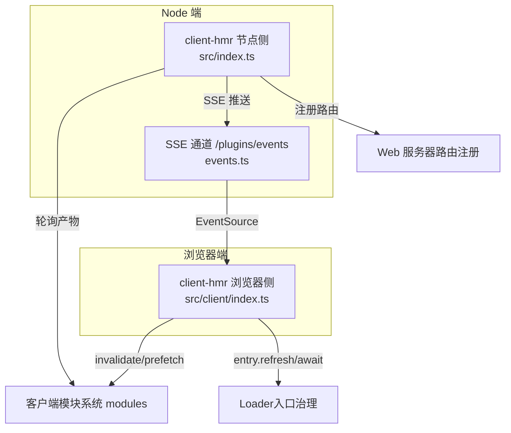
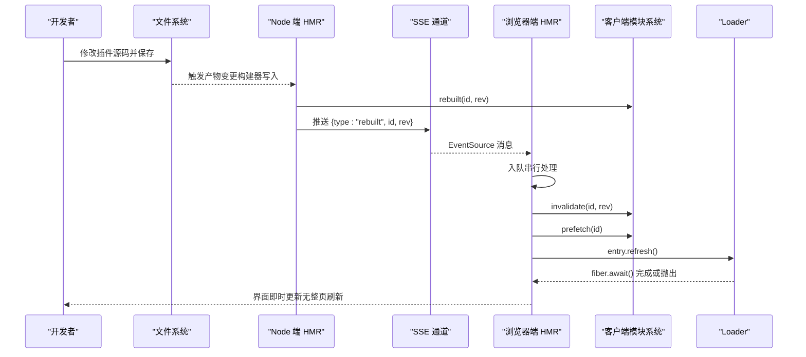
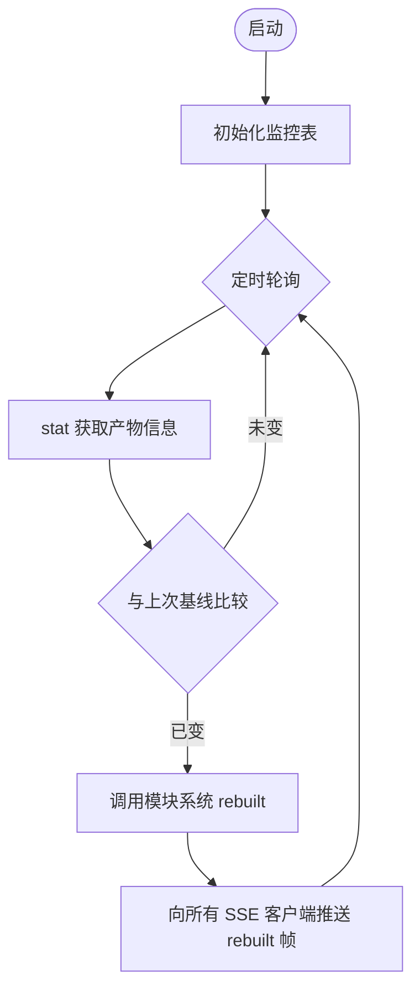
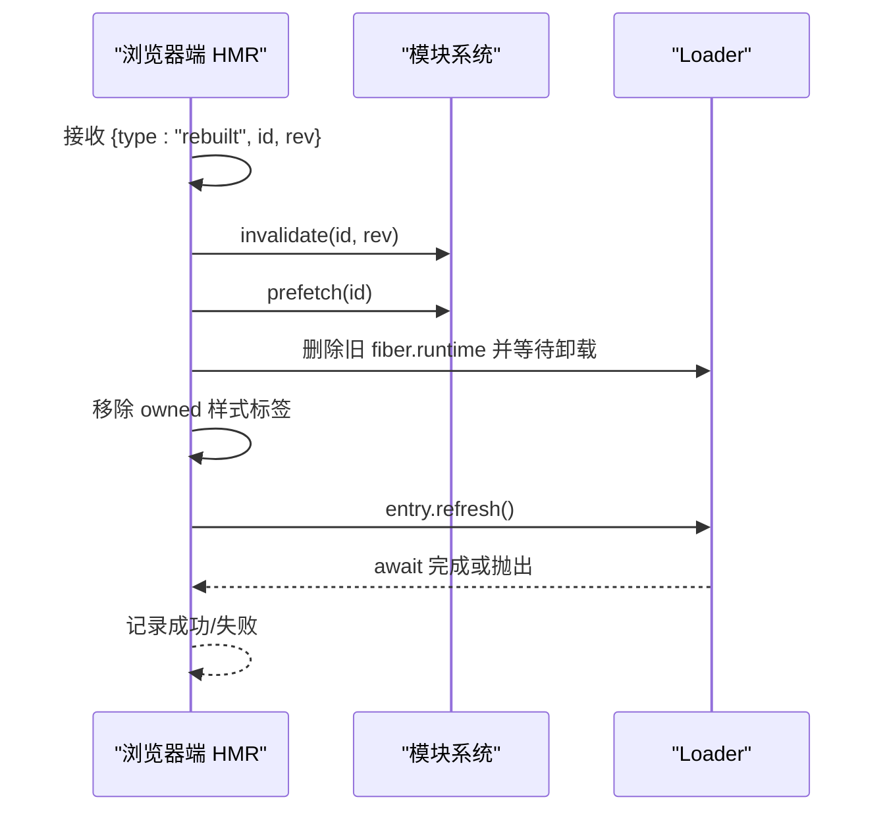
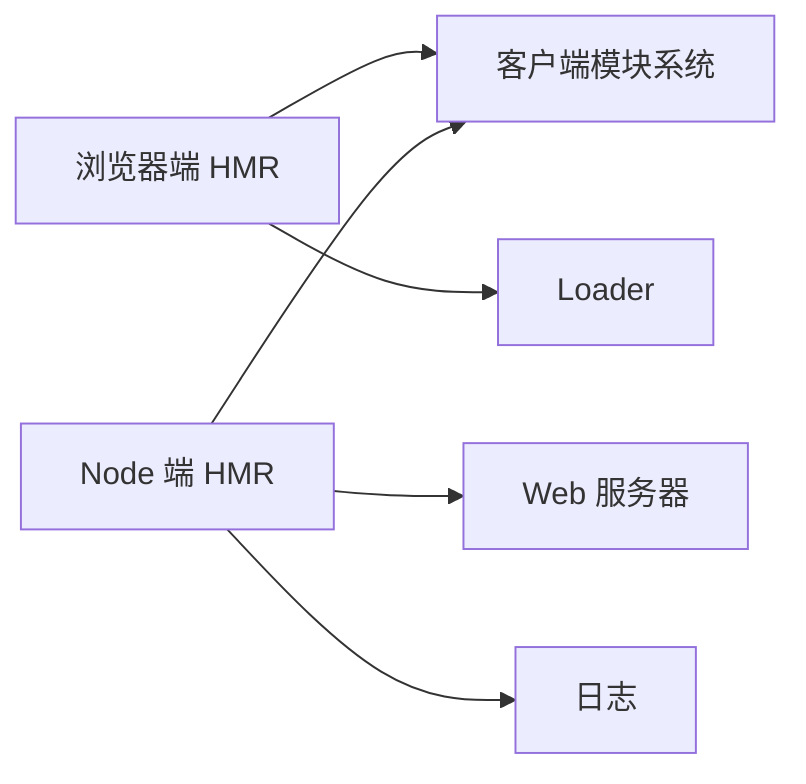

# 热重载机制

<cite>
**本文引用的文件**
- [packages/client/hmr/src/index.ts](file://packages/client/hmr/src/index.ts)
- [packages/client/hmr/src/client/index.ts](file://packages/client/hmr/src/client/index.ts)
- [packages/client/hmr/src/events.ts](file://packages/client/hmr/src/events.ts)
- [packages/client/hmr/README.md](file://packages/client/hmr/README.md)
- [docs/cordis-tutorial/06-composition-and-hmr.md](file://docs/cordis-tutorial/06-composition-and-hmr.md)
- [apps/cli/src/profile-boot.ts](file://apps/cli/src/profile-boot.ts)
- [packages/boot/app-boot/tests/hmr-config.spec.ts](file://packages/boot/app-boot/tests/hmr-config.spec.ts)
- [packages/boot/app-boot/tests/user-patches.spec.ts](file://packages/boot/app-boot/tests/user-patches.spec.ts)
- [packages/mcp/mcp-client/src/connection.ts](file://packages/mcp/mcp-client/src/connection.ts)
- [.agents/notes/implemented/feature/2026-08-06-mcp-client-auto-reconnect.md](file://.agents/notes/implemented/feature/2026-08-06-mcp-client-auto-reconnect.md)
</cite>

## 目录
1. [简介](#简介)
2. [项目结构](#项目结构)
3. [核心组件](#核心组件)
4. [架构总览](#架构总览)
5. [详细组件分析](#详细组件分析)
6. [依赖关系分析](#依赖关系分析)
7. [性能考量](#性能考量)
8. [故障排查指南](#故障排查指南)
9. [结论](#结论)
10. [附录](#附录)

## 简介
本文件系统性说明 DeepSeek Harness 的插件热重载（HMR）机制，覆盖 Node 端与浏览器端的完整链路：文件监听、变更检测、增量更新、模块热替换、状态保持与连接恢复、安全机制（验证、回滚策略、故障恢复）、开发体验优化（实时反馈、错误定位、调试支持），以及配置示例、限制与最佳实践。

## 项目结构
本项目将 HMR 拆分为两个协同部分：
- Node 端驱动：负责扫描客户端插件产物、检测变更并通过 SSE 推送事件。
- 浏览器端驱动：订阅 SSE，按序执行失效、预取、卸载旧实例、重新挂载新实例。

**图示来源**
- [packages/client/hmr/src/index.ts:68-201](file://packages/client/hmr/src/index.ts#L68-L201)
- [packages/client/hmr/src/client/index.ts:98-186](file://packages/client/hmr/src/client/index.ts#L98-L186)
- [packages/client/hmr/src/events.ts:1-45](file://packages/client/hmr/src/events.ts#L1-L45)

**章节来源**
- [packages/client/hmr/src/index.ts:1-202](file://packages/client/hmr/src/index.ts#L1-L202)
- [packages/client/hmr/src/client/index.ts:1-186](file://packages/client/hmr/src/client/index.ts#L1-L186)
- [packages/client/hmr/src/events.ts:1-45](file://packages/client/hmr/src/events.ts#L1-L45)

## 核心组件
- Node 端 HMR 驱动
  - 职责：对每个图条目对应的客户端产物进行 stat 轮询；当检测到内容变化时调用模块系统的 rebuilt 钩子；通过 HTTP 暴露 SSE 通道推送 graph 与 rebuilt 帧。
  - 关键行为：统计快照、去重比较、SSE 广播、路由注册与清理。
- 浏览器端 HMR 驱动
  - 职责：订阅 SSE；收到 rebuilt 后执行“失效→预取→卸载旧 fiber→清理样式→刷新并重新挂载”的原子序列；串行化队列避免并发冲突。
  - 关键行为：模块失效与预取、fiber 生命周期管理、样式标签清理、失败日志与可重试。
- 事件协议
  - 定义 graph/rebuilt 两种帧类型，并在两端共享类型与解析器，保证前后端契约一致。

**章节来源**
- [packages/client/hmr/src/index.ts:68-201](file://packages/client/hmr/src/index.ts#L68-L201)
- [packages/client/hmr/src/client/index.ts:98-186](file://packages/client/hmr/src/client/index.ts#L98-L186)
- [packages/client/hmr/src/events.ts:1-45](file://packages/client/hmr/src/events.ts#L1-L45)

## 架构总览
下图展示从文件变更到 UI 更新的端到端流程，包括 Node 端监听、SSE 推送、浏览器端串行化重载与 Loader/Cordis 集成。

**图示来源**
- [packages/client/hmr/src/index.ts:109-156](file://packages/client/hmr/src/index.ts#L109-L156)
- [packages/client/hmr/src/index.ts:158-201](file://packages/client/hmr/src/index.ts#L158-L201)
- [packages/client/hmr/src/client/index.ts:104-140](file://packages/client/hmr/src/client/index.ts#L104-L140)
- [packages/client/hmr/src/client/index.ts:142-186](file://packages/client/hmr/src/client/index.ts#L142-L186)

## 详细组件分析

### Node 端 HMR 驱动（src/index.ts）
- 文件监听与变更检测
  - 以固定间隔对每个图条目的客户端产物执行 stat 检查，对比 mtime/size 判断是否变化。
  - 首次启动时读取基线；后续仅对发生变化的条目触发重建通知。
- 增量更新与广播
  - 通过模块系统的 rebuilt 接口标记需要重建的条目。
  - 提供 /plugins/events SSE 端点，连接时发送初始 graph，随后推送 rebuilt 帧。
- 资源清理
  - 在 effect 中注册路由与定时器，并在 dispose 时取消订阅、关闭连接、清空监控表。

**图示来源**
- [packages/client/hmr/src/index.ts:72-156](file://packages/client/hmr/src/index.ts#L72-L156)
- [packages/client/hmr/src/index.ts:158-201](file://packages/client/hmr/src/index.ts#L158-L201)

**章节来源**
- [packages/client/hmr/src/index.ts:68-201](file://packages/client/hmr/src/index.ts#L68-L201)

### 浏览器端 HMR 驱动（src/client/index.ts）
- 事件订阅与解析
  - 使用 EventSource 订阅 /plugins/events，解析 JSON 帧并过滤未知类型。
- 串行化重载队列
  - 维护 Promise 链确保同一时间只有一个条目在执行重载，避免竞态。
- 模块热替换步骤
  - 先 invalidate 丢弃旧工厂与记录，再 prefetch 加载新工厂，然后卸载旧 fiber、清理样式、refresh 重新导入并挂载。
- 状态保持与连接恢复
  - 数据层（连接、运行时、Session）不受影响；仅重新执行插件 bundle 并重建组件状态。
- 失败策略
  - 不自动回滚；失败会记录日志，下一次 rebuilt 帧会重试。

**图示来源**
- [packages/client/hmr/src/client/index.ts:104-140](file://packages/client/hmr/src/client/index.ts#L104-L140)
- [packages/client/hmr/src/client/index.ts:142-186](file://packages/client/hmr/src/client/index.ts#L142-L186)

**章节来源**
- [packages/client/hmr/src/client/index.ts:1-186](file://packages/client/hmr/src/client/index.ts#L1-L186)

### 事件协议（src/events.ts）
- 帧类型
  - graph：连接时的一次性图快照。
  - rebuilt：单个条目重建通知，携带 id 与版本标识。
- 解析与容错
  - 严格校验字段类型，未知类型兼容忽略，非法帧记录警告。

**章节来源**
- [packages/client/hmr/src/events.ts:1-45](file://packages/client/hmr/src/events.ts#L1-L45)

### Cordis 插件级 HMR（教程与测试）
- 插件热重载能力由 @deepseek-ai/cordis-plugin-hmr 提供，配合 timer 做防抖，loader 实现基于 id 的 diff 与按需挂载/卸载。
- 配置文件编辑同样被监听，loader 根据 id 差异决定 mount/unmount/reconfigure。

**章节来源**
- [docs/cordis-tutorial/06-composition-and-hmr.md:23-63](file://docs/cordis-tutorial/06-composition-and-hmr.md#L23-L63)
- [packages/boot/app-boot/tests/hmr-config.spec.ts:12-24](file://packages/boot/app-boot/tests/hmr-config.spec.ts#L12-L24)

### 用户补丁层与配置热更新
- 应用层通过 watchUserPatches 监听用户补丁文件，结合 HMR 服务实现事务式热更新。
- 若缺少 HMR 服务或根 Include 行，会明确报错；失败会广播 hmr/config-update-failed 事件，且不会破坏现有配置。

**章节来源**
- [packages/boot/app-boot/tests/user-patches.spec.ts:346-372](file://packages/boot/app-boot/tests/user-patches.spec.ts#L346-L372)
- [packages/boot/app-boot/tests/user-patches.spec.ts:405-418](file://packages/boot/app-boot/tests/user-patches.spec.ts#L405-L418)

### 连接恢复与故障恢复（MCP 客户端）
- 当外部连接断开且重连策略启用时，采用有界退避重试；超过最大尝试次数则放弃并重试需手动 reload 或重启 Host。
- 该策略与 HMR 共同保障开发期稳定性：即使工具注册暂时不可用，也能在恢复后自动重建。

**章节来源**
- [packages/mcp/mcp-client/src/connection.ts:192-215](file://packages/mcp/mcp-client/src/connection.ts#L192-L215)
- [.agents/notes/implemented/feature/2026-08-06-mcp-client-auto-reconnect.md:43-49](file://.agents/notes/implemented/feature/2026-08-06-mcp-client-auto-reconnect.md#L43-L49)

## 依赖关系分析
- 浏览器端依赖
  - loader：入口治理与 fiber 生命周期。
  - modules：客户端模块系统，提供 invalidate/prefetch/graph/artifactBaseline 等能力。
  - webServer：用于注册 /plugins/events 路由（Node 端）。
- Node 端依赖
  - clientModules：获取图信息与制品基线，触发 rebuilt。
  - webServer：注册 SSE 路由。
  - logger：输出诊断信息。

**图示来源**
- [packages/client/hmr/src/client/index.ts:72-77](file://packages/client/hmr/src/client/index.ts#L72-L77)
- [packages/client/hmr/src/index.ts:24-38](file://packages/client/hmr/src/index.ts#L24-L38)

**章节来源**
- [packages/client/hmr/src/client/index.ts:72-77](file://packages/client/hmr/src/client/index.ts#L72-L77)
- [packages/client/hmr/src/index.ts:24-38](file://packages/client/hmr/src/index.ts#L24-L38)

## 性能考量
- 轮询间隔可调：Node 端默认 500ms，可通过 pollIntervalMs 调整，平衡响应速度与 CPU 占用。
- 增量检测：基于 mtime/size 的轻量比较，仅在变化时触发重建。
- 串行化队列：浏览器端串行执行重载，避免并发导致的模块状态不一致。
- 样式清理：在旧 fiber 卸载后、新代码注入前清理 owned 样式，避免重复注入与顺序问题。
- 自包含：HMR 自身也是图条目，可被重建；在流中切换不影响当前运行。

[本节为通用指导，无需特定文件引用]

## 故障排查指南
- 常见问题
  - 无 HMR 服务或未安装根 Include：用户补丁监听会直接报错，提示需要 HMR 服务与根 Include。
  - 配置更新失败：通过 hmr/config-update-failed 事件捕获失败原因，原有配置保持不变。
  - 连接丢失：MCP 客户端在策略启用时会指数退避重试；达到上限后需 reload 或重启 Host。
- 建议操作
  - 确认 dev 模式已开启，构建器正在重写客户端产物。
  - 检查 /plugins/events 是否能正常建立 SSE 连接。
  - 查看浏览器控制台与 Node 日志中的警告/错误，定位具体条目 id 与版本。
  - 对于持续失败的条目，等待下一次 rebuilt 帧自动重试。

**章节来源**
- [packages/boot/app-boot/tests/user-patches.spec.ts:405-418](file://packages/boot/app-boot/tests/user-patches.spec.ts#L405-L418)
- [packages/boot/app-boot/tests/hmr-config.spec.ts:171-202](file://packages/boot/app-boot/tests/hmr-config.spec.ts#L171-L202)
- [packages/mcp/mcp-client/src/connection.ts:192-215](file://packages/mcp/mcp-client/src/connection.ts#L192-L215)

## 结论
DeepSeek Harness 的 HMR 机制通过 Node 端产物轮询与浏览器端串行化重载，实现了插件级的热替换与快速迭代。其设计强调：
- 最小侵入：仅替换插件 fiber，保留数据层与连接状态。
- 强一致性：先失效再预取，再卸载旧实例并刷新新实例。
- 可观测与可恢复：明确的日志、事件与失败策略，便于开发与排障。
在生产环境中，若无构建器重写产物，HMR 将保持空闲，不影响运行。

[本节为总结性内容，无需特定文件引用]

## 附录

### 启用与配置示例
- 在 Cordis 配置中加入 HMR 插件并指定 root：
  - 参考教程中的 cordis.yml 片段，添加 logger、timer、hmr 与目标插件条目。
  - 通过 timer 提供防抖能力，避免频繁重载。
- 浏览器端 HMR 配置：
  - 通过 pollIntervalMs 控制轮询间隔；默认 500ms。
  - 在 dev:web 模式下，构建器重写产物后浏览器自动热替换。

**章节来源**
- [docs/cordis-tutorial/06-composition-and-hmr.md:27-42](file://docs/cordis-tutorial/06-composition-and-hmr.md#L27-L42)
- [packages/client/hmr/README.md:38-44](file://packages/client/hmr/README.md#L38-L44)

### 安全机制
- 代码验证：SSE 帧在浏览器端进行严格解析，未知类型忽略，非法帧记录警告。
- 回滚策略：不自动回滚；失败条目保持 FAILED 或 fiberless，下次重建帧重试。
- 故障恢复：MCP 客户端具备有界退避的重连策略；HMR 在失败后仍可继续工作。

**章节来源**
- [packages/client/hmr/src/events.ts:21-41](file://packages/client/hmr/src/events.ts#L21-L41)
- [packages/client/hmr/src/client/index.ts:60-63](file://packages/client/hmr/src/client/index.ts#L60-L63)
- [packages/mcp/mcp-client/src/connection.ts:192-215](file://packages/mcp/mcp-client/src/connection.ts#L192-L215)

### 开发体验优化
- 实时反馈：SSE 推送 graph/rebuilt，浏览器即时更新 UI。
- 错误定位：日志包含条目 id、版本与错误堆栈；配置更新失败通过事件上报。
- 调试支持：通过 Cordis 注册表与 fiber 状态诊断 PENDING/ACTIVE/FAILED 等状态。

**章节来源**
- [packages/client/hmr/src/index.ts:158-201](file://packages/client/hmr/src/index.ts#L158-L201)
- [packages/client/hmr/src/client/index.ts:142-186](file://packages/client/hmr/src/client/index.ts#L142-L186)
- [docs/cordis-tutorial/06-composition-and-hmr.md:61-110](file://docs/cordis-tutorial/06-composition-and-hmr.md#L61-L110)

### 限制与最佳实践
- 限制
  - 重载粒度较粗：每次重载重建 fiber 与组件状态，数据层不变。
  - 无失败回滚：失败条目需等待下一次重建帧重试。
  - 重建帧不替换启动图：页面重载才会重新组合启动图。
- 最佳实践
  - 合理设置轮询间隔，避免过高 CPU 占用。
  - 使用稳定 id 标识条目，确保 loader 能正确 diff。
  - 在开发环境启用 HMR，生产环境保持空闲。
  - 关注 hmr/config-update-failed 事件，及时修复配置。

**章节来源**
- [packages/client/hmr/README.md:109-119](file://packages/client/hmr/README.md#L109-L119)
- [docs/cordis-tutorial/06-composition-and-hmr.md:59-63](file://docs/cordis-tutorial/06-composition-and-hmr.md#L59-L63)