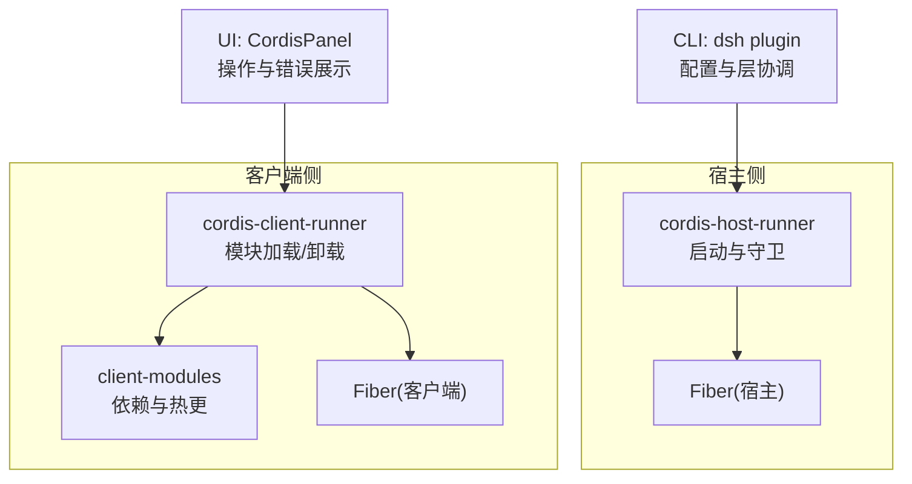
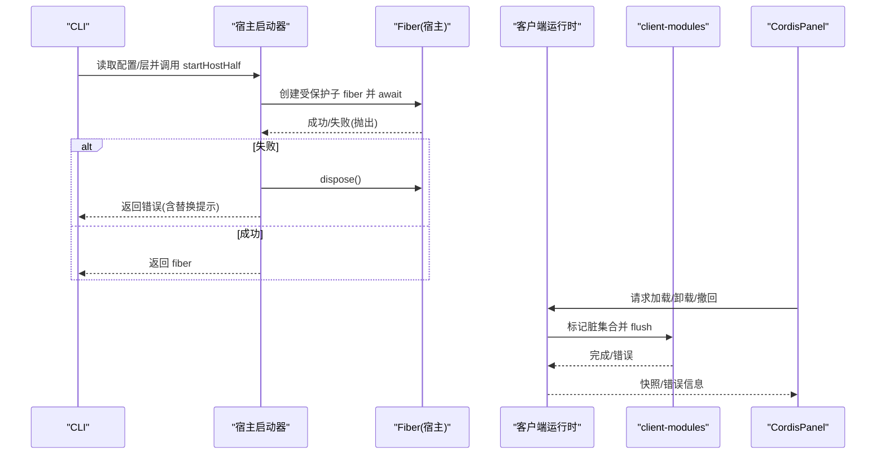
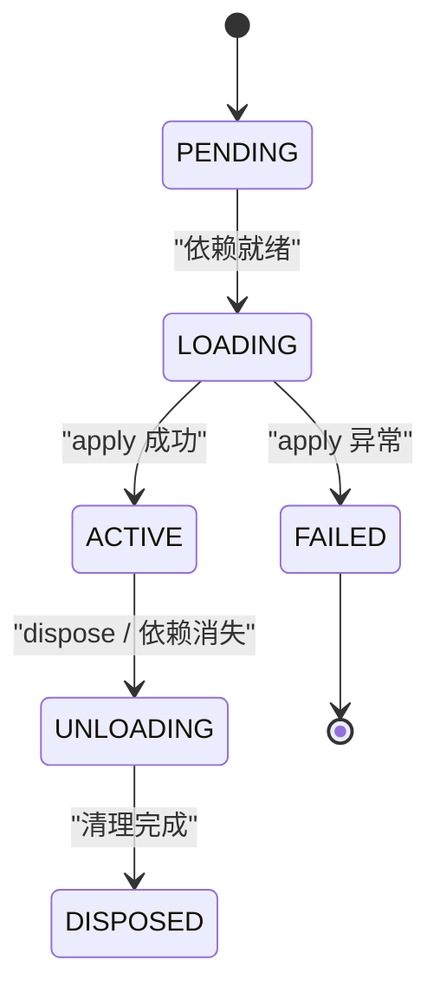
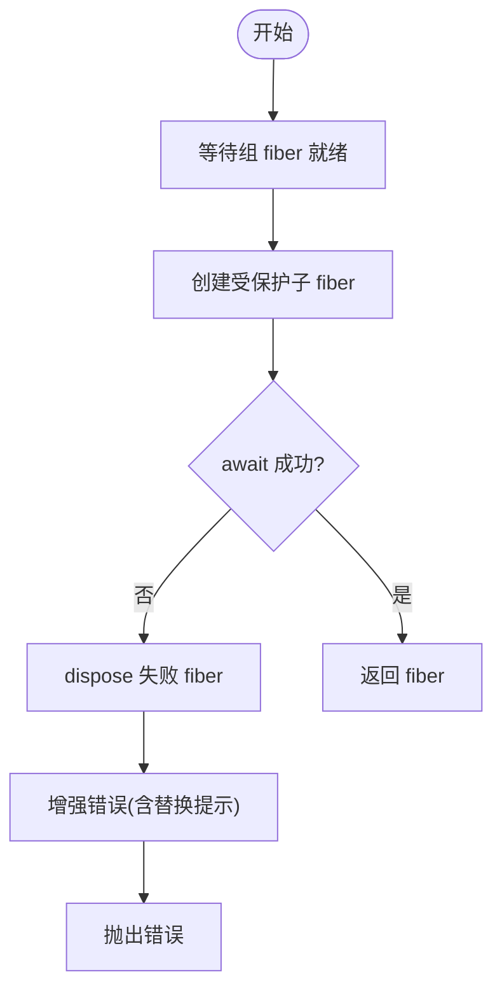
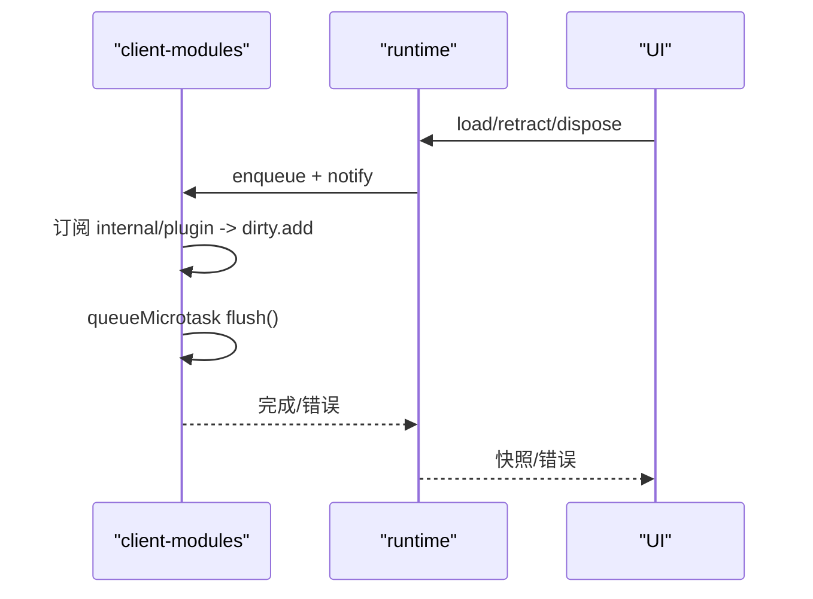
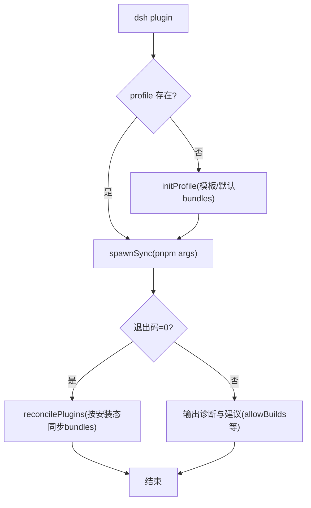
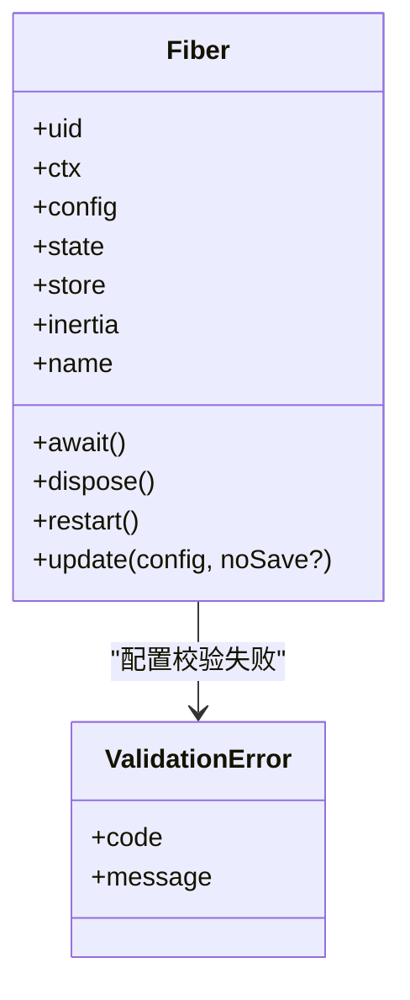
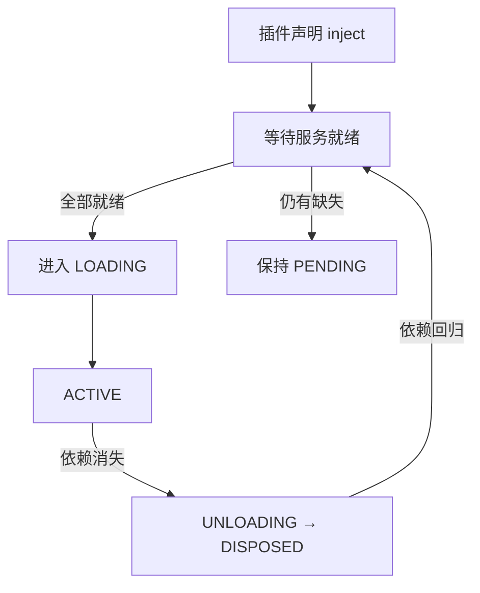
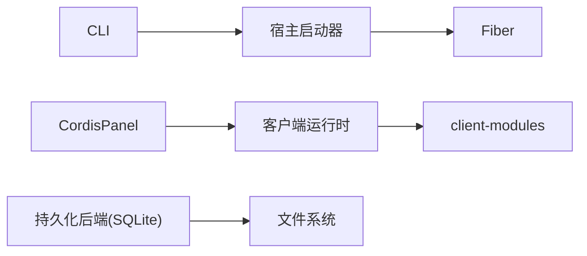

# 生命周期管理

<cite>
**本文引用的文件**
- [packages/extensions/cordis-host-runner/src/lifecycle.ts](file://packages/extensions/cordis-host-runner/src/lifecycle.ts)
- [apps/cli/src/plugin.ts](file://apps/cli/src/plugin.ts)
- [docs/user/develop/framework/index.md](file://docs/user/develop/framework/index.md)
- [docs/cordis-api/fiber.zh.md](file://docs/cordis-api/fiber.zh.md)
- [packages/extensions/ui-cordis/src/client/CordisPanel.tsx](file://packages/extensions/ui-cordis/src/client/CordisPanel.tsx)
- [packages/extensions/cordis-client-runner/src/client/runtime.ts](file://packages/extensions/cordis-client-runner/src/client/runtime.ts)
- [packages/client/modules/src/index.ts](file://packages/client/modules/src/index.ts)
- [packages/api/session-controller/src/client/sessions/manager.ts](file://packages/api/session-controller/src/client/sessions/manager.ts)
- [packages/session/session-persistence-sqlite/src/schema.ts](file://packages/session/session-persistence-sqlite/src/schema.ts)
</cite>

## 目录
1. [简介](#简介)
2. [项目结构](#项目结构)
3. [核心组件](#核心组件)
4. [架构总览](#架构总览)
5. [详细组件分析](#详细组件分析)
6. [依赖关系分析](#依赖关系分析)
7. [性能考量](#性能考量)
8. [故障排查指南](#故障排查指南)
9. [结论](#结论)
10. [附录](#附录)

## 简介
本文件面向 DeepSeek Harness 的插件生命周期管理，围绕“发现、加载、验证、初始化、运行、销毁”六个阶段，系统阐述触发条件、执行逻辑、错误处理与恢复机制；说明状态管理与持久化迁移；描述插件间依赖与加载顺序控制；并提供自定义生命周期钩子的实现指引；最后给出性能监控与资源管理（内存、连接池、垃圾回收）的实践建议。

## 项目结构
DeepSeek Harness 将插件生命周期能力拆分为宿主侧与客户端侧两套运行时：
- 宿主侧：通过 cordis-host-runner 提供受保护的启动流程、失败隔离与缺失服务探测。
- 客户端侧：通过 cordis-client-runner 与 client modules 完成模块级依赖管理、热更新与卸载。
- CLI：负责配置文件与包清单的协调，确保插件层按安装状态正确加入构建层。
- Fiber 抽象：统一的状态机、作用域、清理与重启能力，贯穿宿主与客户端。

图表来源
- [packages/extensions/cordis-host-runner/src/lifecycle.ts:1-58](file://packages/extensions/cordis-host-runner/src/lifecycle.ts#L1-L58)
- [packages/extensions/cordis-client-runner/src/client/runtime.ts:303-331](file://packages/extensions/cordis-client-runner/src/client/runtime.ts#L303-L331)
- [packages/client/modules/src/index.ts:553-583](file://packages/client/modules/src/index.ts#L553-L583)
- [apps/cli/src/plugin.ts:120-164](file://apps/cli/src/plugin.ts#L120-L164)
- [packages/extensions/ui-cordis/src/client/CordisPanel.tsx:179-207](file://packages/extensions/ui-cordis/src/client/CordisPanel.tsx#L179-L207)

章节来源
- [packages/extensions/cordis-host-runner/src/lifecycle.ts:1-58](file://packages/extensions/cordis-host-runner/src/lifecycle.ts#L1-L58)
- [packages/extensions/cordis-client-runner/src/client/runtime.ts:303-331](file://packages/extensions/cordis-client-runner/src/client/runtime.ts#L303-L331)
- [packages/client/modules/src/index.ts:553-583](file://packages/client/modules/src/index.ts#L553-L583)
- [apps/cli/src/plugin.ts:120-164](file://apps/cli/src/plugin.ts#L120-L164)
- [packages/extensions/ui-cordis/src/client/CordisPanel.tsx:179-207](file://packages/extensions/ui-cordis/src/client/CordisPanel.tsx#L179-L207)

## 核心组件
- Fiber（插件实例与作用域）：承载生命周期状态、已校验配置、注册的作用与清理。支持 await、dispose、restart、update 等关键操作。
- 宿主启动器（startHostHalf）：在组 fiber 下创建受保护子 fiber，捕获启动异常并安全卸载，避免失败 fiber 残留。
- 客户端运行时（retract/dispose）：按插件 ID 与运行 ID 精确卸载，或整体销毁所有插件。
- 客户端模块编排（client modules）：监听内部事件、增量组装、批量刷新，保证新 fiber 到达时能进入同一脏集合并触发重编译。
- CLI 插件协调：根据安装状态维护 bundles 层列表，自动纳入/移除声明了 bundle 的依赖。
- UI 面板：对插件操作进行排队、错误收集与刷新反馈。

章节来源
- [docs/cordis-api/fiber.zh.md:82-146](file://docs/cordis-api/fiber.zh.md#L82-L146)
- [packages/extensions/cordis-host-runner/src/lifecycle.ts:14-57](file://packages/extensions/cordis-host-runner/src/lifecycle.ts#L14-L57)
- [packages/extensions/cordis-client-runner/src/client/runtime.ts:303-331](file://packages/extensions/cordis-client-runner/src/client/runtime.ts#L303-L331)
- [packages/client/modules/src/index.ts:553-583](file://packages/client/modules/src/index.ts#L553-L583)
- [apps/cli/src/plugin.ts:47-91](file://apps/cli/src/plugin.ts#L47-L91)
- [packages/extensions/ui-cordis/src/client/CordisPanel.tsx:179-207](file://packages/extensions/ui-cordis/src/client/CordisPanel.tsx#L179-L207)

## 架构总览
下图展示了插件从发现到销毁的关键路径，以及宿主与客户端的协作方式。

图表来源
- [packages/extensions/cordis-host-runner/src/lifecycle.ts:22-45](file://packages/extensions/cordis-host-runner/src/lifecycle.ts#L22-L45)
- [packages/extensions/cordis-client-runner/src/client/runtime.ts:303-331](file://packages/extensions/cordis-client-runner/src/client/runtime.ts#L303-L331)
- [packages/client/modules/src/index.ts:553-583](file://packages/client/modules/src/index.ts#L553-L583)
- [packages/extensions/ui-cordis/src/client/CordisPanel.tsx:179-207](file://packages/extensions/ui-cordis/src/client/CordisPanel.tsx#L179-L207)
- [apps/cli/src/plugin.ts:120-164](file://apps/cli/src/plugin.ts#L120-L164)

## 详细组件分析

### 插件生命周期阶段与状态机
- 阶段划分
  - 发现：CLI 扫描依赖并识别可加入层的 bundle；客户端监听 internal/plugin 事件以感知新 fiber。
  - 加载：宿主侧通过 startHostHalf 创建受保护 fiber；客户端通过 runtime.load/retract 驱动模块加载与热更。
  - 验证：Fiber.config 由标准 schema 校验，失败抛 ValidationError。
  - 初始化：apply 执行，ctx.effect 注册资源与清理；inject 声明的服务就绪后才进入 ACTIVE。
  - 运行：ACTIVE 状态下响应事件、工具调用与服务交互。
  - 销毁：fiber.dispose 递归卸载子 fiber，按逆序并发执行异步清理，最终 DISPOSED。
- 状态机
  - PENDING → LOADING → ACTIVE
  - LOADING 失败 → FAILED
  - ACTIVE → UNLOADING → DISPOSED
  - 依赖消失时自动回退至 DISPOSED，待依赖回归后重新激活。

图表来源
- [docs/user/develop/framework/index.md:7-38](file://docs/user/develop/framework/index.md#L7-L38)
- [docs/cordis-api/fiber.zh.md:93-133](file://docs/cordis-api/fiber.zh.md#L93-L133)

章节来源
- [docs/user/develop/framework/index.md:7-63](file://docs/user/develop/framework/index.md#L7-L63)
- [docs/cordis-api/fiber.zh.md:82-146](file://docs/cordis-api/fiber.zh.md#L82-L146)

### 宿主侧启动与守卫（startHostHalf）
- 触发条件：CLI 或上层编排器需要启动一个动态插件。
- 执行逻辑：
  - 等待组 fiber 就绪。
  - 使用 guardedPlugin 包装插件，捕获宿主守卫拒绝。
  - await fiber.await 等待稳定状态；若失败则立即 dispose 并返回增强错误（包含“先停止旧版本再替换”的提示）。
- 错误处理：
  - 启动冲突（名称重复）会给出明确替换步骤。
  - 其他异常原样抛出，便于上层重试或降级。
- 恢复机制：
  - 失败 fiber 不会残留；注入未满足的服务仍保持 PENDING，待服务出现后自动激活。

图表来源
- [packages/extensions/cordis-host-runner/src/lifecycle.ts:22-45](file://packages/extensions/cordis-host-runner/src/lifecycle.ts#L22-L45)

章节来源
- [packages/extensions/cordis-host-runner/src/lifecycle.ts:14-57](file://packages/extensions/cordis-host-runner/src/lifecycle.ts#L14-L57)

### 客户端侧加载、热更与卸载
- 加载与热更：
  - 监听 internal/plugin 事件，将 entry 加入脏集合，微任务批量 flush 组合。
  - 组合失败聚合为 ClientPackageCompositionError。
- 卸载与撤回：
  - retract(pluginId, pluginRunId)：仅卸载指定运行实例，较新的运行不受影响。
  - dispose()：停止监听，逐个 teardown 所有 live 插件，通知变更。
- 错误与恢复：
  - 卸载过程幂等且可并发；notify 清空缓存并广播变更，使 UI 与消费者可见最新状态。

图表来源
- [packages/client/modules/src/index.ts:553-583](file://packages/client/modules/src/index.ts#L553-L583)
- [packages/extensions/cordis-client-runner/src/client/runtime.ts:303-331](file://packages/extensions/cordis-client-runner/src/client/runtime.ts#L303-L331)
- [packages/extensions/ui-cordis/src/client/CordisPanel.tsx:179-207](file://packages/extensions/ui-cordis/src/client/CordisPanel.tsx#L179-L207)

章节来源
- [packages/client/modules/src/index.ts:553-583](file://packages/client/modules/src/index.ts#L553-L583)
- [packages/extensions/cordis-client-runner/src/client/runtime.ts:303-331](file://packages/extensions/cordis-client-runner/src/client/runtime.ts#L303-L331)
- [packages/extensions/ui-cordis/src/client/CordisPanel.tsx:179-207](file://packages/extensions/ui-cordis/src/client/CordisPanel.tsx#L179-L207)

### CLI 插件层协调
- 触发条件：用户执行 dsh plugin 命令。
- 执行逻辑：
  - 首次使用初始化 profile。
  - 转发 pnpm 参数并执行安装/更新。
  - 根据实际安装结果 reconcile bundles 列表：新增的 bundle 自动加入层；不再声明 bundle 的依赖移出层。
- 错误处理：
  - pnpm 未找到给出安装提示。
  - git 依赖 prepare 被阻止时给出 allowBuilds 配置指引。

图表来源
- [apps/cli/src/plugin.ts:120-164](file://apps/cli/src/plugin.ts#L120-L164)
- [apps/cli/src/plugin.ts:47-91](file://apps/cli/src/plugin.ts#L47-L91)

章节来源
- [apps/cli/src/plugin.ts:47-91](file://apps/cli/src/plugin.ts#L47-L91)
- [apps/cli/src/plugin.ts:120-164](file://apps/cli/src/plugin.ts#L120-L164)

### 状态管理、持久化与恢复
- 状态快照：
  - Fiber.store 保存加载期间所需服务实现的快照，用于诊断与一致性检查。
  - Fiber.state 暴露当前生命周期状态，转换时发出 internal/status。
- 配置校验与更新：
  - Fiber.update 先校验新配置，再运行 internal/update 瀑布式钩子，允许拦截或替换重启。
  - 校验失败抛 ValidationError，可在上层捕获并决定是否中止。
- 持久化与迁移：
  - 会话持久化后端在连接建立时强制安全设置（如关闭 mmap/trusted-schema），不兼容即报错，防止数据损坏。
  - 协调器构造时对写入延迟、缓存大小等参数做严格校验，保障稳定性。

图表来源
- [docs/cordis-api/fiber.zh.md:82-146](file://docs/cordis-api/fiber.zh.md#L82-L146)
- [docs/cordis-api/fiber.zh.md:359-378](file://docs/cordis-api/fiber.zh.md#L359-L378)
- [packages/session/session-persistence-sqlite/src/schema.ts:91-105](file://packages/session/session-persistence-sqlite/src/schema.ts#L91-L105)

章节来源
- [docs/cordis-api/fiber.zh.md:82-146](file://docs/cordis-api/fiber.zh.md#L82-L146)
- [docs/cordis-api/fiber.zh.md:359-378](file://docs/cordis-api/fiber.zh.md#L359-L378)
- [packages/session/session-persistence-sqlite/src/schema.ts:91-105](file://packages/session/session-persistence-sqlite/src/schema.ts#L91-L105)

### 依赖关系管理与加载顺序
- 依赖驱动加载：
  - 插件通过 inject 声明强依赖，框架等待所有服务就绪后再进入 LOADING。
  - 若依赖在服务替换期间消失，插件自动 UNLOADING→DISPOSED，并在依赖回归后重新激活。
- 宿主侧缺失服务检测：
  - missingServices(ctx, fiber) 返回尚未就绪的服务名列表，便于上层诊断与提示。
- 客户端侧依赖图：
  - client-modules 基于 loader.entries() 初始扫描，后续通过 internal/plugin 增量更新，保证新 fiber 进入同一批处理。

图表来源
- [docs/user/develop/framework/index.md:26-38](file://docs/user/develop/framework/index.md#L26-L38)
- [packages/extensions/cordis-host-runner/src/lifecycle.ts:47-57](file://packages/extensions/cordis-host-runner/src/lifecycle.ts#L47-L57)
- [packages/client/modules/src/index.ts:553-583](file://packages/client/modules/src/index.ts#L553-L583)

章节来源
- [docs/user/develop/framework/index.md:26-38](file://docs/user/develop/framework/index.md#L26-L38)
- [packages/extensions/cordis-host-runner/src/lifecycle.ts:47-57](file://packages/extensions/cordis-host-runner/src/lifecycle.ts#L47-L57)
- [packages/client/modules/src/index.ts:553-583](file://packages/client/modules/src/index.ts#L553-L583)

### 自定义生命周期钩子示例（前置检查、后置处理、异常处理）
- 前置检查（在 apply 之前）：
  - 通过 update 的 internal/update 瀑布钩子拦截配置变更，必要时否决重启。
  - 参考路径：[docs/cordis-api/fiber.zh.md:250-276](file://docs/cordis-api/fiber.zh.md#L250-L276)
- 后置处理（在 apply 之后）：
  - 使用 ctx.effect 注册资源与清理函数，确保卸载时按逆序释放。
  - 参考路径：[docs/user/develop/framework/index.md:40-63](file://docs/user/develop/framework/index.md#L40-L63)
- 异常处理：
  - 宿主侧捕获启动异常并增强错误提示；客户端侧聚合组合错误并上报 UI。
  - 参考路径：
    - [packages/extensions/cordis-host-runner/src/lifecycle.ts:22-45](file://packages/extensions/cordis-host-runner/src/lifecycle.ts#L22-L45)
    - [packages/client/modules/src/index.ts:553-583](file://packages/client/modules/src/index.ts#L553-L583)
    - [packages/extensions/ui-cordis/src/client/CordisPanel.tsx:179-207](file://packages/extensions/ui-cordis/src/client/CordisPanel.tsx#L179-L207)

章节来源
- [docs/cordis-api/fiber.zh.md:250-276](file://docs/cordis-api/fiber.zh.md#L250-L276)
- [docs/user/develop/framework/index.md:40-63](file://docs/user/develop/framework/index.md#L40-L63)
- [packages/extensions/cordis-host-runner/src/lifecycle.ts:22-45](file://packages/extensions/cordis-host-runner/src/lifecycle.ts#L22-L45)
- [packages/client/modules/src/index.ts:553-583](file://packages/client/modules/src/index.ts#L553-L583)
- [packages/extensions/ui-cordis/src/client/CordisPanel.tsx:179-207](file://packages/extensions/ui-cordis/src/client/CordisPanel.tsx#L179-L207)

## 依赖关系分析
- 组件耦合：
  - 宿主启动器依赖 Fiber 与 guardedPlugin，低耦合高内聚。
  - 客户端运行时与 client-modules 通过事件与队列解耦，支持并发与幂等。
  - CLI 与宿主/客户端无直接耦合，通过配置与层清单间接协作。
- 外部依赖：
  - Node 进程与 pnpm（CLI）。
  - SQLite 连接安全配置（持久化后端）。
- 循环依赖：
  - 通过 internal/* 事件与队列缓冲避免直接循环引用。

图表来源
- [apps/cli/src/plugin.ts:120-164](file://apps/cli/src/plugin.ts#L120-L164)
- [packages/extensions/cordis-host-runner/src/lifecycle.ts:22-45](file://packages/extensions/cordis-host-runner/src/lifecycle.ts#L22-L45)
- [packages/extensions/cordis-client-runner/src/client/runtime.ts:303-331](file://packages/extensions/cordis-client-runner/src/client/runtime.ts#L303-L331)
- [packages/client/modules/src/index.ts:553-583](file://packages/client/modules/src/index.ts#L553-L583)
- [packages/session/session-persistence-sqlite/src/schema.ts:91-105](file://packages/session/session-persistence-sqlite/src/schema.ts#L91-L105)

章节来源
- [apps/cli/src/plugin.ts:120-164](file://apps/cli/src/plugin.ts#L120-L164)
- [packages/extensions/cordis-host-runner/src/lifecycle.ts:22-45](file://packages/extensions/cordis-host-runner/src/lifecycle.ts#L22-L45)
- [packages/extensions/cordis-client-runner/src/client/runtime.ts:303-331](file://packages/extensions/cordis-client-runner/src/client/runtime.ts#L303-L331)
- [packages/client/modules/src/index.ts:553-583](file://packages/client/modules/src/index.ts#L553-L583)
- [packages/session/session-persistence-sqlite/src/schema.ts:91-105](file://packages/session/session-persistence-sqlite/src/schema.ts#L91-L105)

## 性能考量
- 内存使用优化
  - 使用 ctx.effect 集中管理资源，确保卸载时及时释放，避免悬挂引用导致 GC 无法回收。
  - 客户端模块采用增量 flush 与微任务批处理，减少频繁重组带来的峰值内存。
- 连接池管理
  - 持久化后端在连接建立时强制安全设置，避免 mmap/trusted-schema 等高风险特性；连接关闭时由 effect 统一释放。
  - 会话管理器在 dispose 中并发 drain 所有 Session 的 teardown，避免阻塞主线程。
- 垃圾回收策略
  - 避免在插件中持有全局或闭包长生命周期引用；尽量使用 fiber 作用域内的临时对象。
  - 对大对象（如图片、历史片段）在 effect 中显式释放，或在达到阈值时主动 compact。
- 监控与观测
  - 利用 Fiber.getEffects 获取作用元数据，结合日志与指标统计各阶段的耗时与失败率。
  - 在 UI 层记录操作错误与状态变化，辅助定位性能瓶颈。

章节来源
- [docs/user/develop/framework/index.md:40-63](file://docs/user/develop/framework/index.md#L40-L63)
- [packages/session/session-persistence-sqlite/src/schema.ts:91-105](file://packages/session/session-persistence-sqlite/src/schema.ts#L91-L105)
- [packages/api/session-controller/src/client/sessions/manager.ts:248-277](file://packages/api/session-controller/src/client/sessions/manager.ts#L248-L277)
- [docs/cordis-api/fiber.zh.md:197-212](file://docs/cordis-api/fiber.zh.md#L197-L212)

## 故障排查指南
- 启动阶段
  - 名称重复：宿主启动器会提示先停止旧版本再替换新版本。
  - 依赖缺失：使用 missingServices 列出未就绪服务，确认服务提供者是否已注册。
- 配置与更新
  - 配置校验失败：捕获 ValidationError，查看 schema 问题并修正。
  - 更新被拦截：检查 internal/update 钩子是否否决了重启。
- 客户端侧
  - 组合失败：ClientPackageCompositionError 聚合多个模块错误，逐一修复。
  - 卸载不生效：确认插件运行 ID 匹配；retract 仅卸载指定 runId。
- 持久化
  - SQLite 安全设置不兼容：检查数据库文件是否保留了不安全设置，必要时重建。
  - 写入延迟过大：调整 writeBatchMaxDelayMs 与 preparedSessionCacheSize。

章节来源
- [packages/extensions/cordis-host-runner/src/lifecycle.ts:22-45](file://packages/extensions/cordis-host-runner/src/lifecycle.ts#L22-L45)
- [packages/extensions/cordis-host-runner/src/lifecycle.ts:47-57](file://packages/extensions/cordis-host-runner/src/lifecycle.ts#L47-L57)
- [docs/cordis-api/fiber.zh.md:250-276](file://docs/cordis-api/fiber.zh.md#L250-L276)
- [packages/client/modules/src/index.ts:553-583](file://packages/client/modules/src/index.ts#L553-L583)
- [packages/extensions/cordis-client-runner/src/client/runtime.ts:303-331](file://packages/extensions/cordis-client-runner/src/client/runtime.ts#L303-L331)
- [packages/session/session-persistence-sqlite/src/schema.ts:91-105](file://packages/session/session-persistence-sqlite/src/schema.ts#L91-L105)

## 结论
DeepSeek Harness 通过 Fiber 统一了插件的生命周期语义，配合宿主与客户端两套运行时实现了安全的启动、依赖驱动的加载、可靠的卸载与热更新。CLI 与 UI 提供了易用的配置与操作界面。借助 effect 与事件机制，插件可以优雅地管理资源与副作用。在生产环境中，应重视配置校验、依赖就绪、错误增强与资源释放，以获得稳定、可观测、高性能的插件生态。

## 附录
- 常用 API 参考
  - Fiber.await / dispose / restart / update：见 [docs/cordis-api/fiber.zh.md:214-276](file://docs/cordis-api/fiber.zh.md#L214-L276)
  - ctx.effect：见 [docs/user/develop/framework/index.md:40-63](file://docs/user/develop/framework/index.md#L40-L63)
  - missingServices：见 [packages/extensions/cordis-host-runner/src/lifecycle.ts:47-57](file://packages/extensions/cordis-host-runner/src/lifecycle.ts#L47-L57)
  - 客户端 retract/dispose：见 [packages/extensions/cordis-client-runner/src/client/runtime.ts:303-331](file://packages/extensions/cordis-client-runner/src/client/runtime.ts#L303-L331)
  - CLI 协调：见 [apps/cli/src/plugin.ts:120-164](file://apps/cli/src/plugin.ts#L120-L164)