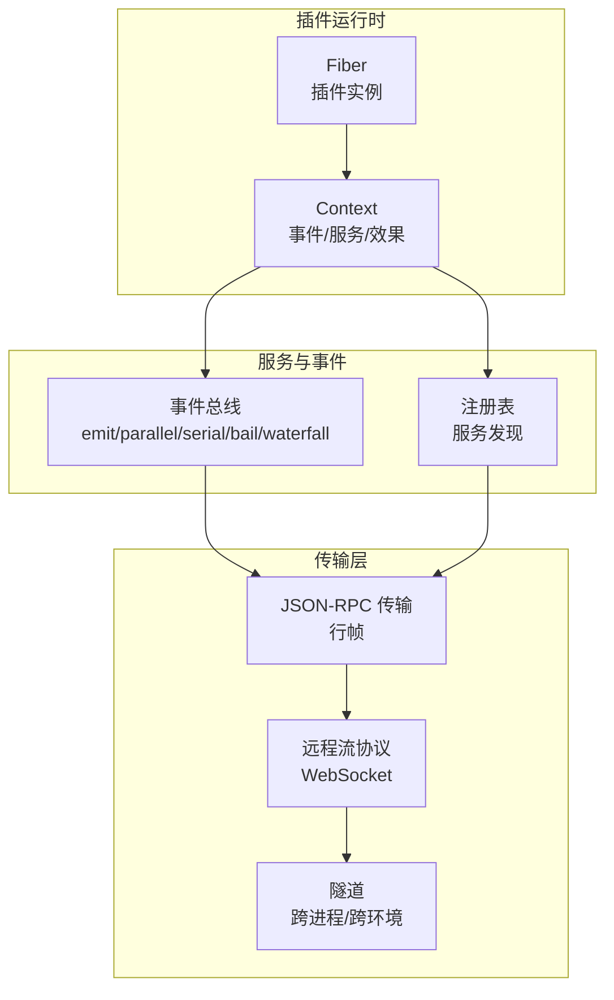
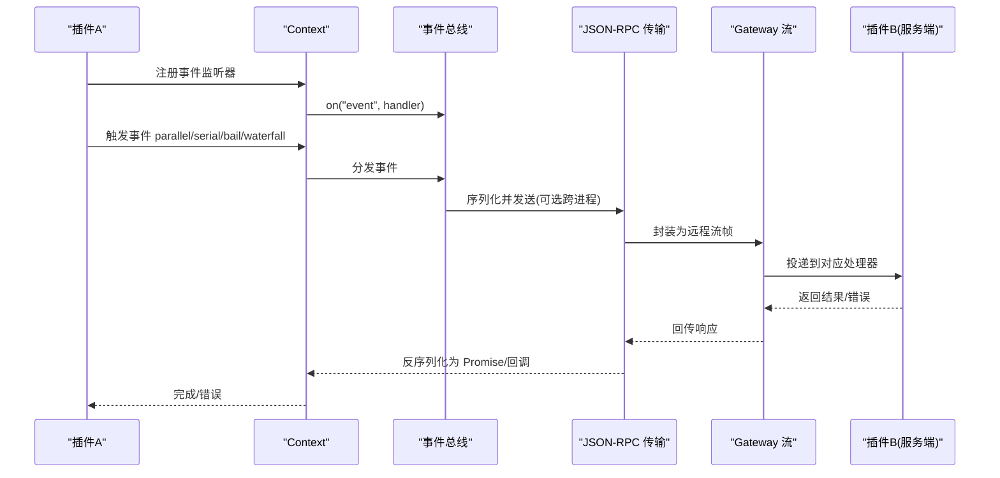
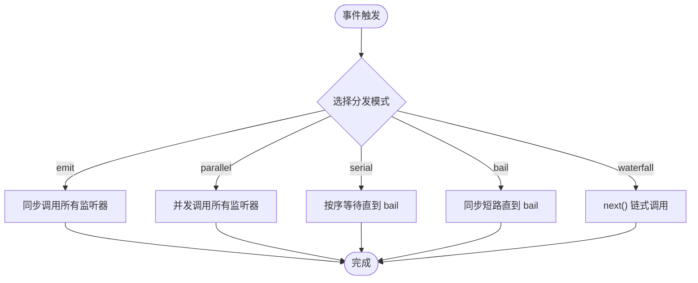
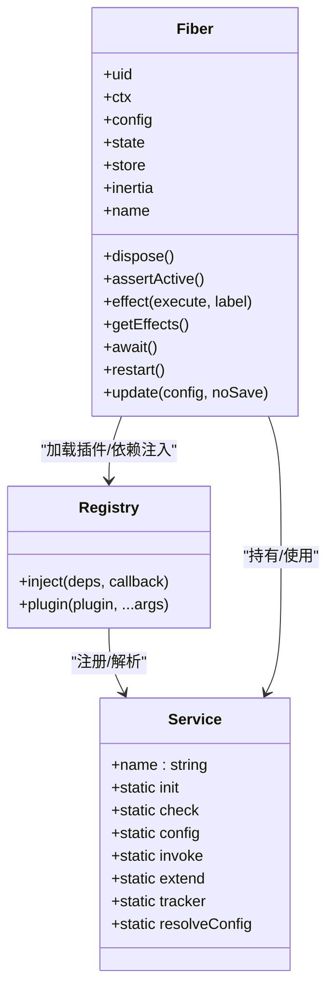
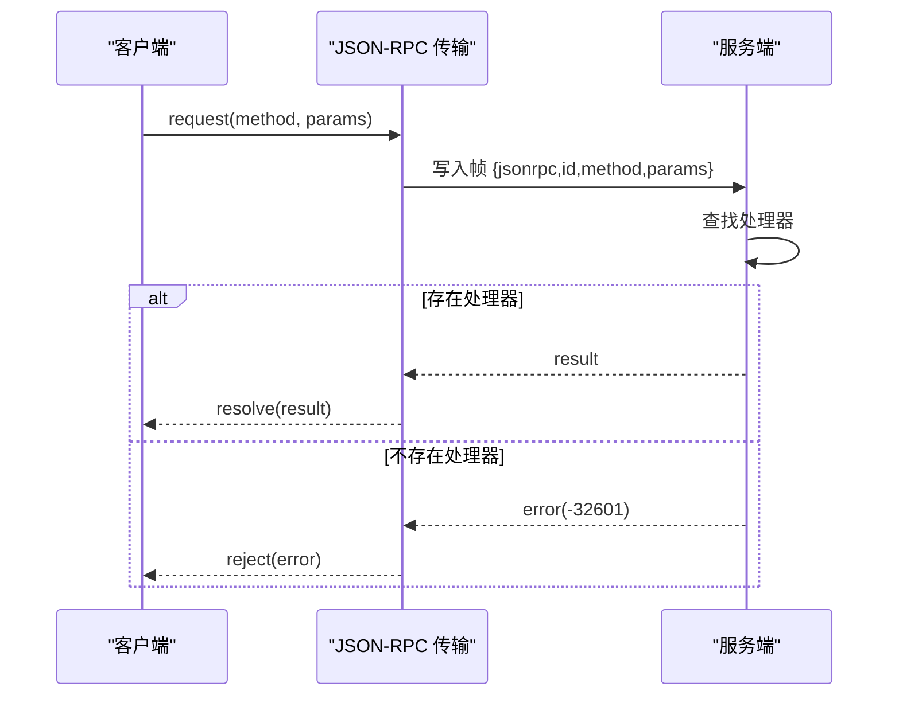
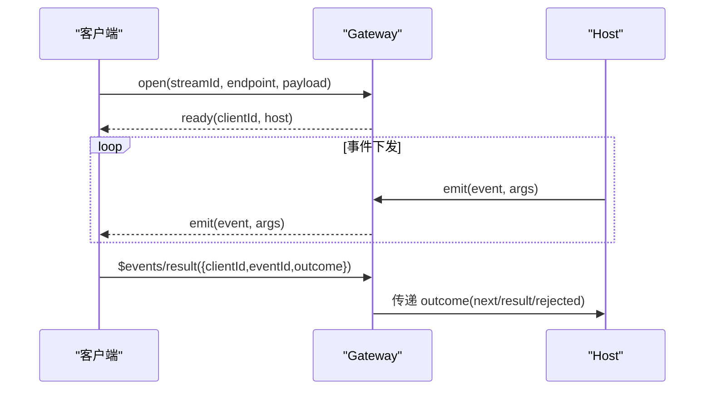
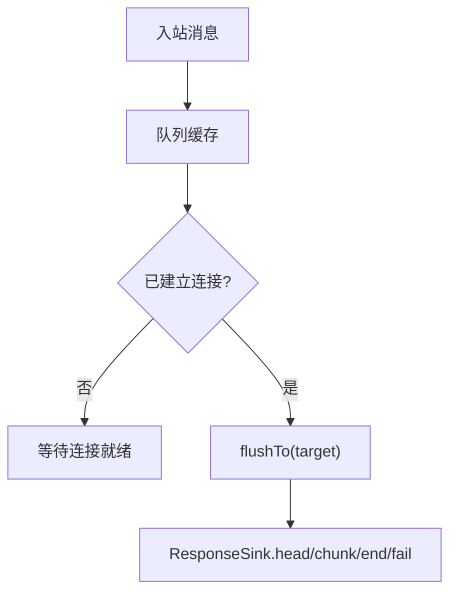
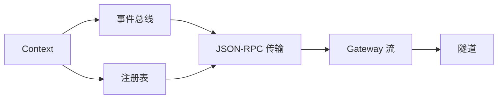

# 通信协议

<cite>
**本文引用的文件**
- [事件文档](file://docs/cordis-api/events.md)
- [服务文档](file://docs/cordis-api/service.md)
- [注册表文档](file://docs/cordis-api/registry.md)
- [Fiber 文档](file://docs/cordis-api/fiber.md)
- [JSON-RPC 传输实现](file://packages/sdk/protocol/src/transport.ts)
- [网关流式协议定义](file://packages/api/gateway/src/stream-protocol.ts)
- [WebWorker 隧道实现](file://packages/experimental/webworker-runtime/src/transport/tunnel.ts)
- [HTTP 路由不变式检查](file://packages/host/webserver/src/invariant.ts)
</cite>

## 目录
1. [简介](#简介)
2. [项目结构](#项目结构)
3. [核心组件](#核心组件)
4. [架构总览](#架构总览)
5. [详细组件分析](#详细组件分析)
6. [依赖关系分析](#依赖关系分析)
7. [性能考量](#性能考量)
8. [故障排查指南](#故障排查指南)
9. [结论](#结论)
10. [附录](#附录)

## 简介
本文件面向 DeepSeek Harness 的插件通信协议，聚焦以下目标：
- 事件驱动架构与消息格式、传输机制
- 事件系统：事件类型、路由规则、订阅机制
- 服务发现与服务注册：接口定义、查找算法、负载均衡
- 异步通信模式：请求-响应、发布-订阅、流式通信
- 代码级示例路径：事件监听、消息发送、服务调用
- 安全机制：消息校验、身份与访问控制（基于上下文与作用域）

## 项目结构
DeepSeek Harness 将“插件生命周期”“事件总线”“服务注册表”“传输层”解耦为独立模块：
- 插件与生命周期：通过 Fiber 管理插件实例的生命周期、配置与清理
- 事件系统：在 Context 上提供 emit/parallel/serial/bail/waterfall 等分发模式
- 服务注册表：以名称暴露能力，支持依赖注入与拦截配置
- 传输层：JSON-RPC 行帧、WebSocket 逻辑流、跨进程隧道

图表来源
- [Fiber 文档:1-120](file://docs/cordis-api/fiber.md#L1-L120)
- [事件文档:8-123](file://docs/cordis-api/events.md#L8-L123)
- [注册表文档:8-56](file://docs/cordis-api/registry.md#L8-L56)
- [JSON-RPC 传输实现:1-120](file://packages/sdk/protocol/src/transport.ts#L1-L120)
- [网关流式协议定义:1-100](file://packages/api/gateway/src/stream-protocol.ts#L1-L100)
- [WebWorker 隧道实现:145-193](file://packages/experimental/webworker-runtime/src/transport/tunnel.ts#L145-L193)

章节来源
- [Fiber 文档:1-120](file://docs/cordis-api/fiber.md#L1-L120)
- [事件文档:8-123](file://docs/cordis-api/events.md#L8-L123)
- [注册表文档:8-56](file://docs/cordis-api/registry.md#L8-L56)
- [JSON-RPC 传输实现:1-120](file://packages/sdk/protocol/src/transport.ts#L1-L120)
- [网关流式协议定义:1-100](file://packages/api/gateway/src/stream-protocol.ts#L1-L100)
- [WebWorker 隧道实现:145-193](file://packages/experimental/webworker-runtime/src/transport/tunnel.ts#L145-L193)

## 核心组件
- 事件系统：提供同步/并发/串行/短路/水帘等多种分发模式，支持全局监听与前置插入
- 服务注册表：以名称暴露 API，支持依赖声明、拦截配置、动态加载与卸载
- Fiber：插件实例容器，负责配置校验、生命周期、效果清理与重启
- 传输层：JSON-RPC 行帧用于请求-响应与通知；WebSocket 逻辑流用于流式数据；隧道用于跨进程/跨环境转发

章节来源
- [事件文档:8-208](file://docs/cordis-api/events.md#L8-L208)
- [服务文档:1-103](file://docs/cordis-api/service.md#L1-L103)
- [注册表文档:8-153](file://docs/cordis-api/registry.md#L8-L153)
- [Fiber 文档:1-376](file://docs/cordis-api/fiber.md#L1-L376)
- [JSON-RPC 传输实现:1-280](file://packages/sdk/protocol/src/transport.ts#L1-L280)
- [网关流式协议定义:1-408](file://packages/api/gateway/src/stream-protocol.ts#L1-L408)
- [WebWorker 隧道实现:145-193](file://packages/experimental/webworker-runtime/src/transport/tunnel.ts#L145-L193)

## 架构总览
插件通过 Context 使用事件与服务。事件可跨进程通过 JSON-RPC 或 WebSocket 传输；服务调用可通过 RPC 或直接对象引用（同进程）。Gateway 提供统一的远程流通道，承载事件结果与业务流。

图表来源
- [事件文档:8-123](file://docs/cordis-api/events.md#L8-L123)
- [JSON-RPC 传输实现:112-173](file://packages/sdk/protocol/src/transport.ts#L112-L173)
- [网关流式协议定义:242-313](file://packages/api/gateway/src/stream-protocol.ts#L242-L313)

## 详细组件分析

### 事件系统与路由
- 事件分发模式
  - emit：同步广播，忽略返回值
  - parallel：并发执行所有监听器，全部完成后 resolve
  - serial：按序等待，遇到第一个“bail”值即停止
  - bail：同步短路，遇到非空/非 false/非 undefined 即停止
  - waterfall：链式包装，最后一个参数为 next，不调用 next 即否决后续
- 订阅机制
  - ctx.on(ctx.once)：在当前 Fiber 下注册监听器，支持 prepend 与 global 选项
  - 事件名由子系统生成并挂载到 Context，具备作用域隔离
- 路由规则
  - 事件名作为路由键，按注册顺序匹配
  - 支持拦截与替换（waterfall），便于权限校验、审计、转换

图表来源
- [事件文档:8-123](file://docs/cordis-api/events.md#L8-L123)
- [事件文档:173-208](file://docs/cordis-api/events.md#L173-L208)

章节来源
- [事件文档:8-208](file://docs/cordis-api/events.md#L8-L208)

### 服务发现与注册
- 服务接口定义
  - Service 基类：以 name 暴露 API，自动随 Fiber 生命周期注册/注销
  - 静态元信息：init/check/config/invoke/extend/tracker/resolveConfig
- 服务查找算法
  - 通过名称在 Context 中解析，支持拦截配置（intercept）
  - 依赖注入：inject 数组或对象形式声明所需服务及拦截配置
- 负载均衡
  - 当前设计为单实例服务（名称唯一）；如需多实例，可在应用层通过命名空间或策略扩展
- 插件生命周期
  - Fiber 管理配置校验、启动、重启、清理；effect 收集资源释放

图表来源
- [服务文档:1-103](file://docs/cordis-api/service.md#L1-L103)
- [注册表文档:8-153](file://docs/cordis-api/registry.md#L8-L153)
- [Fiber 文档:1-376](file://docs/cordis-api/fiber.md#L1-L376)

章节来源
- [服务文档:1-103](file://docs/cordis-api/service.md#L1-L103)
- [注册表文档:8-153](file://docs/cordis-api/registry.md#L8-L153)
- [Fiber 文档:1-376](file://docs/cordis-api/fiber.md#L1-L376)

### 传输层：JSON-RPC 行帧
- 消息格式
  - 请求：包含 id、method、params
  - 响应：包含 id、result 或 error
  - 通知：仅 method，无 id
- 传输机制
  - 基于换行分隔的 JSON 帧，支持 abort 取消、错误映射、方法未找到处理
- 错误语义
  - 方法未找到：-32601
  - 处理器异常：-32603
  - 自定义错误：携带 code/message/data

图表来源
- [JSON-RPC 传输实现:112-173](file://packages/sdk/protocol/src/transport.ts#L112-L173)
- [JSON-RPC 传输实现:201-258](file://packages/sdk/protocol/src/transport.ts#L201-L258)

章节来源
- [JSON-RPC 传输实现:1-280](file://packages/sdk/protocol/src/transport.ts#L1-L280)

### 远程流与事件结果
- 端点与帧
  - 统一 WebSocket 复用路径 /api/remote.mux
  - 内部事件流端点 $events，结果端点 $events/result
  - 客户端消息：open/cancel；服务端消息：item/error/end
- 事件结果
  - 客户端对每个 Host 下发的 waterfall 请求返回 next/result/rejected
  - 错误规范化为 name/message/code/details 的 JSON 安全结构
- 流式通信
  - 支持 item 流式推送、end 结束、error 失败传播

图表来源
- [网关流式协议定义:1-100](file://packages/api/gateway/src/stream-protocol.ts#L1-L100)
- [网关流式协议定义:242-313](file://packages/api/gateway/src/stream-protocol.ts#L242-L313)

章节来源
- [网关流式协议定义:1-408](file://packages/api/gateway/src/stream-protocol.ts#L1-L408)

### 跨进程/跨环境隧道
- 角色
  - TunnelServer：接收消息、维护请求队列、转发至真实 sink
  - ResponseSink：head/chunk/end/fail 四态输出
- 特性
  - 记录早期调用并在连接就绪后 flush
  - 支持 unary API 与直接通道两种 lane
  - 维护 in-flight 请求映射，支持超时/关闭时清理

图表来源
- [WebWorker 隧道实现:145-193](file://packages/experimental/webworker-runtime/src/transport/tunnel.ts#L145-L193)

章节来源
- [WebWorker 隧道实现:145-193](file://packages/experimental/webworker-runtime/src/transport/tunnel.ts#L145-L193)

### 代码级示例路径
- 事件监听与触发
  - 参考：[事件文档:125-187](file://docs/cordis-api/events.md#L125-L187)
- 消息发送（JSON-RPC）
  - 参考：[JSON-RPC 传输实现:112-173](file://packages/sdk/protocol/src/transport.ts#L112-L173)
- 服务调用（依赖注入）
  - 参考：[注册表文档:8-56](file://docs/cordis-api/registry.md#L8-L56)
- 流式通信（Gateway）
  - 参考：[网关流式协议定义:242-313](file://packages/api/gateway/src/stream-protocol.ts#L242-L313)

章节来源
- [事件文档:125-187](file://docs/cordis-api/events.md#L125-L187)
- [JSON-RPC 传输实现:112-173](file://packages/sdk/protocol/src/transport.ts#L112-L173)
- [注册表文档:8-56](file://docs/cordis-api/registry.md#L8-L56)
- [网关流式协议定义:242-313](file://packages/api/gateway/src/stream-protocol.ts#L242-L313)

## 依赖关系分析
- 低耦合
  - 事件与传输解耦：事件不关心底层是本地还是远程
  - 服务与生命周期解耦：Fiber 负责装载/卸载，服务只关注自身职责
- 直接依赖
  - Context 依赖事件总线与服务注册表
  - 传输层依赖标准流（Readable/Writable）或 WebSocket
- 间接依赖
  - Gateway 聚合事件流与 RPC 结果通道
  - 隧道封装上层协议细节，屏蔽连接建立过程

图表来源
- [事件文档:8-123](file://docs/cordis-api/events.md#L8-L123)
- [注册表文档:8-56](file://docs/cordis-api/registry.md#L8-L56)
- [JSON-RPC 传输实现:1-120](file://packages/sdk/protocol/src/transport.ts#L1-L120)
- [网关流式协议定义:1-100](file://packages/api/gateway/src/stream-protocol.ts#L1-L100)
- [WebWorker 隧道实现:145-193](file://packages/experimental/webworker-runtime/src/transport/tunnel.ts#L145-L193)

章节来源
- [事件文档:8-123](file://docs/cordis-api/events.md#L8-L123)
- [注册表文档:8-56](file://docs/cordis-api/registry.md#L8-L56)
- [JSON-RPC 传输实现:1-120](file://packages/sdk/protocol/src/transport.ts#L1-L120)
- [网关流式协议定义:1-100](file://packages/api/gateway/src/stream-protocol.ts#L1-L100)
- [WebWorker 隧道实现:145-193](file://packages/experimental/webworker-runtime/src/transport/tunnel.ts#L145-L193)

## 性能考量
- 事件分发
  - parallel 适合高吞吐但需避免阻塞监听器
  - serial/bail 适合需要顺序控制或短路决策的场景
- 传输层
  - JSON-RPC 行帧简单高效，注意背压与批量 flush
  - 远程流适合大体积/长连接场景，注意错误与取消传播
- 生命周期
  - Fiber 的 effect 确保资源有序释放，避免内存泄漏
  - update/restart 支持热更新，注意幂等与状态一致性

## 故障排查指南
- 常见错误
  - 方法未找到：-32601，检查服务端是否安装对应处理器
  - 处理器异常：-32603，检查业务逻辑抛出的错误
  - 输入关闭：pending 请求被拒绝，检查连接稳定性
- 路由与生命周期
  - HTTP 路由与 Fiber 生命周期必须对称，卸载后应移除路由，否则会出现残留路由
  - 通过不变式检查在 fiber 销毁时探测 register/dispose 对称性

章节来源
- [JSON-RPC 传输实现:201-258](file://packages/sdk/protocol/src/transport.ts#L201-L258)
- [HTTP 路由不变式检查:17-41](file://packages/host/webserver/src/invariant.ts#L17-L41)

## 结论
DeepSeek Harness 的插件通信协议以事件驱动为核心，结合 JSON-RPC 与 WebSocket 流式传输，实现了跨进程、跨环境的可靠通信。通过 Fiber 管理插件生命周期、注册表管理服务发现、事件总线提供灵活的分发模式，整体架构清晰、可扩展且易于调试。建议在开发中遵循：
- 明确事件边界与分发模式
- 使用 JSON-RPC 进行跨进程请求-响应
- 使用 Gateway 流进行长连接与大数据量传输
- 利用 Fiber effect 保证资源清理与一致性

## 附录
- 术语
  - Fiber：插件运行实例，管理生命周期与效果
  - Context：插件运行上下文，提供事件与服务访问
  - 注册表：服务发现与依赖注入的核心
  - 传输层：JSON-RPC 行帧与 WebSocket 流
- 最佳实践
  - 事件监听器保持轻量，避免阻塞
  - 远程流务必处理 cancel 与 error
  - 服务实现保持幂等，便于重试与恢复