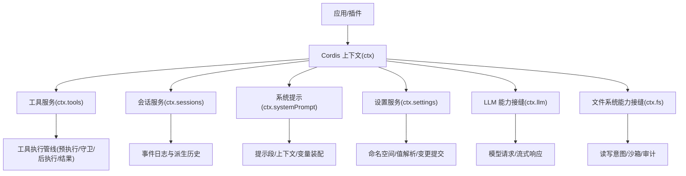
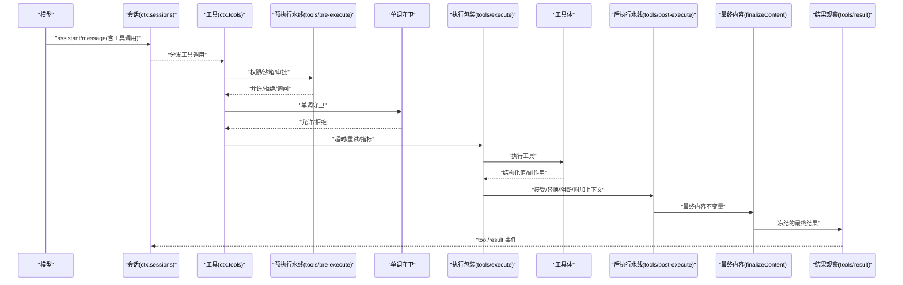
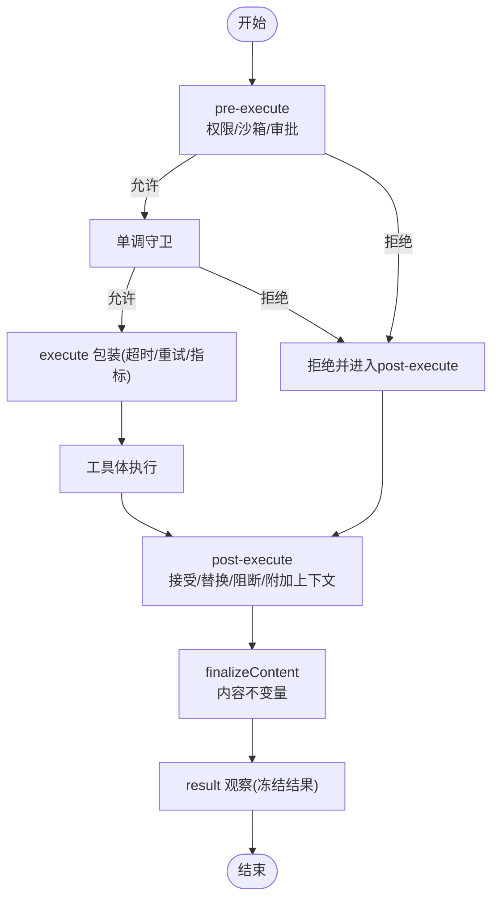
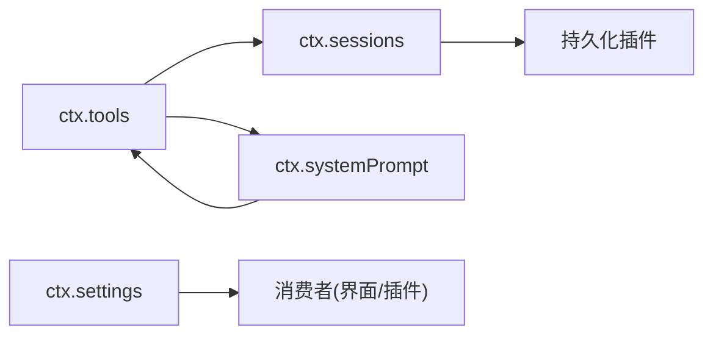

# 上下文服务详解

<cite>
**本文引用的文件**
- [context.md](file://docs/cordis-api/context.md)
- [tools.md](file://docs/subsystems/tools.md)
- [tool-execution-pipeline.md](file://docs/tool-execution-pipeline.md)
- [session.md](file://docs/subsystems/session.md)
- [system-prompt.md](file://docs/subsystems/system-prompt.md)
- [settings.md](file://docs/subsystems/settings.md)
</cite>

## 目录
1. [简介](#简介)
2. [项目结构](#项目结构)
3. [核心组件](#核心组件)
4. [架构总览](#架构总览)
5. [详细组件分析](#详细组件分析)
6. [依赖关系分析](#依赖关系分析)
7. [性能考虑](#性能考虑)
8. [故障排查指南](#故障排查指南)
9. [结论](#结论)
10. [附录](#附录)

## 简介
本文件面向 DeepSeek Harness 的“上下文服务系统”，聚焦于 ctx 对象中各服务的职责、API 与使用方式，并解释能力接缝（如 LLM、文件系统、设置）如何与核心服务协作。重点覆盖：
- 核心服务：ctx.sessions、ctx.tools、ctx.systemPrompt
- 能力接缝服务：ctx.llm、ctx.fs、ctx.settings
- 工具执行管道中的权限检查、沙箱隔离、执行结果处理
- 调用顺序、错误处理、超时控制与资源清理
- 性能优化建议与调试技巧

## 项目结构
围绕上下文服务的相关文档与实现主要分布在以下位置：
- Cordis 上下文与反射机制：docs/cordis-api/context.md
- 工具注册与执行管线：docs/subsystems/tools.md、docs/tool-execution-pipeline.md
- 会话事件与持久化契约：docs/subsystems/session.md
- 系统提示组装：docs/subsystems/system-prompt.md
- 用户设置服务：docs/subsystems/settings.md

图表来源
- [context.md:1-163](file://docs/cordis-api/context.md#L1-L163)
- [tools.md:478-574](file://docs/subsystems/tools.md#L478-L574)
- [session.md:738-800](file://docs/subsystems/session.md#L738-L800)
- [system-prompt.md:95-159](file://docs/subsystems/system-prompt.md#L95-L159)
- [settings.md:176-259](file://docs/subsystems/settings.md#L176-L259)

章节来源
- [context.md:1-163](file://docs/cordis-api/context.md#L1-L163)
- [tools.md:478-574](file://docs/subsystems/tools.md#L478-L574)
- [session.md:738-800](file://docs/subsystems/session.md#L738-L800)
- [system-prompt.md:95-159](file://docs/subsystems/system-prompt.md#L95-L159)
- [settings.md:176-259](file://docs/subsystems/settings.md#L176-L259)

## 核心组件
- ctx.sessions：会话存储与会话生命周期管理，提供创建、准备、进入、列举、搜索、分页、跟随等能力；以事件溯源的方式维护不可变日志，并派生模型可见的消息历史。
- ctx.tools：工具注册表与执行管线，负责工具声明、可见性过滤、权限与沙箱前置策略、守卫、超时/重试包装、后置结果改写、最终结果观察与 UI 呈现。
- ctx.systemPrompt：系统提示装配器，聚合段落、动态上下文、工具模式与变量，按序合并并通过装配水线进行专家级干预。
- ctx.settings：用户设置抽象服务，提供命名空间注册、值解析、变更提交、描述与远程控制器接口，支持路径级编辑与冲突检测。
- ctx.llm、ctx.fs：能力接缝，分别对接模型调用与文件系统访问，通常通过工具或会话流程间接被调用，并在管线中受权限与沙箱约束。

章节来源
- [session.md:738-800](file://docs/subsystems/session.md#L738-L800)
- [tools.md:478-574](file://docs/subsystems/tools.md#L478-L574)
- [system-prompt.md:95-159](file://docs/subsystems/system-prompt.md#L95-L159)
- [settings.md:176-259](file://docs/subsystems/settings.md#L176-L259)

## 架构总览
下图展示从模型消息到工具执行、再到会话记录与提示装配的整体数据流与控制流。

图表来源
- [tool-execution-pipeline.md:8-60](file://docs/tool-execution-pipeline.md#L8-L60)
- [tools.md:170-173](file://docs/subsystems/tools.md#L170-L173)
- [tools.md:555-570](file://docs/subsystems/tools.md#L555-L570)
- [session.md:70-92](file://docs/subsystems/session.md#L70-L92)

## 详细组件分析

### 上下文与反射（ctx.extend/isolate/intercept/get/set/provide/accessor/mixin）
- ctx.extend：创建携带额外元数据的子上下文，不修改父上下文。
- ctx.isolate：为指定服务名创建独立作用域的子上下文，便于在同一进程中切换实现。
- ctx.intercept：为特定服务注入拦截配置，供其下游插件合并使用。
- ctx.get/set/provide/accessor/mixin：反射层 API，用于读取、写入、提供、计算属性与快捷混入。

使用要点
- 在插件加载或 Agent 启动时，通过 isolate 将关键服务（如工具、LLM、FS）隔离到不同作用域，避免全局污染。
- 通过 intercept 为某服务注入运行时策略（例如沙箱策略、权限策略）。
- 使用 provide 在 fiber 生命周期内提供临时实现，卸载时自动回收。

章节来源
- [context.md:14-96](file://docs/cordis-api/context.md#L14-L96)
- [context.md:237-365](file://docs/cordis-api/context.md#L237-L365)

### 工具服务（ctx.tools）与执行管线
- 注册与可见性：register、restrict、schemas、get、presentAs
- 执行入口：execute(exec) 经过 pre-execute → 单调守卫 → execute 包装 → post-execute → finalizeContent → result 观察
- 事件与水线：tools/change、tools/pre-execute、tools/execute、tools/post-execute、tools/ptc-dispatch-log、tools/result
- 并发与超时：isConcurrencySafe、timeoutMs、executionMode

典型调用顺序
1) 构造 ToolExecutionInput（包含 name、arguments、signal、可选 parent/rootCallId）
2) 预执行水线：权限检查、沙箱准入、审批询问
3) 单调守卫：最终否决权
4) 执行包装：超时、重试、指标
5) 工具体：业务逻辑与副作用
6) 后执行水线：接受/替换/阻断/附加上下文
7) 定义级 finalizeContent：内容不变量
8) tools/result：冻结的最终结果观察

图表来源
- [tool-execution-pipeline.md:8-60](file://docs/tool-execution-pipeline.md#L8-L60)
- [tools.md:170-173](file://docs/subsystems/tools.md#L170-L173)
- [tools.md:555-570](file://docs/subsystems/tools.md#L555-L570)

章节来源
- [tools.md:9-97](file://docs/subsystems/tools.md#L9-L97)
- [tools.md:153-173](file://docs/subsystems/tools.md#L153-L173)
- [tools.md:478-574](file://docs/subsystems/tools.md#L478-L574)
- [tools.md:576-720](file://docs/subsystems/tools.md#L576-L720)
- [tool-execution-pipeline.md:8-60](file://docs/tool-execution-pipeline.md#L8-L60)

### 会话服务（ctx.sessions）
- 会话创建与生命周期：create、prepare、enter、announce
- 查询与操作：list、search、page、follow、control、prompt、cancel、fork、rename、selectModel、modelCatalog、attachment、openWorkspacePath
- 事件与派生：append、deriveMessages、surface 投影、request/header、request/context

关键点
- 会话是追加型事件日志，消息历史由事件派生，保证可重放与一致性。
- 所有 event.data 必须可 JSON 序列化，确保持久化与回放一致。
- 通过 follow/control 等流式接口实现实时同步与远端控制。

章节来源
- [session.md:1-132](file://docs/subsystems/session.md#L1-L132)
- [session.md:136-176](file://docs/subsystems/session.md#L136-L176)
- [session.md:332-492](file://docs/subsystems/session.md#L332-L492)
- [session.md:505-578](file://docs/subsystems/session.md#L505-L578)
- [session.md:594-732](file://docs/subsystems/session.md#L594-L732)

### 系统提示（ctx.systemPrompt）
- 注册：section、context、tools、variable
- 装配：assemble(context) 聚合段落、上下文、工具模式与变量，运行装配水线，必要时强制 complete 段落
- 事件：system-prompt/assemble（水线）、system-prompt/change（变更通知）

使用场景
- 在每次模型步骤前装配系统提示，注入当前工作目录、规则、工具模式与动态上下文。
- 通过 suppressRuntimeContext 抑制动态上下文贡献，满足特殊场景需求。

章节来源
- [system-prompt.md:9-85](file://docs/subsystems/system-prompt.md#L9-L85)
- [system-prompt.md:95-159](file://docs/subsystems/system-prompt.md#L95-L159)
- [system-prompt.md:161-207](file://docs/subsystems/system-prompt.md#L161-L207)

### 设置服务（ctx.settings）
- 命名空间注册：register(ns, schema, options)
- 值解析与观察：get、watch、describe
- 变更提交：update、replace、mutate（路径级编辑）
- 控制器：ctx.settingsController 暴露远程描述与写操作

关键点
- 值解析顺序：schema 默认值 → 组合层 base → 用户层
- 变更提交串行化，冲突检测基于 revision
- 远程接口强制脱敏（redactSecrets），保障安全

章节来源
- [settings.md:9-59](file://docs/subsystems/settings.md#L9-L59)
- [settings.md:61-94](file://docs/subsystems/settings.md#L61-L94)
- [settings.md:96-153](file://docs/subsystems/settings.md#L96-L153)
- [settings.md:155-168](file://docs/subsystems/settings.md#L155-L168)
- [settings.md:176-259](file://docs/subsystems/settings.md#L176-L259)
- [settings.md:261-332](file://docs/subsystems/settings.md#L261-L332)
- [settings.md:334-387](file://docs/subsystems/settings.md#L334-L387)

### 能力接缝（ctx.llm、ctx.fs）
- ctx.llm：模型调用与流式响应，通常在会话循环中被驱动，结合 systemPrompt 与 tools 提供的 schemas 生成请求。
- ctx.fs：文件系统访问，通常通过工具（如 bash、文件读写）触发，并在工具执行管线中受 fs/write-intent 或 fs/edit-intent 等守卫约束，确保仅允许工具侧的文件变更。

注意
- 这些能力通常不直接由插件随意调用，而是通过工具与会话流程统一接入，以获得一致的权限、审计与沙箱保护。

章节来源
- [tool-execution-pipeline.md:19-20](file://docs/tool-execution-pipeline.md#L19-L20)
- [tools.md:555-570](file://docs/subsystems/tools.md#L555-L570)

## 依赖关系分析
- ctx.tools 依赖 ctx.sessions 记录 tool/call 与 tool/result 事件，并可能通过 systemPrompt 获取当前可见的工具模式。
- ctx.systemPrompt 依赖 ctx.tools.schemas() 获取当前作用域可见的工具模式，参与提示装配。
- ctx.sessions 作为事件源，被 persistence 插件订阅以实现持久化；同时被 UI 与遥测消费。
- ctx.settings 通过 provider 推送外部变更，消费者通过 watch 观察变化。

图表来源
- [tools.md:576-720](file://docs/subsystems/tools.md#L576-L720)
- [session.md:574-578](file://docs/subsystems/session.md#L574-L578)
- [system-prompt.md:128-159](file://docs/subsystems/system-prompt.md#L128-L159)
- [settings.md:155-168](file://docs/subsystems/settings.md#L155-L168)

章节来源
- [tools.md:576-720](file://docs/subsystems/tools.md#L576-L720)
- [session.md:574-578](file://docs/subsystems/session.md#L574-L578)
- [system-prompt.md:128-159](file://docs/subsystems/system-prompt.md#L128-L159)
- [settings.md:155-168](file://docs/subsystems/settings.md#L155-L168)

## 性能考虑
- 工具并发与独占：根据 isConcurrencySafe 与 executionMode 决定并行或独占执行，减少竞争与锁开销。
- 超时与取消：为工具声明 timeoutMs，并在 execute 包装中统一处理；工具体需监听 exec.signal 并及时退让。
- 结果规范化与冻结：registry 对候选结果进行快照与验证，避免后续重复计算；冻结结果降低拷贝成本。
- 会话事件批量与流式：使用 follow/control 流式接口减少轮询；持久化插件异步缓冲，避免阻塞热路径。
- 提示装配缓存：systemPrompt 的 assemble 仅在必要时重新计算，避免频繁重组。

[本节为通用指导，无需具体文件引用]

## 故障排查指南
- 工具调用失败：检查 pre-execute 是否拒绝、守卫是否返回拒绝原因、execute 包装是否抛出异常、post-execute 是否阻断。
- 超时与取消：确认工具体是否正确转发 exec.signal；若未正确终止，可能导致资源泄漏。
- 权限与沙箱：查看 fs/* 事件与工具 FS 守卫，确认读写意图是否被允许。
- 设置冲突：当 update/replace/mutate 报冲突时，检查 expectedRevision 是否过期，重新读取最新 descriptor 后再写。
- 会话不一致：核对 tool/call 与 tool/result 是否成对出现；检查 surfaceOp 与 sourceEventSeqs 是否符合约定。

章节来源
- [tools.md:170-173](file://docs/subsystems/tools.md#L170-L173)
- [tools.md:555-570](file://docs/subsystems/tools.md#L555-L570)
- [tool-execution-pipeline.md:8-60](file://docs/tool-execution-pipeline.md#L8-L60)
- [settings.md:220-259](file://docs/subsystems/settings.md#L220-L259)
- [session.md:70-92](file://docs/subsystems/session.md#L70-L92)

## 结论
DeepSeek Harness 的上下文服务以 Cordis 上下文为核心，通过 ctx.sessions、ctx.tools、ctx.systemPrompt、ctx.settings 以及能力接缝 ctx.llm、ctx.fs 协同工作。工具执行管线提供了统一的权限、沙箱、超时与结果处理能力；会话事件保证了可重放与一致性；系统提示装配确保模型输入的可控与可观测；设置服务提供安全的配置管理与变更传播。遵循本文档的调用顺序与最佳实践，可在复杂场景中构建稳定、可观测且高性能的 Agent 系统。

## 附录
- 示例用法（以路径引用代替代码片段）
  - 工具执行入口与参数：参见 [工具执行入口:555-570](file://docs/subsystems/tools.md#L555-L570)
  - 预执行/守卫/后执行/结果观察：参见 [工具执行管线:8-60](file://docs/tool-execution-pipeline.md#L8-L60)
  - 会话创建与进入：参见 [会话服务 API:738-800](file://docs/subsystems/session.md#L738-L800)
  - 系统提示装配：参见 [系统提示服务:95-159](file://docs/subsystems/system-prompt.md#L95-L159)
  - 设置注册与更新：参见 [设置服务 API:176-259](file://docs/subsystems/settings.md#L176-L259)

[本节为参考索引，无需具体文件引用]