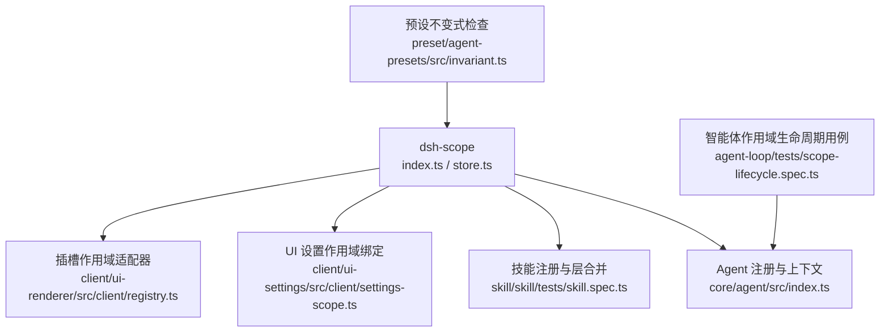
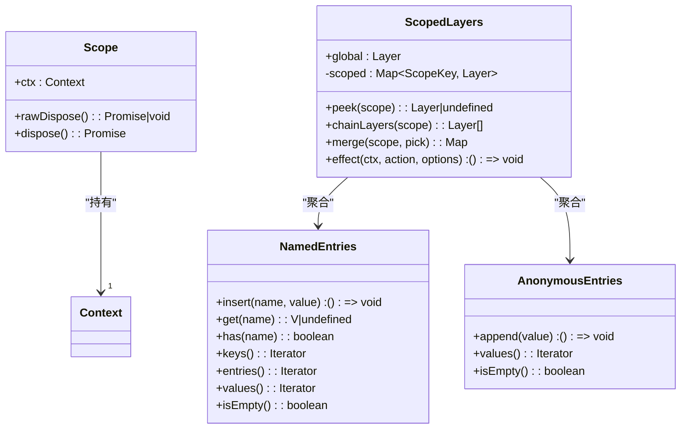
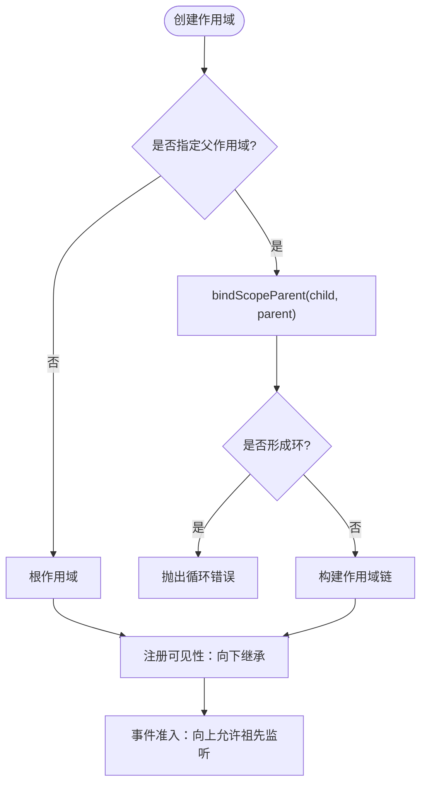
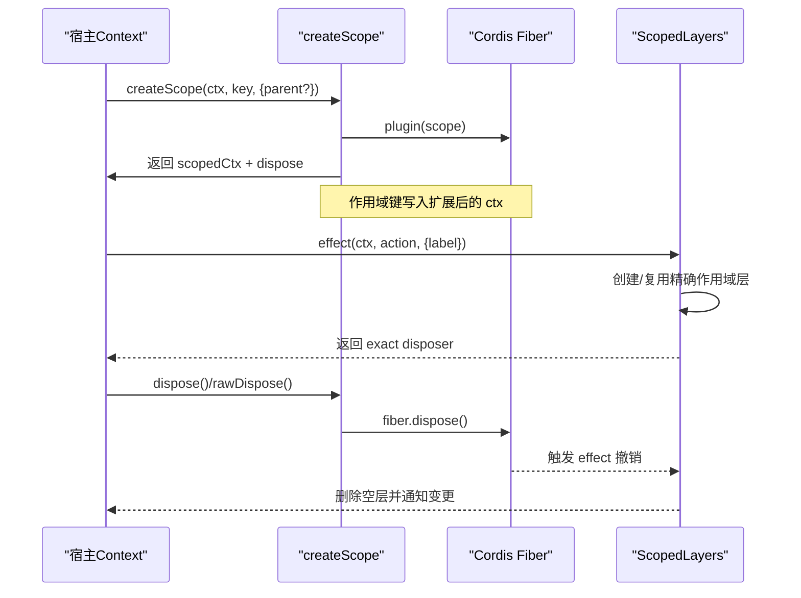
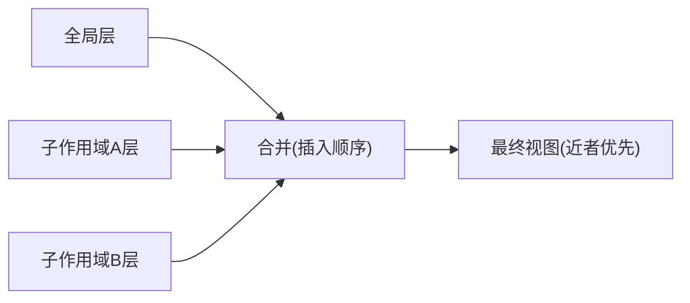
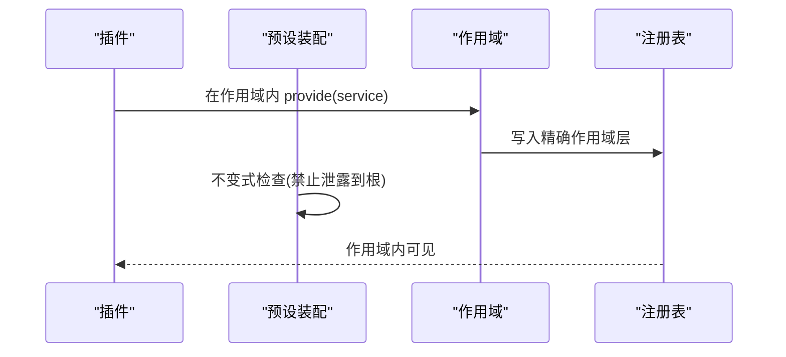
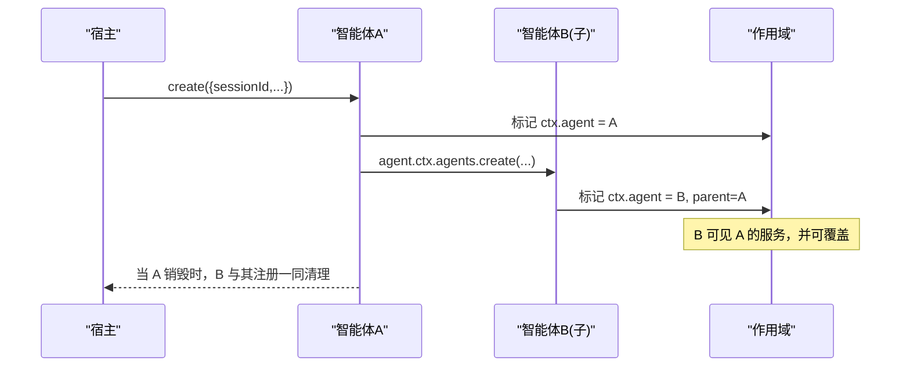
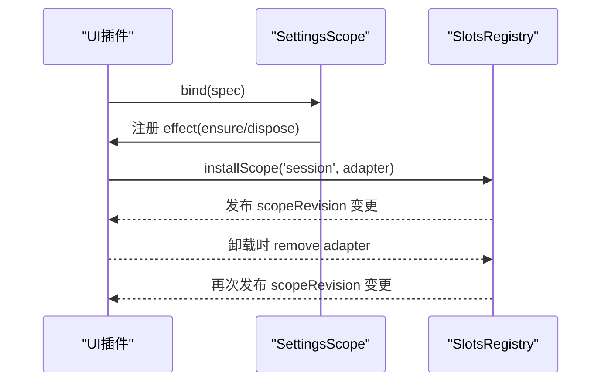
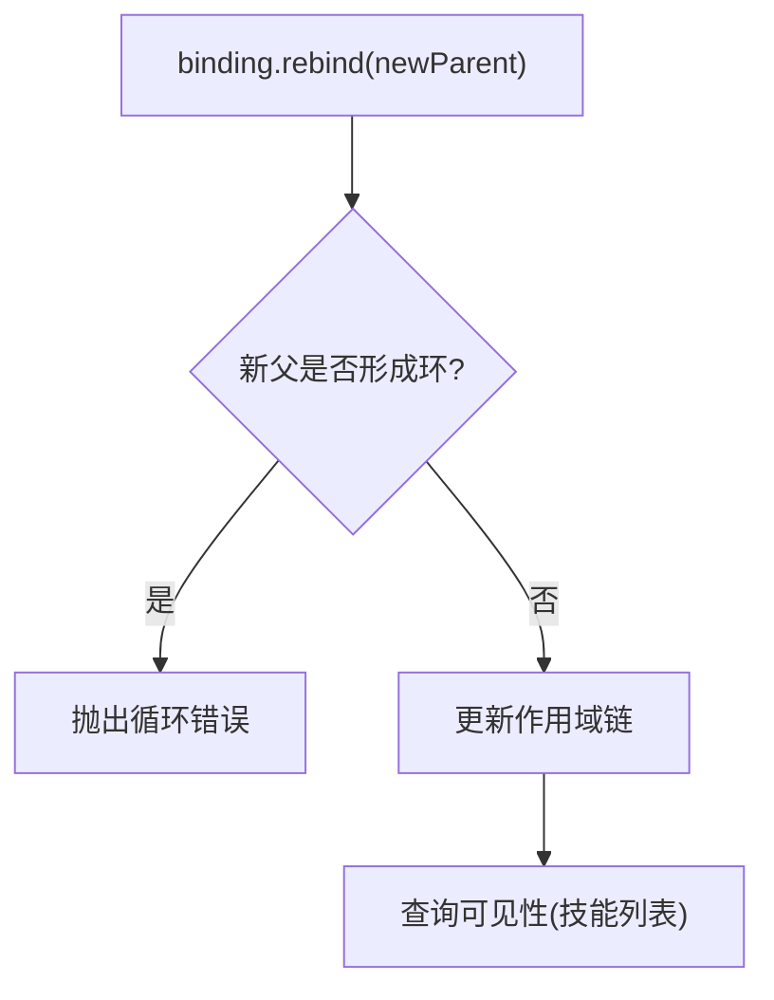
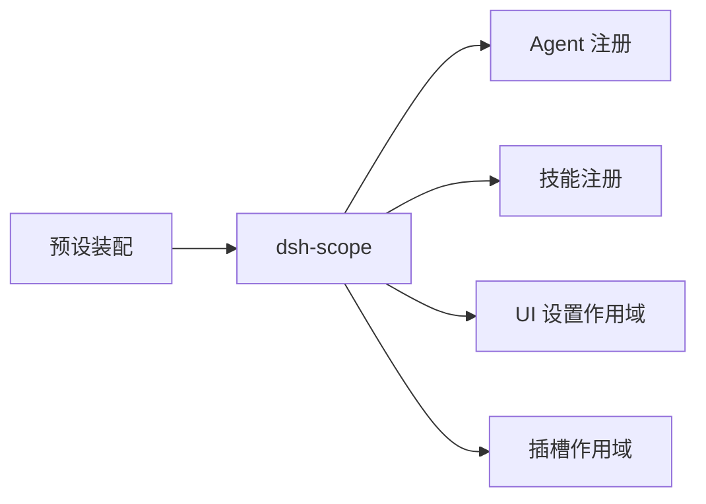

# 作用域隔离机制

<cite>
**本文引用的文件**
- [packages/core/scope/src/index.ts](file://packages/core/scope/src/index.ts)
- [packages/core/scope/src/store.ts](file://packages/core/scope/src/store.ts)
- [packages/core/scope/README.md](file://packages/core/scope/README.md)
- [docs/subsystems/scope.md](file://docs/subsystems/scope.md)
- [packages/core/agent-loop/tests/scope-lifecycle.spec.ts](file://packages/core/agent-loop/tests/scope-lifecycle.spec.ts)
- [packages/core/scope/tests/scope.spec.ts](file://packages/core/scope/tests/scope.spec.ts)
- [packages/preset/agent-presets/src/invariant.ts](file://packages/preset/agent-presets/src/invariant.ts)
- [packages/preset/agent-presets/tests/fixtures/plugins/global-service.js](file://packages/preset/agent-presets/tests/fixtures/plugins/global-service.js)
- [packages/preset/agent-presets/tests/fixtures/user/isolated/agent.cordis.yml](file://packages/preset/agent-presets/tests/fixtures/user/isolated/agent.cordis.yml)
- [packages/client/ui-settings/src/client/settings-scope.ts](file://packages/client/ui-settings/src/client/settings-scope.ts)
- [packages/client/ui-renderer/src/client/registry.ts](file://packages/client/ui-renderer/src/client/registry.ts)
- [packages/client/ui-renderer/tests/registry.client.spec.ts](file://packages/client/ui-renderer/tests/registry.client.spec.ts)
- [packages/core/agent/src/index.ts](file://packages/core/agent/src/index.ts)
- [packages/skill/skill/tests/skill.spec.ts](file://packages/skill/skill/tests/skill.spec.ts)
</cite>

## 目录
1. [简介](#简介)
2. [项目结构](#项目结构)
3. [核心组件](#核心组件)
4. [架构总览](#架构总览)
5. [详细组件分析](#详细组件分析)
6. [依赖关系分析](#依赖关系分析)
7. [性能考量](#性能考量)
8. [故障排查指南](#故障排查指南)
9. [结论](#结论)
10. [附录：最佳实践与常见陷阱](#附录：最佳实践与常见陷阱)

## 简介
本文件系统性阐述 DeepSeek Harness 的作用域（Scope）隔离机制，覆盖根作用域、智能体作用域与子作用域的层次结构；作用域的生命周期管理（创建、继承、合并、销毁）；不同作用域间的服务隔离策略（可见性、数据隔离、资源限制）；以及作用域在插件系统中的应用（插件绑定与作用域、服务暴露）。文末提供代码级示例路径、流程图与时序图，帮助读者快速理解并正确使用。

## 项目结构
作用域能力由核心包 dsh-scope 提供，并在智能体、技能注册、UI 设置等子系统消费。关键位置如下：
- 核心实现：packages/core/scope/src/index.ts、packages/core/scope/src/store.ts
- 文档与类型契约：docs/subsystems/scope.md、packages/core/scope/README.md
- 智能体生命周期与使用：packages/core/agent-loop/tests/scope-lifecycle.spec.ts、packages/core/agent/src/index.ts
- 插件与服务隔离约束：packages/preset/agent-presets/src/invariant.ts、测试夹具 global-service.js、agent.cordis.yml
- UI 侧作用域适配与变更通知：packages/client/ui-settings/src/client/settings-scope.ts、packages/client/ui-renderer/src/client/registry.ts、tests/registry.client.spec.ts
- 作用域链重绑与可见性验证：packages/skill/skill/tests/skill.spec.ts

**图表来源**
- [packages/core/scope/src/index.ts:129-156](file://packages/core/scope/src/index.ts#L129-L156)
- [packages/core/scope/src/store.ts:159-268](file://packages/core/scope/src/store.ts#L159-L268)
- [packages/core/agent/src/index.ts:450-473](file://packages/core/agent/src/index.ts#L450-L473)
- [packages/skill/skill/tests/skill.spec.ts:1172-1210](file://packages/skill/skill/tests/skill.spec.ts#L1172-L1210)
- [packages/client/ui-settings/src/client/settings-scope.ts:274-302](file://packages/client/ui-settings/src/client/settings-scope.ts#L274-L302)
- [packages/client/ui-renderer/src/client/registry.ts:121-155](file://packages/client/ui-renderer/src/client/registry.ts#L121-L155)
- [packages/preset/agent-presets/src/invariant.ts:24-44](file://packages/preset/agent-presets/src/invariant.ts#L24-L44)
- [packages/core/agent-loop/tests/scope-lifecycle.spec.ts:143-194](file://packages/core/agent-loop/tests/scope-lifecycle.spec.ts#L143-L194)

**章节来源**
- [packages/core/scope/src/index.ts:129-156](file://packages/core/scope/src/index.ts#L129-L156)
- [packages/core/scope/src/store.ts:159-268](file://packages/core/scope/src/store.ts#L159-L268)
- [docs/subsystems/scope.md:1-60](file://docs/subsystems/scope.md#L1-L60)

## 核心组件
- ScopeKey：不透明对象标识，用于路由与分层。
- createScope(ctx, key, options)：在当前上下文中“铸造”一个带标签的 Context，并通过 Cordis Fiber 管理其精确/共享销毁边界。
- scopeOf(ctx)：读取当前上下文最近的作用域键。
- scopeTarget(base, key)：为事件分发构造仅路由的载体，支持按作用域链向上准入（祖先可接收后代事件），但不向下传播。
- bindScopeParent(key, parent)：将 key 绑定到父作用域，返回唯一可 rebind 的句柄；禁止环状链接。
- ScopedLayers/Layer：维护全局层与精确作用域层，支持链式合并与 effect 所有权绑定。

这些原语共同实现了“注册即可见+随作用域销毁”的一致语义，且事件路由遵循“自下而上”的祖先准入规则。

**章节来源**
- [packages/core/scope/src/index.ts:14-102](file://packages/core/scope/src/index.ts#L14-L102)
- [packages/core/scope/src/index.ts:129-185](file://packages/core/scope/src/index.ts#L129-L185)
- [packages/core/scope/src/store.ts:159-268](file://packages/core/scope/src/store.ts#L159-L268)
- [packages/core/scope/README.md:58-73](file://packages/core/scope/README.md#L58-L73)

## 架构总览
作用域体系围绕“键-父子链-层”三要素组织：
- 键：每个作用域对应一个 ScopeKey。
- 父子链：通过 WeakMap 维护 key→parent，形成从叶子到根的链。
- 层：每个注册表维护一个全局层和若干精确作用域层；读取时沿链合并，写入时归属当前作用域层。

**图表来源**
- [packages/core/scope/src/index.ts:104-147](file://packages/core/scope/src/index.ts#L104-L147)
- [packages/core/scope/src/store.ts:30-150](file://packages/core/scope/src/store.ts#L30-L150)
- [packages/core/scope/src/store.ts:159-268](file://packages/core/scope/src/store.ts#L159-L268)

## 详细组件分析

### 作用域层次结构与继承
- 根作用域：无父键，代表进程/宿主级可见范围。
- 智能体作用域：以 Agent 对象作为 key，拥有独立的注册与事件路由。
- 子作用域：通过 parent 选项或 bindScopeParent 建立父子关系，形成嵌套层次。

继承方向：
- 注册可见性：子作用域能看到父作用域的层（向下继承）。
- 事件准入：监听器若标记为祖先作用域，可接收后代作用域的事件（向上准入），但不会反向。

**图表来源**
- [packages/core/scope/src/index.ts:54-82](file://packages/core/scope/src/index.ts#L54-L82)
- [packages/core/scope/src/index.ts:93-102](file://packages/core/scope/src/index.ts#L93-L102)
- [packages/core/scope/src/index.ts:169-185](file://packages/core/scope/src/index.ts#L169-L185)

**章节来源**
- [packages/core/scope/src/index.ts:54-102](file://packages/core/scope/src/index.ts#L54-L102)
- [packages/core/scope/src/index.ts:169-185](file://packages/core/scope/src/index.ts#L169-L185)
- [packages/core/scope/tests/scope.spec.ts:157-222](file://packages/core/scope/tests/scope.spec.ts#L157-L222)

### 作用域生命周期管理
- 创建：createScope 在给定 ctx 上启动一个空插件 Fiber，并将作用域键注入扩展后的 Context。
- 继承：通过 parent 选项或外部 bindScopeParent 建立父子关系；rebind 仅在原始绑定句柄持有者处可用。
- 合并：ScopedLayers.merge 将全局层与作用域链上的层按插入顺序合并，近者优先覆盖同名项。
- 销毁：scope.dispose 与 rawDispose 提供幂等与有序销毁；ScopedLayers.effect 将撤销逻辑与 Cordis effect 绑定，确保作用域结束时清理其层。

**图表来源**
- [packages/core/scope/src/index.ts:129-147](file://packages/core/scope/src/index.ts#L129-L147)
- [packages/core/scope/src/store.ts:226-268](file://packages/core/scope/src/store.ts#L226-L268)

**章节来源**
- [packages/core/scope/src/index.ts:129-147](file://packages/core/scope/src/index.ts#L129-L147)
- [packages/core/scope/src/store.ts:226-268](file://packages/core/scope/src/store.ts#L226-L268)
- [packages/core/agent-loop/tests/scope-lifecycle.spec.ts:143-194](file://packages/core/agent-loop/tests/scope-lifecycle.spec.ts#L143-L194)

### 服务隔离策略：可见性、数据隔离与资源限制
- 可见性：通过 ScopedLayers.merge 实现“全局 + 作用域链”的叠加，子作用域可覆盖父作用域的同名服务。
- 数据隔离：每个作用域层的条目独立存储，作用域销毁时清空其层，避免跨作用域泄漏。
- 资源限制：作用域本身不是沙箱或权限边界；它路由同进程插件，安全与权限需结合其他机制（如工具调用策略、深度限制等）。

**图表来源**
- [packages/core/scope/src/store.ts:201-217](file://packages/core/scope/src/store.ts#L201-L217)
- [packages/core/scope/README.md:58-73](file://packages/core/scope/README.md#L58-L73)

**章节来源**
- [packages/core/scope/src/store.ts:201-217](file://packages/core/scope/src/store.ts#L201-L217)
- [packages/core/scope/README.md:58-73](file://packages/core/scope/README.md#L58-L73)

### 插件系统中的应用：作用域绑定与服务暴露
- 插件可在特定作用域内注册服务，该服务仅在该作用域及其后代可见。
- 通过 isolate 配置可将服务限定在 entry-local 作用域，避免泄露到根作用域。
- 预设安装时进行不变式检查，防止在服务注册后意外发布到进程全局。

**图表来源**
- [packages/preset/agent-presets/tests/fixtures/plugins/global-service.js:1-5](file://packages/preset/agent-presets/tests/fixtures/plugins/global-service.js#L1-L5)
- [packages/preset/agent-presets/tests/fixtures/user/isolated/agent.cordis.yml:1-9](file://packages/preset/agent-presets/tests/fixtures/user/isolated/agent.cordis.yml#L1-L9)
- [packages/preset/agent-presets/src/invariant.ts:24-44](file://packages/preset/agent-presets/src/invariant.ts#L24-L44)

**章节来源**
- [packages/preset/agent-presets/src/invariant.ts:24-44](file://packages/preset/agent-presets/src/invariant.ts#L24-L44)
- [packages/preset/agent-presets/tests/fixtures/plugins/global-service.js:1-5](file://packages/preset/agent-presets/tests/fixtures/plugins/global-service.js#L1-L5)
- [packages/preset/agent-presets/tests/fixtures/user/isolated/agent.cordis.yml:1-9](file://packages/preset/agent-presets/tests/fixtures/user/isolated/agent.cordis.yml#L1-L9)

### 智能体作用域与子作用域
- 智能体作用域：以 Agent 对象为 key，其 ctx 被标记为该作用域；所有通过 agent.ctx 的注册均属于该作用域。
- 子作用域：智能体可通过自身 ctx.agents.create 创建子智能体，形成父子作用域链；子作用域继承父作用域的可见性，并可覆盖。
- 生命周期：智能体销毁时，其作用域内的注册全部清理，事件监听也一并释放。

**图表来源**
- [packages/core/agent/src/index.ts:450-473](file://packages/core/agent/src/index.ts#L450-L473)
- [packages/core/agent-loop/tests/scope-lifecycle.spec.ts:153-194](file://packages/core/agent-loop/tests/scope-lifecycle.spec.ts#L153-L194)

**章节来源**
- [packages/core/agent/src/index.ts:450-473](file://packages/core/agent/src/index.ts#L450-L473)
- [packages/core/agent-loop/tests/scope-lifecycle.spec.ts:153-194](file://packages/core/agent-loop/tests/scope-lifecycle.spec.ts#L153-L194)

### UI 设置作用域与插槽作用域
- UI 设置作用域：在调用方插件生命周期内绑定命名空间作用域，订阅镜像失效并随插件卸载而释放。
- 插槽作用域：通过 installScope 安装适配器，变更时发布 revision，卸载时移除适配器并恢复状态。

**图表来源**
- [packages/client/ui-settings/src/client/settings-scope.ts:274-302](file://packages/client/ui-settings/src/client/settings-scope.ts#L274-L302)
- [packages/client/ui-renderer/src/client/registry.ts:121-155](file://packages/client/ui-renderer/src/client/registry.ts#L121-L155)
- [packages/client/ui-renderer/tests/registry.client.spec.ts:510-536](file://packages/client/ui-renderer/tests/registry.client.spec.ts#L510-L536)

**章节来源**
- [packages/client/ui-settings/src/client/settings-scope.ts:274-302](file://packages/client/ui-settings/src/client/settings-scope.ts#L274-L302)
- [packages/client/ui-renderer/src/client/registry.ts:121-155](file://packages/client/ui-renderer/src/client/registry.ts#L121-L155)
- [packages/client/ui-renderer/tests/registry.client.spec.ts:510-536](file://packages/client/ui-renderer/tests/registry.client.spec.ts#L510-L536)

### 作用域链重绑与可见性验证
- 通过 bindScopeParent 返回的 binding.rebind 可将同一 key 重新绑定到新父作用域，常用于空白会话重组场景。
- 技能注册测试展示了重绑后，作用域链变化立即影响可见性结果。

**图表来源**
- [packages/core/scope/src/index.ts:72-82](file://packages/core/scope/src/index.ts#L72-L82)
- [packages/skill/skill/tests/skill.spec.ts:1172-1210](file://packages/skill/skill/tests/skill.spec.ts#L1172-L1210)

**章节来源**
- [packages/core/scope/src/index.ts:72-82](file://packages/core/scope/src/index.ts#L72-L82)
- [packages/skill/skill/tests/skill.spec.ts:1172-1210](file://packages/skill/skill/tests/skill.spec.ts#L1172-L1210)

## 依赖关系分析
- dsh-scope 是基础原语，被多个子系统消费：
  - Agent 注册与上下文标记
  - 技能注册与层合并
  - UI 设置与插槽作用域
  - 预设装配与不变式检查
- 耦合点：
  - 通过 Context 扩展与 Cordis Fiber 管理生命周期
  - 通过 WeakMap 维护父子链，避免强引用导致内存泄漏
  - 通过 ScopedLayers 统一注册表层管理与变更通知

**图表来源**
- [packages/core/scope/src/index.ts:129-185](file://packages/core/scope/src/index.ts#L129-L185)
- [packages/core/agent/src/index.ts:450-473](file://packages/core/agent/src/index.ts#L450-L473)
- [packages/skill/skill/tests/skill.spec.ts:1172-1210](file://packages/skill/skill/tests/skill.spec.ts#L1172-L1210)
- [packages/client/ui-settings/src/client/settings-scope.ts:274-302](file://packages/client/ui-settings/src/client/settings-scope.ts#L274-L302)
- [packages/client/ui-renderer/src/client/registry.ts:121-155](file://packages/client/ui-renderer/src/client/registry.ts#L121-L155)
- [packages/preset/agent-presets/src/invariant.ts:24-44](file://packages/preset/agent-presets/src/invariant.ts#L24-L44)

**章节来源**
- [packages/core/scope/src/index.ts:129-185](file://packages/core/scope/src/index.ts#L129-L185)
- [packages/core/agent/src/index.ts:450-473](file://packages/core/agent/src/index.ts#L450-L473)
- [packages/skill/skill/tests/skill.spec.ts:1172-1210](file://packages/skill/skill/tests/skill.spec.ts#L1172-L1210)
- [packages/client/ui-settings/src/client/settings-scope.ts:274-302](file://packages/client/ui-settings/src/client/settings-scope.ts#L274-L302)
- [packages/client/ui-renderer/src/client/registry.ts:121-155](file://packages/client/ui-renderer/src/client/registry.ts#L121-L155)
- [packages/preset/agent-presets/src/invariant.ts:24-44](file://packages/preset/agent-presets/src/invariant.ts#L24-L44)

## 性能考量
- 作用域链遍历：scopeChainOf 与事件过滤沿父链向上查找，复杂度与链长线性相关；建议保持合理的层级深度。
- 层合并：ScopedLayers.merge 按插入顺序合并，近者优先；频繁合并可能带来开销，应尽量减少同名覆盖频率。
- 作用域销毁：ScopedLayers.effect 在撤销时检测空层并删除，避免无用状态累积。
- 事件路由：scopeTarget 保留基础过滤器，避免重复计算；全局监听仍保持高效。

[本节为通用指导，无需具体文件引用]

## 故障排查指南
- 循环绑定错误：尝试将子作用域设为其祖先的父时会抛出循环错误。检查 bindScopeParent 与 rebind 的使用。
- 作用域已绑定：对已有父作用域的 key 再次绑定会报错；请使用原始 binding.rebind 进行重绑。
- 作用域未生效：确认 createScope 的 ctx 是否正确传递，以及 scopeOf 读取的是最近的作用域键。
- 服务泄露到根：预设装配会检查是否意外发布到进程全局；若失败，请确保服务位于 isolate 作用域或宿主组合中。
- 事件未到达预期监听器：scopeTarget 仅允许祖先监听后代事件；确认监听器标记的作用域是否在事件键的祖先链上。

**章节来源**
- [packages/core/scope/src/index.ts:54-82](file://packages/core/scope/src/index.ts#L54-L82)
- [packages/core/scope/src/index.ts:169-185](file://packages/core/scope/src/index.ts#L169-L185)
- [packages/preset/agent-presets/src/invariant.ts:24-44](file://packages/preset/agent-presets/src/invariant.ts#L24-L44)
- [packages/core/scope/tests/scope.spec.ts:157-222](file://packages/core/scope/tests/scope.spec.ts#L157-L222)

## 结论
DeepSeek Harness 的作用域隔离机制通过“键-父子链-层”的统一抽象，提供了清晰的服务可见性与生命周期管理。它在智能体、技能、UI 设置与插槽系统中广泛使用，确保了作用域内注册的隔离与正确销毁。配合预设装配的不变式检查，进一步保障了服务不会意外泄露到进程全局。合理使用 createScope、bindScopeParent、scopeTarget 与 ScopedLayers，可以在复杂系统中实现可靠的作用域隔离。

[本节为总结，无需具体文件引用]

## 附录：最佳实践与常见陷阱
- 最佳实践
  - 使用 createScope 在插件内创建作用域，并通过 ctx.extend 传递作用域键。
  - 通过 parent 选项或 bindScopeParent 建立清晰的父子关系，避免深层嵌套。
  - 使用 scopeTarget 包装事件目标，确保事件路由符合“祖先可接收后代”的规则。
  - 在作用域内注册服务与工具，利用 ScopedLayers 的合并策略实现覆盖与继承。
  - 使用 isolate 配置将服务限定在 entry-local 作用域，避免泄露到根作用域。
- 常见陷阱
  - 误用全局监听：{ global: true } 的监听器会忽略作用域过滤，需谨慎使用。
  - 错误地认为作用域是沙箱：作用域仅路由同进程插件，不提供安全边界。
  - 忘记销毁作用域：未调用 dispose/rawDispose 可能导致资源泄漏。
  - 循环绑定：避免将祖先设为子作用域的父，或使用 rebind 引入环。
  - 过度覆盖：频繁同名覆盖会增加合并成本，建议合理设计服务命名与层级。

[本节为通用指导，无需具体文件引用]